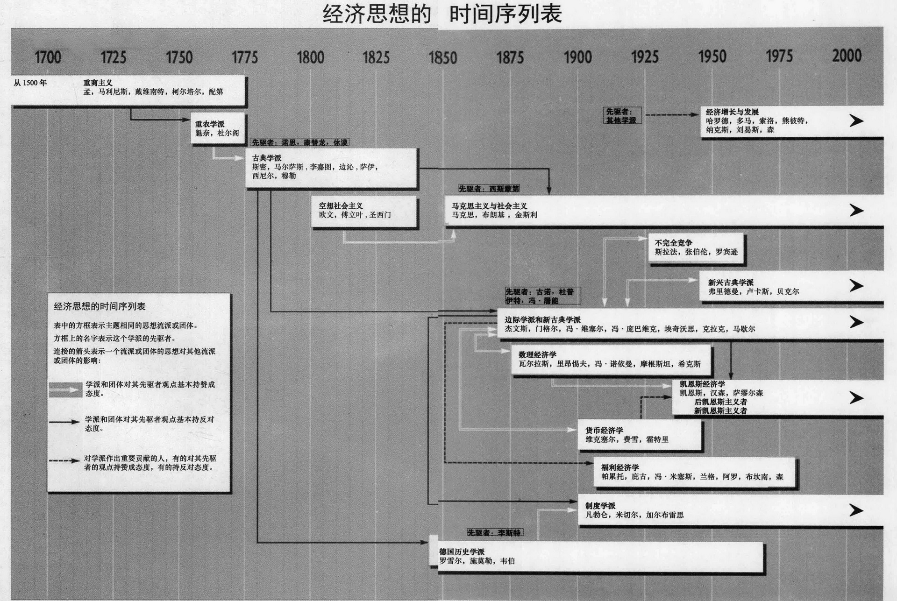

## 经济思想史 (第 8 版)

THE EVOLUTION OF ECONOMIC THOUGHT (8E)

[美] 斯坦利·L. 布鲁 (Stanley L. Brue)  [美] 兰迪·R. 格兰特 (Randy R. Grant) 著

邸晓燕 等译

经济学精选教材译丛

北京大学出版社

---

> 所谓“一切历史都是思想史”。本书是最权威的经济思想史教科书之一，作者按照经济思想发展的时间顺序，介绍了自重商主义时代以来经济学各个重要流派及其代表人物的观点，并且大量引用原著，注重各种思想的碰撞交融，突出历史与现实结合，逻辑分明、语言清晰，为我们提供了一条回顾经济思想发展历程的独特途径，也为我们理解现代经济学提供了一个历史视角。
> 
---

**著作权合同登记号**：图字：01-2014-4172

**图书在版编目 (CIP) 数据**

经济思想史．第 8 版 / （美）布鲁 (Brue, S. L.)，（美）格兰特 (Grant, R. R.) 著；邸晓燕等译．—北京：北京大学出版社，2014.10
（经济学精选教材译丛）
ISBN 978-7-301-24787-7

I. ①经… II. ①布… ②格… ③邸… III. ①经济思想史—西方国家—教材 IV. ①F091

中国版本图书馆 CIP 数据核字 (2014) 第 203387 号

Stanley L. Brue, Randy R. Grant
**The Evolution of Economic Thought, 8th edition**
Copyright © 2013 South-Western, Cengage Learning.
Original edition published by Cengage Learning. All Rights Reserved.
本书原版由圣智学习出版公司出版。版权所有，盗印必究。

Peking University Press is authorized by Cengage Learning to publish and distribute exclusively this simplified Chinese edition. This edition is authorized for sale in the People's Republic of China only (excluding Hong Kong, Macao SARs and Taiwan). Unauthorized export of this edition is a violation of the Copyright Act. No part of this publication may be reproduced or distributed by any means, or stored in a database or retrieval system, without the prior written permission of the publisher.

本书中文简体字翻译版由圣智学习出版公司授权北京大学出版社独家出版发行。此版本仅限在中华人民共和国境内（不包括中国香港、澳门特别行政区及中国台湾地区）销售。未经授权的本书出口将被视为违反版权法的行为。未经出版者预先书面许可，不得以任何方式复制或发行本书的任何部分。

**本书封面贴有 Cengage Learning 防伪标签，无标签者不得销售。**

*   **书名**：经济思想史（第 8 版）
*   **著作责任者**：[美] 斯坦利·L. 布鲁 (Stanley L. Brue) [美] 兰迪·R. 格兰特 (Randy R. Grant) 著；邸晓燕 等译
*   **责任编辑**：王晶
*   **标准书号**：ISBN 978-7-301-24787-7/F·4043
*   **出版发行**：北京大学出版社
*   **地址**：北京市海淀区成府路 205 号 100871
*   **网址**：http://www.pup.cn
*   **电子信箱**：em@pup.cn
*   **QQ**：552063295
*   **新浪微博**：@北京大学出版社经管图书
*   **电话**：邮购部 62752015 发行部 62750672 编辑部 62752926 出版部 62754962
*   **印刷者**：北京大学印刷厂
*   **经销者**：新华书店
*   **规格**：787 毫米 × 1092 毫米 16 开本 32.5 印张 745 千字
*   **版次**：2014 年 10 月第 1 版 2014 年 10 月第 1 次印刷
*   **定价**：68.00 元

---

---

## 出版者序

作为一家致力于出版和传承经典、与国际接轨的大学出版社，北京大学出版社历来重视国际经典教材，尤其是经管类经典教材的引进和出版。自 2003 年起，我们与圣智、培生、麦格劳-希尔、约翰-威利等国际著名教育出版机构合作，精选并引进了一大批经济管理类的国际优秀教材。其中，很多图书已经改版多次，得到了广大读者的认可和好评，成为国内市面上的经典。例如，我们引进的世界上最流行的经济学教科书——曼昆的《经济学原理》，已经成为国内最受欢迎、使用面最广的经济学经典教材。

呈现在您面前的这套“引进版精选教材”，是主要面向国内经济管理类各专业本科生、研究生的教材系列。经过多年的沉淀和累积、吐故和纳新，本丛书在各方面正逐步趋于完善。在学科范围上，扩展为“经济学精选教材”、“金融学精选教材”、“国际商务精选教材”、“管理学精选教材”、“会计学精选教材”、“营销学精选教材”、“人力资源管理精选教材”七个子系列；在课程类型上，基本涵盖了经管类各专业的主修课程，并延伸到不少国内缺乏教材的前沿和分支领域；即便针对同一门课程，也有多本教材入选，或难易程度不同，或理论和实践各有侧重，从而为师生提供了更多的选择。同时，我们在出版形式上也进行了一些探索和创新。例如，为了满足国内双语教学的需要，我们改变了影印版图书之前的单纯影印形式，而是在此基础上，由资深授课教师根据该课程的重点，添加重要术语和重要结论的中文注释，使之成为双语注释版。此次，我们更新了丛书的封面和开本，将其以全新的面貌呈现给广大读者。希望这些内容和形式上的改进，能够为教师授课和学生学习提供便利。

在本丛书的出版过程中，我们得到了国际教育出版机构同行们在版权方面的协助和教辅材料方面的支持。国内诸多著名高校的专家学者、一线教师，更是在繁重的教学和科研任务之余，为我们承担了图书的推荐和评审工作；正是每一位评审者的国际化视野、专业眼光和奉献精神，才使得本丛书聚木成林，积沙成滩，汇流成海。此外，来自广大读者的反馈既是对我们莫大的肯定和鼓舞，也总能让我们找到提升的空间。本丛书凝聚了上述各方的心血和智慧，在此，谨对他们的热忱帮助和卓越贡献深表谢意！

“千淘万漉虽辛苦，吹尽狂沙始到金。”在图书市场竞争日趋激烈的今天，北京大学出版社始终秉承“教材优先，学术为本”的宗旨，把精品教材的建设作为一项长期的事业。尽管其中会有探索，有坚持，有舍弃，但我们深信，经典必将长远传承，并历久弥新。我们的事业也需要您的热情参与！在此，诚邀各位专家学者和一线教师为我们推荐优秀的经济管理图书 (em@pup.cn)，并期待来自广大读者的批评和建议。您的需要始终是我们为之努力的目标方向，您的支持是激励我们不断前行的动力源泉！让我们共同引进经典，传播智慧，为提升中国经济管理教育的国际化水平作出贡献！

北京大学出版社
经济与管理图书事业部

---

## 译者序

这部《经济思想史》是美国大学中很受欢迎的经济思想史教科书，在美国已经出版了 8 版，作者是斯坦利·L. 布鲁 (Stanley L. Brue) 和兰迪·R. 格兰特 (Randy R. Grant)。布鲁在内布拉斯加林肯大学获得了博士学位，是太平洋路德大学的教授，曾获得过美国国家利维奖。布鲁教授在经济学与经济史领域著述很多，他的《经济学：原理、问题和政策》已有中译本，是中国读者熟悉的一本经济学教科书。格兰特是林菲尔德学院的教授，专长的领域是美国经济史和公共政策，曾获得过该校的伊迪丝·格林杰出教授奖。北京大学出版社在 2008 年出版了第 7 版中译本，本书在第 8 版英文本基础上，结合第 7 版中译本，翻译修订为第 8 版的中译本。

经济思想史研究经济学产生、发展的历史，历史是具有延续性和连贯性的，因此融会贯通地研究经济思想史才能真实、科学地揭示经济学演变的过程，探讨其发展变化的规律，从而进一步提高经济学学科发展的水平。本书有这样几个特色：

第一，沿着经济思想发展的主线梳理了主流经济学的发展历程。本书按照经济学的各个流派来讲述经济思想史发展演变的脉络，这是经济思想史教材常用的结构安排，读者能够比较容易地理解和把握经济思想发展的历程。本书介绍了自重商主义时代以来经济学各个主要流派的主要观点及代表人物的贡献，包括重商主义学派、重农学派、古典学派、社会主义思潮、德国历史学派、边际学派、新古典学派、数理经济学、制度学派、福利经济学、凯恩斯学派、经济增长与经济发展理论以及芝加哥学派。作者对各个时期各个学派的重要经济学家的生平、主要观点都进行了全面深入的研究，其中还包括多位诺贝尔经济学奖得主。

第二，独特的说明方法。在介绍主要的经济学流派的概况时，作者通过五个主要问题加以说明，这和其他的经济思想史教科书有所区别。这五个主要问题是：这个学派产生的历史背景，这个学派的主要信条，这个学派对谁有利或为谁谋利，这个学派在当时是如何有效、有用或正确的，这个学派的哪些信条具有长远贡献。这种新颖独特的说明方式有助于读者准确地把握每一个学派的主要思想及其特征。

第三，注重历史与现实的联系。书中穿插了多个“历史借鉴”专栏，将一些重要的经济思想或重要经济学家观点的历史渊源和现实应用联系起来，揭示了经济思想的生命力及其鲜活表现，为读者在历史与现实之间架起了一座沟通的桥梁。

第四，语言表达清晰直白，便于读者理解。本书没有运用复杂的专业术语，而是采用简单易懂、生动有趣的叙述风格，并且对每一位经济学家都作了严谨的、解释性的传记，增加了本书的可读性。这本书既可以作为经济学专业人士的研究参考书，也适合一般读者阅读。

第五，大量引用原著，并提供了大量资料来源。在评述主要经济学家的重要思想时，作者广泛引用了经典原著的内容，正如其在前言中所说，这使读者可以直接领略历史上主要经济学著作的内容和风格，能够激起读者进一步阅读原著的兴趣。另外，在第一章的附录中，作者提供了经济学主要资料的来源，包括学术著作、期刊和网站等。每一章的最后还列出相关的精选文献。

我们试图用中文还原这部优秀的经济思想史著作的原貌，本着认真负责的态度，力争尽可能准确地反映本书的内容和特点。书中部分章节的原著引文，我们参考了国内相关著作已有的中文译本及本书第六版的中译本，在此向有关的译者表示感谢。本书的翻译，得到了北京大学出版社刘京编辑的大力支持，在此向她致谢。由衷感谢北京大学出版社的王晶编辑，她与译者并肩作战，耐心细致地做了编校工作，为此版本的翻译增色颇多。同时感谢为本书的出版作出贡献的所有人士。

本书的第 1—18 章、22—25 章由邸晓燕翻译修订，19—21 章由王花蕾翻译。由于水平和时间有限，译文中存在不少错误和遗漏，恳请读者朋友指正。当然，译文的纰漏由译者负责。

邸晓燕
2014 年 9 月

---

## 前言

本书的主要目的是以一种清晰、学术、平衡和有趣的风格来讲述经济学历史的故事。毕竟，它是一个非常重要的故事——它加深了我们对现代经济学的理解并且提供了一个在其他学科领域所没有的独特视角。

经济思想史的研究随着经济学这门学科的成熟而不断发展。新的思想、新的证据、新的问题和新的价值要求重新审视过去的基本争论和主要贡献。尽管本书保留了以前版本的基本特点，但这一版还是有很大的调整与修改。下面列出一些最重要的改变。

### 新增的重要经济学家

这一版新增了下列重要经济学家的贡献：
*   伊莱·赫克歇尔和伯蒂尔·俄林（第 7 章）
*   保罗·克鲁格曼（第 7 章）
*   约瑟夫·伯特兰（第 12 章）
*   海因里希·斯塔克尔伯格（第 12 章）
*   查尔斯·柯布和保罗·道格拉斯（第 14 章）
*   弗里德里希·A. 哈耶克（第 22 章）
*   海曼·明斯基（第 22 章）
*   穆罕默德·尤努斯（第 23 章）
*   埃德蒙·菲尔普斯（第 24 章）

听从审稿人的建议，约瑟夫·熊彼特关于“资本主义的衰落”的讨论，从本书网站移回到第 23 章。

### 新增的历史借鉴部分

这一版包括 6 个全新的或有重大修订的历史借鉴部分。这些“专栏”将以前的思想——有时仅仅被简要提及——与后来的或现代的经济学贡献或问题联系起来。在一些情况下，这种思想的特殊联系会延续几十年；而在另外一些情况下，它仅会跨越几年。这些部分有时会展望未来，有时会回顾过去。但在所有的情况下，它们都涉及最初的思想及其对后来的经济理论、问题或事件的影响。

这些历史借鉴部分能够帮助学生认识各种思想之间的历史和逻辑联系。读过这些章节以后，学生们可能会开始在学习的其他领域中将历史思想联系起来。而且，这些部分有时候也是一种媒介，将一定程度上偏离正文的重要思想或问题引入进来，从而使后者能够得到独立充分的讨论。

新增的历史借鉴的标题是：
*   马尔萨斯、卡莱尔和悲观科学（第 6 章）
*   李嘉图以来的贸易理论（第 7 章）
*   古诺双寡头垄断理论的扩展（第 12 章）
*   货币政策与大衰退（第 16 章）
*   关于大衰退的几种理论（第 22 章）
*   尤努斯、微信用与诺贝尔和平奖（第 23 章）

目录中包括历史借鉴部分的完整列表。

### 扩充了章节末的内容

每个章节末的复习与讨论根据新内容增加了一些问题。而且，精选文献列表部分也在适当之处做了扩展和更新。

### 网站的更新

这一版的网站在上一版的基础上更新了相关资料。通过网址 `www.cengagebrain.com` 可以访问。这个网站的特点包括：
*   **关于 1500 年以前的经济思想的章节**。一些章节介绍希腊哲学、从《圣经》到新教改革中犹太教与基督教的贡献，说明了经济学的早期思想，其中一些在现代仍然可以找到。
*   **增加了介绍美国早期经济思想的章节**。对于美国的政治家，如本·富兰克林、托马斯·佩恩及亚历山大·汉密尔顿，尽管他们以其政治理论和行动为人熟知，但是他们也明确表达了新兴经济思想，且与当时公认的经济理论家彼此影响。
*   **增加了经济学家**。部分章节扩充了一些经济学家的生平和贡献。乔治·斯蒂格勒、阿巴·勒纳和许多其他经济学家的资料，可从网站下载 PDF 或 WORD 文件。
*   **与其他网址的链接**。有些学生想要了解更多经济思想演化过程的突出特征，我们为之提供了思想史方面其他重要网址的链接。

我们希望读者能定期到网站搜索新资料，因为我们会持续增加新内容，以填补重要的缺口，并紧跟这个学科的发展。

### 本书特色

本书的显著特点包括：
*   **五个主要的问题**。在介绍每一个重要的经济思想学派的时候，我们会考虑五个主要问题：这个学派产生的历史背景是什么？这个学派的主要信条是什么？这个学派对谁有利或为谁谋利？这个学派在当时是如何有效、有用或正确的？这个学派的哪些信条具有长远贡献？
    对这些问题的回答提供了每一个学派的概况。接下来的讨论则集中于在每一个广义的学派中作出重要贡献的经济学家。这种方法不仅具有知识的合理性，而且通过培养学生记忆知识的方式来介绍经济思想史，具有一定的教学意义。
*   **广泛的引证**。本书大量引用原著，以使读者可以直接领略历史上主要的经济学著作的风格和内容。我们希望这些段落能够激起学生去进一步阅读原著的兴趣。
*   **知识的历史**。这一版延续了以前各版的通识导向。它不仅是一部关于现代的、形式主义的经济理论出现过程的论著，而且还强调更加广阔的经济思想的发展以及它与知识的历史中其他部分的关系。当然，广阔的、通识的导向并不排除——在许多情形下它需要——对正统的和非正统的经济理论的严格、深入的探讨。因此，我们对现代经济学主要教科书的技术方面的发展给予认真关注。
*   **清晰的解释**。这本书继续强调解释的清晰性。《经济思想史》设计得容易理解和接受，不仅对于学习过大量经济学课程的人来说是如此，而且对于那些按照合理严格的顺序仅仅选修了经济学原理课程的本科生也是如此。
*   **经济思想的时间序列表**。本书的扉页后包含一个经济思想的时间序列表。时间序列表中的每一个方框代表一个主要的学派或方法，每个方框内的名字是那些在这一学派或思想体系中最重要的或最具代表性的经济学家的名字。连接两个学派的特定类型的箭头（白色或黑色）表明它们之间关系的本质。尽管这些箭头具有指导性的作用，但它们并不能完全反映两个学派之间关系的细微差别。大量复杂问题几乎使每个学派与其他学派都有一致或不同之处。
*   **关于资料来源的附录**。第 1 章包括一个附录，总结概括了这一领域中的主要资料来源，包括那些可在互联网上找到的资料。
*   **复习与讨论**。在每一章的结束部分都有复习与讨论。这些问题会回顾这一章的内容，引导学生们“扩展”他们的理解，并将过去、现在和将来的材料联系起来。
*   **人物传记**。书中为每个人物都认真地写了说明性传记。

### 致谢

这本书的长期读者将会在其中发现雅可布·奥泽的遗产。尽管奥泽教授已经不在世，未参与过去五个版本的工作，但是本书在很多地方保留着早期版本的特征、风格和真实的语言。我们很荣幸能够继续从事奥泽教授的工作。

在本书的修订过程中，我们从评论人提供的帮助中受益匪浅，在此公开向他们致谢。他们是：麦克玛斯特大学的斯雅德·奥曼；弗兰克罗塞尔公司的欧内斯特·安克瑞姆；罗林斯学院的本杰明·巴拉克；伊利诺伊州奥古斯塔纳学院的理查德·鲍尔曼；南达科他州奥古斯塔纳学院的莱斯·卡森；马里兰州圣玛丽大学的卡尔·W. 恩奥夫；弗吉尼亚州立大学的马克斯韦尔·O. 依西奴；北密歇根大学的托尼·亨特·法拉里尼；纽约州立大学新帕尔茨分校的彼特·加利克；阿肯色大学的戴维·E. R. 盖伊；霍巴特和威廉史密斯学院的杰弗里·吉尔伯特；乔治华盛顿大学的 Ching-Yao Hsieh（华裔经济学家——译者注）；太平洋路德大学的罗伯特·詹森；马里兰州圣玛丽大学的约翰·拉里维；塔斯卢卡萨的阿拉巴马大学的查尔斯·G. 莱瑟斯；艾奥纳学院的玛丽·H. 莱塞；范德堡大学的安德里·曼尼思奇；马萨诸塞州威顿学院的约翰·A. 米勒；贝勒大学的特蕾西·米勒；美国海军学院的克莱尔·E. 莫里斯；巴布森学院的劳伦斯·莫斯；太平洋路德大学的诺里斯·彼得森；里诺内华达大学的迈克尔·里德；西彭斯堡大学的托马斯·雷茵沃德；扬斯敦州立大学的特雷莎·M. 赖利；阿什兰大学的罗伯特·P. 罗杰斯；伊利诺伊州立大学的尼尔·T. 斯卡格斯。许多经济思想史课程的学生也热心地指出了错误和改进的建议。特别感谢林菲尔德学院的经济学校友凯尔·艾本，他对本研究的帮助堪称典范。

此外，我们感谢 Thomson/South-Western and Interactive Composition Corporation 的几位能干的人士，他们对修订进行了专业处理，把它从概念变成了最终的产品：组稿编辑史蒂文·斯考博、执行编辑西奥多·奈特、高级美术主管米歇尔·库克、版权经理安伯·霍齐亚和印务管理凯文·克拉克。

最后，我们衷心感谢泰瑞和克雷格，感谢苏西、亚历克斯和卡拉，感谢他们坚定不移的支持和鼓励。

---

## 目录 content
  
**第 1 章 导言与概览**  
1.1 经济思想的时间序列表  
1.2 五个主要问题  
1.3 研究经济学及其历史的意义  
- 复习与讨论  
- 精选文献  
- 附录 经济思想史：资料来源  
  
**第 2 章 重商主义学派**  
2.1 重商主义概览  
- 历史借鉴 2-1 重商主义与劳动力供给  
- 历史借鉴 2-2 重商主义的影响犹存  
  
2.2 托马斯·孟  
2.3 杰拉德·马利尼斯  
2.4 查尔斯·戴维南特  
2.5 让·巴蒂斯特·柯尔培尔  
2.6 威廉·配第爵士  
- 复习与讨论  
- 精选文献  
  
**第 3 章 重农学派**  
3.1 重农学派概览  
3.2 弗朗索瓦·魁奈  
- 历史借鉴 3-1 魁奈和循环流向图  
  
3.3 安·罗伯特·雅克·杜尔阁  
- 复习与讨论  
- 精选文献  
  
**第 4 章 古典学派：先驱者**  
4.1 古典学派概览  
4.2 达德利·诺思爵士  
4.3 理查德·康替龙  
4.4 大卫·休谟  
- 历史借鉴 4-1 休谟与合作  
- 复习与讨论  
- 精选文献  
  
**第 5 章 古典学派：亚当·斯密**  
5.1 生平细节  
5.2 对斯密有重要影响的因素  
5.3 《道德情操论》  
5.4 《国富论》  
5.5 竞争经济中的经济规律  
- 历史借鉴 5-1 亚当·斯密与效率工资  
- 复习与讨论  
- 精选文献  
  
**第 6 章 古典学派：托马斯·罗伯特·马尔萨斯**  
6.1 历史与知识背景  
6.2 马尔萨斯的人口理论  
- 历史借鉴 6-1 马尔萨斯、卡莱尔和悲观科学  
  
6.3 市场供给过剩理论  
6.4 对马尔萨斯贡献的评价  
- 历史借鉴 6-2 马尔萨斯、森与现代饥荒  
- 复习与讨论  
- 精选文献  
  
**第 7 章 古典学派：大卫·李嘉图**  
7.1 生平细节  
7.2 货币问题  
7.3 收益递减与地租理论  
7.4 交换价值与相对价格理论  
- 历史借鉴 7-1 李嘉图等价定理  
  
7.5 收入分配  
7.6 政策含义  
- 历史借鉴 7-2 李嘉图以来的贸易理论  
  
7.7 李嘉图对失业问题的看法  
7.8 评价  
  
**第 8 章 古典学派：边沁、萨伊、西尼尔、穆勒**  
8.1 杰里米·边沁  
- 历史借鉴 8-1 阿奎那、边沁、费雪论高利贷  
  
8.2 让·巴蒂斯特·萨伊  
- 历史借鉴 8-2 萨伊与寻租  
  
8.3 纳索·威廉·西尼尔  
8.4 约翰·斯图亚特·穆勒  
- 历史借鉴 8-3 穆勒、泰勒和妇女的权利  
- 复习与讨论  
- 精选文献  
  
**第 9 章 社会主义思潮的兴起**  
9.1 社会主义概览  
9.2 亨利·克劳德·圣西门  
9.3 查尔斯·傅立叶  
9.4 西蒙·德·西斯蒙第  
9.5 罗伯特·欧文  
9.6 路易·布朗基  
9.7 查尔斯·金斯利  
- 复习与讨论  
- 精选文献  
  
**第 10 章 马克思的社会主义**  
10.1 生平细节与影响马克思的各种学术思想  
10.2 马克思的历史理论  
10.3 资本主义社会的“运动规律”  
10.4 资本主义运动规律：一个总结  
10.5 对马克思经济学的评价  
- 复习与讨论  
- 精选文献  
  
**第 11 章 德国历史学派**  
11.1 德国历史学派概览  
11.2 弗里德里希·李斯特  
- 历史借鉴 11-1 李斯特与战略贸易理论  
  
11.3 威廉·罗雪尔  
11.4 古斯塔夫·施莫勒  
11.5 马克斯·韦伯  
11.6 后记  
- 复习与讨论  
- 精选文献  
  
**第 12 章 边际学派：先驱者**  
12.1 边际学派概览  
12.2 安东尼·奥古斯丁·古诺  
- 历史借鉴 12-1 古诺双寡头垄断理论的扩展  
  
12.3 朱尔斯·杜普伊特  
- 历史借鉴 12-2 戈森：效用与迟到的荣誉  
  
12.4 约翰·海因里希·冯·屠能  
- 复习与讨论  
- 精选文献  
  
**第 13 章 边际学派：杰文斯、门格尔、冯·维塞尔和冯·庞巴维克**  
13.1 威廉·斯坦利·杰文斯  
- 历史借鉴 13-1 杰文斯：赌博是理性的吗  
  
13.2 卡尔·门格尔  
13.3 弗里德里希·冯·维塞尔  
- 历史借鉴 13-2 富兰克林和巴斯夏论机会成本  
  
13.4 欧根·冯·庞巴维克  
- 复习与讨论  
  
**第 14 章 边际学派：埃奇沃思和克拉克**  
14.1 弗朗西斯·Y. 埃奇沃思  
- 历史借鉴 14-1 雅各布·瓦伊纳的成本曲线  
  
14.2 约翰·贝茨·克拉克  
- 历史借鉴 14-2 克拉克、边际生产力与首席执行官的薪水  
- 复习与讨论  
- 精选文献  
  
**第 15 章 新古典学派：阿尔弗雷德·马歇尔**  
15.1 马歇尔的生平与学术方法  
15.2 效用与需求  
- 历史借鉴 15-1 行为经济学：我们是理性的吗  
  
15.3 供给  
15.4 均衡价格与均衡数量  
15.5 收入分配  
15.6 成本递增与成本递减行业  
- 历史借鉴 15-2 为什么企业会存在  
- 复习与讨论  
- 精选文献  
  
**第 16 章 新古典学派：货币经济学**  
16.1 约翰·古斯塔夫·克努特·维克塞尔  
16.2 欧文·费雪  
16.3 拉尔夫·乔治·霍特里  
- 历史借鉴 16-1 货币政策与大衰退  
- 复习与讨论  
- 精选文献  
  
**第 17 章 新古典学派：不完全竞争经济学**  
17.1 皮耶罗·斯拉法  
17.2 爱德华·黑斯廷斯·张伯伦  
- 历史借鉴 17-1 委托人、代理人与 X-无效率  
  
17.3 琼·罗宾逊  
- 历史借鉴 17-2 罗宾逊、买方垄断和公共政策  
- 复习与讨论  
- 精选文献  
  
**第 18 章 数理经济学**  
18.1 数理经济学的类型  
- 历史借鉴 18-1 计量经济学的进展  
  
18.2 莱昂·瓦尔拉斯  
18.3 瓦西里·里昂惕夫  
18.4 约翰·冯·诺依曼和奥斯卡·摩根斯坦  
- 历史借鉴 18-2 约翰·纳什：发现、绝望与诺贝尔奖  
  
18.5 约翰·R. 希克斯  
18.6 线性规划  
- 复习与讨论  
- 精选文献  
  
**第 19 章 制度学派**  
19.1 制度学派概览  
19.2 索尔斯坦·邦德·凡勃仑  
- 历史借鉴 19-1 凡勃仑物品和向上倾斜的需求曲线  
  
19.3 韦斯利·克莱尔·米切尔  
19.4 约翰·肯尼思·加尔布雷思  
- 历史借鉴 19-2 道格拉斯·诺斯和新制度主义  
- 复习与讨论  
- 精选文献  
  
**第 20 章 福利经济学**  
20.1 维尔弗雷多·帕累托  
20.2 阿瑟·塞西尔·庇古  
- 历史借鉴 20-1 庇古与科斯论外部性  
  
20.3 路德维希·冯·米塞斯  
20.4 奥斯卡·兰格  
20.5 肯尼思·阿罗  
20.6 詹姆斯·M. 布坎南  
20.7 阿马蒂亚·森  
- 复习与讨论  
- 精选文献  
  
**第 21 章 凯恩斯学派——约翰·梅纳德·凯恩斯**  
21.1 凯恩斯学派概览  
21.2 约翰·梅纳德·凯恩斯  
- 历史借鉴 21-1 凯恩斯与斯德哥尔摩学派  
- 复习与讨论  
- 精选文献  
  
**第 22 章 凯恩斯学派：凯恩斯之后的发展**  
22.1 阿尔文·H. 汉森  
- 历史借鉴 22-1 蒙代尔-弗莱明对 IS-LM 模型的贡献  
- 历史借鉴 22-2 阿巴·勒纳与“凯恩斯的方向盘”  
  
22.2 保罗·A. 萨缪尔森  
22.3 后凯恩斯主义者  
22.4 新凯恩斯主义者  
- 历史借鉴 22-3 关于大衰退的几种理论  
- 复习与讨论  
- 精选文献  
  
**第 23 章 经济增长与经济发展理论**  
23.1 罗伊·F. 哈罗德爵士与埃弗西·多马  
23.2 罗伯特·M. 索洛  
23.3 约瑟夫·阿洛伊斯·熊彼特  
- 历史借鉴 23-1 熊彼特、创造性破坏与反托拉斯政策  
  
23.4 拉格纳·纳克斯  
- 历史借鉴 23-2 尤努斯、微信用与诺贝尔和平奖  
  
23.5 W. 阿瑟·刘易斯  
- 历史借鉴 23-3 托达罗对刘易斯和舒尔茨的批评  
- 复习与讨论  
- 精选文献  
  
**第 24 章 芝加哥学派：新兴古典主义**  
24.1 芝加哥学派概览  
24.2 米尔顿·弗里德曼  
- 历史借鉴 24-1 从斯蒂格勒到“柠檬”  
  
24.3 小罗伯特·E. 卢卡斯  
24.4 加里·S. 贝克尔  
- 历史借鉴 24-2 人力资本形成？或遴选与发出信号？  
- 复习与讨论  
- 精选文献  
  
**第 25 章 结束语**  
- 历史借鉴 25-1 诺贝尔经济学奖得主  
- 复习与讨论  
- 精选文献  
  
**人名索引**  
**主题词索引**