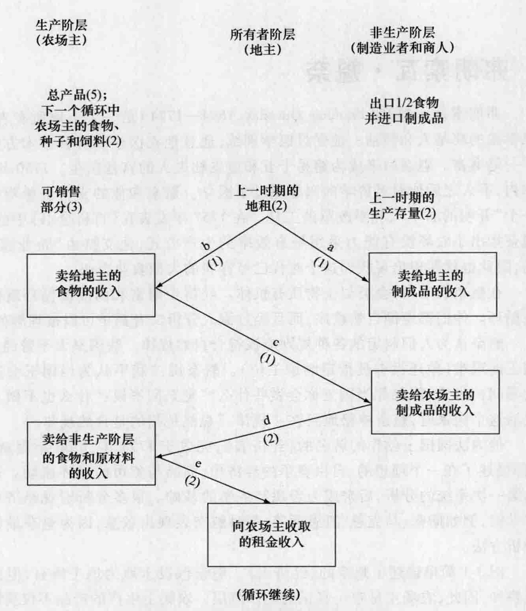
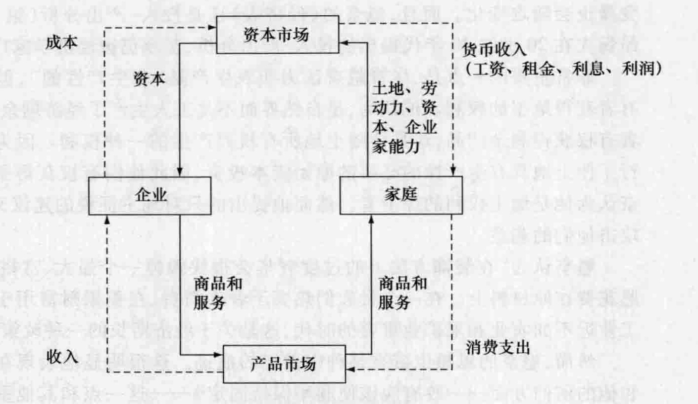

# 第 3 章 重农学派

重农学派出现于重商主义时代结束时期的法国。重农学派的出现可以追溯到 1756 年魁奈在《大百科全书》（*Grande Encyclopédie*）中第一篇经济学论文的发表。该学派结束于 1776 年，标志是杜尔阁失去其在法国政府的高官地位以及亚当·斯密出版《国富论》。在这 20 多年时间里重农学派引导着世界的经济思想，但他们的影响远远超出了他们的时代。我们首先简要介绍一下该学派，然后考察最杰出的两位重农主义者——魁奈和杜尔阁对经济学的贡献。

## 3.1 重农学派概览

### 3.1.1 重农学派产生的历史背景

重农学派是在反对重商主义和法国旧政权封建特性的过程中产生的，但是它也没有完全摆脱当时盛行于法国的中世纪观念。

政府对于生产过细的管制，比如竟然具体规定到每英寸布所必需的丝线根数，可能曾经有利于提高产品质量，但它不允许生产方式的试验与创新、不允许消费者品味的变化，必然束缚生产的发展。而一个腐败奢靡的政府不可能保证这些规则的公正实施，工商业的发展和竞争的加剧使这些规则变得毫无必要。

法国地方政府征收国内通行费、各种税收和关税，因而阻碍了货物的流动，延缓了工业的发展。拥有土地的贵族所强加的各种条件加重了法国农业的负担。农民要负担课征于土地和农业利润的各种赋税，而贵族和神职人员却可以免于这些税收。征税额年年变化，完全取决于征税人员的心血来潮和农民的财富。事实上，征税权被出售给了“包税者”，这允许他们为了自身利益从给定区域的居民身上榨取尽可能多的税收。每个纳税年度之始，包税者向政府缴纳一个固定数额的年费，超过这一数额的一切收入归包税者所有。这样严重损害了个人积累财富和扩大投资的积极性。农民继承或变卖财产时都必须向地主交纳税费。他们不得不和地主所有的磨坊、面包房、酿酒厂做生意并接受他们索要的高价。贵族们有权在他们的农民的田里打猎，农民除草和锄地如果惊扰到小山鹑，就会受到捕猎法禁止。由柯尔培尔提出并在其后被长期延续的强制劳役，迫使农民和被征牲畜无偿铺设公共道路，而这主要是为了其他人的利益。

几个世纪以来，法国政府和市镇行政部门对谷物贸易实行了令人费解的管制。甚至与谷物贸易相关的其他贸易也被剥夺了仅有的一点自由。禁止从法国出口谷物；政府更关心谷物的持续充足供应，而不关心提高农业的利益。但这种情况在丰收的年份除外。一些特殊的许可也可能被授予个人，许可证上通常标明允许出口的数量和谷物的种类以及出口的目的地。在法兰西王国内部，如果未经批准，谷物和面粉不得在各省之间流动。为了获得跨省销售谷物的许可证，商人必须向检查员提交关于企业的所有详尽资料；谷物运达之后，还必须提供一份证书证明谷物确实被运到了指定的目的地。谷物在每个省内还受到进一步的限制，法律规定了谷物的价格和销售地点。在饥荒的时候，政府为了避免囤积而强制销售谷物。通行费和各种管制阻碍了谷物贸易，因此有这样的情况：一个地区有大量盈余充斥仓库，而在几英里以外的地方却有人饿死。

中世纪兴起的商业和手工业行会在法国存在的时间较英国要长。商业行会控制了在一个城镇进行贸易的权利；手工业行会——由行业内的学徒、熟练工和师傅组成——则控制着一个城镇手工作坊的生产和营销方式。随着国家对行会的授权和管制逐步取代了城镇政府和封建地主的管理，这些行会的特征也发生了变化。但直到 1789 年，行会仍然反对劳动力自由进入某些行业，限制和管制产出，实行固定价格，排斥来自其他城镇或国外的竞争。行会之间的法律纠纷和诉讼经常拖延几代甚至几个世纪，浪费了大量的时间和金钱。17 世纪中期，巴黎的行会每年的法律纠纷费用就达到 80 万至 100 万里弗（一种法国的货币单位，后来被法郎取代，再后来又被欧元取代）。卖烤鹅的和卖家禽的商人相互争吵了半个世纪，直到最后后者被限制只能卖未加工的家禽为止。而那些成功的烤鹅商又开始攻击曾大胜了制酱商人的厨师。巴黎经营旧衣服的零售商和裁缝之间长达 300 多年的诉讼最终在 1789 年得到了解决，因为法国大革命摧毁了各种行会。重农学派的思想像一股清新的微风吹过当时法国腐败、腐朽的社会。

### 3.1.2 重农学派的主要信条

重农学派的主要观点可以大致概括如下：

*   **自然秩序。** 重农学派将自然秩序的概念引入到经济思想中来。重农学派 (physiocrat) 这个词语本身就是“自然规律”的意思。根据这个思想，自然规律统治着人类社会，就像牛顿发现的那些自然规律统治着物理世界一样。因此，人类的所有活动都应该与自然规律相协调。一切科学研究的目的都是去揭示整个宇宙现象所遵从的各种规律。在经济学的范畴内，自然规律赋予个人享受自己劳动果实的自然权利，条件是这种享受要和他的利益相协调。
*   **自由放任、自由通行。** “自由放任” (laissez-faire) 是文森特·德·古尔奈 (Vincent de Gournay, 1712—1759) 提出的，这个短语实际意思是“不要政府干预，让人们做他们喜欢做的事情”。除了保证最低的、绝对必需的基本保障如保护生命与产权、维持签约的自由等之外，政府不应对经济生活施加任何干预。因此，重农学派几乎反对一切封建主义、重商主义和各种政府管制，支持国内工商业和国际贸易自由化。古尔奈是重商主义者队伍中的几个高官之一，他的经历使他后来成了一个自由放任主义的追随者。
*   **重视农业。** 重农学派认为工业、贸易和各种职业都是有用的，但不是生产性的，仅仅是再生产出以原材料和工人基本生存资料为形式消耗掉的价值，也是工人们的生存手段。只有农业（也许还包括采矿业）才是生产性的，因此它生产了剩余，生产了超过所耗费资源的价值的净产品。
*   **对土地所有者征税。** 重农主义者认为，因为只有农业才产生剩余，并且土地所有者以地租的形式获得了剩余，所以应该只对土地所有者征税。对其他人所征收的税收最终将通过某种形式转嫁给土地所有者。间接税将随着被转嫁而有所提高，因此，对土地所有者征直接税优于间接税。
*   **经济的内部相关性。** 重农主义者，特别是魁奈，从总体上分析了经济体系中商品和货币的循环流动。

### 3.1.3 重农学派对谁有利或为谁谋利

农民最终将从重农学派的观点中受益，因为农民对土地所有者的繁重义务被取消了。但是如果重农学派的观点被实施，农民将成为大农场的雇佣劳动力。商业将从取消对生产和商品流通的限制的法律规章中受益。通过倡导自由放任的信条，重农学派推动了工业发展，尽管这并不是他们的本来目的；他们感兴趣的是鼓励更加自由的国内谷物贸易、刺激农产品出口和制成品进口。

重农学派特别支持使用雇佣劳动力和先进技术的资本主义农场。这些先进的农场大多数在法国北部。大生产者有大量生产剩余要进行销售，重农学派对农业和谷物国内自由贸易的重视对他们很有帮助。对农业生产剩余征税将降低土地的价值，损害拥有土地的贵族的利益，但不会影响现在或未来的支付地租的农业资本家。贵族和神职人员免于各种税负，而这些税负平民土地所有者却需要负担，对所有投入生产的土地征收单一税有助于分散社会税收负担。

重农学派真心诚意地捍卫贵族拥有土地和收取地租的权利，试着借此来安抚他们。19 世纪 80 年代，美国的亨利·乔治 (Henry George) 想通过税收拿走全部地租，与他不同，重农学派认为税收占全部经济剩余的 1/3 就足够了。他们相信，这不会引起财富从富人到穷人的再分配，因为不论在何种情况下都是地主承担全部税收；而且，把税收从间接税变为直接税能够减轻整体税收负担。这样来看，如果重农学派的计划能够执行，贵族将从中受益。但这个观点是错误的，因为它基于这样一种错误的分析：所有可征税的经济剩余只来自土地。

### 3.1.4 重农学派在当时是如何有效、有用或正确的

工业革命之前，工业的主要特征是劳动生产率极其低下。这一点在法国的手工业经济中表现得尤为明显，特别是在法国大革命之前几十年的社会及政治制度之下。因此，在一个极其贫困的国家中，为贵族而进行的奢侈品生产很容易被看成“非生产性的”。另一方面，尽管农业的耕种方法十分原始，但有时也会获得巨大的丰收。农业经常提供经济剩余，用于储蓄或再投资，从而促进一个正在崛起的国家的经济增长和工业发展。不仅在法国是这样，在美国、德国、日本、俄罗斯及其他国家都是如此。

重农学派提倡自由放任，反对不利于资本主义经济发展的各种障碍。他们不经意地推动了 1789 年法国大革命的爆发，大革命扫清了前进路上的许多障碍。他们强调农业的劳动生产率，摆脱了只有商业才创造和扩大财富的陈旧观念；他们强调生产而不是交换才是财富的源泉。在那个时代法国盛行的间接税侵蚀了法国社会，他们对直接税的支持是对此的一个正当反应。他们主张资本积累应通过减少富人的消费来进行。

### 3.1.5 重农学派哪些信条具有长远贡献

重农学派的一些观点很明显是错误的。该学派错误地认为工业和贸易是非生产性的；而法国的工业和贸易越发达，重农学派的分析错误也就越明显。这种错误导致了另一种错误——因为认为只有土地才产生剩余，所以应该只对土地所有者征税。富有的工业资本家笑了，因为他们赞成这种信条：他们没有增加财富所以不必纳税。重农学派的税收观念留下了长期的影响。约翰·斯图亚特·穆勒 (John Stuart Mill) 在 19 世纪中期撰文倡导，政府应该得到由于地价上涨而增加的全部资本利得，一个方式是，政府对未来上涨的地租征税。在重农学派 100 多年后，亨利·乔治在美国撰文倡导“单一税收”运动，其目的是没收全部租金。

重农学派颂扬资本主义农场主是法国经济发展的主导力量，但他们在两个方面是错误的。第一，工业资本家和雇佣工人成为这个国家经济增长中最重要的力量，而农业的重要性却相对降低了；第二，是小农场主而不是大的农业资本家成为法国农业的典型象征。如果土地仍然控制在贵族手中，对土地所有权征税会限制奢侈品消费。但当大革命以后，小农获得了土地，他们就将承受绝大部分的税收负担。

然而，重农学派对经济学作出了以下几个长久贡献。第一，通过将社会作为一个整体来考察并分析支配财富与商品流通的规律，重农学派为经济学发展为一门社会科学奠定了基础。我们将发现魁奈的《经济表》是现代经济学教材中两个概念的先驱，它们是经济循环流向图和国民收入账户。第二，收益递减规律——通常归功于马尔萨斯和李嘉图——事实上是在更早以前由重农学派的杜尔阁提出的。第三，重农学派最早分析了税负转嫁和税率问题，这在如今是应用微观经济学的重要组成部分。第四，通过倡导自由放任，重农学派使经济学家的注意力转移到关注经济中政府的适当作用问题上来。

## 3.2 弗朗索瓦·魁奈

弗朗索瓦·魁奈 (François Quesnay, 1694—1774) 是一个土地所有者的儿子，是重农学派的奠基人和领袖。他受过医学训练，通过他在医学和外科手术方面的技术获得了一笔财富。魁奈后来成为路易十五和蓬皮杜夫人的宫廷医生。1750 年，他遇到了古尔奈，不久之后他对经济学的兴趣超过了医学。魁奈和他的支持者希望把国王转变成一个“开明的君主”、和平改革的工具。在 1757 年发表在《百科全书》中的一篇文章中，魁奈指出小农场没有能力采用最有效率的生产方式，他支持由“企业家”经营的大农场，因此也就期望出现我们这个时代已经存在的大型农业企业。

在魁奈看来，社会类似于物质有机体。经济中财富和商品的循环就像身体中的血液循环。他们都遵循自然秩序，而且经过深入分析二者都是可以被理解的。

魁奈认为人们制定的各种规则应该符合自然规律。法国皇太子曾经向魁奈抱怨做国王的艰难（他还没有被指定继承王位）。魁奈说：“我不认为当国王会这么艰难。”皇太子问：“那么，假如你当国王你会做些什么？”魁奈回答说：“什么也不做。”被问及谁将统治这个国家时，魁奈神秘地回答：“规律。”显然他指的是自然规律。①

他为法国国王创作的著名的《经济表》，完成于 1758 年，1766 年重新修订。《经济表》描述了在一个理想的、自由竞争的经济中，商品与货币的循环流动。这是对财富流动第一次系统的分析，后来成为宏观经济学的基础。很多分析宏观经济总量活动的经济学家，例如斯密、马克思、凯恩斯等，都对魁奈表现出敬意，因为魁奈最先使用了这一分析方法。

图 3-1 简单描述了魁奈的《经济表》。魁奈假设土地为地主所有，但由承租的农场主耕种，因此，农场主是唯一真正的生产阶层。农场主生产的产品不仅要满足他们自己的需要，还要满足土地所有者（包括国王、教会、公职人员和其他依赖土地所有者的收入生活的人）的需要。此外，农场主的产出还要满足非生产阶层（制造业者和商人）的需要。《经济表》说明了社会净产品是如何在三个阶层之间循环并被年复一年再生产出来的。

假设农场主开始的时候有 50 亿里弗的年总产出。其中，有 20 亿里弗作为生产必需的耗费而直接扣除，这部分花费用于提供农场主自身的食物、种子和各种饲料。在左边栏中可以看到，这样就只剩下 30 亿里弗的食物可以销售。地主（中间一栏）开始时拥有农场主在上一个循环支付给他们的 20 亿里弗的租金。最后，制造业者和商人（右边一栏）拥有价值 20 亿里弗的上一循环所制造的商品。

地主阶层用 20 亿里弗中的 10 亿里弗从非生产阶层那里购买制成品（箭头 a），用另外 10 亿里弗从农场主那里购买食物（箭头 b）。然后，农场主用他们向地主销售食物

*图 3-1 魁奈的经济表*

所得的 10 亿里弗来购买同等价值的制成品（箭头 c）。当然，农场主的支出代表着制造业者和商人也有同样数量的收入。现在非生产阶层有了 20 亿里弗的收入，其中 10 亿里弗是向地主销售商品的收入，另 10 亿里弗是向农场主销售商品获得的收入。然后非生产阶层从农场主那里购买 20 亿里弗的食品和原材料（箭头 d）。

箭头 d 所示的交易完成后，这个循环将自动重复进行。在这个阶段，农场主拥有 20 亿里弗的食物、种子和饲料，他们将用这些在下一年再生产 50 亿里弗的农产品。地主拥有食物、制成品，并将从农场主下一年的收获中得到 20 亿里弗的地租（箭头 e）。

非生产阶层拥有 20 亿里弗的食物和原材料，他们将用此来生产 20 亿里弗的制成品。

一些读者会注意到，魁奈的《经济表》暗含着制造业阶层没有留下任何制成品供自己消费。罗纳德·L. 米克 (Ronald L. Meek) 对这个问题作了回答。他发现，重农学派的著作中暗含着非生产阶层只有生产阶层的一半规模，因此，他们不必消耗掉购自农场主的 20 亿里弗的食物和原材料（箭头 d），而是出口一部分食物，用其所得来购买进口的制成品。②

魁奈的《经济表》是国民收入分析的思想源泉，它也为分析一个经济体的统计工作奠定了基础。魁奈本人就试图估计年产出值及其他总量指标。《经济表》也清晰地表达了作为整体的经济中的均衡概念，因为如果相互依存的变量中有一个发生变动，其他变量也会随之变化。而且，魁奈的《经济表》还是投入-产出分析（第 18 章）的先驱，里昂惕夫在 20 世纪 30 年代提出的投入-产出分析，至今仍被经济学家广泛使用。

非常重要的一点是，尽管魁奈认为非农生产是“非生产性的”，但他并没有质疑所有者获得地租的权利。他认为，是自然界而不是工人生产了经济剩余。因此，土地所有者有权获得剩余产品，这是伴随土地所有权而产生的一种权利。因为他们这个阶层进行了使土地具有生产性的必要的原始资本投资，因此他们有权获得剩余产品。这样魁奈认为他是地主权利的捍卫者。然而他提出的只对地主征税的建议又被地主认为是在攻击他们的利益。

魁奈认为“在装饰方法上的过度奢华会很快毁掉一个强大、富裕的国家”。③ 他宁愿花费在原材料上。在一个贵族们热衷于奢侈消费、在积累财富用于进一步投资方面工业远不如农业和采矿业重要的时代，这是关于经济增长的一种政策建议。

然而，魁奈的思想也带有某种中世纪的痕迹。这很明显地表现在他对农业的颂扬和他的信仰方面——政府应该使利率保持固定④——这一点和其他重农学派的观点相反。魁奈也赞成“公平价格”的概念，但他认为自由市场比政府管制更容易实现这一点。⑤

---

### 历史借鉴 3-1：魁奈和循环流向图

魁奈的《经济表》（图 3-1）是经济循环流向图的先驱，在现代经济学教科书前几章中常常可以找到循环流向图。魁奈的经济表描述了支出和收入在以下三个阶层之间的流动：农场主、地主以及制造业者和商人。他的经济表明确暗示了实物层面的商品和服务的反向流动。例如，制造业者和商人获得收入，货币流用来交换商品，实物流则向相反的方向运动。

然而，现代循环流向图的直接来源可以追溯到经济学家弗兰克·奈特 (Frank Knight)，20 世纪 30 年代早期，他在芝加哥大学任教时提出了“财富之轮”的思想。* 现代循环流向图（见图 3-2）既描述了货币流，也描述了实物流。而且，它把经济划分为两个部门（家庭和企业），而不是三个阶层（农场主、地主、制造业者和商人）。最后，现代循环流向图表现了两个市场：资本市场和产品市场。在资本市场上，家庭提供资本，而企业需要资本。在产品市场上，家庭需要产品，而企业提供产品。

像魁奈的《经济表》一样，现代循环流向图也暗含了经济决策和经济活动之间的相互联系。

*图 3-2 现代循环流向图*

## 3.3 安·罗伯特·雅克·杜尔阁

安·罗伯特·雅克·杜尔阁 (Anne Robert Jacques Turgot, 1727—1781) 出身于诺曼底的一个贵族世家，他们家连续几代为这个国家培养了有才能的政府官员。他是这个家庭的幼子，受到了教会教育。但获得神学学位之后，他决定进入司法行政部门。杜尔阁在法国政府部门的职位不断上升，到 1774 年他成为法国财政部长，而这个职位 100 多年之前正是柯尔培尔担任的。他上任不到两年，就引入了各种反封建、反重商主义的措施，并推崇重农学派的思想。允许国内谷物进行自由贸易，废除各种行会和特权贸易企业。他结束了沉重的强制劳役，这种强制劳役要求农民每年无偿工作 12 天或 15 天来维修道路、桥梁和运河；取而代之，他实行了一种所有地主都需缴纳的税收。杜尔阁大幅度削减了政府支出。政府的信誉大大提高，这使他能够以 4% 的利率从荷兰政府借入大笔款项，而这个利率以前是 7%—12%。政府每年的利息支出减少了近 2/3。杜尔阁还提倡对贵族征税，人们有择业自由，全民教育，宗教信仰自由，并且提出了创建中央银行的构想，这一构想后来由拿破仑于 19 世纪付诸实施。

杜尔阁的法令和计划激起了各类人们的最坚决的反对。贵族痛恨他，因为他想从土地上征收一切税收。神职人员不信任他，把他看作异教徒，因为他不但很少参加弥撒，而且主张宗教信仰自由。金融家怨恨他，因为他以比他们开价要低的利率从国外借款。国王的随从们也因杜尔阁反对他们挥霍、闲职和年金而被激怒了。那些向政府一次性缴纳固定数额而有权尽可能多征税的包税者们极其愤怒，因为他想用政府的征税官来取代他们。富有的、已经确立了地位的资本家反对他对垄断的干预。由于玛丽·安托瓦内特 (Marie Antoinette) 以及其他因为他的政策而失去特权的强势王室成员的反对，路易十六罢免了杜尔阁的职务。他的改革立刻被取消，直到 1789 年法国大革命也没有再实施。事实上，可能正是杜尔阁的倒台使大革命的发生不可避免；他的经历证明旧的政权不可能自行改革。

像其他重农主义者一样，杜尔阁相信开明的专制主义，并希望国王能实行各项改革措施。他反对国会对立法的干预。他提交给国王的一项计划中建议只允许土地所有者构成选举权人。被选举出来的国会将没有任何立法权，但它要管理税收、教育和救济穷人。显然，杜尔阁和其他的重农主义者都植根于旧的法国封建制度，他们是改革者而不是革命者。但反动的法国旧政权仍不能容忍这些改革。

在 1766 年写作的《关于财富的形成和分配的考察》 (*Reflections on the Formation and Distribution of Riches*) 一书中，杜尔阁发展了一种工资理论，在这个理论中，他认为工人之间的竞争使工资可以降低到维持最低生存需要的水平上。这是后来被称为“工资铁律”的早期表述。只有农场主生产剩余，用来养活整个社会并提供原材料。

> 因此，他（农场主）是财富的唯一源泉，并且通过财富的循环来养活社会的全部劳动力；因为只有他的劳动产出超过其劳动的工资。⑥

杜尔阁认为富有的、资本主义的承租农场主最有能力有效耕种土地，因为他们有资本对土地进行投资。他们获得利润、投资本金及利息。企业家会将利润和储蓄的大部分用来再投资，而地主则不会这样做。

> 总体事实是，尽管所有者拥有巨大的剩余，但由于他们拥有更多闲暇，有更多欲望和激情，因此他们储蓄较少；他们把自己看作财富的更好的保证；他们考虑的更多的是如何惬意地享受财富而不是如何增加财富：奢侈是他们的天性。⑦

在 1776 年写给大卫·休谟的一封信中，杜尔阁称对其他团体征税会转嫁给地主。只有当工资高于最低生存需要水平之上时，对挣工资的人征税才能被转嫁，但这只是暂时的偏离。征税不会降低处于最低生存需要水平线上的工资，因为工人不得不努力去赚取足够生存的收入。因此，对地主征收直接税优于征收被转嫁到他们身上的间接税。这种不可转嫁的税收对经济发展也是最优的，如前文所述，因为地主浪费了他们的收入份额。

杜尔阁是政府节约的坚定倡导者。在致大卫·休谟更早的一封信中，他写道：

> 您也知道，像我做的那样，所有政府的最终基础是：服从和金钱。政府的目标正如一句谚语所说的：给母鸡拔毛而不使它叫喊；现在是所有者（地主）叫喊，政府一直倾向于间接伤害他们，因为只有这样，他们才会在这件事情成为法律之后，才感觉到伤害。⑧

在一个与其政府事务相关的备忘录中，杜尔阁为自由贸易提供了一些证据：

> 一个从狭隘的政治立场出发坚持反对（自由贸易）的人，会认为在国内可以种植一切，他们会像布里 (Brie) 的地主一样，认为喝自己葡萄园里产的劣质葡萄酒是一种节俭的行为，而实际上他们比喝最好的葡萄酒花费的还要多，因为他们牺牲了适合种植最好的小麦的土地，而用出售小麦的收入可以来购买最好的葡萄酒。⑨

杜尔阁对经济学理论领域最大的贡献是他准确地表达了收益递减规律。这个规律出自他可能写于 1767 年的《基于圣·佩拉维论文的观察》 (*Observations sur un Mémoire de M. de Saint-Péravy*)。他说，很难想象农业上两倍的投入会带来两倍的产出。

> 土地的肥力就像一个被连续添加重量而压下的弹簧。如果重量小而弹簧不是很有弹性，第一次尝试就毫无结果。但当重量足以第一次克服阻力时，弹簧将被压下。承受一定的压力之后，它又会开始阻止加于其上的额外的力量，以前加在其上能够产生一英寸或者更多的压力，现在将几乎不能将其压下一毫。因此，不断添加的重量其效果是逐渐减少的。⑩

奇怪的是，亚当·斯密——曾经到法国旅行并会见杜尔阁，而且对杜尔阁的作品很熟悉——并没有把收益递减规律应用于农业。这个规律后来被李嘉图、马尔萨斯和爱德华·韦斯特应用于地租分析；但他们都像杜尔阁那样没有认识到：当若干单位的生产变量被连续追加到土地（固定变量）上时，在收益递减之前的最初阶段，收益是递增的。

---

① James Edward Le Rossignol, *Economics for Everyman: An Introduction to Social Economics* (New York: H. Holt, 1923), 293.

② Ronald L. Meek, *The Economics of Physiocracy* (Cambridge, MA: Harvard University Press, 1963), 282-283.

③ Philip Charles Newman, *Source Readings in Economic Thought of Physiocracy* (New York: Norton, 1954), 94.

④ 关于贷款利息问题的早期思想史，参见：Barry Gordon, "Lending at Interest: Some Jewish, Greek, and Christian Approaches, 800 BC-AD 100," *History of Political Economy* 14 (Fall 1982): 406-426.

⑤ “公平价格”这一伦理概念是由圣·托马斯·阿奎那在 13 世纪提出的。

*对奈特图示起源的有趣讨论，参见：Don Patinkin, *Essays On and In the Chicago Tradition* (Durham, NC: Duke University Press, 1981), 53-72.
⑥ Anne Robert Jacques Turgot, *Reflections on the Formation and the Distribution of Riches* (New York: Macmillan, 1898), 9.

⑦ Turgot, *Reflections*, 97.

⑧ Turgot, *Reflections*, 103.

⑨ Anne Robert Jacques Turgot, "Letter on the Marque des fers," in Peter Groenewegen, "Turgot's Place in the History of Economic Thought: A Bicentenary Estimate," *History of Political Economy* 15 (Winter 1983): 591.

⑩ Anne Robert Jacques Turgot, *Observations sur un Mémoire de M. de Saint-Péravy* (1767), in *Oeuvres de Turgot et Documents le Concernant*, vol. 2, ed. Gustave Schelle (Paris: Librairie Félix Alcan, 1914), 644.

### 复习与讨论

1.  解释下列名词，并简要说明其在经济思想史中的重要性：商业行会，手工业行会，自然秩序，自由放任，魁奈，《经济表》，杜尔阁，非生产阶层。
2.  重农学派开始于什么时候？结束于什么时候？为什么它存在时间这么短暂？
3.  重农学派从哪几个方面反对重商主义？为什么它出现在法国？
4.  简要总结魁奈《经济表》的基本要素。《经济表》是如何影响现代经济循环流向图和国民收入账户的？一个表可以推导出另一个表吗？请解释。
5.  柯尔培尔（第 2 章）和杜尔阁都是法国著名的经济思想家，除此之外，他们还有什么共同点？比较他们的基本经济观点。
6.  杜尔阁在分析对一个弹簧连续添加重量时，他想到了什么规律？利用你以前学过的经济学课程的知识画出这个规律，画出只有一个投入变量的生产函数。把纵轴标为“农业产出”，横轴标为“投入变量”。（可以将你的图与图 14-3 的上图相对照。）
7.  重农学派重视经济中的哪个部门？为什么？这暗含着什么样的税收政策？
8.  讨论重农学派经济思想的主要贡献和不足。
9.  尝试解决以下悖论：重农学派主张自然秩序和支持自由放任，然而却强烈拥护君主的绝对权威。

---
**精选文献**

**书籍**
*   Beer, Max. *An Inquiry into Physiocracy*. London: Allen and Unwin, 1939.
*   Blaug, Mark, ed. *François Quesnay*. 2 vols. Brookfield, VT: Edward Elgar, 1991.
*   Groenewegen, Peter D. *The Economics of A. R. J. Turgot*. The Hague: Martinus Nijhoff, 1977.
*   Higgs, Henry. *The Physiocrats*. New York: Langland Press, 1952 [orig. pub. in 1897].
*   Meek, Ronald L. *The Economics of Physiocracy*. Cambridge, MA: Harvard University Press, 1963.
*   Turgot, Anne Robert Jacques. *Reflections on the Formation and Distribution of Riches*. New York: Macmillan, 1898 [orig. pub. in 1766].
*   Vaggi, Gianni. *The Economics of François Quesnay*. Durham, NC: Duke University Press, 1987.

**期刊论文**
*   Brewer, Anthony A. "Turgot: Founder of Classical Economics." *Economica* 54 (November 1987): 417-428.
*   Groenewegen, Peter. "Turgot's Place in the History of Economic Thought." *History of Political Economy* 15 (Winter 1983): 585-616.
*   Phillips, Almarin. "The Tableau Economique as a Simple Leontief Model." *Quarterly Journal of Economics* 69 (February 1955): 137-144.
*   Pressman, Steven. "Quesnay's Theory of Taxation." *Journal of the History of Economic Thought* 16 (Spring 1994): 86-105.
*   Ware, Norman J. "The Physiocrats: A Study in Economic Rationalization." *American Economic Review* 21 (December 1931): 607-619.