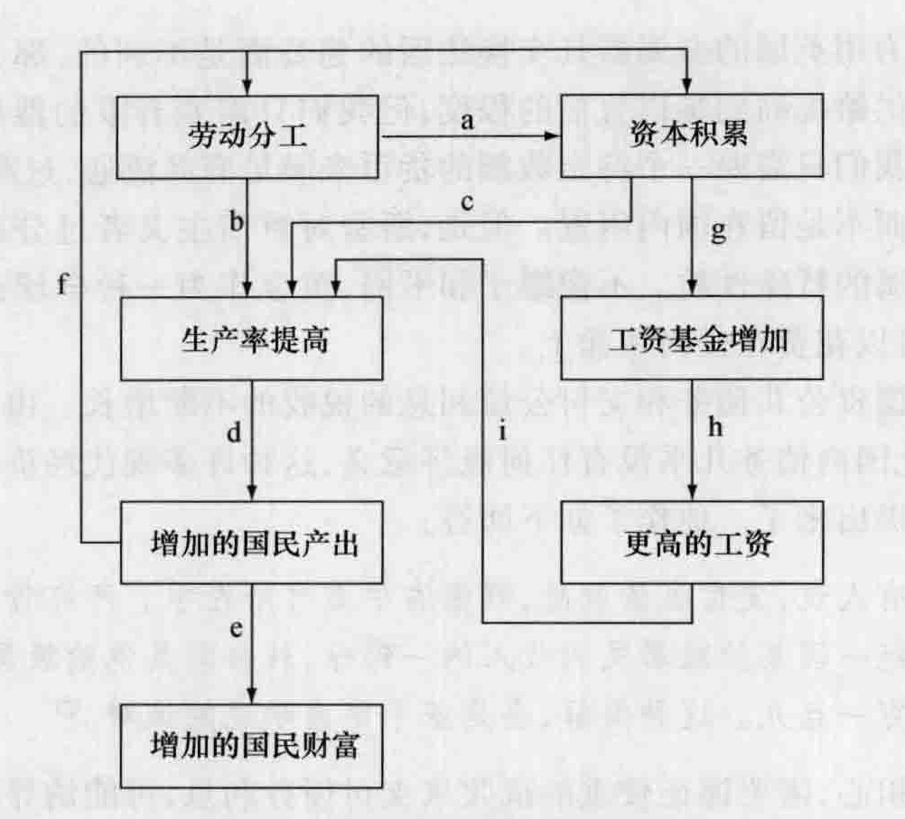

# 第 5 章 古典学派：亚当·斯密

这一章我们讨论亚当·斯密对经济学的贡献。亚当·斯密不仅是古典学派的奠基人，还是这个学派最著名的成员。在接下来的几章中，我们将讨论其他几位重要的古典学派经济学家。

在对斯密的讨论中，首先我们来看他的生平细节，并指出对他产生关键影响的几件事。然后，我们考察斯密的第一本著作《道德情操论》(The Theory of Moral Sentiments)，探寻他的道德哲学思想和政治经济思想之间的联系。最后，我们仔细剖析他的不朽的巨著《国富论》(Wealth of Nations) 及其光辉思想：(1) 自由放任和利益的协调；(2) 劳动分工；(3) 竞争经济的若干规律。

## 5.1 生平细节

亚当·斯密 (Adam Smith, 1723—1790) 是公认的古典学派卓越的创始人，他出生于苏格兰的港口和制造业城镇柯科迪。他的父亲是城镇海关的审计员，在他出生以前就已经去世。玛格丽特·道格拉斯·斯密给了她的儿子一个家，直到 1784 年她 90 多岁时去世。

年轻的斯密 14 岁时进入格拉斯哥大学学习，后来他又到牛津的巴利奥尔学院学习道德与政治科学、语言学。然后他回到母亲的家中继续自学了两年。之后，他去了爱丁堡，在那里他讲授修辞学和文学。1751 年，他当选为格拉斯哥大学的逻辑学教授，第二年又被聘为道德哲学教授，在这个职位上他干了近 12 年。1759 年，他出版了《道德情操论》，这之后他讲演的重点从道德伦理方面转向了法学与政治经济学。

斯密辞去教授职务，做了查尔斯·汤森 (Charles Townsend) 的继子的家庭教师，查尔斯·汤森是财政部长，后来因殖民地的茶叶税问题而在美国声名赫赫。斯密利用他做家庭教师的收入，在法国生活了两年多，在那里他与重农主义者，包括魁奈和杜尔阁建立了亲密的个人友谊。返回苏格之后，斯密就退休了，他的家庭教师职位使他每年获得 300 英镑的年金，并且终其一生。

1776 年斯密出版了《对国民财富的性质和原因的研究》(An Inquiry into the Nature and Causes of the Wealth of Nations)，十年之前他在法国就开始了这本书的创作。这本书出版后立即获得了很高的声誉，并为斯密赢得了永久的声望。

出版这本书之后，斯密在伦敦度过了两年，在那里他经常与当时著名的学者进行交流。后来，由于被任命为苏格兰的海关专员，斯密回到爱丁堡和母亲一起生活。据说他的大部分收入都秘密地花在了慈善事业上。他很喜欢招待朋友们共进晚餐，即使没有发送邀请那样正式；而且在爱丁堡，他的星期天晚餐在很长时期内都很有名。他获得过各种荣誉，其中之一是当选为格拉斯哥大学的校长。在 1790 年去世前不久，遵照他的遗嘱，他大部分未完成的手稿都被销毁，且没有任何解释。

## 5.2 对斯密有重要影响的因素

有几个因素对斯密的思想产生了重要影响。第一，也许是最重要的一个因素就是他那个时代普遍的学术氛围。他所处的时代正是启蒙运动时期。这次的思想运动有两大支柱：人类的推理能力和自然秩序的概念。正如第 4 章所表明的，与牛顿相联系的科学革命确立了这样的观念：秩序与协调构成了自然世界的特征。通过系统地推理，人们不仅能发现这些自然规律，而且还能发现支配社会的规律。因此，启蒙思想家都是乐观主义者，他们一般都相信人类的思想和活力能够产生无限的进步。

第二，但绝对相关的是，斯密受到了重农学派特别是魁奈和杜尔阁的影响。他赞美重农学派的体系“即使考虑其所有的缺陷”，仍然“可能是迄今为止公开发表的关于政治经济这一主题的最接近真理的理论体系”。①重农学派对重商主义的抨击以及他们清除贸易壁垒的建议赢得了斯密的钦佩。从这些思想家那里他得到如下主题：财富是“社会劳动每年再生产出来的可消费的商品”，对于经济中政府干预最小化的愿望，以及生产和分配循环过程的概念。他本打算将《国富论》献给魁奈，如果后者能够活到这本著作完成的话。

斯密在格拉斯哥大学的导师弗朗西斯·哈奇森 (Francis Hutcheson)，是对斯密产生重要影响的第三个因素。哈奇森认为，通过发现对人类有益的行为，人们自己能够认识什么是伦理上认为的好，即上帝的旨意。

最后，斯密还受到他的朋友大卫·休谟的影响。休谟通过信件和个人谈话对斯密的学术发展和经济思想产生了重要影响。

## 5.3 道德情操论

《道德情操论》的出版比《国富论》早 17 年。在斯密的一生中，这本书共出版了 6 版，最后一版是在他生命的最后一年，因此不能说这本书仅仅体现了斯密的早期思想而《国富论》体现了他的后期思想。这两本书同样重要，它们一起体现了斯密不同但具有互补作用的思想方面。《道德情操论》讨论道德力量，它约束人们的自私，并把他们结合在一起构成一个可以运转的社会；《国富论》假设存在一个公平的社会，并表明个人是如何受经济力量的引导和制约的。

《道德情操论》开篇第一章的题目是“论同情”。斯密认为，同情可以战胜自私。同情（或“移情”、“共情”）使我们关注到别人的命运，并且使他人的幸福对我们是必要的。这是正确的，尽管事实是，除了看到别人幸福而产生的愉快之外，我们从别人的幸福中得不到任何东西。别人的悲伤和喜悦引起了我们相似的感情。如果我们把自己置于另一个人的位置，我们的想象力能够引起我们对别人没有意识到的情形的同情。精神错乱的人可能会大笑、大唱而完全感觉不到不幸。因此，我们看到这样的人所感到的痛苦并不是来自他们的痛苦，而是来自通过我们的推理和判断能力而对他们所处的情形的认识。这就是同情。我们甚至会同情死去的人，因为我们会想象我们活着的灵魂在他们死去的躯体上，然后构想在这样的情形下我们会是怎样的感情。对死亡的恐惧损害了我们的幸福，但限制了人类的不公；这种恐惧使个人受折磨且难堪，但它可以守卫和保护社会。

按照斯密的划分，有非社会性情感和社会性情感。前者的例子包括憎恶和仇恨。考虑到这些情感，我们把同情在感受到情感的人和成为情感对象的人之间进行划分，因为这两者的利益是对立的。社会性情感包括慷慨、人道、仁慈、怜悯、相互的友谊与尊重。这些情感几乎在每一个场合都会让那些冷漠的旁观者感到愉快，因为他们对感受到这些情感的人的同情与他们对这些成为情感对象的人的关注恰好一致。我们一直对慈善情感怀有最强烈的同情，因为它们看起来每个方面都令我们感到愉快。

因为人们更倾向于理解我们的欢乐而不是我们的悲伤，所以我们总是炫耀我们的财富而隐藏我们的贫困。这个世界上的大多数辛苦与忙碌并不是为了满足我们的必需，而是为了满足我们的虚荣。我们希望被别人以同情和赞许的方式观察、照顾和关注。富人以财富为荣，因为财富为他们吸引了这个世界的注意力；穷人以贫困为耻，因为贫困令他们身份低微。斯密写道：

> 钦佩或近于崇拜富人和大人物、轻视或至少是怠慢穷人和小人物的这种倾向，虽然为建立和维持等级差别和社会秩序所必需，但同时也是我们道德情操败坏的一个重要而又最普遍的原因……
> 我们经常看到：富裕和有地位的人引起世人的高度尊敬，而具有智慧和美德的人却并非如此。我们还不断地看到：强者的罪恶和愚蠢较少受到人们的轻视，而无罪者的贫困和软弱却并非如此。受到、获得和享受人们的尊敬和钦佩，是野心和好胜心的主要目的。我们面前有两条同样能达到这个我们如此渴望的目的的道路：一条是学习知识和培养美德；另一条是取得财富和地位……
> 为了获得这种令人羡慕的境遇，追求财富的人们时常放弃通往美德的道路。不幸的是，通往美德的道路和通往财富的道路的方向有时截然相反。但是，具有野心的人自以为，在他追求的那个优越的处境里，他会有很多办法来博得人们对他的钦佩和尊敬，并能使自己的行为彬彬有礼，风度优雅；他未来的那些行为给他带来的荣誉，会完全掩盖或使人们忘却他为获得晋升而采用的各种邪恶手段。②

斯密认为，人只能生存于社会之中；他们可能互相伤害，但他们也需要其他人的帮助。当人们出于爱心、感激、友谊和尊敬而互相提供必要的帮助时，社会就会繁荣和幸福。但是，即使缺乏相互的爱心和情感，由于其效用，社会仍将继续存在下去，尽管它不是那么令人幸福和满意。但是，如果人们随时准备伤害和侮辱别人，那么社会就无法存在下去。因此，一个公正的体系是必要的。

> 因此，对于社会的存在来说，仁慈远不如公正必要。没有仁慈，尽管社会不会处于最令人满意的状态，但它可以生存下去；但是不公正的盛行将彻底毁掉它。③

然后，斯密考虑了我们的自私这一恼人的问题以及如何约束和控制它。

> 对于人性中那些自私而又原始的情感来说，我们自己的毫厘之得失会显得比另一个和我们没有特殊关系的人的最高利益重要得多，它会激起某种更为激昂的高兴或悲伤，引出某种更为强烈的渴望和嫌恶。只要利益是从别人的角度来衡量，那么他们的那些利益就绝不会被看得同我们自己的一样重要，绝不会限制我们去做任何有助于促进我们的利益而给他带来损害的事情……
> 让我们假设，中国这个伟大帝国连同她的亿万居民突然被一场地震吞没，并且让我们来考虑，一个同中国没有任何关系的富有人性的欧洲人在获悉中国发生这个可怕的灾难时会受到什么影响。我认为，他首先会对这些不幸的人遇难表示深切的悲伤，他会怀着深沉的忧郁想到人类生活的不安定以及人们全部劳动在顷刻之间就这样毁灭掉了，化为乌有。如果他是一个投机商人的话，或许还会推而广之 地想到这种灾祸对欧洲的商业和全世界的贸易往来所能产生的影响。而一旦做完所有这些精细的推理，一旦充分表达完所有这些高尚的情感，他就会继续悠闲而平静地从事他的生意或追求他的享受，寻求休息和消遣，好像不曾发生过这种不幸的事件。那种可能落到他头上的最小的灾难会引起他某种更为现实的不安。如果明天要失去一个小指，他今晚就会睡不着觉；但是，倘若他从来没有见到过中国的亿万同胞，他就会在知道了他们毁灭的消息后怀着绝对的安全感呼呼大睡，亿万人的毁灭同他自己微不足道的不幸相比，显然是更加无足轻重的事情。……既然我们总是深深地为任何与己有关的事情所动而不为任何与他人有关的事情所动，那么是什么东西促使高尚的人在一切场合和平常的人在许多场合为了他人更大利益而牺牲自己的利益呢？这不是人性温和的力量，不是造物主在人类心中点燃的仁慈的微弱之火，即能够抑制最强烈的自爱欲望之火。它是一种在这种场合自我发挥作用的一种更为强大的力量，一种更为有力的动机。它是理性、道义、良心、心中的那个居住者、内在的那个人、判断我们行为的伟大的法官和仲裁人……
> 当他人的幸福或不幸在某方面依我们的行为而定时，我们不敢按自爱之心可能提示的那样，把一个人的利益看得比众人的利益更为重要。内心的那个人马上会提醒我们：我们太看重自己而过分轻视别人，这样做会把自己变成同胞们蔑视和愤慨的合宜对象……④

斯密指的是，我们的道德力量制定了各种行为准则来限制我们的自私行为。这些准则可以看作是神的命令和规则。如果我们违反了上帝的规则，我们将会受到内心耻辱和自我谴责的惩罚。如果我们遵守上帝的意愿，我们就可以得到精神宁静、知足和自我满意的奖赏。因此，上帝促进了人类的幸福。

在与《国富论》中更有名的一篇文章相类似的一段文字中，斯密指出，富人倾向于储蓄和再投资，因而消费的不比工人多。富人无意中同较穷的工人一起分享了他们进步的成果，“尽管他们只图自己方便，尽管他们雇用千百人来为自己劳动的唯一目的是满足自己无聊而又贪得无厌的欲望”。他在下面的文字中继续表达了这一观点：

> [企业所有者]由一只看不见的手引导，对生活必需品作出几乎同土地在平均分配给全体居民的情况下所能作出的一样的分配，从而不知不觉地增进了社会利益，并为不断增多的人口提供生活资料……⑤

《道德情操论》和《国富论》协调个人利益和社会利益，都是通过看不见的手的原理或自然和谐，以及个人天生自由的原理或公正权利。在《道德情操论》中，同情和仁慈限制自私；在《国富论》中，竞争引导着自我利益的经济趋向于社会福利。

## 5.4 国富论

斯密的 900 多页的经济学巨著《对国民财富的性质和原因的研究》出版于 1776 年，也就是美国独立革命爆发的那一年。正是这本书确立了斯密作为经济思想史上最重要的经济思想家之一的地位。因此，《国富论》中所包含的洞见需要仔细加以研究。

### 5.4.1 劳动分工

《国富论》第 1 章的题目是“论劳动分工”，这在斯密的时代还是一个陌生的词汇。开篇第一句是这样的：“劳动生产力上的最大提高，以及在直接或应用的各种场合所表现出来的技能、敏捷和判断力，在很大程度上似乎都是劳动分工的结果。”⑥

由于认识到劳动分工这个概念对他整个主题的重要性，斯密将这个概念运用到一个大头针工场的详细描写中：

> 大头针制造业是极其微小的，但它的分工往往引起人们的注意，所以，我把它引来作为一个例子。一个劳动者，如果对于这种职业（使大头针的制造成为一种专门职业也是分工的结果）没有受过相当的训练，又不知道怎样使用这种职业中的机械（使这种机械有发明的可能，恐怕也是分工的结果），那么即使竭尽全力工作，也许一天也制造不出 1 枚大头针，要做 20 枚，当然是绝对不可能了。但按照现在的经营方法，不但这整种作业已经成为专门职业，而且这种职业分成若干部门，其中较大的部门可能也同样成了专门职业。一个人抽铁线，一个人拉直，一个人切截，一个人削尖一端，一个人磨另一端以便装上圆头。要做圆头，就需要有两三种不同的操作。装圆头，涂白色，乃至包装，都是专门的职业。按照这样的方式，大头针的制造分为 18 种操作。有些工场，这 18 种操作分别由 18 个专门的工人担任；不过在其他工场有时一人也兼任两三种操作。我见过一个这种小工厂，只雇用了 10 个工人，因此在这一工厂中，有几个工人担任两三种操作。像这样一个工厂的工人虽然很贫穷，必要机械设备也很简陋，但他们如果勤勉努力，一天也能制成 12 磅大头针。以每磅中等大头针有 4000 枚计，这 10 个工人每天就可以制成 48 000 枚大头针，即一人一天可以制成 4800 枚大头针。但如果他们各自独立工作，不专门学习一种特殊业务，那么，他们不论是谁，绝对不可能一天制造 20 枚大头针，说不定一天连 1 枚大头针也制造不出来。⑦

斯密认为，劳动分工能够提高产出数量是由于三个原因。第一，每个工人在重复完成某项专一任务过程中提高了灵巧程度。第二，如果工人不需要从一项工作转换到另一项工作，就可以节约时间。第三，一旦各项工作由于劳动分工而被简化和程序化，就有可能发明有利于提高生产率的机械。请注意这里对制造业生产和劳动生产率的强调。回想一下重商主义者主要关心的是，商品被生产出来以后，如何通过商品的交换来增加一个国家的财富。另一方面，重农学派关注的焦点是农业产出。在《国富论》的开始，斯密通过讨论同样数量的工人如何通过劳动分工大幅度提高产出，清楚地表明《国富论》是对当时存在的各种主要经济观念的突破。⑧

### 5.4.2 利益的和谐与有限政府

斯密指出，经济活动的参与者倾向于追求他们自身的个人利益。商人追求利润：“我们每天所需的晚餐，不是出自屠夫、酿酒师或面包师的恩惠，而是出于他们自身利益的打算。”⑨在质量一定的情况下，消费者希望找到最低价格的产品。在工作的非工资方面给定的情况下，工人们尽量去寻找最高的工资。然而，隐藏于经济活动的混乱表面之中的是一种自然秩序。有一只看不见的手引导个人的自利行为，从而形成社会福利。让我们听一下斯密的说法：

> 每个人必然竭尽全力使社会的年收入总量增大。事实上，他通常既不打算促进公共利益，也不知道他自己是在什么程度上促进它。他宁愿投资支持国内产业而不支持国外产业，盘算的只是他自己的安全；他管理产业的方式是为使其产品的价值能达到最大程度，他所盘算的也只是他自己的利益。在这种场合，像在其他许多场合一样，他受着一只看不见的手的指引，去尽力达到一个并非他本意想要达到的目的。也并不因为不是出于促进社会利益的本意，就对社会有害。他追求自己的利益，往往使他能比在真正出于促进社会利益的本意的情况下更有效地促进社会的利益。我从来没有听说过，那些假装为公众促进社会利益而经营贸易的人做了多少好事。事实上，这种装模作样在商人中间并不普遍，用不着多费唇舌去劝阻他们。⑩

理解斯密的看不见的手的关键是竞争的概念。每一个想要获取利润的生产者和商人，其行为受到其他同样也想赚钱的生产者和商人的限制。竞争降低商品的价格，从而减少每一个销售者所得到的利润。在最初只有一个销售者的情况下，超额利润吸引新的竞争者加入，从而增加供给并消除超额利润。同样，雇主们为了得到最好的工人而相互竞争，工人为了得到最好的工作而相互竞争，消费者为了消费商品的权利而相互竞争。用现代经济学的术语来表述，其结果就是资源被配置到最有价值的用途中去，从而使经济富有效率。并且，由于工商业者储蓄和投资——同样出于他们的自利——从而资本得以积累，经济获得增长。受到竞争限制的自利追求，往往会产生斯密所说的社会福利——产出最大化和经济增长。

这种利益的和谐意味着政府对经济的干预是不必要的和不受欢迎的。按照斯密的观点，政府是浪费的、腐败的、无效率的，并且是对整个社会有害的垄断特权的授予者。

> 每一个人处在他自己的角度来判断其经济利益，显然能比政治家或立法者可以为他作的判断好得多。如果政治家企图指导私人应该如何运用他们的资本，那不仅是自寻烦恼地去注意最不需要注意的问题，而且是僭取一种不能放心地委托给任何个人、任何委员会或参议院的权力。把这种权力交给一个大言不惭的、荒唐的自认为有资格行使它的人，是再危险不过的了。⑪

斯密对政府的不信任进一步反映在他对自己国家政府的提及上，而大多数历史学家认为这是当时世界上最诚实、最有效率的政府之一。

> 政府的浪费，虽然无疑会阻碍英格兰在财富与改良方面的发展，但却不能使它停止发展。与复辟时代和革命时代相比较，现在英格兰土地和劳动的年生产量是多得多了。因此，英格兰每年用以耕种土地和维持劳动力的资本，也一定比过去多得多了。一方面虽有政府的索取，但另一方面，却有无数个人普遍地、不断地且不受阻碍地努力改进自己的境况，用他们的节俭和良好品行不动声色地、一步一步地把资本积累起来。正是这种努力，受着法律和自由权利保障，能在最有利的情况下发展，使英格兰几乎在过去所有时代都能日趋富裕、日趋改良，而且，也被希望将来永远这样下去。可是，英格兰从来没有过很节俭的政府，所以，居民也没有很节俭的特性。英格兰的王官大臣假装通过颁布禁止奢侈浪费的法令或禁止外国奢侈品的进口来监督私人经济，限制公众的消费，实在是最放肆、最无耻的行径。他们自己毫无例外总是社会上最挥霍浪费的阶级。他们管好自己的花销就行了，至于公众的花销他们可以放心地交给公众自己去管。如果他们的浪费都不会使国家灭亡，那么公众的浪费就更不会了。⑫

斯密进一步把利益和谐和自由放任的观点扩展到国际贸易方面：

> 邻国的财富，尽管在战争和政治中是危险的，但是在贸易中肯定是有利的。在一个敌对国家，它可能使我们的敌人拥有强于我们的舰队和军队；但是在一个和平和商业的国家，它同样可以使他们和我们交换更大的价值，并且不仅可以为我们自己工业的直接产品提供一个更好的市场，而且也可以为我们用那种产品所购买的任何产品提供一个更好的市场。就像一个富人和一个穷人相比，会成为他的勤奋的邻居的更好的顾客，一个富有的国家也是同样的道理。⑬

在对重商主义进行的一个直接的批评中，斯密主张政府不应该干预国际贸易。国家，就像个人和家庭一样，应该专门生产他们具有优势的产品而去交换其他国家具有优势的产品。

> 使国内产业中任何特定的工艺或制造业的产品独占国内市场，就是在某种程度上指导私人应该如何运用他们的资本，而这种管制几乎毫无例外必定是无用的或有害的。如果本国生产的产品在国内市场上的价格同外国生产的产品一样低廉，这种管制显然无用。如果价格不能一样低廉，那么一般来说，这种管制必定是有害的。如果一件东西购买所花费的代价比在家庭内生产所花费的小，就永远不会想要在家庭内生产，这是每一个精明的家长都知道的格言。裁缝不想制作他自己的鞋子，而向鞋匠购买。鞋匠不想制作他们自己的衣服，而雇裁缝制作。农民既不想制衣，也不想制鞋，而宁愿雇用那些不同的工匠去做。他们都感到，为了他们自身的利益，应当把他们的全部精力集中使用到比邻人更具优势的方面，而以一部分劳动产品，或一部分代价，购买他们所需要的其他任何物品。
> 每一件在家庭的行为中是精明的事情，在一个大国的行为中就不太可能是荒唐的。如果外国能以比我们自己制造还便宜的商品来供应我们，我们最好就用我们自己有优势的产业生产出来的物品的一部分向他们购买。⑭

在其他地方，斯密还讨论到对外贸易如何通过克服国内市场的狭隘，促进了更深程度的劳动分工。出口可以消除国内没有需求的剩余产品，并且带回国内有需求的产品。他还谴责了出口奖励金（补贴）：

> 由奖励金引起的产品在外国市场的推广，必定在每一年都牺牲了国内市场，因为靠奖励输出、没有奖励金就不会输出的谷物，在无奖励金的情况下，定可留在国内市场上，以增加消费而减低谷物的价格。应该指出，谷物奖励金，像一切其他输出奖励金一样，对人们课以两种不同的税。第一，为支付奖励金，人们必须纳税；第二，由于国内市场上这种商品价格提高而产生的税，且因为大众都是谷物购买者，所以在这种特定商品上，该税由大众缴纳。所以，就这种商品而言，第二种税比第一种税重得多。⑮

我们很容易给斯密贴上自由放任主义提倡者的标签，我们注意到他反对政府干预经济。但是，和其他更极端的自由放任主义提倡者不同，斯密确实认识到了政府尽管有限但非常重要的作用。特别地，他指出了政府的三个主要功能：(1) 保护社会免遭外国的入侵；(2) 建立司法机构；(3) 建立和维护那些私人企业家不能从中获利的公共工程和机构。

散见于全书的各个观点中，斯密支持那些符合前述的三种类型，或者是扩展了可接受的政府活动的范围的各种政府干预。他认为法律应该保护合约的履行。银行家必须要控制纸币的发行，尽管这可能会被看成违反天赋自由。对利率的合法控制是可以接受的；但是利率应该比最低市场利率略高（尽管不是高很多），这样可以促进合理的项目，而不是轻率的、浪费的或是投机性的项目，这样的项目是高利率可能会允许的。保障佃农安全的法律是有益的，因为他们可以促进对土地的改良和投资。斯密赞成有期限的专利和知识产权。他甚至赞成两种保护性关税：(1) 对国防所必需的国内产业的保护；(2) 通过对某种产品的进口征收关税，可以使国内该产业的税收负担均等化。否则，自由贸易是适宜的。但是，斯密称，如果是在实行了很长时期的保护主义后引进自由贸易，那么自由贸易应该逐步实行，以避免突然使许多人失业、使许多企业家破产。政府应该支持的公共工程是那些能够促进商业和教育的公共工程，包括运河、公路、港口、邮局、造币、学校和教堂等。与其他事情相比，对普通大众实行免费公共教育是必要的，这可以抵消劳动分工使人变愚蠢这一结果：

> 一个人如果把他一生全消磨于一些简单的操作，而且这些操作所产生的影响又是相同的或极其相同的，那么，他就没有机会来发挥他的智力或运用他的发明才能来寻找解决困难的方法，因为他永远不会碰到困难。这样一来，他自然要失掉努力的习惯，而变成最愚钝、最无知的人……这样看来，他对自身特定职业所掌握的技巧和熟练，可以说是由牺牲他的智能的、交际的、婚姻的好处而获得的。但是，在一切进步、文明的社会，政府如不设法加以防止，劳动贫民，即大多数人们，就必然会陷入这种状态。⑯

为了给政府的这些活动提供资金，斯密建议征税。他关于最优税制的四条公理如下：第一，税收应该与在国家的保护下所享受的收入成比例。这严重背离了当时盛行的累退式税收。第二，税收的缴纳时间、缴纳方式和缴纳金额应该是可预测的和统一的。第三，税收应该在纳税人最方便的时间、以最方便的方式征收。第四，税收的征取应在政府最小成本的基础上进行。

## 5.5 竞争经济中的经济规律

在分析市场经济的过程中，斯密提出了一些观点，后来的经济学家将它们分类为经济规律。我们已经讨论了三个这样的观点——劳动分工、自利行为规律和国际贸易中的绝对优势规律。其他的一些规律包括涉及价值与价格的规律，涉及工资、利润和地租的规律，关于货币与债务的功能的规律，以及经济发展规律。

### 5.5.1 价值

在提出“水—钻石悖论”的一段论述中，斯密注意到存在两种价值。

> 应当注意，“价值”一词有两个不同的意义。它有时表示特定物品的效用，有时又表示由于占有此物而取得的对他种货物的购买力。前者可以叫做使用价值，后者可叫做交换价值。使用价值很大的东西，往往具有极小的交换价值，甚或没有；反之，交换价值很大的东西，往往具有极小的使用价值，甚或没有。例如，水的用途最大，但我们不能以水购买任何物品，也不会拿任何物品与水交换。反之，钻石虽然几乎没有任何使用价值可言，但须有大量其他货物才能与之交换。⑰

斯密没有解决这一价值悖论。它只能等待后来的经济学家清楚地指出商品的总效用和边际效用之间的分别后才解决。斯密将他的注意力转向了交换价值，即拥有一件商品所提供的购买其他商品的能力——它的“自然”价格。什么决定一件商品的交换价值或仅仅是它的相对价格的问题，自市场经济出现以来一直是经济学家关心的核心问题之一。后来的经济学家以不同的方式提出了这一问题：“是因为人们潜入水中找到珍珠，所以珍珠才有价值，还是因为珍珠有价值，人们才潜入水中寻找珍珠？”
斯密基本的回答是珍珠（商品）具有价值是因为人们需要潜入水中才能获得它们，也就是说，生产成本决定了商品的交换价值或相对价格。斯密首先考察了“早期野蛮”状态经济中的交换价值，他定义在这种交换价值中只有劳动是稀缺资源（资本和土地或者不存在，或者是免费商品）。然后，他发展了一个发达经济的价值理论，在这个发达经济中，资本逐渐积累起来，并且资本和土地都有正的价格。

**原始社会的劳动价值论**。斯密认为，在一个劳动是唯一资源的社会中，一种商品的相对价值由生产该商品所必需的劳动数量决定。这是对由配第最先提出的“劳动成本价值论”的详细表述。斯密写道：

> 在资本积累和土地私有尚未发生以前的早期野蛮社会，获取各种物品所需要的劳动量之间的比例，似乎是各种物品相互交换的唯一标准。例如，一般地说，狩猎民族捕杀 1 头海狸所需要的劳动，2 倍于捕杀 1 头鹿所需要的劳动，那么，1 头海狸当然交换或价值 2 头鹿。⑱

按照斯密的观点，这可以从另一种角度来看。任何商品的价值，对其拥有者而言，如果他想用来交换其他商品，那么就“等于这种商品使他能够购买到或可支配的劳动的数量。因此，劳动是衡量所有商品交换价值的真实尺度”⑲。斯密价值论的这种描述有时也被称为“可支配劳动价值论”。利用斯密的鹿和海狸的例子，假设抓获 1 头海狸需要 2 小时，而捕捉 1 头鹿需要 1 小时，则海狸的交换价值是多少？答案是：2 头鹿或 2 小时的劳动。也就是说，一个人可以用这头海狸来交换 2 头鹿（因为捕获 2 头鹿需要 2 小时），或者可以用这头海狸来支配 2 小时的劳动服务。按照斯密的观点，在原始经济中，劳动既是交换价值的源泉（劳动成本论），也是交换价值的尺度（可支配劳动论）。

**发达经济中的价值论**。斯密意识到资本增长会使简单的劳动成本价值论失效。为了说明其中的原因，我们设想有两种商品是由相同技能的劳动制造的，假设我们把制造每件商品所必需的劳动时间加总，包括生产原材料所必需的劳动和生产中使用的资本品所必需的劳动，让我们假设生产每件商品都需要 2 小时。但是商品 A，比如种在肥沃土地上的马铃薯，几乎不需要任何资本。另一方面，商品 B，棉纱，在生产过程中需要复杂的、昂贵的机器设备。如果 1 磅棉纱和 10 磅马铃薯，每一种都包含 2 小时的劳动，它们能够在市场上相互交换吗？人们会生产什么？当然是马铃薯。因为他们可以避免大量的资本投资，并且他们的劳动可以得到相同的回报。当我们讨论李嘉图和马克思的劳动价值论的时候，这个两难问题还会再次出现。

斯密认为，在一个社会中当资本投资和土地资源都变得很重要的时候，商品通常可以交换其他商品、货币或劳动，这个交换数额要足够高以包含工资、地租和利润。而且，利润将取决于雇主垫付的资本的整体价值。商品的真实价值不再以其包含的劳动来衡量。但是，它们仍然可以用“每一件商品所能购买或支配的劳动的数量”⑳来衡量。一件商品能够购买的劳动数量要超过它生产中所体现的劳动数量，因为其中包含总利润和地租。

按照斯密的观点，需求不会影响商品的价值。长期来看，生产成本——工资、地租和利润是决定价值的唯一因素。如果我们以斯密暗含的假设为基础，那么这就是一个合理的命题，该假设是生产可在单位产出成本固定的条件下扩张或收缩。竞争将会使价格降低到包含正常利润的成本上。需求的任何增长都不会提高价值，因为每一单位商品的生产成本保持不变。但是，如果我们假设上升或下降的成本，那么斯密的原理就是站不住脚的。如果产品的需求上升，并且如果商品的成本随着这一产业的扩张而提高，那么该商品的长期价格（价值）就会上升。如果提高产出会导致单位成本下降，那么需求的增加会引起商品的长期价格下降。

### 5.5.2 市场价格

像康替龙一样，斯密也区分了商品的内在价格或自然价格与商品的短期市场价格。根据斯密的观点，在每个社会或地区都存在普遍的或平均的工资率、地租率和利润率。他称之为各自的自然率。当一件商品以自然价格出售时，其收益恰好能支付自然率的工资、地租和利润。“自然价格”是一种长期价格，低于自然价格企业家将不再继续出售这种商品。在绝境时他们可能会以更便宜的价格出售商品，但这不会一直继续下去。他们通常将会退出这个行业或者转入其他生产。

商品售出的实际价格被称为它的“市场价格”。它可能高于、低于或正好等于它的自然价格。市场价格取决于短期供给和需求的偏差，而且它围绕自然价格上下波动。如果它高于自然价格，更多的商品就会进入市场，从而压低市场价格。如果低于自然价格，一些生产要素就会撤出，供给数量下降，从而市场价格就会上升到自然价格。换言之，短期供给和需求不是价格（交换价值）的根本决定因素，而仅仅引起市场价格围绕商品的自然价格或价值波动。

斯密还区分了商品的真实价格和它的货币价格或名义价格。这里他只是重复休谟和其他经济学家的观点，指出社会中货币存量的增加会引起商品或资源的货币价格上升。斯密提醒读者，商品的真实价格是它可以支配的劳动，而不是它可以支配的货币。如果工资也增加一倍的话，价格增加一倍不会提高商品可支配的劳动数量。

### 5.5.3 工资

斯密提出工资有三个层面：工资总水平、工资随时间的增长、工资结构。关于前两个层面，他运用了工资基金理论：

> 耕种者大都没有充足的资金来维持生活到庄稼收割的时候。他们的生活费通常是由雇用他们的农场主从他的工资项下垫付的。除非农场主能分享劳动者的产品，换言之，除非他在收回资本时得到相当的利润，否则他就不愿意雇用劳动者。㉑

关于工资基金的观点暗示着，在被支付的现行工资之外，有一个循环资本的存量。这个存量是由资本家的储蓄构成的，并取决于上一个生产和销售过程中获得的收益。结果，这个基金在短期内是固定的，但是年复一年它会增长。由公式 (5-1) 可知，年平均工资取决于工资基金的规模与工人数量之比。

$$
\text{年平均工资} = \frac{\text{工资基金}}{\text{工人数量}} \quad (5-1)
$$

最低工资率必须能够使工人和他的家庭生存下去，并且能够不断提供劳动供给。当对劳动的需求上升时，工资会上涨到这个最低工资率以上。国民财富的增长率决定对劳动的需求，并且通过影响工资基金的规模来决定工资。如果一个国家的财富非常庞大，然而是静态的，人口从而劳动力的供给最终会超过就业机会数倍，工资就会下降。这也解释了斯密为什么强调资本积累和经济增长。斯密赞赏伴随经济增长而出现的工资的上涨，反对重商主义的低工资信条。

> 下层阶级生活状况的改善是对社会有利还是对社会不利呢？一看就知道，这个问题的答案极为明显。在任何大型政治社会中，各种佣人、劳动者和职工都占最大部分。社会最大部分成员境遇的改善，绝不能视为对社会全体不利。有大部分成员陷于贫困悲惨状态的社会，绝不能说是繁荣幸福的社会。而且，供给社会全体衣食住的人，应该在自己的劳动产品中分享一份以达到还不错的衣食住条件，才算是公正。㉒

而且，斯密认为高工资可以增强工人们的健康与体力，可以激励工人们努力工作，因为高工资给了他们提高生活水平的希望。用现代术语来说，这个概念即所谓的“高工资效率”或“效率工资”。

**历史借鉴 5-1 亚当·斯密与效率工资**

在《国富论》中，斯密将支付给工人的工资与工人的生产率联系起来。他论述道：

> 充足的劳动报酬，鼓励普通人们生育，因而促使他们勤勉。劳动工资是对勤勉的鼓励，勤勉像人类其他品质一样，与所受的鼓励成正比。丰富的生活资料使劳动者体力增进，而生活改善和晚景优裕的愉快希望使他们尽可能地更加努力。所以，高工资地方的劳动者，总是比低工资地方的劳动者活泼、勤勉和敏捷。*

后来，斯密指出金匠和珠宝匠得到高工资是“由于有贵重材料托付给他们”**。斯密的观点就意味着他们获得的报酬必须足够高以防止他们携带黄金和珠宝逃跑！

斯密将工资与工作绩效联系在一起，可以在一组当代效率工资理论中找到其现代阐述。***其中一系列理论认为，一些雇主支付的工资高于市场出清时的工资——效率工资——以减少雇员的偷懒和流动，这两种情况会降低劳动生产率和企业的利润率。为了确保拥有这份高工资的工作，工人们不敢疏忽大意或逃避工作。偷懒减少就会提高每个工人的劳动生产率。而且，获得效率工资的工人辞掉这份工作去从事新工作的可能性就会更小。新雇员的比例减少，需要接受新培训的人员的比例降低，结果是企业劳动力的平均劳动生产率得到提高。

效率工资理论据称有助于解释摩擦性失业和周期性失业。效率工资吸引了比雇主实际想要雇用的人数多得多的工作申请者。然而，这些申请者宁愿选择处于失业状态，一直等到企业人员正常缩减时获得支付效率工资的工作，在此期间他们不会接受其他工作。因此，等待性失业就会出现，摩擦性失业增加。

而且，效率工资还加强了向下的工资刚性。当对产品的需求下降时，支付效率工资的企业不愿意降低工资——降低工资不仅可能鼓励偷懒，而且可能会增加辞职工人的数量。在辞职的工人中包括技术熟练的工人，在他们身上企业投入了大量的培训费用。由削减工资引起的偷懒增加和工人的大量流失会进一步降低劳动生产率。

因此，效率工资可能使总需求的降低引发真实产出降低。也就是说，效率工资有助于解释在衰退时期为什么就业和产出会显著下降，而价格却不会下降。面对疲软的需求，企业会减少生产，解雇那些较不熟练和资历较浅的工人，而不会削减他们继续雇用的工人的效率工资。因此，总需求的较大减少常常会导致衰退和大范围的失业。具有讽刺意味的是，对于斯密效率工资这些零碎思想的发展，是在质疑斯密更主要的思想——关于自我调节的、充分就业的经济——的过程中进行的。

\* Adam Smith, *The Theory of Moral Sentiments*, 10th ed. (London: Strahan and Preston, 1804), 119—122, 126—127 [orig. pub. in 1759].
\*\* Smith, *Wealth of Nations*, 43.
\*\*\* 阿克洛夫和耶伦总结了这些理论，参见: George A. Akerlof and Janet L. Yellen, eds., *Efficiency Wage Models of the Labor Market* (Cambridge: Cambridge University Press, 1986).

斯密还意识到了谈判在工资决定过程中起到的作用：

> 在任何地方，劳动者的普通工资都取决于劳资双方所订的契约，而这两方的利益绝不一致。劳动者盼望多得，雇主盼望少给。劳动者都想为提高工资而联合，雇主却想为减低工资而联合。㉓

斯密假设了一个完全自由的社会，在这个社会中所有的人都可以自由选择和改变职业。因此，他认为每种工作的利与弊都相等或趋向于相等。在这种“均等化差异”理论下，或在当代经济学家称为补偿性工资差别理论 (compensating wage differentials) 下，不同工作的实际工资率——工资结构——将随五种因素而变化。㉔

*   **工作的舒适性**。斯密认为，如果其他条件相同，那么越是艰苦、肮脏、不舒适、危险的工作，支付的工资就越高。
*   **为获得必要的技能和知识所付出的成本**。斯密指出，一台昂贵的机器设备所能产生的收益必须能够补偿初始成本，并带来投资利润。类似地，他指出，人们的收入必须能够补偿他们接受教育和训练的费用，并且能为这种投资提供一个回报率。那些需要较多教育和培训的工作，较之不需要这些教育和培训的工作，支付的工资要高，这是必要的。这种早期的人力资本理论是斯密对现代经济思想的另一重要贡献。㉕
*   **工作的规律性**。斯密认为，工作越不规律，工资就越高。因为大多数工人都更喜欢规律性的工作而不喜欢不规律性的工作，所以雇主必须向面临就业与失业风险的工人支付一部分补偿性工资酬金。
*   **信任与责任水平**。有些人，比如金匠、珠宝匠、外科医生和律师，他们被给予了更多的信任，得到的工资就应该比那些从事需要承担较少责任与义务的工作的人的工资更高。
*   **成功的可能性与不可能性**。那些从事具有高失败风险的职业的人，如果获得成功，得到的工资要高于那些从事具有低失败风险的职业的人的工资。

### 5.5.4 利润

斯密认为，因为每项投资都面临遭受损失的风险，因此最低利润率必须足够高，可以补偿这类损失并仍有企业家的剩余。总利润包括损失补偿和剩余。净利润 or 纯利润仅指剩余，换句话说，是企业的净收益。

在那些财富迅速增加的国家里，企业间的竞争会降低利润率。

> 如果大量的富商都把资本投入到同一个行业中，他们之间的相互竞争自然倾向于降低这一行业的利润；如果同一社会各种行业的资本全都同样增加了，那么同样的竞争必对所有行业产生同样的结果。㉖

在快速发展的经济中，较低的利润率可以抵消高工资的效应。这样，繁荣的国家也可以和较不富裕的邻国以同样便宜的价格出售商品，尽管邻国的工资率较低。

古典经济学家通常都不把利息看作一个独立的分配份额，而仅仅看成对利润的扣除。最低利息率要略高于资金借出有时会发生的损失。借款者所能支付的利息是净利润或纯利润的一个比例，并且利息率必须低于利润率以便刺激借款。当利润增加时，借款者寻求更多的资金，利息率就会上升；当利润减少时，利息率会随之下降。

### 5.5.5 地租

斯密提出了几种地租理论，但没有一种是完整或完全正确的。回忆一下大卫·休谟，他曾经批判过斯密的这一论断：地租要进入这块土地上生产的产品的价格。但是在这一部分论述中，斯密是在一般意义上考察商品价格的组成部分。当商品被售出时，所获得的收益必须包括工资、地租和利润。地租能来自其他地方吗？

但是在书中的其他部分，斯密又追随配第（以及休谟）的观点，认为农产品的价格决定地主可以索要的地租。斯密说，地租“是使用土地的价格”。它是佃农在扣除工资、资本损耗、平均利润和其他生产费用以后所能支付的最高价格。因此，地租是一种盈余或剩余。农产品的高价格产生高地租，低价格产生低地租。在这些论述中，斯密应用的分析方法和后来李嘉图提出级差地租理论时的方法是相同的。但是李嘉图的理论依据的是收益递减规律，而斯密没有将其应用于农业。这是令人奇怪的，因为更早的时候配第和杜尔阁已经提出了这一概念，而且斯密本人在对鱼类价格的一个讨论中也表明他对此已有初步的了解。相反，斯密试图通过其他几种途径来解释地租，包括他把地租看作一种垄断收益，或者看作将土地用于一种用途而放弃其他用途的机会成本。所有这些尝试都没有产生一种完整的、准确的、统一的地租理论，类似于后来李嘉图提出的那样。

总而言之，斯密关于工资、利润和地租的这些观点，是阐述收入的功能分配（要素份额）理论的一种尝试。尽管不完整，但毫无疑问，斯密的这些分析远远超越了重农学派所提出的分配理论。

### 5.5.6 货币与债务的作用

斯密创立了不强调货币的重要性这一古典传统。作为一种支付手段，货币当然是非常关键的，因为没有货币的话，经济将会受到物物交换制度的束缚。但是货币本身并不增加一个社会的产出或财富。它方便了产品流通，但只有产品的生产才构成财富。尽管流通中的金币和银币是一国资本的重要组成部分，但它们是静止的存货，不生产任何东西。后边这一洞见是一个永久的贡献。现代经济学家把货币从经济资源的名单中排除，因为正如刚才所言，货币是非生产性的。

斯密关于货币问题的观点显然是和重商主义者相反的。如果货币的作用是充当交换的媒介，那么纸币就可以和金银起到相同的作用，并且只需要较少耗费来生产。斯密说，金和银就像高速公路一样将商品运送到市场上，而其自身是非生产性的。银行通过提供纸币可以节省用于生产黄金的劳动，就像高速公路从空中通过的话，就可以节约土地用作其他用途。只要纸币能够兑换黄金，一个很小的黄金储备就足够了。

重商主义者认为，可消费的商品很快就会被损坏，而金银则更持久。斯密质疑：如果我们认为用英国的金属器具交换法国的葡萄酒是不利的，那么我们将会使国内罐子和平锅的供给提高到难以置信的程度，但我们只需要有限的器皿供给。硬币的情形也是这样。我们只需要一个特定数额的货币来满足商品流通，过剩的部分是不必要的，将会被出口而不是留在国内闲置。但是，斯密对重商主义者过分重视黄金的反驳忽略了这种贵金属的特殊性质。不像罐子和平锅，黄金作为一种全球范围内普遍被接受的交换媒介，可以花费在任何用途上。

斯密谴责公共债务和支付公债利息的税收的不断增长。由于是我们欠我们自己的债务，因此国内债务几乎没有任何经济意义，这种许多现代经济学家的观点在斯密的时代就已经提出来了。他作了如下回答：

> 有人说，支付公债利息，就像右手支付给左手。所有货币都未流出该国。那不过是把一国某阶级居民的收入的一部分，转移到其他阶级罢了，国家不会因此比以前更穷一点儿。这种辩解，全是基于重商学说的诡辩。

斯密担心，需要课征较重的税收来支付债务利息，可能诱导商人和制造业者将他们的资本投向国外因而损害本国经济。斯密写作的时代还没有出现循环性的商业周期，因此，他不可能预见到将赤字支出作为对付衰退的一种手段的现代实践。在假设充分就业的前提下，斯密认为，如果政府不把这部分资源转移于自己的用途，政府的债务和利息支出所象征的资源本可以被私人更有效率地用于生产。因为军国主义、腐败浪费的政府远离了人们并且偏袒特殊利益，这种资源转移不能很好地服务于社会。

斯密悲观地预测这些增长的债务从长期来看可能会使所有的欧洲大国破产。困扰他的英国债务是 12 900 万英镑，每英镑今天大约价值 1.5 美元。

### 5.5.7 经济发展

斯密将经济看作一个整体，并且强调经济增长与发展。图 5-1 总结了构成斯密经济增长理论的各个因素。

如图中最上方的两个方框所示，斯密将劳动分工和资本积累看作推动一国财富存量增长的主要因素。在这方面，先来看一下连接这两个方框的箭头 a。斯密发现这样一个事实，劳动分工使机器设备引入成为可能，进而提高人们的生产率。当单个工人自己制造一双完整的鞋的时候，不可能有一台机器来做这项工作，因为太复杂了。但是，当制鞋被分解成一系列简单的操作之后，就能够发明一些工具和机器来替代手工劳动。箭头 a 仅是单方向的，因为斯密没有认识到新技术往往会创造新工具和新设备，而它们本身可以引起劳动分工。斯密将资本的引入主要是看成劳动分工的结果。

劳动专门化的提高和资本存量的扩大通过共同作用提高生产率（箭头 b 和 c），生产率的提高又会提高国民产出（箭头 d）。更高的国民产出能够使社会消费达到更高水平，而后者，按照斯密的观点，会导致真实国民财富的提高（箭头 e）。

如箭头 f 所示，国民产出的增加会拓展或延伸市场，提供更深层次的劳动专门化的机会。斯密认为，正是由于这个原因而不是重商主义者所指的原因，国际贸易才是重要的。国民产出水平越高，就越允许更高水平的资本积累，因为产出不全都是由消费品构成。注意促进经济增长的各个事件其本身会不断循环往复。

*图 5-1 斯密的经济发展理论*

> 斯密认为劳动分工刺激资本积累（箭头 a）并且通过共同作用提高劳动生产率（箭头 b 和 c）。劳动生产率的提高会增加国民产出（箭头 d），这会拓展市场，并进一步推动劳动分工和资本积累（箭头 f）。作为资本积累的一个结果，工资基金会增加（箭头 g），工资会上升（箭头 h）。更高的工资会激发更高的劳动生产率（箭头 i）。国民产出的提高会增加消费品，按照斯密的观点，这些消费品构成了国民财富（箭头 e）。

在这个过程中普通人会遭遇什么？图 5-1 最右边的箭头 g 和 h 表明了斯密的答案。正如我们在前面公式 (5-1) 中所看到的那样，资本积累会扩大工资基金，从基金中支付劳动力的工资。如果工资基金的增长超过了劳动力数量的增长，平均工资就会上升。而且，高工资会提高工人的健康和活力，进一步提高他们的生产率（箭头 i）。后来古典经济学家想当然地认为工人仅获得维持生存的最低工资，因此他们从经济发展中什么也没有得到。这显然不是斯密的观点！

斯密还提到了另一个可能会提高生产率和经济增长的因素，那就是“更加合理的就业分布”。这里斯密区分了增加产品价值的生产性劳动和不增加产品价值的非生产性劳动。生产性就业将劳动存储在具有市场价值的有形商品之中。非生产性劳动是那些投资于提供服务的劳动，它不产生在市场上可得到的有形商品。按照斯密的观点，非生产性劳动者包括国王、士兵、神职人员、律师、医生、作家、演员、滑稽剧演员、音乐家、歌剧演唱者、舞蹈家，等等。生产性劳动者包括“技工、制造业者和商人”。

斯密认为在钢琴独奏会上演奏钢琴的人是非生产性的，而印制门票的人却是生产性的，这对当代经济学家来说似乎很奇怪。在我们的国民收入账户中，我们把比如仆人、军事人员、广告商和医生的报酬也加于国民收入之中，这对斯密来说也一样是奇怪的。他把这些支出看作扣除。但是为了理解斯密的观点，我们应该以他看待资本积累和经济增长的方法来看待问题。对他来说，物质商品可以积累，而且因此是增进财富的一个潜在手段。即使今天生产的消费品，也可以供人未来消费，从而可以使他们继续工作和生产产品。但是服务仅仅是瞬间的；它们在生产与消费的同时也就消失了，而且不能积累。从这个角度来看，尽管它们确实是有用的，但它们是非生产性的。然而，从“生产性”这个术语的现代意义来看，斯密显然是错误的。这个思想错误在今天仍然很普遍。例如，一些现代观察家对长期中制造业就业相对于服务业就业的下降表示痛惜。他们的忧虑经常暗含着这样的思想，服务业的工人是非生产性的，而制造产品的工人则是生产性的。这两部分工人都是生产性的，他们都帮助生产有价值的东西。服务业在国内产出中所占份额的上升，仅仅是反映了社会对服务的需求比对制造品的需求增长更快而已。

斯密混淆了生产性劳动与非生产性劳动，但这并没有减损他的杰出成就，他为理解导致国民财富增加的因素作出了巨大贡献。斯密写作的年代是投资与生产迅速发展的时期，他为经济增长和人类进步勾画出乐观的前景。经济周期、生产过剩、失业、资本过剩还是将来的事情。利益和谐盛行，自由和竞争的市场迫使每个人在为自己服务的同时也为社会提供服务。斯密对于未来的预期显然比我们下一章的主角托马斯·马尔萨斯要乐观得多。

---

① Adam Smith, *An Inquiry into the Nature and Causes of the Wealth of Nations* (London: T. Nelson and Sons, 1868), 282 [orig. pub. in 1776].

② Adam Smith, *The Theory of Moral Sentiments*, 10th ed. (London: Strahan and Preston, 1804), 119—122, 126—127 [orig. pub. in 1759].

③ Smith, *Moral Sentiments*, 175.

④ Smith, *Moral Sentiments*, 274—280.

⑤ Smith, *Moral Sentiments*, 386.

⑥ Smith, *Wealth of Nations*, 2.

⑦ Smith, *Wealth of Nations*, 3.

⑧ 注意到自斯密时代以来大头针制造业的生产率已经大幅度提高是很有意义的，这也是在斯密预料之中的。在 1980 年，英格兰每个工人每天可以制造 80 万枚大头针，是斯密估计他那个时代每个工人制造 4800 枚的 167 倍。这种提高大部分可以归因于不断改善的资本设备。参见: Clifford F. Pratten, "The Manufacture of Pins," *Journal of Economic Literature* 18 (March 1980): 93—96.

⑨ Smith, *Wealth of Nations*, 7.

⑩ Smith, *Wealth of Nations*, 184.

⑪ Smith, *Wealth of Nations*, 184—185.

⑫ Smith, *Wealth of Nations*, 142.

⑬ Smith, *Moral Sentiments*, 386.

⑭ Smith, *Wealth of Nations*, 185.

⑮ Smith, *Wealth of Nations*, 207.

⑯ Smith, *Wealth of Nations*, 327.

⑰ Smith, *Wealth of Nations*, 12.

⑱ Smith, *Wealth of Nations*, 20.

⑲ Smith, *Wealth of Nations*, 78.

⑳ Smith, *Wealth of Nations*, 21.

㉑ Smith, *Wealth of Nations*, 27.

㉒ Smith, *Wealth of Nations*, 33.

㉓ Adam Smith, *An Inquiry into the Nature and Causes of the Wealth of Nations*, (New York: G. P. Putman's Sons, 1877), 19 [orig. pub. in 1776].

㉔ 格雷格·J.邓肯 (Greg J. Duncan) 和伯蒂尔·霍姆兰德 (Bertil Holmlund) 在他们的文章中对工资差异均等化作了有趣的讨论，参见: "Was Adam Smith Right After All? Another Test of the Theory of Compensating Wage Differentials," *Journal of Labor Economics* 1 (October 1983): 366—379. 又参见: R. F. Elliot and R. Sandy, "Adam Smith May Have Been Right After All: A New Approach to the Analysis of Compensating Differentials," *Economic Letters* 59 (April 1998): 127—131.

㉕ 关于这点的更详细描述，参见: Joseph J. Spengler, "Adam Smith on Human Capital," *American Economic Review* 67 (February 1977): 32—36.

㉖ Adam Smith, *An Inquiry into the Nature and Causes of the Wealth of Nations* (New York: G. P. Putnam's Sons, 1877), 19 [orig. pub. in 1776].

# 复习与讨论

1.  解释下列名词，并简要说明其在经济思想史中的重要性：启蒙运动，《道德情操论》，《国富论》，看不见的手，劳动分工，国际贸易中的绝对优势规律，水—钻石悖论，劳动成本价值论，可支配劳动价值论，工资基金学说，工资差别均等化，市场的深化，资本积累。
2.  斯密的思想怎样反映了重农主义观点？在哪些方面斯密扩展并超越了重农主义的理论？
3.  《道德情操论》的基本主题是什么？它与《国富论》的关系怎样？
4.  斯密经济学著作的题目与他对重商主义的批判有什么关系？斯密是如何定义国民财富的？哪些因素相互作用引起国民财富的增长？
5.  解释斯密通过描述一个大头针制造厂想要说明的主要观点。他的描述与他对公共教育的呼吁有什么关系？
6.  在哪些方面斯密可以被恰当地称为自由放任的倡导者？在哪些基本方面这一称号会受到挑战？
7.  按照斯密的观点，社会福利是如何由个人追求自身利益的过程中产生的？请将这一概念与完全竞争产品市场的短期和长期图示模型联系起来（如有必要，请参考经济学原理教科书）。
8.  按照斯密的观点，什么决定原始经济中的交换价值？什么决定现代经济中的交换价值？为什么斯密使用“可支配的劳动”而不仅是简单的“可支配的货币”作为衡量产品价值的尺度？
9.  斯密所说的自然价格是由供给决定、需求决定，还是两者共同决定？请详细说明。
10. 按照斯密的观点，为什么劳动分工会导致资本积累的增加（图 5-1 中箭头 a）？今天的经济学家还会包括一个从资本积累到劳动分工的反向箭头。请结合现在的例子加以解释。
11. 什么是效率工资？这些工资在斯密的经济发展理论中起到什么作用？按照现代效率工资理论者的观点，效率工资如何导致高摩擦失业率和经济衰退？
12. 讨论如下论断：斯密吸引了许多现代经济学家，恰恰是因为他们与斯密一样，持有的关于人类本性的观念太过狭隘了。
13. 请评价以下观点：在今天的动态经济中，生产过程和相关的工作技能发展很快，斯密关于专业化的思想已经过时了，不适合现代的工厂了。

# 精选文献

## 书籍

*   Blaug, Mark, ed. *Adam Smith*. Brookfield, VT: Edward Elgar, 1991.
*   Campbell, R. H., and A. S. Skinner. *Adam Smith*. New York: St. Martin's Press, 1982.
*   Fry, Michael, ed. *Adam Smith's Legacy*. London: Routledge, 1992.
*   Hollander, Samuel. *The Economics of Adam Smith*. Toronto: University of Toronto Press, 1973.
*   Rae, John. *Life of Adam Smith*. London: Macmillan, 1895.
*   Raphael, David D. *Adam Smith*. London: Oxford University Press, 1985.
*   Smith, Adam. *An Inquiry into the Nature and Causes of the Wealth of Nations*. London: T. Nelson and Sons, 1868 [orig. pub. in 1776].
*   ——. *The Theory of Moral Sentiments*. Edited by D. D. Raphael and A. L. Macfie. Oxford: Clarendon Press, 1976 [orig. pub. in 1759].

## 期刊论文

*   Anspach, Ralph. "The Implications of the Theory of Moral Sentiments for Adam Smith's Economic Thought." *History of Political Economy* 4 (Spring 1972): 176—206.
*   Evensky, Jerry. "The Evolution of Adam Smith's Views on Political Economy." *History of Political Economy* 21 (Spring 1989): 123—145.
*   Gherity, James A. "Adam Smith and the Glasgow Merchants." *History of Political Economy* 24 (September 1992): 357—368.
*   Levy, David. "Adam Smith's Case for Usury Laws." *History of Political Economy* 19 (Fall 1987): 387—400.
*   Recktenwald, H. C. "An Adam Smith Renaissance anno 1976? The Bicentenary Output—A Reappraisal of His Scholarship." *Journal of Economic Literature* 16 (March 1978): 56—83.
*   Stigler, George G. "The Successes and Failures of Professor Smith." *Journal of Political Economy* 84 (December 1976): 1199—1214.
*   West, E. G. "The Burdens of Monopoly: Classical versus Neo-Classical." *Southern Economic Journal* 44 (April 1978): 829—845.
*   Willis, Kirk. "The Role in Parliament of the Economic Ideas of Adam Smith, 1776—1800." *History of Political Economy* 11 (Winter 1979): 505—544.