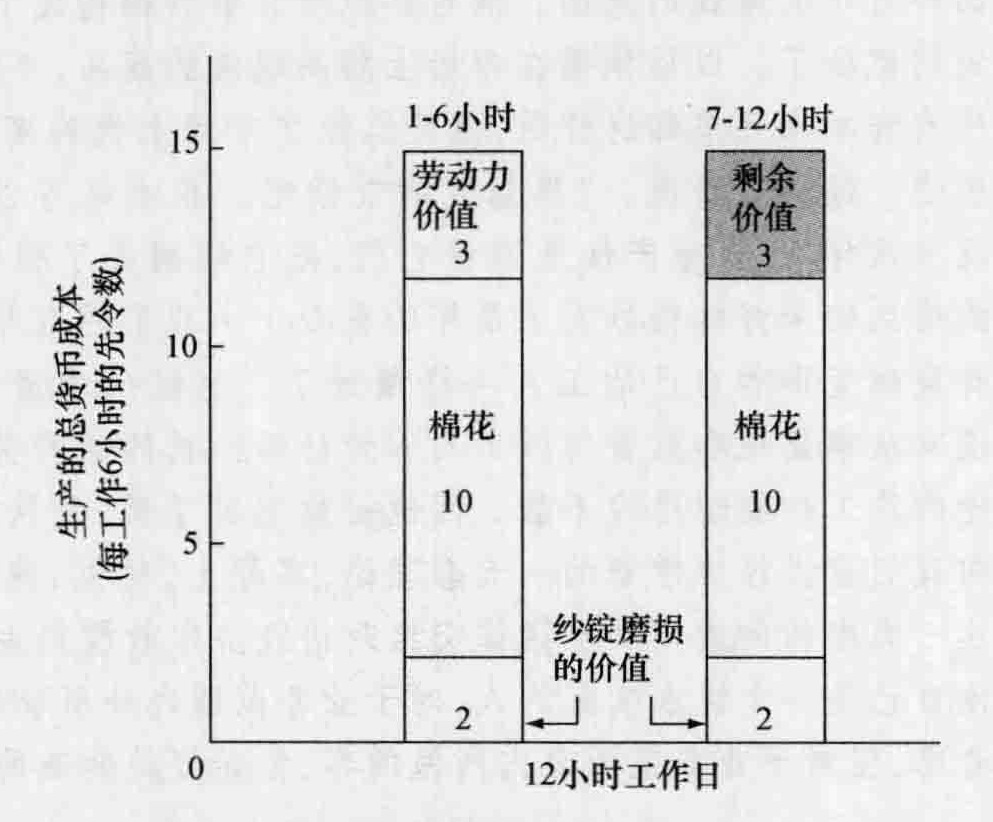
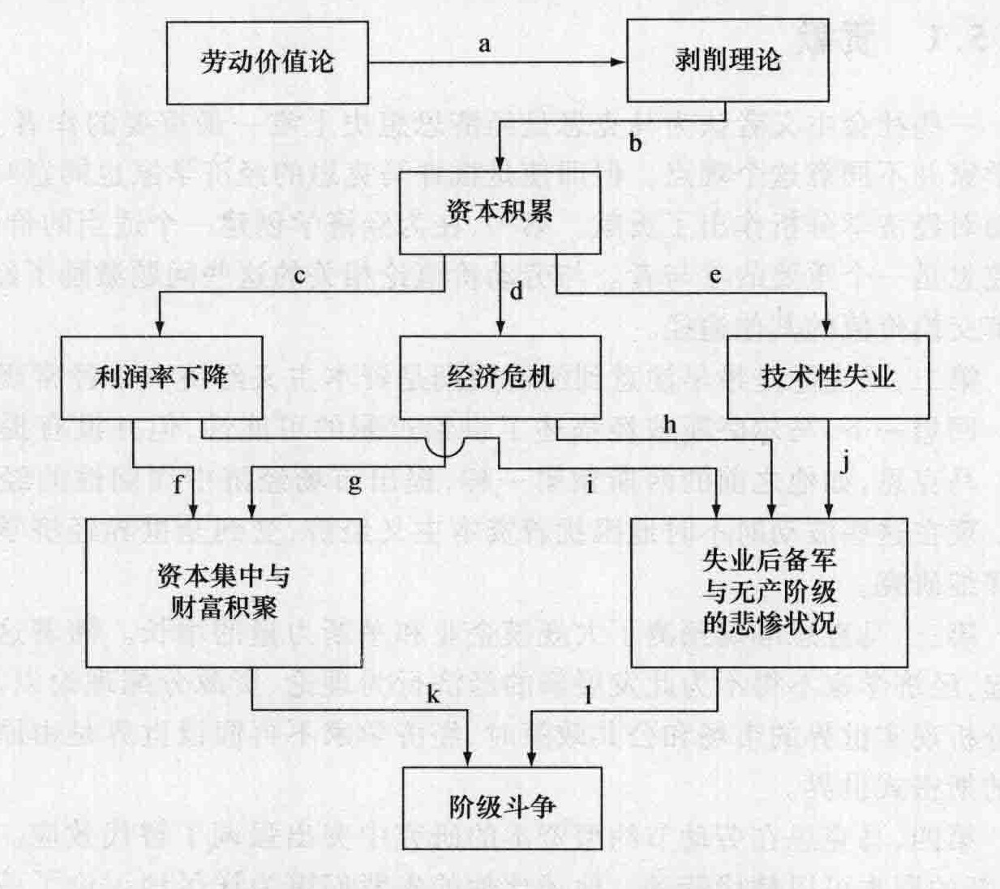

# 第 10 章 马克思的社会主义

批评古典经济学的社会主义批评家鼓吹激进的改革；他们对资本主义和所谓资本主义的邪恶的反对都是道德上的。“科学社会主义”最重要的理论家卡尔 · 海因里希 · 马克思 (Karl Heinrich Marx, 1818—1883) 放弃了这种方法。他试图揭示资本主义内在的矛盾将导致它的最终消亡。马克思相信，在发达资本主义国家内部社会革命是不可避免的，他和他的同胞弗里德里希 · 恩格斯 (Friedrich Engels, 1820—1895) 倡导全世界的工人联合起来加速这一事件。

我们本章的目的是系统地分析马克思的观点。介绍生平细节及影响马克思的各种学术思想之后，我们将研究马克思的历史理论。然后我们详细考察马克思的资本主义“运动规律”的构成。最后，我们将批判性地评价他的思想。

## 10.1 生平细节与影响马克思的各种学术思想

### 10.1.1 生平细节

马克思出身于普鲁士的一个犹太家庭，在他童年时期他的家庭转为奉行新教教义。他曾经在波恩、柏林和耶拿大学学习法律、历史和哲学，23 岁时获得哲学博士学位。两年之后他与一位担任政府高级官员职务的男爵的女儿燕妮 · 冯 · 威斯特华伦结了婚。她是马克思沧桑的职业生涯的忠实伴侣。

由于思想激进，马克思无法在大学谋得教职。于是他转向了报纸杂志，后来被驱逐出德国来到巴黎，在巴黎他研究了法国的社会主义和英国的政治经济学。在那里他遇到了到法国短期旅行的恩格斯。恩格斯成了马克思的亲密朋友、合作者和经济赞助人。两人一起写作了发表于 1848 年的《共产党宣言》。

1849 年马克思被驱逐到伦敦。除了到欧洲大陆的几次短暂旅行外，其余时间他一直居住在英国，他常年在大英博物馆的阅览室里，钻研“复杂的政治经济学分支”。尽管受到疾病、极度贫困、三个孩子夭折的折磨，马克思还是继续研究、写作与组织工人运动。他为《纽约论坛报》(*New York Tribune*) 撰写了大量的文章，依靠稿酬维持生活。他组织和领导了国际工人协会，即“第一国际”，并从 1864 年持续到 1867 年。1867 年马克思出版了他的鸿篇巨制《资本论》的第一卷。马克思去世之后，恩格斯编校了他的手稿，出版了第二卷和第三卷。恩格斯去世之后，将剩余的手稿留给了当时最主要的马克思主义者卡尔 · 考茨基 (Karl Kautsky)，他出版了马克思的另外三卷作品，题为《剩余价值理论》(*Theories of Surplus Value*)。

### 10.1.2 影响马克思的各种学术思想

除了恩格斯之外，还有几个人影响了马克思。主要有李嘉图、早期社会主义者、达尔文、黑格尔和费尔巴哈。

**李嘉图的影响**。马克思研究了斯密和李嘉图的著作，尤其对李嘉图的劳动价值论感兴趣。他认为李嘉图的理论有几个缺陷，于是着手勾画他自己的劳动理论——一个具有革命意义的理论。

**社会主义者的作用**。马克思对前一章讨论过的几位社会主义者的宣言有着清醒的认识。他赞同他们反对当代资本主义的道义愤怒、他们对古典政治经济学的尖锐批评、他们对未来社会的社会主义憧憬。然而，马克思认为，只有当工人阶级的状况恶化到公开反抗时，社会主义才能到来。他试图解释为什么在资本主义制度中这种恶化是不可避免的。

**与达尔文的联系**。查尔斯 · 罗伯特 · 达尔文 (Charles Robert Darwin, 1809—1882) 受到了马尔萨斯的启发，而达尔文的不朽著作又影响了马克思。达尔文称，当他读到马尔萨斯的人口理论时，他大脑突然意识到在他所观察到的争取生存权利的斗争中，那些适应环境的物种将生存下来，而那些不适应环境的物种则将灭亡。这一“自然选择”的结果就是物种的进化。达尔文在 1859 年出版的著名作品《物种起源》中，正式表达了这个理论。

马克思在 1860 年读了达尔文的著作，在他自己思考的政治经济学中看到了相似的倾向。在给恩格斯的一封信中，马克思写道：“在过去四周的时间里，我读了各种各样的书。其中包括达尔文关于‘自然选择’的著作。虽然这本书是以拙劣的英国风格写作的，但这本书却包含了我们观点的自然历史基础。”① 一个月以后，在给拉萨尔 (Lassalle) 的一封信中，马克思写道：“达尔文的书是非常重要的，我将它看作历史上阶级斗争的自然科学基础。”② 对马克思来说，当时经济中的组织关系，就像当时的生物组织一样，是过去的变迁和将要发生的变迁的结果。达尔文强化了马克思的一种观点，即动态的而不是静态的分析，才是达到正确见解的途径。

**黑格尔的影响**。对马克思的思想影响最为深远的是格奥尔格 · 黑格尔 (Georg Hegel, 1770—1831) 提出的辩证法。根据这位杰出的德国哲学家的观点，历史知识与进步是在相反观点相互斗争的过程中产生的。一个现存的观点，或论题，受到一种相反的观点，或反论题的挑战。随之发生的两种观点的斗争使它们转变成为一种新观点，或者综合，然后变成一种新的论题。这个过程会周而复始。马克思修正了黑格尔的辩证法思想，并根据辩证法思想形成了他自己的历史唯物主义理论。

**费尔巴哈的唯物主义**。在通常的用法中，唯物主义 (materialism) 这个词指一个人或一个社会过分强调对消费品的追求。但我们讨论马克思时，不是应用这个定义。哲学上的“唯物主义”指的是强调“物质”，“真实存在的事物”，或者“现实世界”，是与“思想领域”（唯心主义）相对而言的。虽然马克思接受了黑格尔的在历史中的辩证方法，但他用修改了的路德维希 · 费尔巴哈 (Ludwig Feuerbach) 的哲学唯物主义替换了黑格尔的唯心主义。

在《基督教的本质》(*Essence of Christianity*) 一书中，费尔巴哈区分了理想与现实。人们设计了理想化的人类品质，诸如关爱他人、完善的知识和理解力、影响和改变全人类利益的能力，以及“不现实的”诸神等。于是，个人崇拜这些神，似乎他们是超自然或神圣的，即使实际上这些神都是人类想象中的产物。费尔巴哈认为，历史就是人们通过其感观认知逐渐认识与接受现实的过程。

马克思对宗教在某种程度上也持有类似的观点。在 1844 年，他写道：“宗教是人们的鸦片。废除让人们感到虚幻的幸福的宗教，是人类获得真正幸福的需要。”③ 更重要的是，与费尔巴哈一样，马克思强调唯物主义——物质现实的重要性——与黑格尔的唯心主义相反。

## 10.2 马克思的历史理论

马克思将黑格尔的辩证法与唯物主义结合起来发展了自己的历史理论。在每一个历史时期，占主导地位的生产方式或生产力都会产生一套支持他们的生产关系。但是生产的物质力量（技术、资本类型、劳动的技能水平）是动态的，它们不断发展变化。与之形成对比的是生产的物质关系（规章、人们之间的社会关系、财产关系），它们是静态的，是由上层建筑决定的。上层建筑由艺术、哲学、宗教、文学、音乐、政治思想等构成。上层建筑的所有要素都要维持现状。马克思认为历史是一个静态的生产关系（论题）最终与动态的生产力（反论题）相互斗争的过程。结果如何？斗争改革了旧体制，产生了允许生产力进一步发展的新的生产关系（综合和新论题）。颠覆旧社会的机制是阶级斗争。马克思这样描述了历史唯物主义理论：

> 我已经得到的与曾经得到的一般结论将在我的研究中继续作为一条主线，这些结论可以简单归纳如下：人们在社会生产过程中结成了一定的关系，这些关系是不可或缺的，也是不以他们的意志为转移的；这些生产关系是与他们的物质生产力的一定发展阶段相适应的。这些生产关系的总和构成了社会的经济结构，在这个现实基础上产生了法律与政治的上层建筑。这一经济结构也是与一定形式的社会意识相适应的。物质生活的生产方式决定了社会、政治与精神生活的一般特征。并不是个人的意识决定了他们的存在，相反，是人们的社会存在决定他们的意识。当社会的物质生产力发展到了一定阶段，它就会与现存的生产关系，或者——只是同一事情的另一种法律表述——与以前曾经起过作用的财产关系产生冲突。随着生产力形式的进一步发展，这些关系逐渐转变成了束缚生产力发展的障碍。于是就产生了社会变革。由于经济基础发生了变化，整个庞大的上层建筑也或多或少迅速地发生了转变。④

马克思认为社会演进要经过六个阶段。最早的阶段，他称之为原始社会，没有对立的阶级，没有剥削，没有阶级斗争。人们共同拥有土地，共同合作，从自然界费力地获取贫乏的生存资料。生产效率非常低下，在满足劳动者本人及其家属的基本生存资料之外，劳动者往往不能生产出剩余。因此，奴隶和剥削是不可能出现的，因为这要求劳动者生产出为了生存消费所必需的之外还有剩余。在欧洲人到达美洲之前，美洲印第安人社会就是一个原始社会的例子。

生产效率逐渐地提高到一定的水平，劳动者生产出多于其基本生存资料的产品。于是奴隶变得有利可图，剥削与阶级斗争也开始出现。这里马克思所指的是古老的奴隶制度，如希伯来、埃及、希腊、罗马等；并不是指出现在美国的奴隶制度，他认为美国是存在于一个资本主义社会中的无政府主义制度。奴隶制度使社会生产力获得了一次更高的发展，但最终它也成为生产力进一步发展的障碍。奴隶不能得到最好的激励，奴隶的反抗动摇和分裂了奴隶社会。最后奴隶制度被推翻且由封建制度取代，这是适应新的生产力的一套新型生产关系。

马克思认为封建制度是特殊的，因为对农奴的剥削非常显而易见。在奴隶制度下，虽然奴隶确实获得了维持生存的资料，但是看上去他们从劳动中一无所获。在资本主义制度下，尽管资本家实际上占有了一部分未付酬的劳动时间，但是看上去工人的全部劳动时间都获得了报酬。在封建制度下，农奴被允许在分配给他们的土地上每周劳动几天，但是其他时间被迫在地主的土地上耕种。这就是十分明显的剥削。农奴有更大的激励比奴隶工做得更好，封建制度也为社会生产力带来了一次更高的发展。但是这一制度最终也限制了生产力的进一步发展，最终被资本主义制度推翻并取代。

虽然马克思强烈地憎恨资本主义制度，但他称赞资本主义解放了生产，极大地提高了生产力。然而，资本主义也存在内部矛盾，将产生阶级斗争并导致最终被推翻。马克思认为，在资本主义制度下，生产技术变得高度集中化，资本的私人所有权制度成为生产力进一步发展的障碍。越来越多的失业人数的增加和“工人阶级的贫困”，引起了工人起义。国家成为资本家对抗工人的一种工具。但是工人阶级获得了胜利，推翻了资产阶级政权，建立起自己的无产阶级专政。在这种社会主义制度下，消费品的私人所有权是得到允许的，但是资本与土地由中央政府、地方政府或国家设立和管理的合作社公有。随着作为经济引导力量的利润动机和自由市场的消除，生产是计划的，投资率也是计划的。辩证的过程还会继续，直到最终国家消亡，纯粹的共产主义制度确立。

## 10.3 资本主义社会的“运动规律”

以历史唯物主义理论作为依据，马克思试图“揭露现代社会的经济运动规律”。他没有描绘一幅社会主义的蓝图，这不是他的目标。他想要分析的是在资本主义社会内部不断变革的生产力。换句话说，他想要确定的是，在资本主义内部，生产力产生它的相反论题并不可避免地走向灭亡的过程，就像以前的奴隶制度和封建制度一样。

马克思采用六个相互联系的重要概念构建了他的资本主义理论：劳动价值论、剥削理论、资本积累与利润率下降、资本积累与经济危机、资本集中与财富积聚、阶级斗争。每一个概念都需要详细说明。

### 10.3.1 劳动价值论

马克思的分析起点是资本主义社会的“商品”。马克思认为，商品就是为获得利润而生产出来的产品，并且具有满足人们需求的能力，不管这种需求是“来自胃还是来自想象”。这种商品可以作为生活资料直接满足人们的需求，也可以作为生产资料间接满足人们的需求。使用价值构成了一切财富的存在形式。马克思并没有试图从数量上衡量使用价值，他也没有考虑随着商品数量增加其效用递减的问题。因此，他说较大的小麦产量，比之较少的小麦产量，代表了更多的效用，进而代表了更大的财富。这是正确的，即使需求缺乏弹性，更多数量的小麦可能产生较少的交换价值。

除了具有使用价值或效用，商品还具有交换价值，通常简称为“价值”。什么决定商品的价值？马克思的重要回答是：在社会正常的生产条件下、在社会平均的劳动熟练程度和劳动强度下，生产该商品所需要的社会必要劳动时间。社会必要劳动时间包括生产该商品的直接劳动、该商品生产过程中使用的机器与原材料所包含的劳动、在生产过程中转移到该商品上的价值。

假设一双鞋子包含的平均劳动时间是 10 小时。这个社会的平均必要劳动时间决定鞋子的价值。如果一个工人不熟练或懒惰而花费了 20 小时生产一双鞋子，鞋子的价值仍然只有 10 小时。假设一个工人或雇主在技术和效率上领先，生产一双鞋子只需要 5 小时劳动，鞋子的价值仍然还是 10 小时，是整个社会的平均劳动成本——即社会必要劳动时间。

商品的价值是由单位简单平均劳动来衡量的。熟练劳动是不熟练劳动的数倍。因此，一个工程师 1 小时的生产性劳动创造的价值可能相当于 5 小时简单劳动创造的价值。市场将各种不同熟练程度的劳动时间均等化，形成不熟练劳动的共同分母。

市场还以隐含的劳动成本为基础决定价格。一种商品，例如黄金，就成为反映所有价值的一般等价物。1 件大衣可以与 2 盎司黄金相交换，因为二者在生产过程中需要相同数量的社会必要劳动时间。如果 2 盎司黄金被铸成 2 英镑货币，那么 1 件大衣就会卖 2 英镑。供给与需求的暂时波动会使价格偏离真实价值，有时高于价值，有时低于价值。价格的持续振荡使其可以互相抵消和缩小，达到反映商品价值的平均价格。

马克思的劳动价值论与李嘉图的劳动价值论有着重要区别：马克思认为劳动时间决定商品与服务的绝对价值；李嘉图则认为不同商品的相对价值与各自包含的劳动时间成比例。马克思认为他的劳动价值论剔除了一种错觉（这里又一次用到了唯物主义）：土地与资本所有者对商品价值形成作出了贡献。这样，他的理论打开了劳动剥削理论的大门。

### 10.3.2 剥削理论

在《资本论》第一卷中，马克思假设所有的商品都按照它们的价值出售。那么，资本家怎样才能获得利润呢？按照马克思的观点，答案是通过购买一种能够创造出比它自身价值大得多的商品。这种商品就是劳动力！这里我们必须仔细区分马克思的劳动力与劳动时间的概念。

**劳动力与劳动时间**。劳动力指一个人劳动和生产商品的能力；劳动时间是工作的实际过程和劳动的持续。劳动力本身是一种在市场上买卖的商品；它是资本家创造利润所需要的。什么决定劳动力的价值？马克思认为，答案是生产劳动力及其家庭所消费的生活必需品需要的社会必要劳动时间。如果这些生活必需品能够每天花费 4 小时生产出来，那么劳动力商品的价值就是每天 4 小时的劳动时间。如果劳动生产率提高一倍，生活资料可以每天花费 2 小时生产，劳动力的价值就会下降 50% [ (4-2) / 4 ]。这里需要强调非常重要的两点。第一，雇主支付给工人的工资等于工人的劳动力价值；也就是说，他们支付市场工资。但是，第二，这个市场工资仅够用来购买维持与延续劳动力所必需的生活资料。在马克思看来，维持生活资料的工资并不是由于人口的过快增长——他极力反对马尔萨斯的人口原理。然而，马克思认为是资本主义制度造成了大量的“失业后备军”，这种劳动供给过剩决定了在长期内平均工资将会保持在基本生活工资的水平上。

**剩余价值**。如果劳动生产率极其低下，工人消费的商品的价值等于他们创造的刚好满足生存的产出的价值，那么对工人的剥削——资本家榨取剩余价值——将不可能发生。在这种情况下，一天的劳动力价值就是一天的劳动时间。按照马克思的观点，只有当工人每天能够生产的价值高于维持他们自身及其家庭所必须消费的价值时，对劳动的剥削才会出现。雇主付给工人全部的劳动力市场价值，但日工资只是劳动力所创造的价值的一部分。通过他们的资本所有权，资本家拥有了工人为生存而不得不进行的劳动：支付报酬的工作。因此，资本家能够延长工作日，在某种意义上对工人来说，“我们制定或选择的工作时间长短根本不是为了我们自己”。生存需要迫使工人们选择了工作。但是他们在工作日上耗费的劳动时间，创造了远远高于他们的劳动力价值——即生存成本——的价值。生产资料的所有者获得了剩余价值。

马克思举了一个数字例子来阐释这些思想，我们总结为图 10-1。假设典型的工人及其家庭每天必须消费的商品包含的社会必要劳动时间是 6 小时。工人每个工作日工作 12 小时（通常情况），一半时间的劳动就可以形成 1 天的劳动力价值。如果生产 3 先令中包含的黄金也需要半天的社会必要劳动时间，那么 3 先令就代表了 1 天的劳动力价值。如果这就是工资率，那么工人就得到了他们出卖的劳动力这一商品的全部价值。⑤

*图 10-1 马克思的剥削理论*

> 根据马克思的观点，资本家按照劳动力的市场价值支付给工人工资，在本例中是 3 先令。但是只需要 6 小时的劳动时间就可以生产出足够的产出来支付劳动力工资。通过让工人每天工作 12 小时，资本家得到了 3 先令的剩余价值（阴影部分）。这个剩余价值来自对劳动的剥削。在这里，剥削率是 1（3 先令的剩余价值除以支付的 3 先令工资），或者是 100%。

资本家雇用工人，提供必要的机器设备和原材料。假设在 6 小时的劳动时间中每个工人可以将 10 磅棉花纺成 10 磅棉纱。让我们再假设这 6 小时劳动时间内消耗掉的棉花价值 20 小时的劳动或 10 先令。最后，假设在半天的劳动中，纱锭的磨损相当于 4 小时的劳动或者 2 先令。⑥ 因此，每半天生产出来的棉纱总共价值 30 小时的劳动时间：6 小时的劳动力，20 小时的棉花，4 小时的纱锭磨损。注意图 10-1 左边方框表示生产的总货币成本为 15 先令：劳动力 3 先令，棉花 10 先令，纱锭磨损 2 先令。如果利润不能来自贱买贵卖，并且如果所有商品都按照它们的价值出售，那么棉纱必须以 15 先令出售。

> 我们的资本家愣住了。产品的价值正好等于预付资本（不变资本加上包含劳动的可变资本）的价值……他们会说：“哦！我预付自己货币的意图是要由此生产出更多的货币。”但是，通向地狱的道路是由良好的意图铺成的；他不进行生产，也同样可以有赚钱的意图。他对其他所有事物都构成了威胁。他说人们再也抓不住他的把柄了。以后他要在市场上购买现成的商品，不再自己制造。但是，如果他的所有资本家兄弟都这样做，他又怎能在市场上找到商品呢？而他又不能拿货币当饭吃。他进行劝说。“想想我的节欲吧。我本来可以把 15 先令挥霍掉。但是我没有这样做，我生产性地消费它们，把它们制成了棉纱。”就算这样吧。可是他为此得到的是好的棉纱而不是坏的良心……我们这位朋友刚才还以资本自傲，现在却突然变得和自己的工人一样谦逊了。他说：“难道我自己没有劳动吗？难道我没有从事监视和监督纺纱工人的劳动吗？我的这种劳动不也创造价值吗？”但是，他的监工和经理忍俊不禁。而他得意地笑了笑，又恢复了他原来的面孔。他反复向我们宣讲经济学家的一大套理论，实际上，他说，他不会为此花费一文钱。他把这一类虚伪的遁词和空话都交给政治经济学教授们去讲，他们是为此而被雇用的。他自己是一个讲求实际的人，对于业务范围之外所说的话，虽然他并不总是很好地考虑，但对于业务范围之内所做的事，他始终是知道的。⑦

要解决资本家难题，在本例中答案就是把 6 小时的工作时间延长。可以从图 10-1 中看到，如果工人每天再工作 6 小时，就会多生产出 10 磅的棉纱。这额外的 10 磅棉纱在市场上也是价值 15 先令，但是它们只花费了资本家 12 先令（0 先令劳动 + 10 先令棉花 + 2 先令纱锭磨损的价值）。这样，资本家获得了 3 先令的利润或剩余价值。工业资本家利润的一部分可以以利息的形式转移给银行家，一部分可以以地租的形式转移给地主，也可以以商业利润的形成转移给商业资本家，这些都无关紧要。所有的这些利润收入都是来自生产过程中对劳动的未被察觉的剥削。马克思认为，在资本主义制度下所有的劳动都得到报酬的表象是个幻想。资本家不是抢夺工人的罪人：“揭示这种决定劳动力价值的方法，即由事物本身的性质规定的方法，是一种残酷的方式，这种揭示只能算是一种廉价的同情。”⑧ 他们向工人支付了市场工资，但是他们不会理解的残酷事实是他们自己的利润来源于对劳动的剥削。

**剩余价值率**。马克思将投资于机器与原材料的那部分资本称作不变资本 c。这种资本的价值转移到最终的产品中去，价值不会增加。用于购买劳动力、支付工资的那部分资本，是可变资本 v，它能够生产出大于自身价值的价值。劳动力生产出来的被资本家无偿占有的额外价值，是剩余价值 s。剩余价值率 s'，或剥削率，由公式 (10-1) 给出：

s' = s / v (10-1)

请注意剩余价值率是剩余价值与可变资本的比率。它也可以被认为是未被支付的劳动时间与已被支付的劳动时间的比率。在图 10-1 的例子中，s' = 1 或 100%。因为 s = 3, v = 3 (3 / 3 × 100%)。或者，用第二种定义，是 6 小时除以 6 小时。如果工作时间延长到 15 小时，剩余价值率就是 150% (9 / 6 × 100%)。如果工作时间减少到 9 小时，剩余价值率将是 50% (3 / 6 × 100%)。

工作日的长度多少是合适的呢？马克思写道：

> 资本家要坚持他作为买者的权利，他尽量延长工作日，如果可能，就把一个工作日变成两个工作日。可是另一方面，这个卖出的商品的特殊性质给它的买者规定了一个消费的界限，并且工人也要坚持他作为卖者的权利，他要求把工作日限制在一定的范围内。于是这里出现了二律背反，权利同权利相对抗，而这两种权利都同样是商品交换规律所承认的。在平等的权利之间，力量就起决定作用。所以，在资本主义生产的历史上，工作日界限的决定本身就是斗争的结果，这是全体资本家即资本家阶级和全体工人即工人阶级之间的斗争。⑨

即使不延长工作日，也可以通过提高生产效率从而降低劳动力价值而增加剩余价值。如果工人的必需品能够在更短的时间内生产出来，新价值中就有更大的份额归属于资本家。假设工作日从 12 小时缩短到 10 小时，但劳动时间的划分不是 6 小时为工人自己劳动、6 小时为资本家劳动，而是 4 小时为工人劳动、6 小时为资本家劳动。那么剥削率将会从 100% (6 / 6 × 100%) 提高到 150% (6 / 4 × 100%)。

**利润率**。马克思所说的利润率 (p') 指的是剩余价值与投入的总资本的比率，用公式表示如下：

p' = s / (c + v) (10-2)

再用图 10-1 中的数据进行计算，我们可以发现本例中的利润率是 11.1% (3 先令 / 27 先令 × 100%)。

**转化问题**。公式 (10-2) 有助于说明马克思所说的“重大矛盾”或“转化问题”。⑩ 考虑以下命题：

1.  马克思在《资本论》第一卷中假设所有的商品都按照它们的价值出售。
2.  公式 (10-2) 中的劳动力 v，是价值的唯一源泉。
3.  根据命题 (1) 可以得知：使用相对较多数量的机器与原材料 c 和相对较少数量劳动力 v 的行业，比那种使用相对较少数量不变资本 c 和较多数量劳动力 v 的行业，将获得较少的剩余价值 s 和较低的资本利润率 p'。这是由于劳动是可被剥削而创造利润的唯一的商品。
4.  命题 (3) 与马克思自己观察到的现象是矛盾的：使用较多资本与较少劳动力的高度机械化的行业，与使用较少资本与较多劳动力的行业有至少一样高的利润率。像古典学派的经济学家一样，马克思也认为各行业之间的利润率有均等化的趋势。
5.  如果各行业之间的利润率是一致的，而资本-劳动比率却是不同的，那么商品就不会像马克思在第一卷假设的那样按照它们的价值出售。这似乎在马克思的分析中是一个重大矛盾。

马克思在写作《资本论》第一卷之前就意识到了这一问题，并试图在第三卷解决这个问题。他的结论是，在生产成本一定的情况下，资本密集型行业的商品将按照高于它们价值的价格出售，而劳动密集型行业的商品将按照低于它们真实价值的价格出售。因此，按照马克思的观点，劳动价值论仍然成立，只是在作为一个整体的资本主义制度内成立。单个商品以高于或者低于它们价值的价格出售，以便整个经济中利润率实现均等。关于马克思是否成功地解决了这个转化问题存在许多争议。一个有缺陷的劳动理论在他的整个资本主义发展理论中有什么影响也存在着争议。⑪

### 10.3.3 资本积累与利润率下降

根据马克思的观点，资本家得到的利润率——公式 (10-2) 中的 p'——在长期中会呈下降趋势。原因是机械化和劳动节约型发明导致了生产效率的提高。它提高了马克思所谓的资本有机构成，表示为公式 (10-3) 中的 Q。请注意它是不变资本 c 与总资本 c+v 的比率。

Q = c / (c + v) (10-3)

另外一个利润率公式用公式 (10-4) 来表示，它可以从公式 (10-2) 和 (10-3) 中推导出来⑫：

p' = s'(1 - Q) (10-4)

注意这个新公式表明利润率 p' 与剩余价值率 s' 成同方向变化，与资本有机构成 Q 成反方向变化。因此，如果资本家相对较多地投资于机器而较少地投资于劳动力，那么 Q 将上升而 p' 将下降。这对马克思来说是至关重要的一点。想一下资本主义面临着加速其灭亡的内部矛盾。使用较多资本的驱使降低了利润率；劳动力是一切价值包括剩余价值的源泉，随着使用的工人数减少，利润率下降了！但是如果价值与利润仅仅是由劳动创造的，资本家不会有动力使用更多的劳动和较少的资本呢？马克思的答案是“不会”。他认为资本主义的动态运动将不可避免地导致资本有机构成提高。这主要有两个原因。第一，那些使用质优量多的不变资本的企业，率先提高生产效率，将会通过降低生产成本而暂时获得额外的利润。最终，成本的下降会导致产品价格的下降，那些在某一行业中落后于机械化进程的资本家将不能生存下去。第二，生产效率越高，劳动力价值——需要生产生活必需品的小时数——就越低，每个工作日生产出来的利润总量就越高。

资本对劳动的替代还有另一个效应：产业后备失业大军的规模上升了。机器排挤了工人，用现代术语来说，就是技术性失业。个别资本投资的增加导致了“资本集中的不断增长（伴随着资本家数目的不断增多，尽管程度并不相同）”。

马克思发现还有某些力量抵消了利润率下降的趋势。第一，剥削的强度，公式 (10-4) 中的 s' 可以通过强迫工人加快工作节奏或者延长工作日而提高。第二，工资可以暂时削减到劳动力价值以下。第三，不变资本可以变得更便宜。不变资本与劳动的比率是一种价值关系，随着机器与原材料变得越来越便宜，资本有机构成提高的速度与利润率下降的速度都变得越来越慢了。第四，相对于工作的劳动人口的增加和技术性失业工人的增加都有利于成立使用较多劳动与较少资本的新工业。这种高利润率的行业也参与了整个经济系统的利润率均等化过程。第五，对外贸易通过降低不变资本与生活必需品的价格而提高了利润率。第六，在殖民地的资本投资可以获得更高的利润率，因为不变资本与可变资本的比率较低，而且对殖民地工人的剥削比对国内工人的剥削程度更高。⑬ 第七，通过提高生产率降低劳动力的价值，剥削率提高了。

请注意在一定程度上抵消利润率下降的这几个因素都提高了剥削率，加剧了无产阶级的“贫困化”。因此，阶级意识加强了，革命的可能性增加了。

### 10.3.4 资本积累与经济危机

马克思认为，利润率下降只是资本主义无法解决的问题之一，另一个趋势是日益严峻的经济危机。

马克思反对萨伊定律，称它最多只适用于简单商品生产。自给自足的手工业工人，目的在于获得使用价值，他们生产商品是为了交换他期望消费的其他商品。织麻布者卖掉麻布，用得到的货币来购买食物。这个过程可以用 C→M→C 来表示，其中的两个 C 分别代表麻布与食物。这些商品具有相同的交换价值和不同的使用价值。货币 M 仅仅是交换的媒介。

但即使是简单的商品生产下也有产生危机的可能：

> 有一种最愚蠢不过的教条：商品流通必然造成买和卖的平衡，因为每一次卖同时就是买，反过来也是一样。如果这是指实际完成的卖的次数等于买的次数，那是毫无意义的同义反复……没有人买，也就没有人能卖。但谁也不会因为自己刚刚卖出，就必须马上买入。流通之所以能够打破产品交换的时间、空间和个人的限制，正是因为它把在物物交换中存在的换出自己的劳动产品和换进别人的劳动产品这二者之间的直接的同一性，分裂成卖和买这二者之间的对立……如果买与卖的时间间隔很明显，它们之间的密切联系即同一性就要通过导致危机而显示出来。⑭

在大规模的资本主义生产条件下，交换的过程变成了 M→C→M'，人们是为了卖而买，而不是为了买而卖。货币变成同劳动力、原材料和机器等一样的商品。商品的出售是为了得到货币。但如果两个 M 是相等的，这个过程就说不通了。所以，对资本主义过程的正确描述应该是 M→C→M'，其中 M' 大于 M 的部分就是资本家从生产性工人身上榨取的剩余价值。这就是扩大的投资过程。“积累，再积累！这才是摩西和先知的法则！”

资本与劳动力投资的迅速增加暂时提高了对劳动力的需求，提高了资本家必须支付的工资。但是这部分高工资降低了剩余价值率和利润率，抑制了扩张，使经济向相反的方向发展。由此产生的萧条摧毁了固定资本的货币价值，使得一些较大的资本家可以以便宜的价格兼并小的资本家。而且，一些工厂倒闭，商品价格下跌，信用萎缩，工资下降。剩余价值率和利润率得到恢复，投资再次增加。“在资本主义限度内，当前的生产停滞为下一次的生产扩张做好了准备。”按照马克思的观点，每一次经济周期都比前一次规模更大，加剧了阶级斗争和社会变革的产生。⑮

### 10.3.5 资本集中与财富积聚

资本积累的动态过程和经济危机重复出现的趋势，使得资本所有权集中，财富积聚到少数人手中。

> 资本所以能够在一个地方大量增长，是因为它在另一个地方被许多人失掉……竞争斗争是通过使商品便宜来进行的。在其他条件不变时，商品的便宜取决于劳动生产率，而劳动生产率又取决于生产规模。因此，较大的资本战胜较小的资本。而且，我们记得，随着资本主义生产方式的发展，在正常条件下经营某种行业所需要的单个资本的最低限量提高了。因此，较小的资本挤到那些现代工业还只是零散地或不完全地占领的生产领域中去。在那里，竞争的激烈程度同互相竞争的资本的数量成正比，同互相竞争的资本的规模成反比。竞争的结果总是许多较小的资本家垮台，他们的资本一部分转入胜利者手中，一部分归于消灭。除此而外，一种崭新的力量——信用体系，随同资本主义的生产而形成起来。
>
> 起初，信用体系作为积累的小小助手不声不响地挤了进来，通过一根根无形的线把那些分散在社会表面上的大大小小的货币资金吸引到单个的或联合的资本家手中；但是很快它就成了竞争斗争中的一个新的可怕的武器；最后，它变成一个实现资本集中的庞大的社会机构。⑯

### 10.3.6 阶级斗争

财富积聚到越来越少的资本家手中，与工人的绝对贫困及相对贫困一起，为阶级斗争创造了条件。越来越多的遭受“贫困、压迫、奴役、贬低、剥削”的工人提高了他们团结起来进行反抗的意识。“资本主义私有制的丧钟敲响了。剥夺者要被剥夺了。”资本主义制度的生产关系与生产力产生了冲突，而且前者将“迅速发生变革”。工人将推翻资本家的统治，建立无产阶级专政。生产资料的国家所有取代私人所有，资本扩张的速度达到平衡，对工人的剥削消除了。在某种意义上，工人变成资本的所有者。

## 10.4 资本主义运动规律：一个总结

图 10-2 总结了马克思的资本主义运动规律。如我们所指出的那样，他的劳动价值论是整个理论的出发点。工人是所有价值的源泉，但是如箭头 a 所示，劳动力并不能得到所有的价值。而资本家只支付给工人其劳动力的价值。这个价值小于产出的价值，差额部分是资本家以所有权收入的形式占有的剩余价值。如箭头 b 所示，剩余价值是资本积累的源泉。箭头 c、d、e 分别表示资本积累产生了下降的利润率、逐渐恶化的经济危机和技术性失业。所有这三个方面都扩大了失业后备军的规模，直接或间接地加剧了无产阶级的悲惨状况（箭头 h、i、j）。利润率的下降和经济危机的恶化还导致了资本集中和财富积聚（箭头 f 和 g）。如箭头 k 和 l 所示，这个过程的最终结果是阶级斗争。

这个资本主义发展理论显然是站在与亚当 · 斯密不同的立场上。建议读者将图 10-2 与图 5-1 相比较来证实这一点。

*图 10-2 马克思的资本主义“运动规律”*

> 按照马克思的观点，因为劳动是一切价值的源泉，所以剩余价值和利润都来自对工人的剥削（箭头 a）。资本家之间的竞争导致了资本积累（箭头 b），它引起了利润率下降、经济危机和技术性失业（箭头 c、d、e）。这些结果产生了资本集中与财富积聚（箭头 f 和 g），同时加剧了失业和贫困（箭头 h、i、j）。资本家与工人的两极分化最终导致了阶级斗争（箭头 k 和 l）与资本主义的灭亡。

## 10.5 对马克思经济学的评价

马克思在几个方面对经济思想的发展作出了贡献。但是，他的分析在几个方面也存在着缺陷。

### 10.5.1 贡献

一些社会主义者认为马克思是经济思想史上唯一最重要的作者。当然，大部分经济学家并不同意这个观点。但即使是批评马克思的经济学家也同意马克思在以下几个方面对经济学分析作出了贡献。第一，在为经济学创建一个适当的价值理论的努力中，马克思是一个重要的参与者。与劳动价值论相关的这些问题激励了经济学家们去探索理解交换价值的其他途径。

第二，马克思是最早注意到经济周期是资本主义经济一个经常现象的经济学家之一。回想一下，马尔萨斯曾经描述了供给过剩的可能性，但并没有提出经济周期的观点。马克思，如他之前的西斯蒙第一样，提出市场经济中周期性的经济高涨和下降趋势。现在这些波动时不时地困扰着资本主义经济，受到全世界经济学家的强烈关注并被详细研究。

第三，马克思准确预测了大规模企业和垄断力量的增长。随着这种形式的企业的兴起，经济学家不得不为此发展新的经济行为理论、资源分配理论以及收入分配理论；在分析现实世界的市场和公共政策时，经济学家不再假设世界是由原子式竞争企业构成的斯密式世界。

第四，马克思在劳动节约型资本的研究中突出强调了替代效应。确实在某些情况下，新的资本可以替代劳动。他还比他的先辈们更为详尽地讨论了劳动节约型创新的观点。最后，马克思还通过强调动态的而不是静态的分析，对经济学作出了贡献。后来的制度学派、增长学派以及奥地利学派的经济学家都强调动态方法。

### 10.5.2 分析的缺陷

马克思对资本主义“运动规律”的分析有几个缺陷。我们对它们的讨论将围绕图 10-2 所总结的马克思理论的主要思想展开。

**劳动价值论的缺陷**。马克思的劳动价值论存在几个问题。现代经济学家驳斥了工人是一切交换价值的来源的观点。土地和资本也是生产性的资源，它们独立于并超出使它们都够生产的劳动的价值之外。因此，土地和劳动力资源的所有者都应该得到足够的回报，以便可以继续使用这些资源来生产某一特定商品。资本的一部分确实是由过去的劳动创造的，但是过去的劳动已经被按照它创造资本过程中的贡献支付了报酬。于是资本就变成了可以独立买卖的资源。这样，资本就可以在生产它时所使用的劳动之外创造价值。

一个技术方面的批评就是先前提到的与马克思的劳动价值论相关的“转化问题”。其他的技术性问题据称也存在。例如，在《资本论》第一卷中，马克思假设在所有行业剩余价值率趋于一致，目的是说明劳动是所有价值的唯一源泉。但正如埃德温 · 韦斯特指出：

> 但是如果剥削率在所有行业都是相同的，那么工作的小时数也应该是一致的。于是马克思坚持事实就是如此，并引用了当代的证据来支持他的观点。然而，对他的资料（19 世纪的工厂监工的报告）的严格考察却并没有证实他的预测。数据显示出与其竞争的、由杰文斯最先提出的新古典假设更为一致，即由于工人对劳动与闲暇的偏好不同，劳动的小时数不同。⑰

**马克思的剥削理论中存在的问题**。按照马克思的观点，由于有大量失业后备军的存在，支付给工人的工资会趋向于维持基本生活的水平。工人们被迫工作足够长的时间，以便为资本家创造剩余价值。但是并没有这么多失业后备军。人们通常是失业后又摆脱失业，在失业大军中的人通常都是暂时性失业。长时期的大规模失业只是例外现象，而不是资本主义国家的规律。在相对充分就业的条件下，资本家之间必然会相互竞争以吸引高素质的工人，就像工人之间为了得到一份较好的工作而竞争一样。资本家纷纷提高工资，改善工作环境，缩短工作时间，或者同时采取这三种措施。从历史上看，在马克思的著作问世后的几十年时间里，真实工资水平得到了极大的提高，而且在大多数工业化国家，劳动力占国民收入的份额或者得到了提高，或者保持了相对稳定。

**马克思对资本积累分析的缺陷**。从图 10-2 中可以得知，马克思相信资本积累导致利润率下降、恶化的经济危机及技术性失业。现代经济学家认为虽然这些结果在理论上来说是可能的，但是在理论上还有其他一些可能的结果存在，而且事实上常常导致后面这些结果。确实，资本深化——资本的增长速度快于劳动力的增长——降低了资本的回报。但是还有其他一些因素在起作用。特别是新技术提高了资本的生产率，抵消了利润率下降的趋势。从历史上看，资本收益率和利润率是随着经济周期波动的，而不是呈下降的趋势。

资本积累和恶化的经济周期又如何呢？同样，迅速扩张的资本确实会导致生产能力过剩，接着带来过量存货、生产缩减、失业增加等后果。正如我们所说的那样，马克思在这方面的贡献是很重要的。但是投资繁荣并不是常态。在许多时期，投资的增长与稳定的经济增长步调是一致的，而不是与即将到来的经济危机一致。

资本积累是否如马克思所说的那样引起了失业呢？如果资本只是劳动在生产过程中的替代品，那么答案也许是肯定的。但即使在这种情况下，较低的生产成本也可能造成一个行业规模的充分扩张，从而使总就业水平保持不变甚至上升。而且，许多类型的资本在生产过程中是劳动的互补品。例如，一家新工厂需要雇用一些新工人，也就是说，导致劳动需求的增加以及可得的岗位数量的增加。要点在于不变资本的积累并不必然引起失业。在《资本论》出版后一个多世纪以来，资本积累一直伴随着总就业量的快速增加，尽管股本增加与就业增长的关系因行业有所不同。

**阶级斗争观点中存在的问题**。马克思“阶级斗争将不可避免”的预测建立在他的剥削和资本积累理论的基础之上，资本积累造成了下降的利润率、加剧的经济危机及技术失业。我们认为这些理论存在严重的缺陷。历史表明，工人和资本家分化为两个对立的阶级的情形并没有发生。相反，在大多数发达资本主义国家出现了强大的中产阶级。中产阶级的成员包括小商业主、自我雇佣职业者、领取工资的科学家、工程师、教师、销售员、广告商、管理人员，等等。马克思知道下述情况肯定会感到惊诧，即在一定程度上要感谢资本积累，工人收入的积累是国民储蓄增长的主要来源。他还会诧异地发现许多工资收入者都有使他们步入社会中产或者中上“阶级”的年收入。

马克思认为，国家充当整个资产阶级的执行委员会，将会确保资产阶级对无产阶级压迫的条件。马克思却没有看到国家也会受到影响而改善经济条件。他也没有预见到福利中央集权制、公共事业管制、确立工会组织罢工权利的法律、财政和货币政策，等等。⑱ 他也没有理解资本家阶级作为一个整体的利益并不一定与其中每个人的利益相一致。例如，单个的资本家可能会抵制对支付养老金规定上限。但是当所有资本家都不得不在同等条件下给予养老金时，负担就不是那么重了，因为只有某一个资本家付出这一成本时，他就必须牺牲竞争的优势。

具有讽刺意味的是，成功的马克思主义革命并没有发生在马克思预期的发达资本主义国家（如英国、法国、德国）。发生革命的国家（苏联、中国）很遗憾在革命当时缺乏资本积累。历史证据并没有支持马克思的阶级斗争理论。

---

① Enrique M. Ureña, "Marx and Darwin," *History of Political Economy* 9 (Winter 1977): 549.

② Ureña, "Marx and Darwin," 549.

③ Karl Marx, F. Engles, V. I. Lenin, R. Luxemburg, and L. Trotksy, *Marxism, Socialism & Religion* (Australia: Resistance Books, 2001), 20.

④ Karl Marx, *A Contribution to the Critique of Political Economy*, trans. N. I. Stone (Chicago: Kerr, 1913), 11—12.

⑤ 在这个例子中，1 小时劳动力的价值也可以用半先令来表示；就是说，劳动力在 12 小时的工作日中将会生产价值 6 先令的黄金。

⑥ 为了理解这一假设，假设一个工人操作的所有纱锭在 10 天之后都会毁耗。再假设制造纱锭需要 80 小时。这 80 小时属于生产棉纱所需的社会必要劳动时间的一部分。纱锭损耗以后，其价值会再现在棉纱中。在半天的时间里，工人用完纱锭价值的 1/20 (0.5 天 / 10 天)，这部分价值转移到棉纱中；这就是 4 小时的劳动时间 (1/20 × 80 小时)。从货币角度看，假设每个使用的纱锭价值 40 先令。因为它们可以使用 10 天，因此在每半天时间里就会有 2 先令转移到棉纱的价值中（4 先令每天 × 0.5）。

⑦ Karl Marx, *Capital*, vol. 1 (Chicago: Kerr, 1906), 212—215 [orig. pub. in 1867].

⑧ Marx, *Capital*, 1:192.

⑨ Marx, *Capital*, 3:190.

⑩ 这里我们的目的是勾勒出转化问题的本质。罗纳德 · L. 米克在他著作的第 5 章给出了关于此问题的详尽而容易理解的讨论，请参见：Ronald L. Meek, *Smith, Marx, and After: Ten Essay on the History of Economic Thought* (London: Chapman & Hall, 1977).

⑪ 例如，参见：Meek, *Smith, Marx, and After*, chapters 5-7。再参见：Paul Samuelson, "Understanding the Marxian Notion of Exploitation: A Summary of the So-Called Transformation Problem between Marxian Values and Competitive Prices," *Journal of Economic Literature* 9 (June 1971):399—431。琼 · 罗宾逊 (Joan Robinson)、马丁 · 布朗芬布伦纳 (Martin Bronfenbrenner)、威廉 · 鲍莫尔 (William Baumol)、森岛道雄 (Michio Moreshima) 和保罗 · 萨缪尔森 (Paul Samuelson) 在这个杂志的 1973 年 12 月刊和 1974 年 3 月刊上进一步讨论了这一话题。

⑫ 保罗 · 斯威齐证明了这个推导过程，请参见：Paul M. Sweezy, *The Theory of Capitalist Development* (New York: Oxford University Press, 1942), 68.

⑬ 后来列宁强调了这点。当代马克思主义者将帝国主义看作资本主义发展的自然结果。

⑭ Marx, *Capital*, 1: 127—128.

⑮ 本段表述的理论仅仅是马克思在他著作的各部分中叙述经济周期的诸多理论之一。

⑯ Marx, *Capital*, 1: 686—687.

⑰ Edwin G. West, "Marx's Hypotheses on the Length of the Working Day," *Journal of Political Economy* 91 (April 1983): 266.

⑱ 当然马克思并不是唯一一个没有预见到这些变化的人，但他受到批评是因为他的理论声称资本主义的灭亡是不可避免的进程。

## 复习与讨论

1.  解释下列名词，并简要说明其在经济思想史中的重要性：恩格斯，《共产党宣言》(1848)，《资本论》(1867)，达尔文，黑格尔，费尔巴哈，唯物主义，生产力，生产关系，不变资本，可变资本，社会必要劳动时间，劳动力，剩余价值，剥削率，转化问题，资本有机构成，产业后备军，无产阶级。
2.  联系早期的黑格尔和费尔巴哈的思想，解释马克思的历史理论。
3.  联系马克思对资本主义“运动规律”的分析解释以下各个公式：
    (1) 价值 = c + v + s
    (2) s' = s / v
    (3) Q = c / (c + v)
    (4) p' = s'(1 - Q)
4.  马克思的历史理论和他对资本主义分析与达尔文的进化论思想有何联系？
5.  按照马克思所说，如果支付给工人他们劳动力的价值，那么从哪种意义上来说他们受到了剥削？
6.  假设典型的工人和他们的家庭每天必须消费的商品中包含了 3 小时的社会必要劳动时间。再假设资本家雇用工人每天进行 12 小时的劳动。那么剩余价值率是多少？利润率是多少？
7.  马克思所说的转化问题指的是什么？马克思试图怎样解决这一问题？
8.  讨论马克思下列说法的缺陷：新机器和新生产技术的使用会引起技术性失业后备劳动力人数的增加。
9.  在马克思的整个资本主义发展理论中，经济危机理论扮演了一个什么样的角色？
10. 当一个人非常希望出现某一特定结果时，“希望事实如此”的推理谬误就会产生，这样的推理谬误会使他或她的分析产生偏见。举例说明马克思的一个这样的推理谬误。
11. 讨论：一个经济体，在成功转入马克思的社会主义、共产主义之前，必须先经历资本主义阶段。

## 精选文献

**书籍**

*   Baran, Paul A., and Paul M. Sweezy. *Monopoly Capital*. New York: Monthly Review Press, 1966.
*   Blaug, Mark, ed. *Karl Marx*. Brookfield, VT: Edward Elgar, 1991.
*   Foley, Duncan K. *Understanding Capital: Marx's Economic Theory*. Cambridge, MA: Harvard University Press, 1986.
*   King, J. E., ed. *Marxian Economics*. 3 vols. Brookfield, VT: Edward Elgar, 1990.
*   Mandell, Ernest. *Marxian Economic Theory*. Translated by Brian Pearce. 2 vols. New York: Monthly Review Press, 1970.
*   Marx, Karl. *Capital*. Translated by Samuel Moore, Edward Aveling, and Ernest Untermann. 3 vols. Chicago: Kerr, 1906—1909 [orig. pub. 1887—1895].
*   ——. *A Contribution to the Critique of Political Economy*. Translated by N. I. Stone. 2nd ed. Chicago: Charles Kerr, 1913 [written in 1859].
*   ——. *The Economic and Philosophic Manuscripts of 1844*. Translated by Martin Milligan and edited by Dirk J. Struik. New York: International Publishers, 1964.
*   ——. *Theories of Surplus Value*. Translated by G. A. Bonner and Emily Burns. London: Lawrence and Wishart, 1951 [orig. pub. 1905—1910; written in 1862—1863].
*   Marx, Karl, and Friedrich Engels. *Manifesto of the Communist Party*. New York: International Publishers, 1948 [written in 1848].
*   Meek, Ronald L. *Smith, Marx, and After: Ten Essays in the Development of Economic Thought*. London: Chapman & Hall, 1977.
*   Robinson, Joan. *Essay on Marxian Economics*. New York: St. Martin's Press, 1967.
*   Sowell, Thomas. *Marxism: Philosophy and Economics*. New York: William Morrow, 1985.
*   Sweezy, Paul M. *The Theory of Capitalist Development*. New York: Oxford University Press, 1942.
*   Tucker, Robert C., ed. *The Marx-Engels Reader*. 2nd ed. New York: W. W. Norton, 1978.

**期刊论文**

*   Brue, Stanley L., and Craig MacPhee. "From Marx to Markets: Reform of the University Economic Curriculum in Russia," *Journal of Economic Education* 26 (Spring 1995): 182—194.
*   Dillard, Dudley. "Keynes and Marx: A Centennial Appraisal," *Journal of Post-Keynesian Economics* 6 (Spring 1984): 421—432.
*   Hutchison, T. W. "Friedrich Engels and Marxian Economic Theory," *Journal of Political Economy* 86 (April 1978): 303—320.
*   Minisymposium: Locating Marx after the Fall (papers and comments by E. Roy Weintraub, Anthony Brewer, John E. Elliot, Duncan K. Foley, Samuel Hollander, M. C. Howard, J. E. King, Takashi Negishi, Alessandro Roncaglia, Margaret Schabas, Ian Steedman). *History of Political Economy* 27 (Spring 1995): 109—206.
*   Ureña, E. M. "Marx and Darwin," *History of Political Economy* 9 (Winter 1977): 548—559.
*   West, Edwin G. "Marx's Hypotheses on the Length of the Working Day," *Journal of Political Economy* 91 (April 1983): 266—281.
*   Wolfson, Murray. "Three Stages in Marx's Thought," *History of Political Economy* 11 (Spring 1979): 117—146.