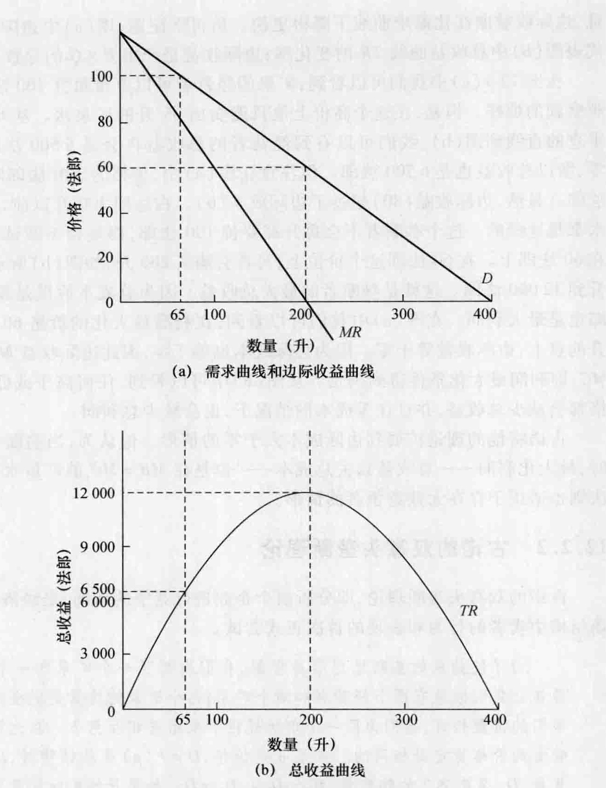
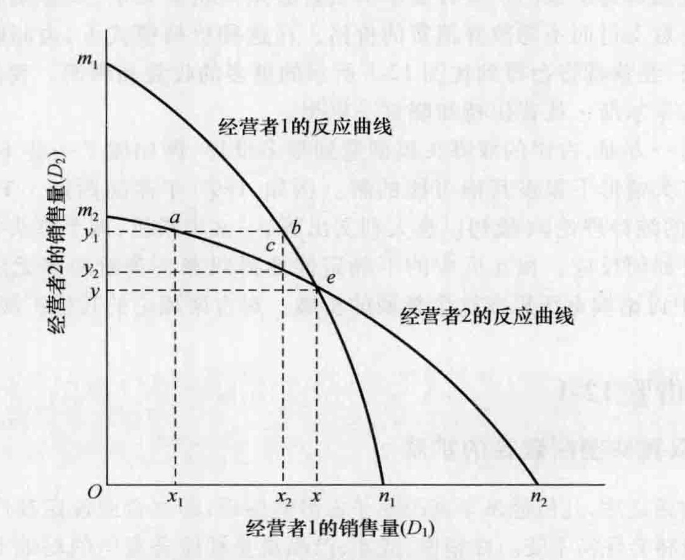
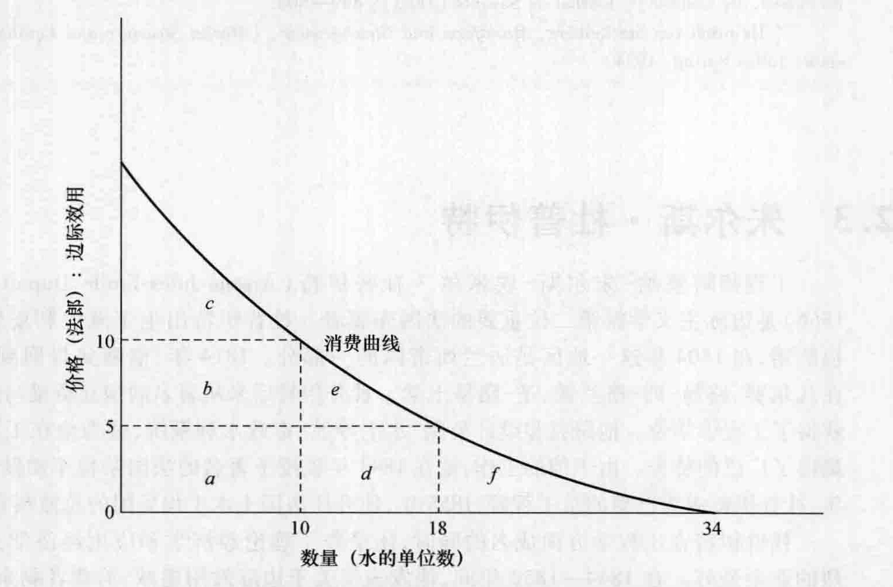
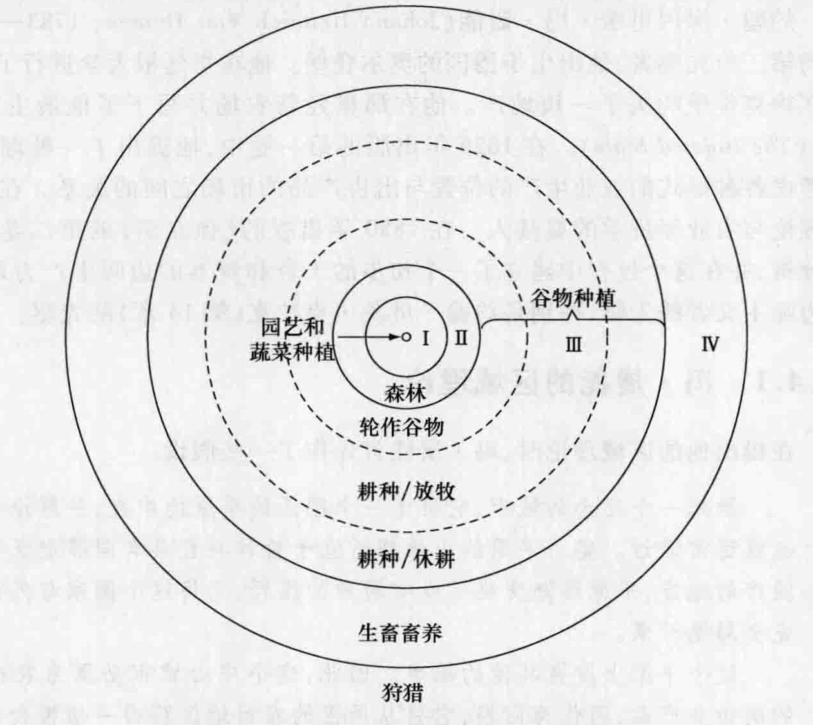

# 第 12 章 边际学派：先驱者

边际学派的开端可以追溯到 1871 年，这一年杰文斯和门格尔分别出版了关于边际效用理论的具有重要影响的著作。有几位先驱者在杰文斯和门格尔之前就已经将边际分析应用于经济学。你可以回想起英国经济学家大卫·李嘉图在他的地租理论中运用了边际方法（第 7 章）。随后，经过无数学者各自独立地研究的努力，在几个国家得到发展的这种分析对边际学派作出了贡献。这些先驱者包括法国的安东尼·古诺和朱尔斯·杜普伊特以及德国的约翰·冯·屠能。在这一章中，我们将提供边际学派的概览，并讨论这三位先驱者的思想；然后在第 13 章和第 14 章中，我们将研究那些将边际学派推向显赫地位的个人的著作。这个学派最终演变成了新古典经济学或当代微观经济学的一部分。

## 12.1 边际学派概览

### 12.1.1 边际学派产生的历史背景

工业革命开始 100 多年后，一些严重的经济与社会问题仍然没有得到解决。尽管生产率得到了极大的提高，但贫穷依然很普遍。尽管总体生活水平有了提高，但财富和收入的极端不公平分配导致了很多不满。经济波动对许多人产生了负面影响；个人不再能够单纯依靠个人的主动性和能力来克服他们所面临的各种情况。农场主和农业工人也有他们的困难；在更好的机会这种胡萝卜的引诱和农村的贫穷这种大棒的驱使下，许多人漂泊到了城市。在健全的工人补偿法颁布之前，许多工业事故给工人及其家庭带来了严重的灾难。长时间的劳动、危险和不健康的工作环境、在和工人的劳资谈判中雇主的经济优势、垄断企业的兴起和人们在老年时的不安全感等这许许多多的问题都迫使人们超越古典经济思想的狭隘局限去寻求解决方案。

19 世纪欧洲的趋势是发展了解决迫切社会问题的三种方法，这三种方法都鄙视古典经济学的信条。这些方法是发展社会主义；支持行业工会主义；通过政府采取行动来管制经济、消除权力滥用和对收入进行再分配，从而改善现状。边际主义者反对这三种“解决方案”。他们以看似庄严神圣的公平形成理论，并得出结论：尽管古典经济学家的价值理论和分配理论并不精确，但他们的政策见解却是正确的。边际主义者拥护市场配置和分配，反对政府干预，抨击社会主义，并试图阻止劳动工会，认为他们是无效的或有害的。

古典的价值理论和分配理论似乎可以得出这样的结论，即地租是不劳而获的收入，而交换价值的基础是生产过程所包含的劳动时间，这在早期边际学派的主要经济学家看来是错误的。前一个思想被美国经济学家亨利·乔治，后一个思想被卡尔·马克思吸收并扩展。如果古典经济学家能够说出创立者从未持有过的观点——即地租是不道德的和劳动创造一切价值——那么经济科学需要作一个彻底的修订。

### 12.1.2 边际学派的主要信条

下面列举出边际学派的基本观点，并在后面讨论边际学派的先驱者和主要思想家时详细叙述。

*   **集中关注边际**。该学派将注意力集中在制定决策时变化的那一点上；换句话说，也就是边际。边际主义者将李嘉图在地租理论中提出的边际原理拓展到了所有的经济理论中。
*   **理性经济行为**。边际主义者假设，在平衡快乐与痛苦、衡量不同物品的边际效用、平衡当前与未来需要的时候，人们的行为是理性的。他们还假设有目的的行为是正常的和典型的，而随机的不正常的行为会相互抵消。边际主义者所运用的方法起源于杰里米·边沁，因为他们假设人们行为的主要动机是寻求效用和避免无效（负效用）。
*   **强调微观经济**。个人和单个的企业在边际主义分析中占有中心地位。边际主义者主要考虑个人决策、单一类产品的市场条件、特定企业的产出等问题，而不是总量经济或宏观经济。
*   **使用抽象、演绎的方法**。边际主义者拒绝历史的方法（第 11 章）而赞成由李嘉图和其他古典经济学家所提出的分析、抽象的方法。
*   **强调完全竞争**。边际主义者通常将他们的分析建立在完全竞争的假设基础之上。① 完全竞争是这样一个世界：小的、个体的、相互独立的企业家，无数买者，无数卖者，同质的产品，统一的价格，没有广告。没有任何一个人或企业有足够的经济力量来影响市场价格的变化。个人可以根据需求、供给和价格来调整自己的行为，而需求、供给和价格是由成千上万的人们在市场上相互作用而形成的。每个人相对于市场的规模来说，都是一个微小的单位，没有人注意到他是否存在或离开。
*   **需求导向的价格理论**。对于早期的边际主义者来说，需求是价格决定的主要力量。古典经济学家强调生产成本（供给）是交换价值的主要决定因素。最早的边际主义者则改舷易辙到了另一个极端，他们强调需求的力量而将供给排除在外。在第 15 章我们会发现阿尔弗雷德·马歇尔将供给与需求综合起来，成为所谓的新古典经济学。这种经济学基本上是边际主义的，同时带有对古典学派依然存在的贡献的明智认可。
*   **强调主观效用**。按照边际主义者的观点，需求取决于主观的、作为一种心理现象的边际效用。生产成本包括工作带来的各种牺牲和厌恶、管理企业和储蓄货币以形成资本基金。
*   **均衡方法**。边际主义者相信各种经济力量通常会趋于均衡——相反的作用力之间达到平衡。无论何时只要扰动导致偏离均衡位置，新的趋向于均衡的运动就会发生。
*   **将土地与资本品合并**。边际主义者将土地与资本资源放在一起进行分析，并将利息、地租和利润看作这些财产资源的报酬。这既有它分析的优势，又反击了有些经济学家得出的结论，即地租是不劳而获的收入、是为了保证对土地的利用而做出的一项不必要的支出。边际主义者通常将地主所得的报酬与利息理论放在一起。
*   **最小的政府干预**。边际主义者继续奉行古典学派所捍卫的立场，即经济中最小的政府干预是最可取的政策。在大多数情况下，要想实现社会福利的最大化，就不要对自然经济规律实施干预。

### 12.1.3 边际学派对谁有利或为谁谋利

边际主义者试图通过更好地理解市场体系如何有效地配置资源和促进经济自由来增进全人类的利益。在很大程度上，边际主义者实现了这个目标。通过表明在竞争性环境下，工人所得的报酬与他们对产出价值所作的贡献相等，边际主义者有助于反驳马克思提倡的无产阶级革命。但是边际主义——自由主义或政治保守主义的经济学——也对那些仅仅希望保持现状的人有利，即对那些反对变革的人有利。这种理论通过反对工会，把失业归罪于人为的高工资、工资无向下调整的弹性或两者兼而有之，从而对雇主有利（尽管他们中的大多数人并没有真正理解这种理论）。边际主义还捍卫了地主的利益，反对以李嘉图的地租理论为基础的各种攻击。该学派还可以说对富人有利，因为富人通常反对可能带来收入再分配的政府干预。

### 12.1.4 边际学派在当时是如何有效、有用或正确的

边际主义学派提出了崭新的、强有力的分析工具，特别是几何图表与数学技巧。由于这些思想家，经济学变成了一门更精确的社会科学。需求条件作为决定最终产品和生产要素价格的因素被给予了应有的重视。该学派强调影响个人决策的各种力量；在个人决策是决定经济活动过程的重要因素的世界里，这是正确的。边际主义者清晰地阐明了作为经济分析的基础的各个基本假设，这与很多古典经济学家的做法相反，后者将这些假设隐藏在背景之中。边际主义者发起的关于方法论的论战，导致了那些基于假设的客观的、可证实的原理与那些取决于价值判断和哲学态度的原理相分离。

这个学派的很多成员所支持的局部均衡分析方法对于从复杂的现实世界中进行抽象是非常有用的。这种方法——在一个时期允许一个变量变化而所有其他变量暂时保持不变——使研究者可以在一个时期分步骤剖析复杂的现象。这个庞大复杂的社会存在的问题和其中的无数个变量，因此可以以一种有序而系统的方式进行简化与深入研究。由于边际主义者引进了连续变量，他们最终向更现实的情况靠近。

不忽略经济中的单个经济单位或极小的部门有一定的优点。边际主义的微观经济分析方法可以补充宏观经济分析方法，后者将经济看作一个整体可能会忽略许多问题。我们可以列举以下例子：(1) 尽管一个国家人均真实收入的平均水平上升了，但一些人却可能急剧贫困化；(2) 对于一个大的汽车公司来说，经济周期对其利润率非常重要；而对于一个便利店的老板来说，经济周期还不如沿街一家竞争的商店开业重要；(3) 总量分析告诉我们，某些形式的人力资本投资（例如大学教育）获得的报酬比某些实物资本投资要高；但是一个银行家可能不会贷款给一个人去上大学，除非政府对这笔贷款提供担保。对于学生这种情况，银行家只是在没有担保物的情况下不会提供贷款。显然，边际主义的微观经济方法在经济理论中具有重要地位。

### 12.1.5 边际学派的哪些信条具有长远贡献

边际主义学派的一些信条后来受到挑战，有一些甚至被抛弃了。凯恩斯将所谓的合成谬误与边际主义和新古典主义的就业理论联系在一起。一个企业如果降低工资，它就能够通过低价多销而扩大市场。它自己雇员的购买力的下降对它可能不会有影响，因为他们通常只购买很小一部分的产出，几乎可以忽略。然而，如果所有的雇主都削减工资，他们就会发现市场缩小了而不是扩大了。而且，批评家认为，从 19 世纪 70 年代以前来看，完全竞争假设是一个合理的抽象，但是在 19 世纪 70 年代以后，由于竞争程度的减弱，完全竞争的假设太严格了，以致几乎没有用了。今天，仅仅在有限几个经济部门还能发现完全竞争。制度学派经济学家认为，在决定诸如工作日长度、消费者行为、工资率等方面，历史和制度因素往往主导着理性的个人计算。随着新事件的发生和新经济理论的出现，边际主义者认为最好的政府是干预最少的政府的观点已经过时了。这些思想家的分析最初是静态的、长期有效的、没有经过经验事实证明的。很少有人尝试对这些理论进行归纳证明；事实上，假设提出的方式就排除了验证。由于坚信供给会创造自己的需求，因而充分就业是常态，经济周期往往被忽略。这个学派没能解释经济增长，其理论被证明对于发展缓慢的国家是不适用的。

但是尽管有这样那样的批评，许多边际主义理论仍然保持了相对完整，在现代经济学原理和微观经济学教科书中还可以发现这些理论，就是证明。这个学派后来被更加广泛的新古典学派吸收，新古典经济学与凯恩斯主义宏观经济学的一些变种一起，统治着西方国家的经济分析，并与社会主义一起分享着国际领域。在后面的讨论及随后的两章中，我们将会发现这些经济学家和他们的先驱者作出了如此之多的长久贡献，如数理经济学、基本的垄断模型、双寡头垄断理论、边际效用递减理论、理性消费者选择理论、需求定理、适用于制造业企业的边际收益递减规律、规模报酬的概念、工作-闲暇选择的分析、要素报酬的边际生产力理论，等等。在过去的 20 多年中，这种由边际主义者提出的“选择-推理”的方法在经济学中经历了一次复兴。

## 12.2 安东尼·奥古斯丁·古诺

安东尼·奥古斯丁·古诺 (Antoine Augustin Cournot, 1801—1877) 是一位法国数学家，他出版了关于数学、哲学和经济学的一系列著作。他是将数学运用于经济分析的最早的经济学家，但是他的开创性工作被忽视了，直到去世之后，杰文斯、马歇尔和费雪继续了他的研究。他是第一位提出完全垄断、双寡头垄断和完全竞争的精确数学模型的经济学家。在分析用来制造青铜的铜和锌的需求时，古诺还提出了我们今天称之为对资源的派生需求的最早完整模型。

古诺被认为是边际学派的先驱者，因为他的大多数分析都集中在总成本和收入函数的变化率上。这些变化率——数学上的导数——转换成今天经济学家所指的边际成本 (marginal cost) 和边际收入 (marginal revenue)。和今天的偏好不同，即分析市场结构的时候从完全竞争开始，然后再引入市场的不完全性，古诺总是先从完全垄断开始分析，然后分析存在竞争者的市场环境。在他对经济分析作出的几项贡献中，特别有两点值得详述：他的完全垄断理论和双寡头理论。

### 12.2.1 古诺的垄断理论

古诺被认为是提出以下现在众所周知的命题的第一位经济学家：通过把价格定在边际收益等于边际成本的那一点，企业可以实现利润最大化。1838 年他这样写道：

> 假设一个人是一个矿泉的经营者，而这个矿泉具备其他矿泉所不具备的对人体有益的特征。他可以毫无疑问地将每升水的价格定在了 100 法郎上，但他很快会发现，由于需求（需求量）不足，这绝不是他最充分利用他的财产的方式。因此，他会连续降低每升水的价格，直到能使他获得最大可能利润的那一点，即如果用 $F(p)$ 来代表需求（需求量）法则，经过多次尝试，他会选择使产出（总收益）$pF(p)$ 最大的那个一个价值（价格）。②

这里古诺假设获取矿泉水的总成本因而边际成本等于零。由于这个原因，在总收益（价格乘以数量）最大的那个产出数量上，总利润也最大。运用微积分，古诺指出这个数量是总收益函数的导数（边际收益）等于零的那一点。

图 12-1 用图示的方法来说明古诺的理论。注意在图 (a) 中，矿泉水的经营者面临一条向下倾斜的需求曲线 $D$。边际收益曲线 $MR$ 位于需求曲线的下方，因为较低的价格适用于所有升的矿泉水，而不仅适用于额外卖出的那一升。也就是说，每额外售出的一单位的价格都会加到总收益上，但是如果那一额外的单位没有被出售，其他升水卖出的价格就会高一些。这种潜在收益的损失必须从卖出额外一升矿泉水所获得的收益中扣除。因此，我们可以看到，除了在第一单位的产出之外，边际收益都比价格要低，而且，边际收益曲线比需求曲线下降得更快。请再次注意，图 (a) 中边际收益曲线上的点代表图 (b) 中总收益曲线 $TR$ 的变化率；边际收益是产出 $P \times Q$ 的导数。

*图 12-1 古诺的垄断理论图示*
> 在图 (a) 中，古诺对矿泉水的分析假设成本等于零。垄断的卖者通过选择边际收益为零时的价格-产量组合来使总收益最大化，从而使总利润最大化。在这里，这个价格-产量组合是 60 法郎和 200 升的矿泉水。在图 (b) 中，在总收益曲线的斜率（边际收益）等于零的那一点实现总收益（总利润）最大化。价格高于 60 法郎时，消费者将会购买少于 200 升的矿泉水；价格低于 60 法郎的话，消费者购买多于 200 升的矿泉水。不论哪一种情况，总收益（总利润）都会少于 12000 法郎。

在图 12-1 (a) 中我们可以看到，矿泉的经营者可以要价每升 100 法郎，就像古诺所观察到的那样。但是，在这个高价上他只能卖出 65 升的矿泉水。从 65 升向下画一条垂直的直线到图 (b)，我们可以看到经营者的总收益将会是 6500 法郎。因为成本为零，所以总收益也是 6500 法郎。但注意在图 (a) 中，价格为 100 法郎时边际收益是 80 法郎。显然，边际收益 (80) 超过了边际成本 (0)。在达到 200 升以前，所有单位的矿泉水都是这样的。这个垄断者不会每升都要价 100 法郎，而是会不断试错直到价格设定在 60 法郎上。在 60 法郎这个价位上，买者会购买 200 升，如图 (b) 所示，总收益将会上升到 12 000 法郎。这就是垄断者的最大总收益。因为总成本假设是零，所以 12 000 法郎也是最大利润。在图 (a) 中我们可以看到，在利润最大化的价格 60 法郎和产出 200 升的点上，边际收益等于零。因为边际成本也等于零，因此边际收益 $MR$ 等于边际成本 $MC$；即利润最大化条件得到满足。从图 (b) 中可以看到，任何高于或低于 60 法郎的价格都会减少总收益，并且在零成本的情况下，也会减少总利润。

古诺将他的理论扩展到边际成本大于零的情形。他认为，当垄断者面对正的成本时，最大化利润——总收益减去总成本——也是在 $MR=MC$ 的产量水平上实现。这个法则也适用于存在无数竞争者的情形。

### 12.2.2 古诺的双寡头垄断理论

古诺的双寡头垄断理论，即分析两个企业进行竞争的市场，是经济学家分析垄断市场结构中卖者的行为和表现的首次正式尝试。

为了使抽象的垄断思想容易理解，我们设想了一个矿泉和一个经营者的情形。现在让我们假设有两个经营者和两个矿泉，两个矿泉的质量是完全相同的，而且由于他们的位置相近，他们为同一个市场提供矿泉水并相互竞争。在这种情形下，每个经营者的价格肯定是相同的。如果 $p$ 是价格，$D = F(p)$ 是总销售量，$D_1$ 是矿泉 1 的销售量，$D_2$ 是矿泉 2 的销售量，那么 $D_1 + D_2 = D$。如果开始的时候我们忽略生产成本，两个经营者的收入分别是 $pD_1$ 和 $pD_2$；并且他们各自独立地寻求收入尽可能最大。

我们说“各自独立地”，是因为这个限制是非常必要的，我们很快就会看到这一点，因为如果他们达成一个协议来实现各自最大可能的收入，结果会完全不同，而就消费者而言，结果将会与一个垄断者的情形没有什么差别。③

在描述他的双寡头垄断理论时，古诺假设由买者决定价格，而两个卖者仅仅根据这些价格来调整产量。每一个垄断者都会估计这种产品的总需求，并且在对手的产出不变的假设下确定自己的产出量和销售量。每个生产者都通过逐步调整产量达到一个稳定的均衡，在均衡点上，两个垄断者最终销售相同数量的产品，价格高于竞争价格而低于垄断价格。

古诺是通过数学方法来说明双寡头垄断模型的，图 12-2 给出了几何图示。横轴代表经营者 1 的销售量 ($D_1$)，纵轴代表经营者 2 的销售量 ($D_2$)。曲线 $m_1n_1$ 和 $m_2n_2$ 分别代表经营者 1 和经营者 2 的利润最大化曲线。古诺从他的数学方程中得到了这些曲线。曲线 $m_2n_2$ 表示，在给定经营者 1 的各种产量水平的情况下，使经营者 2 利润最大化的各具体产量水平。曲线 $m_2n_2$ 上的点 $a$ 能够说明问题。它告诉我们，如果经营者 1 销售 $x_1$ 单位的矿泉水，则经营者 2 将会发现销售 $y_1$ 单位的矿泉水可以实现利润最大化。另一方面，曲线 $m_1n_1$ 表示在给定经营者 2 的各种产量水平的情况下，使经营者 1 利润最大化的产量水平。例如，该曲线上的点 $b$ 说明如果经营者 2 提供 $y_1$ 单位的产量进行销售，那么经营者 1 将会选择产量 $x_2$ 以最大化其利润。因为这些曲线上的点都是根据每一个经营者对另一个经营者的产量水平作出反应而确立的，所以它们也被称为反应曲线 (reaction curve)。

*图 12-2 古诺的双寡头垄断模型*
> 古诺的反应函数表明在假设另一个经营者的产量（销售量）保持不变的情况下，每一个经营者所选择的最大化其利润的产出水平。不相等的产量水平，如点 $a$、点 $b$ 和点 $c$ 所代表的产量水平，都是不能持续的。例如，在点 $a$，经营者 2 会生产 $y_1$ 的产量，但是经营者 1 会作出反应，将产量从 $x_1$ 扩大到 $x_2$（点 $b$）；于是，经营者 2 会对经营者 1 的产量 $x_2$ 作进一步反应，将产量从 $y_1$ 减少到 $y_2$（点 $c$）。这些反应会使销售水平产生连续的变化直到达到均衡点 $e$。在那一点上，两个垄断者的产量相等 ($x=y$)，进一步的产量调整不再发生。
> © Cengage Learning 2013

说明经营者 2 的反应曲线上的点 $a$ 所确定的产量水平和经营者 1 的反应曲线上的点 $b$ 所确定的产量水平是不可持续的，是一件相当容易的事情。如果经营者 1 销售 $x_1$ 单位，经营者 2 就会销售 $y_1$ 单位。那么经营者 1 将会怎样作出反应？他的反应是销售 $x_2$ 升的矿泉水（点 $b$），因为当经营者 2 的产量是 $y_1$ 单位时，那一点将使他的利润最大化。一旦经营者 1 提供 $x_2$ 单位，那么经营者 2 的反应就是提供 $y_2$ 单位（曲线 $m_2n_2$ 上的点 $c$）。这个试错过程会一直持续直到达到均衡点 $e$。注意在这两条反应曲线的交点上，每个垄断者销售相同数量的产品 ($x=y$)，并且在另一个垄断者产出既定的情况下获得最大利润。古诺说，这一点“是稳定的，即如果任何一个生产者由于受到他的实际利益的误导而暂时离开这一点，他还会通过一系列反应重新被带回这一点，振幅不断缩小”④。

### 12.2.3 对古诺理论的回顾

古诺的完全垄断模型实际上就是现代经济学原理教科书中的完全垄断模型。显然，经济学家在这个模型中找不出什么错误。这方面唯一值得一提的是古诺没有认识到价格歧视——基于不同的需求弹性对不同的消费者索要不同的价格——的可能性。在市场能够被分割而且买者不能再次售出商品的情况下，价格歧视可以发生。例如，如果前提假设是矿泉的所有者要求消费者必须消费矿泉水，卖者就有可能向每个买者索要他愿意支付而不愿放弃消费的价格。在这种价格模式下，边际收益将等于每个买者的价格，经营者将会得到比图 12-1 所示的更多的收益和利润。我们很快将看到另一位法国人朱尔斯·杜普伊特知晓这一思想。

另一方面，古诺的双寡头模型遭到很多批评，例如做了一些不切实际的假设、忽略了双寡头情形下很多其他可能的解。例如，1897 年弗朗西斯·Y·埃奇沃思在其论文《垄断的纯粹理论》（最初以意大利文出版）一文中指出，两个寡头垄断者不能确定他的对手将如何反应。相互反应的不确定性使得双寡头垄断的解无法确定。我们将在第 14 章中讨论埃奇沃思在这个领域的扩展。对古诺理论的其他扩展请见历史借鉴 12-1。

> **历史借鉴 12-1**
> **古诺双寡头垄断理论的扩展**
>
> 古诺之后，几位经济学家改变了古诺的假设，即当企业设定其产量水平时，竞争对手的产量将会保持不变。在销售、成本、产品质量和服务竞争的基础上，这些学者提出了双寡头和寡头垄断者的几种反应模式。他们还将动态因素引入模型中，基于关于企业行为的假设，发现了一系列可能的结果。除弗朗西斯·埃奇沃思（见后面章节）之外，两位著名的理论家约瑟夫·伯特兰 (Joseph Bertrand, 1822—1900)* 和海因里希·冯·斯塔克尔伯格 (Heinrich Von Stackelberg, 1905—1946)** 也拓展了古诺的先驱模型。
>
> 伯特兰是法国数学家，他保留了古诺的假设：(1) 商品是同质的，(2) 企业之间相互竞争（而不是合作），(3) 企业同时实行决策。但是伯特兰不同于古诺的是，他假设企业决定价格，而不是产量，因此市场决定实际产量和销售。伯特兰还隐含假设没有产能限制——企业可以生产任何满足需求的数量。伯特兰得出结论是，即使市场上只有两家企业，也足以产生完全竞争性价格。来自对手的竞争将迫使一家企业降低其价格，直至达到其边际成本。
>
> 斯塔克尔伯格是德国经济学家，他允许双寡头循序决定数量，而不是即时决定。他的领导模型描述了一个企业领导市场的情况，该企业在竞争对手确定产量之前就设定自己的产量。领导企业的产量选择取决于其如何预期追随者的反应。然后，追随者根据领导者的产量选择确定使其利润最大化的产量。现代领导者-追随者的相互作用往往以价格为基础，并且经常出现在有主导企业的行业中。例如，这样的价格领导常见于啤酒、芯片、大型装备、麦片早餐业等。
>
> 还有其他形式的双寡头垄断模型，有些模型已经拓宽到包括很多家企业。这类市场模型的共同点是可以被描述为博弈论——两家或多家企业一系列相互作用的决策。因此，博弈论源自于古诺的研究。我们将在第 18 章介绍一些对现代博弈论作出重要贡献的经济学家。
>
> \* Joseph Bertrand, "Théorie des Richesses" (a book review of Théorie Mathématique de la Richesse Sociale, by Leon Walras [Chapter 18], and Recherchés sur les Principes Mathématiques de la Théorie des Richesses, by Cournot), *Journal de Savants* (1883): 499—508.
> \*\* Heinrich von Stackelberg, *Marktform und Gleichgewicht*, [Market Structure and Equilibrium] (Vienna: Julius Spring, 1934).

## 12.3 朱尔斯·杜普伊特

工程师阿塞纳-朱尔斯-埃米尔·杜普伊特 (Arsène-Jules-Emile Dupuit, 1804—1866) 是边际主义学派第二位重要的法国先驱者。杜普伊特出生于意大利皮埃蒙特的福萨诺，在 1804 年这一地区是法兰西帝国的一部分。1814 年，他随父母回到巴黎，并在凡尔赛路易-列-格兰德、圣-路易上学。杜普伊特后来从著名的国立桥梁与道路学校获得了工程学学位。他研究和设计公路、水上导航、市政水利系统，这为他在工程行业中赢得了广泛的赞誉。由于他的工作，他在 1843 年被授予著名的法国荣誉军团勋章。1850 年，杜普伊特成为巴黎的总工程师，1855 年，他升任法国土木工程兵团的总监察官。

杜普伊特在工程学方面成名的同时，还培养了理论经济学和应用经济学方面的强烈的业余爱好。在 1844—1853 年间，他发表了关于边际效用递减、消费者剩余、价格歧视等方面的重要期刊论文。⑤ 这些概念的核心都是在“边际”上作出决策。尽管古诺也采用这种方法，但没有迹象表明杜普伊特和古诺对彼此的作品很熟悉。

### 12.3.1 边际效用与需求

杜普伊特指出，一种产品（市政水利系统中的水）对不同的人来说价值是不同的。而且，一个人从一特定单位的水中所得到的满意程度或效用取决于那特定单位的水是如何被使用的。一个人最初将水用于价值高的用途上，随着水的储备不断增加，之后用在价值较低的用途上。用于喝的水优先于浇灌花园的水。依次，用于浇灌花园的水优先于用于洗涤的水，等等。最后，它被用于装饰性目的，比如喷泉。

我们知道，主观边际效用和边际效用递减的思想并不是新的；回想一下，边沁在 60 多年以前就曾讨论过。但是杜普伊特超越了边沁，他将边际效用递减与个人及市场“消费曲线”直接联系起来。他观察到，当一种商品的价格下降时，人们购买更多的产品来满足不太紧迫的、较低的边际效用需求。

杜普伊特构造了一个类似于图 12-3 的图。杜普伊特说，如果水的价格是 10 法郎，购买 10 单位水的消费者必须从这 10 单位中的每单位水中得到最少价值 10 法郎的效用。当水的价格下降到 5 法郎时，消费者会把水的消费提高到 18 个单位。当水的边际效用下降到 5 法郎以下时，消费会停止增加。第 19 个单位的水不能产生足够的边际效用来证明 5 法郎的价格是合理的。

*图 12-3 杜普伊特的消费曲线（边际效用曲线和需求曲线）*
> 杜普伊特的消费曲线表明，边际效用随消费的增加而下降，并且在产品价格和需求数量之间存在一种反向的关系。如果每单位水的平均成本是 5 法郎，卖者（政府）就可以要价 5 法郎而收支平衡。但是卖者可以通过价格歧视来扩大总效用。特别地，它可以向那些愿意支付 10 法郎的人要价 10 法郎，这样就得到 50 法郎的额外总收益（5 法郎 $\times$ 10 单位的销售量）。这些增加的收益使它能够对那些不愿意或不能够支付 5 法郎的人要价低于 5 法郎。因为购买可能增加到超过 18 个单位，因此总效用可能上升到一个比 $a+b+c+d+e$ 所示的区域还要大的数额。

简而言之，杜普伊特确立了需求曲线的概念：产品价格与人们想要购买的产品数量之间存在一种反向的或负的关系。在杜普伊特的说明中，需求曲线就是边际效用曲线。连续消费某一特定的产品将产生越来越少的额外满足。这样消费者就不会购买额外单位的产品，除非价格下降。

后来的经济学家如瓦尔拉斯（第 18 章）批评杜普伊特没有区分边际效用曲线和需求曲线。然而，杜普伊特被认为是第一批用画图表的方式揭示价格和需求数量之间反向关系的经济学家之一。他也是最早强调边际效用是需求的基础的经济学家之一。

### 12.3.2 消费者剩余

杜普伊特的消费曲线使他得到了一个重要发现，后来马歇尔（第 15 章）强调了这一发现。如图 12-3 所示，假设政府当局的要价是 10 法郎，其含义是消费者愿意为除第 10 单位的水之外所有单位的水支付高于 10 法郎的价格；第 10 单位之前的每单位的边际效用都超过 10 法郎，只有最后一单位（第 10 单位）的价格等于边际效用。以每一单位为基础，每一单位的边际效用与其价格之间的差额是相对效用，或剩余效用。所有这些边际效用与其价格之间差额的和就是总的消费者剩余。在图 12-3 中，价格是 10 法郎时，消费者剩余是三角形 $c$ 的面积。如果价格是 5 法郎，消费者剩余就是区域 $b, c, e$ 的面积之和。

### 12.3.3 垄断价格歧视

杜普伊特设计的很多公路、桥梁和水利系统都是政府垄断的。于是杜普伊特就想知道，即便政府定价，政府应该对这些垄断产品或服务索要什么样的价格？他认为，如果目标是最大化总效用，那么价格应该是零。在图 12-3 中，边际效用曲线上任意一点下边的区域都是那个产量的总效用，显然当价格为零时总效用达到最大（区域 $a, b, c, d, e, f$ 的面积之和）。

如果价格高于零，就会产生两个结果。其一，有些效用从消费者转到卖者那里。但是，转移的结果并未带来净效用的减少。其二，有些效用消失了；用今天的术语来说，会有一个无谓损失。比如，如果价格是 10 法郎而不是零，数量将会是 10 个而不是 34 个单位。比较价格是 10 法郎和 0 法郎的情况，我们可以看到区域 $a$ 和 $b$ 代表从消费者转移到卖者的效用。同时，区域 $c, d$ 和 $f$ 的和勾画了总效用的损失。

杜普伊特认识到一个明显的问题：价格为零不能使供给者补偿提供产品或服务的成本。因此他建议政府卖者应该制定这样一个服务的成本可以得到补偿而且总效用损失最小的价格。为了补偿提供产品或服务的成本，一个方式就是制定单一价格，在这个价格上产生的总收益 ($P \times Q$) 等于总成本。例如，如果每单位水的成本是 5 法郎，那么价格也可以定在 5 法郎。此时消费掉 18 单位的水，总收益就是 90 ($5 \times 18$) 法郎，足够来补偿 90 法郎的成本。在图 12-3 中，总效用将会下降区域 $f$ 的面积。

但杜普伊特想知道是否还有更好的价格策略以补偿提供成本。他得到的结论是，一个双重或多重价格方案能够使减少的总效用小于区域 $f$ 的面积。边际效用高于 5 法郎的消费者可能被索要一个高于 5 法郎单位成本的价格。其结果是，这些买者的一部分消费者剩余将会转变成卖者的额外收益。对这些买者实行的高于成本的价格不会导致总效用的损失，它只是将一部分消费者剩余转移给了卖者。最重要的是，这个额外的收益使卖者对那些边际效用低于 5 法郎的个人索要较低的价格。在图 12-3 中，对这些消费者索要的低于 5 法郎的价格将会使消费增加到超过 18 个单位。当产出超过 18 个单位时，相对于零价格的效用损失将会缩减到小于区域 $f$ 的面积。因此，相对于单一的 5 法郎的价格，这个双重或多重价格方案提高了总效用，而又继续满足总收入与总成本相匹配的要求。

今天，我们用价格歧视 (price discrimination) 这个术语来描述杜普伊特的双重或多重价格方案。这个思想后来被 A.C. 庇古（第 20 章）和琼·罗宾逊（第 17 章）进一步发展并正规化。只有当可能把买者分为可以确认的群体，并且消费者再出售产品是不可能的或者是昂贵到令人望而却步的情况下，才可能产生价格歧视。它将消费者剩余转化为更高的收益，对于盈利性企业而言，就是更高的利润。但是，正如杜普伊特所指出的那样，价格歧视还可以提高总产出和总效用。正是杜普伊特所设想的垄断形式，今天被政府企业、公共事业部门广泛采用。

> **历史借鉴 12-2**
> **戈森：效用与迟到的荣誉**
>
> 另一位边际主义的先驱者，赫尔曼·海因里希·戈森 (Hermann Heinrich Gossen, 1810—1858)，他的作品直到他去世之后才得到了真正的赏识。然而他的思想是如此超前以至于很值得提及。
>
> 戈森离开了他的德国政府小职员的职位，隐居四年写了一本书，于 1854 年出版。可能是由于书中使用了高深的数理方法，因此他的《人类关系的规律和与之相应的人类行为的规则》 (*The Laws of Human Relations and the Rules of Human Action Derived Therefrom*) 仅售出了很少的几本。他非常失望地召回并销毁了剩余的书籍。
>
> 1871 年，威廉·S·杰文斯（第 13 章）出版了广受赞誉的《政治经济学原理》第一版，之后他发现了戈森的这本书，并惊奇地发现他的边际效用理论几乎被另一个人完全预见到了。在以后的版本中，杰文斯将其完全归功于戈森。这位先驱理论家在去世后得到了声望，他的书在 1889 年以德文重印。
>
> 特别地，戈森提出的两个定律为杰文斯和其他边际主义者的贡献奠定了基础。戈森的第一个定律是收益递减规律：当一种产品消费增多时，它所增加的效用会逐渐减少。这个规律解释了自愿交换是怎样使双方效用都增加的。一个饲养牲畜的农民有比他自己需要消费的多得多的牲畜要屠宰，除了由他们所得到的货币以外，边际效用是很低的或者是负的。同样，一个面包师有很多面包，以至于除了他自己消费之外，每条面包的边际效用是很低的或者是负的。面包和肉进行交换，使得双方都可以得到比他们自己原来的产品提供更高边际效用的产品。
>
> 戈森的第二个定律与通过理性消费来获取最大满足的边际效用平衡有关。戈森认为，理性的人应该将他的货币收入理性分配，使得花费在每一种商品上的最后一元钱产生相同的额外（边际）效用。花在一种商品上的每单位货币的边际效用等于边际效用 ($MU$) 除以该商品的价格 ($P$)。因此，戈森效用最大化的条件用公式来表示就是：
> $$ \frac{MU_x}{P_x} = \frac{MU_y}{P_y} = ... \quad (12\text{-}1) $$
> 其中，$MU_x$ 和 $MU_y$ 分别是两件独立产品 X 和 Y 的边际效用，$P_x$ 和 $P_y$ 分别是它们的价格。
>
> 下一章我们将更加深入地讨论杰文斯和卡尔·门格尔对这个思想的详细论述。我们将会发现，这个理性消费者行为的规律是需求分析的基础，而需求分析对边际主义的价值理论非常重要。

## 12.4 约翰·海因里希·冯·屠能

约翰·海因里希·冯·屠能 (Johann Heinrich Von Thünen, 1783—1850) 是边际主义的第三位先驱者，他出生于德国的奥尔登堡。他在哥廷根大学进行了短暂的学习，后来在梅克伦堡购买了一块地产。他在那里经营农场并写下了他最主要的著作《孤立国》 (*The Isolated State*)。在 1826 年出版的第一卷中，他提出了一种理论，这种理论主要考虑各种形式的农业生产的位置与出售产品的市场之间的关系。在这方面，他是区域理论与农业经济学的奠基人。在 1850 年出版的《孤立国》的第二卷中，他扩展了他的分析，在这个过程中建立了一个初步的工资和资本的边际生产力理论。冯·屠能是边际主义者的先驱，特别是约翰·贝茨·克拉克（第 14 章）的先驱。

### 12.4.1 冯·屠能的区域理论

在提出他的区域理论时，冯·屠能首先作了一些假设：

> 设想一个巨大的城市，它位于一个肥沃的平原的中央，平原没有可以通航的河流或运河通过。整个平原的土地都适宜于耕种并且具有同等肥沃程度。远离这个城市的地方，平原逐渐变成了没有耕种的原野，它将这个国家与外面的世界的沟通完全隔绝开来。
>
> 这个平原上没有其他的城市。因此，这个中心城市必须为农村地区提供所有的制造业产品，而作为回报，它将从周围的农村地区获得一切粮食供给。
>
> 为这个国家提供盐和金属的矿山位于中心城市的附近，因为它是唯一的城市，⑥ 后边我们将它简称为“城市”。

然后，约翰·冯·屠能提出了他的中心问题：

我们想要解决的问题是：在这些条件下，会形成什么样的耕种模式？不同地区的耕种制度是怎样受到它与城市的距离的影响的？通篇我们都假设耕种行为是完全理性的。

从总体上看，很明显靠近城市的地方应该种植那些相对于它们的价值来说沉重或者体积大的产品，因为运输费用太昂贵以至于较远地区不能提供它们。这里我们也能发现非常容易腐烂、必须尽快消费掉的产品。随着与城市距离的不断增加，土地逐渐被用来生产相对于价值来说运费较便宜的产品。

仅仅由于这个原因，在城市的周围会形成非常不同的同心圆圈或地带，每个圆圈都有其自己特定的大宗产品。

从一个圆圈到另一个圆圈，大宗产品和与对应的整个耕种制度都会发生变化；在不同的圆圈内，我们会发现完全不同的耕种制度。⑦

图 12-4 描述了冯·屠能理论的一个略加修改的版本。在最里面的圆圈 (I)，标着“园艺和蔬菜种植”，紧紧围绕着这个城市。这里种植精细的产品如草莓、莴苣、花椰菜，等等。另外，农民还会圈养奶牛，以便生产鲜奶，因为牛奶的运输“不仅非常困难和昂贵，并且几个小时以后牛奶的味道就会变得不好，特别是在非常热的时候”⑧。

*图 12-4 约翰·冯·屠能的农业区域理论*
> 在冯·屠能的“孤立国”中，在中心城市的周围发展起来一系列的同心圆圈，每个圆圈都被用于某一特定类型的农业用途。圆圈离城市越远，生产越不密集，商品越不容易腐烂，商品承受运输成本的能力也越强。

第 2 圈 (II) 是密集种植树木的地区，以便为城市提供燃料和建筑材料。这些物品需要种植在城市的周围，因为相对于它们的市场价值而言，它们太沉重而且运输费用高昂。在接下来的 3 个圆圈，农民将种植谷物，它们一起构成了第 3 区域 (III)，标为“谷物种植”。在这个区域最里面的一圈，地主或者他们的佃户会密集地种植谷物并会不断地轮作，目的是从土地中获得最大产出。冯·屠能说，在第 3 区域 (III) 的中间一圈，部分土地会用来种植谷物，其他部分用来放牧。在第 3 区域 (III) 的最外边一圈，部分土地用来种植谷物，其他部分暂时休耕。

图 12-4 中外边的第 4 圈 (IV)，农民将会养殖牛和猪。尽管这些动物也很重，但是可以推测它们能以相对较低的运输成本被赶到城市中屠宰。最后，位于第 4 圈以外的所有土地将只能用来狩猎。将任何类型的农产品运到城市中，相对于这些产品的价值来说成本都将太高。

约翰·冯·屠能解释道，随着圆圈中农业生产的密集程度越来越高，收益递减将会引起我们今天所说的边际成本上升。这将会导致更高的市场价格，反过来它将使在远离市场的新地区进行耕种也有利可图。换言之，农业密集程度将会扩大图 12-4 中的 4 个主要的圆圈。

### 12.4.2 约翰·冯·屠能论边际生产力

约翰·冯·屠能对各种类型农业位置的认真思考使他提出了一种劳动力使用的边际生产力理论。他将这个理论建立在这样的原理之上，即不断增加单位劳动将导致农产品的总量增加越来越少。回想一下，李嘉图在地租分析中也曾使用过同样的概念——边际效益递减规律。约翰·冯·屠能进一步扩展了这个规律的适用性。他指出，按照这个规律，农场主一定会注意使他所雇用的劳动力不超过某一点，在那点上增加的最后一个劳动力的成本与增加的农业产出的价值相等。用现代术语来说，冯·屠能的意思是雇主应该增加劳动数量，直到劳动的边际收益产品——来自更大产出的额外收益——等于雇用工人的工资支出。并且，冯·屠能认识到正是最后一名雇佣工人的边际产品决定了所有工人获得的“自然工资”。这是个很复杂的经济学推理，为后来约翰·贝茨·克拉克和阿尔弗雷德·马歇尔的贡献奠定了基础。我们将等待讨论这些经济学家深入研究这个问题。

---

① 这里也有例外。在本章的后面我们会发现，边际学派的先驱者古诺就提出了一个垄断和双寡头垄断理论。

② Augustin Cournot, *Researches into the Mathematical Principles of the Theory of Wealth*, trans. Nathaniel T. Bacon (New York: Macmillan, 1897), 56 [orig. pub. in 1838].

③ Cournot, *Theory of Wealth*, 79—80.

④ Cournot, *Researches*, 81.

⑤ 其中最重要的有 "On the Measurement of the Utility of Public Works" (1844), "On Tolls and Transport Charges" (1849), "On Utility and Its Measure" (1853)。

⑥ Johann H. von Thünen, *The Isolated State*, trans. Carla M. Wartenberg and ed. Peter Hall, vol. 1 (Oxford: Pergamon Press, 1966), 7—8.

⑦ Johann H. von Thünen, *Isolated State*, 1:8.

⑧ Johann H. von Thünen, *Isolated State*, 1:9.

## 复习与讨论

1.  解释下列名词，并简要说明其在经济思想史中的重要性：古诺，总收益与边际收益，双寡头垄断，反应函数，伯特兰，斯塔克尔伯格，杜普伊特，边际效用递减，消费曲线，消费者剩余，价格歧视，冯·屠能，边际生产力，戈森。
2.  回顾一下本章所讨论过的边际主义思想的主要信条，并指出哪些适用于古诺的作品。
3.  从以前的经济学知识中回想用总收益或总收入来检验需求弹性。参考图 12-1 中的两个图，确定在以下的产出范围内需求是有弹性还是无弹性的：(a) 从 0 到 200；(b) 从 200 到 400。解释你的答案。
4.  通过具体参考古诺的垄断模型（图 12-1），说明为什么下列结论都是错误的：(a) “完全垄断者会索要能够得到的最高单位价格”；(b) “完全垄断者会生产使其单位利润最大化的产出水平”；(c) “不管其生产成本如何，一个完全垄断者一定可以获得经济利润”。
5.  在图 12-2（古诺的双寡头垄断模型）中画一条虚线的水平线，它略在横轴的上方并且向右延伸到反应函数 $m_2n_2$。经营者 2 初始产出水平（销售量）是多少？解释原因。经营者 1 将会如何反应？如果按照这个模型的假设，最终的产出水平会是多少？请解释。
6.  为什么古诺的完全垄断理论比其双寡头垄断理论更好地被人接受？为改进古诺的双寡头垄断理论需要做哪些扩展？
7.  应用杜普伊特的效用分析来解释为什么在其他条件不变的情况下，随着一种产品价格的上升，其需求量会下降？
8.  列举你购买的几种产品，它们给你提供了杜普伊特所说的相对效用。
9.  参考图 12-1 (a)（古诺的完全垄断模型），确定当价格为 60 法郎时消费者剩余的区域。解释价格歧视（杜普伊特）怎样将垄断者的总收益提高到 12 000 法郎以上。解释相对于 60 法郎的单一垄断价格，多重价格如何增进总效用（就像杜普伊特一样假设需求曲线即边际效用曲线）。
10. 运用冯·屠能的区域理论的基本原理来解释为什么随时需要浇灌的植物通常位于出售它们产品的城市之中或附近，而出版社通常位于远离出售图书的地方。
11. 按照冯·屠能的观点，一个地主怎样决定应该雇用的农场工人的适当数量？
12. 分别举例说明戈森的两个定律。
13. 在本书扉页后的经济思想的时间序列表中，边际主义学派的思想和经济学家与其古典经济学前辈是相反的。这在哪些方面是合理的？边际主义学派的思想在哪些领域与古典学派是一致的？

## 精选文献

**书籍**

*   Black, R. D. C., A. W. Coats, and C. D. W. Goodwin, eds. *The Marginal Revolution, Interpretation and Evaluation*. Durham, NC: Duke University Press, 1973.
*   Blaug, Mark, ed. *Johann von Thünen, Augustin Cournot and Jules Dupuit*. Brookfield, VT: Edward Elgar, 1992.
*   Cournot, Augustin. *Researches into the Mathematical Principles of the Theory of Wealth*. Translated by Nathaniel T. Bacon. New York: Macmillan, 1897, 1927 [orig. pub. in 1838].
*   Dupuit, Jules. "On the Measurement of the Utility of Public Works," in *Readings in Welfare Economics*, eds. Kenneth J. Arrow and Tibor Scitovsky. Homewood, IL: Richard D. Irwin, 1969: 255—283.
*   Ekelund, Robert B., and Robert F. Hébert. *The Secret Origins of Modern Microeconomics: Dupuit and the Engineers*. Chicago: University of Chicago Press, 1999.
*   Gossen, Herman H. *The Laws of Human Relations and the Rules of Human Action Derived Therefrom*. Translated by Rudolph C. Blitz. Cambridge, MA: MIT Press, 1983 [orig. pub. in 1854].
*   Von Thünen, J. H. *The Isolated State*. Translated by Carla Wartenberg and edited by Peter Hall. Vol. 1. Oxford: Pergamon Press, 1966.
*   ——. *The Isolated State*. In *The Frontier Wage*, translated by B. W. Dempsey. Vol. 2. Chicago: Loyola University Press, 1960.

**期刊论文**

*   Clark, Colin. "Von Thünen's Isolated State," *Oxford Economic Papers* 19 (November 1967): 370—377.
*   Ekelund, Robert B., Jr. "Price Discrimination and Product Differentiation in Economic Theory: An Early Analysis," *Quarterly Journal of Economics* 84 (May 1970): 268—278.
*   Fisher, Irving. "Cournot and Mathematical Economics," *Quarterly Journal of Economics* 12 (January 1898): 119—138, 238—244.
*   Liegh, Arthur H. "Von Thünen's Theory of Distribution and the Advent of Marginal Analysis," *Journal of Political Economy* 54 (December 1946): 481—502.
*   Theocharis, Reghinos D. "A Note on the Lag in the Recognition of Cournot's Contribution to Economic Analysis," *Canadian Journal of Economics* 23 (November 1990): 923—933.