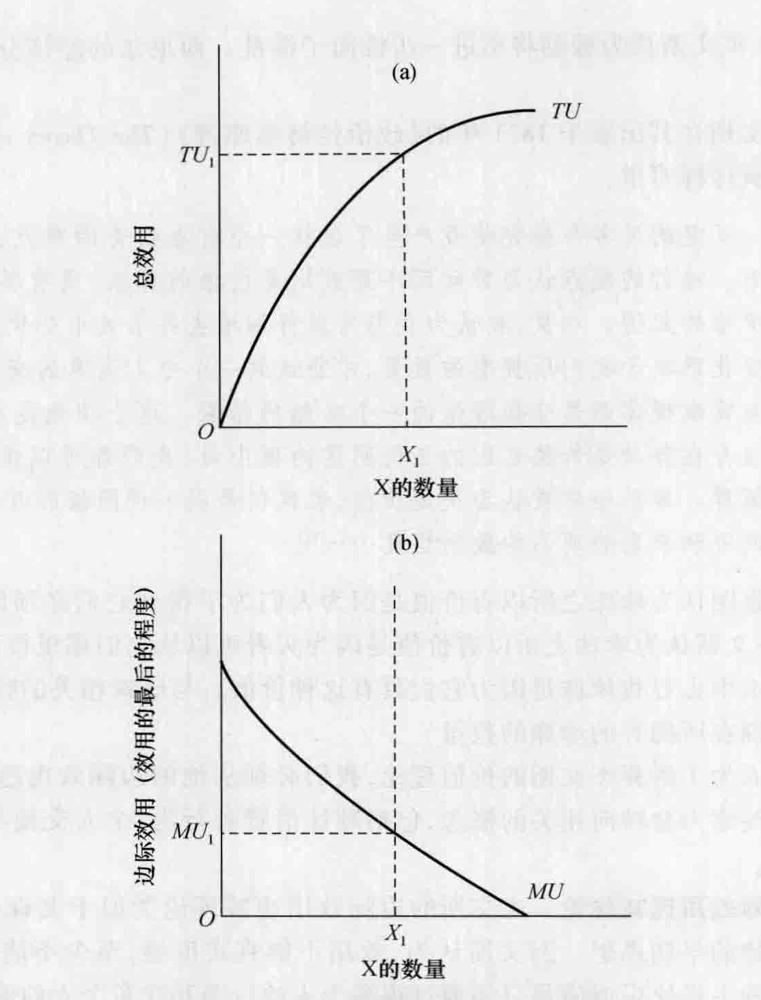
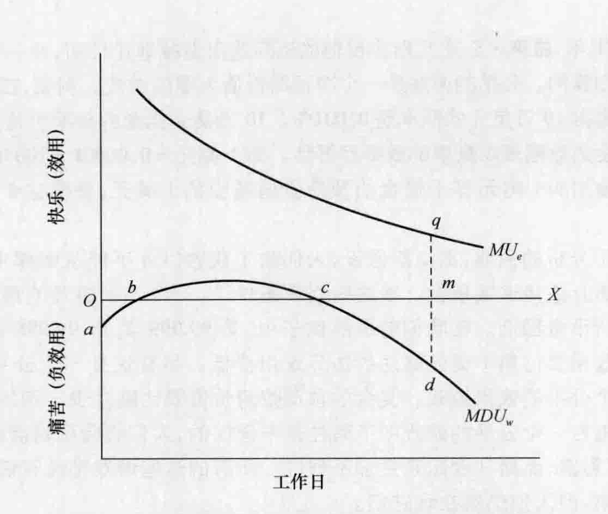
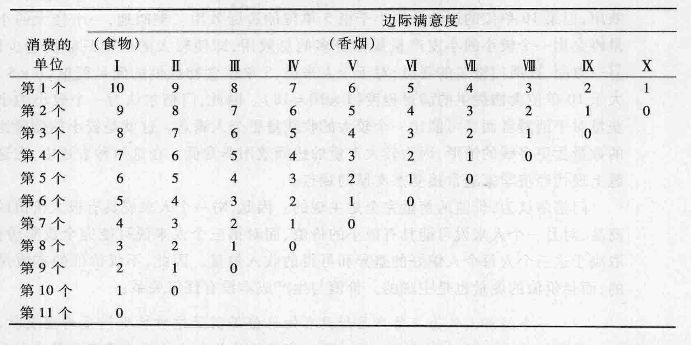

# 第 13 章 边际学派：杰文斯、门格尔、冯·维塞尔和冯·庞巴维克

尽管古诺、杜普伊特、冯·屠能和戈森为边际分析作出了开创性贡献，但边际主义作为一个界限更加清晰的经济思想学派却起源于英国的 W. 斯坦利·杰文斯、奥地利的卡尔·门格尔和瑞士洛桑的莱昂·瓦尔拉斯。这又是一个有趣的事例，新思想同时产生于不同的地方不同的人，但都源于对旧理论的共同的不满。本章我们将研究杰文斯、门格尔和沿着门格尔的思想足迹前进的两个奥地利人。我们将对瓦尔拉斯的讨论推迟到第 18 章，在那一章集中探讨对数理经济学作出贡献的学者。

## 13.1 威廉·斯坦利·杰文斯

威廉·斯坦利·杰文斯 (William Stanley Jevons, 1835—1882) 出生于英国的利物浦。他在澳大利亚的一家造币厂当了 5 年的试金师，在那里挣到了足够的钱之后回到英格兰继续学习。当没有申请到伦敦大学学院政治经济学专业的奖学金时，他感到非常失望和痛苦，将失败归因于他的教授对他提出的新思想抱有偏见。杰文斯出版了几本关于逻辑学的著作并成为逻辑学、政治经济学和哲学教授，起初在曼彻斯特大学，后来在伦敦大学学院。他发明了一种逻辑机器，1870 年在英国皇家学会进行展示，这个机器能够在给定一系列前提后自动得出一个结论。杰文斯还是一位著名的科学史学家，并且对指数的发展作出了杰出贡献。杰文斯是一个极其内向的人，并没有对他的同辈或学生产生重要的影响。他 47 岁时在游泳中溺水身亡。

### 13.1.1 杰文斯论价值理论

杰文斯称李嘉图是“有才能但头脑错误的人”，说他“将经济科学的车开往错误的路线”。杰文斯认为穆勒将车进一步推向了混乱。西尼尔的经济分析更适合杰文斯的口味。

杰文斯在其出版于 1871 年的《政治经济学原理》(The Theory of Political Economy) 的第 1 页这样写道：

> 反复的思考与探究使我产生了这样一个有点新奇的观点，即价值完全取决于效用。流行的观点认为劳动而不是效用是价值的源泉，更有甚者明确地断言劳动是价值的起因。相反，我认为我们必须仔细地去寻求效用变化的自然规律，即效用的变化取决于我们所拥有的数量，才能达到一个令人满意的交换理论，而通常的供给与需求规律则是交换理论的一个必然的结果。这个理论是与事实相一致的；并且当存在劳动是价值起因的任何明显的理由时，我们都可以提供一个对这种理由的解释。劳动经常被认为决定价值，但仅仅是以一种间接的方式，即通过供给的增加或限制来影响商品的效用程度……①

李嘉图认为珍珠之所以有价值是因为人们为了得到它们必须潜入水中，和李嘉图不同，杰文斯认为珍珠之所以有价值是因为买者可以从它们那里得到效用，而人们之所以潜入水中去寻找珍珠是因为它们具有这种价值。与珍珠相关的特定的效用水平取决于人们现在所拥有的珍珠的数量。

因而为了解释杰文斯的价值理论，我们必须从他的边际效用递减规律开始。然后我们的注意力会转向相关的概念，包括理性消费者行为、个人交换与市场交换、最优劳动数量。

**边际效用递减理论**。杰文斯的边际效用递减理论类似于戈森（历史借鉴 12-2）和杜普伊特的早期思想。杰文斯认为，效用不能直接度量，至少不能用现成的工具来度量。这种主观快乐或满足只能通过观察个人的行为和注意个人的偏好来估计。他还反对任何试图比较不同人之间的快乐和痛苦的强度的尝试。② 但是杰文斯认为，单个的个人能够比较某一产品的连续个单位的效用，并且能够比较几种商品的边际效用。对于前者，杰文斯应用画图分析来说明他的“一件产品的效用的最后程度变化规律”。他的表述的一个现代版本表示在图 13-1 中。

在图 (a) 中，纵轴表示总效用，横轴表示某一特定产品的数量，比如产品 X。当产品 X 的消费增加时，总效用 $TU$ 将上升。但是，注意，随着消费 X 的增加，总效用以递减的速率上升。每一个连续增加的单位的 X 所增加的总效用都比前一个单位所增加的总效用要少。

在图 (b) 中，纵轴度量总效用的变化或者边际效用 $MU$。边际效用，相当于杰文斯所说的“效用的最后程度……随产品的数量而变化，最终随着数量的增加而降低。没有哪种产品是我们持续以相同的力量而要求得到的，而无论我们已经使用或拥有了多大的数量”③。杰文斯说，如果一个拥有图 13-1 所示的边际效用曲线的人决定购买 $X_1$ 单位的产品，那么总效用是 $TU_1$，而效用的最后程度（边际效用）是 $MU_1$。图 (b) 中的边际效用 $TU$ 是曲线（图 (a)）上每一点斜率的连线。

> 我们几乎不需要考虑效用程度，只需考虑消费的最后一单位增加量的效用程度，或者相同的是，即将消费的下一单位增加量的效用程度。因此，我通常用效用的最后程度这一表述方式来表达增加最后一单位所带来的效用程度，或者是对现存数量的一个非常小或者无限小的下一单位可能的增加所带来的效用程度。④

*图 13-1 杰文斯的边际效用递减规律*
> 消费者从每一数量的商品 X 中所得到的总效用用图 (a) 中的 $TU$ 曲线来表示。图 (b) 表示边际效用 ($MU$)，或者是随着每单位产品的增加总效用的变化程度。边际效用，等于杰文斯所说的效用的最后程度，随着消费 X 商品的增加而下降。数量 $X_1$ 的总效用为 $TU_1$；边际效用为 $MU_1$。

杰文斯的边际效用递减规律解决了困扰一些古典经济学家的水与钻石的悖论。亚当·斯密认为效用与交换价值的大小没有关系，因为水比钻石更有用而钻石却比水更有价值。边际效用递减规律表明，尽管水的总效用远远大于钻石的总效用，但是钻石的“效用的最后程度”或边际效用却比水的边际效用大得多。我们宁愿全世界都是水、没有钻石，而不愿意与此相反；但是在我们拥有水的充足储备的情况下，我们宁愿要一颗额外的钻石而不愿意要额外一单位的水。

**理性选择：等边际规则**。杰文斯运用他的最后效用（边际效用）的概念发展形成了一个理性选择的一般理论。

> 让我们假设 $s$ 为某种商品的总存量，并且假设它有两种不同的用途。（“大麦既可以用来制造啤酒、烈酒和面包，也可以用来喂牛。”）然后我们用 $x_1$ 和 $y_1$ 来代表用于这两个用途的数量，且 $x_1 + y_1 = s$ 是一个条件。假设一个人连续消费较小单位的这种商品；现在选择那种当时看起来能够提供最大利益的用途，这是人类本性的必然趋势。因此，当这个人对他已经做出的分配保持满意时，结果是……这种商品的增加在一种用途上所产生的边际效用与在另一种用途上所产生的边际效用完全相同……换言之，我们必须使在两种用途上的效用的最后程度（边际效用）相等。⑤

注意在这个例子中两种商品的价格是相同的，不管用途如何。因此，杰文斯的例子仅是戈森第二定律的一个特例：希望最大化其效用的消费者将会以这样一种方式来分配其货币收入，即花费在所有商品上的最后一美元的边际效用是相等的。用公式来表示：$MU_x/P_x = MU_y/P_y ... = MU_n/P_n$。在这里边际效用递减的作用非常重要。如果 X 商品的边际效用与其价格的比率大于其他商品的这个比率，那么理性的消费者将会购买更多的 X 商品而更少购买其他商品。随着获得的 X 商品的增加，其边际效用递减；而随着其他商品如 Y 和 Z 消费的减少，它们的边际效用上升。最终商品的边际效用与各自价格的比率趋于相等，而消费者的总效用达到最大。

**交换理论**。杰文斯还用他的效用最大化原理来解释得自交换的利益。杰文斯说，假设一个团体（“贸易实体”）只有谷物而另外一个团体只有牛肉，交换如何使双方都得益并且在哪一点交换将停止？等边际规则再次起作用。因为 A 团体只有牛肉，所以牛肉的边际效用与其价格的比率将很低，而谷物的边际效用与其价格的比率将很高。等边际规则明确表明团体 A 通过放弃牛肉获得谷物而得益。团体 B 也面临相同的情形。牺牲谷物所损失的效用将会比获得牛肉所得到的效用少得多。

在哪一点上贸易会停止？杰文斯说，答案是从交换中不可能再获得进一步的效用利得的那一点。更具体地，比如说，当在边际上 1 磅牛肉与 10 磅谷物具有相同的效用，并且在市场上可以交换 10 磅谷物时，贸易将会停止。即如果 1 磅牛排的价格是 1 磅谷物的价格的 10 倍（比如是 10 美元对 1 美元），每个人将会消费这两种产品直到一点，在这一点上 1 磅牛排的边际效用是 1 磅谷物的边际效用的 10 倍（例如，100 单位对 10 单位的边际效用）。或者用代数语言来表达，当每一贸易团体两种产品的边际效用的比率与价格的比率相等时（比如，100 单位/10 单位 = 10 美元/1 美元）时，交换将会停止。

**杰文斯论劳动**。回想一下，杰文斯认为效用是交换价值的决定因素。在其《政治经济学原理》中的某处，他这样来表达他的思想：

> 生产成本决定供给。
> 供给决定效用的最后程度。
> 效用的最后程度决定价值。⑥

因此，为什么不是生产成本决定价值？杰文斯在反驳劳动价值论中坚持认为，劳动不能成为价值的调节器，因为劳动本身的价值就不相等，它在质量和效率方面有极大的差别。“我认为劳动是完全可变的，因此它的价值必须由产品的价值来决定，而不是产品的价值由劳动的价值来决定。”⑦

劳动本身是一种主观的、心理上的成本，是一种“痛苦的努力”。经济学的问题是“用最少可能的劳动数量来满足我们的需求”。为了达到这个目标，工人们必须对比工作的痛苦和收入的快乐。

杰文斯用图 13-2 的几何方式表达他的最优工作数量理论。直线 $OX$ 代表在小时工资率既定的情况下，一个工人在一个工作日内所能获得的潜在的产品数量。直线 $OX$ 上方的高度衡量快乐（效用）；下方的点衡量痛苦（负效用）。劳动在工作日开始时要比在后面工人适应时，通常更令人厌烦。这样，在曲线 $MDU_w$（工作的边际负效用）上的 $b$ 点和 $c$ 点，既没有快乐也没有痛苦，而在这两点之间存在着来自工作的实际快乐——独立于收入的快乐。但是超过 $c$ 点以后，再继续工作，痛苦（边际负效用）就会增加。

产品的边际效用，或者更准确地说，收入的边际效用由 $MU_e$（收入的边际效用）来表示。它向下倾斜反映了边际效用递减规律。在 $m$ 点，$qm$ 等于 $dm$，最后一单位的劳动收入带来的快乐恰好等于劳动带来的痛苦 $(MU_e = MDU_w)$。工人们会选择 $m$ 点所代表的工作数量和收入数量，因为从两条曲线中可以看到，超过 $m$ 点的工作小时数导致的结果是，工作的负效用要远远大于从额外收入中获得的效用。通过仔细观察 $OX$ 线上 $m$ 点之外的其他各点，你可以证实 $m$ 点就是工人的最优工作数量。应该指出，杰文斯还为他的讨论添加了一些现实因素，他指出：“根据工人的喜好将工作日长度划分等级，有时候是不可能的。”

对杰文斯的思想进行概括是适宜的。他认为边际效用是交换价值的决定因素。交换价值的变化可能由某些因素引起，比如人们对商品的相对偏好的变化。当交换价值发生变化时，用来生产商品的劳动的价值也会发生变化。而劳动价值（工资率）的变化又会引起不同行业中的工人认为的最优工作数量的变化。因此，杰文斯质疑道，怎么能说劳动时间是交换价值的原因，甚至只是交换价值的尺度呢？相反，一小时劳动的价值是由产品的效用的最后程度所决定的。

*图 13-2 杰文斯的在工作的痛苦和收入的快乐之间的均衡*
> 杰文斯推理认为，工人会比较工作收入的边际效用 ($MU_e$) 和劳动的边际负效用 ($MDU_w$)。最优工作数量如 $m$ 所示，在这一点，收入的边际效用 $qm$ 等于工作的边际负效用 $dm$。

### 13.1.2 杰文斯关注的其他问题

杰文斯研究的其他几个问题值得讨论。第一，尽管他没有完整地提出一个以边际生产力为基础的一般分配理论，也没有准确解释这样的分配理论所建立的基础——收益递减规律，但是他确实理解了这两种思想的基本原理。连续进行的资本投资，后面的单位要比先前的单位产出更少。假设某个行业中工人的数量是固定的，所使用的资本数量将决定单位资本的产出。杰文斯说，单位资本的产出将决定资本的利息收入。他认为，利息是利润的三个组成成分之一，另外的两部分是监督工资和风险保证金。

第二，杰文斯对保险和赌博理论作出了贡献。具体请见历史借鉴 13-1，他应用他的货币边际效用递减的理论证明在一个公平的游戏中赌博并不划算。

> **历史借鉴 13-1**
> **杰文斯：赌博是理性的吗**
>
> 赌博自古以来就对人们具有迷惑力。今天，每年都有数以百万计的赌博者涌向拉斯维加斯、里诺、大西洋城和其他赌博胜地的游乐场所。甚至政府也开始参与赌博，在美国，人们每年要在政府彩票上花费超过 500 多亿美元。
>
> 1871 年，威廉·S·杰文斯应用他的边际效用递减理论证明，在一个公平的游戏中，赌博是不划算的。公平的游戏是一个净预期价值为零的游戏。例如，在一个赌博中，1 美元的赌注赢得 10 万美元的概率是 0.001%。10 万美元奖金的预期价值是 1 美元，这可以通过用奖金的数额乘以赢取的概率而得到。即 1 美元 = 0.00001 × 100 000 美元。奖金的预期价值增加的 1 美元等于赌金的预期价值减少的 1 美元，使得这个游戏的净预期价值为零。
>
> 为了分析的需要，杰文斯假设，人们除了获胜以外不能从赌博中获得快乐，并且货币遵循边际效用递减规律。在这些假设条件下，一个公平游戏的预期效用价值要比下赌注的货币金额低。在我们前面的例子中，第 99 999 美元、99 998 美元（等等）所赢辉的边际效用要比第 1 美元赌注的边际效用要低。尽管这是一个公平的金钱游戏，但并不是一个公平的效用游戏。奖金的预期效用价值要比赌注少一定的数额。
>
> 如果在一个公平的游戏下赌注是不理性的，人们就会玩轮盘赌、二十一点或者老虎机，买彩票，而赌马看起来更加不理性。所有的这些游戏都没有使它公平的足够高的获胜几率，但人们仍然在玩它们。
>
> 两个补充解释支持了经济学家认为大多数赌博都是理性行为的观点。第一，不管预期赢得的钱是多少，许多人能够从赌博中获得效用。杰文斯认识到与理论相反，事实上玩赌博本身就提供了效用，就像参加运动会、音乐会或看电影一样。对于这些人来说，参加这种活动的效用提高了可能赢得的货币的正的、但递减的边际效用。这些赌博者的行为确实是理性的，他们期望获得的效用（玩乐加潜在的赢得的钱）超过了他们的赌注的负效用。
>
> 在 1948 年的一篇重要的文章中，米尔顿·弗里德曼（第 24 章）和 L. J. 萨维奇 (L. J. Savage) 对于为什么有些人会赌博提供了第二种解释。* 这些经济学家对于杰文斯的假设——所有货币收入区间内的货币边际效用都是递减的——提出了挑战。弗里德曼-萨维奇假设，在较低的货币收入区间货币的边际效用下降，在较高的区间它将上升，而最终它将下降。对于许多人来说，货币收入的边际效用上升区间意味着“获大奖”所得的美元（将大大提高生活水平）比下赌注的美元具有更高的边际效用。当获胜几率很低时，一个较小的赌注就可能提供一个获大奖的机会。因为在一个公平的游戏中，所赢得的美元比下赌注的美元具有更高的边际效用，因此奖金的期望效用价值就超过了赌注的效用成本。因此，处于货币收入的边际效用上升区间的人们就会理性地参加公平的赌博。他们也会参与一些不公平的赌博，例如彩票，如果他们的货币的边际效用上升得足够快，能够补偿这些较差的赌博的话。
>
> \* Milton Friedman and L. J. Savage, “The Utility Analysis of Choices Involving Risk,” *Journal of Political Economy* 41 (August 1948): 279—304.

第三，经济周期吸引了杰文斯的注意力。他建立了太阳黑子周期影响天气、天气影响农作物产量的理论。当太阳黑子处于最低值时，农作物就会丰收，而由此导致的较低的农产品价格会刺激经济的发展。这种结果往往是国际性的；印度的丰收和廉价的食物将使曼彻斯特的工资收入者有剩余的收入用于购买衣服，从而促进棉布厂的繁荣。当然，这个经济周期的太阳黑子理论并没有经受住后来的实证检验，并且经常作为“后此谬误”发生在其后，所以就因为它这种推理错误的典型例子而被引用。

第四，如前所述，杰文斯对指数的发展作出了巨大的贡献。特别是，他开创了一种构建总体价格指数的方法，这种方法可以提供从一个时期到下一个时期通货膨胀与通货紧缩程度的信息。然后他用他的这种方法构建了一个总体价格指数，同时也构建了个别种类商品的价格指数。

### 13.1.3 杰文斯论公共政策

杰文斯支持免费的公共博物馆、音乐会、图书馆和教育。他认为童工应该受到法律的限制，工厂的卫生和安全条件应该受到管制。他支持福利或友好性质的行业工会，因为它们的保障功能减少了对公共救济的需要。但工会应该让自然规律来调节工资率。如果他们实现了工资增长，这是以其他工人或总人口的更高价格为代价的。“假设的劳动与资本之间的冲突是一种错觉，真正的冲突是生产者与消费者之间的冲突。”⑧ 利润分享比工会努力提高工资更可取，工人应该通过储蓄来提高他们的份额。

杰文斯反对管制成年男性的劳动时间。他提倡，为了孩子的利益，拥有学龄前孩子的母亲不要去工厂或作坊工作。但是他谴责各种免费的医院和医疗慈善机构，因为它们“使最贫困的阶层怀有依赖富有的阶层获得普通的生活必需品的满足感，这本来应该由他们自己提供”⑨。他反对政府对控制煤炭浪费的保护措施，因为这种方式的干预“会打破产业自由的原理，自从亚当·斯密时代以来，我们将我们的大多数成功都归之于对这一原理的认可”⑩。

杰文斯支持目的在提高公共卫生设施的谨慎的立法扩张，但对于是否应取消因欠债而受监禁却犹豫不决。政府对铁路的温和管制赢得了他的支持。在他看来，消费税，例如火柴税，是最合意的税收形式，因为它们不会对工业产生不利影响；而且，在真正的贫民等级以上的所有人都应该对国家作出与他们的收入成比例的贡献。杰文斯相信人们从本质上来说都是享乐主义的，因此他赞成边沁的最大幸福原理。他认为，没有任何法律、习俗或产权是如此神圣而必须保留的，如果它们被证明会阻碍最大幸福的实现。但是他质疑，我们怎样才能证明某种改变将会提高幸福的总额？没有结论性的证据，“现在的社会安排拥有它们至少能够存在并且能被容忍的对它们有利的重要假设”⑪。

## 13.2 卡尔·门格尔

卡尔·门格尔 (Carl Menger, 1840—1921) 出生于加利西亚，是一位律师的儿子，他曾在维也纳大学和布拉格大学学习，在克拉科夫大学获得了博士学位。作为维也纳大学的教授，门格尔出版了他的开创性著作《经济学原理》(Principles of Economics)。这本书出版于 1871 年，与杰文斯出版重要著作是同一年。门格尔的长期目标是出版一本关于经济学的系统著作和一部关于总体社会科学的性质与方法的综合著作。他的兴趣和研究范围不断扩展，在 1903 年，他辞去了教授职位全身心投入到写作中去。在他漫长一生的最后 30 多年中，他出版了很少的作品，因为他对于自己的写作不满意。去世之后，他留下了大量不完整的、混乱的手稿。门格尔对经济学直接的和长远的影响都是巨大的。许多后来被统称为奥地利学派的经济学家都支持和不断扩展他的思想。我们将在本章讨论的弗里德里希·冯·维塞尔和欧根·冯·庞巴维克，是这一学派较著名的早期成员。这一学派后来的成员包括一些著名的经济学家，如路德维希·冯·米塞斯、约瑟夫·熊彼特和弗里德里希·冯·哈耶克。门格尔对经济学的最重要的两个贡献是其价值理论与归因理论。

### 13.2.1 门格尔的价值理论

像杰文斯一样，门格尔将他的价值理论建立在效用概念的基础上。但是，与杰文斯相反，门格尔在推理过程中故意没有使用数学，并且避免将他的理论构建在边沁主义的基础之上。他在表述边际效用递减和边际效用平衡的过程中包含了一个例子，在此将这个例子复制在表 13-1 中。表中显示了 10 件商品或 10 类商品（从 I 到 X）的各个单位边际效用的假设价值。每一列向下的连续数字代表由于指定商品消费的增加所引起的总满足程度的连续增加。例如，请注意最重要的消费品是食物，假设消费的第 1 单位的食物提供的效用为 10，如第一列所示。如果同一天又消费了第 2 单位的食物，它的效用将是 9。得到 10 单位的食物，最后一单位所提供的满意程度为 1。从第一列中可以看到，第 11 单位的食物对这个人的总效用没有增加。

*表 13-1 门格尔的边际效用递减的概念*

需求的紧迫程度较低的香烟，显示在第 V 列中。消费第 1 单位带来的满意程度仅仅为 6，而且当超过 6 单位后，更高的消费水平并不能提高效用。如果一个人得到了 4 单位的食物，这个人的单位效用将从 10 下降到 7。他将会发现第 5 单位的食物所提供的满意程度 (6) 与第 1 单位的香烟所提供的满意程度（也是 6）相同。假设这个人想花掉 10 美元而所有商品每单位都是 1 美元。这 10 美元如何分配？利用前面讨论过的等边际规则可以确定答案是 4 单位的商品 I，3 单位的商品 II，2 单位的商品 III 和 1 单位的商品 IV。在这个组合上，全部的 10 美元都将被花掉，而每件商品的边际效用与价格的比率都是 7/1 美元。

门格尔的图表的一个暗含假设是每单位的每种商品代表相同的货币支出，或相同的努力或牺牲（在我们的例子中都是 1 美元）。如果 1 单位的香烟可以用 0.10 美元或者 5 分钟的劳动得到，而 1 单位的食物需要 1 美元或 50 分钟的劳动，那么第 1 单位的香烟 (6/0.1 美元) 甚至将会比第 1 单位的食物 (10/1 美元) 更合意。

门格尔的图表的另一个暗含假设是经济人不仅能够以序数的方式来排列满意程度，而且还能以基数的方式来排列满意程度。序数排列允许一个人这样说，任意一天花在食物上的第 1 美元所带来的满意程度要比花在食物上的第 2 美元或花在表中所体现的任何其他东西上的第 1 美元所带来的满意程度要大。这是一种相对的表述，表明一件商品根据价值进行的排列或多或少高于其他商品。至于基数价值，一个人必须这样说，花在食物上的第 1 美元所带来的效用正好是花在食物上的第 5 美元或者花在香烟上的第 2 美元所带来的效用的 2 倍。当然，这种精确比较的有效性是值得怀疑的。我们将会发现，后来的经济学家在发展他们的理性消费者行为理论的过程中，用序数效用取代了基数效用。

门格尔从他的图表中得出了一个有趣的结论。假设一个人仅能支付得起 7 单位的食物，这个人就只能满足价值范围从 10 单位到 4 单位边际效用的食物需求。价值范围从 3 单位到 1 单位边际效用的食物需求将得不到满足。对这个人而言，7 单位食物的效用有多大？杰文斯将会把第 1 单位到第 7 单位的边际效用相加，得到的答案是 49 (10+9+8+7+6+5+4)；而门格尔的答案为 28 (4×7)，最后一单位的边际效用乘以单位数。为什么？门格尔回答说，所有单位都是相似的，因此每一单位都与边际单位具有相同的效用。如果一个人每天只有 1 单位的食物，他几近饿死的状态将会使那一单位带来极高的效用。但是如果一个人拥有 7 单位，没有任何 1 单位的食物将会给他带来比边际单位更高的满足程度。

因此，门格尔将交换价值等同于总效用，而不像杰文斯那样将交换价值等同于边际效用。杰文斯会说，在表 13-1 的第一列中，10 单位的食物比 5 单位食物带来更大的总效用，但第 10 单位的边际效用小于第 5 单位的边际效用。类似地，一个较大的小麦产量将会比一个较小的小麦产量提供更多的总效用，即使较大的产量只能卖更少的钱。另一方面，按照门格尔的观点，对于个人来讲，5 单位食物提供的满足程度 (6×5=30) 大于 10 单位食物提供的满足程度 (1×10=10)。因此，门格尔认为一个较小的小麦收获量对于消费者而言可能比一个较大的收获量更令人满意。这就是较小的数量比较大的数量卖更多钱的情形，因为较大产量的边际效用非常低。在这两种表述中，在这个问题上现代经济学家通常接受杰文斯的观点。

门格尔认为，价值的衡量完全是主观的。因此，对一个人来说具有极大价值的一件商品，对另一个人来说可能具有极小的价值，而对第三个人来说可能完全没有价值，这取决于这三个人每个人偏好的差异和可得的收入数量。因此，不仅价值的本质是主观的，而且价值的度量也是主观的。价值与生产成本没有任何关系：

> 一个经济人认为一件产品所具有的价值等同于这种特殊满足的重要性，这种满足又取决于他对这种产品的支配。产品的价值与在生产中是否使用劳动和其他更高阶产品，或使用了多少数量的劳动和其他更高阶产品，没有必然的或直接的联系。一件非经济物品（比如原始森林中的一些原木）对人们来说并不具有价值，即使在生产过程中使用了大量的劳动和其他经济物品。一颗钻石是被偶然发现的还是经过上千天的劳动从钻石矿中得到的，与它的价值完全无关。一般来说，在现实生活中，评价一件产品的价值时，没有人会询问它的历史起源，人们仅仅会考虑这件产品为他提供的服务和如果不支配这件产品时他将不得不放弃的东西。花费了很多劳动的产品往往没有价值，而另外一些产品，花费很少劳动或不花费劳动却具有很高的价值。对于一个经济人来说，花费很多劳动的产品和其他那些花费很少或不花费劳动的产品，往往具有相同的价值。因此，产品生产过程中所使用的劳动或其他生产手段的数量不能成为产品价值的决定因素。⑫

门格尔认为，交换价值的基础是不同个人对同一件产品的不同的相对主观评价。他反对斯密的信条，即交换价值是因为交易、贸易、以一物来交换另一物的倾向，贸易本身就是目的，因为它是令人愉快的。相反，门格尔主张，进行贸易是为了提高交易参与方所得到的满足程度。贸易提高贸易双方的总效用。“从总体上看，引导人们交易的原理与引导人们经济活动的是同一个原理；这就是尽量使他们的需要得到最大可能的满足。”⑬

### 13.2.2 归因理论

门格尔的归因思想起源于生产要素定价。边际主义者强调消费者需求的重要性，特别是它的主观心理方面在决定价格上的重要性。边际效用与总效用的概念指的是消费者需求，因此，它们仅适用于消费品与服务。什么决定应用于生产中的“高阶”产品，比如机器设备、原材料、土地等的价格？在门格尔的归因理论中，他认为这类产品也给消费者提供满足，尽管只是间接地，即帮助生产那些直接满足消费者需求的产品。消费者对一块铁的边际效用是由铁制成的最终产品，比如一个顶针的边际效用所决定的；铁的有用性归因于顶针的有用性。因此，边际效用原理也就被扩展到整个生产与分配领域。比如，地主获得的地租是由那块土地上所种植的产品的效用所决定的。各种生产要素被归于使用价值，使用价值决定它们的交换价值。生产资料的现值等于它们将生产出来的消费品的未来价值（基于边际效用）减去两项扣除：“资本服务的价值”（利息）的边际扣除和企业家活动的报酬（利润）的边际扣除。

归因理论是对劳动价值论和实际成本价值理论的一种抨击。门格尔说，坚持认为产品获得了价值是因为在其生产过程中使用了对我们来说有用的要素，这种观点是根本错误的。他认为这种错误的信条不能解释土地服务的价值、劳动服务的价值和资本服务的价值。相反，生产中所使用的产品的价值必须毫无例外地由它们帮助生产的消费品的未来价值所决定。门格尔反对普通劳动的价格是由劳动者及其家属最低生存的费用所决定的观点。劳动服务的价格，和所有其他产品的价格一样，是由它们的价值决定的。而它们的价值是由“如果我们不能支配劳动服务便无法得到满足的需要的重要程度”⑭所决定的。

### 13.2.3 结论

门格尔对微观经济理论的贡献是巨大的。在他的著作中，除了我们前面已经讨论过的观点，还充满了无数的真知灼见。一个例子就是他对垄断的讨论，他颇具特色地提出了几个重要的概念，后来被其他经济学家充分发展：

> 垄断者在影响经济事件的过程中并不是完全不受限制的。正如我们已经看到的，如果一个垄断者想要卖掉某特定数量的垄断产品，他就不能随意定价。如果他制定了价格，他就不能同时决定在他所定的价格上能够卖出的数量……但是在经济生活中，确实赋予他特殊地位的是这样一个事实，即在给定的情况下，他可以在决定进行交换的垄断产品的数量和价格之间进行选择。他可以不考虑其他经济个体的利益，仅仅考虑他自己的经济利益，而自己作出这个选择……
>
> 假设垄断产品的价格一直或者经常与垄断者市场提供的产品数量恰好成反向比例上升或下降，或者在垄断者制定的价格与能够卖出的垄断产品的数量之间存在一个近似的比例，这是完全错误的。例如，如果一个垄断者将 2000 单位而不是 1000 单位的垄断产品带到市场上，一单位产品的价格并不必然会从 6 弗罗林下降到 3 弗罗林。相反，这取决于经济形势，在某种情况下它可能仅降到 5 弗罗林，而在另外一种情况下可能降到只有 2 弗罗林。⑮

这段引文说明门格尔对向下倾斜的市场需求曲线和不同的需求弹性的思想有正确的理解。

我们赞扬门格尔并不是说他的经济分析没有严重的遗漏和不准确性。比如，他没有充分考虑到边际生产成本的上升对确定商品的相对价值的作用。像杰文斯一样，他热心地驳斥劳动价值论以至于他犯了与他所批判的经济学家相类似的错误。但毫无疑问，他极大地推进了经济分析，从而确保了他在经济思想史中的持久声誉。

## 13.3 弗里德里希·冯·维塞尔

弗里德里希·冯·维塞尔 (Friedrich von Wieser, 1851—1926) 是所谓的奥地利学派的三人组中的第二位，他出身于维也纳的一个显赫的贵族家庭，这个家庭的子弟通常都进入公共服务部门。他在维也纳大学学习法律，毕业后阅读了门格尔的经济学著作。其中包含的思想使他着迷，并且激励他到德国的大学去研究经济学。在门格尔的帮助下，他最终取得了德国布拉格大学的经济学教授职位。他后来执教于维也纳大学，还在奥地利政府中担任高官，并曾经担任商务部长。正是他将边际效用这个术语引入到经济学的词典中，尽管在他之前杜普伊特、杰文斯和门格尔都曾提出过这个概念。

### 13.3.1 交换价值与自然价值

弗里德里希·冯·维塞尔忠实于边际主义的信条，他认为不存在“客观的”交换价值，因为“它植根于个人的主观判断，并由个人构成的群体来决定这个结果”⑯。我们可能会问，是否边际点的价格真实地反映了一件产品的边际效用：一个营养充足的百万富翁为一份牛排晚饭会支付 20 美元，而一个饥饿的乞丐可能为此支付不超过 1 美元。是这顿晚饭对这两个人中的哪一个具有更大的边际效用？弗里德里希·冯·维塞尔很清楚地意识到了这类问题。

但是，为了正确评价经济生活中的交换价值的服务，我们必须记住它并不包含与自给自足经济中的使用价值完全相同的因素。后者仅仅取决于效用；而前者除此之外还取决于购买力……使用价值测度效用；而交换价值测度效用与购买力的组合。⑰

因此，冯·维塞尔说，钻石和黄金的价格极高是因为它们是奢侈品，估价与支付是根据最富有阶层的购买力来进行的。粗糙的食物和铁的价格较低是因为它们是普通物品，它们的价格主要取决于穷人的购买力与穷人的估价。

> 生产不仅仅是按照需求进行的，而且也是根据财富来进行的。生产的产品不 是最大效用的东西，而是最高价钱的东西。财富上的差别越大，生产上的矛盾也就越明显。它给浪荡公子和饕餮之徒提供奢侈品，而对贫穷不幸的人的需要却充耳不闻。因此，正是财富的分配决定怎样去生产，并引导最不经济的消费。⑱

然后冯·维塞尔引入了自然价值的概念，自然价值是所获得的全部产品的边际效用之和。

> 就自然价值而言，产品仅仅按照其边际效用评估；就交换价值而言，它们按照边际效用与购买力的组合来评估。按照自然价值来评估，与按照交换价值来评估相比，奢侈品被大大低估，而必需品却相对被大大高估了。交换价值即使被认为是完美的，如果我们可以这么说的话，它也是自然价值的一种扭曲；它干扰了经济的对称性，放大了小的而缩小了大的。⑲

从自然价值与交换价值的区别中，冯·维塞尔得出了一个更典型的德国式的而不是边际主义的结论：当两种类型的价值严重背离的时候，就为政府有限地干预经济提供了空间。

> 人们期望从政府那里得到更好的东西。但这一点也不意味着以营利为目的的企业形式应该被完全抛弃。它应该保留，但是，获取最大商业利益的努力，必须以某种形式与服务公众利益的努力结合起来。特别是，当有一种重要的需求比较紧迫而购买力又缺乏时，服务就必须以有限的价格提供——也就是说，按交换价值的估价必须被按自然价值估价所取代。因此，也就出现了“公共企业”。⑳

弗里德里希·冯·维塞尔认为，同一种类型的产品每单位的效用等于最后一单位的边际效用，因为任何一单位都可以被看作边际单位。在需求保持不变而供给增加的情况下，边际效用一定会下降；这就是冯·维塞尔的供给定律。他的需求定律认为，当需求上升而供给保持不变时，边际效用会增加。弗里德里希·冯·维塞尔同意门格尔的这一观点，即一件产品的总价值等于它的边际效用乘以可以得到的单位数量。这就产生了“价值悖论”。每一额外数量的产品都带来了一个递减的效用增加额。当我们没有产品或产品极大丰富的时候，价值，从而效用等于零。在某一点上，边际效用乘以产品的单位数会得到一个递减的总价值。尽管冯·维塞尔并没有这样说明，但当需求无弹性时这种情况就会发生。因此，当需求无弹性时，我们是否发现一个较大的产品供给还不如一个较小的产品供给有用，因为它只能卖更少的钱？为了创造和增加价值，我们是否应该将过剩产品转化为需求，再将需求转化为更大的需求？冯·维塞尔回答道：“不。”所有经济的至上原则是总效用（自然价值）。当总价值与总效用发生冲突时，效用必然获胜。但是，他自信地认为人类经济几乎完全在这样一个区间中运动，即产品供给的增加会同时提高总价值与总效用；即需求是有弹性的。“就大多数产品而言，我们都远没有拥有过剩产品，因此几乎每一次产品的增加都会带来相应的总价值的增加”㉑，并且“价值是计算效用的形式”㉒。自由竞争能防止企业限制产出以大幅度地提高价格。如果垄断企业为了提高价格而限制产出，那么政府就必须接管，“但是这种情况太少了，社会不需要采取社会主义的组织形式”。社会的自由经济秩序只需要“政府的适当干预作为补充”㉓。他继续描写道：

> 简单经济的各种假设所形成的框架要求整体利益占主导地位。在个人力量与社会利益的对立中产生的矛盾因此被排除。但即使在简单经济中也有这类明显的情况，相似的矛盾也很容易发生。这个谜非常容易解开，如果我们事先假设这样一种极端的情况，其中的生产方式使产品存量增长到极大丰富那一点成为可能。例如，让我们假设我们钻了一口自流井或开发了一个储量丰富的山泉，这能够给一城市提供极为丰富的纯净水。如果严格遵循边际效用原则，这样一个企业永远也不会启动，存量极大的免费产品具有零边际效用。但是这样的考虑会阻止公众对这种企业的派生支出吗？肯定不会。这个企业肯定能够获得最大可能的利益。公众将认识到这种利益而不管这样的事实，即带来的效用不能进行计算。我们将会看到在这个例子中，按照边际效用进行的计算并不能简化问题，尽管在其他情况中常常可以简化问题。相反它将我们引入了歧途。因此，我们将会求助于关于总利益的更加复杂的计算。
>
> 我们在研究所有其他明显矛盾的事例时也恰好是这样。每当以边际效用计算的供给增加时，就会导致一个较低的（总价值）的数字表述，按照边际效用的计算不会简化，生产计划必须在总效用的基础上起草。
>
> 当一个更大的存量仍然会带来一个更大的产量时，边际效用可以作为计算的基础。当产量较小时它并不适用。第一种类型的例子总体来说是太普遍了，而后边的那种则是例外。㉔

也就是说，只有当对每个企业的产出的需求具有弹性时，私人企业才服务于社会。而在竞争条件下，需求往往是有弹性的。

### 13.3.2 机会成本

维塞尔因为后来被称为机会成本原理 (opportunity-cost principle) 或选择成本概念 (alternative-cost concept) 的思想而著名。这个思想将生产成本转变为一种主观心理成本。为市场生产某种产品的企业家放弃了生产和销售其他产品的机会：

> 当一个企业家谈到引致成本时，他想到的是达到特定目的所需的生产资料的数量；但同时也会产生与之相关的思想，即他的努力需要一种牺牲。这种牺牲存在于何处呢？比如，一个生产者从他的供给中将某一特定数量的铁投入到生产某特定产品中，他的成本是什么？这种牺牲在于排除或限制了可能性，如果材料不被用于生产这一特定产品，它可能生产其他产品。我们更早的一个相关定义清楚地说明生产资料的成本是广泛分散和具有多种用途的生产要素。这样它们就保证在很多方面都有盈利性产出。但是实现其中一个方面就必然意味着失去所有其他方面。这就是成本概念所断言的牺牲：用于某一特定产品而从其他用途中退出所必需的生产成本或生产资料成本的数量……企业家会通过比较一种产品的利润与成本，来比较两种效用的数量。㉕

经济学家一致认为机会成本原理在经济生活中具有广泛的适用性。生产更多的汽车可能意味着建造更少的房子。建设一个学校可能意味着放弃一座医院或放弃一定的消费品或资本品。购买一部个人电脑可能意味着牺牲一次家庭旅行。获得更多的休闲时间可能意味着较少的工作收入。当一个企业家考虑他的隐含工资、利息和租金成本时，也会涉及机会成本，因为这些要素也可以通过其他的用途获得收入。因此，这个原理有助于阐明个人、企业和国家所面临的基础的经济问题。然而，这个思想在解释交换价值的任何根本的东西时是根本不清楚的。它表明一种商品的价值就是所放弃的商品的价值，但是什么决定了那些放弃的商品的价值？

> **历史借鉴 13-2**
> **富兰克林和巴师夏论机会成本**
>
> 弗里德里希·冯·维塞尔被认为提出了机会成本的概念，但是这个思想更早的表述是在本杰明·富兰克林 (Benjamin Franklin, 1706—1790) 和弗雷德里克·巴师夏 (Frédéric Bastiat, 1801—1850) 的著作中。富兰克林是美国著名的发明家和政治家，他在消耗时间和金钱方面意识到存在机会成本。
>
> > 记住，时间就是金钱。通过劳动一个人一天可以获得 10 先令，他出国或者懒坐了半天，尽管他在离开或者闲散无事中只花费了 6 便士，不应该只计算那个支出；他还另外花费了，或更确切的说是扔掉了另外的 5 先令。
> >
> > 记住，信用就是金钱。如果一个人让他的钱到期后保留在我的手上，他给了我利息，或者说在那段时间我可以利用这笔钱获得利息。当一个人拥有良好的、大量的信用，并且可以好好利用这个信用时，这总计是相当大的一笔数额。*
>
> 巴师夏是法国经济学家兼记者，因其睿智、动人的写作风格而闻名。他的机会成本概念最突出地出现在一篇命名适当的论文中，《看得到的和看不到的》(That Which Is Seen and That Which Is Not Seen)，在论文中他提出了发生在私人经济活动和公共经济活动中的很多未观察到的成本（机会成本）的例子。在这些例子中最著名的或许是巴师夏的《打破的窗子的寓言》，他驳斥了这样的论断，即破坏性事件对经济有利，因为它们能够创造商业贸易。
>
> > 当詹姆斯·古德费洛的管不了的儿子打破一块窗格玻璃时，你亲眼见过他这样一个可靠的市民的愤怒吗？如果你曾经在场，你一定也观察到旁观者，甚至有 30 个人之多，似乎只有一个人给予不幸的主人相似的安慰——“是恶劣的风突然打击拥有财产的人。每个人都不得不谋生。如果谁也不打破玻璃窗，那些装玻璃的工人怎么办呢？”
> >
> > 今天，在这个非常简单的案例中，这种同情的惯用语包含一个完整的理论，它是一个好思想，使我们感受当场的情形，不幸的是，它恰好与构成我们大多数经济制度的基础完全一致。
> >
> > 假设修复损失将需要花费 6 法郎。如果你的意思是这个事故给予前述的产业价值 6 法郎的激励，我表示同意。我不会以任何方式争辩，你的推理是正确的。装玻璃的工人将会来做工作，得到 6 法郎，为自己感到庆幸，并且在他的心中感谢这个粗心的孩子。这是看得到的。
> >
> > 但是如果通过演绎推理，你得到结论，正如经常发生的那样，打破窗户是一件好事，它有助于货币的循环，它会从总体上产生对产业的激励，我不得不大声呼喊：绝不会！你的理论停留在看得到的那些东西，没有考虑那些看不到的。
> >
> > 由于我们的公民把 6 法郎花费在一件事情上，他就不能将其花费在其他事物上，这是看不到的。如果他不是要替换窗格玻璃，他本来可以替换别的，比如，他穿破了的鞋子，或者为他的书房再增加一本书。简言之，他本来可以把他的 6 法郎用于其他用途，或者他现在没有拥有的其他东西。**
>
> 巴师夏写了一些类似的文章，关于税收、各种形式的公共支出以及自由贸易。如果需要了解巴师夏和富兰克林的很多其他经济观点，请浏览附加于正文的相关网页。
>
> \* Benjamin Franklin, “Advice to a Young Tradesman,” in *The Writings of Benjamin Franklin*, ed. Albert Henry Smith (New York: The Macmillan Company, 1907), 370 [“Advice” orig. pub. in 1748].
>
> \*\* Frederic Bastiat, “That Which Is Seen and That Which Is Not Seen,” in *Selected Essays on Political Economy*, trans. By Seymour Cain, ed. George Huszar (Princeton: Van Nostrand, 1964), 2—3 [orig. pub. in 1850].

## 13.4 欧根·冯·庞巴维克

欧根·冯·庞巴维克 (Eugen von Böhm-Bawerk, 1851—1914) 是奥地利学派早期三位创始人中的第三位（其他两位是门格尔和冯·维塞尔）。他是维也纳大学的政治经济学教授并且在奥地利政府中担任财政部长。他与冯·维塞尔的妹妹结婚。

在冯·庞巴维克对经济分析所作出的贡献中，有一个很突出：他对时间因素的分析——不是与经济中的系统变化相关联或与经济增长相关联的时间，而是作为经济生活一般过程中的一个重要因素的时间，它影响所有的价值、价格与收入。

### 13.4.1 利息理论

在欧根·冯·庞巴维克著名的利息贴水理论中，可以清楚地看到他在经济学分析中结合了时间因素。利息的上升来自三个因素，其中前两个是主观的：

1.  **以现在为导向**。产品在当前比在将来具有更高的价值。“我们系统地低估了未来的需求和满足这些需求的产品。”这是一个视角的错误，是冯·庞巴维克引入他的“经济人”中的唯一的非理性因素。人们低估未来的需求是因为他们的想象力是有缺陷的；因为他们的意志力有限，不能抵抗当前的奢侈行为，即使他们意识到未来的需求；而且因为他们知道生命是短暂的，未来充满不确定性，因此他们愿意享受今天的生活而不是为了未来作出牺牲。
2.  **对财富增长的预期**。利息的第二个基础也是主观的，它来源于这样的思想，即我们准备为现在的消费而不是未来的消费借钱并支付利息，是因为我们期望将来会拥有更多的财富。注意利息的这个基础与第一个基础一样，也是关注消费。
3.  **迂回生产**。利息的第三个基础包括生产。当越来越多的资本品被生产出来并应用于制造最终产品，生产过程被延长了，或者变得更加迂回。例如，为了更成功地捕鱼，人们建造了船，这延长了生产过程，而物质产品——捕到的鱼的数量——要比把所有时间都花在捕鱼上而不花在建造船上还要大得多。直到冯·庞巴维克的时代，生产过程的长度仍然被认为是技术数据而保持不变的。欧根·冯·庞巴维克将它转变为一个变量。

在这三个概念之后紧跟着利息的解释。利息是一种贴水，是对现期消费品价值和价格的贴水。工人和地主得到他们生产性服务的现值。随着时间的流逝，更具生产性的方法成为可能，由此产生的价值增值落入企业家手中。利息从企业家手中流入资本家（金融家）手中，资本家为迂回的或需要使用资本的生产提供资金。因此，工人和地主确实得到了他们的服务所产生的产品的价值，但这个价值是折现的价值。

**小结**：利息能够由企业家支付，因为随着生产过程越来越迂回，生产过程也就具有更高的生产性和效率。利息必须被支付，因为人们更愿意要当前的消费而不是未来的消费。

### 13.4.2 其他观点

欧根·冯·庞巴维克赞同奥地利边际学派另外两位领袖的观点，即产品的总效用等于其边际效用乘以单位数量。他还赞同他们的以下观点，即生产资料的价值取决于生产出来的最终产品的价值，而最终产品的价值又取决于其边际效用。最终产品的价值大于为生产它而投入的服务的价值，大于的数额是这一段时期时间流逝所产生的利息。

像通常的边际主义者一样，冯·庞巴维克接受萨伊的分析，认为经济的常态是趋向于充分就业。他反驳了对他这个观点的批判意见，即如果一个社会的全体成员都同时储蓄其收入的 1/4，生产将保持不变：

> [我的批评者的]推理错误事实上并不难找到。前提假设之一，断言“即时享受的消费”的减少必然会引起生产的减少，是错误的。事实是，消费的减少通常不会引起生产的减少，但是通过供给与需求规律的作用可能仅仅会引起某些特定部门的减少……但是，通常不会导致一个较小的产品产量，因为所减少的用于即期消费的产品，将会被“中间”产品或者资本品的增长所抵消。㉖

然后欧根·冯·庞巴维克引用了他的批评者的话，资本品的生产是由对消费品的需求所引起的，而且只受到消费品需求的引导；如果对消费品的需求减少了 1/4，为什么比以前需要并生产更多的资本品？冯·庞巴维克这样回答道：

> 储蓄的人减少了他对当前消费品的需求，但通常绝对没有减少他对能够提供快乐的产品的需求。这是一个已经被反复讨论过的命题，只是题目略有不同，并且我相信，在我们的经济学中它已经被以前的经济学家和当代文献讨论过并得出结论。我认为，今天的经济学家完全同意，与储蓄联系的“节欲”并不是真正的节欲，即不是最终放弃能够提供快乐的产品，而……仅仅是“等待”。储蓄的人并不愿意将他的储蓄没有回报的转移给他人，而是要求在未来的某个时间返还，并且通常要附带利息，无论给他自己还是他的继承人。通过储蓄没有一点产品需求会完全消失，正如 J.B. 萨伊在 100 多年以前以一种巧妙的方式所表明的那样……对产品的需求、对享乐手段的欲望，在人类面临的任何条件下都是不会满足的。一个人在某一个时间段可能拥有足够多甚至是大多的某种物品，但不会是全部物品或者在所有的时间段上。这个原理特别适用于储蓄。储蓄者的主要动机恰恰是为他们自己的未来或者他们继承人的未来作准备。这仅仅意味着他们确保无风险损失，并且确保对满足他们未来需要的手段的支配，即在将来某一时间对消费品的支配。换句话说，储蓄者削减了对消费品的当前的需求，仅仅是为了成比例地提高对消费品的未来的需求。㉗

欧根·冯·庞巴维克对资本的生产力的强调、对利息的捍卫和他对萨伊市场定律的支持，或许部分是对那个时代马克思主义影响日益增强的一种反应。1896 年，他提出了对马克思的一个著名的批判，以《卡尔·马克思和他的体系的终结》为名译成英文出版。

---

① William Stanley Jevons, *The Theory of Political Economy*, 3rd ed. (London: Macmillan, 1888), 1—2 [orig. pub. in 1871].

② 然而，杰文斯在这点上并不一致。在他书的后边，他比较了不同人们之间的效用。更特别地，他把边际效用递减原理扩展到货币上，而且为把收入从富人向穷人再分配能够提高总幸福的论断提供了理论辩护。

③ William Stanley Jevons, *The Theory of Political Economy*, 1—2 [orig. pub. in 1871].

④ Jevons, *Political Economy*, 53.

⑤ Jevons, *Political Economy*, 59—60.

⑥ Jevons, *Political Economy*, 165.

⑦ Jevons, *Political Economy*, 165.

⑧ William Stanley Jevons, *The State in Relation to Labour*. (London: Macmillan, 1882), 98.

⑨ William Stanley Jevons, *Methods of Social Reform: and Other Papers*. (London: Macmillan, 1883), 189.

⑩ William Stanley Jevons, *The Coal Question: an Inquiry Concerning the Progress of the Nation, and the Probable Exhaustion of our Coal-Mines*. (London: Macmillan, 1865), 338.

⑪ Jevons, *The State in Relation to Labour*, 12.

⑫ Carl Menger, *Principles of Economics*, trans. and ed. James Dingwall and Bert F. Hoselitz (Glencoe, IL: Free Press, 1950), 145—147 [orig. pub. in 1871]. Reprinted by permission of the Institute for Humane Studies and the New York University Press.

⑬ Menger, *Principles*, 180.

⑭ Menger, *Principles*, 171.

⑮ Menger, *Principles*, 211—213.

⑯ Friedrich von Wieser, *Social Economics*, (London: Routledge, 2003), 235 [orig. pub. in 1928].

⑰ Friedrich von Wieser, *Natural Value*, trans. Christian A. Malloch (London: Macmillan, 1893), 57 [orig. pub. in 1889].

⑱ von Wieser, *Value*, 58.

⑲ von Wieser, *Value*, 62.

⑳ von Wieser, *Value*, 225.

㉑ von Wieser, *Value*, 31.

㉒ von Wieser, *Value*, 34.

㉓ von Wieser, *Value*, 56.

㉔ Friedrich von Wieser, *Social Economics*, trans. A. Ford Hinrichs (New York: Adelphi, 1927), 128 [orig. pub. in 1914].

㉕ von Wieser, *Economics*, 99—100.

㉖ Eugen von Böhm-Bawerk, "The Function of Saving," in *Annals of the American Academy of Political and Social Science*, publication no. 304 (May 1901): 62.

㉗ von Böhm-Bawerk, "Saving," 62—64.

## 复习与讨论

1.  解释下列名词，并简要说明其在经济思想史中的重要性：杰文斯，效用的最后程度，等边际规则，经济周期的太阳黑子理论，指数，门格尔，奥地利学派，归因，冯·维塞尔，机会成本原理，冯·庞巴维克，迂回生产。
2.  应用下表所提供的数据来回答问题 (a)—(d)。假设消费者可以支出 65 美元。

| 产品的单位 | 产品 X (价格 = 5 美元) $MU_x$ | 产品 X (价格 = 5 美元) $MU_x/P_x$ | 产品 Y (价格 = 10 美元) $MU_y$ | 产品 Y (价格 = 10 美元) $MU_y/P_y$ |
| :--- | :--- | :--- | :--- | :--- |
| 第 1 单位 | 50 | | 120 | |
| 第 2 单位 | 45 | | 110 | |
| 第 3 单位 | 40 | | 100 | |
| 第 4 单位 | 35 | | 90 | |
| 第 5 单位 | 30 | | 80 | |

    (a) 假设 X 和 Y 是相互独立的产品，根据所提供的数据确定这个人为了实现效用最大化会分别购买多少 X 与 Y。（提示：填出标有 $MU_x/P_x$ 和 $MU_y/P_y$ 两列数据将会对有所帮助。）
    (b) 按照杰文斯的观点，这个人的总效用将会是多少？按照门格尔的观点呢？请解释二者的差异。
    (c) 假设 X 的价格上升到 10 美元。这个消费者会作出何种反应？
    (d) 区分序数效用与基数效用。这个表中假设的是哪种效用？

3.  讨论如下这个论断：从某种意义上来讲，说杰文斯和门格尔解决了斯密的水—钻石悖论，但有人认为他们并没有彻底解决这一问题，因为他们对供给的概念关注不够。
4.  边际学派的哪些主要信条（第 12 章）与杰文斯有直接关系？哪些与门格尔有直接关系？
5.  杰文斯关于赌博的观点是什么？将弗里德曼—萨维奇假设（历史借鉴 13-1）与杰文斯的分析联系起来。弗里德曼和萨维奇同时也运用他们的分析来解释为什么人们会在收入位于或接近于逐渐下降的货币边际效用开始上升的那一点时，选择赌博或购买价格公平的保险来对抗较大的收入损失。解释看似矛盾的行为：赌博的同时购买保险。
6.  解释门格尔的要素归因理论如何与奥地利学派的以下观点是一致的，即效用而不是投入成本是价值的源泉。
7.  按照弗兰克·奈特 1921 年所论述的，小时工资的增长将会降低一个人既定产量（工作数量）下的收入的边际效用。在图 13-2 上表示出这一结果。这将会对最优工作数量产生何种影响？你能想出工资的增长可能会对一个人的最优工作数量产生相反影响的原因吗？（提示：请复习历史借鉴 2-1）
8.  冯·维塞尔所说的“交换价值衡量效用与购买力的组合”的含义是什么？自然价值与交换价值有何区别？社会应该致力于最大化交换价值还是总效用？
9.  通常经济学原理课程第一周所讨论的内容中有哪些是冯·维塞尔的主要贡献？这个思想与经济学本身的定义有何联系？
10. 对于经常听到的论断“战争有利于经济”，巴师夏是如何回应的？
11. 冯·庞巴维克将他的利息理论建立在哪三个基础上？他的理论从哪一方面证明了利息是借出者的一种“挣得的”报酬？
12. 庞巴维克提出了哪些观点来支持萨伊的经济趋于充分就业的结论？
13. 评价以下论点：杰文斯关于工作日的分析是有瑕疵的，因为热爱工作的人最终会停止工作，而厌恶工作的人往往每天工作很长时间。

## 精选文献

**书籍**

*   Blaug, Mark, ed. *Carl Menger*. Brookfield, VT: Edward Elgar, 1992.
*   ——, ed. *Eugen von Böhm-Bawerk and Friedrich von Wieser*. Brookfield, VT: Edward Elgar, 1992.
*   Caldwell, Bruce J., ed. *Carl Menger and His Legacy in Economics*. Durham, NC: Duke University Press, 1990.
*   Howey, Richard S. *The Rise of the Marginal Utility School, 1870—1889*. New York: Columbia University Press, 1989.
*   Jevons, William Stanley. *The Theory of Political Economy*. 3rd ed. London: Macmillan, 1888 [orig. pub. in 1871].
*   Menger, Carl. *Principles of Economics*. Translated and edited by James Dingwall and Bert F. Hoselitz. Glencoe, IL: Free Press, 1950 [orig. pub. in 1871].
*   Peart, Sandra J. *The Economics of W. S. Jevons*. London: Routledge, 1996.
*   Schabas, Margaret. *A World Ruled by Number: William Stanley Jevons and the Rise of Mathematical Economics*. Princeton, NJ: Princeton University Press, 1990.
*   Stigler, George J. *Production and Distribution Theories*. New York: Macmillan, 1941.
*   von Böhm-Bawerk, Eugen. *The Positive Theory of Capital*. Translated by William Smart. London: Macmillan, 1891 [orig. pub. in 1888].
*   von Wieser, Friedrich. *Natural Value*. Translated by Christian A. Malloch. London: Macmillan, 1893 [orig. pub. in 1889].

**期刊论文**

*   Alter, Max. “Carl Menger and Homo Oeconomicus: Some Thoughts on Austrian Theory and Methodology,” *Journal of Economic Issues* 16 (March 1982): 149—160.
*   Bostaph, Samuel, and Yeung-Nan Shieh. “Jevons's Demand Curve,” *History of Political Economy* 19 (Spring 1987): 107—126.
*   *History of Political Economy* 4 (Fall 1972). This entire issue is devoted to articles on the “marginal revolution” in economics.
*   Jaffé, William. “Menger, Jevons, and Walras Dehomogenized,” *Economic Inquiry* 14 (December 1976): 511—524.
*   Jolink, Albert, and Jan Van Daal. “Gossen's Laws,” *History of Political Economy* 30 (Spring 1998): 43—50.
*   Stigler, George. “The Development of Utility Theory. I,” *Journal of Political Economy* 58 (August 1950): 307—327.
*   Symposium on Jevons and Menger (paper by Sandra J. Peart and comments by Robert Hébert, F. V. Comim, and Philippe Fontaine). *American Journal of Economics and Sociology* 57 (July 1998): 307—344.
*   White, Michael V. “Why Are There No Supply and Demand Curves in Jevons?” *History of Political Economy* 21 (Fall 1989): 425—456.