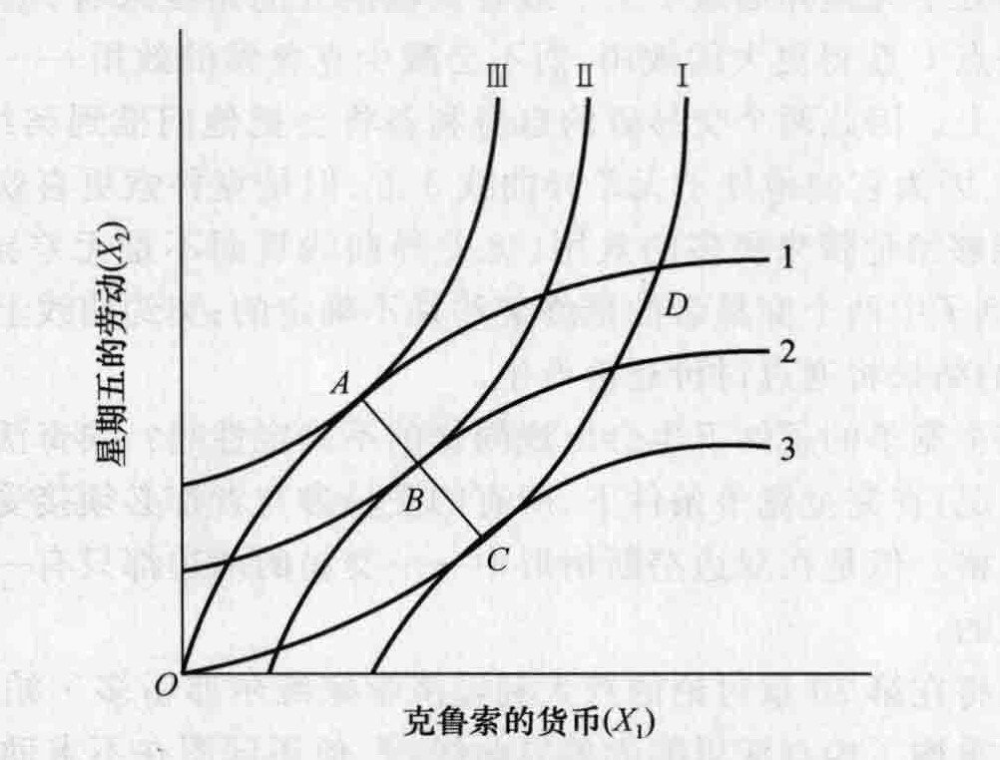
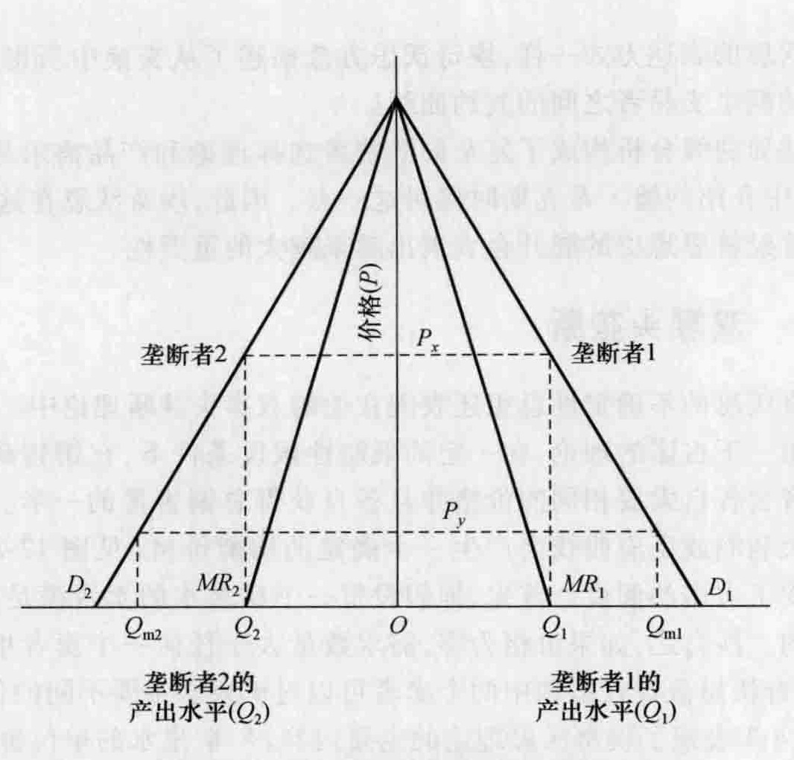
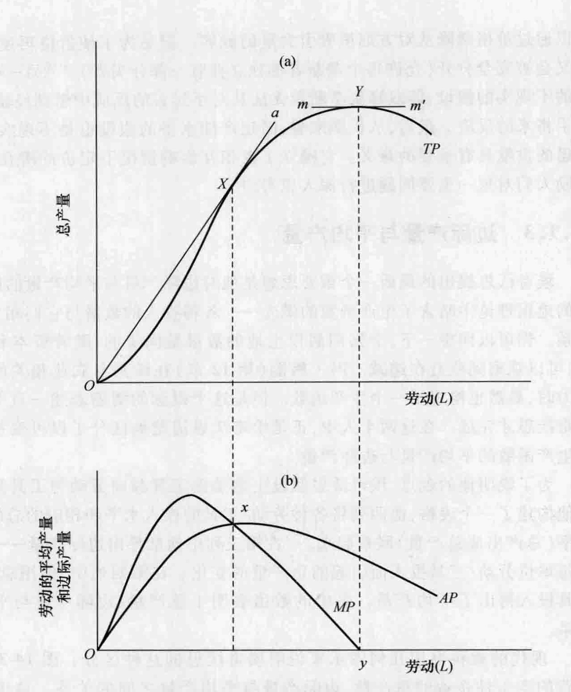
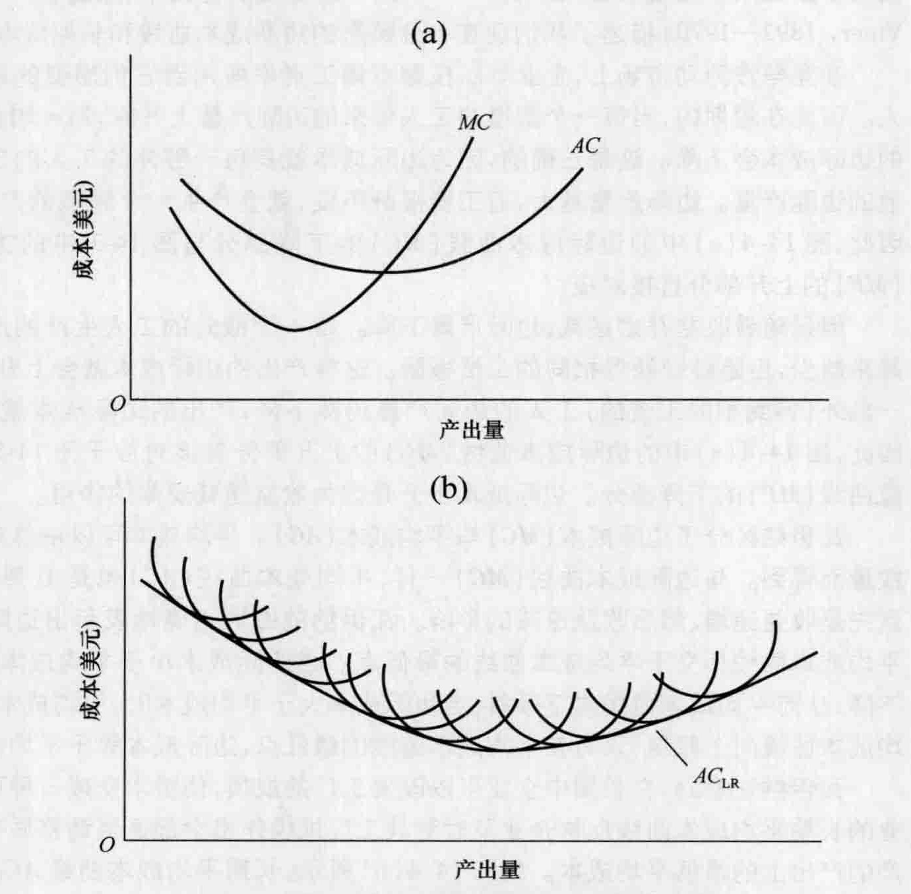
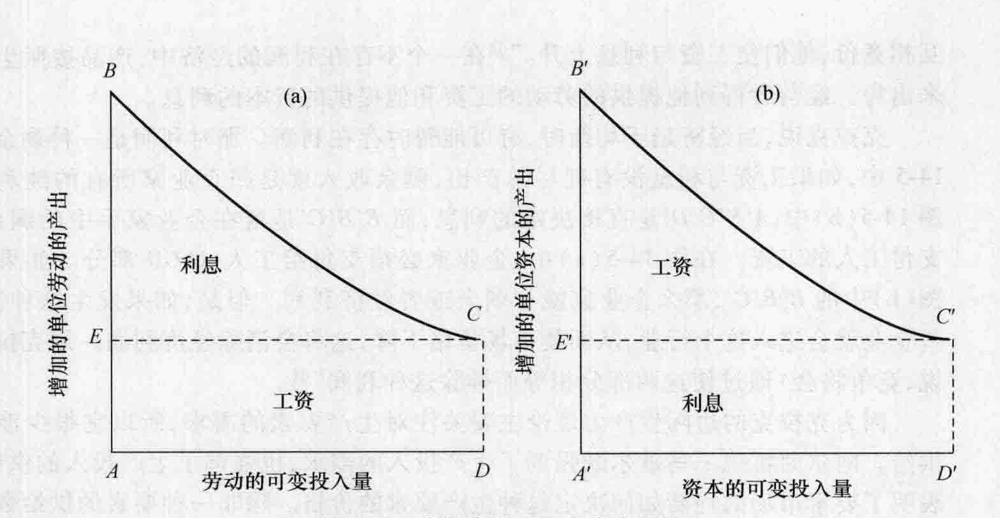

# 第 14 章 边际学派：埃奇沃思和克拉克

几位第二代边际主义者提出了一些思想，扩展和推进了前面两章讨论过的微观经济理论。这一章中我们将注意力转向其中两个人：弗朗西斯·Y. 埃奇沃思和约翰·贝茨·克拉克。

## 14.1 弗朗西斯·Y. 埃奇沃思

弗朗西斯·Y. 埃奇沃思 (Francis Y. Edgeworth, 1845—1926) 出生于爱尔兰，后来进入都柏林的三一学院，并且曾经在牛津大学学习。后来他成为牛津大学的政治经济学图克教授，在他的职业生涯中他一直在这个职位上。他是英国皇家经济学会的创建者之一，担任《经济学杂志》(The Economic Journal) 的编辑长达 35 年，担任了一个任期的统计学会主席，并且是英国科学院的成员。他对经济学的贡献体现在写于 1881 年的《数学心理学》(Mathematical Psychics) 和 1925 年收集成册题为《政治经济学论文集》(Papers Relating to Political Economy) 的大量论文中。

埃奇沃思接受了边沁的每个人都是一部“快乐机器”的概念。他说，消费者从他们的有限收入中寻求能够获得的最大化效用，工人们从他们的劳动中寻求最大净收益，企业家通过最小化某一特定产量的成本的方式组合资源，最大化他们的利润。按照埃奇沃思的观点，分析这种经济行为的最有效工具就是微积分。为了支持数学方法，埃奇沃思比较了数理经济学的精确与华丽的文字方法的曲折蜿蜒。

因此，总的来说，埃奇沃思对现代经济学的贡献之一是将数学方法的使用在经济学学科中普及化。这种方法的批评者——例如奥地利学派和制度学派——反驳道，“曲折的道路”产生关于经济现象或经济问题的新知识，显然要优于只能导致对已有知识进行无止境修正的“精确的道路”。但是除却这个方法论的争辩不论，在现代经济学中，数学在阐述和检验理论方面的重要性是毋庸置疑的，埃奇沃思和古诺是这一领域的早期开拓者。

在埃奇沃思对经济思想内容所作出的各种贡献中，有三个特别突出。首先，他最早提出了无差异曲线的思想，随着我们对经济思想史研究的不断深入，其重要性日益明显。第二，他是最早说明不确定性的经济学家之一，今天我们通常将不确定性与双寡头垄断者的定价行为联系在一起。最后，他阐明了平均产量和边际产量的差异，这对现代短期生产函数的发展及其广泛应用有很大帮助。

### 14.1.1 无差异曲线与交换

在他的《数学心理学》中，埃奇沃思提出了“无差异曲线”的概念，他说，无差异曲线表示能够给一个人带来同等效用水平的两种商品的各种组合。但是不同于我们后边章节要讨论的现代表述，埃奇沃思所画的无差异曲线基本上就像图 14-1 所示。他用这个图来分析仅有两个产品所有者之间的一个独立的交易，在这个例子中是鲁滨逊·克鲁索和他的得力仆人星期五。星期五拥有 $X_1$ 的劳动，而克鲁索拥有 $X_2$ 的货币。当然，星期五希望得到克鲁索的部分货币，而克鲁索希望利用星期五的部分劳动。

*图 14-1 埃奇沃思的契约曲线*

> 埃奇沃思将克鲁索的无差异曲线集（I、II、III）置于星期五的无差异曲线集（1、2、3）之上，并且标出了切点。契约曲线 ABC 描述了这些切点的轨迹，两人之间最终的交换条件将位于契约曲线上的某处。不在契约曲线上的任意一点（比如点 D），其中的一个交易者可以移动到更高的一条无差异曲线，而不会将另一个交易者推向较低的无差异曲线。

为了理解无差异曲线这种有点不寻常的表述方式，首先来分别研究每一组无差异曲线会有所帮助。图中的无差异曲线 1、2、3 是表示星期五的同等效用水平的曲线，非常像一幅表示相等海拔的等高线地图。比如，与曲线 1 上的点相对应的劳动与货币的一切组合对星期五都会产生相同的效用水平。然而，曲线 2 对星期五所产生的总效用水平要比曲线 1 大，而曲线 3 要比曲线 2 大。通过画一条穿过这些曲线的水平箭头，并注意它与每一条连续曲线的交点，我们可以证明，这些交点分别表示为了得到一定数量的星期五的劳动需要越来越多的克鲁索的货币。如果我们用地图的术语来考虑，我们可以说星期五更愿意处于偏向东方的无差异曲线上。尽管这个图只画出了星期五的三条无差异曲线，但是可以在这个无差异平面上画出其他此类曲线。

曲线 I、II 和 III 代表克鲁索的无差异曲线集。如果我们画一条穿过这些曲线的垂直箭头，我们会发现那些更偏向北方的曲线能够给克鲁索带来更高的总效用水平。顺着这个方向的每一条连续曲线都表示一定数量的克鲁索的货币可以得到更多数量的星期五的劳动。

通过把克鲁索的无差异曲线集叠加在星期五的无差异曲线集上，埃奇沃思得到了一条契约曲线 (contract curve)，它是两条无差异曲线的切点的轨迹。① 他得出的结论是，用克鲁索的货币来表示的星期五的劳动的价格是不确定的，它取决于讨价还价，但它将位于直线 ABC 上的某一点。② 为什么会这样？埃奇沃思的答案是，在直线 ABC 之外的所有点，星期五或者克鲁索都可以增加效用，而不会减少另一方所获得的效用。通过观察位于克鲁索的无差异曲线 I 和星期五的无差异曲线 1 上的点 D，我们可以看到这种情况。克鲁索可以达到无差异曲线 III 上的点 A，而不是在无差异曲线 I 上，而星期五仍然处于无差异曲线 1 上。或者从星期五的角度来看，星期五可以移动到无差异曲线 3 的点 C 获得更大的效用，而不会减少克鲁索的效用——克鲁索仍然保持在无差异曲线 I 上。因此两个交易者的自身利益将会把他们推到契约曲线上。当然，星期五喜欢点 C，因为它使他处于无差异曲线 3 上，但是克鲁索更喜欢 A 点，因为 A 点比 C 点能够给他带来更多的效用（无差异曲线 III 而不是无差异曲线 I 或 II）。重复一下：这个例子中两个交易者的最终契约是不确定的；契约曲线上任意一点都可能是均衡点，最终的结果将通过讨价还价产生。

在完全竞争的条件下也会出现同样的不确定性吗？埃奇沃思正确地指出不会出现这样的情况；在完全竞争条件下，所有的交易参与者都必须接受由市场决定的产品价格与劳动价格。但是在双边垄断情形中——交易的两边都只有一个卖者的情形——价格是不确定的。

我们将在第 20 章讨论的意大利经济学家维尔弗雷多·帕累托 (1848—1923) 以现代的形式重构了埃奇沃思的无差异曲线。③ 他还试图在不求助于埃奇沃思的关于效用的可度量性这一隐含假设的情况下得出无差异曲线。帕累托假设两个双边垄断者都可以从交易的两种产品中获得效用，比如说，这两种产品是小麦与亚麻，它们的数量表示在两条坐标轴上。大体上他构建了两个独立的图，每幅表示一个交易者，其中两种商品的无差异曲线都是凸向原点的。然后他将一幅图叠加在了另一幅图上形成一个方盒（现在一个原点在东北方向）。这个图通常可以在中级微观经济学教材中找到，并且非常适当地被称作埃奇沃思方盒。它只是比图 14-1 中的埃奇沃思的表述更复杂了一些。像埃奇沃思的表达方式一样，埃奇沃思方盒描述了从交换中所得到的效用和两种商品的仅有的两个交易者之间的契约曲线。

无差异曲线分析构成了复杂的消费者选择理论和产品需求理论的基础，我们将在第 18 章中介绍约翰·希克斯时探讨这一点。因此，埃奇沃思在这方面看似较小的一个贡献随着经济思想史的展开会表现出越来越大的重要性。

### 14.1.2 双寡头垄断

埃奇沃思的不确定性思想还表现在他的双寡头垄断理论中。我们可以从以前的讨论中回想一下古诺的理论，在一定的限制性假设条件下，在销售矿泉水的过程中，双寡头垄断者会各自索要相同的价格并且各自获得总销售量的一半。在古诺的理论中，双方的最大利润或反应曲线会产生一个确定的均衡价格（见图 12-2）。埃奇沃思从两个方面改变了古诺的假设。首先，他假设每一个矿泉水的卖者满足消费者需求的能力都是有限的。换言之，如果价格为零，需求数量大于任何一个卖者单独所能生产的数量。其次，埃奇沃思假设在短期中两个卖者可以对矿泉水索要不同的价格。

图 14-2 表现了埃奇沃思理论的主要内容。④ 矿泉水的单位价格由两个卖者共同的纵轴来度量。垄断者 1 的产出在横轴上由原点 $O$ 向右来衡量，而垄断者 2 的产出由原点向左来衡量。曲线 $D_1$ 和 $D_2$ 是垄断者 1 和垄断者 2 分别面临的需求曲线。这些曲线的基本假设是，在长期这两个企业将会平分市场份额。边际收益曲线表示为 $MR_1$ 和 $MR_2$，它们的位置根据古诺完全垄断模型（图 12-1）中设定的价格与边际收益之间的关系所决定。只有当每个企业都将它自己看作垄断者时，这些曲线才是相关的。我们将发现，一旦降价行为开始，这些企业就会成为竞争者，它们将边际收益看作与产品价格相等。与古诺模型一样，图 14-2 假设边际成本为零，即它们与横轴相一致。

埃奇沃思指出，每一个卖者都企图改变自己的价格（产量）而假设另一方的价格（产量）保持现有水平不变，来寻求利润最大化。

假设在初始时垄断者 1 作为完全垄断者进入市场，从而将其价格设定为 $P$。从边际收益曲线 $MR_1$ 和横轴的交点我们可以看到，在这个价格与产出 ($Q_1$) 的组合上利润最大化的条件得到满足：边际收益等于边际成本 (=0)。现在假设垄断者 2 进入市场。它会作何反应？它将采取与垄断者 1 相同的价格并且得到相同的销售量 $Q_2$。但是它看到垄断者 1 定价为 $P$ 并且假设它会保持这一价格，垄断者 2 就有动机索要一个略低于 $P$ 的价格，从而可以从垄断者 1 那里夺走部分生意。用专业术语来表达，即垄断者 2 看到它额外一单位产出的边际收益不是 $MR_2$ 而是等于它的要价。这个价格显然高于这些单位产出的零边际成本。但是，一旦这个较低的价格（图中没有标出）被确定下来，垄断者 1 相信垄断者 2 将会保持这个价格，它发现通过把价格降低到垄断者 2 设定的价格之下能够增加它的利润。为了获得额外的销售量和利润优势，降价行为会继续下去直到两个垄断者都在他们最大的产出水平 $Q_{m1}$ 和 $Q_{m2}$ 上进行生产。因此他们没有动机进一步降低他们的价格。请注意，在这些产出水平上，价格为 $P_c$ 并且每个企业仍然能够获得利润。对于每一个卖者来说，价格都超过了边际成本，并且每个卖者的总收益 ($P \times Q$) 都超过了它的总成本 (0)。

*图 14-2 埃奇沃思的双寡头垄断模型*

> 在埃奇沃思的双寡头垄断理论中，产品的价格是不确定的。它可以位于价格 $P_c$——如果他们是独立的垄断者他们会索要的价格——与价格 $P$ 之间的任一点上，$P$ 是能够使他们生产最大产出水平（假设是 $Q_{m1}$ 和 $Q_{m2}$）的价格。并且，价格有可能在这两个价格之间来回不停地运动。

价格会因此而停留在 $P_c$ 上吗？根据埃奇沃思的观点，不会。通过再次关注垄断者 1 的行为，这个有点奇怪的结论能够得到更好的理解。垄断者 1 会假设垄断者 2 将保持 $P_c$ 和 $Q_{m2}$ 的价格-产出组合。垄断者 1 看到了一种提高其利润的方式：将产出减少到 $Q_{m1}$ 以下，并且对垄断者 2 不能提供产品的顾客索要相应的高价。即垄断者 1 按照它自己的利益，在剩余的那部分市场份额中以一个完全垄断者的方式行动。单位产出价格的上升抵消因销售量减少造成的收益损失还有余。但是，垄断者 2 将会注意到垄断者 1 的高价并且效仿它，很乐意放弃一部分销售量以获取更大的总利润。这个价格将继续下去直至价格 $P$，在那一点上其中一方将会重新开始一场价格战。

结论是什么？按照埃奇沃思的观点，在两个垄断者没有采取共谋的情况下，均衡价格与均衡产出不存在。在图 14-2 中，$P_c$ 与 $P$ 之间的任意价格都是可能的，并且价格会上下振荡。

和古诺一样，埃奇沃思的双寡头垄断理论后来也遭到了猛烈的抨击。例如，张伯伦指出：“为了使价格下降，（双寡头垄断者的）个人市场完全合并成一个，每个垄断者都可以通过价格微降从对方那里吸引大量的顾客。但是为了使价格再度上升，他们的市场又会被完全分开（允许每个垄断者都独立拥有一部分买者）。”⑤ 另一些人批评埃奇沃思的不现实的假设，即双寡头垄断者无法从对手过去的反应中学到经验，因此不能预测对手将来的反应。最后，从长期来看，固定产能水平的假设也是不现实的。但是，埃奇沃思的贡献具有重要的意义。它确立了在相互影响情况下定价的潜在不确定性，并且激励人们对这一重要问题进行深入思考。⑥

### 14.1.3 边际产量与平均产量

埃奇沃思提出的最后一个重要思想是他对边际产量与平均产量的区分。李嘉图在他的地租理论中暗含了生产函数的概念——各种投入的数量与它们相应的产出之间的关系。你可以回想一下，李嘉图假设土地的数量是固定的，随着资本和劳动投入的增加，可以观察到收益在递减。冯·屠能（第 12 章）在谈到与农业相关的劳动的边际生产力时，显然也构思了一个生产函数。但是这个概念的清晰表述一直等到瓦尔拉斯和埃奇沃思才完成。在这两个人中，正是埃奇沃思清楚地区分了以可变投入比例为特征的生产函数的平均产量与边际产量。

为了说明他的观点，埃奇沃思假设土地是固定资源而劳动与工具是可变资源。然后他构建了一个表格，前两列将各种劳动/工具的投入水平和相应的总的农作物的产量水平（总产出或总产量）联系起来。⑦ 在第三列中他推导出边际产量——由于额外增加的每单位劳动/工具投入而引起的总产量的变化。在第四列中，他用总产量除以劳动/工具投入得出了平均产量。表中的数值表明了总产量、边际产量与平均产量之间的关系。

现代的教科书用几何图示来说明埃奇沃思的这种区分。图 14-3 表示一个短期经营的竞争性企业的总产量、边际产量与平均产量之间的关系。这里暗含的假设是生产过程只需要两种投入：可变资源劳动 ($L$) 与固定资源资本 ($K$)。图 (a) 表示一个短期生产函数，图 (b) 表示与图 (a) 中的总产量曲线相对应的劳动的边际产量与平均产量。

边际产量 ($MP$) 是由劳动投入变化引起的总产量的变化。通过使用微积分或者简单地画一条直线 $mm'$，与 $TP$ 曲线相切于一点，然后确定该直线的斜率，可以得到边际产量。例如，注意在点 $a$ 与 $TP$ 相切的 $mm'$ 的斜率为零，这就是边际产量的数值，在下面的图中用 $MP$ 上的点 $y$ 来表示。用同样的方法可以得到 $MP$ 上的其他点。那么平均产量曲线是如何得到的呢？可以通过几何图示方法得到，即从原点出发到总产量曲线任一点画一条直线，然后得到所画直线的斜率，就是平均产量曲线。图中 $Oa$ 就是这样一条直线。它的斜率 ($TP/L$) 就是在总产量曲线上表示劳动投入和总产量的点 $X$ 的平均产量 ($AP$ 曲线上的点 $x$)。

因此，图 14-3 帮助我们形象地理解埃奇沃思对总产量、边际产量与平均产量的区分。请注意，当总产量以递增的速度上升时，边际产量也在上升并且大于平均产量。因为 $MP > AP$，所以平均产量也上升。当一个大于平均数的数字被加到总数上，平均数肯定会上升。但是一旦总产量以递减的速度上升，边际产量开始下降，即边际收益递减出现了。最终，边际产量下降到平均产量以下，从而引起平均产量下降。⑧

这些关系在现代微观经济理论中是非常重要的。例如，它们能够解释典型企业的短期成本曲线的形状，是资源需求的边际生产力理论的基础，并且也为收入分配的边际生产力理论奠定了基础。我们将在历史借鉴 14-1 中讨论这些主题中的第一个，其他两个主题将在研究约翰·贝茨·克拉克时加以讨论。

*图 14-3 总产量、边际产量与平均产量之间的关系*

> 如图 (a) 所示，当劳动增加到固定数量的资本上时，总产量最初以递增的速度上升，然后以递减的速度上升，最后下降。因此图 (b) 中的劳动的边际产量与平均产量先是上升一段时间然后开始下降。当边际产量大于平均产量时，平均产量上升；当边际产量小于平均产量时，平均产量下降。

> **历史借鉴 14-1**
> **雅各布·瓦伊纳的成本曲线**
>
> 一旦经济学家确立了如图 14-3 所示的生产关系，他们就开始探索 $TP$、$MP$ 和 $AP$ 曲线对于企业成本曲线的含义。在 1931 年的一篇重要的论文中，雅各布·瓦伊纳 (Jacob Viner, 1892—1970) 描述了我们现在十分熟悉的短期成本曲线和长期成本曲线。*
>
> 在竞争性劳动市场上，企业可以按照市场工资率雇用到它们想要的或多或少的工人。因此在短期内，当每一个新增的工人带来的边际产量上升时，每一增加的单位产出的边际成本会下降。这是正确的，因为边际成本就是每一额外的工人的工资报酬除以他的边际产量。边际产量越大，而工资报酬不变，就会产生一个较低的产出边际成本。因此，图 14-4 (a) 中的边际成本曲线 ($MC$) 的下降部分与图 14-3 中的边际产量曲线 ($MP$) 的上升部分直接对应。
>
> 但是随着收益开始递减，边际产量下降。每一个额外的工人生产的产品的增加量越来越少，但是继续获得相同的工资报酬。这样产出的边际成本就会上升，并且只要每一额外（得到相同工资的）工人的边际产量仍然下降，产出的边际成本就会继续上升。因此，图 14-4 (a) 中的边际成本曲线 ($MC$) 的上升部分直接对应于图 14-3 中的边际产量曲线 ($MP$) 的下降部分。边际成本上升是因为收益递减规律的作用。
>
> 瓦伊纳区分了边际成本 ($MC$) 与平均成本 ($AC$)。平均成本可以由总成本除以产出数量而得到。与边际成本曲线 ($MC$) 一样，平均成本曲线 ($AC$) 也是 U 形的，因为它受到先是收益递增、然后收益递减的影响。瓦伊纳的图形正确地表示出边际成本曲线与平均成本曲线相交于平均成本曲线的最低点。当边际成本小于平均成本时，平均成本下降，从而平均成本曲线向下倾斜；当边际成本大于平均成本时，平均成本上升，从而平均成本曲线向上倾斜；只有在平均成本曲线的最低点，边际成本等于平均成本。
>
> 瓦伊纳注意到，在长期中企业可以改变工厂的规模，使资本变成一种可变投入。企业的长期平均成本曲线反映企业及时对其工厂规模作出全部适当调整后在任意能够生产的产出上的最低平均成本。如图 14-4 (b) 所示，长期平均成本曲线 $AC_{LR}$ 是短期平均成本曲线的“包络线”，意思是它包含无数短期平均成本曲线的切点。长期平均成本曲线 $AC_{LR}$ 的 U 形反映了规模经济与规模不经济。
>
> 瓦伊纳曾犯了一个著名的错误。他的长期平均成本曲线穿过了每条短期平均成本曲线的最低点而不是将短期平均成本曲线的切点连接起来。在他的论文集中重版那篇论文时，瓦伊纳写道：
>
> > 如果这个错误没有被发现，未来的老师和学生们将可以分享许多前辈的快乐，这些前辈指出，如果我早知道什么是“包络”，我将不会使我的优秀的初稿画一条在技术上不可能并且在经济配置上不合适的穿过所有的短期平均成本曲线最低点的（长期）平均成本曲线……**
>
> 具体讽刺意味的是，这一画图错误只是使瓦伊纳的文章受到了更多关注，并且使人们更加意识到他的杰出贡献。
>
> \* 瓦伊纳是芝加哥大学的教授。他 1931 年的文章 “Cost Curves and Supply Curves” 被重版于他的文集中：*The Long View and the Short* (Glencoe, IL: The Free Press, 1958): 50—78.
> \*\* Viner, 79.

*图 14-4 瓦伊纳的短期成本曲线和长期成本曲线*

## 14.2 约翰·贝茨·克拉克

约翰·贝茨·克拉克 (John Bates Clark, 1847—1938) 赢得了国际声望并且代表了美国对边际主义经济学的巨大贡献。他出生于罗德岛，曾经在阿默斯特和德国学习，并先后在卡尔顿、史密斯、阿默斯特、约翰·霍普金斯和哥伦比亚大学任教。索尔斯坦·凡勃仑（第 19 章）是克拉克在卡尔顿学院的学生，他后来的声望对于克拉克来说是一种巨大的荣耀。虽然凡勃仑的大部分声望是建立在对克拉克所提出的经济理论的批评之上，但克拉克并没有受到干扰。1947 年，美国经济学会发起设立了约翰·贝茨·克拉克奖章，每隔一年颁发给有前途的青年经济学家。

在 1880 年左右，克拉克似乎就已经相当独立地想出了边际效用的概念及其对交换价值的影响；很明显他并没有读过杰文斯的著作。⑨ 更重要的是，他不仅发明了边际生产力这个术语，而且还提供了到他那个时代为止关于分配的边际生产力理论的最清晰、最优秀的分析。我们将会发现他的理论建立在收益递减规律的基础上，克拉克将这一规律应用到所有的生产要素上。

### 14.2.1 分配的边际生产力理论

在其最重要的著作《财富的分配》(The Distribution of Wealth) 的前言第一段里，克拉克这样总结他对分配的分析以及得到的结论：

> 这部著作的目的是要表明社会的收入分配是受自然规律所控制的，并且如果这个规律的运转没有摩擦，那么这个规律将给予每种生产要素它所创造的财富的数量。但是工资可能受到个人之间自由进行的讨价还价的调节，由于这些交易而得到的工资率趋向于并且在这里要求与劳动者本身所创造的那部分工业产品相等；并且利息也可能受到与此相类似的自由的讨价还价的调节，它会自然地趋向于与独立地来源于资本的那部分产品相等。在经济体制中财产权利起源的那一点上——即当劳动与资本逐渐形成后来国家视为它们自己的那部分数额的财产时——社会过程是忠实于财产权所赖以存在的原理的。只要不受到阻碍，它会分配给每个人他专门生产的那部分产品。⑩

克拉克的分配理论建立在边际收益递减规律的基础上，他在 1888 年美国经济学会的第三届年会会议论文中第一次提出了边际收益递减规律。我们从过去的讨论中知道，这个规律最初只是应用于农业（甚至埃奇沃思的图表也应用了一个农业的例子）。克拉克将这一思想推广于所有生产要素。潜在的假设是所有其他的东西特别是技术保持不变，而一种要素变化。因此，如果资本、土地和企业家才能都保持不变，而只是增加若干单位的劳动，劳动的边际产量和平均产量最终将下降，即使总产量仍将继续增长。与此相类似，如果其他要素保持不变而资本不断增加，资本的边际产量和平均产量最终将下降。认识到收益递减并不是由于劳动或资本投入数量的增加导致它们质量下降而引起的，是很重要的。所有这些单位的要素都是同质的并且因此可以相互转换。相反，边际收益递减出现是因为最后相对于可变要素而言，固定要素被过度使用。换言之，在某一点上，可变要素相对于固定要素而言变得如此丰富以至于额外单位的可变要素不能对产出作出太多贡献。例如，当劳动是可变要素时，工人可能在生产线上使用机器时不得不等待。当资本是可变资源时，机器和工具可能处于闲置状态，因为需要使用它们的工人可能没有时间。

克拉克将收益递减规律进行如下描述：

> 最后的工具比之前的工具给人们的效率带来较少的提高。如果由固定数量的劳动力来使用不断增加的资本，那么资本将服从生产力递减规律……当劳动与一个固定数额的资本相联系使用时，劳动的边际生产力递减就是一个普遍现象……这个一般规律的作用……就成为分配理论的基础。⑪

克拉克在完全竞争条件下的分配的边际生产力理论用图 14-5 来表示。在图 (a) 中，假设资本不变，BC 曲线代表劳动的边际生产力。这仅仅是边际产量曲线向下倾斜的部分，即我们在前面的图 14-3 中的 $MP$ 曲线。第一个工人 A 将生产 AB 的产出或总产量。但是由于收益递减的作用，后来的工人所增加的产出或总产量要比以前的工人所增加的少。如果雇用了 AD 数量的工人，最后一个工人生产的产出为 DC，这也确定了全部工人的工资率（每一个工人都可以被看作边际上的工人）。于是我们可以看到，曲线 BC 是一条劳动需求曲线，它表示在每一不同的工资率水平上将会被雇用的工人的数量。例如，如果工资率高于 AE（或 DC），那么雇主将会雇用少于 AD 数量的工人，一些工人所贡献的产出将不足以达到较高的工资水平。类似地，如果工资低于 DC，就会雇用超过 AD 数量的工人。即使增加的工人的边际产量在下降，它也会高于这个新、较低的工资水平。当可变要素——在这个例子中是劳动——的边际生产力等于要素的成本或收入时，均衡工资出现。

克拉克指出，在图 14-5 (a) 中，总工资用 AECD 的面积 ($AE \times AD$) 来表示。由于总产出是曲线下方的总面积 ABCD，因此剩余部分 EBC 就是资本产生的利息。这是固定要素的合法收益。

在图 14-5 (b) 中，克拉克将劳动力数量保持固定——图 (a) 中的 AD 数量——而生产中使用的资本数量是变化的。曲线 $B'C'$ 代表资本的边际生产力，因此也是对资本的需求曲线。在均衡点上，每单位的资本得到其边际产出作为回报，即 $D'C'$。总利息是 $A'E'C'D'$。$E'B'C'$ 是归于劳动的剩余。如果资本的数量增加，其他保持不变，资本的边际生产力和利息率都将下降。如果资本的数量减少，资本的边际生产力和利息率都将上升。

*图 14-5 克拉克的边际生产力理论*

> 在图 (a) 中，克拉克假设资本是固定的，BC 代表劳动的边际产量。如果雇用了 AD 数量的工人，每个工人的工资率将为 AE 或 DC，总工资收入将为 AECD，剩余产量 EBC 将作为资本产生的利息。在图 (b) 中，劳动是固定的而资本是可变的。利息率将取决于使用了多少资本。如果使用 A'D' 数量的资本，那么利息率将为 A'E'。总利息将为 A'E'C'D'，总工资将为 E'B'C'。两种要素都获得了等于它们边际贡献的报酬。

克拉克将土地与资本看作一种生产要素，因此将支付给土地的地租与利息合并在一起。他承认他的分配理论是对李嘉图的地租理论的一般化：

> 我们应该将土地的地租当作一种资本品的收益来进行研究——仅仅是当作利息的一部分。我们现在可以看到，工资与利息尽管是由最后的生产力的规律来决定的，但它们也可以被精确地度量，就像我们对土地地租所进行的度量一样。也就是说，用来描述土地所获得的收益的李嘉图法则，可以被用来描述整个社会资本资金所获得的收益：所有的利息可能会采取一种级差收益的形式，或剩余的形式。再者，李嘉图法则也可以用来描述整个社会劳动力的收益；工资就其整体而言，也是一种级差收益。因此，一方面所有劳动的收入，另一方面资本的收入，都应该与土地的地租是完全类似的，这是最引人注意的经济事实之一。如果我们用地租来表示级差产品的话，它们是两类通用的地租；土地收益是其中一种的构成部分。⑫

那么利润呢？克拉克说：“利润在这种静态条件下不存在。”在一个完全竞争的经济中，经济利润——超过资本和企业家才能正常收益的部分——在生产过程的两端都趋于消失。“通过在出售产品时互相竞价，雇主们使价格降低；而在雇佣劳动与资本时互相竞价，他们使工资与利息上升。”⑬ 在一个不存在利润的经济中，产品按照生产成本来出售。经营者得到他提供的劳动的工资和他提供的资本的利息。

克拉克说，当经济趋于均衡时，有可能暂时存在利润。那时利润是一种剩余。在图 14-5 中，如果工资与利息没有耗尽总产出，剩余收入就是归企业家所有的纯利润。在图 14-5 (b) 中，$A'E'C'D'$ 是直接决定的利息，而 $E'B'C'$ 是留在企业家手中的剩余，用于支付工人的工资。在图 14-5 (a) 中，企业家必须支付给工人 AECD 部分。如果它少于图 (b) 中的 $E'B'C'$，那么企业家就有剩余或者经济利润。但是，如果发生这种情况，一些企业就会进入这个行业，从而使市场价格下降，这将会消除经济利润。用克拉克的话说，竞争将会“通过使这两部分相等而排除这种利润”⑭。

因为克拉克的边际生产力理论主要关注对生产要素的需求，所以它很少涉及要素供给。阿尔弗雷德·马歇尔既强调了生产投入的需求，也强调了生产投入的供给，因此表明了要素市场的均衡如何决定每种生产要素的价格。除非一种要素的供给数量被假设为固定的，否则一种要素的边际生产力并不能单独决定其报酬率。拿劳动来做例子，如果劳动供给相对于劳动需求来说很大，那么劳动的工资和劳动的边际生产力将会很低；如果供给是有限的，工资和边际生产力将会很高。因此，很显然，尽管克拉克的工资理论远远比以前的那些理论要高明，但它仍需要由阿尔弗雷德·马歇尔作出相当程度的改进。

克拉克认识到他的收入分配理论是静态的，最适合于做一种纯粹的分析工具。他设计这种理论用来说明，如果劳动与资本的供给保持不变、生产方式的改进停止、消费者的需求永不会改变，价格、工资和利息将趋向于什么样的水平。他说，我们分别研究这样的静态规律是为了理解在动态社会中的情形。世界是动态的这样一个事实并不会使静态理论的结论失效，因为静态规律依然是一些真实规律，在经济中每次动态变化之后都会再次证实它们自己。克拉克并没有提出任何全面的动态（历史的）理论。他几乎只信赖我们今天所谓的比较静态方法，因为他会对不同的静态均衡点进行比较。

克拉克说，在真实世界中，一个合法的垄断企业可能会给企业家带来永久的经济利润。尽管有自然的经济力量拉动，但是劳动与资本受到阻碍而不能进入这个有利的行业。但是，这种状况并不是一种真正的静态。就像一个平静的水体一样，静态是拥有完全的流动性但并不流动；生产要素具有完全的流动性但并不运动。垄断代表了一种障碍，它阻碍静态经济规律发生作用。

资本是生产性的，因此存在利息。“支付利息只不过是在购买资本的产品，就像支付工资是在购买劳动的产品一样。”⑮ 利息提供了节欲的动机。积累生产性财富的动机是对持久收入的渴望。节欲导致产生新的资本品，但是并不需要额外的节欲来维持现有的资本存量。克拉克说，积累是经济动态的一部分。在现实世界中，资本比劳动供给增加更快，因此真实工资上升而真实利息率下降。

只要人们能够准确地判断资本品的生产力，资本品就将按照其生产力的顺序被使用。最粗糙的短斧将极大地提高人们获取木柴的能力，但是后来发明的更好的工具只能使生产力提高一个较小的百分比：

> 随着积累的进行，常常会出现造价昂贵的机器，其中包含更多的资本；而使用这些机器生产出来的产品是它们成本中的一个更小的部分。铁路线路的延伸是资本找到投资方式的一种。其花费可能与最初建设公路本身的相应部分一样多；但是它并没有像建设那些老旧的、弯曲的公路一样，解放与其成本成比例的劳动力……在每个地方，资本的各种形式都表现出获利能力的差异；资本所有者会首先选择最具生产性的形式，而后选择非生产性的形式。这个事实是由于当前较低的利息率造成的。我们现在正在利用的是那些排在序列后面的、具有较低规模生产力的投资机会。⑯

然而，克拉克仍然对经济动态的结果感到乐观。他认为五种趋势有助于推进工业进步：(1) 人口增长，(2) 资本积累，(3) 工业进步的技术过程，(4) 组织资本与劳动的方式变得更有效率，(5) 人类需求的逐步多样化与精细化。克拉克说，人口增长没有资本增长快，因此工业进步的大部分利益将被以工资谋生的阶层得到。

在 1896 年，克拉克似乎对商业垄断的兴起并不关心。⑰ 他认为，他们的高价格吸引了新的竞争者，而且他们的巨额利润被用于再投资，因此促进了经济进步。托拉斯从公众那里攫取的金融费用以算术级数增长。但是，经济进步通过积累与再投资以几何级数增长，这常常使工业的成果成倍增加。当巨大的托拉斯侵入到另一个领域时，它们被迫提高效率，大公司自然就比小公司更有效率。

但是，在 1907 年，在研究他所谓的经济动态的一部著作《经济理论的实质》(Essentials of Economic Theory) 中，克拉克开始对托拉斯问题感到沮丧。托拉斯是经济动态的产物。托拉斯之间那些激烈的、代价高昂的竞争致使他们采取了最后的步骤，即组织化，从而结束了竞争。产品变得愈加稀缺和昂贵：

> 倘若一个社会是不可救药的私人垄断制度，那么任何描述都不会夸大这个社会贮藏着的罪恶。在这个无所不包的名称下，我们将那些最重要的、不仅存在并且肯定损害自然经济规律发挥作用的要素归为一类。垄断阻碍生产进步并且在分配中注入了抢掠的因素。它扭曲了那些趋向于保证个人得到他们生产的全部产品的力量。它使价格与工资异常并且扭曲了工业机制的形式……价格与成本标准不相符，利息与资本的边际产量不相符。由于在某些点上投入了过多的劳动与资本而在其他点上几乎没有投入，因此工业关系体系失去平衡。利润不是对进步的一种暂时的报酬——给予人类动态冲动的激励的报酬——而是在某种程度上宠坏了那些给经济进步带来不利影响的人们。⑱

克拉克赞成政府对垄断进行管制以保护竞争。实际上，他主张为了达到自由放任这一信条的目标，我们应该凌驾于自由放任之上——将资源配置在它们最有价值的用途上，使生产要素与它们所贡献的价值相一致。

### 14.2.2 克拉克分配理论的伦理含义

1879 年，亨利·乔治 (Henry George, 1839—1897) 出版了他的《进步与贫困》(Progress and Poverty) 一书。在书中，他主张所有的经济租都是不劳而获的收入，它随着社会进步而不断增长，并且它使其他的所有阶层都更加贫困。按照乔治的观点，解决的办法是，通过一种土地单一税将所有的这类租金都以税收形式拿走。通过这种方式，税收对资本的“反向激励”效应将被消除。尽管乔治反对社会主义，许多经济学家认为他的税收建议结果将会使土地国有化，且没有补偿，土地将被租给出价最高的竞标者。⑲

克拉克非常清楚他的边际生产力理论直接证明了乔治的观点。同时，下面这段论述证明，对于马克思的理论即资本主义是以劳动剥削为基础的制度，克拉克非常警觉：

> “剥削劳动”的指控笼罩着整个社会。据说：“工人们经常被夺走他们生产的产品。这是在法律形式的范围内并且通过竞争的自然作用完成的。”如果这种指控被证实，那么每一个头脑清醒的人都应该成为一个社会主义者；他对转换工业制度的热情可以衡量和表达他的正义感。但是，如果我们要检验这种指控，我们必须进入生产领域。我们必须将整个社会的工业产品分解成它的组成要素，以看清竞争的自然结果是否给予每个生产者他所创造的那个数额的财富。⑳

克拉克从他的边际生产力理论中得出的一般结论是，社会收入分成工资、利息与利润从原理上来说是公平的。社会并不能随意破坏“分配的固定法则”。如果所有的人都得到他们创造的所有产品，那么在工业中将力量结合在一起的不同阶层的人们就不会互相怀有怨恨。私人产权从伦理上是合理的，因为它建立在合乎道德的收入分配的基础上。

关于经济公平的这一观点并非没有受到挑战。批评者指出，在充满垄断与买方垄断势力的现实世界中，要素报酬并不等于边际生产力。他们还指出，大量的财产都是继承的，而不是通过某人自己的生产性努力获得的。因此，即使资本是根据其贡献获得报酬，这并不一定意味着归于个人的分配就是符合伦理的。坦率地说，继承从某种程度上使“按其贡献进行分配”这一概念变得毫无意义。最后，批评者指出克拉克的公平观点包含了循环论证。这个理论要求假设最初的收入分配是符合伦理的，以符合后来的公平分配的事实。更具体地说，生产出来的产品——以及因此所需要的生产要素的种类与数量，取决于消费者支出的方式。适当的收入分配将会决定支出的方式形成，因此影响接下来的收入分配的方式。但是我们如何能够肯定最初的分配是符合伦理的呢？在这里，哲学思考及复杂性就变得很重要。我们可能记起在一个产权辩论中两个人的对话，他们都声称他们拥有对一块土地的所有权。第一个人说：“这块土地是我的！”但是第二个人反击道：“不，它不是你的，这块土地几个世纪以来一直属于我的家族。我的曾祖父打败了印第安人得到了这块土地。”第一个人回答道：“好的，我将打败你而得到这块土地！”

大多数当代经济学家得出的结论是，边际生产力理论有助于解释在资本主义社会中收入是如何分配的，但是作为对我们观察到的分配的一种伦理解释，它还是远远不够的。

> **历史借鉴 14-2**
> **克拉克、边际生产力与首席执行官的薪水**
>
> 许多美国大公司的首席执行官 (CEO) 可以挣得数百万美元的薪水。例如，在 2011 年收入最高的十位 CEO 中，最低者也得到了 3 600 万美元的年薪（包括工资、红利与股票期权）。这些天价薪水符合约翰·贝茨·克拉克的边际生产力理论吗？即它们是否反映了 CEO 对公司产出从而对公司收入所作的贡献？
>
> 在这个问题上，经济学家及政府官员们有着许多争论。那些相信 CEO 的薪水从总体上说可以从边际生产力方面予以证实的经济学家提出了如下两条论据：第一，他们指出，大公司的 CEO 所作出的决策，无论是好是坏，都会影响整个组织的生产力——从他们直接的下属到最底层的员工每个人都会受到影响。好的决策会通过整个组织提高生产力，坏的决策则相反。只有那些表现出不可思议的能力，持续作出好的商业决策的经理人员才能获得大公司里的最高职位。因为他们的供给是有限的，而且他们的边际生产力巨大，所以顶尖的 CEO 们可以得到巨额的薪水。
>
> 第二，有些经济学家指出，CEO 的报酬可能类似于职业高尔夫球手和职业网球手赢得锦标赛后获得的奖金。这些高额奖金的目的是提高那些渴望获胜的人的生产力。在公司中，经理们之间竞争中的获胜者将获得的最高奖项是至少最终得到 CEO 的职位。因此，CEO 的高额薪水可能并不仅仅来自 CEO 的直接的边际生产力。相反，它的存在可能是因为高额薪水可以创造一种激励，提高公司中数百名“赶超崇拜者”的人的生产力。无论如何，请注意 CEO 的高额薪水仍然是以高生产力为基础的。
>
> 批评现在的 CEO 薪水的人也承认 CEO 应该得到高于普通工人或代表性经理的薪水，但是他们嘲笑那种认为现在的 CEO 的过高的薪水从经济上是合理的观点。他们指出，在其他工业化国家，包括日本和德国，CEO 的报酬远远低于美国。而且，他们还指出，在美国主要公司中 CEO 的薪水与平均薪水的比率远比他们的外国对手的这个比率高，外国对手中的很多公司在与美国公司的竞争中表现得相当成功。
>
> 那么，为什么在美国会出现数百万美元的薪水呢？批评者说，答案在于公司所有权和经营权的分离。公司归股东拥有，但是由很大程度上独立于公司所有者的董事会和职业经理人所管理。因为许多董事会的成员是其他公司的现任 CEO 或过去的 CEO，因此他们倾向于夸大 CEO 的重要性，结果支付给自己公司的 CEO 过高的薪水。实际上，公司董事会将企业的一部分利润转化为 CEO 的过高的薪水——而利润应该归公司股东所有。不满的股东常常会简单地卖掉某一特定公司的股份，而不是尝试去改造董事会或者改变公司 CEO 的报酬规模。此外，一些公司中 CEO 的过高的报酬会引起其他公司中的过高的报酬，因为其他的公司也希望吸引与留住 CEO 人才。
>
> 简而言之，批评者认为在 CEO 的数百万美元的报酬与公司生产力和收入之间几乎没有联系。从我们的讨论中可以很明显地发现，这个问题仍然没有解决。

### 14.2.3 “加总”问题与规模报酬

克拉克的边际生产力理论引发了一个理论争论，从中产生了规模报酬这个重要的经济思想。克拉克的分析意味着支付给每种生产要素其边际产量将会耗尽全部产出。根据图 14-5 (a) 和 (b) 来说，两个图中的工资区域将会相等，两个资本区域也会相等。用另一种方式来表述就是，在每个图中工资与利息区域之和将正好等于总产出区域。

菲利普·H. 威克斯第德 (Philip H. Wicksteed, 1844—1927) 对这个命题进行了更加深入的研究。通过数学运算他得出结论，只有在完全竞争和规模报酬不变的情况下，以边际生产力为基础的报酬的和才能“加总”为总产出。当生产过程中使用的所有资源都同比例增加，结果总产量也以相同的比例增加，此时就出现了规模报酬不变。更具体地说，假设资本和劳动都增加了 100%（企业规模扩大一倍），如果总产出或总产量也增加了 100%，那么这个企业就是规模报酬不变。

几位著名的经济学家，其中包括埃奇沃思、帕累托和瓦尔拉斯从不同的依据出发对威克斯第德的论点提出了挑战。关于这个深奥的“加总”问题争论的细节几乎没有什么现代意义，但是这个争论确实产生了一个有益的结果：对规模报酬规律有了更加清楚的理解。当规模报酬不变时，生产一种产品的长期平均成本也将不变。结果之所以如此是因为总产出与总成本以相同比率增长。当所有的投入以一个比例同时增长，而总产出以一个更大的比例增长时，我们说这时出现了规模报酬递增。规模报酬递增导致平均生产成本更低，因为总成本比总产出增加了一个较小的量。最后，当投入以相同比例增长而引起总产出以一个更小比例增长时，就发生了规模报酬递减。因此，如果其他情况不变，平均生产成本将上升。

瑞典经济学家克努特·威克塞尔（第 16 章）在 20 世纪早期就撰文指出，一个典型的企业在增加其投入的早期阶段可能会经历规模报酬递增，然后是规模报酬不变，最后是规模报酬递减。如果转化成平均成本的概念，这就意味着现在我们熟悉的 U 形长期平均成本曲线，前面在历史借鉴 14-1 中说明过。随着一个典型企业扩大其工厂规模，它首先会经历平均成本下降，然后最终平均成本上升。今天，我们将前者称为规模经济，后者称为规模不经济。

---

① 埃奇沃思仅画出了每个人的一条无差异曲线，但他指出存在一系列这样的曲线。

② 杰文斯错误地认为存在一个确定的解。

③ 如果你对无差异曲线的现代表述不太熟悉的话，在此提前看一下图 18-3 可能会有帮助。

④ 这个讨论是基于：Francis Y. Edgeworth, *Papers Relating to Political Economy*, vol. 1 (London: Macmillan, 1925), 111—142.

⑤ Edward H. Chamberlin, *The Theory of Monopolistic Competition*, 7th ed. (Cambridge, MA: Harvard University Press, 1958), 40—41.

⑥ 1929 年，霍华德·霍特林 (Howard Hotelling) 提出了一个双寡头垄断理论，对埃奇沃思的以下观点提出了挑战：价格和产出水平的不稳定是双寡头垄断的特征。我们在他的著作中可以看到更多：“Stability in Competition,” *Economic Journal* 39 (1929): 41—57.

⑦ 该表可参见：Edgeworth, *Political Economy*, 1:68.

⑧ 图 14-3 中标为 TP 的曲线被称为短期生产函数。后来的经济学家扩展了其他的生产函数，其中所有的投入都是可变的。一篇非常重要的文章请见：Charles Cobb and Paul Douglas, “A Theory of Production,” *American Economic Review* 18, no. 1 (March 1928): 139—165. 作者提出了现在被称为柯布-道格拉斯生产函数的基本原理，该函数是应用在高级宏观和微观经济学领域的重要工具。

⑨ 萨缪尔森对此评论道：“在一个新理论广泛发表之后十年甚至更久才自学学会了它，等于是在向陪审团请求一个对疏忽的判决而不是对光辉的奖赏。”引自詹姆斯·托宾 (James Tobin): “Neoclassical Theory in America: J. B. Clark and Fisher,” *American Economic Review* 75, no. 6 (December 1985): 30.

⑩ John Bates Clark, *The Distribution of Wealth: A Theory of Wages, Interest and Profits* (New York, Macmillan 1899), v.

⑪ Clark, *Distribution of Wealth*, 48—50.

⑫ Clark, *Distribution of Wealth*, 191.

⑬ Clark, *Distribution of Wealth*, 179.

⑭ Clark, *Distribution of Wealth*, 203.

⑮ Clark, *Distribution of Wealth*, 135.

⑯ Clark, *Distribution of Wealth*, 185—186.

⑰ John Bates Clark, “The Theory of Economic Progress,” *Economic Studies*, American Economic Association, vol. 1 (April 1896), 11—15.

⑱ John Bates Clark, *Essentials of Economic Theory* (New York: Macmillan, 1907), 375, 377.

⑲ 在本书的网站上，你可以在本章补充资料部分读到更多亨利·乔治的思想。

⑳ Clark, *Distribution of Wealth*, 7.

## 复习与讨论

1.  解释下列名词，并简要说明其在经济思想史中的重要性：埃奇沃思，无差异曲线，契约曲线，边际产量与平均产量，约翰·贝茨·克拉克，工资与利息的边际生产力理论，威克斯第德，规模报酬不变，规模报酬递增，规模报酬递减，亨利·乔治。
2.  讨论下列论断：就经济学而言，数学的简洁要远远优于“辞藻华丽而又曲折蜿蜒的文字表达的途径”。
3.  参考图 14-1，回答下列问题：(a) 埃奇沃思的无差异曲线从哪个方面暗示了边际收益递减？(b) 解释为什么两个交易者的个人利益会将他们推向位于契约曲线 ABC 上的点？
4.  比较古诺与埃奇沃思的双寡头垄断理论。埃奇沃思的双边交换理论（图 14-1）与他的双寡头垄断理论有哪些共同之处？
5.  参考图 14-3，解释为什么在增加投入的某些范围内，即使边际产量在下降而平均产量仍然在上升？
6.  瓦伊纳的短期边际成本曲线和平均成本曲线与埃奇沃思的边际产量曲线和平均产量曲线有何联系？
7.  在图 14-5 (a) 和 (b) 中，从哪方面而言，克拉克的边际生产力曲线是劳动需求和资本需求曲线？请解释。为什么一个人必须对资本和劳动的供给有所了解才能形成一个关于工资与利息的全面的理论？
8.  在图 14-5 (a) 和 (b) 中，如果一个企业要得到经济利润必须满足哪些条件（指出图中的特定区域）？为什么在克拉克看来，这种利润在长期内将会消失？
9.  如果你被要求写一篇关于约翰·贝茨·克拉克和他的边际生产力理论的先驱者的论文，你将包括哪些人？解释为什么。
10. 比较克拉克的收入分配的边际生产力理论和马克思的分配理论。

## 精选文献

**书籍**

*   Blaug, Mark, ed. *Alfred Marshall and Francis Edgeworth*. Brookfield, VT: Edward Elgar, 1992.
*   Clark, John Bates. *The Distribution of Wealth: A Theory of Wages, Interest and Profits*. New York: Macmillan, 1899.
*   ——. *Essentials of Economic Theory*. New York: Macmillan, 1907.
*   Edgeworth, Francis Y. *Mathematical Psychics*. London: Routledge & Kegan Paul, 1881.
*   ——. *Papers Relating to Political Economy*. Vol. 1. London: Macmillan, 1925.
*   Stigler, George J. *Production and Distribution Theories*. New York: Macmillan, 1941.

**期刊论文**

*   Brue, Stanley L. "Retrospectives: The Law of Diminishing Returns," *Journal of Economic Perspectives* 7 (Summer 1993): 185—192.
*   Collier, C. F. "Henry George's System of Political Economy," *History of Political Economy* 11 (Spring 1979): 64—93.
*   Henry, John F. "John Bates Clark and the Marginal Product: An Historical Inquiry into the Origins of Value-Free Economic Theory," *History of Political Economy* 15 (Fall 1983): 375—389.
*   Humphrey, Thomas M. "The Early History of the Box Diagram," *Economic Quarterly* 82 (Federal Reserve Bank of Richmond, Winter 1996): 37—75.
*   Nichol, Archibald J. "Edgeworth's Theory of Duopoly Price," *Economic Journal* 45 (March 1935): 51—66.
*   Tobin, James. "Neoclassical Theory in America: J. B. Clark and Fisher," *American Economic Review* 75, no. 6 (December 1985): 28—39.