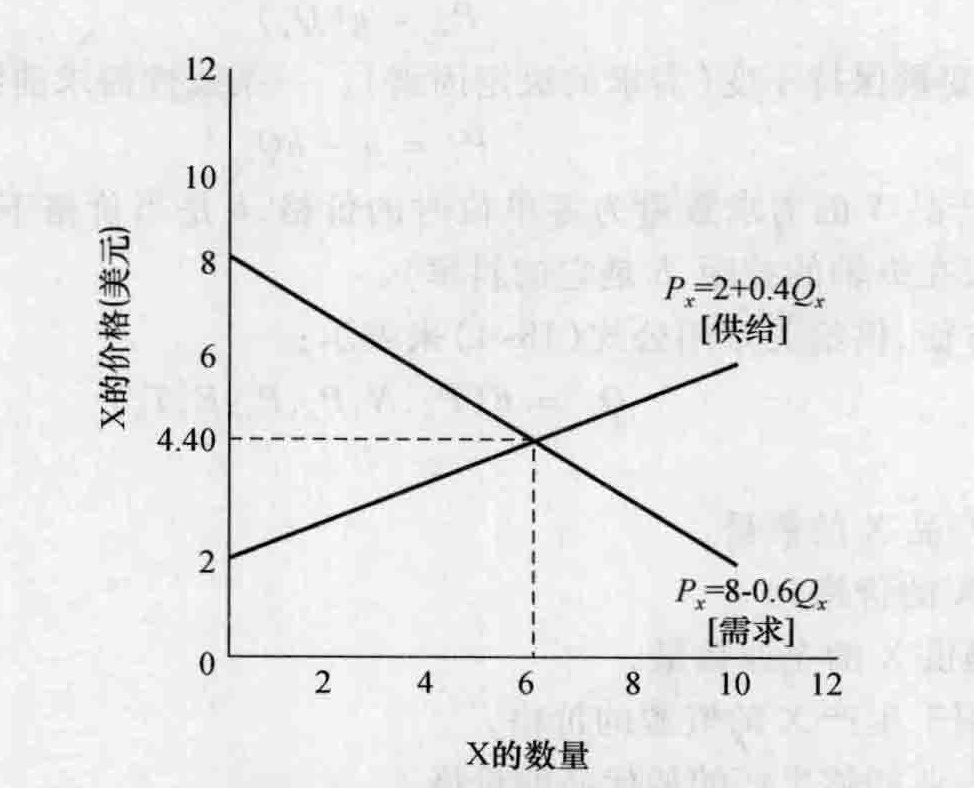
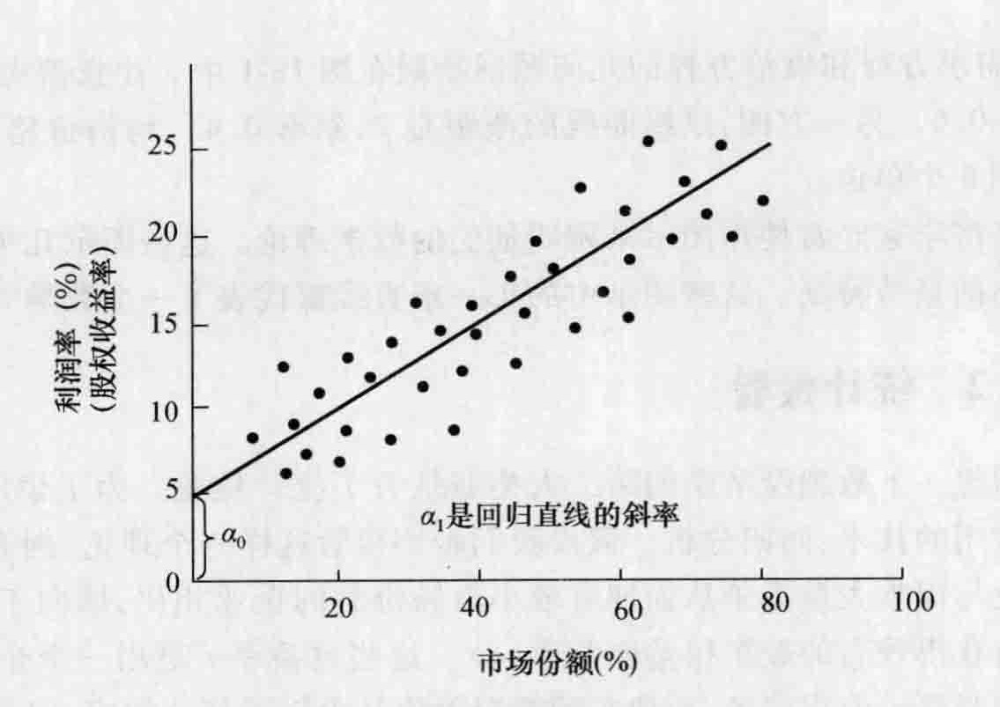
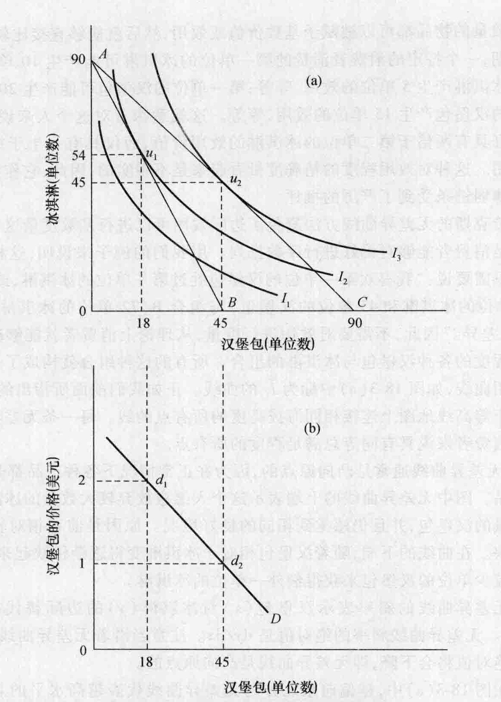
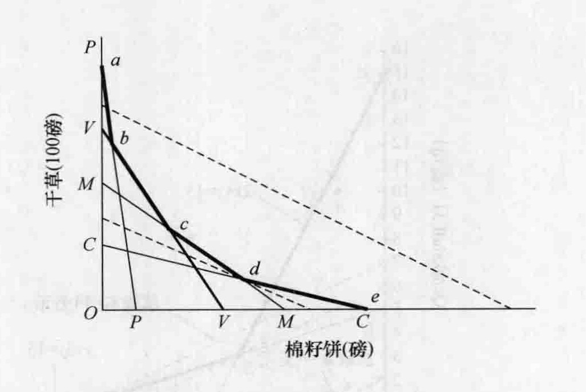

# 第 18 章 数理经济学

数理经济学（mathematical economics）这一术语指的是那些通过数学符号和数学方法阐述的经济学原理或经济学分析。在我们曾经讨论过的经济学家中，特别是古诺、杜普伊特、杰文斯、埃奇沃思和费雪，都是用数学的形式来阐述经济学理论。事实上，用数学符号和图示来补充文字解释是一个常见的做法。因此数理经济学并不构成一个经济思想的独立学派，而是一种不同的方法。有几个学派的经济学家使用数学语言以清晰、一致的方式来表达一种理论的定义、假设与结论。正如保罗·萨缪尔森所说：“到 1935 年，经济学已经进入了数学时代。让一个骆驼穿过针眼比让一个非数学天才进入有创造性的理论家的万神殿容易。”① 当然，并不是所有的经济学知识都能够用数学符号来表述，也不是所有的经济学家都喜欢数学方法。②

本章将按照如下顺序展开。首先，我们区分各种类型的数理经济学。接着，我们将详细考察瓦尔拉斯、里昂惕夫、冯·诺依曼、摩根斯坦和希克斯的经济思想——他们都是将经济学这门学科大大向前推进了一步的数理经济学家。最后，我们将简要讨论线性规划，它是微观经济学生产理论的一个应用。对数理经济学的一些其他贡献，比如，萨缪尔森作出的贡献，我们将在以后的章节中进行讨论。

## 18.1 数理经济学的类型

数学通常以两种方式被应用于经济学中：（1）推导和表述经济理论；（2）从数量上来检验经济学假设和理论。在第一种方式上所使用的主要工具包括代数、微积分、差分方程与微分方程、线性代数和拓扑学，而第二种方式使用的主要工具则是如多元回归分析的数学技巧。计量经济学是现代经济学最主要的工具，它把这两种类型的数理经济学结合起来。但是，在转到这个主题之前，研究一些这两种用途上的简单例子将会有所帮助。

### 18.1.1 数学推理

为了尽可能简单地说明经济学理论是如何用数学方式表达的，我们用代数方程式来表达供给与需求关系。

需求关系可以用函数形式表达为：
$$ Q_x = F(P_x, T, C, I, P_n, E) \quad (18\text{-}1) $$

其中：
- $Q_x$ 是产品 X 的数量，
- $P_x$ 是 X 的价格，
- $T$ 是消费者的偏好，
- $C$ 是潜在消费者的数量，
- $I$ 是消费者的总收入及其分配，
- $P_n$ 是相关商品的价格（替代品与互补品），
- $E$ 是消费者的预期。

因此，产品 X 的需求曲线的方程为：
$$ Q_x = f(P_x) $$
或者如马歇尔所表达的：
$$ P_x = g(Q_x) \quad (18\text{-}2) $$

其中，其他变量保持不变（需求的决定因素）。一条线性需求曲线可以表达为：
$$ P_x = a - bQ_x \quad (18\text{-}3) $$

其中，$a$ 为产品 X 的需求数量为零单位时的价格，$b$ 是当价格下降 $Q_x$ 时上升的比例（$a$ 是需求曲线在纵轴的截距，$b$ 是它的斜率）。

另一方面，供给关系用公式（18-4）来表示：
$$ Q_x = F(P_x, N, P_r, P_s, E, T_n) \quad (18\text{-}4) $$

其中：
- $Q_x$ 是产品 X 的数量，
- $P_x$ 是 X 的价格，
- $N$ 是提供 X 的企业数量，
- $P_r$ 是用于生产 X 的资源的价格，
- $P_s$ 是企业能够生产的替代品的价格，
- $E$ 是生产者的预期，
- $T_n$ 是可得的生产技术范围。

如果我们假设除了 $P_x$ 和 $Q_x$ 之外所有的参数都保持不变，那么供给关系就变成：
$$ Q_x = f(P_x) \quad \text{或者} \quad P_x = g(Q_x) \quad (18\text{-}5) $$

一条线性供给曲线可以表达为：
$$ P_x = c + dQ_x \quad (18\text{-}6) $$

其中，$c$ 是当产品 X 的供给数量为零单位时的价格，$d$ 是当 $P_x$ 上升时 $Q_x$ 上升的比例（$c$ 是供给曲线在纵轴的截距，$d$ 是它的斜率）。

为了说明我们接着将如何得出均衡价格和均衡数量，假设我们已知需求方程和供给方程如下：
$$ P_x = 8 - 0.6Q_x \quad (\text{需求}) \quad (18\text{-}7) $$
$$ P_x = 2 + 0.4Q_x \quad (\text{供给}) \quad (18\text{-}8) $$

因为我们有两个方程和两个未知量，所以我们能够解出 $P_x$ 和 $Q_x$。更具体地说，我们知道在均衡点上只有一个价格，而且因为需求方程中的 $P_x$ 将会等于供给方程中的 $P_x$，
$$ 8 - 0.6Q_x = 2 + 0.4Q_x \quad (18\text{-}9) $$

为了解出 $Q_x$，我们首先在这个方程的两边都减去 2，这样可以消去方程右边的 2。将会得到：
$$ 6 - 0.6Q_x = 0.4Q_x \quad (18\text{-}10) $$

接下来我们在方程两边都加上 $0.6Q_x$ 以消去左边的这个 $0.6Q_x$。可以得到：
$$ 6 = 0.4Q_x + 0.6Q_x \quad \text{或者} \quad 6 = 1Q_x \quad (18\text{-}11) $$

因此，均衡数量是 6 (6/1)。你一定很想确定均衡价格 $P_x$，将均衡数量 (6) 代回到需求方程 (18-7) 或供给方程 (18-8) 并解出 $P_x$，我们可以确定均衡价格。它解出来是 4.40 美元。

*图 18-1 供给方程与需求方程*
*图注：将需求方程 (18-7) 和供给方程 (18-8) 绘制在图中就可以得到我们熟悉的需求曲线和供给曲线。需求曲线的截距为 8，斜率为 -0.6。供给曲线的截距是 2，斜率为 0.4。均衡价格和均衡数量分别为 4.40 美元和 6 单位。*

需求方程和供给方程的几何图形绘制在图 18-1 中。注意需求曲线的截距是 8，斜率是 -0.6。另一方面，供给曲线的截距是 2，斜率 0.4。均衡价格和均衡数量是 4.40 美元和 6 个单位。

经济学家经常使用图示来阐明他们的数学理论。这些图示几乎是所有本科经济学教科书的显著特征。这些图示中的每一条直线都代表了一个数学方程式。

### 18.1.2 统计检验

回想一下数理经济学的第二大类型是关于统计检验。为了说明这一点，我们考虑一个常用的技术：回归分析。假设我们希望检验这样一个理论，拥有较大市场份额 ($S$) 的企业与面临大量竞争从而拥有较小市场份额的企业相比，倾向于拥有更大的垄断力进而获得较高的股东权益收益率 ($r$)。这些收益率 $r$ 是用一个企业的税后利润除以股东的股票价值得到的，而股东的股票价值又由以下部分构成：（1）股东发行股份时企业所得到的货币；（2）企业若干年用于再投资的留存收益。

当然，我们知道，除了市场份额之外的其他参数，比如广告强度 ($A$) 和进入壁垒的级别 ($E$)，也非常可能影响一个企业的收益率。因此研究者选择一个特殊的代数形式来总结这种关系。这种形式以我们前面所讨论过的推理类型为基础。一种这样的形式如下：
$$ r = \alpha_0 + \alpha_1 S + \alpha_2 A + \alpha_3 E + e \quad (18\text{-}12) $$

这些 $\alpha$ 是方程的参数；它们表示方程右边的变量的某一特定变化如何影响收益率。$e$ 是随机误差项，随机误差项是必要的，因为并不是影响 $r$ 的所有因素都可以观察到。

首先，让我们忽略方程中除了收益率和市场份额之外的所有变量。③ 这样可以得到：
$$ r = \alpha_0 + \alpha_1 S + e \quad (18\text{-}13) $$

因此下一步就是确定企业样本，从中我们可以得到收益率和市场份额的数据。假设将这些数据绘制在图中，可以得到如图 18-2 所示的散点图。然后利用回归分析“拟合”一条通过这些散点的直线。这种技术就是找出一条直线，使得这些点到直线上的垂直距离平方和最小。注意图中的回归直线从几何意义上表现了方程 (18-13)，$\alpha_0$ 是它的截距，$\alpha_1$ 是直线的斜率。这条直线表示对于我们假设的数据，每增加 20% 的额外市场份额，就会使利润率提高 5 个百分点。④

我们怎样才能确信一个给定的估计参数是正确的？研究者利用几种统计检验来确定给定参数的置信度。在这里解释它们并不是我们的目的，而只是指出它们包括估计的标准误差（估计参数偏离真实值的数量，或者这些散点的离散程度）和 $t$ 统计量（估计值与标准差的比率）。相反，整条回归直线的置信度是由判定系数来衡量的，它通常更多地被称为 $R^2$，指的是方程左边变量（收益率）的变化能够被方程右边变量（市场份额）的变化所解释的部分。$R^2$ 的值在 0 到 1 之间，通常 $R^2$ 越大，方程拟合得越好。

*图 18-2 回归直线*
*图注：回归是拟合一条通过一组数据点的最佳直线的技术。在这个假设的例子中，用股权收益率来衡量的盈利能力与市场份额正相关。回归分析和其他一些统计技术可以帮助经济学家证实经济理论的有效性。*

在绘制图 18-2 中的回归直线时，我们忽略了另外两个参数：广告强度 ($A$) 和进入壁垒的级别 ($E$)。增加这些参数会限制我们从几何意义上描述一条回归直线的能力，但是其中包含的数学原理允许我们处理任意数量的变量，只要变量的数目小于观察值即可。当然，计算机极大地帮助了参数估计中的实际运算。在我们的例子中，研究表明，较大的广告强度和更高的进入壁垒确实与盈利能力相关，但是并不具有市场份额那么大的影响力。

那么我们能否得出这样的结论，垄断力量随着市场份额的增加而增加并且因此导致高于正常利润的利润？尽管很多学者接受了这种解释，但也有些经济学家表示强烈反对。这些批判者认为，较大的市场份额导致了规模报酬递增，这能够降低单位生产成本和营销成本。是这些较低的成本，而不是从较大的市场份额中所得到的更大的垄断力量，产生了可以观察到的更高的利润。这个争论突出了从数量上检验经济理论的局限性：对经济理论进行简单检验仍然会得出模棱两可的结论。它也揭示了为什么即使经过了大量的实证检验，善意的经济学家们还是会经常意见相左。但是不管实证研究有多大的局限性，很显然，这种类型的应用数学在帮助将那些有效的经济原理与数十年来提出的成百个无效理论区别开来作出了重大贡献。

### 18.1.3 计量经济学

正如我们前面所提到的，计量经济学将我们刚刚讨论过的这两种数理经济学结合起来。通常，计量经济学家以数学的形式提出一个理论，然后收集与这个理论相关的数据并进行统计检验。然后这个理论就可以被用来预测变量的变化所引起的影响。计量经济学方法的根源可以追溯到几百年以前。威廉·配第爵士的追随者查尔斯·戴维南特将“政治算术”定义为“对与政府有关的事情利用数字进行推理的一门艺术”。法国重农主义者魁奈做了一些真正的经济计量工作。

挪威经济学家和统计学家拉格纳·弗里希（Ragnar Frisch）是 1969 年第一届诺贝尔经济学奖的获得者之一，他在 1926 年提出了计量经济学（econometrics）这一术语。他仿效生物统计学（biometrics）一术语提出了计量经济学这个词汇，生物统计学出现于 19 世纪晚期，特指应用统计方法的生物研究领域。计量经济学作为一种研究经济生活的独立的方法，在第一次世界大战后得到了非常迅速的发展。出版《计量经济学》（*Econometrica*）期刊的世界计量经济学会在 1930 年成立。今天，计量经济学是经济学这门学科所使用的标准方法论工具。⑤

计量经济学的发展是为了适应微观经济学中不断提高的专业技巧和预测宏观经济变化的需要。研究者开始利用新的计量经济方法和越来越容易得到的大量数据集来检验他们抽象的数学模型。计量经济分析作为进行市场研究的一种方法对于企业越来越重要，这些市场研究包括估计需求曲线和需求弹性。大公司的出现和其他一些因素使得对宏观经济波动的研究对于私人企业和社会整体来说都越来越有用。例如，如果一家大企业能够适当准确地预测经济波动，它就可以在某种程度上避免经济波动的负面影响。而且，大企业也能够雇用做预测所需的专业人员。另外，社会作为一个整体，通过政府和私人非营利性研究组织，也对预测经济趋势感兴趣，以便能够控制、减轻和抵消经济趋势波动。经济中日益增加的政府干预激励了计量经济研究，各国政府成为全世界收集统计数据的主要机构。

计量经济分析在预测未来和指导政策分析中都是有用的。预测包括对可能出现的事件和结果的估计，政策分析则在对政府项目和政策的效应分析中非常重要。随着政府在卫生保健、教育、城市问题和一系列其他领域的干预日益增多，要尽可能准确地确定这些计划对于个人和机构产生哪些影响的需求也在增加。计量经济方法为确定这种效应提供了一种分析框架。几乎所有的管制机构都利用计量经济分析来评估私人行为和它们自己政策的经济影响。

据证明，政策分析比预测这门危险的艺术要准确得多。但是，除了仅是预测 GDP、投资等之外，预测还有其他的优点。预测模型的真正优点是它迫使经济学家和计划制订者考虑经济系统中错综复杂的相互依赖关系，从而帮助决策者预测各种行动方案的各类正面和负面效应。

随着用来解决大型运算过程的技术越来越精深，计量经济模型本身的规模和复杂性也不断增加。荷兰人是综合宏观模型的发明者。1939 年，简·丁伯根（Jan Tinbergen）教授开始为荷兰经济设计一个模型以供政府的计划制订者使用。由于这项工作，他在 1969 年与弗里希分享了诺贝尔经济学奖。在美国，诺贝尔奖获得者、宾夕法尼亚大学的劳伦斯·克莱因（Lawrence Klein）被认为是这一领域的领袖人物。今天，一些主要的大学、私人预测企业、非营利性研究组织和政府机构都拥有一些大的模型（包含 200 个或以上的方程），它们通过这些模型来分析美国经济中的各种变化。

> **历史借鉴 18-1**
>
> **计量经济学的进展**
>
> 计量经济学模型证明不了任何东西。如果它们被适当地明确规定、满足一定的假设，并且数据有效，这些模型能够增强我们对于某种经济关系的信心，并且通常会产生良好的预测结果。如果理想的条件不存在，“弊病”就产生了，它会威胁到结果的有效性。自拉格纳·弗里希和简·丁伯根分享了第一次诺贝尔经济学奖以来，计量经济学家在发现研究新类型问题的技巧的同时，也发现了计量经济学的新的弊病和处理方法。在 2000 年和 2003 年，四位经济学家获得了诺贝尔奖的桂冠，每一位都是因为对计量经济学的发展作出了贡献。詹姆斯·赫克曼（James Heckman，1944—）和丹尼尔·麦克法登（Daniel McFadden，1937—）由于对微观计量经济学的贡献分享了 2000 年的诺贝尔奖；罗伯特·恩格尔（Robert Engle，1942—）和克莱夫·格兰杰（Clive Granger，1934—）由于推进了时间序列分析的研究方法共同获得了 2003 年的诺贝尔奖。
>
> 计量经济模型的选择取决于变量是连续的（如用货币方式衡量的变量）还是离散的（变量之间有中断，如在两辆汽车之间进行选择或者如何确定哪个等级）。麦克法登的工作主要集中于离散选择（在两个不同的可选单位之间进行选择），他提出了一个名为条件 logit 分析的方法，来处理离散选择情形下的问题。logit 模型可以用来估计共有—组给定特征值（收入、年龄等）的一群人作出相同选择或者产生相同结果的概率。两个类似的模型，probit 模型和 tobit 模型，曾经在 2000 年和 2004 年的夏季奥林匹克运动会上被用于预测奖牌数量。经济学家安德鲁·伯纳德（Andrew Bernard）和梅根·布斯（Meghan Busse）使用 36 个国家的人口和 GDP 作为解释变量，准确预测出了一个国家的奖牌数量，是 9 个国家不超过 1 枚奖牌，23 个国家不超过 3 枚奖牌。*
>
> 当分析数据的时候，样本必须是从人口中随机抽取的，以产生无偏的结果。不是随机抽取的样本称为选择性样本，赫克曼正是由于在这个领域的工作获得了诺贝尔奖。有偏选择（选择性样本的另一称呼）通常作为数据收集过程的结果而产生。调查是常见的数据收集方法，即使是随机分发，也有可能只被人口中某一特定类型的群体回答。即使那些回应调查的人是真实可信的，只有部分人选择参与的这一事实也会产生一个自我选择问题，它是有偏选择的一种具体形式。那些经常使用经济数据的人无法控制有偏选择问题，因为他们既不能控制收集过程，也不能控制收集信息的来源本身。幸运的是，赫克曼提出了解决这一问题的一种途径，被恰当地称为赫克曼修正。赫克曼本人工作的大部分都是应用于研究劳动力市场问题（选择性样本就是被雇用人口的子集），但是他的贡献已经被其他人应用于研究更广阔范围的问题。
>
> 经济学家往往对探究变量如何与时间相关很感兴趣，研究这些关系常常使用时间序列分析。恩格尔和格兰杰由于改进了时间序列分析的适用方法而获得诺贝尔奖。
>
> 一个计量经济模型需要有一个误差项，反映不包含在模型中、不能衡量的那些因素的效应［见方程 (18-12)］。基本的计量经济方法假设这些误差是随机分配的，以便使一定时间内这些误差的平均数等于零（它们对因变量没有长期影响，也被预期保持一定的长期值）。遗憾的是，很多误差的作用并不符合这个假设，在一个时间序列模型中系统误差能够导致变量发生改变，以致模型无法正确预测。恩格尔确定了时间变化不稳定性问题，变量在某些时期比其他时期表现出更大的波动。格兰杰的工作核心是这类模型，即其中误差项不是随机的，而事实上是和过去的误差相关的。
>
> 假设图 18-2 代表一个公司在一段时期内市场份额和利润率之间的关系。简单回归将揭示二者是正相关关系（回归直线的斜率 $\alpha_1 > 0$）。但是，假设由于某种独立的原因，企业的市场份额和利润率都上升了。回归直线和 $\alpha_1$ 表明市场份额的增加提高了利润率，但反之也正确。由于某种原因它们会各自都增加，然而从一个时期到下一个时期它们将向相反的方向运动。这种看似有道理的结论是从理论角度推导出来的吗？如果一个公司在某一月份通过削减价格有攻势地追求更大的市场份额，那么那个月它会遭到较低的利润率。经过一段时间公司的成长可能会提高市场份额和利润率，但是为了提高一个变量的调整政策也可能降低另一个变量。这个问题就是一个共线性的例子。确定共线性问题被归功于格兰杰，而恩格尔和格兰杰（及后来的许多追随者）合作发展了检测和修正这一问题的技巧。
>
> 由于计量经济学家改进了工具箱，研究者回到旧的数据集有时就会发现起初的结论是错误的。修正这些最新发现的缺陷能够有效地重写历史。计量经济学的这些进展也折射出其他领域经济思想的演进；一代人确认了前辈的错误，常常留给我们更好的理解。
>
> \* Andrew Bernard and Meghan Busse, "Who Wins the Olympic Games: Economic Resources and Medal Totals," *Review of Economics and Statistics* 86 (February 2004): 413—418.

---

## 18.2 莱昂·瓦尔拉斯

莱昂·瓦尔拉斯（Léon Walras，1834—1910）出生于法国的埃夫勒。他早期的生活基本上是不成功的。他在巴黎综合理工学院的入学考试中两次都没能通过，写了一本小说没有引起注意，建立了一家银行也失败了。但是他的父亲是一名经济学家，年轻的瓦尔拉斯读过古诺的《财富理论的数学原理研究》。经济学的主题和方法引起了他的兴趣，他转向了经济学。1870 年，他被任命为瑞士洛桑大学的政治经济学教授。在那里他创建了洛桑经济学派，这个学派强调在经济分析中数学的应用。他的思想被这个学派的另一个著名成员维尔弗雷多·帕累托继承，你可能还记得帕累托帮助开创了无差异曲线的应用。

瓦尔拉斯被认为是边际学派的三位创始人之一，其他两位是杰文斯和门格尔。在他出版于 1874 年的《纯粹经济学要义》（*Elements of Pure Economics*）中，瓦尔拉斯独立提出了边际主义的基本原理。他也被认为唤起了经济学家对古诺在这一领域早期作品的注意。

瓦尔拉斯提出并倡导一般均衡分析，它主要考虑经济中的许多变量之间的相互关系。这与杰文斯、门格尔和马歇尔所使用的局部均衡分析正好相反。就像一块石头掉入池塘中会引起不断扩大的涟漪一样，经济中的任何变化都会引起进一步的变化，而这些变化又会以递减的力量向外扩散。正如这些涟漪有时会到达岸边并最终反弹回来影响碰撞的初始点一样，在经济中的单独市场上也会发生这种最初变化的反馈效应。这种反馈的过程会在整个体系中一直持续，直到在所有的市场上同时实现均衡。

油价的上涨提供了一个很好的说明。按照局部均衡分析方法，如果我们假设其他保持不变，在较高的价格时被购买的油的数量会减少，而且这就是事情的结果。但是让我们考虑一下使用一般均衡分析会进一步产生的一些后果。对替代品比如说煤的需求将会上升，这会引起它的均衡数量与均衡价格的提高。油价的上涨将会引起汽油价格的上涨。因为从某种意义上来说，阅读小说是对开车环游城市的一个替代，所以对书的需求有可能增加。另一方面，对诸如汽车和洗车这类互补品的需求会随着汽油价格的上升而减少。如果对油和汽油的需求相对缺乏弹性，消费者将收入花费在汽油产品上的比例相对于其他产品来说将会上升。这就意味着与油和汽油无关的大量商品的需求在某种程度上将会下降。当然，使用卡车运输的商品的运输成本将会上升，将会引起这类商品价格上升。由于消费品市场产生了所有这些变化，对生产要素的派生需求将发生转变，导致资源的再分配。在某些产业（比如汽车）中所需要的劳动力将有所减少；其他一些产业（比如家庭绝缘材料）中所需要的劳动力将会有所增加。资本也会由于在不同产业中不同的投资收益率而发生转移。比如，生产者将会建立更多的石油钻井和海上平台，而会建设较少的新加油站。在某一点上，由最初的扰动所带来的这些变化将会终止，一般均衡将会实现。

瓦尔拉斯的一般均衡理论提供了由经济整体中的基本价格与产出相互关系构成的一个框架，其中既包括产品也包括生产要素。其目的是用数学方法来证明所有的价格和生产数量能够调整到相互协调的水平。它的方法是静态的，因为它假设某些特定的基本决定因素保持不变，比如消费者偏好、生产函数、竞争的形式以及要素供给项清单。

瓦尔拉斯表明市场经济中的价格可以用数学方法确定，并且他认识到了所有价格之间的相互关联性。对一个解的存在性的严格证明需要用到拓扑学和集合理论，这些理论来自后来的几位经济学家的作品，最著名的有约翰·冯·诺依曼、肯尼思·阿罗以及杰拉尔德·德布勒（Gerald Debreu）。

一种商品需求量的函数取决于价格。就像瓦尔拉斯所说，价格是自变量而需求量是因变量。这个方程与马歇尔的不同，马歇尔认为价格是需求量的函数［见方程 (18-2)］。然而，对任意一种产品的需求量包含作为变量的其他所有产品的价格。一个消费者在不知道所有其他产品价格的情况下不会决定购买一种产品的数量。如果总共有 $n$ 种产品，对其中任意一种产品的需求总量是由所有产品的价格决定的。每种产品的需求总量可以用 $D_1, D_2, \dots, D_n$ 来表示，价格可以用 $p_1, p_2, \dots, p_n$ 来表示。因此，对于每一种产品都可以建立一个方程来表示作为所有价格的函数的需求量：
$$
\begin{aligned}
D_1 &= F_1(p_1, p_2, \dots, p_n) \\
D_2 &= F_2(p_1, p_2, \dots, p_n) \\
&\vdots \\
D_n &= F_n(p_1, p_2, \dots, p_n)
\end{aligned}
\quad (18\text{-}14)
$$

在均衡状态下，任意一种产品的需求量等于供给量。因此，$D_1 = S_1, D_2 = S_2, \dots, D_n = S_n$。如果用供给替换前面 $n$ 个方程中的需求，我们有：
$$
\begin{aligned}
S_1 &= F_1(p_1, p_2, \dots, p_n) \\
S_2 &= F_2(p_1, p_2, \dots, p_n) \\
&\vdots \\
S_n &= F_n(p_1, p_2, \dots, p_n)
\end{aligned}
\quad (18\text{-}15)
$$

我们假设供给数量是给定的且保持不变。有 $n$ 种产品就有 $n$ 个未知的价格。因为每一种产品我们都有一个方程，所以有 $n$ 个联立方程，在与经济理论一致的特定条件下，这足以确定满足系统的唯一一组价格。只要所有的价格已知，任意一种产品的需求总量就能够被计算出来。因为在计算出来的价格下需求量可以得到满足，可获得产品的分配问题就解决了。

因为一般均衡概念包含许多方程式并因此包含许多未知量，因此这样一个系统的解就变得非常复杂。在前面所采用的例子中，我们对经济的了解不充分，因此无法预测，比如如果油的价格上升 10%，将会导致煤、汽车、石油钻井设备、小说、洗车等的产出的变化幅度。由于变量太多、太容易变动并且非常不确定，因此即使用现代计算机也很难准确地计算出这些变量。而且，这种分析通常假设规模报酬不变、不存在外部性、工资和价格具有完全弹性、所有市场都是完全竞争，等等。因此，瓦尔拉斯的一般均衡概念基本上是一个理论工具，它有助于我们理解经济体系的蓝图而不是在操作上有用的统计工具。

然而，认识到经济现象之间的相互依存关系是很重要的，因为认识不到这一点我们可能会误入迷途。例如，一个人因为其所在的产业遭到廉价进口产品的损害而失业，他就会很合理地得到进口会减少国内就业的结论。这是局部均衡分析的一个例子——只看到单一产业内的国内产出和就业。但是，如果我们研究进口的各种影响并且发现它们可以增加国内港口的就业，进口商品较低的价格留给消费者更多的收入以花费在其他国内生产的产品上，并且由于进口更多我们的出口也增加了，那么我们的结论可能会是：进口并不会引起国内产出和就业的总体下降。

## 18.3 瓦西里·里昂惕夫

瓦西里·里昂惕夫（Wassily Leontief，1906—1999），俄裔美籍经济学家，1928 年在柏林大学获得博士学位。他 1931 年移居美国并成为哈佛大学的一名教员。他对经济学的主要贡献是他的投入-产出分析，它令人回想起第 3 章曾讨论过的魁奈的《经济表》。这一贡献使里昂惕夫获得了 1973 年的诺贝尔经济学奖。他最初尝试以一种简化的、适合于实证研究的形式来表达一般均衡理论的本质。因此，投入-产出分析是一般均衡分析的一种具体形式。例如，这种具体形式简化了生产过程的表述，以便使它们呈线性形式，因此可以使这些过程更直接地转换为实证研究。

### 18.3.1 投入-产出表

在 1936 年 8 月的《经济学和统计学评论》（*Review of Economics and Statistics*）上里昂惕夫发表了他的第一个投入-产出表。他的投入-产出表将 1919 年的美国经济描绘为一个包括 46 个部门的体系。他对产业间分析的兴趣随着第二次世界大战而不断扩大。与战争相关产业的扩张产生了某些瓶颈，这使进一步的增长变得更加困难。例如，飞机产出的增加要求配置更多的钢铁、铝、发动机、特定的机械工具和其他资本品。投入-产出分析试图预测这些需求并为这些基础产业的扩张制订计划。

投入-产出表描述在一个给定的国家或地区的经济中产品与服务在不同部门之间的流动，并试图衡量经济中某一特定产业与其他产业之间的关系。例如，根据里昂惕夫的一个投入-产出表，为了额外生产价值 100 万美元的新汽车，这个产业将必须购买 23.5 万美元的钢和铁、7.9 万美元的有色金属、5.8 万美元的化学产品、3.9 万美元的纺织品、3.2 万美元的纸和相关产品、1 万美元的金融和保险服务、0.6 万美元的电话和电报服务，等等。⑥

里昂惕夫做出了一个投入-产出方格图，后来由美国劳工统计局加以扩展。通过表明原料的来源、数量和最终目的，这个图总结了有关经济的统计信息。它揭示了经济中的每一个部门与其他每一部门之间的关系。投入-产出表中的每一行表示一个经济部门出售给其他每一部门的产出；每一列表示一个部门从其他每一部门购买的投入。

方格中的一部分复制在表 18-1 中（有几个部门被删除了）。我们可以看到，在 1947 年，农业和渔业向本部门出售了 109 亿美元的产出（饲料、种子、饲养牲畜等）。另外 150 亿美元出售给了食品生产者。这些数据提供了用于计算一个产业的变化将怎样影响所有其他产业的原始资料。例如，钢铁产业的扩张将要求有色金属产业扩张，有色金属扩张反过来又意味着购买更多的农产品和钢铁产品。通过解这个矩阵中包含的联立方程可以得到这种循环依存关系。

**表 18-1 1947 年美国的投入-产出关系（单位：100 万美元）**

| | 各产业的购买量 | | | | | |
| :--- | :---: | :---: | :---: | :---: | :---: | :---: |
| | **农业和渔业** | **食品及同类产品** | **有色金属** | **钢铁** | **发动机和发电机** | **汽车** | **合计** |
| **农业和渔业** | 10 856 | 15 048 | 11 | — | — | — | 44 263 |
| **食品及同类产品** | 2 378 | 4 910 | * | 3 | — | — | 37 636 |
| **有色金属** | — | — | 2 599 | 324 | 366 | 176 | 6 387 |
| **钢铁** | 6 | 2 | 33 | 3 982 | 118 | 196 | 12 338 |
| **发动机和发电机** | — | — | — | — | 317 | — | 1 095 |
| **汽车** | 111 | 3 | * | * | — | 4 401 | 14 265 |
| **合计** | 44 263 | 37 636 | 6 387 | 12 338 | 1 095 | 14 265 | 769 248 |

*\* 小于 500 000 美元。*
*资料来源：Studies in the Structure of the American Economy by Leontief (1953) Tab. "Input-Output Relations in the United States" p. 9. By permission of Oxford University Press, Inc.*

---

### 18.3.2 用途及难点

现在的国家投入-产出表把经济划分为 400 多个产业，形成了一个由 400 多行和 400 多列组成的投入-产出矩阵。大公司的兴起和经济中政府的重要角色的发展提高了投入-产出表的有用性，这至少基于两个主要原因。首先，政府已经变成了产品和服务的巨大购买者。因此，政府和它的供应商都必须预测政府购买方式发生变化造成的影响。其次，大公司在预测销售量的增长时，必须计划投入供给的扩张。一个纵向一体化的公司可以计划其自身对某些投入的供给。其他公司可以向它们的供应商说明它们预计要购买的投入的增加幅度。在两种情形下，投入-产出分析都是有用的。

投入-产出分析更加适合于欠发达国家，在那里经济计划更为普遍。在一个寻求经济增长的欠发达国家中，大产业的建设将会要求辅助设施的扩张，这些设施可能比在发达国家中更加稀缺。假设在一个贫穷的国家要建立一个肉类罐头厂。这个企业将需要电力、供水、交通设施、工人住房、餐厅、医疗服务、金属罐的生产等的扩张。这些需求以及它们提出的进一步需求可以用投入-产出分析方法来预测。

与主要依赖于私人企业的国家相比，社会主义经济将投入-产出分析的应用非常自然地推进到了更深的程度。总的经济计划要求制订计划的主体配置原材料并且预测未来的需求。如果想要避免严重的瓶颈，那么计划者必须保证各产业协调扩张。因为消费者的偏好从属于总体计划，所以消费者一时的兴致和愿望并不会干扰经济活动的主要目标；换言之，在一个完全社会主义化的经济中，消费者对汽车需求的突然增加并不会使钢铁从其他行业，比如机械工具产业中转移出来。因此，在一个私人企业经济中使用投入-产出分析来制订计划所面临的困难，在一个完全计划经济中并不会以相同的程度发生。社会主义经济从总体上对数理经济学表示出了积极的兴趣，特别是对里昂惕夫的方格图。事实上，苏联曾宣称投入-产出分析是苏联的一个发明。

投入-产出分析并不是不存在问题。这种分析建立在几个简化假设的基础上。一个例子是，生产系数被假设为固定不变，即生产一单位产出所必需的每一种要素数量是固定的。第二个例子是，生产函数被假设为线性的，随着一个产业的扩张或收缩不会发生效率提高或降低；假设规模报酬不变。这些假设都是相当不现实的。产出的增长通常并不需要投入按比例增长，主要因为各种要素是不可分割的。例如，铁路货运的吨—公里数增加 5%，而机车和货车的供给可能并没有增加 5%。另一方面，固定生产系数的假设排除了要素替代的可能性。然而在现实世界中，我们可以看到这种替代的很多例子。例如，塑料相对价格的降低导致了在制瓶产业中用塑料替代玻璃。

技术变迁很快就会使方格图过时，而修改一个涉及 400 个产业的投入-产出表的 160 000 个条目是非常艰巨的任务。随着时间的流逝，用给定某一年的投入-产出表来预测未来年份所需的投入变得越来越不准确。但是从过去观察到的趋势中进行推测，进而预测稳定的技术进步，能够使我们实现更大的准确性。例如，这个方法将允许我们预测产生一千瓦小时的电能所需的煤炭数量将不断减少。

## 18.4 约翰·冯·诺依曼和奥斯卡·摩根斯坦

约翰·冯·诺依曼（John von Neumann，1903—1957）出生于匈牙利，执教于柏林大学和汉堡大学。1930 年他来到美国，在普林斯顿大学获得了职位。在那里他写作了物理学方面的重要著作《量子力学的数学基础》（*Mathematical Foundations of Quantum Mechanics*）一书，并且遇到了奥斯卡·摩根斯坦（Oskar Morgenstern，1902—1977）。摩根斯坦是一位经济学家，1925 年首次从维也纳来到美国。⑦ 他们共同写作了《博弈论与经济行为》（*Theory of Games and Economic Behavior*, 1944）一书，这本书包含了对经济理论的几个重要贡献，其中之一就是博弈论。⑧

博弈论适用于与战略游戏相类似的情形，比如国际象棋和纸牌游戏。在早些时候经济学家已经指出双寡头就像国际象棋手，他们在自己行动以前要认真考虑对手可能采取的行动。在这种情形下存在利益冲突，每一方都采用自己的机智来战胜另一方。例如，如果一个企业正在考虑削减其产品的价格，那么相似产品的其他生产者会或不会也削减价格会有很大的不同。有些商业决策是公开作出的，比如公开张贴的价格变化、广告活动的变化和新产品的制造。这些行动都类似于国际象棋，所有的行动都很容易被双方观察到。另一些决策是保密的，如私下的价格折扣、进行新的研究计划和计划侵占新市场。这些行动类似于纸牌游戏，一方并不知道另一方持有什么牌，直到出牌时才知道。如果一个企业在其对手的企业安置一个间谍（比如一个看门人）来探查秘密，这就像在玩一副做了标记的纸牌。如果企业间达成垄断协议，那么它们必须还要制定策略来战胜公众和政府的“惩治托拉斯者”。

博弈论的一个含义是经济关系是基于经济“竞争”，即一个人的所得是另一个人的所失。但是博弈论也可以用来说明在很多情况下最优策略是与对手合作，只要他与你合作（历史借鉴 4-1）。

博弈论的基本逻辑可以从一个高度简化的例子中看出来。我们可以将各种战略博弈区分为完全机会博弈与战略不确定性博弈。掷骰子是一种完全机会博弈，除非骰子的一边被加重，游戏者是赢还是输，以及输赢多少，仅取决于他自己的选择和运气。在战略不确定性博弈中，比如纸牌游戏，另一个要素加入进来：另一方将会做什么？

假设只有两个主要的生产者——A 和 B——生产略有差异的产品，每一个卖者都要考虑三个不同的商业策略以提高其市场份额：（1）增加广告；（2）提供产品的改良形式；（3）降低价格。假设这些企业都相信它们的长期盈利能力与它们的市场份额正相关。我们将 A 的三个策略标为 $A_1, A_2, A_3$，将 B 的三个策略标为 $B_1, B_2, B_3$。为了简化起见，我们假设只能采用纯粹策略；即，每一个企业只能选择一个单一策略，而不是所有这三种策略的某种组合。

博弈论是基于这样的假设，两个企业的每一种战略组合的结果都可以表示在如表 18-2 所示的支付矩阵中。假设每一方都知道这些结果但不知道另一方会采取什么策略。表中所有的数值都是企业 A 在市场份额方面的所得或损失。这是一个零和博弈，意味着 A 在市场份额方面的所得正好等于 B 的损失，而 A 的损失正好等于 B 的所得。因此表中的负值代表 A 的损失和 B 的所得。这个表告诉我们，比如，如果企业 A 采取策略 $A_1$——增加广告，而企业 B 采取相同的策略 $B_1$，那么结果就是 A 将获得 6 个百分点的市场份额。也许是企业 A 目前的广告水平很低，因而相对于 B 增加广告的效应而言，A 额外的广告将会对销售量产生一个不成比例的影响。或者让我们看另一个例子。假设 A 采用策略 $A_2$——产品改进，而 B 采取策略 $B_3$——降低价格。我们看到结果将会是 A 损失 10 个百分点的市场份额，而 B 增加 10 个百分点的市场份额。

**表 18-2 博弈论：支付矩阵**

| | **A 的策略** | | |
| :---: | :---: | :---: | :---: | :---: |
| | **$A_1$** | **$A_2$** | **$A_3$** | **行最大值** |
| **B 的策略** | **$B_1$** | + 6 | - 8 | + 5 | + 6 |
| | **$B_2$** | + 10 | - 4 | + 3 | + 10 |
| | **$B_3$** | - 3 | - 10 | + 2 | + 2 |
| **列最小值** | | - 3 | - 10 | + 2 | |

这些参与者将会作出怎样的选择？让我们假设双方都是厌恶风险的，因此都希望回避可能出现的最差的结果。对于 A 而言，这些最差结果水平列于矩阵的各列之下（列最小值）。注意如果 A 选择策略 $A_1$，而 B 选择策略 $B_3$，A 会损失 3 个百分点的市场份额，这个损失是选择策略 $A_1$ 可能出现的最差结果（如果 B 选择 $B_1$ 或 $B_2$，A 将有所得 +6 或 +10）。类似地，A 选择策略 $A_2$ 和 $A_3$ 出现的最差结果将分别是损失 10 个百分点和赢得 2 个百分点。在矩阵的最右边垂直列出的数字是 B 的每种策略的最差结果（行最大值）。例如，如果它选择策略 $B_1$，将损失 6 个百分点的市场份额（A 可能选择策略 $A_1$，增加 6 个百分点的市场份额）；如果 B 选择策略 $B_2$，最差的结果将是损失 10 个百分点的市场份额；如果它选择 $B_3$，它将会损失 2 个百分点的市场份额。

从这些数字中我们可以看到 A 将选择策略 $A_3$，而 B 将选择策略 $B_3$。结果是 A 获得 2 个百分点的市场份额。这个结果被称为最大化最小 (maximin) 解或最小化最大 (minimax) 解。A 是最大化来自各种策略的最小所得。B 是最小化它的最大损失。任何一方都不会有动力去改变策略，只要它们保持风险厌恶，并且支付矩阵中的值是正确而已知的。这在表中的任何其他组合都是不成立的。例如，假设 A 采取策略 $A_1$，它希望 B 采取策略 $B_2$。但是企业 B 对策略 $A_1$ 的反应是策略 $B_3$。现在企业 A 的对抗策略将会是 $A_3$，此时最大化均衡得以实现。⑨

在寡头垄断市场营销行为中我们可以发现博弈论的一个有趣而实际的应用。在投放新产品或新品牌之前，很多公司都会认真地进行市场试验。在某些产业中，市场试验更像是一种纸牌游戏而不是一项科学实验。当参与者 A 在某一特定市场上投放销售新产品时，在全国范围内销售一种类似产品的参与者 B 可能通过在 A 试验的地区大幅增加广告预算来提高它的利益。这样 A 就面临一个难题：如果 A 在全国范围内投放销售新产品，B 打算大幅增加它在全国范围内的广告预算吗？或者 B 仅仅是虚张声势试图使 A 低估其新产品在全国范围内的潜在销售量？

> **历史借鉴 18-2**
>
> **约翰·纳什：发现、绝望与诺贝尔奖**
>
> 在 20 世纪 50 年代早期，几位经济学家发展了冯·诺依曼和摩根斯坦在博弈论方面的开创性工作。这些经济学家中最杰出的是约翰·纳什（1927—），一个天才数理经济学家。
>
> 纳什的故事非同寻常，甚至带有悲剧色彩。在 22 岁的时候，他发表了两篇关于博弈论的有着高深数学形式的论文，这两篇论文构成了我们今天所谓的纳什均衡。9 年以后他在麻省理工学院充满前途的学术生涯突然终结了。纳什被强制送往波士顿一家地区医院并被诊断为妄想型精神分裂症。在接下来的 30 多年中，他在新泽西的普林斯顿在相对默默无闻的情况下与疾病斗争。后来，在 1994 年他得到了令人吃惊的消息：由于他年轻时在博弈论方面的工作，他获得了诺贝尔经济学奖。
>
> 《时代》杂志这样报道：
> 当上周约翰·纳什的照片出现在新闻媒体上时，在新泽西的普林斯顿及周围地区一个共同的反应就是震惊：“噢，天哪，就是他！”纳什与加州大学的约翰·海萨尼（John Harsanyi）和波恩大学的莱因哈德·泽尔腾（Reinhard Selten）分享了诺贝尔经济学奖。在大学城纳什是一个大家很熟悉的行为古怪的人——一个安静、孤僻的人，经常乘坐普林斯顿与普林斯顿交汇点之间的短途小火车来打发时间，阅读其他乘客丢弃的报纸。有些人知道他是不时出现在普林斯顿教室黑板上的那些极其复杂的数学公式的作者——这些公式是一个卓越但受到疾病困扰的大脑的产物，是他独自一人完成的思想成果。*
>
> 西尔维娅·纳萨尔（Sylvia Nasar）撰写了一本传记记述纳什的个人奋斗历程，名为《美丽心灵：约翰·福布斯·纳什传，1994 年诺贝尔经济学奖获得者》（*A Beautiful Mind: A Biography of John Forbes Nash, Winner of the Nobel Prize in Economics, 1994*, New York: Simon and Schuster, 1998）。环球电影工作室改编纳萨尔的书，将纳什的故事搬上荧幕拍成电影《美丽心灵》，这部电影获得了 2001 年的四项奥斯卡奖，包括最佳影片奖。
>
> 纳什集中关注在—个博弈中能够产生这样—种结果的策略（纳什均衡），即在这种策略下，任何一方都不能通过改变当前的策略来提高预期收益。** 即当独立行动的每一方都用尽了所有有利的行动时就会出现纳什均衡。
>
> 在有些博弈中一方或者双方都有一个占优策略。占优策略是这样一种策略，考虑所有的选择，不管另一方选择什么策略都能够产生最优结果的策略。很显然当参与者能够使用占优策略时他们将会采用占优策略，而这种策略将会产生纳什均衡。
>
> 但是在很多博弈中，任何一方都没有占优策略，因此每一方的最优策略取决于另一方采取的策略。每一方都会根据另一方的策略来调整自己的策略，直到任何一方都不能通过进一步调整以提高自己的收益为止。例如，在表 18-2 中，A 和 B 都没有占优策略。但是当 A 采用策略 $A_3$，B 采用策略 $B_3$ 时，双方都有“坚持”当前策略的激励。纳什均衡为 +2，表示在表中底部最右边的单元中。
>
> 表 18-2 中的博弈是一个非合作博弈：每一方都在不与另一方合作的情况下决定自己的策略。这种博弈不同于合作博弈，在合作博弈中双方共谋来调整他们的策略以达到比没有合作时更好的结果。例如，两个寡头垄断者可能达成协议制定同样的高价，这样他们每个人都能够获得垄断利润。分开来看，这些策略都不是纳什均衡，因为双方都有机会通过给另一方的顾客提供秘密的价格折扣而进一步提高利润。这就是我们所熟悉的囚徒困境（历史借鉴 4-1），在囚徒困境中双方都会坦白，因为他们都认为另一方会坦白。
>
> 但是，通过对相互的价格折扣进行报复的可信威胁达成固定价格协议的双方可能将他们的共同高价策略转变为纳什均衡。例如，如果对方企业被查出低于共谋价格销售的话，每个企业都能以长久的、更大幅度的减价来威胁对方。因为双方都不希望发生价格战，所以这些相互威胁是可信的。如果是这样的话，不稳定的高价结果就会变成纳什均衡，因为任何一个企业都不敢在一致同意的高价策略上进行欺骗。
>
> 今天，一些最聪明的经济学家正在应用数学博弈论来研究寡头垄断、拍卖、集体竞价、国际贸易、货币政策，等等。所有这些人都要感谢约翰·纳什的卓越但受到疾病困扰的头脑。***
>
> \* *Time*, October 24, 1994.
> \*\* 这一思想可以追溯到古诺。在他的双寡头垄断理论中，均衡产出的结果事实上就是一个纳什均衡。
> \*\*\* 纳什的重要文章被重印于他的著作：*Essays on Game Theory* (Brookfield, VT: Edward Elgar, 1997).

---

## 18.5 约翰·R. 希克斯

约翰·R. 希克斯（John R. Hicks, 1904—1989）是牛津大学教授，由于对纯经济理论作出的贡献而分享了 1972 年的诺贝尔经济学奖。在那一年，保罗·萨缪尔森（第 22 章）将希克斯和共同获诺奖的肯尼思·阿罗（第 20 章）称为“经济学家的经济学家”，既不为大众出版社也不为政府办公室写作。⑩ 萨缪尔森认为希克斯的贡献尽管是高度抽象和技术性的，但却是当代大多数经济学家的工具箱中的必备之物，而且在政策形成中发挥着重要的作用。

希克斯对经济学作出了许多有益的贡献。例如，他重新评估并阐明了马歇尔关于投入的派生需求定理，即他详细说明了劳动和资本需求弹性的决定因素（第 15 章，注 12）。1937 年，他写作了一篇名为《凯恩斯先生与古典主义》的文章，在这篇文章中他帮助设计了我们今天所谓的宏观经济学中的 IS-LM 模型（第 22 章）。其他值得注意的贡献包括他对马歇尔消费者剩余的概念进行了改良、对瓦尔拉斯的一般均衡模型进行了改进，以及关于经济增长与经济发展的理论。

但是，在本节我们主要关注的是希克斯对需求理论和最小生产成本的重新表述。⑪

### 18.5.1 需求理论

为了理解希克斯的需求理论，我们必须考察几个相互关联的思想。

**无差异曲线**。你也许能回想起由埃奇沃思和帕累托最先提出了无差异曲线。这个思想的目的是避免从数量上度量效用。按照杰文斯与门格尔的标准的边际主义理论，各种数量的物品都可以被赋予基数价值或效用，然后就能够直接比较。例如，在某一定时期，一个特定的消费者消费的第一单位的冰淇淋可能产生 10 单位的效用，第二单位的冰淇淋产生 5 单位的效用，等等；第一单位的汉堡包可能产生 20 单位的效用，第二单位的汉堡包产生 15 单位的效用，等等。这就意味着对这个人来说，第一单位的冰淇淋正好具有两倍于第二单位的冰淇淋的效用价值，而仅具有一半于第一单位的汉堡包的效用。这种对效用程度的精确度量看起来是不现实的，因此，它作为整个需求理论的一个薄弱链条受到了严厉的批评。

希克斯的无差异曲线方法避免了边际效用可以进行基数度量这一假设。所需的一切只是消费者能够对偏好进行序数排列。用我们的例子来说明，这样的排序意味着一个人只需要说：“我喜欢第一单位的汉堡包胜过第一单位的冰淇淋，或者，我认为组合 A（45 单位的冰淇淋和 45 单位的汉堡包）与组合 B（72 单位的冰淇淋与 27 单位的汉堡包）无差异。”因此，不需要对效用进行度量，从理论上消费者就能够决定产生相同的总满足程度的各种汉堡包与冰淇淋的组合。所有的这种组合就构成了一条无差异曲线或等效用曲线，如图 18-3 (a) 中标为 $I_1$ 的曲线。正如我们前面所指出的，一条无差异曲线类似于等高线地图上连接相同海拔高度的所有点的线。每一条无差异曲线连接的是对这个消费者来说具有同等总满足程度的所有点。

无差异曲线通常是凸向原点的，因为在正常情况下各种产品都是其他产品的部分替代品。图中无差异曲线的上端表示这个人愿意放弃较大数量的冰淇淋来获得一个较小数量的汉堡包，并且仍感觉到相同的良好境况。原因是前者相对较为丰富而后者相对稀缺。在曲线的下端，随着汉堡包相对于冰淇淋变得逐渐稀缺起来，这个消费者将会放弃较少单位的汉堡包来获得额外一单位的冰淇淋。

无差异曲线的斜率表示汉堡包 ($x$) 对冰淇淋 ($y$) 的边际替代率，我们将它记为 $MRS_{xy}$。无差异曲线斜率的绝对值是 $dy/dx$。注意当沿着无差异曲线向下移动时，其斜率的绝对值将会下降，即无差异曲线是凸向原点的。

在图 18-3 (a) 中，越偏向东北方的无差异曲线代表越高水平的总效用。通过画一条想象的从原点出发的 45° 直线可以证实这一点，注意这条直线与每一条连续的无差异曲线的交点表示冰淇淋与汉堡包都有更多的数量。消费者愿意达到尽可能高的无差异曲线。

**预算线**。消费者能够达到的最高的无差异曲线取决于她的收入和冰淇淋与汉堡包的单位价格。图 18-3 (a) 表示了两条预算线或所能达到的组合的直线。让我们先不考虑直线 AC。假设一个人的收入是 90 美元，只有两种商品冰淇淋与汉堡包，它们的价格分别是每单位 1 美元和 2 美元。从预算线 AB 中我们可以看出这个人能够得到 90 单位的冰淇淋（90 美元/1 美元），45 单位的汉堡包（90 美元/2 美元），或者由直线上的点比如 $u_1$ 所代表的两者的组合。这条预算线斜率的绝对值是价格的比率 $p_x/p_y$，在这个例子中是 2（2 美元/1 美元）。

**效用最大化**。给定预算线 AB，在某一特定时期这个消费者选择购买 54 单位的冰淇淋和 18 单位的汉堡包（点 $u_1$）。AB 与 $I_2$ 相切点上的这个组合使消费者能够“达到”最高可能的无差异曲线，或者换言之达到最高的总效用水平。在切点上，这个消费者愿意放弃冰淇淋来获得汉堡包的比率（$MRS_{xy}$）等于市场要求她放弃冰淇淋来获得汉堡包的比率 ($p_x/p_y$)。为了检验你对这个模型的理解，你应该解释：（1）为什么曲线 $I_2$ 东北方向的两种产品的组合是无法达到的；（2）为什么预算线上除了 $u_1$ 之外其他点所代表的两种产品的组合不如点 $u_1$ 所代表的两种产品的组合更合意。

*图 18-3 从无差异曲线中推导需求曲线*
*图注：当冰淇淋和汉堡包的单位价格分别是 1 美元和 2 美元时，这个消费者将会购买 54 单位冰淇淋和 18 单位汉堡包（点 $u_1$）以最大化其效用。但是当汉堡的价格下降为每磅 1 美元时，消费者可以通过增加对汉堡包的购买而达到更高的无差异曲线 $I_3$。在图 (b) 中，通过连接价格下降前后汉堡包的需求数量的点，可以确定汉堡包的需求曲线。*

**相对价格的变化**。现在假设汉堡的单位价格从 2 美元下降到 1 美元。新的预算线变为 AC，因为现在消费者最多可以购买 90 单位的汉堡（90 美元/1 美元），而不是在原来价格时所能购买的 45 单位（90 美元/2 美元）。新的预算线斜率的绝对值是 1（1 元/1 美元）。汉堡包价格的下降意味着这个消费者现在能够达到更高的无差异曲线 $I_3$。在新的切点 $u_2$ 上，消费者购买 45 单位的冰淇淋和 45 单位的汉堡包。

描绘出汉堡包的需求曲线是一件相对容易的事情。在起初单位价格是 2 美元时，这个消费者将会购买 18 单位；当价格下降到 1 美元时，她购买 45 单位。注意在图 18-3 的上下两个图中横轴都是度量汉堡包的数量，而在下图中纵轴衡量汉堡包的价格。在下图的纵轴上标出汉堡包的两个价格，并且从上图中的 $u_1$ 和 $u_2$ 点向下做垂直于图 (b) 横轴的直线。这使我们在下图中画出点 $d_1$ 和 $d_2$。连接这两个点我们就得到了这个消费者对汉堡包的需求曲线的一部分，记为 D。重申一下关键的一点：推导需求曲线并不需要对效用进行基数度量。

**收入效应与替代效应**。希克斯指出伴随价格变化而发生的数量的变化是两种效应的结果。第一，存在一种替代效应，或者相对价格效应。即当汉堡包的价格下降时，我们的消费者将支出从冰淇淋上转到现在价格相对较低的汉堡包上，汉堡包数量的上升是因为替代。正规地定义替代效应是指使效用保持不变，需求量总变化中仅仅属于由价格变化而引起的那一部分变化。⑫ 第二，存在收入效应，即价格变化导致实际收入的变化，仅仅由此引起的需求量的变化部分。当汉堡包的价格下降时，在我们的例子中消费者的实际收入提高了。她现在从她不变的 90 美元货币收入中获得了比以前更大的购买力，并且用增加的这部分实际收入来购买更多的汉堡包。

尽管我们在图 18-3 中并没有这样做，但希克斯指出了如何将需求量总变化分解为两个部分：由替代效应引起的部分和由收入效应引起的部分。除了其他情况，区分收入效应与替代效应，在比较正常商品、劣等商品和吉芬商品时是很有用的。在早些时候罗伯特·吉芬（Robert Giffen）就采用数据指出，低收入的消费者对于某些产品具有向上倾斜的需求曲线。这引起了对需求定律的质疑并成为著名的“吉芬悖论”。希克斯的无差异曲线分析工具帮助解决了这个悖论。对于正常商品而言，替代效应与收入效应作用的方向是相同的——当价格下降（上升）时需求量上升（下降）。但对于某些被称为劣等品的特殊商品而言，单独来看，当产品价格下降（上升）时购买量会减少（增加）。吉芬商品是这样一种商品，它特殊的收入效应如此巨大以至于超过了正常的替代效应，引起这种产品的购买量与价格呈同方向变化。例如，在一个贫穷的国家，面包价格的下降使低收入的消费者利用他们增加的实际收入来购买更少的面包，面包可能是他们以前所能支付的全部商品，而去购买更多的其他商品，比如肉类和家禽。

### 18.5.2 生产理论

希克斯使一个受条件限制的函数最大化的技巧也适用于生产理论。例如，他提出可以利用等产量线图来衡量一种资源对另一种资源的替代弹性的思想。正规定义是，替代弹性是两种资源的比率对于它们相对边际生产力变化的反应程度的度量，或者在完全竞争情形下，对成本变化的反应程度的度量。后来微观经济学家提炼出了我们今天所谓的等成本-等产量分析。熟悉这种分析的读者不难发现，在消费者的预算约束线或相对价格线与等成本线或等支出线存在相似性。后者表示在给定两种资源价格的情况下，用一个特定的费用所能购买到的两种投入的各种组合。另一方面，等产量线表示能够生产一个特定数量的物质产出的两种投入的各种组合。生产任意特定产出的资源的最小成本组合位于等成本曲线与等产量曲线的切点处。这个理论构架产生了一项技巧，使经济学家能够解决生产、市场营销、交通和存货管理中的各种问题。现在我们将转到数理经济学的这个应用上来。

## 18.6 线性规划

线性规划是在第二次世界大战期间和其后发展起来的，最早的应用之一是用于制订美国空军的行动计划。企业将线性规划应用于配置稀缺资源，以实现预先决定目标的所得最大化。它可以被用来确定如下事情：动物的最低成本饮食、国家足球联赛日程表、将产品运往市场的最便宜的方式、最具盈利能力的产品组合、要素投入的最佳组合，等等。进而可以实现成本最小化和利润最大化。数学和几何技巧都要用到。线性规划帮助企业解决一些边际分析所不能有效处理的实际问题。

有两个基本的例子可以说明线性规划。假设一个人为了保持健康，每个月最少需要 15 克碘盐和 15 克铁盐。这个人不能以纯粹的形式而必须以注册的专利药品的形式购买它们。有两种可供选择：每盎司的 Nostrum 12 含有 1 克碘和 2 克铁，花费 1 美元；每盎司的 Quackstuff 31 包含 3 克碘和 1 克铁，花费 2 美元。这个消费者的问题是决定购买这两种配制药品的何种组合能够以最小成本达到必需的剂量。

如果这个人购买了 $x$ 盎司的 Nostrum 12 和 $y$ 盎司的 Quackstuff 31，他将得到 $x + 3y$ 克碘（每盎司 Quackstuff 31 中碘的含量是 Nostrum 12 中的 3 倍），$2x + y$ 克铁。因为每种成分总计至少要 15 克，所以我们得到两个公式：
$$ x + 3y \ge 15 \quad (\text{碘}) \quad (18\text{-}16) $$
$$ 2x + y \ge 15 \quad (\text{铁}) \quad (18\text{-}17) $$

这些关系式可以被绘制成以直线为边界的区域。在第一个式子中，如果 $x=0$，那么 $y=5$；如果 $y=0$，那么 $x=15$。这两点确定了图 18-4 中的直线 HG。在第二个式子中，如果 $x=0$，那么 $y=15$；如果 $y=0$，那么 $x=7.5$。直线 FI 就可以画出来了。

位于任意一条直线的左下方的药品的各种组合都不能满足碘和铁的最低要求。比如，点 A 表示 2 盎司的 Nostrum 12 和 10 盎司的 Quackstuff 31，能够提供 32 克的碘 ($2 + 30$)，但只有 14 克的铁 ($10 + 4$)。点 B 表示 9 盎司的 Nostrum 12 和 1 盎司的 Quackstuff 31，能够提供 19 克的铁 ($18 + 1$) 和只有 12 克的碘 ($9 + 3$)。合适的药品组合将位于加粗的线 FEG 之上或者它的右方。这样，在 C 点，3 盎司的 Nostrum 12 和 10 盎司的 Quackstuff 31，将会提供多于必需的碘和铁。对于 D 点——每种都是 8 盎司，也是如此。

*图 18-4 两个变量的线性规划*
*图注：每月能够提供 15 克碘盐和 15 克铁盐的 Nostrum 12 和 Quackstuff 31 的最低成本组合为 6 盎司的 Nostrum 12 和 3 盎司的 Quackstuff 31。总成本为 12 美元 [ (6 $\times$ 1 美元) + (3 $\times$ 2 美元) ]。*

哪种可以接受的组合将会花费最少？假设我们能够在两种药品上花费 4 美元。如果所有的钱都花在 Nostrum 12 上，按照每盎司 1 美元可以购买到 4 盎司。如果全部花在 Quackstuff 31 上，按照每盎司 2 美元可以购买到 2 盎司。连接纵轴上 2 盎司和横轴上 4 盎司的直线表示用 4 美元所能购买到的两种产品的所有组合。这是一条等成本线，它的斜率反映了两种产品的相对价格。如果有 14 美元可以花费在这两种产品上，等成本线将连接 X 轴上的 14 与 Y 轴上的 7。所有的等成本线都是平行的。能够提供必需的碘和铁的最低成本线将通过点 E，在那一点它与等产量线 FEG 相切。得到每种要素 15 克的最低成本为 12 美元。将购买 3 盎司的 Quackstuff 31 和 6 盎司的 Nostrum 12。任一其他组合将提供少于最低剂量的药品或者成本将高于 12 美元。

让我们考察另外一个线性规划的例子：一个牛的饲养者希望以最经济的方式养肥他的牛。他可以选择各种组合的干草和棉籽饼，两者都含有四种必需的营养成分：蛋白质、矿物质、维生素和碳水化合物。⑬

在图 18-5 中，假设直线 PP 上或右方的点能够满足牛的食物配给量中的最低蛋白质要求；直线的斜率反映两种饲料中蛋白质的相对比例。直线 MM 之上或右方的点代表能够满足最低矿物质要求的食物。直线 VV 表示最低的维生素要求，直线 CC 代表了最低的碳水化合物要求。粗线 abcde 之上或右边的所有点代表能够同时满足所有的四种最低营养要求的干草和棉籽饼的各种组合。粗线左边的任意一点表示的饲料组合有一种或者多种营养要素的最低要求不能满足。

平行的虚线是等成本线，每条等成本线代表用一定的支出所能购买到的两种饲料的各种组合。饲料的最低成本组合位于点 d。如果棉籽饼变得更加昂贵，那么等成本线将会更加陡峭，最低成本组合将可能是点 c 或点 b。

我们可以看到，线性规划是对埃奇沃思、帕累托、希克斯和其他经济学家所提出的消费者行为的无差异曲线方法在生产方面的继承与发展。新的计算机技术的发展所导致的计算成本的下降使线性规划变得越来越重要。

*图 18-5 四个变量的线性规划*
*图注：能够满足由 PP, VV, MM, CC 所代表的四种营养要求的干草和棉籽饼的最低成本组合位于等成本线与粗线 abcde 相切处。*

---

① Paul Samuelson, "Alvin Hansen as a Creative Economic Theorist," *Quarterly Journal of Economics* 90 (February 1976): 25.

② 一个著名的批评称“经济学中的数学被赋予的声望使它变得精确，但是，唉，也使它变得僵化”。Robert L. Heilbroner, "Modern Economics as a Chapter in the History of Economic Thought," *History of Political Economy* 11 (Summer 1979): 198.

③ 忽略这些变量将会使 $\alpha_0$ 和 $\alpha_1$ 的估计有偏，但我们这么做是出于解释的需要。

④ 这些数据总体上符合美国关于此问题所做的几项实证研究的结论。如果有兴趣，可以参考：William G. Shepherd, *The Economics of Industrial Organization*, 4th ed. (Englewood Cliffs, NJ: Prentice-Hall, 1997), 99—104.

⑤ 你可以浏览当期的一本主要经济学期刊，比如《美国经济评论》（*American Economic Review*）或《政治经济学杂志》（*Journal of Political Economy*）来证实这一事实。

⑥ Wassily Leontief, *Input-Output Economics* (New York: Oxford University Press, 1966), 71—73.

⑦ 约翰·冯·诺依曼是原子弹的一位共同发明者之一。

⑧ 另一个需特别注意的贡献是 N-M 效用指数。这两位作者说明了个人的货币边际效用曲线可以通过使这个人服从一系列包含风险（赌博）的假设决策推导出来。这有时也被称为现代基数效用分析。参见：William J. Baumol, *Economic Theory and Operations Analysis*, 2nd ed., chap. 22 (Englewood Cliffs, NJ: Prentice-Hall, 1965)，或者鲍莫尔著作的后来版本。

⑨ 一个纯粹策略的最大化最小均衡点往往不一定存在。但是在一个混合策略中它往往会存在。混合策略允许参与者使用比如 20% 的 $A_1$ 和 80% 的 $A_3$。

⑩ Paul Samuelson, "Pioneers of Economic Thought; Past Winner Says Their Theory Will Shape Legislation," *The New York Times*, (October 26, 1972): 71.

⑪ 对以无差异曲线为基础的需求理论作出贡献的还有希克斯的合作者 R. D. G. 艾伦（R. D. G. Allen）和俄罗斯经济学家欧根·斯勒茨基（Eugen Slutsky）。

⑫ 还有两种方式可以用图来区分这两种效应。根据图 18-3，一种方法是画一条假设的预算线，与 AC 平行且与最初的无差异曲线 $I_1$ 相切。你也许希望在图中画出这样一条直线。这条直线使消费者的效用保持不变，因此可以分离出价格下降的替代效应。它就是 $u_1$ 与假设的预算线和 $I_1$ 的切点之间的水平距离。剩下的 $u_1$ 与 $u_2$ 之间的水平距离是价格变化的收入效应。

⑬ 这个例子是根据以下书中的表述：John F. Due and Robert W. Clower, *Intermediate Economic Analysis*, 4th ed. (Homewood, IL: Richard D. Irwin, 1961), 471—473.

## 复习与讨论

1.  解释下列名词，并简要说明其在经济思想史中的重要性：计量经济学，瓦尔拉斯，一般均衡分析，里昂惕夫，投入-产出表，冯·诺依曼和摩根斯坦，博弈论，零和博弈，最大化最小均衡，纳什均衡，希克斯，边际替代率，预算约束，替代效应，收入效应，吉芬商品，替代弹性，线性规划。
2.  假设供给的决定因素之一发生了变化，由方程 (18-8) 给出的供给方程变为 $P_x = 4 + 0.8Q_x$。如果需求保持不变 [方程 (18-7)]，那么新的均衡数量和均衡价格是多少？运用希克斯的替代效应与收入效应的概念来解释均衡数量的变化。这种商品是吉芬商品吗？请解释。
3.  正如近期的诺贝尔奖所反映的，对于经济学这门学科来说，数学在总体上，特别是计量经济学，已经变得十分重要。设想一下阿尔弗雷德·马歇尔（第 15 章）对于这种发展会作何反应？
4.  比较一般均衡分析和局部均衡分析。它们各自的主要优点是什么？
5.  投入-产出表中的行表示什么？列表示什么？假设在一个指令性经济中，经济计划者已经决定在 5 年时间内将汽车的产出提高 40% 是可取的。投入-产出分析将如何帮助他们实现这一目标？
6.  假设如下这个博弈论矩阵中的报偿被工会认为是与雇主谈判的小时工资所得。工会可供选择的策略是 $U_1, U_2$ 和 $U_3$；雇主的策略是 $E_1, E_2$ 和 $E_3$。双方都厌恶风险。双方的最优策略各是什么？请解释。

    （单位：欧元）

    | | **雇主的策略** | | |
    | :--- | :---: | :---: | :---: |
    | | **$E_1$** | **$E_2$** | **$E_3$** |
    | **工会的策略** | **$U_1$** | 40 | 20 | 34 |
    | | **$U_2$** | 50 | 28 | 16 |
    | | **$U_3$** | 80 | 24 | 20 |

7.  比较由希克斯提出的“两种产品、两种价格”的效用最大化模型和与戈森、杰文斯、门格尔所提出的等边际规则相联系的模型。
8.  解释如下论断：线性规划之于经济生产理论，就像投入-产出分析之于一般均衡理论。
9.  思考为什么数学对于经济学学科的影响比对其他社会科学如社会学和政治学的影响要大得多？
10. 在二战期间，同盟国轰炸的目标是德国的滚动轴承工厂，目的是毁掉德国的战时经济（滚动轴承是包括汽车在内的许多机器的基础零件）。请用投入-产出分析解释这个战略背后的合理性。后来的分析显示，尽管轰炸战略极大程度地破坏了德国的滚动轴承生产，但是对德国战争机器的影响比预期的要小。请再用投入-产出分析推断为什么轰炸滚动轴承工厂不如最初预期的成功。

## 精选文献

**书籍**

- Chiang, Alpha. *Fundamental Methods of Mathematical Economics*. 3rd ed. New York: McGraw-Hill, 1984.
- Dore, Mohammed, Sukhamoy Chakravarty, and Richard Goodwin, eds. *John von Neumann and Modern Economics*. New York: Oxford University Press, 1989.
- Dorfman, Robert, Paul A. Samuelson, and Robert M. Solow. *Linear Programming and Economic Analysis*. New York: McGraw-Hill, 1958.
- Hamouda, O. F. *John R. Hicks: The Economist's Economist*. Cambridge: Basil Blackwell, 1993.
- Hicks, J. R. *The Theory of Wages*. 2nd ed. London: Macmillan, 1963 [1st ed. published in 1932].
- —. *Value and Capital*. 2nd ed. Oxford: Oxford University Press, 1946 [1st ed. published in 1939].
- Leontief, Wassily. *Input-Output Economics*. 2nd ed. New York: Oxford University Press, 1986.
- Morgan, Mary. *The History of Econometric Ideas*. New York: Cambridge University Press, 1990.
- Shackleton, J. R., and Gareth Locksley, eds. *Twelve Contemporary Economists*. Chaps. 7 and 9. New York: Wiley, Halsted, 1981.
- von Neumann, John, and Oskar Morgenstern. *Theory of Games and Economic Behavior*. 3rd ed. Princeton, NJ: Princeton University Press, 1953 [orig. pub. in 1944].
- Walras, Léon. *Elements of Pure Economics*. Translated by William Jaffé. Homewood IL: Richard D. Irwin, 1954 [orig. pub. in 1874 and 1877].
- Wood, John C. *Léon Walras: Critical Assessments*. 3 vols. London: Routledge, 1993.

**期刊论文**

- Christ, Carl F. "Early Progress in Estimating Quantitative Economic Relationships in America," *American Economic Review* 75, no. 6 (December 1985): 39—52.
- Dorfman, Robert. "Mathematical or 'Linear' Programming: A Nonmathematical Exposition," *American Economic Review* 43 (December 1953): 797—825.
- Jaffé, William. "Léon Walras's Role in the 'Marginal Revolution' of the 1870's," *History of Political Economy* 4 (Fall 1972): 379—405.
- Leonard, Robert J. "From Parlor Games to Social Science: von Neumann, Morgenstern, and the Creation of Game Theory 1928—1944," *Journal of Economic Literature* 33 (June 1995): 730—761.
- Mirowski, Philip. "The When, the How, and the Why of Mathematical Expression in the History of Economic Analysis," *Journal of Economic Perspectives* 5 (Spring 1991): 145—157.
- Schotter, Andrew, and Gerhard Schwödiauer. "Economics and the Theory of Games: A Survey," *Journal of Economic Literature* 18 (June 1980): 479—527.
- Walker, D. A. "Léon Walras in the Light of His Correspondence and Related Papers," *Journal of Political Economy* 78 (July/August 1970): 685—701.