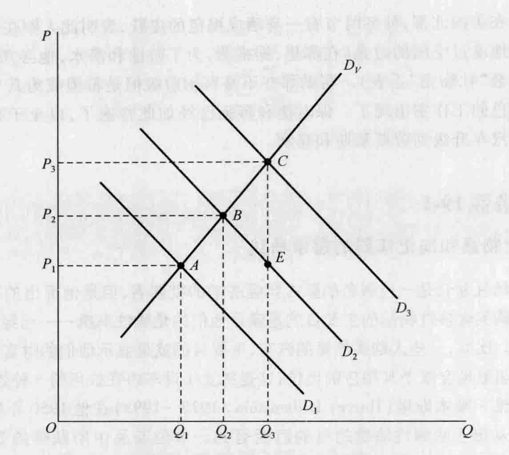

# 第 19 章 制度学派

制度学派是美国对经济思想的一个贡献，它大约产生于 1900 年，并一直发展到现在。1900 年时，它的开创者索尔斯坦·凡勃仑已经出版了第一本著作以及许多论文和书评。

在本章，我们主要讨论传统的制度主义，而非“历史借鉴 19-2”中所说的新制度主义。在对传统制度学派进行概要介绍之后，我们将具体介绍几位经济学家：对正统经济思想进行了详细的批判性分析并提供了制度经济学理论方法的凡勃仑、以自己的统计研究激发了经验研究的韦斯利·C. 米切尔、普及了若干制度经济学主题的约翰·K. 加尔布雷思。①

## 19.1 制度学派概览

### 19.1.1 制度学派产生的历史背景

在美国国内战争和第一次世界大战期间，美国的资本主义发展取得了显著的成绩。快速的经济增长使美国成为世界上最大、最强有力的工业体系。然而，很多工薪阶层生活条件的改善程度却远远低于期望值，也低于国民收入普遍上升应该带来的改善程度。劳动时间很长，住房经常不足，疾病、失业和养老保障微乎其微，高等教育对多数工人家家庭的孩子来说可望而不可即，工作保障实际上并不存在，健康和安全管理匮乏。经常的情况是：雇主们组织起“公司镇”（company town）以控制工人乃至其个人生活，大规模的移民使工资率难以提高，税收是累退的，高利贷盛行，周期性的衰退对于失业者来说是毁灭性的灾难。

垄断大约起源于 19 世纪 70 年代，到世纪之交时垄断的趋势大大加快了。这期间，在学校、新闻出版界、宗教界和政府中都是保守的观点占据了主导地位。宣称关心工人利益而实行了自由放任政策的州政府和联邦政府会毫不犹豫地动用警察和军队镇压卷入工业纠纷的工人，但是在为工商界提供关税保护和为铁路提供补贴时他们又表现得非常慷慨。

19 世纪后期美国的政治经济状况使许多经济学家开始质疑新古典经济学的假设和结论。最小的政府干预会产生最大的社会福利的教条开始逐渐站不住脚。对垄断、贫穷、萧条和浪费的关注很多。社会控制和社会改革的运动正在积蓄力量，正是在这样的背景下，制度经济学产生了。

当时，得到普遍认可的两种变革社会的主要方式是：（1）沿着社会主义方向重新组织社会；（2）实行社会改良，即通过政府的经济干预改善社会状况。第二种方式的目标是通过提高民众的生活条件来挽救资本主义。凡勃仑批判了社会改良运动，而赞成对社会进行根本性的重建。然而，他创立的制度学派却恰恰反映了改良的方法。例如，20 世纪 30 年代罗斯福新政带来的变化就受到了制度主义的深刻影响。

德国历史学派（第 11 章）对美国制度主义的影响是很明显的。创建于 1885 年的美国经济学会的多数领导者对德国历史学派及其研究方法都很熟悉、很赞赏。凡勃仑的不少出色的老师都曾在德国学习。在卡尔顿学院教过并且鼓励过凡勃仑的约翰·贝茨·克拉克就是其中的一个。尽管克拉克的边际理论与德国历史主义没有任何共同点，但是他却形成了与德国改良主义思想相通的基督教改革理念。乔治·S. 莫里斯（George S. Morris）在约翰斯·霍普金斯大学的演讲给凡勃仑留下了深刻的印象。莫里斯是约翰·杜威（John Dewey）的老师，是在德国的大学里受过训练的黑格尔学派的哲学家。约翰斯·霍普金斯大学的理查德·T. 埃利（Richard T. Ely）教过凡勃仑和另一位制度主义者约翰·R. 康芒斯，并且与他们一起工作过。埃利曾在德国一些顶级的历史学派经济学家的指导下学习过，他坚信归纳法比演绎法优越。不过，尽管德国历史学派和美国制度主义之间在研究方法上有某些相似之处，但是后者的观点并非国家主义的，而是更加自由、更加民主的。

### 19.1.2 制度学派的主要信条

以下描述了制度学派的七个主要理念：

*   **整体的、宽广的视角。** 必须将经济作为一个整体来考察，而不能将其作为与整体分离的较小部分或者独立实体考察。如果每个组成部分都被认为似乎是与更大的实体毫不相关，那么复杂的有机体就不可能被充分了解。经济活动不仅仅是受追求货币所得最大化这种欲望分别地、机械地支配的个人活动的总和。经济活动中也存在着大于各部分之和的集体行动。例如，一个工会会形成自己的特色、理念和运作方法，而这些并不能从对其个体的研究中直接推导出来。
    在制度主义者看来，甚至连经济活动这个概念都太狭窄了。他们认为，经济学是与政治学、社会学、法学、社会习俗、意识形态、传统以及与人类信仰和经验有关的其他领域交织在一起的。制度经济学涉及社会运作过程、社会关系和社会的所有其他方面。
*   **关注制度。** 这个学派重视制度在经济生活中的作用。制度并非仅仅是为达成某一目标而建立的组织或机构，如学校、监狱、工会或者联邦储备银行，它还是集体行为的组织模式，并作为文化的一个基本组成部分被广泛建立与普遍接受。制度包括习俗、社会习惯、法律、思维方式和生活方式。奴隶制和对奴隶制的信仰也都是制度，其他的例子还包括对自由放任、工会主义或政府社会保障体系的信仰，新年夜到外面大声喧闹也是一种制度，同样，苏联的共产主义意识形态和美国的反共产主义意识形态也都是制度。制度主义者认为，经济生活是受经济制度而非经济规律制约的。与边际理论强调的个人主义相比，社会行为及影响它的思维模式与经济分析的关系更密切。制度主义者对于信用、垄断、所有权缺位、劳资关系、社会保障和收入分配制度的分析与改革尤其感兴趣。他们主张制订经济计划，并减缓经济周期波动的幅度。
*   **达尔文主义的、演化的方法。** 因为社会和各种社会制度都是在不断变化的，所以演化的方法应该被用于经济分析中。制度主义者并不赞同在不考虑时间和地点的差异、不考虑不断发生的各种变化的情况下，寻求永恒的经济真理的静态观点。制度主义者不关注“是什么”，而是关注“我们是如何到达这里的，我们将走向何方？”他们认为经济制度的演化和功能应该成为经济学的中心议题。这种方法不仅要求经济学家具备经济学知识，而且还要求具备历史、文化人类学、政治学、社会学、哲学和心理学知识。
*   **反对正常均衡的观点。** 制度主义者不强调均衡的观点，而是更强调循环因果关系原理和对实现经济与社会目标可能有益或有害的累积性变迁。经济生活的失调并不是对正常均衡的偏离，相反，它们恰恰是经济生活的正常状态。第二次世界大战前，最明显的失调是经济萧条，于是，经济发展成为关注的中心。20 世纪 70 年代后期，滞胀即通货膨胀与失业的同时发生成为主要问题。而在 20 世纪 80 年代中期，则出现了贸易赤字和联邦预算赤字的问题。制度主义者确信，政府的集体控制对于持续纠正和克服经济生活的缺陷和失调是必要的。
*   **利益冲突。** 制度主义者认为人们之间存在严重的利益分歧，而不认可他们同代和前代的大多数经济学家从其理论中推导出来的利益和谐的结论。制度主义者认为，人们是合作性的、集体性的动物。为了成员们的共同私利，他们将自己组织成各种团体，这样共同的私利也就成了整个团体的共同利益。但是在各个团体之间仍存在着利益冲突，比如大企业和小企业之间、产品的消费者和生产者之间、农民和城市居民之间、雇主和工人之间、进口者和国内生产者之间、产品的生产者与货币资金的贷出者之间。此时，一个有代表性的、公正的政府必须为了共同利益和经济体制的有效运转对冲突的利益进行协调和控制。
*   **自由民主改革。** 制度主义者支持旨在使财富和收入的分配更加公平的改革。他们不认为市场价格能充分反映个人福利和社会福利，不认为不加管制的市场能够导致资源的有效配置和收入的公平分配。制度主义者总是谴责自由放任政策，而主张政府应该在经济和社会事务中发挥更大的作用。
*   **反对快乐—痛苦心理学。** 制度主义者批判了经济分析的边沁主义基础。相反，他们寻求一种更好的心理学基础，并且其中一些人将弗洛伊德和行为主义的观点整合到了他们的思想之中。

### 19.1.3 制度学派对谁有利或为谁谋利

在一个大企业和银行资本主义日益增长的时代，制度学派体现了中产阶级的改革要求。它代表了农业集团、小企业和劳动者群体的要求与利益。制度主义的思想对政府工作人员、改革者、人道主义者、消费者组织的领导人和工会成员来说很有吸引力，他们希望制度主义思想能够改变私人企业的自利导向。许多非经济学的学者都非常赞赏制度主义者的跨学科关注和他们对社会变革的号召。

### 19.1.4 制度学派在当时是如何有效、有用或正确的

制度主义者对经济思想中僵化的正统学说的发展提出了挑战。他们对正统理论的许多批评是有效的，并且修正了其许多观点，使之更能站得住脚。制度主义者强调将经济看作一个整体，看作演进过程的一部分，并在制度的背景下，为经济分析增添了一些现实因素。

制度主义者唤起了经济学家对经济周期和垄断的尽管迟到但却深刻而长久的关注。他们推动了一项改革运动，有效地磨平了资本主义粗糙的边缘。在一个知识日益破碎和分隔的世界中，他们呼吁各项社会科学的更加密切的融合。他们中的一些成员对归纳研究的强调缩小了经济理论和实践之间的差距，以至于收集和分析统计数据在政府圈子中、在私人非营利性研究组织中、在企业和劳动组织中以及经济学家中都变得非常流行。美国国家经济研究局，由韦斯利·C. 米切尔等人在 1920 年建立，并且由米切尔本人领导了许多年，是应用这种方法的一个典范。

### 19.1.5 制度学派的哪些信条具有长远贡献

随着凯恩斯主义宏观经济学的出现及被广泛接受，制度主义者倡导的更加宽广的视角也被主流经济学认可。事实上，就他们的总体的方法、稳定经济的方法和他们对政治自由的关注而言，凯恩斯主义和后凯恩斯主义都趋向于吸收和取代制度主义。

制度主义者推动的改革运动至今仍然保持着生命力。采取温和的步骤以实现有限目标的国家经济计划，例如环境保护、充分就业和国际竞争都是与制度主义的思想相一致的。对工会主义进行法律保护、建立社会保障和最低工资与最长工作时间立法都是制度主义者挑战正统经济思想的产物。

随着对经济发展问题关注范围的扩展，研究制度环境对经济关系的影响成为经济学领域新的关注重点。经济发展问题的本质涉及多种文化因素并且是动态、不断演进的。在其他领域也可以看到制度主义者的长远影响，比如，劳动关系、法律和经济关系、产业组织等。具有讽刺意味的是，在过去的 30 年中，新古典经济学的创新竟包括了新制度分析。例如，正统经济学分析了产权、资历、退休政策、家庭等多种制度。但是，与旧的制度主义者不同，这些新的理论家们致力于确定这些制度的经济合理性——它们之所以会出现的经济逻辑以及它们当时的存在如何提高或降低了经济效率。

传统的制度经济学在当今的美国仍然存在。演化经济学学会（the Association for Evolutionary Economics）的成员主要由那些倾向于制度经济学的方法或政策观点或两者兼而有之的经济学家组成。这个组织定期聚会，还出版了《经济问题杂志》（*Journal of Economic Issues*）。然而，制度主义对主流经济学的整体渗透并不显著。在这方面，R. A. 戈登（R. A. Gordon）四十多年前作出的评价仍然是很正确的：

> 很明显……所谓的正统经济学在今天比在大萧条前更加制度化……但是，就重要程度而言，经济理论的核心仍然是关于“非制度性的”，如同在凡勃仑的时代一样。萨缪尔森的《经济分析基础》或希克斯的《价值与资本》比马歇尔的《经济学原理》更少涉及制度分析。除了一些例外，具有理论倾向的经济学家通常不会欣然从事对制度安排或制度发展的研究（他们将其留给了历史学家和社会学家）。尽管微观经济理论在企业理论和市场行为方面有一些新发展，但仍然主要关注凡勃仑严厉批评过的那类“均衡”。②

下面我们转而讨论一下索尔斯坦·凡勃仑，这位开创性的、高深莫测的，被认为是制度学派开创者的天才。

## 19.2 索尔斯坦·邦德·凡勃仑

索尔斯坦·邦德·凡勃仑（Thorstein Bunde Veblen, 1857—1929）是挪威移民的儿子，出生于威斯康星的一个边陲农场，并在明尼苏达的农村长大。他在明尼苏达的卡尔顿学院完成了本科教育，师从约翰·贝茨·克拉克。他在约翰斯·霍普金斯大学和耶鲁大学完成了研究生教育，他在霍普金斯大学没有获得奖学金，在耶鲁大学最终获得了哲学博士学位。然而，他没有得到任何学术职位，主要因为他持有不可知论的观点，而当时神学学位被认为是讲授哲学的一个重要先决条件。

凡勃仑获得了在康奈尔大学和芝加哥大学从事博士后研究的奖学金，成为芝加哥大学《政治经济学杂志》（*Journal of Political Economy*）的编辑。尽管凡勃仑共出版了 11 本专著，并在世界范围内享有持久的声誉，但他却从来没有得到过全职教授的教职。

由于婚姻问题、对多数学生漠不关心、男女关系问题和教学技巧不高等原因，凡勃仑不得不不断地从一个学校转到另一个学校。继芝加哥大学之后，他先后在斯坦福大学、密苏里大学和社会研究新学院（New School for Social Research）工作。1918 年，他还曾经在华盛顿特区短暂地为食品管理局工作过，并担任了《日晷》（*The Dial*）的编辑。在晚年，他以前的一位学生在经济上给予了他资助。他去世于 1929 年，刚好是他曾经预言过的股票市场崩溃和大萧条开始前的几个月。

凡勃仑是一个尖刻的、好怀疑的、悲观的、孤独的人。他的著作尽管有些冗长和晦涩，但是充满了机智、智慧和对中产阶级品德的讽刺式攻击。例如，在《企业论》（*The Theory of Business Enterprise*）一书的一个脚注中，他以灵巧聪敏的机智这样定义“势利”（snobbery）：

> 这里使用的“势利”没有任何不敬，作为一个方便的词汇，它指的是那些惯有社会地位低于期望值或者不似期望值那样真实的人追求体面过程中的努力因素。③

### 19.2.1 有闲阶级

凡勃仑的第一部也是流传最广的著作是出版于 1899 年的《有闲阶级论》（*The Theory of the Leisure Class*）。有闲阶级的特点是炫耀性消费、避免有用的劳动和保守主义。

**炫耀性消费。** 凡勃仑认为有闲阶级忙于掠夺性地攫取对他们作用不大的产品。有钱人这样做并不仅仅是为了满足他们的物质需要，甚至也不是为了满足精神、感官和知识的需要。相反，他们希望以一种能够显示他们财富的方式消费，因为在我们的金钱文化中，显示财富也就意味着权势、声望、荣誉和成功。为了获得声誉，消费必须是浪费性的。较穷的人为了生存必须工作，但是就连他们的消费方式中也包含了浪费的、炫耀性消费的因素。他们对生活的看法是由占支配地位的有闲阶级强加给他们的。

按照凡勃仑的观点，女人在展示男人拥有的财富和重要性方面特别有用。女人们穿着不便于从事有用劳动的昂贵衣服和鞋子，以展示她们是由富有的男人供养的。被长长的指甲、笨重的发型和纤细的皮肤所拖累的女性，不断地展现出她们是被有闲阶级的男人所“拥有”的有闲阶级的女人。

凡勃仑说，一个绅士的帽子或漆皮皮鞋的光泽并不比一个有同样光泽的破旧袖管有更多的内在美；那些难以栽种并因此而昂贵的花并不必然比那些野生的或不太需要照料的花更美丽；对修建草坪、牧场和公园来说，牛比鹿更有用，但是鹿却更受欢迎，因为它们更昂贵，更没用，更不能用于普遍盈利。④

许多现代证据表明，一个人是可以以一种凡勃仑所说的炫耀性消费的方式来自娱的。数以千计的内陆人仰慕地关注每年一度的游艇展示，这在美国的许多海滨是很常见的。在美国北部，仲冬时节有一身晒成褐色的皮肤，表明此人刚在昂贵的沙漠或海滨旅游胜地度过空闲的时光（在那里，据推测，为了游泳和潜水，他必须拥有价值 9000 美元的黄金“牡蛎壳”手表）。帮助那些不是有闲阶级但是希望成为其中一员的人将皮肤晒成褐色的工作室出现了。保时捷和奔驰已经如此普遍了，以至于有闲阶级的成员不得不将汽车升级到劳斯莱斯和宾利。

> **历史借鉴 19-1**
>
> **凡勃仑物品和向上倾斜的需求曲线**
>
> 虽然凡勃仑是一位著名的新古典经济学的批判者，但是他提出的这一理论——一些消费者购买奢侈性物品的主要目的是满足他们的炫耀性消费——已经被整合进新古典分析中了。比如，一些人购买昂贵的汽车，主要目的就是显示他们的财富。拥有这些昂贵的汽车很明显地会赋予其相应的地位，这是独立于汽车内在效用的一种效用来源。
>
> 哈维·莱本斯坦（Harvey Leibenstein, 1922—1993）在他 1950 年的一篇经典论文中指出：“从出于炫耀性消费的目的而拥有的一单位商品中所获得的效用不仅取决于那一单位商品的内在品质，还取决于为其支付的价格。”也就是说，“凡勃仑物品”不仅产生内在效用，而且还产生炫耀性消费效用，而后者直接与价格有关。
>
> 图 19-1 表示了莱本斯坦分析的要点。假设产品价格可以变化，并假设每条消费曲线上的炫耀性消费效用都是不变的，从而可以得出向下倾斜的需求曲线 $D_1, D_2, D_3$。例如，曲线 $D_1$ 表明，如果与其相联系的炫耀性消费效用不变，那么，当价格下降时，消费者会购买更多的产品。曲线 $D_3$ 代表比 $D_2$ 更大的炫耀性消费效用，但是与曲线 $D_2$ 相同，它也是通过假设价格变化时，这种效用水平不变而得到的。
>
> 但是，价格变化时，凡勃仑物品的炫耀性消费效用并不是固定不变的，它随着价格的下降而减少，随着价格的上升而增加。例如，昂贵汽车的价格若削减了一半，那么其效用可能也会下降。在图 19-1 中，价格从 $P_3$ 下降到 $P_2$，减少了炫耀性消费的效用，并使需求曲线从原来的 $D_3$ 左移到 $D_2$；价格从 $P_2$ 下降到 $P_1$，进一步减少了炫耀性消费的效用，并使需求曲线从原来的 $D_2$ 左移到 $D_1$。
>
> 在莱本斯坦的分析中，产品价格的下降既产生了一个标准的价格效应，也产生了一个凡勃仑效应。单独来看，从 $P_2$ 下降到 $P_1$ 的标准价格效应（炫耀性消费效用保持不变）是由需求曲线 $D_2$ 上从 $B$ 到 $E$ 的下降运动和需求量从 $Q_2$ 变到 $Q_3$ 来表示的。凡勃仑效应是由需求曲线从 $D_2$ 左移到 $D_1$ 和需求量从 $E$ 减少到 $A$（或者从 $Q_3$ 减少到 $Q_1$）来表示的。在这个例子中，从 $E$ 到 $A$ 的凡勃仑效应超过了从 $B$ 到 $E$ 的标准价格效应；价格的下降导致了需求量从 $B$ 到 $A$ 的一个净下降。另外的例子可能导致完全相反的结果，因此，即使对凡勃仑物品来说，价格的下降也可能导致需求量的增加。
>
> 
> 
> *图 19-1 炫耀性物品价格的变化与需求量的变化*
> 
> 注意在图 19-1 中，价格从 $P_3$ 降到 $P_2$ 再到 $P_1$，会导致需求数量从 $Q_3$ 减少到 $Q_2$ 再到 $Q_1$。于是，在这个例子中，ABC 描述了一条斜率为正的实际需求曲线 $D_v$。价格降低会导致消费者减少对凡勃仑物品的购买。可以推测，消费者会转而购买那些价格和炫耀性消费效用都没有下降的奢侈品。另一种情形是，价格的上升使商品的炫耀性消费效用增加了很多，以至于消费者将会购买更多这种商品。*
>
> 凡勃仑商品向上倾斜的需求曲线的现实性有多大？对某些物品来说，这种类型的个人需求曲线可能会存在，但是关于凡勃仑商品的斜率为正的市场需求曲线并没有得到证实。尽管价格下降时，消费者可能会减少某些奢侈品的购买，但是许多其他消费者也会进入这个市场来购买这种商品。对于这些新购买者来说，这些商品的内在效用价值超过了其较低的价格。于是，最终仍然得到一个标准的净结果：需求量随着价格下降而上升。在现实世界中，凡勃仑效应并没有否定向下倾斜的市场需求规律。
>
> 然而，凡勃仑对炫耀性消费的讨论和莱本斯坦对奢侈品偏好的效用分析仍然是非常重要的。和另一个与此不相关的吉芬物品（第 18 章）的概念类似，凡勃仑商品的概念解释了为什么某些人对某些特定物品会拥有向上倾斜的需求曲线。
>
> \* Harvey Leibenstein, "Bandwagon, Snob, and Veblen Effects in the Theory of Consumer Demand," *Quarterly Journal of Economics* 62 (May 1950), 203.

**避免有用劳动的倾向。** 有闲阶级必然会避免从事有用的、生产性的工作。为了保持声誉，他们必然只会沉湎于浪费性或无用的事务之中。

这些职业包括政府、战争、运动和宗教仪式。在那些被过度地给予了复杂的理论性的细节的人看来，可能这些工作也仍然附带地、间接地是“生产性的”。但是，要注意的是，当下这个问题的决定性方面是有闲阶级从事这些职业的普遍的、表面的动机肯定不是通过生产性努力来增加财富。与任何其他文化阶段一样，当前政府和战争至少都是为了其从业者的金钱利益而进行的，只不过是通过值得尊重的掠夺和转换的方式获得的利益而已。这些职业从本质上讲，是掠夺性的，而非生产性的。⑤

凡勃仑说，过去存在于野蛮人中的暴力和欺骗在今天仍然存在。我们可以在现代战争、商业、运动和比赛中看到它们：

> 策略和狡猾是始终存在于现代比赛中的元素，就像一直存在于军事追击中一样。在这些职业中，策略逐渐发展成权术和诈骗。诈骗、虚假和恫吓在任何体育竞赛和一般比赛中都居于非常稳固的地位。裁判这一职业的习惯性使用以及对许可范围内的欺骗和策略的界限及相关细节的精细技术性规范充分证明了这样一个事实，即以欺骗行为和手段而胜过对手在比赛中并不是偶然的。就这种情形的本质而言，对运动的适应会导致欺骗方面的才智发展得更充分；社会中普遍存在着使人们乐于从事运动的掠夺性性格，这意味着不正当手段和对别人利益漠不关心的盛行。⑥

**保守主义。** 凡勃仑断言，社会结构的演进是一个制度的自然选择过程。进步可以归因于最适宜的思想的保存和个人对变化环境的被动适应。制度必须随着环境的变化而不断变化，这些制度的发展代表了社会的发展。遗憾的是，由于变化过程中的文化滞后，在当前的信念（形式上的制度）和当前的需要（动态的技术的制度）之间存在着冲突：

> 今天的情形通过对人们对事物的习惯性思维施加影响，并改变或强化从历史上沿承下来的观点、态度，经由一个选择性、强制性的过程，塑造了明天的制度。引导人们生活的制度或者说思维习惯，就是以这样一种方式从传统中得来的……制度是过去变迁过程的产物，是适应于过去的环境的，绝不会与现在的需要完全一致……同时，除非环境发生变化，否则人们现在的思维习惯会趋于无限期地保持下去。因此，这样传承下来的这些制度、思维习惯、观点、思想态度和倾向，或者那些没有传承下来的东西，本身就是保守的因素，这是社会惯性、心理惯性和保守主义的因素……社会演进的过程从本质上说是处于环境压力下的个人的思想适应于新环境的过程，但这一环境与形成于并适应于以往与之完全不同环境下的思维习惯不再能相容。⑦

处于环境力量之外的社会的一部分或一个阶级在调整其观点以适应已经变化了的总体形势的速度将会更加缓慢，并因此将阻碍社会变迁的进程。有闲阶级恰好隔离于可能导致制度变迁或制度重新调整的经济力量。这个阶级特有的态度正如一条格言所说：“不管它是什么，它都是正确的。”但是，适用于人类制度的自然选择过程却是：“不管它是什么，它都是错误的。”即从演进的观点来看，现有的制度在某种程度上都是错误的，因为它们的变化速度不足以与时俱进。

### 19.2.2 对新古典经济学的批判

凡勃仑的有闲阶级理论构成了对新古典经济学的一种批判，因为新古典经济学假设消费者是至上的。通过“货币投票”消费者决定了所生产的商品的构成，并进而决定了使福利最大化的社会资源的配置。但是，如果相当大一部分的消费主要是为了在邻居们面前炫耀而进行的，而邻居们也努力通过购买相似的商品进行回击，以保持他们的相对地位，那么政府就能通过限制每个人的“浪费性消费”而提高整个社会的福利。正如布雷特（Breit）和兰塞姆（Ransom）所指出的：“因此，凡勃仑通过使经济人变为社会人而颠覆了新古典消费理论‘自由放任’的政策含义。”⑧

凡勃仑同时也对新古典思想进行了直接批判。例如，他认为约翰·贝茨·克拉克的体系是静态的，因而是无用的，其“动态学”从本质上来说只是错乱的静态条件。凡勃仑认为克拉克的体系建立在进化视角以前的常态和自然规律的观点上——一种阻碍对渐进的变化清醒认识的观点。居于主导地位的享乐主义经济学流派认为：

> 一群使用耙和神奇咒语捕捉贝壳类生物的阿留申群岛的原住民在破旧的船只和波浪中四处奔波……他们处于地租、工资和利息的享乐主义平衡中，并且那就是全部的存在。实际上，对这种经济理论来说，那也就是对于任何经济情形都存在的全部。一种情形与另一种情形下享乐的程度不同，但是除了享乐程度的高低不同外，从经济理论的角度看，所有的情形在本质上都是相同的。⑨

享乐主义预先假设了会按照对快乐和痛苦的预期迅速、顺利地行动的理性和明智的人。他们都是聪明并且有远见的：

> 享乐主义关于人的定义是：人是对快乐与痛苦的迅速计算者，他像一个处于刺激的冲动之下的、对幸福充满渴望的均质的球体一样来回振荡，刺激的冲动使他在这个区域内来回移动，但是保持完好无损。他既不是先行者，也不是继任者。他是一个独立的、确定的人类基准点（human datum），并且处于稳定的均衡中，除非撞击力的冲击使他向一个方向或另一个方向发生位移。由于在自然空间中自我强加的力量，他会按照自己的精神之轴对称地旋转，直到力量的平行四边形征服了他，于是他就沿着合力的方向运动。当这种冲击力被耗尽的时候，他就会静止下来，像以前一样是一个充满渴望的独立的球体。从精神上说，享乐主义者并不是一个最佳的运动者，也不是生活过程的场所，除非他屈从于外在的与他不同的环境强加给他的一系列变化。⑩

其实，凡勃仑也对支持现有的财富和收入分配方案的新古典主义进行了批判。他认为，标准的理论并不是任何真正的理论，而只是使私人产权和财产收入合理化的传说或神话。企业经济学的提出是用来维护商业社会利益的，它提出的、寻求答案的问题与全体人民并不相关。凡勃仑所关注的是社会经济学而不是关于价格、利润和所有权的企业经济学。

最后，我们注意到凡勃仑对主导当时一般的经济理论的完全竞争的概念进行了批判。他认识到大多数企业家对他们所索要的价格具有一定的垄断控制力，并且他们使用广告来加强他们的市场地位。凡勃仑发表于 1904 年的这种分析预示了 1933 年垄断竞争理论（第 17 章）的兴起。⑪

### 19.2.3 手艺本能

凡勃仑认为工作并不总是令人厌倦的，否则将会危及人类的生存。人类在生存竞争中，相对于其他物种的优势在于其对于环境的控制力。真正关键的不是人类本性中对努力的偏好，而是其对成就的偏好。当不是被过度劳动困扰时，人们对工作并不反感，相反对手艺本能却有一种偏好，这导致了人类物质上的舒适和物种上的成功。人们本能地希望工作，并希望将其做好。他们反对浪费。与同样重要的亲情本能类似，手艺本能激励本代人为后代努力改善生活。基本上，我们会尽量避免贪婪和懒散，会教育和培养我们的孩子，会改进技术，会保存我们的资源——所有这些都是源于我们的手艺本能和我们供养后代的希望。这种本能与通常的对有用劳动的厌恶相矛盾，但它是主导力量，尤其是在大量的工匠、农民和技术专家中更是如此。

小规模的手工生产和贸易逐渐让位于大规模的资本主义企业。先前市场是狭窄的，企业是以一种谋生的观念来经营的。现代工业体系的主要特征是机器生产和为获取利润而投资。市场的扩展和投资的扩大为精细的操作创造了新机会。随着工业巨头不断扩大他们的领地，他们与社会上其他人的利益分歧也越来越大。他们对产品的生产不感兴趣，他们主要对实现利润最大化感兴趣。

企业家在经济中的任务是“挣钱”，而不是生产商品。生产商品是与挣钱相伴随的一个机械运动的过程；挣钱则是一个货币运作的过程，是通过讨价还价和销售来进行的，而不是通过机械设备和能量转换进行的……商业中的最高成就是以最简洁的方式不用付出任何东西而获得某些东西。⑫

尽管生产商品和获取利润这两个目标可能会重合，因为生产商品仅仅是获取利润的一个手段，但是当这两个目标冲突的时候，前者就要让位于后者。如果需要，大企业家之间的联合、控股公司和其他类型的垄断企业可能会组织起来限制产量、提高价格。当挣钱的目标优先于商品生产时，手艺本能就会受到阻碍，因为生产会受到销售情况的影响。处于实际控制地位的所有权缺位者会限制产量的增加，进而防止价格的下降。他们会把工人和资本投入经济中竞争性更强的部门，从而恶化那里的情况。他们可以从可能会阻碍产出增加的这种经济体的失调中获取利润。如果经济不稳定，他们获利的机会就会增加。精明的企业家可以通过在经济周期的上升阶段“买空”，在周期的下降阶段“卖空”而挣钱。大企业会阻碍进步，因为相对于产品服务社会需求的价值而言，他们对其市场价值更感兴趣。那些对价格问题而不是生产问题更感兴趣的人包括企业家和他们的助手——销售人员、会计、广告商等。

### 19.2.4 信用和经济周期

按照凡勃仑的观点，信用在现代经济中发挥着重要作用。只要企业的利润率高于利率，那么借钱就能够增加利润。在竞争的条件下，一个企业家所从事的可以盈利的项目对于所有竞争者来说可能都会成为必然的选择。那些使用了信用的人和没有使用信用的人相比，相当于是在以较低的价格出售商品。因此，告贷是非常广泛和普遍的。一个企业的竞争性盈利能力是建立在初始资本和以初始资本为担保的借贷资金的基础上。在扩大企业规模的过程中，使用信贷资金会使企业拥有相对于其他竞争者的优势，但是信用的扩张对利润或工业总产出并没有加总效应。事实上，总的工业净利润减少了必须给工业过程外的债权人支付的利息的数量。

为什么信用的扩张对总利润或工业总产出没有影响？把借入资金也看作财产是不正确的吗？难道借入资金这种财产不会通过将其代表的物质形态的财富直接或间接地应用到工业过程中而转化为生产性用途吗？凡勃仑的回答是否定的。虽然贷款的支付可以以贷款人占有的财产的形式实现，但是财产可能有不同的存在形态。房地产即使不能被用于工业用途，也照样可以成为贷款的抵押；而那些以公司股票和工厂担保的贷款则会使那些已经处于工业生产过程的物质产品加倍。

当然，凡勃仑忽视了这样一个事实，即银行信用能够使企业从那些失业、未充分就业和自我雇佣（比如工匠和农民）的人中动员出一部分劳动力。将劳动力吸引到大的工业企业中会增加总产出。同样，信用会使对原材料和资本设备的动员以及其供给的扩张成为可能。它扩展了市场，并因此刺激了更大的生产。凡勃仑对信用的批评只有在生产要素和最终产品的供给是完全固定的且无法进一步扩展的情况下才是有效的。

凡勃仑对信用的看法直接导致了他的经济周期理论的产生。信用的扩张使相互竞争的企业家能够抬高他们在工业中使用的物质资本品的价格。随着其货币价值的增加，这些资本品就成为未来信用进一步扩张的担保品。以股票或不动产为抵押的贷款的扩张具有累积的特点。垄断企业的信用扩张更为严重，因为垄断企业预期增加的利润和新合并公司的商誉都会被资本化于新发行债券的价格中。

不断累积的信用的扩张是建立在一个并不牢固的基础上的。在抵押品的货币价值和按照预期收益计算的财产的资本化价值之间迟早会出现偏差。换言之，收益的增长无法与资本（资本加上贷款）名义价值的增长保持同步。当这种偏差变得日益明显的时候，企业就将进入清算阶段。除了清算外，工业危机还伴随着信用的废除、较高的贴现率、不断下降的价格、强行拍卖、总资本的缩减和产出的下降。债权人接管企业财产后，会进一步巩固所有权，将控制权集中到更少的人手中。

在经济繁荣期，工人们会通过更加充分的就业而非较高的工资率获益。随着总体价格水平的上涨，生活费用的增加降低了实际工资率。慢慢地，随着产品价格的不断上涨，工人的工资也不断上升，而这会使繁荣逐渐走向终结，因为利润空间收缩，资本价值下降。

凡勃仑认为，只要没有外部环境的暂时介入中止了经济活动的上述趋势，资本化与获利能力之间的这种偏差将是长期性的。因此，在机器工业充分发展的体系下，长期萧条是正常的，不管这种萧条是否显著。但是，价格的投机性增长、贵金属的新发现和信用扩张会暂时克服萧条现象。垄断企业能通过限制产出、提高价格等谨慎的营销措施恢复盈利。如果成功的话，垄断将会抵消由工业进步带来的产品与服务价格下降导致的利润减少。

对产品浪费性和非生产性消费的增加以及垄断都可以缓解利润下降和长期萧条趋势。但是，要使私人的浪费性支出达到足以抵消现代工业的剩余生产力的规模几乎是不可能的：

> 私人的自主性消费不可能消耗掉一定经济形势下的所有不必需的产品和服务。私人浪费是巨大的，但是导致储蓄和精明投资的经济原理在现代人的习惯中根深蒂固，以致无法使储蓄率有效地逐步降低。就这一点而言，文明政府能以一种有效浪费的方式做更多事情，事实上，它也正在这么做。军备、公共建筑、气派的外交机构等诸如此类的东西，就当前所讨论的问题而言，几乎都是浪费性的……但是，不管这种公共物品的浪费最近变得如何惊人，总体来说很明显它还是不足以消灭机器工业的过剩生产力，特别是由于储蓄积累到相对少数人手中，生产力便受到了现代经济组织所提供的巨大便利的支持。⑬

### 19.2.5 解决方案：技师代表会

根据凡勃仑的观点，在生产产品的工业和制造利润的商业之间会存在冲突：在生产产品和挣钱之间；在手艺本能和金钱利益之间；在整个社会和所有权缺位者、工业巨头之间；在对稳定的需求和信用的扩张之间；在希望以较低价格得到更多产品的购买者和希望以较高价格提供较少产品的垄断者之间；在社会的变革需要和人们思维模式、行为模式的保守主义之间；在可实现的对人们基本需求的满足与不可实现的对炫耀性消费的渴望之间，因为只要每个人都想在浪费性消费方面超过别人，那么炫耀性消费的需求就永远得不到满足。

现代大规模企业产生的这些难题有什么解决方案呢？凡勃仑对社会主义既持批评态度，又非常友好，但他本人绝对不是一个社会主义者。他对马克思的劳动价值论进行了批判，他认为马克思的劳动价值论至好也就是一种同义反复，至差是一种无法证明的、搞笑的、故弄玄虚的东西。他不同意社会主义者持有的富人将会越来越富而穷人将会越来越穷的观点，他认为现行的体制从绝对量来看并没有使工人们越来越贫穷，但是从可比较的经济重要性来看，它确实使工人相对越来越贫穷。现代社会强化了竞争与嫉妒，这将导致社会的动荡，使之走向社会主义。随着私有产权的废除，人们可能会发现，与相互竞争时比，人性更加高尚了，对社会有用的活动也更多了。

凡勃仑认为，工程师——社会的技师——可能会最终领导社会革命并为了公共利益经营工业。他们反对所有制、金融、怠工、信用和非劳动所得，因为这些因素都会影响技术效率与进步。工程师是整个社会的最佳代表，因为资本所有者和劳动者间通过讨价还价已经成为松散结合的既得利益者，他们会以对社会有害的方式追求自身的利益，并在他们之间最终达成类似商业谈判结果的让步与妥协。劳资双方之间进行一种需要机会与技巧的博弈，而工业体系成为双方博弈的牺牲品。但是整个社会的物质福利，特别是工人们的物质福利，取决于工业体系在没有干扰情况下的平稳运行。工程师们恰恰可以确保这一点的实现，因为与劳资双方不同，他们不受自我利益的驱动。因为技师与工人们相比更加同质和统一，因此他们是天然的领导者，是生产线的管理者，是具有实在的工作热情和最发达手艺本能的人。凡勃仑断言，技师代表会能解决国家的问题，只是实现的机会渺茫。当前，技师是温顺和无害的，通常被供养得很好，并且对既得利益者给予他们的“满满的饭碗”非常满意。

凡勃仑并没有寄希望于改革——在资本主义制度下各种条件的改良；事实上，他希望看到资本主义被完全取代。工程师将会进行社会变革的观点对凡勃仑而言可能只是个转瞬即逝的想法。在晚年，他非常赞赏苏联进行的高度重视中央计划的实验。他去世于 1929 年，所以对于 20 世纪 30 年代中期发展起来的斯大林主义的暴行一无所知。但是，基本上说，他仍然是一个悲观主义者，对于人类的本性和人类未来的前景持悲观态度。

## 19.3 韦斯利·克莱尔·米切尔

韦斯利·克莱尔·米切尔（Wesley Clair Mitchell, 1874—1948）是凡勃仑最优秀的学生。凡勃仑是一个伟大的反传统主义者，他对捍卫现状的正统理论中他认为荒谬的部分进行了无情的批判；他为制度主义奠定了哲学和理论基础。米切尔是一位伟大的研究者，他最突出的工作主要是关于经济周期的分析，他为制度主义增添了经验研究的倾向。他非常温和、小心谨慎，没有像凡勃仑那样无情地从根本上摧毁新古典主义，但他确实也对新古典主义不现实的抽象和方法论进行了批评。他认为凡勃仑对人类本性有更加充分的认识，对文化发展有更加宽广的理解，他的进步已经远远超出了同时代的经济学家，但是凡勃仑过于依赖那些没有被经验证明的推测。米切尔认为，他的统计研究将为凡勃仑的开创性工作提供一个更加坚实的基础。

米切尔出生于伊利诺伊州的拉什维尔，1899 年在芝加哥大学得到了博士学位。他就职于华盛顿特区的人口普查办公室，后来又在芝加哥大学、加利福尼亚大学、哥伦比亚大学和社会研究新学院从事教学与研究工作。

### 19.3.1 经验研究的重要性

米切尔说，经济学是一门研究人类行为的科学。他认为，经济学的未来在于向研究更多、推理更少的方向发展。“经济学在定量分析方面将会结出丰硕的成果。如果今天的经济学家越来越多地依靠最为准确的观察统计记录的话，那么他们将来将拥有推进他们前辈工作的最佳机遇。”⑭

由米切尔在 1920 年创建并领导了 25 年的美国国家经济研究局可能是反映其方法的最光辉的典范。在米切尔的指导下，它进行了国民收入数量和分配的最早的一项全面研究。多年来，它出版了大量的统计分析。今天，其研究人员名单就像是美国在经济研究方面的“名人录”。具有讽刺意味的是，绝大多数这些研究人员都是非常正统的经济学家。

### 19.3.2 米切尔对经济周期的研究

米切尔最大的贡献在于他对经济波动的研究。重要的是，我们要认识到他有关经济波动的著作最初出版的时间比大萧条和凯恩斯的《通论》早了二十多年。米切尔称他的经济周期理论是一个“指导性的假设”，因为它是试验性的并且会根据补充证据进行修改。在他那里，经济周期理论逐渐成为一种对经验的经过检验的解释而不是一种逻辑的练习。米切尔越是深入地去寻求各种事实来解释经济波动，其理论越是逐渐地扩展成为一种关于我们的经济体系如何运转的理论。与以前的经济学家只是寻求经济周期的唯一决定性原因不同，他探索了共同产生经济体系的周期性运动的各种条件。如果他的思想现在看来极其平常，那是因为它们已经被非常广泛地接受了。

米切尔对经济周期的经验研究产生了四个重要的结论。每个结论都值得详细说明，具体内容如下：

*   **经济波动出现于货币经济中。** 米切尔并不倾向于将危机和萧条看作是资本主义的一种弊病，而是倾向于将它们看作是主要通过获取货币和支出货币来进行经济活动的社会所出现的一个问题。当然，这是资本主义的一个特点；但是，资本主义还有其其他特点，比如，生产手段是如何被占有的。他指出：“只有当在一个国家中货币的使用已经达到了一种发达的阶段，其经济兴衰才会呈现出经济周期的特点。”⑮
*   **经济周期广泛分布于整个经济中。** 企业的相互依存程度很高，它们被各种工业、商业和金融联系捆绑在一起，所以没有一个企业会独自走向繁荣或衰退而不影响其他企业。信用的增长增加了金融方面的相互依存性。伴随着全部相互关联的各种关系，共同商业组织的扩展将许多名义上独立的企业组织成为利益共同体。这种联系就是经济运转节奏的加速或放慢得以从经济中的一个部分扩展到其他部分的通道。
*   **经济波动取决于利润的前景。** 米切尔认为，利润的前景是经济波动的线索。一个企业只有当它在长期中可以获取利润时才能通过制造产品来为社会服务。服务以获取利润为目的，是货币经济的一个必然结果，而不是源于企业家唯利是图的动机。一个忽视利润、具有公德心的企业家会破产，只有政府和慈善组织才能够不以利润为目的提供服务。
    预期利润比已有的利润或损失更加重要，因为企业会更注重向前看而不是向后看。未来利润的前景在决定企业扩张的方向方面具有决定性作用。在预期利润最具吸引力的经济周期的那一个阶段上，投资达到最高点。因此，在企业经济中对经济波动的描述必须主要涉及经济活动的货币方面。
*   **经济波动是由经济本身系统地产生的。** 经济周期并不是均衡的一个较小的或意外的中断，相反它是经济运转本身的一个内在部分，这种演化与动态的方法贯穿于米切尔的著作中。随着经济周期的每一个阶段演变为下一个阶段，经济本身逐渐经历了累积性变化。因此，米切尔相信，每一代经济学家可能都不得不改写他们年轻时学到的经济周期理论。按照米切尔的观点，经济周期起源于经济中的各种力量，并且经济周期的每一个阶段都会产生其下一个阶段。

比如，经济活动最初的复苏会逐步发展为全面的繁荣，繁荣会逐渐孕育危机，危机会汇聚成萧条，萧条可能会暂时变得更加严重，但是最终会引起经济活动全新的复苏，而这将是另一个周期的开端。因此，经济周期理论必须是对这种累积性变化的一种描述性分析，通过这种累积性变化，一系列的经济条件本身会转化为另一系列的经济条件。⑯

米切尔选择将萧条之后经济活动开始加速的这一阶段作为研究经济周期的出发点。经济活动的复苏一旦开始，便会通过相互关联的企业迅速扩展到整个经济或大部分经济中。工资的增长和较高的利润既会刺激消费需求也会刺激投资需求。零售商和批发商会再次补充在萧条时期被消耗光了的存货。乐观主义开始产生并迅速蔓延，从而使证实并强化了乐观主义的生产状况也开始产生并蔓延。在复苏的后期，价格开始上升。未来价格上升的预期会刺激产品订单的增加。随着经济条件的改善，信用开始膨胀。同时利润也会增加，因为工资和管理费用的增长滞后于价格的上升，对资本品的新投资也会增加。

这就是经济复苏的不断累积的向上的运动。但是它为什么会以危机终结呢？为什么繁荣会孕育着萧条？

在繁荣时期，经济体系中不断累积的各种压力之一便是经营企业的成本会缓慢但确定地增长。随着新资本的投入，当产品成本不断增加时，企业管理费用也开始上升。建立新工厂的新企业在创立过程中会导致较高的成本，而租金和利息一类的黏性成本也会上升。在繁荣时期，缺乏效率的工厂和机器、缺乏能力的管理人员和缺乏效率的工人也会被雇用，从而抬高原材料、劳动力等的价格。随着向市场供给的产品的增加，处于边际上的企业便难以通过提高销售价格以抵消不断上升的成本。劳动力成本也会上升，这不仅因为雇用了缺乏能力的工人，同时还因为工资随着物价的不断上升也开始上升。在繁荣时期，对产品需求的上升会增加对加班劳动的需求，加班劳动与普通劳动相比更加昂贵而生产效率却相对较差。与困难时期相比，繁荣时期的工人不太害怕失去工作，因此劳动的纪律性和生产率会下降。随着企业中人员变得疏忽大意、过于乐观和过度繁忙，生产中的浪费也会增加。

生产成本的不断上升会侵蚀利润，特别是在繁荣阶段的后期制成品的价格不能轻易被提高时更是如此。在经济繁荣的前期，生产能力的扩张增加了产品和服务的供给，这进一步增加了提高销售价格的难度。买者最终会拒绝价格的不断上升，因为他们不能或不愿为产品连续不断地、越来越多地支付货币。由于公共管制、合同和习惯等因素，某些价格无法与成本保持同步上升。几个重要行业的实际利润，甚至是预期利润的下降都足以引起全部行业的财务困难。

繁荣持续的时间越长，这些压力就越大，并且会不可避免地走向危机与萧条。当债权人开始担心时，信用的膨胀就会终结。在危机的临界点上，债务人会被要求减少或全部偿还其债务。巨额清算由此开始，由于企业力图避免破产，于是产品被抛售到市场上，产品价格开始下降。价格下降的预期进一步减少了对产品的需求，从而使这种预期成为现实。由于某些成本在下降方面具有黏性，就像它们在价格向上运动时具有黏性一样，因此产品价格的下降会进一步压缩利润空间。于是，悲观情绪蔓延，投资支出下降，存货减少，失业增加，消费者收入和支出下降，整个经济陷入萧条时期。

如果给予充分的时间，萧条本身就会产生导致繁荣的力量。企业家会将浪费和成本减少到极点。最终，工资、利息、租金和其他黏性成本下降到与产品价格一致的点上。劳动力成本也开始下降，因为加班现象减少了，无效率的工人被解雇了，在岗的工人由于害怕失业而被迫更努力地工作。随着萧条的持续，资本品逐渐被消耗并且变得过时。由于新的资本品的价格已经下降，竞争力会导致企业家在萧条时期利率较低的情况下增加对新的、更加有效率的和成本更低的机器的投资。如果可能，消费者也必须最终更换已经陈旧了的耐用和半耐用消费品。人口持续增加，从而增加了对各种消费品的需求。在萧条时期被减少到最低点的存货随着企业的扩张必然被重新补充。乐观主义开始蔓延，整个经济再次处于一个不断累积的上升阶段。

### 19.3.3 社会计划

米切尔在 1935 年指出，频繁发生的经济危机和萧条是经济体系自动运转功能具有缺陷的证据。我们保持经济平衡的困难由于以下原因而不断增加：市场的扩展、相互联系的增加、经济状况不好时人们可以购买的半耐用消费品的日益增加、农民向城市的转移、农民越来越多地依赖于市场而不是像以前那样自给自足。商业计划不能对抗那些使经济周期更加严重的各种因素的增长。

那么，我们的任务就是推进谨慎的社会计划或国家计划来克服经济波动最严重的特征，与此同时，还要保持经济自由并增加安全性。米切尔依靠国家计划来改善人们生存状况的思想部分地基于他的实用主义心理学。他捍卫社会计划，否认它是不符合美国利益的。他说，我们国家的历史就是一个计划的历史，有时成功，有时不太成功。美国宪法体现了管理一个国家的计划。汉密尔顿曾有一个经济复苏计划，而且在 1917—1918 年我们计划了经济动员以赢得战争。社会计划的最大困难在于对我们希望达到的社会目标的全体一致。事实上，目标的不一致为在一个民主团体中的计划设置了最基本的障碍，因为社会目标的一致只有在极少的情况下才能达到。

计划的第二个困难来自社会过程的相互依赖性。逐一列举的每一条计划经常会带来没有计划的和并不需要的结果，正如禁酒令的制定所表明的，它鼓励了酒类的走私和出现了富有的、违反法律的辛迪加。明智的社会计划必须考虑到社会行动的直接效果，也要考虑到社会行动的间接效果。但是某些结果无法通过个人行动来达到，因此，米切尔认为，国家计划是不可避免的。问题是国家计划会是支离破碎的、不可靠的还是系统的、技术上非常彻底的。

## 19.4 约翰·肯尼思·加尔布雷思

约翰·肯尼思·加尔布雷思（John Kenneth Galbraith, 1908—2006）出生于加拿大，先后在多伦多大学和加利福尼亚大学学习。他曾担任过美国农场局联合会首席经济学家、第二次世界大战期间美国政府的高级官员、《财富》杂志编委会的委员、肯尼迪政府的驻印度大使、哈佛大学的经济学教授、美国民主行动的主席，此外，他还是一位小说家和远东艺术方面的专家。

从总体上来看，加尔布雷思的主要著作既包括了对新古典经济学思想的批判，也包括了对现代资本主义的分析，几乎所有制度学派的特点在他的著作中都有所反映。

### 19.4.1 传统思维

加尔布雷思是一位新古典主义“传统思维”的批判者，新古典的“传统思维”是我们所熟悉并广泛接受，但不再恰当的一系列观点。他的演化的方法探究了不断变化的条件，并且详细研究了改变我们的思想以适应新形势的必要性。加尔布雷思指出：“思想从本质上来说是保守的。它们不会屈服于其他思想的进攻，而是屈服于它们无法应对的、巨大环境的冲击。”⑰ 他的这一说法与凡勃仑的观点类似。接着，他指出他的批判是对传统思维的批判，而不是对最初阐发这些思想的人的批判：

> 读者很快将会发现我很看不起某些经济学的中心思想。但是，我认为最初提出这些思想的人很了不起。经济学的缺陷并不是最初就是错误的而是因为对那些过时的东西未加修正。传统的东西之所以会过时是因为原本有用的已经逐渐变得神圣不可侵犯。⑱

这些过时的新古典主义思想如何能够幸存下来？加尔布雷思这样回答道：

> 新古典体系中的许多东西应归功于传统——作为对曾经存在的社会的一种描述，它并非令人难以置信……
> 另外，它是可用的学说。学生们来了，必须教给他们一些东西，而新古典模型恰好存在。新古典模型还有另外一种优势——它参与了无数的理论改进。伴随着复杂性的增加，它给人一种精确性和准确性日益提高的印象；伴随着困惑的解决，它给人一种已被理解的印象。⑲

在加尔布雷思关于现代资本主义的整体理论中，我们能够发现有几个特别的理论对正统经济学提出了挑战。其中特别重要的两个理论是他的“依赖效应”的概念和他企业行为理论。

### 19.4.2 依赖效应

按照加尔布雷思的观点，现代资本主义为大公司所主导，其主要特点是充满了人为制造的需求，这些需求是公司计划和巨额广告的产物：

> 随着一个社会的日益丰裕，需求越来越多地被满足需求的过程创造出来……因此，需求变得依赖于产出。用专业术语来说，我们不能再假设任意较高的产出水平肯定比一个较低的产出水平的福利更大，二者也有可能是相同的。较高的产出水平仅有一个较高的需求创造水平，这使一个较高的需求满足水平成为必要。有许多场合我们可以看到需求取决于满足欲望的过程，将其称为依赖效应是恰当的。⑳

在现代工业体系中，消费者并不是至高无上的，相反生产与销售产品和服务的巨型企业才是至高无上的。加尔布雷思的“修正的顺序”认为，生产者决定应该生产什么并因此塑造了消费者的偏好，从而使消费者会购买这些产品。正统经济学认为主动权掌握在消费者手中，消费者为了满足个人需求或需求会在市场上购买产品和服务。新古典经济学的消费者选择理论将需求看作是给定的。加尔布雷思认为，当我们说消费者最大化他们的效用时，我们首先避开了消费者最初如何形成了这些需求这一重要的问题。并且，如果需求必须通过广告进行创造，这些需求的紧急程度如何？进一步而言，新古典经济学的消费者需求理论主要强调消费者的至高无上，它暗含着市场决定最优的产出结构和资源配置。加尔布雷思认为，这个观点毫无意义：“如果生产创造需求的话，一个人就无法辩护说生产是用来满足需求的。”㉑

加尔布雷思的消费者需求理论有一个重要的政策含义：公共产品将存在资源配置不足问题，加尔布雷思将其称为“社会不平衡”。通过广告创造的人为需求和竞争的倾向会使资源投向私人产品，并将资源从具有更大内在价值的公共产品中转移走。新汽车被认为比新公路更加重要，人们更加需要家庭中使用的真空清洁器而不是街道清洁器，酒、连环画书和漱口液比学校、法庭和市立游泳馆表现出的总体重要性更大。加尔布雷思认为，校正这种不平衡的一种方法是对消费品和服务课征销售税，利用这种收益来增加公共部门的产品和服务的可得性。

### 19.4.3 加尔布雷思的企业理论

新古典经济学的企业理论认为，通过假设企业试图最大化其利润可以最好地理解公司的行为和表现。加尔布雷思认为，这一点在市场部门中可能是正确的，市场部门的小企业所有者会积极管理他们的企业，但是它不能描述远为重要的计划部门——生产社会一半以上产出的大约 2000 家最大企业的情形。在计划部门中，所有权和控制权是分离的。大型企业的所有者是数百万普通股的持有者，他们对于公司的运营并没有实际的控制权。相反，控制权由技术专家团体掌握，技术专家团体是由行政人员、经理、工程师、科学家、产品计划者、市场研究者、市场营销人员等专业精英组成的。对某一特定公司的表现不满的不高兴的股票持有者并不具有解雇管理层的选择权。实际上，他们能够采取的办法就是卖掉这个公司的股票而去购买其他公司的股票。加尔布雷思认为，假设技术专家团体具有最大化数百万不知名股票所有者收益的动机是天真的。技术专家团体追求更加复杂的目标，加尔布雷思将其归类为保护性目标和积极性目标。

企业最主要的保护性目标就是生存，而这又转化为获取足够利润的需要，以使大多数股票持有者相对满意并能够提供足够的留存收益用于投资和增长。使这种低于最大化水平的利润能够得到保证的一种方式就是使产品价格免于竞争。这样做既可以采取直接固定价格的形式，也可以采取行业内部非正式价格协议的形式。这并非新古典经济学模型所暗含的固定价格以限制产出和最大化联合利润的目标。相反，这个目标就是保证竞争企业获得一个满意的利润水平，从而使它们能够满足其保护性目标并且追求其积极性目标。

企业主要的积极性目标是增长。产出、销量和收入的增长能够为技术专家团体的成员提供更大的就业安全性和财务回报。在正统的企业理论中，寡头垄断者通过限制产量以提高产品价格、增加利润：“最为新古典经济学模型接受的观点是垄断价格比社会理想价格高而产出比社会理想产出低，公众成为受害者。正是由于这种剥削，寡头垄断是邪恶的。”㉒ 在加尔布雷思的理论中，寡头垄断者将价格固定在较低的水平上——能够获得最低利润并且总产出和销量有扩张的余地。如果目标是增长，那么巨额的广告支出、赢取市场份额的各种活动、竞争性和非竞争性企业之间的非盈利性并购等，就都是完全有意义的。按照加尔布雷思的观点：“新古典经济学模型描述了一种并不存在的弊病（高的寡头垄断价格和受到限制的产出），因为它假设了一个并不被追求的目标（利润最大化）。”㉓

加尔布雷思的企业理论有几个有趣的政策含义。比如，传统的反托拉斯的努力应该被摒弃：“迄今为止还没有发生任何限制技术专家团体的发展和成长能力的事情。”㉔ 大企业的不断成长是因为技术上势在必行。它们的规模主要归因于规模经济、巨额的研发预算及吸收新技术的能力。加尔布雷思说，试图通过公共政策来限制这些力量在过去是徒劳的，在将来仍是徒劳的：

> 因此，来自新古典经济学模型的（反托拉斯）方案是无害的，它对于技术专家团体的权力、自主性及其对于增长的积极兴趣没有任何威胁。并且这种方案被认为是广泛性的——由于竞争被认为是校正所有产业弊病的方案——它将所有的弊病引入了一个本质上无害的渠道。对于有效管制行动或公共所有制及社会主义来说，当实施反托拉斯法的要求出现后，本来可能引起危险不安的那些扰动变得安全了。……从技术专家团体的角度来说，最优的方案应该能免于所有的攻击，但是次优方案——一个非常好的方案——是能够将所有的攻击转入安全无效渠道的一个思想体系。㉕

那么，社会应该仅仅追求自由放任政策、依靠这些经济力量来产生社会福利吗？加尔布雷思非常坚决地回答说：“不。”在《经济学与公共目标》（*Economics and the Public Purpose*）一书的前言中，他指出：“在本书中没有一个结论比这个结论更加清晰：如果任由它们自由发挥作用，那么经济力量可能除了对于强势者外，不会产生最优结果。”㉖

尽管对消费者的剥削并不是现代资本主义的一个问题，但是，计划体系对权力的使用确实产生了其他一些严重问题。公众必然通过政府从技术专家团体的手中夺取对经济中计划部门的控制权，以确保它为公共目标服务。这种控制权应该采取几种形式。比如，一个永久的公共价格和工资机构应该控制经济中最大的那些公司的价格，并且确保主要的集体谈判协议中的工资收益没有超过全国生产率的增长；应该成立一个公共计划当局，以联合主要的公司和工会来计划和协调经济活动，这个计划当局同时还必须与其他工业化国家协调经济计划。除了这些改革外，加尔布雷思还要求政府通过对行政人员工资的公共控制、累进税收、提高最低工资及负的所得税计划对收入进行再分配。应该鼓励市场部门的企业进行合并，这样它们才能更加有效地与计划部门的企业进行竞争。与他之前的凡勃仑和米切尔一样，加尔布雷思也认识到了在现代经济中大大扩展政府功能的必要性。

### 19.4.4 对加尔布雷思观点的批评

加尔布雷思对传统经济学的攻击招致了许多反驳。一个例子是，从极端的角度来说，他好像否认消费者拥有能够明确自己的利益并据此行动的自由意志。正统经济学家不接受消费者以外的某一并不明确的主体可能会最好地决定什么才能代表消费者的真实利益这一观点。还有一个例子，批评者指出，一个没能最大化其长期利润的公司会面临成为接管目标的危险。目标公司普通股的价格反映了公司预期的未来收益的折现流，对于非利润最大化的企业来说，这个价格将比其可能的价格低。通过给股票持有者的股份提供一个高于当前市场价格的价格，意欲收购的公司能够获得对目标公司的控制权以及更换管理层、增加利润的权力，并且他们最初持有的股份能够获得资本收益。

总而言之，加尔布雷思对正统经济学的攻击，如同他之前凡勃仑的攻击一样，可以说迫使新古典经济学家暂时停止了前进的步伐，使他们承认并且接受了其反对意见。加尔布雷思招致了很多对他的反驳，他不能被轻易忽略这一事实正是他的智慧、机智和文笔力量的明证。然而，正统经济学几乎没有经历什么磨难，其背叛者更是少之又少；坦率地说，正统经济学仍在继续前行。对于制度主义来说，如果想要重新成为经济思想中的一个力量，它必须赢得未来一代经济学家的思想。实现这一目标的最好希望就是发展一个统一的、能够很容易被理解和被教授、经得起仔细的智力上和统计上的推敲的理论体系。制度主义的批评者认为，到现在为止，它还没有实现这一目标。

> **历史借鉴 19-2**
>
> **道格拉斯·诺斯和新制度主义**
>
> 凡勃仑、米切尔和加尔布雷思等传统制度主义者通常对新古典经济学持批评态度并且支持政府干预。相反，新制度主义趋向于理论化、市场导向和反干预主义。
>
> 新制度主义思想有几个可以确认的分支，每个分支都强调制度在理解经济（或者政治）行为和结果方面的重要性。第一个分支是哈罗德·德姆塞茨（Harold Demsetz, 1930—）关于产权在促进经济效率作用方面的著作；第二个分支是理查德·波斯纳（Richard Posner, 1939—）关于法和经济学之间关系的分析；第三个分支是罗纳德·科斯（Ronald Coase, 1910—2013）和奥利弗·E. 威廉姆森（Oliver E. Williamson, 1932—）对于交易成本在解释企业组织和行为方面的关注；第四个分支是詹姆斯·布坎南（James Buchanan, 1919—2013）和戈登·塔洛克（Gordon Tullock, 1922—）关于公共选择理论的著作，其中包括对寻租、利益集团、投票规则和宪政经济学的分析。
>
> 但是，新制度主义规模最大的分支是与道格拉斯·诺斯（Douglass North, 1920—）联系在一起的。道格拉斯·诺斯是一位美国的经济史学家，荣获 1993 年的诺贝尔经济学奖。诺斯对新古典经济学进行了批评，因为新古典经济学没有认识到制度约束在经济决策中的重要性，不能解释世界范围内不同经济制度的长久性。但是，与传统的制度主义者如凡勃仑等不同，诺斯接受了新古典主义者的“选择理论”方法，这种方法强调理性经济决策。
>
> 选择理论方法是必要的，因为一系列逻辑上连贯、潜在可检验的假设必须建立在人类行为理论的基础上。微观经济理论的优势在于它是建立在对个人行为假设基础上的……制度是人类的一种创造。它们不断演进并且不断地被人类改造，因此，我们的理论必须从个人开始。与此同时，制度强加在个人选择上的各种约束是普遍存在的。*
>
> 制度的产生是由于它们能够最小化人类相互作用的成本。它们可以是正式制度（比如，宪法和法律），也可以是非正式制度（比如，非书面的行为规则）。它们可能是特意创造出来的（比如，美国的货币体系），也可能仅仅是随着时间演进而来的（比如，给小费的传统）。制度是统治经济和政治行为的正式和非正式规则，而制度的参与者则是利用某一特定制度框架提供的各种机会的个人和组织。
>
> 制度所采取的形式主要归因于个人或代表他们的集团的讨价还价能力。但是制度一旦确立，个人选择的行为和结果就会强化它们的持续存在。例如，通过年金计划实施的工人股票所有制会加强对资本主义制度的支持。个人选择行为强化的结果会使国家制度产生“路径依赖”。最初选定的（或强加的）制度会决定长期的路径。因为“参与者”有时能成功地使“规则”朝有利于他们的方向改变，所以制度会逐渐地演变。只有当某一特定制度路径在达到期望目标方面很明显的是条死胡同时，或当期望目标本身发生了变化时，社会才会以激进的方式改变其制度。
>
> 因此，制度约束在不同的时间和不同的国家都不同。制度为各种类型的经济和政治活动提供了激励机制。从根本上来说，富有国家之所以富有是因为它们的制度约束界定了政治和经济活动的一系列回报，而这些回报鼓励教育与技能学习、资本扩张、新技术，并因此鼓励了经济增长。贫穷国家之所以贫穷是因为它们的制度界定了不鼓励财富创造的政治和经济活动的一系列回报：产权界定不清并且实施不利、最聪明的人进入政府或者移民、社会和宗教习惯限制了从事工作并且分散了物质利益、更强调财富的再分配而不是财富的创造。
>
> 天才的诺斯把新古典经济分析和制度分析结合起来，并由此解释了制度如何影响经济决策以及经济决策如何逐渐地改变着制度。
>
> \* Douglass C. North, *Institutions, Institutional Change and Economic Performance* (New York: Cambridge University Press, 1990), 5.
> ** Malcolm Rutherford, *Institutions in Economics: The Old and the New Institutionalism* (New York: Cambridge University Press, 1994), 2—3. 我们在历史借鉴 15-1 中已经讨论过科斯，并将在第 20 章中讨论布坎南和塔洛克。

---

① 美国另外两位制度经济学学者是：约翰·R. 康芒斯（John R. Commons, 1862—1945），他论证了国家有必要对整个政府立法进行改革；克拉伦斯·E. 艾尔斯（Clarence E. Ayres, 1892—1972），得克萨斯大学的一位教授，强调了技术和技术变迁在决定经济和社会发展方向中的关键作用。还有一位杰出的美国制度主义者是道格拉斯·诺斯（Douglas North），他代表“新制度主义”，是历史借鉴 19-2 的主题。

② 引自：Joseph Dorfman et al., *Institutional Economics: Veblen, Commons, and Mitchell Reconsidered* (Berkeley, CA: University of California Press, 1963), 136—137.

③ Thorstein Veblen, *The Theory of Business Enterprise* (New York: Scribner's, 1904), 388.

④ 这段文字曾经启发 H.L. 门肯（H. L. Mencken）写道：“思考着重大问题的这位和蔼的教授是否曾在乡村中漫步过？在他漫步的过程中，是否曾穿过一片养牛的牧场？在他穿过牧场的过程中，是否曾从后面悄悄靠近过牛？在从后面靠近牛的过程中，是否曾不小心地迈开步并……”

⑤ Thorstein Veblen, *The Theory of the Leisure Class* (New York: Random House, Modern Library Edition, 1943), 40 [orig. pub. in 1899].

⑥ Veblen, *Leisure Class*, 273—274.

⑦ Veblen, *Leisure Class*, 190—192.

⑧ William Breit and Roger L. Ransom, *The Academic Scribblers*, rev. ed (Chicago, IL: Dryden, 1982), 39.

⑨ Thorstein Veblen, *The Place of Science in Modern Civilization and Other Essays* (New York: Heubsch, 1919), 193.

⑩ Veblen, *Place of Science*, 73—74.

⑪ 凡勃仑对这一问题的观点的更清楚论述可参见他的 *Business Enterprise*, 53—55。

⑫ Thorstein Veblen, *The Vested Interests and the Common Man* (New York: Viking, 1946), 91—94 [orig. pub. in 1919].

⑬ Veblen, *Business Enterprise*, 255—257.

⑭ Wesley C. Mitchell, *Types of Economic Theory from Mercantilism to Institutionalism*, ed. Joseph Dorfman, 2 vols. (New York: Augustus M. Kelly, 1967), 2, 749, 761.

⑮ Wesley C. Mitchell, *Business Cycles: The Problem and Setting* (New York: National Bureau of Economic Research, 1930), 75.

⑯ Wesley C. Mitchell, *Business Cycles and Their Causes* (Berkeley: University of California Press, 1941), ix [orig. pub. in 1913].

⑰ John Kenneth Galbraith, *The Affluent Society* (Boston, MA: Houghton Mifflin, 1958), 17.

⑱ Galbraith, *Affluent Society*, 4.

⑲ John Kenneth Galbraith, *Economics and the Public Purpose* (Boston, MA: Houghton Mifflin, 1973), 27.

⑳ Galbraith, *Affluent Society*, 158.

㉑ Galbraith, *Affluent Society*, 124.

㉒ Galbraith, *Economics*, 119.

㉓ Galbraith, *Economics*, 120.

㉔ Galbraith, *Economics*, 121.

㉕ Galbraith, *Economics*, 121.

㉖ Galbraith, *Economics*, 120.

## 复习与讨论

1.  解释下列名词，并简要说明其在经济思想史中的重要性：制度主义、演化经济学学会、凡勃仑、《有闲阶级论》、炫耀性消费、手艺本能、技师代表会、米切尔、美国国家经济研究局、加尔布雷思、依赖效应、市场部门与计划部门、技术专家团体、企业的保护性目标与积极性目标。
2.  比较第 11 章讨论的德国历史学派与本章讨论的制度学派的特点。制度学派是与“旧”历史学派更加接近，还是与“新”历史学派更加接近？
3.  正如古典学派是与艾萨克·牛顿联系在一起的，制度学派是与谁相联系的？请解释。
4.  应用凡勃仑炫耀性消费的思想解释为什么某一特定产品价格的显著下降可能会导致需求数量的减少。这与所谓的吉芬物品（第 18 章）有何区别？
5.  凡勃仑是如何区分“挣钱”与“产品生产”之间的差别的？应用古诺的垄断模型（第 12 章）解释为什么通过制造更少的产品可能获得更多的利润？
6.  比较米切尔与欧文·费雪（第 16 章）对于经济波动的原因和本质的观点有何不同。
7.  2007—2009 年衰退的原因和结果符合米切尔关于经济周期波动的四个主要结论吗？怎样符合的？
8.  判断以下观点的对错，如果错误，请解释原因：“加尔布雷思认为计划部门的企业过于庞大，之所以如此是因为它们对于垄断力量的不断追逐。为了防止对消费者的垄断剥削，这些企业应该被分成规模较小的相互竞争的企业。”
9.  凡勃仑和加尔布雷思都被认为是反传统主义者（iconoclast）。从字典中找出这个词汇并说明其含义，解释为什么这个词汇用在他们身上是合适的。
10. 假设在历史借鉴 19-1 的图表中，价格从 $P_2$ 上升至 $P_3$。请画出相应的线段，并在图中标示出标准价格效应和凡勃仑效应。请解释在这个例子中哪个效应起主导作用。

## 精选文献

**书籍**

*   Blaug, Mark, ed. *Thorstein Veblen*. Brookfield, VT: Edward Elgar, 1992.
*   —. ed. *Wesley Mitchell, John Commons, Clarence Ayres*. Brookfield, VT: Edward Elgar, 1992.
*   Breit, William, and Roger L. Ransom. *The Academic Scribblers*, 3rd. ed. Chap. 11. Princeton, NJ: Princeton University Press, 1998.
*   Dorfman, Joseph, et al. *Institutional Economics: Veblen, Commons and Mitchell Reconsidered*. Berkeley: University of California Press, 1963.
*   Galbraith, John Kenneth. *The Affluent Society*. Boston: Houghton Mifflin, 1958.
*   —. *Economics and the Public Purpose*. Boston: Houghton Mifflin, 1973.
*   —. *The New Industrial State*. Boston: Houghton Mifflin, 1967.
*   Gambs, John S. *John Kenneth Galbraith*. New York: Twayne, 1975.
*   Mitchell, Wesley C. *The Backward Art of Spending Money and Other Essays*. New York: Kelley, 1950 [orig. pub. 1912—1936].
*   —. *Business Cycles and Their Causes*. Berkeley: University of California Press, 1941 [orig. pub. in 1913].
*   —. *Types of Economic Theory from Mercantilism to Institutionalism*. Edited by Joseph Dorfman. 2 vols. New York: Augustus M. Kelley, 1967 and 1969.
*   Samuels, Warren J., ed. *Institutional Economics*. 3 vols. Brookfield, VT: Edward Elgar, 1989.
*   Sharpe, Myron E. *John Kenneth Galbraith and the Lower Economics*, rev. ed. New York: International Arts and Sciences Press, 1974.
*   Veblen, Thorstein. *The Instinct of Workmanship*. New York: Huebsch, 1918 [orig. pub. in 1899].
*   —. *The Place of Science in Modern Civilization and Other Essays*. New York: Huebsch, 1919.
*   —. *The Theory of Business Enterprise*. New York: Scribner's, 1904.
*   —. *The Theory of the Leisure Class*. New York: Random House, Modern Library Edition, 1934 [orig. pub. in 1899].

**期刊论文**

*   Gordon, Scott. "The Close of the Galbraithian System," *Journal of Political Economy* 76 (July—August 1968), 635—644. [Also, see Galbraith's "Professor Gordon on 'The Close of the Galbraithian System'," *Journal of Political Economy* 77 (July—August 1969): 494—503.]
*   Hayek, F. A. "The Non Sequitur of the Dependence Effect," *Southern Economic Journal* 30 (April 1964), 346—348.
*   *Journal of Post-Keynesian Economics* 7 (Fall 1984). [Contains several articles on Galbraith.]
*   Leibenstein, Harvey. "Bandwagon, Snob, and Veblen Effects in the Theory of Consumer Demand," *Quarterly Journal of Economics* 62 (May 1950), 183—207.
*   Rutherford, Malcolm. "Wesley Mitchell: Institutions and Quantitative Methods," *Eastern Economic Journal* 13 (January/March 1987), 63—73.
*   Walker, Donald A. "Thorstein Veblen's Economic System," *Economic Inquiry* 15 (April 1977), 213—236.