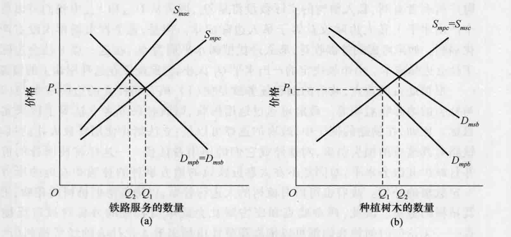
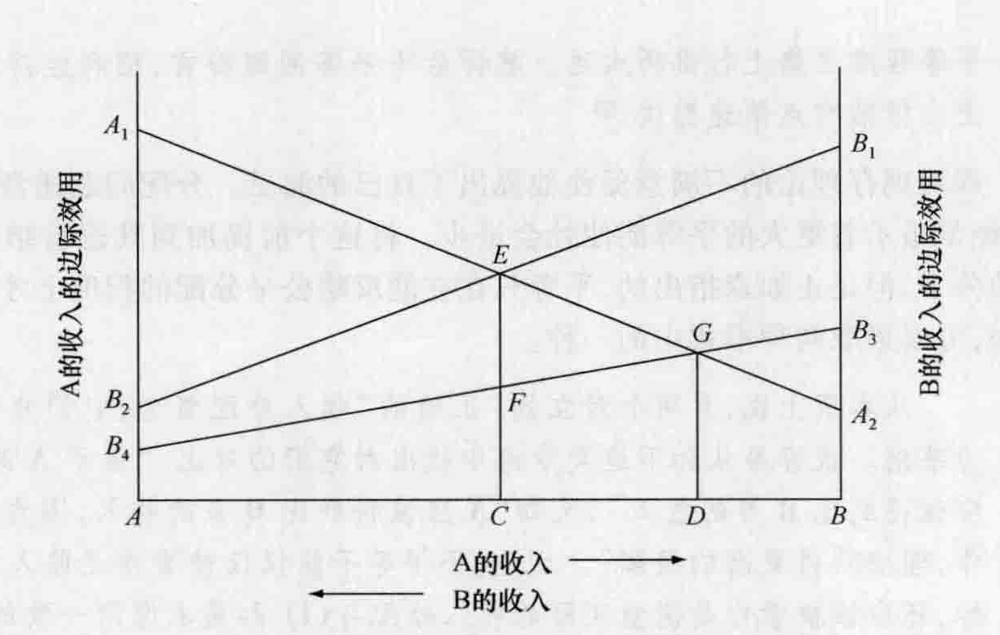

# 第 20 章 福利经济学

福利经济学是经济学的一个分支，主要研究社会福利最大化的有关问题。它并不是一个清晰的、统一的思想体系。经济学本身经常被定义为一门研究社会如何选择使用其有限资源以达到最大满意程度的学科，所以，几乎经济学的每个方面都包含了福利经济学的方面。但是，有几位对经济学作出过重要贡献的经济学家比其他人更关注以下两个方面或其中之一：（1）定义并且分析如何达到福利最大化；（2）确定妨碍福利最大化实现的因素并且对去除这些因素的方式提出建议，我们将这些经济学家称为福利经济学家。

本章将研究以下理论家的各种贡献：帕累托、庇古、冯·米塞斯、兰格、阿罗和布坎南。正如整个经济思想的时间序列表虚线所示，这些人中有一部分是新古典学派的支持者而另外一些则是反对者。

我们将会发现福利经济学家强调一些不同的主题，比如，达到最大化福利的原则、外部成本与外部收益问题、收入不平等、在社会主义制度下达到最大化福利的潜力、与多数人投票相关的各种难题以及公共部门中的决策。

## 20.1 维尔弗雷多·帕累托

福利经济学可以追溯到斯密和边沁的古典经济学思想。几位后来的经济学家也谈及福利问题，其中包括马歇尔，他考察了在成本递增行业和成本递减行业中税收与财政补贴对福利的影响。但是，经济思想史学家将维尔弗雷多·帕累托（Vilfredo Pareto，1848—1923）看作是“新”福利经济学的开拓者，而新福利经济学植根于瓦尔拉斯的一般均衡原理。帕累托出生于巴黎，父母是意大利人，他在意大利的都灵大学学习，后来接受了瑞士洛桑大学的经济学教授职位。在那里他延续并扩展了由他的直接前任瓦尔拉斯建立起来的数学传统。帕累托在出版于 1906 年的《政治经济学手册》（*Manual of Political Economy*）中提出了他的主要思想。

前面我们已经提到帕累托在改进埃奇沃思无差异曲线概念中的重要作用。埃奇沃思假设存在可以度量的效用并且从中推出了无差异曲线。帕累托希望通过构建表示不同满意程度的无差异图来避免在个人之间进行效用的度量与比较这一棘手的问题。因此，帕累托的无差异曲线和他对最优化条件的关注就成了我们在第 18 章所讨论的现代无差异曲线分析的直接前身。

### 20.1.1 帕累托最优

与即将讨论的这个题目特别相关的是，帕累托改进了瓦尔拉斯的一般均衡分析并提出了我们今天称之为帕累托最优的条件，或者说最大化福利的条件。后来，其他的经济学家建立了更加严格的数学证明，即完全竞争的产品市场与要素市场能实现帕累托最优。

帕累托认为，当不存在能够使某人的处境变得更好同时不使其他人的处境变得更坏的任何变化时，就实现了福利最大，在这种状态下，社会不能以帮助某人而又不伤害其他人的方式来重新安排资源配置或产品与服务的分配。因此，帕累托最优意味着：（1）产品在消费者之间的最优分配；（2）资源的最优技术配置；（3）最优的产出数量。我们可以通过假设存在一个包括两个消费者（史密斯与格林）、两种产品（汉堡包与马铃薯）和两种资源（劳动力与资本）的简单经济来证明这些条件。在这个简单经济中的帕累托最优条件也是存在于拥有无数消费者、产品和资源的现实经济中的条件。

**产品的最优分配。** 产品最优分配——即能够最大化消费者福利的分配——发生于当史密斯和格林每人都在两种产品之间拥有完全相同的边际替代率时。用公式表示即为：

$$
MRS_{hp}S = MRS_{hp}G \quad (20\text{-}1)
$$

其中，$MRS_{hp}S$ 和 $MRS_{hp}G$ 分别是史密斯与格林的汉堡包对马铃薯的边际替代率。回想一下第 18 章对无差异曲线的讨论，我们可知，边际替代率是消费者为了获得额外一单位的另一种产品所愿意放弃的一种产品的最大数量，它是无差异曲线上某一特定点的斜率的绝对值。假设对于史密斯和格林而言，两种产品的边际替代率不同，或者具体而言，史密斯的边际替代率为 5，格林的边际替代率为 2。这意味着史密斯愿意放弃 5 单位马铃薯以换取 1 单位汉堡包（或愿意放弃 1/5 单位汉堡包以换取 1 单位马铃薯），而格林仅愿意放弃 2 单位马铃薯以换取 1 单位汉堡包（或愿意放弃 1/2 单位汉堡包以换取 1 单位马铃薯）。因此，在边际上，相对格林而言，史密斯认为汉堡包的价值较高而认为马铃薯的价值较低。因此，存在帕累托改进的可能。史密斯可以与格林交换一些马铃薯——格林认为马铃薯的价值较高——作为回报史密斯可以得到一些汉堡包，而史密斯认为汉堡包的价值较高。因为交换使双方的处境都变得更好而没有使任何一方变坏，因此这个两人经济的总福利就会上升。

随着史密斯得到的汉堡包越来越多、格林得到的马铃薯越来越多，史密斯的边际替代率将会下降而格林的边际替代率将会上升。当边际替代率相等时，交换就会停止，此时不再可能存在一个交换能使至少交换一方的处境变好而不使另一方处境变坏。因此，当消费者的边际替代率相等时，产品在消费者之间的帕累托最优分配就会出现。①

**资源的最优技术配置。** 在两种产品、两种资源的例子中，在生产汉堡包和马铃薯的过程中，当劳动 ($l$) 和资本 ($k$) 的边际技术替代率相等时，就会出现生产性资源的最优配置。劳动对资本的边际技术替代率 ($MRTS_{lk}$) 是在产出水平不变的条件下，一单位劳动所能替代的资本的最大单位数。② 帕累托最优的第二个条件用公式表示如下：

$$
MRTS_{lk}H = MRTS_{lk}P \quad (20\text{-}2)
$$

其中，$MRTS_{lk}H$ 和 $MRTS_{lk}P$ 是在生产汉堡包和马铃薯的过程中劳动对资本的边际技术替代率。

如果在这两种用途上边际技术替代率不同，那么帕累托改进就是可能的。比如，假设生产汉堡包的边际技术替代率是 2，而生产马铃薯的边际技术替代率是 3。这意味着为了保持汉堡包的特定产出水平，我们只需要用 2 单位资本来替代 1 单位劳动，而为了保持马铃薯产出水平不变，我们需要用 3 单位资本替代 1 单位劳动。因此，在边际上，相对于马铃薯而言，资本在生产汉堡包方面更有效率；或者从相反的角度看，在边际上，相对于汉堡而言，劳动在生产马铃薯时具有更大的生产力。在汉堡包生产中使用更多资本可以释放出一些劳动力以生产马铃薯，从而，在相同投入水平下，能达到一个更高的总产出水平。资源增加的地方所增加的产出将会高于资源减少的地方所减少的产出。因为没有谁的处境变得更坏却有人处境变得更好，所以这是一个帕累托改进。

对要素投入的重新安排将会在某一点上停止，因为收益递减规律将会使增加的资源的边际产出下降、减少的资源的边际产出上升。一旦生产这两种产品的边际技术替代率相等，就不存在能够帮助某人而又不伤害其他人的进一步的资源配置。

**最优的产出数量。** 如果生产与分配符合帕累托最优条件，那么当汉堡包对马铃薯的边际替代率——两个消费者中每一个都愿意放弃马铃薯以换取汉堡包的比率——等于马铃薯对汉堡包的边际转换率 ($MRT$) 时，就会达到最优产出水平。这是将马铃薯转换为汉堡包从技术上说可能的比率，用公式来表示为：

$$
MRS_{hp} = MRT_{hp} \quad (20\text{-}3)
$$

比如，假设边际替代率与边际转换率分别为 4 与 3，这意味着两个消费者为了得到汉堡包而愿意放弃的马铃薯的比率（放弃 4 单位而得到 1 单位）大于为得到 1 单位汉堡包从技术上必须放弃的马铃薯的比率（放弃 3 单位而得到 1 单位）。结果是，通过增加汉堡包的产出、减少马铃薯的产出将使每个消费者的福利都有所增加。在边际上，消费者的所得将大于社会的机会成本。只有当一种产品对另一种产品的边际替代率等于边际转换率时，才不存在增加一个人或更多人的福利而不减少其他人福利的机会。

### 20.1.2 评价

帕累托的福利理论是对经济学的一个重要贡献。在帮助经济学家更好地理解经济效率的条件和经济效率的福利意义方面，帕累托做了很多工作。但是，帕累托标准的核心“是否一个变化使某些人的处境变得更好而没有使任何人的处境变坏”并不总是适合于评价公共政策。

在对帕累托标准的批评中，有四个看起来特别恰当。第一，一些经济学家认为它没有强调分配公平，或者说是社会中公平的收入分配这个重要问题。相反，它仅仅确立了任意现存分配的效率条件。

第二，与之密切相关的是，许多公共政策提高了国家的产出和总体福利，它作为政策的副产品同时也对收入进行了再分配。比如，尽管自由贸易政策通常会提高一个国家的总产出和福利，但它同时也可能伤害由于进口增加而失去工作的某些特定的个人。严格的帕累托标准将会阻碍这样的政策实施。与此相类似，在大多数情形下，熟练工人移民会提高移入国的总产出。但是，劳动供给的增加会使熟练劳动力市场上本国工人的工资下降。移民应该被允许吗？在这两个例子中，对社会而言都存在一个净收益，理论上受益者能充分补偿损失者，从而将这种情形转变为一种与帕累托标准一致的情形。但是，即使没有作出这些补偿性支付，政府是否就应该对诸如自由贸易和开放移民这些政策进行立法呢？③

第三，帕累托标准是建立在效率的静态观点之上的。短期偏离帕累托最优会令人信服地提高长期或动态效率。比如，一些现代经济学家认为反托拉斯法律的一些条款过于关注静态效率，从而可能会妨碍一些能提高国家长期产出和福利的私人行动，如联合开发新技术等。

第四，帕累托标准故意排除在外的道德判断在政策的形成过程中通常是合法的、主导性的因素。也许是帕累托最优的一些私人交易——如卖淫、贩卖儿童、购买毒品——可能同时会与社会的道德价值相冲突，这些道德价值在公共政策的辩论中通常会使经济效率相形见绌。

## 20.2 阿瑟·塞西尔·庇古

阿瑟·塞西尔·庇古（Arthur Cecil Pigou，1877—1959）在 1908 年接替了马歇尔在剑桥大学的政治经济学系主任职位，并且一直保持这一职位到 1943 年退休为止。在他的前任马歇尔去世后，他是最著名的新古典经济学家。和马歇尔一样，他表达了对穷人的强烈的人道主义关怀，并且希望经济学能够引导社会进步。以其谨慎的方式，庇古对于政府在改进社会某些不合宜方面所发挥的作用这一点上比马歇尔走得更远。

在其写作于 1920 年的《福利经济学》（*The Economics of Welfare*）一书中，庇古希望为政府实施提高福利的各种措施提供理论基础。作为一名经济学家，他非常关注经济福利，并定义经济福利为“能够与货币这个测量尺度发生直接或间接关系的那部分社会福利”④。帕累托将他的理论置于经济的一般均衡之下，而庇古与帕累托不同，他继续了斯密、边沁和马歇尔的主要依赖于局部均衡分析的“旧福利”传统。他对福利经济学的贡献包括对收入再分配、私人成本与社会成本间差别的考察等。我们将要考察另外两个主题是他对价格歧视和我们今天称之为“庇古效应”的讨论。

### 20.2.1 收入再分配

以杰文斯和马歇尔的货币的边际效用随着货币量的增加而不断下降的原理为基础，庇古断言在特定条件下较大的收入公平能够提高经济福利。庇古认为对那些在相同环境下长大的背景相同的人，可以对个人之间的满意程度进行合理的比较。从这个层面上说，与那些过分注意避免价值判断并且宣称对不同人之间的满意程度进行比较是不可能的、所谓的“完全科学性”的经济学家相比，庇古更是改革者。他写道：

> 由于它能够以较不强烈的需要为代价来满足更加强烈的需要，因此从一个相对富有的人向一性情相同的、相对贫穷的人所进行的收入转移，肯定会增加满意程度的总和。因此，从古老的“效用递减规律”可确定地得出这样的命题：任何能够提高穷人手中实际收入的绝对份额的行动，只要从任何角度看都不会引起国民收入规模的缩减，通常就会提高经济福利。⑤

### 20.2.2 私人成本与社会成本、私人收益与社会收益之间的差别

庇古与正统经济理论最主要的偏离在于他对社会边际成本与私人边际成本、社会边际收益与私人边际收益之间差别的关注。关注这种差别的思想并不源于庇古，亨利·西奇威克（Henry Sidgwick，1838—1900）在 1883 年的作品中就以一种不太简明的方式讨论了这个主题。⑥ 一件产品或服务的私人边际成本是生产者生产额外一单位产品或服务所产生的花费；社会边际成本则是生产那额外一单位产品给社会带来的花费或损害。与此相类似，一件产品的私人边际收益是用它提供给买者的额外的满意程度来度量的，社会边际收益是社会从生产额外一单位的产品中得到的额外的满意程度。

这些区分是非常重要的，都因为生产和消费行为可能会强加给生产者和消费者之外的人以成本或收益。这些外部成本和外部收益，或称外部性，会溢出到其他当事人身上，因此有时被称为“溢出效应”。比如，庇古说，铁路机车的火花可能会对周围的树木或农作物造成损害，而其所有者并没有因为损害而受到补偿。因此，对于铁路来说，社会成本（内部成本+外部成本）大于私人成本（内部成本）；净私人边际产品超过了社会净产品。与此相类似，一个企业家在一个居民区建造一座工厂，破坏了别人财产的大部分价值。增加酒精饮料的销售对于酿酒厂来说是有利可图的，但当因此而需要更多的警察和监狱时就产生了外部成本。

庇古说，同时存在一些相反的情形，在这些情形下，私人行动的一些利益会溢出成为社会利益，但是产生这种利益的人并没有得到补偿。这样，社会边际净产品超过了私人边际净产品。比如，某行业中一个企业的扩张可能会在整个行业中产生外部经济，这将会减少其他企业的生产成本。私人投资于种植树木会使周围的财产所有者获益；防止工厂的烟囱排放烟雾对整个社会的好处远远大于它对工厂所有者的好处；尽管专利法的目标是使私人边际净产品与社会边际净产品更加接近，但科学研究对社会通常比对研究者和发明者具有更大的价值。

庇古从他的分析中得出了一个重要的福利含义：并不是所有的竞争性市场都能产生使社会总福利最大化的产出水平。图 20-1 证明了这一事实，它代表了庇古的思想。

*图 20-1 庇古对外部性的分析*

> 图(a)：外部成本（铁路的火花）的存在意味着社会边际成本大于私人边际成本。由市场决定的产出数量 ($Q_1$) 太大以致无法最大化社会福利；大于 $Q_2$ 的产出的社会边际成本大于其社会边际收益。图(b)：外部收益（对周围林地的自然播种）的存在导致社会边际收益大于私人边际收益。因此，均衡产出 ($Q_1$) 小于最大化社会福利所需要的产出数量；小于 $Q_2$ 的所有单位的产出，其社会边际收益都大于社会边际成本。

图 20-1(a) 表示存在负的溢出效应或外部性的一种情形。需求曲线 $D_{mpb} = D_{msb}$ 既反映了铁路服务对消费者的边际收益（内部收益），也反映了对社会的边际收益（不存在外部收益）。供给曲线 $S_{mpc}$ 表示提供这种服务的私人或内部边际成本。在这个市场上如果不存在负的外部性，即对于铁路和它们的使用者来说，如果全部成本都是内部的，铁路服务的均衡价格将会是 $P_1$，均衡数量将会是 $Q_1$。这个服务水平将会最大化铁路及其使用者的福利，并且因为没有人受到影响，它同时也会最大化社会福利。

继续使用庇古的例子，假设铁路将外部成本转移给了第三方。因此，在图 20-1(a) 中我们可以看到 $S_{msc}$ 供给曲线位于反映私人边际成本的曲线 ($S_{mpc}$) 之上。在每一个服务水平上，铁路不仅产生了诸如劳动与燃料等私人成本，同时还将外部成本转移给了林地与耕地的所有者。任何服务或产出水平的边际社会成本都被包括在 $S_{msc}$ 之中，它包括边际内部成本加上边际外部成本。对私人成本与私人收益作出反应的竞争性市场将会产生价格 $P_1$，在这个价格下，服务的供给与需求数量将为 $Q_1$。但是，从福利的角度来看，这并不是最优数量，最优数量为 $Q_2$，在 $Q_2$ 时社会边际成本等于社会边际收益。在 $Q_1$ 上，由 $S_{msc}$ 表示的社会边际成本高于由 $D_{msb}$ 表示的社会边际收益。这对于大于 $Q_2$ 的所有铁路服务来说都是正确的，即生产每一单位的服务对社会的成本大于其增加的收益。结论：负的外部性导致发生负的外部性的那些市场产生对资源的过度配置（产出太多）。

在其他市场上，社会边际收益大于私人边际收益，其福利结果如图 20-1(b) 所示。我们再次使用庇古的一个例子，假设 $D_{mpb}$ 代表一个土地所有者从植树中所得到的私人边际收益，而 $D_{msb}$ 代表社会边际收益。假设通过自然播种而产生的新的植树对周围的财产所有者有利，私人植树的实际数量将是 $Q_1$，因为从 $D_{mpb}$ 和 $S_{mpc}$ 中我们可以看出在这个产出水平上私人边际收益等于私人边际成本。但是，竞争性市场再次没有产生最大化福利。如果考虑到外部收益，那么最优植树水平应为 $Q_2$，在这一点上社会边际收益等于社会边际成本。由市场决定的产出水平 $Q_1$ 太小，因此配置在这种用途上的资源太少。

根据庇古的观点，政府的福利任务就是使 (1) 私人和社会的边际成本与 (2) 私人与社会的边际收益相等。政府可通过运用税收、财政补贴或者立法等手段来实现这一目标。比如，在铁路的例子中，政府的选择可以是：立法禁止使用释放火花的机车，规定铁路对其造成的损失负责，对铁路或它们的使用者征税——这样将使服务的价格上升并且减少其服务水平，对同意不在太靠近铁轨的地方耕种的林地和农地的所有者给予一定数额的补偿。政府也可以对植树的人进行补贴，以降低他们植树的花费，进而增加其植树的数量。因此，西奇威克和庇古对社会成本与收益的分析对被广泛接受的观点——无论何时何地我们都可以依靠竞争性市场来最大化社会的经济福利（产生帕累托最优）——提出了挑战。庇古认为，在经济中政府应该发挥的作用比自由放任的倡导者设想的更大。

> **历史借鉴 20-1**
>
> **庇古与科斯论外部性**
>
> 1959 年，还在弗吉尼亚大学的罗纳德·科斯（历史借鉴 15-1）发表了一篇关于美国联邦通讯委员会的晦涩的论文，对庇古的外部性分析提出了挑战。发表在《法和经济学杂志》（*Journal of Law and Economics*）的这篇论文引起了其编辑阿伦·迪雷克托（Aaron Director）和其他著名的芝加哥学派经济学家的兴趣，他们邀请科斯去芝加哥，这样他可以更加详细地解说他的观点。这些经济学家包括马丁·贝利（Martin Bailey）、米尔顿·弗里德曼（Milton Friedman）、阿诺德·哈伯格（Arnold Harberger）、格雷格·刘易斯（Gregg Lewis）和乔治·斯蒂格勒，他们在一天晚上在迪雷克托的家中与科斯会面。尽管这篇论文引起了他们的兴趣，但是他们仍然坚持认为庇古是正确的而科斯是错误的。但是，经过科斯的说明和大家的讨论，他们都改变了想法。当这些经济学家离开迪雷克托家时，许多人都相信他们见证了经济理论上的一个重大进步。*一年之后，科斯发表了《社会成本问题》一文，正是这篇论文使他获得了 1991 年的诺贝尔经济学奖。
>
> 在这篇论文中，科斯阐明了外部性是相互的：
>
> ［庇古的］方法倾向于使必须作出的选择的本质模糊不清。问题通常被认为是 A 对 B 造成了损害，从而必须决定我们应该如何来限制 A？但这是错误的。我们正在处理的是一个具有相互性的问题，即为了避免对 B 的损害可能又会造成对 A 的损害，所以必须决定的真正的问题是：应该允许 A 损害 B 还是允许 B 损害 A？问题在于要避免较严重的损害。**
>
> 科斯接下来证明了后来被斯蒂格勒命名为“科斯定理”的理论。他解释道，当双方中的任意一方拥有受到另一方行动负面影响的产权时，双方就会有通过协商达成一个可接受的结果的激励。科斯用一头牛从一个牧场溜到邻居的土地上并且破坏了农作物的例子来说明上述观点。
>
> 如果产权被授予农民（将责任加诸养牛者），那么对于养牛者来说，将会存在这样一种激励：给农民提供一定的支付，将一部分邻近的土地从农业生产中划分出来。这个农民为什么会有激励与牧场主进行相应的谈判呢？因为从农民的角度看，从牧场主那儿得到的先前的支付相当于种植农作物的一种成本。因此，这个农民想知道他是否能够从牧场主那儿得到一个大于邻近土地的农业产出损失的支付。
>
> 如果产权被授予牧场主（牛可以在任何地方漫步），那么这个农民就会有这样一种激励：向这个养牛者提供一定的支付来减少其牛群的规模。现在这个牧场主就有一种新的机会成本，即如果他扩大了其饲养的牛群的规模，他将损失来自这个农民的潜在的支付。在产权的任何一种配置中，协商解决都是可能的并且不需要政府干预。
>
> 科斯定理的结论是，在交易成本可以忽略的情况下，产权的清晰配置可以消除对庇古税和财政补贴的需求。当然，问题是许多现实世界的外部性比如空气和水污染会影响许多人，从而使协商变得非常困难。比如，全球变暖问题涉及不同国家的数千家企业和数百万人。在这些情形中，讨价还价的成本是非常大的而政府干预可能被证明是最优的。***
>
> \* Steven N. S. Cheung, "Ronald Coase," in *The New Palgrave: A Dictionary of Economics*, 4 vols. (London: Macmillan Press, 1987), 1, 455—457.
> ** Ronald H. Coase, "The Problem of Social Cost," *Journal of Law and Economics* 3 (October 1960), 1—44.
> *** 科斯对经济学的总体贡献的评价可以参见：Steven G. Medema, ed., *The Legacy of Ronald Coase in Economic Analysis*, 2 vols. (Brookfield, VT: Edward Elgar, 1995).

### 20.2.3 其他贡献

庇古所提出的其他几个理论也具有长久性。他对于经济中不断增加储蓄的意愿的强调——后来在凯恩斯时代不再流行——得到了 20 世纪 80 年代和 90 年代许多经济学家和政府政策制定者的赞同。庇古认为人们更喜欢现在的满意程度而不是相同数量的未来的满意程度，因为人类的远见能力是有缺陷的，因此在我们看来将来的快乐是规模递减的。这种偏见引起了影响深远的经济失调，因为人们以某种程度上的非理性偏好为基础在现在、不远的将来和遥远的将来之间分配他们的资源。结果是，用于遥远将来的努力因那些用于不远将来的努力而被牺牲，而为了提高现在的消费那些不远将来的努力又被放弃。新资本的创造受到阻碍，人们被鼓励用光现存的资本已经到了这样一种程度，即为了较小的现在的利益可以牺牲较大的将来的利益。因为将来的满意程度被低估，所以自然资源被非常迅速和浪费性地消费掉了。

庇古认为，由于政府干预强化了人们将资源的绝大部分用于现在、极少部分用于将来的趋势，因此经济福利是递减的。因此，如果政府希望最大化经济福利，就应该避免对储蓄课征任何税，包括财产税、遗产税和累进所得税。对消费课征较重的税是更加可取的，因为这样会鼓励储蓄，但这些税同时也会不相称地伤害到低收入人群。

庇古的通过增加国民储蓄来促进经济增长的愿望是以经济会自动地趋向于充分就业的正统观点为基础的。从这一点出发，他最先提出了这样的观点，即伴随着经济低迷的总价格水平的下降，人们资产的实际价值将会上升。因此，人们将决定减少储蓄以增加消费，从而会增加经济中的需求并将经济重新推向充分就业。经济学家已经将这个观点整合到了几个现代经济学模型中。比如，宏观经济学教科书的作者通常使用“庇古效应”或实际余额效应来解释为什么总需求曲线向右下方倾斜（价格水平-实际产出模型）。

值得注意的庇古的最后一个贡献是他对价格歧视的讨论，正是他将价格歧视分为三类：一级价格歧视、二级价格歧视和三级价格歧视。当垄断者向每个消费者索要他恰好愿意支付且不会放下这种产品而走开的价格时，就会发生一级价格歧视。因此，垄断者将以收入的形式拿走所有的消费者剩余。二级价格歧视是一级价格歧视的一种更加粗糙的形式，卖者对最初一部分产品中的每一单位索要一个价格，然后对接下来的一部分产品索要较低的价格。在 20 世纪 70 年代和 80 年代费率改革以前，电器通常使用这种类型的数量折扣。三级价格歧视涉及将消费者分为不同的阶层并且以每个团体的需求弹性为基础索要不同的价格。一个可能的例子就是向学生和教授收取的商业报纸和杂志的价格比普通大众要低。

因此，庇古对价格歧视的分析拓展了由古诺和其他经济学家提出的垄断定价理论。我们在前边已经讨论过的琼·罗宾逊进一步在边际收入与成本的方面使庇古的分析定型。

## 20.3 路德维希·冯·米塞斯

福利经济学的几个思想是在关于社会主义制度下帕累托意义或更广泛意义上的经济福利能否被最大化的长期争论中出现的，在这个争论中一个重要的早期人物就是路德维希·冯·米塞斯（Ludwig von Mises，1881—1973）。

### 20.3.1 生平

路德维希·冯·米塞斯是经济思想中奥地利学派的重要成员。他在维也纳大学获得了他的博士学位，在那里他与熊彼特（第 23 章）一起在冯·维塞尔和冯·庞巴维克的指导下学习。1912 年他的《货币与信贷理论》（*The Theory of Money and Credit*）一书的出版为他赢得了维也纳大学“特聘教授”（professor extraordinary）这样一个不领薪水的职位。1940 年他移民美国，并最终成为纽约大学的一位访问教授。他的充满感情的风格并不为支持经济学学科的非意识形态的、科学方法的许多经济学家所喜欢，但是他的同事们称他为美国经济学会的“杰出成员”。

### 20.3.2 社会主义国家的经济核算

路德维希·冯·米塞斯在他 1920 年的论文《社会主义国家的经济核算》中引发了对社会主义制度福利的争论。后来在《社会主义》（*Socialism*，第二版，1922）和《人类行为的经济学分析》（*Human Action: A Treatise on Economics*, 1949）中他进一步扩展了反对社会主义、支持自由放任的观点。米塞斯认为，希望最大化消费者福利的社会主义计划者必须进行与资本主义制度下将资源引导于最高价值的相同的经济核算。如果没有资源的私人所有制、自由市场和企业家，进行这些核算是不可能的。米塞斯指出，与某些社会主义者的期望相反，在社会主义制度下，只要消费品是私人所有的，那么存在消费品市场与价格将是不可避免的。而资本品的问题在于，在市场经济中资本品的相对价格反映相对的稀缺性和生产价值。资本的价格会随着消费者偏好、新技术、企业家预期以及诸如此类的变化而迅速发生变化。但是在社会主义制度下，所有的资本都为国家所有，不存在这种价格机制。因此，计划者不能准确地评估资本的相对稀缺性和生产价值。“哪里没有自由市场，哪里就没有价格机制；没有价格机制，也就没有经济核算。”⑦

米塞斯认为，变化是一个经济体系所必须应对的最主要的现实：“在现实世界中不存在静止状态，因为经济活动发生的条件是永远变化的并且超出人类的控制能力。”⑧ 因此，经济核算问题是一个动态经济问题，而不是一个静态经济问题。除了使成本最小化和决定对产品的合理配置外，经济效率还涉及“解散、扩展、转变和限制现有的企业并且设立新企业”的问题。⑨

经济中会不断产生新的信息，尽管这种信息是不完美的并且受变化着的解释的影响。按照米塞斯的观点，企业家精神是实现动态经济福利的一个最主要的方面。企业家试图预测未来，那些拥有更强的预测能力的企业家将能获得巨大的利润，而他们过去的成功使他们为了进一步的预测行动可以支配更多的资源。市场“倾向于将对经济事务的管理委托给那些成功地满足了消费者最紧迫需求的企业家”⑩。这些企业家的行动创造了价格，更加现实的静态核算——比如，成本最小化——正是以这些价格为基础而构建的。

利润和损失具有两个在社会主义制度下无法被复制的重要功能：（1）选择出那些能够最好地满足需求的企业家；（2）为企业家提供激励以避免草率、鲁莽、非理性的乐观决策。企业家之间的竞争可以保证他们的行动所带来的利益能够为消费者、工人和那些拥有生产要素的人所广泛分享。

米塞斯认为，社会主义无法复制资本配置的功能和在动态经济中有效引导资源所必需的企业家精神。对于那些认为一个社会主义计划委员会能够被指示采取类似于在竞争性市场体系下才会发生的行动的人，米塞斯作出了如下的回答：

> 所有此类建议中暗含的最主要的错误是他们站在一个低级职员的角度来看待经济问题，而他们的知识视野从未超过他们从属性任务的范围。他们将工业生产、资本配置在各个部门以及生产总量中的结构看做是刚性的，并没有将改变这个结构使之适应各种条件变化的必要性考虑在内……
>
> 资本主义制度不是一个经理的制度，它是一个企业家的制度……没有人曾经建议社会主义国家可以邀请组织者和投机者继续他们的投机行为，然后将他们的利润转移到其共同金库中……人们不能进行投机和投资。投机者和投资者会暴露他们自己的财富、自己的命运，这个事实促使他们对消费者负责。⑪

## 20.4 奥斯卡·兰格

第二位对关于社会主义的争论作出重要贡献的人物——福利经济学更广阔历史中一个重要角色——是奥斯卡·兰格（Oscar Lange，1904—1965）。他出生于波兰，曾在克拉科夫大学学习和任教。他得到了一份洛克菲勒奖学金，这使得他能够访问几所美国的大学，而且他在 1936 年成为密歇根大学的讲师，1943 年成为芝加哥大学的教授。1945 年他返回了波兰，并且立即被任命为波兰驻联合国大使，他在这一职位上工作了四年。从 1955 年起，他担任华沙大学的教授，直到 1965 年去世。

### 20.4.1 社会主义的经济理论

在发表于 1937 年的一篇题为《论社会主义经济理论》的论文中，兰格提出了一个“市场社会主义”的模型。兰格认为，在一系列固定规则的管理下，这种形式的社会主义可以实现经济效率和最大化社会福利。市场社会主义具有以下特点：（1）消费品的私人所有制和对于可得到产品的自由消费选择；（2）自由选择职业；（3）生产手段的国家所有制。存在产品、服务和劳动的市场和市场价格，但是不存在资本和中间产品（比如，用来制造最终产品的零部件）的市场和市场价格。然而，兰格认为价格可以采取一种非市场价格的形式，它可以是一个影子价格或两种物品之间交换条件的指数。中央计划委员会通过试错过程可以制定资本品的价格，并通过调整这些价格来消除短缺和剩余。这个委员会除了给所有的工人支付一份市场工资外，还支付一份由资本品和自然资源的总产出所决定的一定份额的社会红利。通过这种对社会红利份额的控制，中央计划委员会能够缩小作为资本主义经济特征的巨大的收入差距。

中央计划委员会指示国有企业的经理们按照所有的价格都是固定的方式行动并且遵循两个规则。第一个规则是将企业中各种资源结合起来，使任意产出水平的平均生产成本处于最低点。经理们通过保证资源间的边际技术替代率是相等的来达到这一点（回想一下前边对帕累托最优的讨论）。第二个规则是：

> 产出规模是通过阐明产出必须是固定的因而边际成本必须等于产品价格来决定的……［这个规则］起到了竞争机制通过允许一个企业自由进入或退出一个产业所起到的作用，即它决定这个产业的产出。⑫

兰格认为，只要会计工作是在假设价格固定的情况下进行的，即好像它们独立于所采取的决策，那么坚持这些规则将意味着，从一个均衡的观点来看，错误设定的价格将会造成相关商品的短缺或过剩。因此，通过试错，计划者能够将价格调整到均衡水平上。兰格认为，这个试错的过程与资本主义制度下发生的试错非常相似，但是在社会主义制度下它可以更好地发挥作用，因为中央计划者能够得到比资本主义个人更大范围的关于短缺与过剩的信息。⑬

### 20.4.2 对兰格理论的反击

几十年来经济思想史学家的传统观点认为奥斯卡·兰格“给予了反社会主义的批评家致命一击”⑭。就兰格确实证明了在社会主义制度下帕累托所设想的那种类型的静态经济效率在理论上是可能的这一点来说，这种说法是准确的。但是现在看来宣称他已经取得了对社会主义的争论的胜利具有某种讽刺意味。由诺贝尔经济学奖获得者弗里德里希·哈耶克（1899—1992）和现代“新奥地利学派”所领导的反击在学术圈中日益被接受。他们的观点已经因主要的中央计划社会主义国家的解体和信息经济学的发展而得到支持，这些反击主要分为两种类型。

第一，在一个大的经济体中，通过计划来达到经济效率从理论上来说是可行的，但是在实践中要实现这一点却完全是另一回事。兰格所提倡的多样化的中央计划——让计划委员会在解决瓦尔拉斯方程中充当喊价者——需要大量的信息。正如萨缪尔森和诺德豪斯所指出的：“我们并没有获得解决这样一个巨大的一般均衡所需要的最小部分的信息。”⑮

第二，兰格的方法没有考虑到需要给予经济参与者有效配置资源和寻求增加产出机会的足够激励。奥地利学派所设想的那种类型的动态效率需要企业家的作用，通过企业家的作用信息会被不断地、迅速地发现和应用。在竞争经济中，利润动机为企业家（他们可能是单个的个人也可能是企业中个人的团体）提供了这种激励。这些批评者认为，社会主义经济缺乏这种激励，并且这种激励无法被整合进社会主义制度。

## 20.5 肯尼思·阿罗

经济思想史上有相当数量的思想家。我们已经看到他们其中一些是道德理论家，一些是政治和社会活动家，还有一些是现存理论的发展者和改进者。但是，还有一些人漫步在经济理论和社会哲学之间的领域中，肯尼思·阿罗（Kenneth Arrow, 1921—2017）便是这样一位理论家。阿罗在纽约城市学院完成了他的本科学习，在哥伦比亚大学完成了研究生学业。拿到学位后，他接受了斯坦福大学的一个职位，在那里他使该校的经济系获得了世界范围的声誉。

阿罗不仅在符号逻辑、数学和统计学方面表现出了少有的天分，同时他还对能够应用这些天分的新领域具有一种洞察力。他的学位论文《社会选择与个人价值》（*Social Choice and Individual Values*）成为福利经济学的经典文献，在这部著名的作品中他评估了各种社会福利标准并且提出了以前许多观点中存在的矛盾。

在斯坦福大学工作期间，阿罗继续进行对福利经济学信条的探究。他发表于期刊的许多论文提出了如下问题：我们如何知道一个政策选择的结果是否使社会的处境更好了？具有个人偏好的社会成员的集体选择的逻辑是什么？完美的民主是可能的吗？如果不存在保持完美民主的可能方式，必须进行哪些调整？是否存在决定构成一个公平收入分配的若干规则？

我们特别感兴趣的是阿罗的不可能定理，或称“投票悖论”。为了通过民主投票来确定个人偏好和社会选择之间的关系，阿罗首先确定了如果要准确反映投票者的个人偏好，社会选择所必须满足的四个最低条件：（1）社会选择必须是可传递的，即它们必须是一致的，如果对 A 的偏好强于对 B 的偏好，对 B 的偏好强于对 C 的偏好，那么对 A 的偏好就不能强于对 C 的偏好；（2）集体决策不能是由社会内部或外部的任何人以独裁方式作出的；（3）社会选择不能向与个人选择相反的方向改变（换言之，社会以其他方式作出的选择绝对不能仅仅因为某人更加喜欢它而被抛弃）；（4）对于两种可供选择方案的社会偏好必须仅取决于对这两种可供选择方案的偏好而不能取决于人们对其他选择的意见。

接下来，阿罗仔细考察了多数人的投票方案，以确定民主决策是否能够在不违反上述任意一个条件的情况下在所有可供选择的方案中作出选择。经过认真的研究，他得到了一个令人吃惊的结论：并不存在同时既能尊重投票人的个人偏好，又能保证最大化福利并且与投票顺序无关的多数人投票方案。

阿罗举了这样一个例子，假设一个由三个投票人 (1, 2, 3) 组成的社会，这个社会有三个可供选择的政策，并要从中选择一个：裁减军备 (A)、发动冷战 (B) 和进行热战 (C)。按照福利理论，社会将会根据它的偏好排出这一种可供选择方案的顺序，并且可能的话，选出排在最前边的那个方案。这意味着投票人会表示他们对 A 的偏好强于对 B 的偏好，等等。那么，使用多数人规则就可以确定集体偏好的结果，即我们可以在 A 与 B 之间进行一次投票，然后在获胜者与 C 之间再进行一次投票。

表 20-1 列举了这三种政策 (A, B, C) 和三个投票人 (1, 2, 3) 的个人偏好。它告诉我们，投票人 1 对政策 A 的偏好强于对政策 B 的偏好，对政策 B 的偏好强于对政策 C 的偏好（暗含着对政策 A 的偏好强于对政策 C 的偏好）。投票人 2 的第一选择是政策 B，第二选择是政策 C，第三选择是政策 A。这意味着他对政策 B 的偏好强于对政策 C 的偏好，对政策 C 的偏好强于对政策 A 的偏好（暗含着对政策 B 的偏好强于对政策 A 的偏好）。投票人 3 对政策 C 的偏好强于对政策 A 的偏好，对政策 A 的偏好强于对政策 B 的偏好，因此，对政策 C 的偏好强于对政策 B 的偏好。

**表 20-1 阿罗的投票悖论**

| 政策选择 | 投票人 1 | 投票人 2 | 投票人 3 |
| :--- | :--- | :--- | :--- |
| A | 第一选择 | 第三选择 | 第二选择 |
| B | 第二选择 | 第一选择 | 第三选择 |
| C | 第三选择 | 第二选择 | 第一选择 |

我们接下来的任务就是确定由多数人投票决定的几个假设的成对选择的结果。让我们进行三次这种投票：A 对 B，B 对 C，A 对 C。在 A 与 B 之间的比赛中 A 将获胜，因为投票人 1 和投票人 3 对 A 的偏好都强于 B；投票结果是 2:1，有利于 A。我们在表 20-2 中表示出了这个结果。如果在政策 B 与 C 中进行投票，那么 B 将成为获胜者，因为投票人 1 和投票人 2 将会选择政策 B。那么我们可以得知这个社会的大多数人对 A 的偏好强于 C。我们的结论是正确的吗？为了保险起见，让我们在 A 与 C 之间进行一次投票。我们发现投票人的大多数（投票人 2 和 3）对 C 的偏好强于对 A 的偏好！我们已经违反了一致性要求或传递性要求：对 A 的偏好强于 B，对 B 的偏好强于 C，但是对 C 的偏好却强于 A。因此，这种多数人投票方案无法合理地对投票人的偏好进行排序。

**表 20-2 投票结果**

| 选举 | 获胜者 |
| :--- | :--- |
| A 对 B | A |
| B 对 C | B |
| A 对 C | C |

阿罗的分析表明我们需要以一种能够避免更加明显的缺陷的方式来设计我们的决策程序。完美的民主是不可能的，我们必须接受次优或第三优的选择。在一个拥有巨大的公共部门的经济中实现经济福利绝不是一件容易的事情。阿罗的主要贡献在于他对作为政治和经济思想体系基础的那些假设提出了挑战。自从 18 世纪以来，哲学家和政治理论家就一直在思索如何完善人类的制度，肯尼思·阿罗是他们的继承者。

## 20.6 詹姆斯·M. 布坎南

詹姆斯·M. 布坎南（James M. Buchanan, 1919—2013）是一位非传统的经济学家，他与肯尼思·阿罗一样极大地扩展了福利经济学的边界。要特别指出的是，布坎南是公共选择理论（政治经济学）和它的分支学科宪政经济学（规则的经济学）的创始人和主要贡献人之一。

布坎南在田纳西州贫困的农村中长大。大萧条中断了他在范德堡大学学习法律的梦想。于是，他进入了附近的中田纳西州立大学，这样他上学期间可以住在家里。大学四年里，他不分昼夜地挤牛奶以资助他完成学业。布坎南卑微的、农村的背景可能很好地解释了他众所周知的对于自命不凡和精英优越感的鄙视。

1945 年，布坎南在芝加哥大学开始了他研究生阶段的经济学学习。在那里他受到了弗兰克·奈特（Frank Knight, 1885—1972）的新古典主义的巨大影响，用布坎南自己的话来说，他被转变为“一个市场秩序的热情的倡导者”⑯。在芝加哥大学图书馆中浏览的时候，他发现了克努特·维克塞尔 1896 年关于税收的一篇晦涩的论文。在这篇论文中维克塞尔确立了这样的原理：只有公共选择的完全一致性，才能确保经由公共部门的行动来实现公正与效率。比如，维克塞尔认为，如果政府支出“能够提供创造的效用大于成本的前景，那么寻找到一种分配成本的方式，使各方都认为支出是有利的并且一致地赞同它，从理论上来说总是可能的，并且在实践中也大致如此”⑰。布坎南认为，是维克塞尔的思想激励他将标准的经济学假设和原理应用到对政治行为和政治过程的分析中。

布坎南在芝加哥大学完成了他的研究生学业之后，其学术追求很快将他带到了弗吉尼亚大学，在那里他与戈登·塔洛克于 1962 年共同写作了开创性的著作《同意的计算：立宪民主的逻辑基础》（*The Calculus of Consent: Logical Foundations of Constitutional Democracy*）一书。正如布坎南所说：

> 回想起来，对于我来说非常有趣的是在那本书的架构中没有任何一点“发现”的感觉，没有兴奋的时刻……塔洛克和我认为我们将相对简单的经济分析应用到了具有或多或少可预测结果的可供选择的政治决策规则的选择上。我们认识到，没人曾试图准确地进行我们现在正在进行的工作，但是这项工作从本质上来说是一件“把显而易见的东西”写出来的工作而并非开启一个全新的研究领域。
> 我们是错误的。公共选择凭借其自身的资格成为一个分支学科开始于 20 世纪 60 年代早期。它部分地起源于我们作品的介绍，部分地起源于我们后来导致公共选择学会诞生的有组织的、开创性的努力，部分地起源于其他作品。一旦政治决策规则和决策过程的整个复杂体系面向经济分析打开后，其应用范围就结束了。⑱

在 20 世纪 60 年代后期，布坎南离开了弗吉尼亚大学去了弗吉尼亚理工学院，在那里他帮助组织了公共选择研究中心，创办了《公共选择》（*Public Choice*）杂志。1983 年，布坎南和研究中心一起迁移到了他现在所在的乔治·梅森大学。由于布坎南的开创性著作及其随后对公共选择理论所作出的贡献，他被授予了 1986 年的诺贝尔经济学奖。

### 20.6.1 公共选择视角

布坎南认为，只有个人才知道什么能够给他们带来满足或者什么引起他们的不满，没有哪个外部的人或团体能替他们决定这一点。不同的个人拥有不同的品味、能力、期望、知识和视角，但他们有一个共同点：他们能以一种有目的的方式追求他们的个人利益，这种对自利的追求通过交换过程导致自发秩序的形成。个人寻求那些能够提高他们福利的交易，在约束条件下最大化他们的效用。

这个视角反映了古典经济学家和新古典经济学家关于经济人和市场交换的观点。但是，布坎南提出了一个以前的经济学家没有深入探究的基本问题：如果个人在市场中寻求他们的个人利益，那么为什么我们会期望他们在政府中或通过政府追求社会利益？对于布坎南来说，人类的本性就是人类的本性；人们在约束条件下最大化他们的效用，不管是在市场中、政府服务中还是在政治舞台上。

简而言之，布坎南将自利行为的简单假设和交换过程的思想拓展到了“处于政治或公共选择角色或地位的人们的行为，他们或者是作为投票过程的参与者，或者是作为代理人代表国家”⑲。

公共选择理论在主流经济学中扎根得非常缓慢，但是今天在几乎所有的公共财政和经济学原理的教科书中我们都可以找到它。正如以下几个例子所表明的，公共选择理论能对很多问题提供强有力的洞见。其一，公共选择帮助我们理解某些共产主义国家的解体，共产主义的领导者和社会主义的管理者提高了他们自己的利益，而不是理想化的社会的福利。其二，公共选择帮助我们理解在许多工业化国家中日益增加的公共债务。正如布坎南所说，被选举出来的政治家将会寻找任何理由来创造预算赤字。他们通过对于纳税人来说最小的短期成本来提供公共产品和服务以保持能够获得选举。赤字掩盖了公共产品的真实成本，因此使政治家在选民眼中看起来比实际上更好。其三，议会的代表会互投赞成票，即交换选票，因为这个过程能够给予他们获得个人所无法实现的结果的能力。其四，企业和劳动者团体会从事寻租行为（历史借鉴 8-2）。他们试图说服政府限制竞争，创造能够增加私人利润的特殊规则。最后，公共选择的观点解释了为什么官僚主义是政府所特有的并且倾向于引起更大的官僚主义。官僚们通过在他们手下拥有更多的职员来获得地位和薪水的增加，代理人也会不可避免地发现有越来越多的“问题”，要求更大的预算和更多的人员来解决。

### 20.6.2 对传统福利经济学的批判

布坎南对传统福利经济学试图对私人部门在现实世界中的结果和理论上的社会效用标准（比如帕累托最优）进行对比持批判态度。在一些福利计划中，政府官员被看作是能够确定社会福利函数——一个人效用偏好的加总——的人。政府是“好的”，它确定并且修正私人部门产生的“坏的产品”，因此提高了社会福利。

布坎南对这个推理过程的反对包括两个方面。其一，因为只有个人才能知道效用，所以没有人能够确定一个集体的或社会的福利函数。即使个人也不知道他们的效用偏好，直到由现实世界的选择呈现出来，且今天的选择会影响明天的效用函数和选择。所以，认为效用偏好或目标由社会确定是不合适的。福利经济学不应该致力于测量和评价效用结果，而应该致力于理解和改进政治和制度规则。

其二，即使社会福利函数是已知的，公共部门也不是一个实现社会福利函数的可信赖的机构。公共部门是由按照他们自己的最优利益行动的人们所组成的，将这些个人利益与模糊的社会理想结合起来是非常困难的。简而言之，就像存在“市场失灵”一样，也存在“政府失灵”。

仅仅因为市场是不完善的，并不必然假设政治过程会做得更好。相反，正如公共选择理论所提醒我们的，存在怀疑政治过程能实现帕累托最优能力的很好的理由。规范的相关比较是在两个并不完美的制度之间进行的。

### 20.6.3 宪政经济学

尽管布坎南是一个个人主义的支持者并对政府持怀疑态度，但他并不是一个无政府主义者（第 9 章）。如果没有政府来确立和实施各种规则，比如产权和契约，那么对个人利益的追求将会退化到霍布斯的战争状态，在这种状态下个人的生活是“孤独的、贫困的、野蛮的和短暂的”。但是布坎南指出，尽管那些追求个人利益的人认为国家需要约束个人行为，但他们同时也认为需要用制度性规则来约束国家。合乎理想的是，这些最终规则应该通过维克塞尔的一致同意得出来。这种一致同意也许是可能的，因为在制定制度的时候，没有人能够确切地知道这些制度性规则将来会如何直接影响他们。

> 看起来，为了使受自己的利益引导的个人去支持那些对所有的个人和所有的团体都普遍有利的制度性条款所必需的不确定性，在所讨论的任何制度阶段都可能是存在的。⑳

一致同意在确定最终的制度性规则方面也许是可能的、合宜的，但是对效率的考虑可能意味着制定的规则也许低于一致同意原则，比如采取多数投票规则。但是，多数规则并不是神圣不可侵犯的。通过一项措施的最优规则可能是大于或小于 50% 的某一百分点。低于 100% 会增加反对这项法律的人的成本，这种成本随着通过规则所必需的百分点的下降而上升。另一方面，获得一致同意本身是非常昂贵的，因为随着通过规则所需要的总投票比例的上升，讨价还价和决策成本迅速上升。最优投票规则是能够最小化以下两项之和的规则：（1）反对这一提议的那些人的成本；（2）与获得更多人的同意相联系的社会的讨价还价和决策成本。㉑

布坎南的公共选择视角和关于宪政经济学的著作使他得出了这样的结论，即政府的规模已经太大，政府需要新的制度性约束来保护最初对制度的一致同意。就这方面而言，他支持平衡预算修正案，这个法案要求联邦政府每年都要平衡它的税收收入和支出，并要求联邦储备委员会制定每年都以一个固定的百分比增加货币供给的货币规则。他同时还强烈支持对各州的宪法进行税收限制的修正。

这些政策观点为布坎南赢得了有争议的声誉，因为绝大多数的现代经济学家并不同意这些观点。布坎南和拥有类似思想的联系紧密的一些经济学家看来非常欢迎和喜欢这种争论。他们是其观点的坚定倡导者，也是多产的研究者和写作者。公共选择理论已经堂然地进入了主流经济学行列，布坎南和他的支持者是否会对经济学产生进一步的影响还需拭目以待。

## 20.7 阿马蒂亚·森

阿马蒂亚·森（Amartya Sen, 1933—）出生于印度森蒂尼盖登的大学校园，好像他是注定要从事学术研究的。他父亲是达卡大学的化学教授，祖父在泰戈尔创建的维斯瓦·巴拉蒂大学（Visva-Bharati）教授梵文和印度文化。在考虑了研究梵文、数学和物理学之后，森最终选择了“他所说的‘经济学的非同一般的魅力’”㉒。

森的大部分成就是他在三大洲的多所大学取得的。他从加尔各答大学和剑桥的三一学院获得了学士学位，从剑桥大学获得了博士学位，其博士论文的指导老师是琼·罗宾逊，这篇论文使他赢得了三一学院的优秀研究生奖学金，他用这笔奖金支持了四年的哲学学习。森的教职变化很多，从加尔各答大学的总统学院到三一学院到哈佛大学，他还曾在以下高校讲学：印度德里大学、伦敦经济学院、牛津大学、加州大学伯克利分校、康奈尔大学、麻省理工学院、斯坦福大学。

尽管森大部分时间花费在学术圈里，但是他早年曾目睹过贫穷和饥荒以及人们因生存竞争而产生的暴力。通过早年的观察和后来的研究，他得出结论：饥荒等问题之所以会产生，主要不是因为缺少食物，而是由于收入不平等、制度不民主和社会政策无效等导致的对食物获取渠道的不充分。源于对上述问题的兴趣，森与联合国开发署 (UNDP) 合作以改进对贫穷和不平等的测量评估。

森的主要著作包括《集体选择与社会福利》（*Collective Choice and Social Welfare*, 1970）、《论经济不公平》（*On Economic Inequality*, 1973）。由于他在福利经济学中的贡献，他被授予 1998 年的诺贝尔经济学奖；由于他的理论贡献和人道主义行动，《商业周刊》（*Business Week*）称他为“经济学中的特蕾莎修女”。㉓

森的妻子埃玛·罗思柴尔德（Emma Rothschild）是一名杰出的经济史学家，曾在麻省理工学院和剑桥大学教书。1991 年以来，她担任剑桥大学历史和经济中心的主任，并担任了很多研究职位和政策委员会中的职位。罗思柴尔德写了大量的著作和论文，其中包括 2001 年的著作《经济的情操：亚当·斯密、孔多塞和启蒙运动》（*Economic Sentiments: Adam Smith, Condorcet and the Enlightenment*）。

### 20.7.1 社会选择

如我们所见，肯尼思·阿罗认为多数投票原则不能在最大化社会福利的同时尊重个人独立于投票顺序的偏好。在接受他这位同事大部分工作的基础上，森试图反驳不可能定理，改进集体选择理论。

森认为不可能定理能通过把阿罗（和其他人）假设漏掉的两个因素考虑进来而得到解决。阿罗的集体选择模型建立在简单序列顺序的基础上（我喜欢 A 甚于 B，B 甚于 C），根本没有考虑偏好强度（我对 A 的喜欢远甚于 B，对 B 的喜欢只比 C 多一点）。经济学家将这种简单序列顺序称为序数标准——对事物按偏好顺序排列却不对其价值分配相应的数值。基数标准（A 对我有 20 个效用，B 有 10 个效用）会使得对偏好强度的测量更容易，但是这种方法一般不被采用，因为效用的大小很难获得，也很难被解释（20 个效用对我而言可能很多，但对你而言可能相当于没有）。

为什么偏好强度在集体选择中这么重要？在简单多数投票方案中，偏好强度没有用，除非投票者对政策 A 的偏好稍微大于 B 时会使得投票的成本大于从对 A 的投票中获得的收益。在偏好能被更充分地包括在内的政策选择框架中——例如，在一个由投票者分配定量投票权重的投票系统中——投票悖论就不太可能出现，这些强偏好要比在多数投票原则中拥有更大的“投票权重”。

阿罗（和许多其他人）施加的另一个限制条件是模型中不存在人际比较，其原因是这样的比较充其量是难以作出的，通常也是最无用的。如果两个人决定从某项政策建议中获得 20 单位效用，但这可能意味着第一个人对这项政策的支持较大而第二个人对此不太感兴趣。问题在于缺少一个普遍为大家理解和接受的效用标准。

然而，在森看来，人际比较很重要，而且并非困难到令人望而却步的地步。他写道：

> 人际效用的比较普遍被认为是武断的，许多人认为这种比较是没有意义的，因为与选择行为没有什么关系。将这种比较赋予一定意义的方法是将其看作是在状态 x 或在状态 y 下的选择。例如，我们可能问：“你愿意是 A 先生——x 状态下的一位失业劳动者，还是 B 先生——y 状态下的一位高收入的工程师？”既然对这一问题的回答的确牵涉人际效用比较，我也就敢冒险持有这样的观点：人际效用比较问题并非是完全超越我们的智能而不能进行系统思考的。㉔

森还建议说，人们在形成偏好时也可能进行人际比较，因为他们不仅会考虑政策对自己的影响，还会考虑政策对周围人的影响。

一个人所生活的社会、所属的阶级及其与地区经济结构和社会结构的关系都与一个人的选择有关，这不仅因为它们影响到他的个人利益，而且因为它们会影响到他的价值体系，包括他对其他社会成员“应当”关心的看法。这个孤立的追寻自身利益而不考虑其他人利益的经济人可以代表遍布大部分传统经济学的一个假设，但是它在理解社会选择问题上不是特别有用的一个模型。㉕

森的工作反映了对社会选择中平等和公平问题的高度关注——结果不仅仅是使总福利最大，而且要使收入分配公平。森借鉴了约翰·罗尔斯（John Rawls）的哲学观点，提出了一个被他称为“最大化最小公正”（maximin justice）㉖的能够产生平等决策的方法。根据这一方法，个人在源于未知起点的多个可能的社会状态中进行选择，换句话说，“最大化最小公正”要求一个人在假设他们还未出生的情况下，选择社会的收入分配方法。森选择“最大化最小”这个词是因为在不同的社会状态间选择时，人们可能会选择使其“最小的福利最大化”的安排。或者说，因为存在着成为社会中境况最差的人的风险，所以相对其他可选的状态，个人将会选择境况最差的人的福利仍然能得到改善的社会。

### 20.7.2 不平等

森认为传统的社会选择理论以功利主义和帕累托最优的概念为核心，经常把很有意义的对政策公平效应的分析排除在外。边沁的功利主义，即社会应该为最大多数的人谋求最大的福利，有助于社会总效用最大化，但是根本没有考虑公平问题。而且，森用图 20-2 的例子说明了功利主义理论的应用可能会怎样导致不太公平的结果。

图 20-2 反映了一个两人社会的情况。横轴代表社会的总收入，其中 A 的收入从左向右量度而 B 的收入从右向左量度，社会的总收入等于 A、B 收入之和。纵轴代表收入的边际效用，$A_1A_2$ 线上的任何一点都代表 A 在这一点上多获得一美元收入的边际效用，A 的总收入为直到其收入水平为止的所有边际效用的总和，在图形上表示就是 $A_1A_2$ 线下方的面积。这样，如果 A 收到收入 $AC$，那么他的总效用就可以用面积 $AA_1EC$ 表示；如果他的收入增加到 $AD$，那么虽然他的边际效用下降了，但总效用却增加 $AA_1GD$。

在这个例子中，森假设 A 和 B 有完全相同的效用函数，这样 $A_1A_2$ 和 $B_1B_2$ 就互为镜像。这暗含着对收入中任何给定的部分，两者的边际效用都相等，由前面的等边际规则可知，在两者收入相同时 ($AC=BC$)，总福利（效用）最大。接着，假设 B 真正的效用函数为 $B_3B_4$，这样在任何给定的收入水平上，B 的效用都是 A 的效用的一半。（在森的这个例子中，B 可能代表某个体能和智能都有障碍的人，以致在任何给定的收入水平上他都不能获得和 A 一样大的效用。）最初的收入分配是平等的 ($AC=BC$)，社会总效用为 $AA_1EC$ 加上 $CFB_3B$。如果我们重新分配收入，使 A、B 的收入分别为 $AD$ 和 $BD$，社会总效用将增加 $EFG$ 这个三角形的面积。在森看来，这意味着将收入从本来已经很不幸（由于残疾）的人那里取走，分配给福利水平更高的人，这违背了社会公正或公平。

*图 20-2 森对收入分配的边际主义方法的批评*

> 如果两个人 A 和 B 有相同的效用函数，分别是 $A_1A_2$ 和 $B_1B_2$，那么相同的收入分配 $AC = BC$，将会使总福利达到最大，为 $AA_1EC + BB_1EC$。从 B 向 A（或者相反）的收入再分配会降低福利，A 收到的最后单位货币的边际效用要小于 B 减少的收入的边际效用。现在假设 B 处于一种从收到的每一单位货币中得到的享受（边际效用）都更少的状态，如图中效用函数 $B_3B_4$ 所示。在收入平均分配时，总效用为 $AA_1EC + BB_3FC$，B 的福利比 A 低。平等主义方法会通过把 A 的部分收入转移给 B，来重新分配收入使 A、B 的效用相等。功利主义方法则相反，它是将 B 的部分收入转移给 A（以致 A 得到了 AD 的收入而 B 得到了 BD 的收入）以使总福利增加 EFG。尽管人们对功利主义方法的评价较高，但它却是不平等的。

社会分配的问题。帕累托最优可能有多种状态，每种状态都能反映出极为不同的收入不公平水平，对此森用下面的例子作了说明：

> 设想我们正在分一个蛋糕。假设每个人都偏好更大的而不是更小的蛋糕，那么任何可能的分配都将是帕累托最优的，因为任何使某人境况改善的变化都将使其他人境况恶化。问题的关键是分配，帕累托最优对此没有任何说服力。现代福利经济学对帕累托最优的孤注一掷，并没有使这个迷人的研究分支特别适合探索不公平问题。㉗

森认为传统福利经济学不能胜任对分配问题的分析，森写道：

> 结论是，看似我们不能从福利经济学的主要流派——不论是旧的还是新的流派中得到分析不平等问题的很多帮助。帕累托最优的有关文献……都避免对分配的判断。由于只关注个人的偏好顺序（没有个人间偏好水平和偏好强度的比较），“社会福利函数”的标准方法不能提供有关分配问题的分析框架……最后，“旧”福利经济学的主要信念——功利主义过于执着于福利总和而无法关注分配问题，事实上，可能产生严重违背平等主义的结果。因此，它不能带领我们在度量和评估不平等程度之路上行进得太远。就评估不平等问题而言，福利经济学的康庄大道看上去依然有点前途黯淡。㉘

森对现存理论的不满意促使他提出了自己的洞见。分配问题通常关注极度的不平等，经常暗示着更大的平等能使社会进步。将这个前提加到其逻辑结论上就意味着总体的公平，但是正如森指出的，平等只在它能反映公平分配的程度上才是重要的。在森看来，可以采取两种形式中的一种。

从本质上说，有两个对立的“正确的”收入分配概念，它们分别以需求和应得为基础。很容易从如下这类争论中找出对它们的对比：“由于 A 的需求较大，因此 A 应该得到比 B 多的收入”，又如“A 应该得到比 B 多的收入，因为他做了更多的工作，理应获得更高的报酬”。因此，不平等不能仅仅被看作是收入分布离散度的指标，还应该被看作是衡量实际的收入分配与 (i) 和需求原则一致的分配，或 (ii) 和应得原则一致的分配之间差距的指标。㉙

森在研究如何最大化社会福利的时候，主要关注上述争论中的需求原则。需求在福利经济学的文献中一般被作为一个不可解决的问题忽略掉了，因为这涉及不同人之间效用函数的比较，而这一点即使不是不可能明确说明的也绝对是很难明确说明的。森举了两个例子来说明更加公平的分配，这两个例子都承认并且包含了个人效用函数的不可比较性。

**建立在阿巴·勒纳（Abba Lerner, 1903—1982）研究基础上的“或然均等主义”** (probabilistic egalitarianism) 认为，正是由于不确定性的存在，收入应该被均等化。假设 (1) 有一笔固定的收入要分配，(2) 社会和个人都遵从边际效用递减规律，(3) 每个人拥有一个给定效用函数的概率是相等的。森证明了在均等分配的情况下，预期的总效用最大，这不意味着绝对的均等分配必然会使总福利最大。事实上，该理论认为个人拥有不同的福利函数，也就是说某些不均等分配可能会产生更大的福利。然而，由于我们不知道那些福利函数的具体形式和分布状况，因此我们最多只能说，平均而言，在总产出和总收入平均分配时，福利最大。㉚

**最大化最小均等主义** (maximin egalitarianism) 与最大化最小主义类似，认为社会应该选择能够最大化境况最差的那个人的收益的分配体系。在完全忽略人们需求的情况下，森证明了收入均等分配时社会福利最大。㉛

虽然森赞成更为平均的、以需求原则为基础的分配方法，但是他也认识到从公平和效率角度看，均等化收入是有问题的。他提出了四个以应得原则为基础的方法。

*   **激励。** 以应得原则为基础的分配体系创造了更大的工作激励。人们被需求驱动，在一定程度上分配体系就能够以分配的事实为基础，否则它必须以产生的总收入最大等理由被支持。
*   **功绩。** 工作成就越大的人，获得的也应该越多。森发现这一分析途径尤其麻烦，因为那些成就较大的人往往是因为遗传、文化倾向或仅仅因为走运而拥有某种优势。他尤其指出有些人不是因为自身的错误，而是由于年龄、体虚或遗传等原因而导致收入较少。正如森指出的：“以需求原则为基础的分配体系在解决我们称为人性的复杂问题上似乎更有用。”㉜
*   **马克思主义的剥削。** 正如我们在第 10 章看到的，马克思的剥削理论认为劳动者不能得到其劳动对产出贡献的全部价值。然而，森指出：“马克思认为作为资产阶级的一项权利的占有劳动成果的权利会在条件成熟时被需求原则取代。”㉝
*   **新古典主义的边际生产力理论。** 在森看来，克拉克的收入分配的边际生产力理论与其他理论相比是一个较不规范的理论，而且就其本身的水平而言，几乎没有提供任何有价值的东西。标准主要是帕累托最优，而帕累托最优对最优分配基本没有提供任何观点。㉞

森发现对于合适的分配方案的上述论证没有一个能像对以需求原则为基础的分配方案的论证那样有说服力。

就其将理论建立在新古典经济学的基础上而言，森是一位主流经济学家。然而，他致力于将规范因素（应该是什么）整合进来的努力把他与其他主流经济学区分开来了。他获得的诺贝尔奖肯定了他对纯粹的实证分析（是什么）的偏离。

---

① 帕累托通过我们今天所谓的埃奇沃思方盒图证明了这一点，你可以在任何一本介绍中级微观经济理论的标准教科书中发现与此相关的更多知识。

② 如果你曾经学过中级微观经济学课程，你或许能回想起边际技术替代率就是两种资源的边际产品的比率，也就是等产量曲线在某一特定点上斜率的绝对值。

③ 后来福利经济学家提出了评价某项政策建议是否是一项改进建议的竞争性标准，与之相关的三篇经典文献是：Nicolas Kaldor, "Welfare Propositions in Economics and Interpersonal Comparisons of Utility," *Economic Journal* 49 (1939), 549—552; Tibor Scitovsky, "A Note on Welfare Propositions in Economics," *Review of Economic Studies* 9 (November 1941), 77—88; Abram Bergson, "A Reformulation of Certain Aspects of Welfare Economics," *Quarterly Journal of Economics* 52 (February 1938), 310—334.

④ A. C. Pigou, *The Economics of Welfare*, 4th ed. (London: Macmillan, 1932), 11 [orig. pub. in 1920].

⑤ Pigou, *The Economics of Welfare*, 89.

⑥ 玛格丽特·G. 奥唐奈对庇古和西奇威克的思想之间的关系在其著作中作了很好的说明："Pigou: An Extension of Sidgwickian Thought," *History of Political Economy* 11 (Winter 1979), 588—605.

⑦ Ludwig von Mises, "Economic Calculation in the Socialist Commonwealth," in *Collective Economic Planning*, ed. F. Hayek (London: Routledge and Sons, 1935), 111.

⑧ Ludwig von Mises, *Socialism*, new edition with epilogue, trans. By J. Kahane (New Haven: Yale University Press, 1981), 196 [orig. pub. in 1951].

⑨ 冯·米塞斯的这个阐释和讨论遵循了彼得·默雷尔（Peter Murrell）在以下著作中的观点："Did the Theory of Market Socialism Answer the Challenge of Ludwig von Mises? A Reinterpretation of the Socialist Controversy," *History of Political Economy* 15 (Spring 1983), 92—105.

⑩ Ludwig von Mises, *Human Action: A Treatise on Economics* (Auburn, AL: Ludwig von Mises Institute, 1998), 701 [orig. pub. in 1949].

⑪ Ludwig von Mises, *Human Action*, 703—705.

⑫ Oscar Lange, "On the Economic Theory of Socialism," in *On the Economic Theory of Socialism*, ed. Benjamin Lippincott (New York: McGraw-Hill, 1964), 76—77 [orig. pub. in 1938].

⑬ 其他对社会经济理论作出重要贡献的有：恩里克·巴龙（Enrico Barone）、弗雷德·M. 泰勒（Fred M. Taylor）、H. D. 狄肯森（H. D. Dickenson）、阿巴·勒纳（Abba Lerner，第 22 章）和莫里斯·多布（Maurice Dobb）。

⑭ Philip C. Newman, *The Development of Economic Thought* (Englewood Cliffs, NJ: Prentice-Hall, 1952), 181.

⑮ Paul Samuelson and William Nordhaus, *Economics*, 12th ed. (New York: McGraw-Hill, 1985), 685.

⑯ James M. Buchanan, "Better than Ploughing," in *Recollections of Eminent Economists*, ed. J. A. Kregel, 2 vols. (New York: New York University Press, 1989), 2, 282.

⑰ Knut Wicksell, "A New Principle of Just Taxation," trans. by James M. Buchanan, in *Classics in the Theory of Public Finance*, eds. Richard A. Musgrave and A. T. Peacock (London: Macmillan, 1958), 89—90.

⑱ Buchanan, in Kregel, *Recollections*, 286—287.

⑲ James M. Buchanan, *Essays on Political Economy* (Honolulu: University of Hawaii Press, 1989), 20.

⑳ H. Geoffrey Brennan and James M. Buchanan, *The Reason of Rules* (London: Cambridge University Press, 1985), 116.

㉑ James M. Buchanan and Gordon Tullock, *The Calculus of Consent* (Ann Arbor: University of Michigan Press, 1962), 78.

㉒ Amartya Sen, "Amartya Sen-Autobiography." The Nobel Foundation, 1998. http://nobelprize.org/economics/laureates/1998/sen-autobio.html (accessed February 4, 2005).

㉓ *Business Week*, October 26, 1998, 44.

㉔ Amartya Sen, *Collective Choice and Social Welfare* (San Francisco: Holden-Kay, Inc., 1970), 4.

㉕ Sen, *Collective Choice*, 6.

㉖ Sen, *Collective Choice*, 135.

㉗ Sen, *On Economic Inequality* (New York: W. W. Norton, 1973), 7.

㉘ Sen, *On Economic Inequality*, 23.

㉙ Sen, *On Economic Inequality*, 77.

㉚ Sen, *On Economic Inequality*, 83—85.

㉛ Sen, *On Economic Inequality*, 85—87.

㉜ Sen, *On Economic Inequality*, 104—105.

㉝ Sen, *On Economic Inequality*, 105.

㉞ Sen, *On Economic Inequality*, 105.

## 复习与讨论

1.  解释下列名词，并简要说明其在经济思想史中的重要性：福利经济学，帕累托，帕累托最优，边际替代率，边际技术替代率，边际转换率，庇古，外部性，一级价格歧视，二级价格歧视，三级价格歧视，庇古效应，冯·米塞斯，兰格，阿罗，不可能定理，布坎南，一致同意原则，公共选择理论，寻租行为，森，偏好强度，人际比较，罗尔斯，最大化最小公正，或然均等主义。
2.  解释如下这个论断：帕累托的福利分析沿承的是瓦尔拉斯传统，而庇古的福利分析沿承的是马歇尔传统。
3.  回想以前的经济学课程中生产可能性曲线的概念。画一条两种产品的凹向原点的生产可能性曲线。联系你所画出的曲线解释边际转换率的概念（本章所讨论过的）。生产可能性曲线的凹形有什么含义？
4.  解释为什么生产中负的外部性会导致从社会的角度来看某种产品的生产过多，而正的外部性会导致某种产品的生产过少。按照庇古的观点，对这种资源的过度配置和配置不足应如何进行校正？
5.  阐述科斯定理（历史借鉴 20-1）。为什么零交易费用假设对于科斯定理来说是至关重要的？
6.  通过直接参考图 12-1(a) 中的古诺垄断模型，解释一个垄断者如何能够通过使用庇古所定义的一级价格歧视将它的利润增加到 12 000 法郎以上。（提示：现在图中的边际收入曲线与需求曲线一致。）对比在古诺模型中所售出的矿泉水的数量和在一级价格歧视假设下所售出的矿泉水的数量。
7.  对比冯·米塞斯和兰格关于在市场社会主义下实现最大化福利的可能性的观点。
8.  辩论：阿罗的不可能定理是一个有趣的智力练习，但是它几乎没有实际意义。它戏剧性地表现出经济学退化为无足轻重的科学的程度。
9.  将布坎南的公共选择理论与下列概念联系起来：(a) 对农民的补贴；(b) 政府预算赤字；(c) 政府官僚主义的增长；(d) 中国国有企业许多管理者对私有化的抵制。
10. 总结布坎南对传统福利经济学的批评。假设你被要求反驳布坎南的批评，你将使用什么样的推理方法？
11. 请思考为什么宪法修正案的通过需要用绝对多数投票规则（60% 以上的支持率），而在宪法框架下制定法律只用简单多数投票规则（多于 50% 的支持率）。
12. 根据森的观点，阿罗的不可能定理可以怎样解决？
13. 对布坎南的这一观点：“有很好的理由怀疑政治过程有实现帕累托最优的能力”，森对此可能怎样回应？
14. 假设一个三人经济体每年能创造 100 000 美元的价值，在这个团体中有两种分配方案：第一种是给其中的两个人每人分 30 000 美元，第三个人分 40 000 美元；第二种方案是给一个人分 80 000 美元，另两个人每人分 10 000 美元。对于“哪种分配方案是最合适的”这一问题，边沁（第 8 章）、马克思（第 10 章）、帕累托和森分别会作出怎样的回答？
15. 从福利经济学中举例，说明实证经济分析（是什么），并举例说明规范经济分析（应该是什么）。现在回顾这些例子并说明，在应用于具体问题时，哪里既有实证又有规范分析？你怎么样看待实证经济学与规范经济学之间的关系？当经济学家分析政策问题时，他们容易遇到陷阱，是否能够指出这一点？

## 精选文献

**书籍**

*   Arrow, Kenneth J. *Social Choice and Individual Values*. New Haven, CT: Yale University Press, 1951.
*   Blaug, Mark, ed. *Arthur Pigou*. Brookfield, VT: Edward Elgar, 1992.
*   —, ed. *Vilfredo Pareto*. Brookfield, VT: Edward Elgar, 1992.
*   Buchanan, James M. *Economics: Between Predictive Science and Moral Philosophy*. College Station: Texas A&M University Press, 1987.
*   —. *Liberty, Market, and State: Political Economy in the 1980s*. New York: New York University Press, 1986.
*   —. *The Limits of Liberty: Between Anarchy and the Leviathan*. Chicago: University of Chicago Press, 1975.
*   Buchanan, James M., and Gordon Tullock. *The Calculus of Consent: Logical Foundations of Constitutional Democracy*. Ann Arbor: University of Michigan Press, 1962.
*   Butler, Eamon, ed. *Ludwig von Mises: Fountainhead of the Modern Microeconomic Revolution*. Brookfield, VT: Gower, 1988.
*   Lange, Oscar, and Fred M. Taylor. *On the Economic Theory of Socialism*. Edited by Benjamin E. Lippincott. New York: McGraw-Hill, 1964 [orig. pub. in 1938].
*   Moss, Laurence S., ed. *The Economics of Ludwig von Mises: Toward a Critical Reappraisal*. Kansas City: Sheed and Ward, 1976.
*   Pareto, Vilfredo. *Manual of Political Economy*. Translated by Ann S. Schwier and edited by Ann S. Schwier and Alfred Page. New York: A. M. Kelley, 1971 [orig. pub. in 1906].
*   Pigou, A. C. *The Economics of Welfare*, 4th ed. London: Macmillan, 1932 [orig. pub. in 1920].
*   von Mises, Ludwig. *Human Action: A Treatise on Economics*. Chicago: Henry Regnery, 1966 [orig. pub. in 1949].

**期刊论文**

*   Murrell, Peter. "Did the Theory of Market Socialism Answer the Challenge of Ludwig von Mises? A Reinterpretation of the Socialist Controversy," *History of Political Economy* 15 (Spring 1983), 92—105.
*   O'Donnell, Margaret G. "Pigou: An Extension of Sidgwickian Thought," *History of Political Economy* 11 (Winter 1979), 588—605.
*   Sandmo, Agnar. "Buchanan on Political Economy: A Review Article," *Journal of Economic Literature* 28 (March 1990), 50—65.
*   Sen, Amartya. "Social Choice and Justice: Collected Papers of Kenneth J. Arrow—A Review Article," *Journal of Economic Literature* 23 (December 1985), 1764—1776.
*   Tarascio, Vincent. "Pareto: A View of the Present Through the Past," *Journal of Political Economy* 84 (February 1976), 109—122.
*   von Hayek, Friedrich. "The Competitive 'Solution'," *Economica* 7 (May 1940), 125—149.