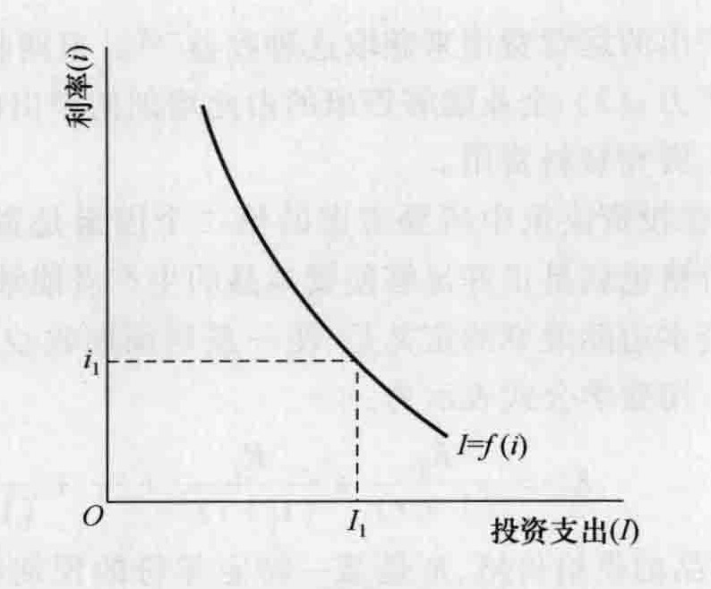
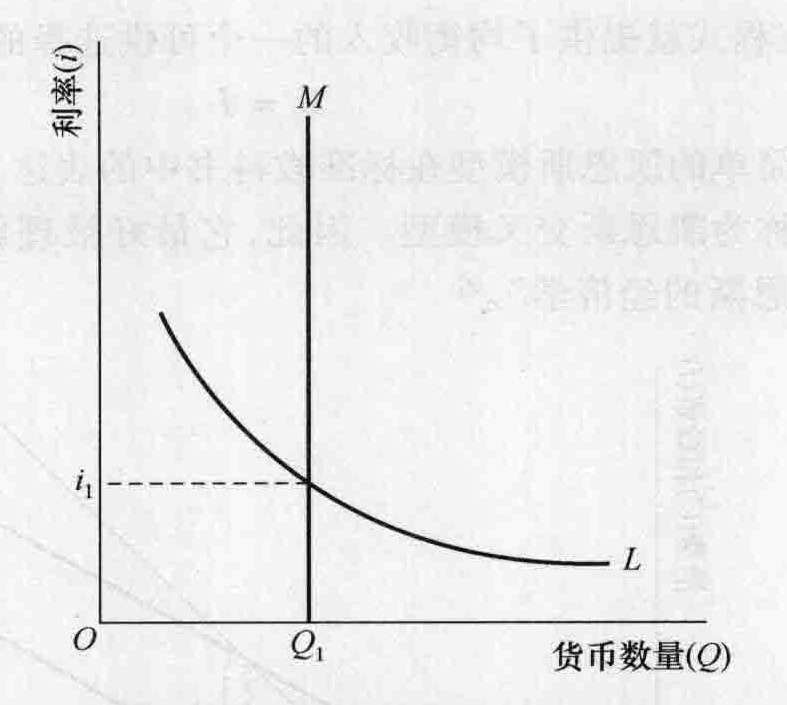
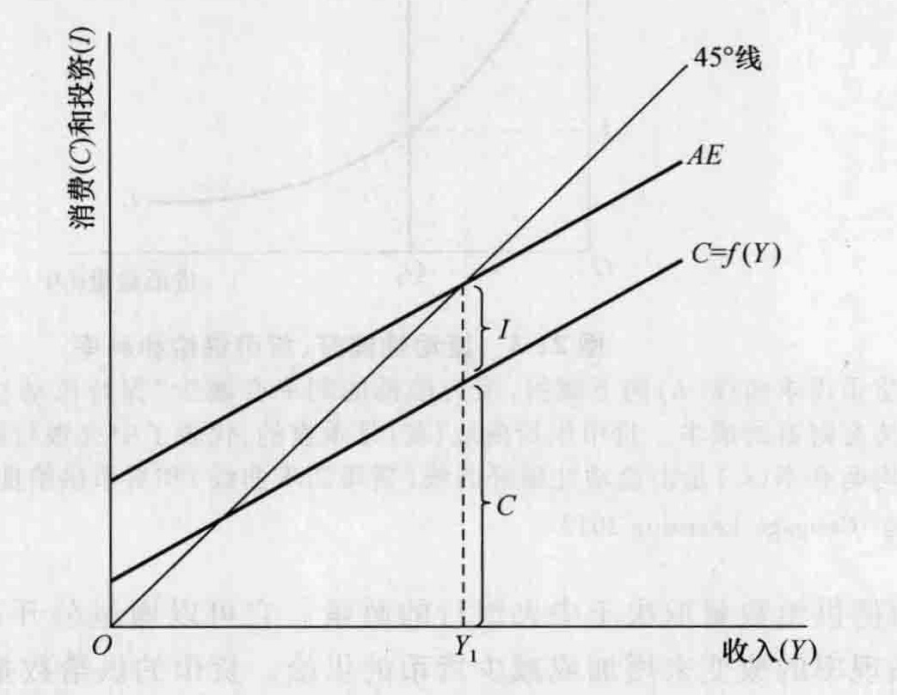
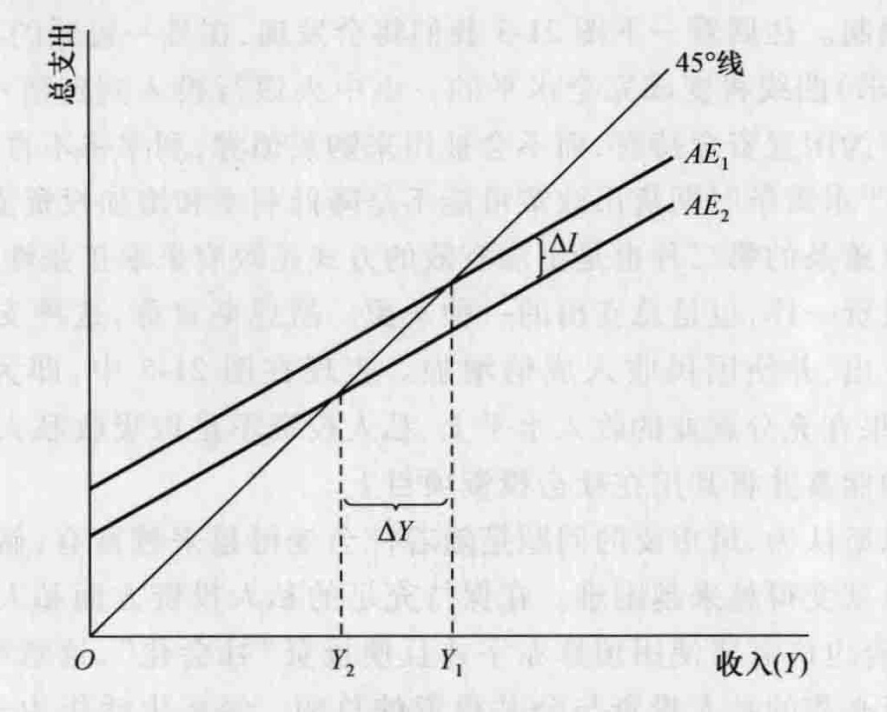

# 第 21 章 凯恩斯学派——约翰·梅纳德·凯恩斯

凯恩斯学派的思想体系是最重要的经济思想流派之一。这个学派开始于 1936 年凯恩斯的《就业、利息与货币通论》（*The General Theory of Employment, Interest, and Money*）的出版，至今仍然在正统经济学中占据重要地位。凯恩斯学派发端于新古典学派，凯恩斯本人就沿袭了马歇尔的传统。尽管凯恩斯尖锐地批评了新古典经济学的某些方面，并将其与李嘉图学说一起归在“古典经济学”的标题之下，但是他仍然使用了新古典经济学的许多假设与方法。他的体系建立在主观心理学方法上，并且充满了边际主义的概念，包括静态均衡经济学。凯恩斯并没有对新古典经济学的价值和分配理论提出批判。

在本章中我们将提供一个凯恩斯学派的概览并将讨论凯恩斯的主要思想。接下来在第 22 章中我们将研究几位后来发展了凯恩斯经济学的贡献者的思想。

## 21.1 凯恩斯学派概览

### 21.1.1 凯恩斯学派产生的历史背景

西方世界经历的最严重的经济危机——20 世纪 30 年代的大萧条，推动了凯恩斯思想的产生，然而他的思想根源可以追溯到 1929 年以前。许多经济学家包括米切尔及其在美国国家经济研究局的同事的著作都处于总量经济学或宏观经济学的框架内，而不属于新古典经济学派的微观经济学范畴。凯恩斯也采用了这种宏观经济方法。第一次世界大战及大战期间实施的经济调控要求对经济有一种全面的视角。大规模工业生产和贸易的增长使得经济对于统计测量和控制更加敏感，使归纳和总量的方法比过去更加切实可行。事实上，随着公众日益急迫地要求政府积极地处理失业问题，这种方法的必要性与日俱增。

凯恩斯的思想同时也起源于对经济停滞或经济增长率不断下降的广泛忧虑。第一次世界大战之后，西方世界成熟的私人企业经济与第一次世界大战之前相比缺乏活力。人口增长率在不断下降；世界的绝大部分都已被殖民化，似乎已经没有更多的地理扩展的空间。随着收入和储蓄的增长，生产看起来大大地超过了消费；并且没有像蒸汽机、铁路、电力和汽车这样的新发明来刺激新的、大量的资本投资。与此同时，充满活力的价格竞争的削弱降低了新的、更好的机器设备对旧机器设备的替代，当日益增长的过去投资的累积折旧资金没有被足够快地花费出去的时候，经济增长就会受到拖累。关于经济长期停滞的这些观察在 1929 年之后变得特别重要，它们部分地基于马克思、约翰·A. 霍布森（John A. Hobson, 1858—1940）、凡勃仑和其他经济学家的著作，部分地基于实际观察和历史研究。

大萧条在 20 世纪 30 年代早期开始之后，美国的许多经济学家提倡后来被称为凯恩斯主义的政策。有趣的是，我们可以注意到这些政策是在凯恩斯的《通论》出版之前提出的。经济学界和非经济学界的许多重要人物都敦促联邦政府实施公共工程项目、赤字预算，要求联邦储备委员会放松信贷。许多经济学家清醒地认识到增加政府开支对总支出和总收入将会产生乘数效应。一些经济学家从理论上将其概括为：随着国民收入的增加，消费支出没有总收入增加得快，而储蓄增加得相对更快。工资既被认为是一种产品需求的来源，也被认为是一种生产成本，而削减工资经常会受到反对，因为对于失业而言，它不能提供实际的补救，这就是宏观经济思想。在美国，人们独立于凯恩斯而得出了这些思想并且对其进行了广泛的讨论，但却是凯恩斯提出了将这些思想整合到一起的分析框架，并且引发了经济学中的“凯恩斯革命”。

### 21.1.2 凯恩斯学派的主要信条

凯恩斯经济学的主要特征和原理列举如下，在本章和第 22 章中我们将对其进行更加详细的讨论。

-   **强调宏观经济学**。凯恩斯及其追随者主要关注消费、储蓄、收入、产出和就业总量的决定因素。比如，与经济中总支出与就业总量之间的关系相比，他们对单个企业如何决定其利润最大时的雇佣量表现出了较少的兴趣。
-   **需求导向**。凯恩斯学派的经济学家强调有效需求（现在被称为总支出）的重要性，认为有效需求是国民收入、产出和就业的直接决定因素。这些经济学家认为，总支出由消费、投资、政府和净出口支出的总和构成。企业共同生产了它们期望卖出的实际产出水平，但是有时总支出不足以购买所生产的全部产出。随着未售出产品的增加，企业会解雇工人并减少产出。即有效需求决定经济的实际产出，在某些情形下实际产出会小于充分就业时的产出水平（潜在产出）。
-   **经济中的不稳定性**。按照凯恩斯主义者的观点，经济经常发生循环的繁荣与萧条，因为计划的投资支出水平是不确定的。投资计划的改变导致国民收入和产出发生变化，并且变化的数量大于投资最初的改变。投资和储蓄的均衡水平——经过所有的调整之后产生的——是通过国民收入的变化而达到的，而不是利率的变化。
-   投资支出是由利率和资本的边际效率（或者说是新投资高于成本的预期回报率）共同决定的。利率取决于人们的流动性偏好和货币的数量，资本的边际效率取决于人们对未来利润的预期和资本的供给价格。新投资的预期利润率是不稳定的，并因此而成为经济波动的最重要的原因之一。
-   **工资和价格刚性**。凯恩斯主义者指出，工资在向下调整方面具有刚性，这主要是由于工会合同、最低工资法和隐性合同（雇主与工人之间达成的非正式协议，即在暂时低迷的时期工资不应该被削减）等制度因素导致的。在产品和服务的总需求处于萧条的时期，企业相应地通过减少产量和解雇工人来应对销量下降，而不是通过坚持降低工资。价格在向下调整方面也具有黏性，有效需求下降最初会导致产出和就业的减少，而不会引起价格水平的下降，只有在非常严重的经济萧条的情况下才会发生通货紧缩。
-   **积极的财政与货币政策**。凯恩斯主义的经济学家倡议政府应该通过实施适当的财政与货币政策来积极地干预经济，以促进充分就业、价格稳定和经济增长。为了应对衰退或萧条，政府应该增加其支出或者减少税收，而后者会增加私人的消费支出。政府还应该增加货币供给以降低利率，以期能够推动投资支出的增加。为了应对过度的总支出引起的通货膨胀，政府应该减少它自己的支出，增加税收以减少私人的消费支出，或者减少货币供给以提高利率，这将抑制过度的投资支出。

### 21.1.3 凯恩斯学派对谁有利或为谁谋利

凯恩斯经济学的巨大成功部分地由于它致力于解决当时十分紧迫的问题——萧条和失业，同时，它也几乎为每个人都提供了某些东西，并且将当时正在做的某些必需的事情合理化了。社会会从充分或更加充分的就业中获益，由此而受到损失的那些个人和团体（比如，失业补偿项目的管理者）无疑是可以忽略的。尽管劳动者有时反对凯恩斯主义的某些建议，但是他们强烈支持凯恩斯更大的目标。总需求的增加会导致劳动力市场的紧张，并且会允许工会商谈更好的工资和劳动条件，这时他们有更少的对失业的担忧。商业利益集团会从政府合同和使经济摆脱萧条或衰退的政府刺激中获益。20 世纪 30 年代银行家拥有全面的过剩储备时，他们在政府债券中发现了一个巨大的、有利可图的投资领域，而且政府调控使银行体系具有流动性、安全性和稳定性。改革者和知识分子分享了在政府服务部门中急剧增加的就业机会，并且他们能够以参与圣战般的热情去追求源于凯恩斯思想的温和的、安全的、明智的改革。

农民长期以来就支持宽松的货币政策和较低的利率，他们也变得严重依赖政府对农业的支出项目。事实上，他们的代言人在乘数理论被并入凯恩斯理论之前很久就提出了一个原始的乘数理论。在捍卫政府干预以增加农民收入的过程中，他们宣称农民拿到 1 美元能够通过农民收入的再支出导致国民收入增加 7 美元。

在 20 世纪 60 年代和 70 年代，消费者从总体上来看都非常赞成减税，他们支持主张减税的政治家并投票给他们。不会伴随政府支出总体减少的这种减税在凯恩斯主义原理的基础上被合理化，即为了刺激需求和经济增长它们是必需的。20 世纪 80 年代，减税的原理呈现出“供给方”导向，但是它与凯恩斯主义的原理是一致的。

### 21.1.4 凯恩斯学派在当时是如何有效、有用或正确的

凯恩斯使经济理论与政策制定相协调。世界大战、世界范围内的经济萧条和现代生活的日趋复杂逐渐削弱了自由放任主义的影响。对于经济波动必须采取某些行动的要求变得日益迫切，而凯恩斯既提供了对经济波动的一种解释，也提供了缓和经济波动的一种方案。经济学家和经济分析在决定政府政策方向中的作用因此得以大大提高。

凯恩斯主义的观点——为了达到充分就业，除了降低名义工资外，尚有其他可供选择的手段——是特别及时的。降低名义工资这一源自新古典思想的政策药方，在解决大范围失业问题的实践方案中，只得到了极少的支持。更为重要的是，按照凯恩斯的观点，名义工资的严重总体下降会导致非常糟糕的经济政策。他认为，单独一个企业可以通过减少工资来增加销量和雇佣工人的数量，因为对其产品的需求将保持不变。但是，整个经济无法通过减少名义工资来轻易地增加销量（假设这个经济与国际贸易相隔离），因为工资既是产品需求的一个来源，也是一种生产成本。如果工资开始下降，那么人们可能会预测它们将会进一步下降，这可能会导致企业推迟投资支出，致使经济萧条更加严重。

如果工资的下降导致价格的下降，那将会使情况更为恶化，因为实际债务负担将会增加，并将财富从企业家的手中转移到食利者手中。另外，利润空间将会变得更小，并因此会中止新的投资。因为减少工资会伤害具有较高边际消费倾向的工资收入者却会帮助具有较低边际消费倾向的雇主，因此总体的消费倾向会下降，这将会使形势进一步恶化。作为一个非常实际的人，凯恩斯也反对减少工资，因为这将会引发劳资纠纷。凯恩斯相当成功地转变了人们的观念，使人们相信工资政策应该从应对萧条的各种政策中分离出来。凯恩斯说，存在创造充分就业的更好的方式。

即使对于那些并不接受凯恩斯政策结论的人来说，凯恩斯主义的方法也非常有用。它确立了用来观察经济的一套新的分析工具，鼓励了国民收入账户的进一步发展，激发了对于现实世界经验研究的大量的、成果丰硕的努力，加速了计量经济学的发展，并且创造了一种新自由主义，改革者们可以寄希望于这种新自由主义来帮助那些从不受约束的资本主义中获益最少的人。

### 21.1.5 凯恩斯学派的哪些信条具有长远贡献

凯恩斯及其追随者所提出的许多观点已经成为现代宏观经济学中的正统部分。事实上，现代经济学可以说是新古典的微观经济学和凯恩斯所激发的宏观经济学的一种组合。消费函数、边际消费倾向、储蓄函数、边际储蓄倾向、资本的边际效率、货币的交易需求、预防性需求和投机性需求、乘数、事后与事前的储蓄与投资、财政政策与货币政策、IS-LM 分析等凯恩斯主义的概念，现在已经是经济学教科书中的基本内容。一些凯恩斯主义的早期观点，如经济能够被“很好地调整”到一个无通货膨胀、充分就业的位置上的观点等，在很大程度上已不再被认可，但是凯恩斯主义作为一种分析方法和一个思想体系仍然统治着宏观经济学。

这并不是说凯恩斯及其追随者的所有观点都被证明是正确的，对凯恩斯思想的一些总体批判将在本章的最后部分进行讨论。由现代货币主义者和“新兴古典主义者”所提出的对凯恩斯主义理论的批评将在第 24 章中进行讨论。

## 21.2 约翰·梅纳德·凯恩斯

### 21.2.1 生平细节

约翰·梅纳德·凯恩斯（John Maynard Keynes, 1883—1946）是一对才智杰出的夫妇的儿子，他们都比凯恩斯去世得晚。他的父亲约翰·内维尔·凯恩斯（John Neville Keynes）是一位著名的逻辑学家和政治经济学家；母亲是一名地方执法官、高级市政官和剑桥的市长，对于公共事务和社会工作都很感兴趣。马歇尔和庇古都是凯恩斯在剑桥大学的老师，他们都认为他是天才。凯恩斯在 28 岁的时候成为《经济学杂志》（*Economic Journal*）的编辑；同时，他还管理着该杂志的出版方——英国皇家经济学会的投资，并取得了非同一般的成功。在凯恩斯的财务指导下，剑桥大学的国王学院同样获得了超乎寻常的利润。他自己很可观的 50 万英镑的财富主要是通过外汇和外国商品交易积累起来的。事实上，他是一个投机者。对于投机者，他是这样描述的：

> 当投机者像在企业的洪流中漂浮着的泡沫时，他未必会造成祸害。但是，当企业成为投机漩涡中的泡沫时，形势就很严峻了。当一国资本的积累变为赌场中的副产品时，工作多半是没有干好的。就把华尔街看作一个社会功能是使新投资可以根据未来收益流入最大利润渠道的机构而论，它所取得的成功不能被认为是自由放任资本主义的典范——这并不值得奇怪，如果我下面所说的是正确的话：华尔街最好的头脑在事实上被引导到一个与其社会功能不同的目标上。①

凯恩斯在实务界和学术界中都是一个非常重要的人物。他是一家人寿保险公司的董事会主席，还担任其他几家公司的董事，并且是英格兰银行管理机构的成员。除了是一名金融家之外，他还是一名高级政府官员、许多学术理论著作的作者、新闻工作者、艺术鉴赏家和支持者以及剑桥大学的教师。他是“布鲁姆斯伯里团体”（Bloomsbury Group）的重要成员，这个团体是以范奈莎·贝尔（Vanessa Bell）和弗吉尼亚·伍尔芙（Virginia Woolf）姐妹所居住的伦敦的一个区的名字命名的。这个由杰出艺术家、作家、批评家、知识分子和演说家组成的圈子，从 1907 年开始一直持续到 1930 年，其成员还包括了伦纳德·伍尔芙（Leonard Woolf）、克莱夫·贝尔（Clive Bell）、利顿·斯特雷奇（Lytton Strachey）、E.M. 福斯特（E. M. Forster）和其他一些名人。凯恩斯是第一次世界大战后巴黎和会上英国财政部的首席代表，拥有代表财政部长发言的权力。他在巴黎的谈判经历及其对强加给德国的和平方案的强烈反对促使他在 1919 年辞去了官员职位，并且写作了挑起争端的《和平的经济后果》（*The Economic Consequences of the Peace*）一书。1940 年他再次进入财政部，以帮助英国渡过战时的财政困难。在组织国际货币基金组织和国际复兴开发银行的过程中以及在取得美国对英国的战后贷款的过程中，他都是英国的首席谈判代表。1942 年他成为一名男爵，对于批评他接受这一头衔的那些朋友，他开玩笑地反击道：“为了得到仆人，我不得不接受它。”

1926 年凯恩斯出版了一本名为《自由放任的终结》（*The End of Laissez-Faire*）的薄书，在这本书中他指出当时的许多不幸是风险、不确定性和无知的结果。大企业通常是一种彩票，其中某些人能够利用无知和不确定获利，但结果是财富的巨大不平等、失业、对理性经济预期的失望以及对效率与生产的损害：

> 然而，治疗方案却存在于个人的操作之外，弊病的恶化甚至可能是符合个人利益的。我认为，治疗这些弊病部分应该借助于一个中央机构对通货和信贷进行深思熟虑的调控，部分应该借助于大规模地收集和传播与经济形势相关的数据……这些措施将会通过某个合适的行动机构使社会对私人企业的许多内在的复杂问题运用其指导性的聪明才智加以解决，而且它将保持私人的主动性不受妨碍……
>
> 资本主义的信徒通常是过度保守的，并且拒绝其在技术方面的改革，因为他们害怕这些改革可能会被证明是偏离资本主义的最初的步骤，但实际上这些改革可能会加强、维护资本主义……就我而言，我认为资本主义如果加以明智地管理，在实现经济目标方面可以比看得见的其他任何制度都更加富有效率，但是就其本身而言，它在许多方面是极度令人反感的。我们的问题是设计一个社会组织，它应该是尽可能地富有效率而又不会触犯我们对满意的生活方式的理解。②

在其人生最后的二十多年里，凯恩斯没有背离上述这些观点。

### 21.2.2 凯恩斯的思想体系

凯恩斯在《通论》中所提出的思想体系包括几个相互关联的元素，它们中的第一个就是消费函数。

**消费函数**。凯恩斯指出了消费与收入之间关系的一个“基本心理规律”：

> 从我们关于人类本性的知识和具体的经验中进行推理，我们可以非常自信地依凭的基本心理规律是：作为一种规则，就平均而言，随着收入的增加，人们倾向于增加消费，但是消费的增加不像收入增加得那么快。③

正式的表达为：
（1）在消费（$C$）和国民收入（$Y$）之间存在一种正的函数关系，即：
$$ C = f(Y) \tag{21-1} $$

（2）消费变化对收入变化的比率——边际消费倾向（$MPC$）——是正的并且小于 1。
$$ MPC = \Delta C / \Delta Y \tag{21-2} $$

这意味着储蓄（$S$）也随着收入的增加而增加，也是收入的正函数。
$$ S = f(Y) \tag{21-3} $$

与 $MPC$ 相同，边际储蓄倾向（$MPS$）大于 0 且小于 1。
$$ MPS = \Delta S / \Delta Y \tag{21-4} $$

在图 21-1 中，我们画出了一个短期消费函数，它表示在一个假设的经济中，在不同的收入水平上消费者在产品和服务上将会支出的数额，曲线的斜率（$\Delta C / \Delta Y$）就是边际消费倾向。

*图 21-1 消费函数。说明：随着国民收入的增加，消费也会增加，但是没有收入增加得快。消费函数 $C=f(Y)$ 的斜率 ($\Delta C/\Delta Y$) 度量边际消费倾向的大小。*

**投资**。凯恩斯将经济投资定义为对资本品的购买。另外，当销量下降、存货增加时，会产生非意愿投资。注意经济投资和金融投资之间的区别，金融投资包括购买股票、债券和其他金融工具。金融投资并不是凯恩斯意义上的投资，因为它并不直接代表对资本品的购买。对凯恩斯而言，金融工具仅是可供人们选择的替代储蓄的贮藏器。

企业进行投资是希望新资本能增加利润。当一个企业购买某一资本设备时，它是“购买了一系列预期收益的权利，［企业］希望在资产的使用寿命内通过出售其产出并扣除获得这些产出的运营费用来获取这种收益”④。预期收入流的大小取决于：（1）这件资本品的生产力；（2）企业能够售出的由此增加的产出的价格；（3）由于使用这件资本品所增加的工资和材料费用。

凯恩斯说，在投资决策中所要考虑的第二个因素是资产的供给价格或**重置成本**。资本品的供给价格也就是正好足够使资本品的生产者能够生产额外一单位资本品的价格。凯恩斯对资本边际效率的定义是，使一系列预期收益的现值正好等于资本品供给价格的折现率。用数学公式表示为：

$$ K_s = \frac{R_1}{(1+r)} + \frac{R_2}{(1+r)^2} + \dots + \frac{R_n}{(1+r)^n} \tag{21-5} $$

其中，$K_s$ 是资本品的供给价格，$R$ 是某一特定年份的预期收益，$r$ 是资本边际效率。例如，如果一件资本品现在的成本是 5 500 美元，并且预期能够连续 6 年每年产生 1 000 美元的收益，6 年后该资产的残值为零，那么资本边际效率将是 2.5%。换言之，连续 6 年每年 1 000 美元的收益按照 2.5% 的利率折成现值将会是 5 500 美元。另一种说法是，以 2.5% 的回报率投资 5 500 美元，将连续 6 年每年产生 1 000 美元的收益。资本边际效率是其边际生产力与资本品原始成本的百分比，它是在资本投资的寿命内进行计算的，由于其不确定性和处于未来的状态而要进行贴现。也就是说，它是一项新投资的预期利润率，没有扣除折旧或显性的和隐性的利息成本。

投资将会持续下去直到资本边际效率等于利率为止，而利率是用于投资的借入资金的成本。例如，如果资本边际效率为 2.5%，那么利率为 3% 时投资就不会发生，但是利率为 2% 时投资就会发生。

资本边际效率是高度可变的，随着人们对预期投资的未来利润预期的变化而变化。凯恩斯认为，增加对任意给定类型的资本的投资都会减少那种资本的边际效率，这里原因有二：其一，随着不断增加的资本之间的相互竞争，预期利润将会下降。在公式 (21-5) 中，这意味着 $R$ 的价值下降而其他保持不变，这必然会导致资本边际效率 $r$ 的下降。其二，“对用于生产那种类型的资本品的设备的压力将导致其供给价格上升”⑤。注意在公式 (21-5) 中 $K_s$ 增加而其他保持不变，也会降低 $r$ 的值。因此，出现了这样一个原理，即对资本的某一特定类型的投资的数量与其边际效率是负相关的。

凯恩斯关于资本边际效率的思想可以用来构建一条投资需求曲线，如图 21-2 中标为 $I=f(i)$ 的曲线所示。这条曲线表示在一个经济中所有的相关投资项目都已按它们的资本边际效率不断下降的顺序排列起来的情况下，利率（$i$）和投资数量（$I$）之间的负相关关系。如果市场利率是 $i_1$，那么投资数量是 $I_1$。对于直到 $I_1$ 的所有投资，资本边际效率大于借入成本，而对于超过 $I_1$ 的所有投资，借入成本大于资本边际效率。

*图 21-2 投资需求曲线。说明：一个经济的投资需求曲线 $I=f(i)$ 是通过按投资的资本边际效率不断下降的顺序来排列所有的潜在投资项目而构建的。投资需求曲线是向下倾斜的，反映了利率 $i$（每一美元投资的金融“价格”）和投资需求数量 $I$ 之间的负相关关系。*

凯恩斯不同意古典和新古典经济学家的观点，即利率能够在企业进行新的投资所需要的储蓄数量和储蓄供给之间自动地产生一种平衡。凯恩斯认为，利率既不是节欲的回报（西尼尔），也不是等待的报酬（马歇尔）。如果一个人以现金的形式保存其储蓄，他将不能获得任何利息。储蓄更主要取决于收入水平（回想我们前边对储蓄函数的讨论）。利率是对流动性牺牲的一种回报，而流动性是资产能够直接转化为产品和服务而不会损失其购买价格的便利。利率取决于流动性偏好和货币数量，货币被定义为通货加上活期存款。市场利率是使个人以现金形式持有财富的愿望与体系中可以得到的现金的数量相平衡的价格。

**流动性偏好**。除了在利率起到一个有效激励的情况下，流动性偏好取决于人们持有货币并不愿意放弃它的三个动机。第一个是**交易动机**，即需要用货币支付当前的购买行为以满足消费和企业的需要。第二是**预防性动机**，即需要在手头保留一些现金以应付没有预见到的紧急事件。最后，存在着**投机性动机**，即因等待利率上升、股票和债券价格的下降或总体价格水平的下降而持有现金的需要。流动性使人们在出现金融和经济投资机会的时候能够迅速地把握住。

持有货币的这些动机转化为一条货币需求曲线，如图 21-3 中的 $L$ 所示。货币需求曲线向下倾斜，表示在较低的利率水平上人们愿意持有更多的现金。当利率相对于某一正常利率水平较低时，人们预期它将会上升。当利率上升时，债券价格会下降，而那些持有债券的人将会遭受损失。因此，当利率较低时，人们会持有较大数量的现金和较少数量的债券。出于相反的原因，当利率较高时，人们会持有较多数量的债券和较少数量的现金。

*图 21-3 流动性偏好、货币供给和利率。说明：货币需求曲线 ($L$) 向下倾斜，因为较低的利率会减少“保持流动性”的成本，即以现金形式持有财富的成本。货币供给曲线 ($M$) 是垂直的，代表了中央银行提供的特定数量的货币。均衡利率 ($i_1$) 是由流动性偏好曲线（货币需求曲线）和货币供给曲线的交点所决定的。*

货币的供给数量取决于中央银行的政策。它可以通过公开市场操作、法定准备金率和再贴现率的改变来增加或减少货币的供给。货币的供给数量被假设为不受利率的影响，因此，图 21-3 中的货币供给曲线 $M$ 是垂直的或完全无弹性的。

从图中，我们可以看出均衡利率水平为 $i_1$。货币数量的增加——$M$ 向右移动——将会降低利率，除非公众的流动性偏好的增加超过了货币数量的增加。在这里出现的重要一点是：如古典和新古典经济学家所假设的那样，较低的利率不会减少储蓄。相反，它会刺激投资支出（图 21-2）。如果经济在低于充分就业的水平上运转，那么国民收入将会增加而储蓄也会增加。

简而言之，经济中的投资水平取决于以下两者的相互作用：（1）资本边际效率，它确定了投资需求曲线；（2）市场利率，它取决于货币需求（流动性偏好）和货币供给。

**均衡收入与就业**。凯恩斯假设国民收入和就业水平之间是高度相关的。当然，这不一定就是正确的。比如，对节省劳动的资本的大量投资可能会使实际国内产出和国民收入的增长比就业的增长快得多。但是，凯恩斯主要关注的是短期，他以嘲讽的口气为这一点辩护：“从长期来看，我们都死了。”在短期中，我们可以忽略技术变化，于是我们可以认为收入水平决定就业水平，而这两个变量可以交替使用。

如果我们忽略政府和国际贸易，那么收入和就业的直接决定因素就是消费和投资支出，这两个支出部分构成了经济中的总支出。当消费和投资支出加总的水平等于当前的收入水平时，就会出现均衡国民收入。用公式来表示，即：
$$ Y = C + I \tag{21-6} $$
因为储蓄是收入和消费之间的差额，于是
$$ S = Y - C \tag{21-7} $$
解这两个方程式就提供了均衡收入的一个可供选择的条件：
$$ S = I \tag{21-8} $$

图 21-4 是简单的凯恩斯模型在标准教科书中的表达，这是由保罗·萨缪尔森正式提出的，并被他称为凯恩斯交叉模型。因此，它最好被理解为“凯恩斯主义经济学”而不是特定的“凯恩斯的经济学”。⑥

*图 21-4 均衡收入。说明：在最简单的凯恩斯模型中总支出 ($AE$) 由消费 ($C$) 和投资 ($I$) 构成。当 $AE$ 曲线与 45° 线相交时出现均衡收入，因为在那一点上计划支出 ($C + I$) 等于收入水平 ($Y_1$)。同时，在均衡点上计划投资 $I$ 等于储蓄 (45° 线和消费函数之间的垂直距离)。*

总支出曲线 $AE$ 表示在每一收入水平上现有的消费和投资支出的加总。$AE$ 和消费函数 $C=f(Y)$ 之间的垂直距离是投资水平（图 21-2 中的 $I_1$）。消费函数和横轴之间的垂直距离是消费水平。均衡收入是 $Y_1$，因为在这一点上总支出曲线与 45° 线相交，表示 $C+I$ 等于现在的收入水平 $Y_1$（在 $Y_1$ 点上，45° 线的高度等于水平距离 $OY_1$）。

我们还可以证明，在 $Y_1$ 点上，储蓄等于意愿的投资。从方程式 (21-7) 中我们可以回想起储蓄水平是通过在收入水平中减去消费水平而得到的。因此，在图 21-4 中，在任意收入水平上的储蓄水平也就是 45° 线和消费函数之间的垂直距离。只有在 $Y_1$ 点上，这个垂直距离——储蓄 ($S$)——等于计划的投资水平 ($I$)。

萧条是如何发生的？凯恩斯问道。他的答案通过刚才的简单模型可以很容易地得到。假设图 21-4 中的收入水平 $Y_1$ 是充分就业的收入水平。进一步假设由于某种原因企业家对未来的经济前景感到悲观，这会导致对一项新投资的预期收益的一个向下的修正，这转化为资本边际效率的下降和投资需求曲线（图 21-2）的向左移动。

如图 21-5 所示，投资支出的下降会使总支出从 $AE_1$ 减少为 $AE_2$。企业会对销量的减少和存货的增加作出反应，减少他们雇用工人的数量和产量。因此，国民收入会从 $Y_1$ 减少为 $Y_2$。我们注意到均衡收入比投资本身下降得多，原因就是投资支出初始变化的**乘数效应**。凯恩斯从他剑桥大学的同事 R. F. 卡恩（R. F. Kahn）那里借用了乘数理论，并将它直接融入自己的模型中。乘数度量支出的变化对收入的最终效应，也就是收入的变化除以投资的变化。

*图 21-5 均衡收入的变化。说明：总支出从 $AE_1$ 下降到 $AE_2$——在这个例子中是由于投资支出的下降引起的——导致收入从 $Y_1$ 下降为 $Y_2$ 和失业的增加（图中没有表示出来）。简单的凯恩斯乘数是收入变化 ($\Delta Y$) 与投资支出最初的变化 ($\Delta I$) 的比率。凯恩斯认为，政府能够通过启用扩张性的财政政策来应对收入的下降，扩张性的财政政策将使总支出曲线从 $AE_2$ 移回到 $AE_1$。*

乘数的大小取决于总支出曲线的斜率。让我们假设边际消费倾向——在这个特定的例子中，是 $AE_1$ 和 $AE_2$ 的斜率——为 0.6。即当人们收入增长 1 美元时，将花掉 60 美分而储蓄 40 美分 ($MPS = 0.4$)。换句话说，当收入下降 1 美元时，他们的消费和储蓄将分别减少 60 美分和 40 美分。

假设在我们的例子中，投资支出减少了 100 亿美元，这将使收入立即下降 100 亿美元，因为资本品出售者的收入将会下降一个相等的数额。由于收入下降了 100 亿美元，出售者将减少 60 亿美元的消费 ($0.6 \times 100$ 亿美元)，减少 40 亿美元的储蓄 ($0.4 \times 100$ 亿美元)。消费支出下降了 60 亿美元将导致收入进一步下降 60 亿美元，这反过来又将使其他人的消费支出另外减少 36 亿美元 ($0.6 \times 60$ 亿美元)，储蓄另外减少 24 亿美元 ($0.4 \times 60$ 亿美元)，这个过程将会持续下去。一旦收入总的下降达到 250 亿美元，均衡就会恢复。收入下降了 250 亿美元将使储蓄减少的数额正好等于投资支出最初减少的 100 亿美元 ($0.4 \times 250$ 亿美元)。在这个例子中乘数为 2.5，如公式 (21-9) 中的 $K$ 所示，它是边际储蓄倾向的倒数。⑦

$$ K = 1 / MPS \tag{21-9} $$

**促进充分就业与稳定的政策**。凯恩斯建议政府发挥更大的作用以使经济在充分就业的国民收入水平上实现稳定。为了应对诸如与图 21-5 中的收入 $Y_2$ 相联系的高失业，凯恩斯提出了增加总支出的各种方式。例如，在萧条时政府应该通过强制降低利率来刺激私人投资，而这要通过中央银行的政策来实现。但是对于利率将降低到多低存在一些限制。往回看一下图 21-3 将会发现，在某一较低的利率水平上流动性偏好（货币需求）曲线将变成完全水平的。由中央银行投入到经济中的任何新的货币都将被人们作为闲置资金持有，而不会被用来购买债券，利率将不再下降。由于这种**流动性陷阱**，在严重萧条时期货币政策可能不是降低利率和增加投资支出的一种有效方式。

克服萧条的第二种也是更加有效的方式是政府采取扩张性的财政政策。政府支出与私人投资一样，也是总支出的一种来源。凯恩斯宣称，这种支出能够被增加，它可以增加总支出，并使国民收入成倍增加。表现在图 21-5 中，即为总支出从 $AE_2$ 增加到 $AE_1$。如果在充分就业的收入水平上，私人投资不足以吸收私人储蓄，那么政府应该借入多余的储蓄并将其用在社会投资项目上。

凯恩斯认为，最重要的问题是随着社会变得越来越富有，储蓄将越来越多，保持充分就业也就变得越来越困难。在保持充足的私人投资方面私人企业也许会遇到困难。因此，政府也许需要使用预算赤字并且使投资“社会化”，这意味着国家将决定实现充分就业所需的私人投资与公共投资的总额。经济生活作为一个整体没有必要社会化，因为现行的体制对于正在使用的生产要素并没有造成严重的配置不当。政府应该决定就业的总量，而不是就业的构成。

> **历史借鉴 21-1 凯恩斯与斯德哥尔摩学派**
>
> 斯德哥尔摩学派以维克塞尔关于积累过程的分析为基础，以一种与凯恩斯相似的方式研究总体的经济过程。多年来，英国的经济学家并不清楚经济学在瑞典的发展，即使瑞典经济学家与凯恩斯主义者发展得同步或在某些重要的方面领先于凯恩斯主义者。诺贝尔奖获得者、经济学家冈纳·缪尔达尔（Gunnar Myrdal, 1898—1987）嘲笑凯恩斯的“不必要的创新”。1913 年，由于世界范围的经济萧条，瑞典政府要求其著名经济学家分析应对失业的各种政策。为了完成这一任务，经济学家必须解决某些理论问题。当储蓄规模较小时，产出和投资如何在这样一个萧条的状态进行扩张？当投资进行扩张而储蓄者不准备进行更多储蓄时，在何种意义上投资会超过储蓄？投资最终来自储蓄，储蓄从何而来？
>
> 缪尔达尔教授在 1933 年发表了一个分析，今天看来它好像强化了凯恩斯的均衡收入和均衡收入变化的概念。缪尔达尔在可预见的（他也称为“事前的”）收入、储蓄、投资与可回顾的（他也称为“事后的”）收入、储蓄、投资之间进行了区分。因此，事前投资是基于事前或计划收入而对将来一段时间的计划投资，事前储蓄也是基于预期的未来收入和消费而作出的计划。事后储蓄、投资和收入是在过去某一阶段已经实现了的，因此可以在统计记录中查阅。
>
> 为了解释经济波动，事前分析是必需的。一个人必须考察对于未来的预期和计划。尽管未来预期和计划在某种程度上是基于现在或过去的经历或条件的，但是这两者之间并不存在机械的直线联系。
>
> 因为计划储蓄和计划投资通常是由拥有不同动机的不同人预期的，因此除非偶然的情况，否则这两个变量是不可能一致的。它们之间的差异代表了经济中的不均衡，这种不均衡会促使一个朝着新的均衡的变化。其结果是收入将移向一个新的水平，在这个新的水平上事后储蓄与投资是相等的。因此，如果计划储蓄超过了计划投资，收入将会下降到计划储蓄和投资相等时为止。如果计划投资超过了计划储蓄，也许通过银行信用的扩张，收入将会上升到计划储蓄和投资相等时为止。事前储蓄与投资的相等将会产生一种均衡，这种均衡通常表现为事后储蓄和投资既没有收益也没有损失。
>
> 假设由于乐观的预期，在一个存在一些失业的经济中投资者决定增加他们的投资，而储蓄者并没有决定储蓄得更多，那么总销量将会上升，更多的产品将会被生产出来，总收入将会增加，人们将会储蓄更多的货币。在这个阶段的末期，实现的收入将会超过预期收入，实现的储蓄将会超过计划储蓄。
>
> 凯恩斯在他的《货币论》（*Treatise on Money*, 1930）中写道，储蓄与投资之间的不相等将会导致收入和就业水平发生变化，这里他指的是事前的储蓄和投资；在《通论》（1936）中他又写道，储蓄与投资总是相等的，这里他指的是事后的储蓄和投资。在任何收入水平上，事后储蓄等于事后投资，因为存货的变化起到了一个平衡项目的作用，它使投资（对资本品的购买加上存货的变化）与现有的实际储蓄相等。但是，在凯恩斯对收入的预期和变化的讨论中，他很明显地将事前的考虑加入到了他的理论中。

### 21.2.3 对凯恩斯理论的批评

凯恩斯的短期静态思想导致他夸大了长期经济停滞的趋势。与他之前的许多经济学家相同，他认为随着最具盈利性的项目已经先被开发，吸引力较差的项目留待后来开发，致使新投资的盈利性将会下降。

古埃及具有双重的幸运，而其神话般的财富不容置疑地来源于此，因为它进行了两种活动，即建造金字塔和寻找贵金属，由于这两种活动的成果不能以消费的方式满足人们的需要，因此它们不会由于数量充裕而降低价值。中世纪则建造了教堂和唱挽歌。两座金字塔，对于死者的两次弥撒，带来的好处要两倍于一座金字塔和一次弥撒。然而，在伦敦和约克之间建造两条铁路则并非如此。⑧

凯恩斯低估了技术变化的可能性及其可能激发的新的资本投资。

凯恩斯在空间和时间方面都是极度狭隘的。他好像认为在古埃及和中世纪如果不是因为建造金字塔和教堂，失业可能会成为一个问题。他对于重商主义的分析也强烈地暗含着 1636 年的问题与 1936 年的相同的观点：“在整个人类历史中存在一种长期趋势，即储蓄的倾向强于对投资的激励。”⑨他认为在整个历史中，投资激励不足是经济问题的关键。

由于过于乐于接受浪费性的政府开支，凯恩斯也因此受到批评。可以确定的一点是，他倾向于国家资助那些有用的项目而不是那些无用的项目。但是，他承认商业社会可能会谴责那些有用的公共工程——如果它们与私人企业形成了竞争的话。在这样一种情形下，浪费性支出要比有用的项目更加可取，并且比根本什么都不做好得多：

> 如果我们的政治家们由于受到古典经济学的教育太深而想不出更好的办法，那么，造金字塔、发生地震甚至战争可能都会起到增加财富的作用……
>
> 如果财政部把用过的瓶子塞满钞票，并把塞满钞票的瓶子埋在废弃矿井的适度深度中，然后，用城市垃圾把矿井填平，并听任私有企业根据自由放任的原则把钞票再挖出来（当然，要通过投标来取得在填平的钞票区开挖的权利），那么，失业问题便不会存在，而且在由此造成的反响的推动下，社会的实际收入和资本财富很可能要比实际多出很多。确实，建造房屋或类似的东西会是更加有意义的办法，但如果这样做会遇到政治上和实际操作上的困难，那么，上面说的方法总比什么都不做要好。⑩

凯恩斯对于私人浪费性开支和公共浪费一样持赞同态度。他支持伯纳德·曼德维尔的《蜜蜂的寓言：私人的恶德、公众的利益》（*The Fable of the Bees: or, Private Vices, Publick Benefits*, 1705），这本书讲述了一个繁荣社会为了储蓄的利益忽然放弃了奢侈性居住和娱乐的可怕的悲惨遭遇。杜克大学的卡尔文·B. 胡佛（Calvin B. Hoover）教授描述了在华盛顿的一家酒店中凯恩斯在这一问题上的古怪行为：

> 1934 年在华盛顿凯恩斯下榻的酒店房间中，当我准备与他共进晚餐时，他善意地讽刺了我从搁架上挑选毛巾而避免将其弄乱的优雅举止。他用胳膊扫了一下，将两三条毛巾扫到地板上，并开玩笑地说道：“我确信与你非常谨慎地避免浪费相比，我对于美国经济更加有用，因为弄乱这些毛巾可以刺激就业。”⑪

当然，在经济思想史中，凯恩斯并不是唯一的为说服听众和读者而夸大其思想的人。而且他确实说服了他的听众和读者！他的思想体系在所有的工业化国家中都逐渐成为正统的宏观经济思想。

---

① John Maynard Keynes, *The General Theory of Employment, Interest and Money* (New York: Harcourt, Brace and World, 1936), 159. Reprinted by permission of Harcourt Brace and Company.

② John Maynard Keynes, *The End of Laissez-Faire* (London: Hogarth, 1926), 47—58.

③ Keynes, *General Theory*, 96.

④ Keynes, *General Theory*, 135.

⑤ Keynes, *General Theory*, 136.

⑥ 阿克塞尔·莱荣霍夫德 (Axel Leijonhufvud) 在他的著作 *On Keynesian Economics and the Economics of Keynes* (New York: Oxford University Press, 1968) 中对“凯恩斯主义经济学”和“凯恩斯的经济学”作了区分。

⑦ 在美国经济中，由收入的增长导致的边际储蓄倾向被认为是固定不变的，并且大约为 0.1，这意味着乘数将为 10(1/0.1)。但是，在第 22 章中我们将发现在现实世界的经济中除了储蓄以外，还有其他“漏出”，因此，对于美国而言，估计的乘数大约在 2.2 到 2.7。

⑧ Keynes, *General Theory*, 131.

⑨ Keynes, *General Theory*, 347.

⑩ Keynes, *General Theory*, 128—129.

⑪ Calvin B. Hoover, “Keynes and the Economics System,” *Journal of Political Economy* 56 (October 1948), 397.

## 复习与讨论

1.  解释下列名词，并简要说明其在经济思想史中的重要性：约翰·内维尔·凯恩斯，约翰·梅纳德·凯恩斯，《就业、利息与货币通论》，消费函数，边际消费倾向，边际储蓄倾向，资本边际效率，流动性偏好，均衡收入和就业，缪尔达尔，事前与事后的储蓄和投资，财政政策，货币政策。
2.  对比本章所讨论的凯恩斯学派的主要信条与第 12 章所讨论的边际学派的主要信条。
3.  解释凯恩斯的“基本心理规律”对其均衡收入和就业理论的重要性。
4.  使用下表中的信息回答以下问题，假设在这个假设的经济中最初并不存在政府支出和税收。

**(单位：美元)**

| 收入 ($Y$) | 消费 ($C$) | 储蓄 ($S$) | 投资 ($I$) |
| :---: | :---: | :---: | :---: |
| 0 | 20 | -20 | 40 |
| 100 | 100 | 0 | 40 |
| 200 | 180 | 20 | 40 |
| 300 | 260 | 40 | 40 |
| 400 | 340 | 60 | 40 |

(a) 在这个经济中边际消费倾向为多少？边际储蓄倾向为多少？
(b) 均衡收入水平为多少？请应用公式 (21-6) 和公式 (21-8) 给予解释。
(c) 假设投资支出下降 20 美元。新的均衡收入和新的消费水平将为多少？乘数的大小为多少？为什么假设失业率的上升与国民收入的下降相联系是合理的？
(d) 按照凯恩斯的观点，政府能够采取什么行动来恢复你在问题 (b) 中决定的均衡收入水平？

5.  应用凯恩斯的资本边际效率的概念来解释为什么即使在市场利率保持不变的情况下，投资支出的下降也是可能的。
6.  假设下表反映的是一个经济中的投资需求表。

| 预期回报率（％） | 回报率等于或大于此回报率时的累计投资数量 (10 亿美元) |
| :---: | :---: |
| 12 | 10 |
| 10 | 20 |
| 8 | 30 |
| 6 | 40 |
| 4 | 50 |
| 2 | 60 |

(a) 按照凯恩斯的观点解释，第一栏所表示的各种不同的预期回报率是如何决定的？
(b) 如果这个经济中的利率是 8%，现有投资支出将为多少？请解释。
7.  假设一个经济中人们出于交易目的而希望持有的货币的数量等于国民收入的 1/4。下表表示人们出于预防性目的和投机性目的而希望持有的货币总量。

| 利率（％） | 货币需求数量（美元） |
| :---: | :---: |
| 12 | 80 |
| 10 | 100 |
| 8 | 120 |
| 6 | 140 |
| 4 | 160 |
| 2 | 180 |

(a) 如果国民收入是 400 美元，利率为 10%，人们希望持有的货币总量为多少？
(b) 如果国民收入是 800 美元，货币供给为 340 美元，均衡利率为多少？

8.  讨论下面两段文字，你同意其中的哪一段？
    “在到达某一特定的点时，把经济理论对社会的影响和语法学家对语言的影响进行比较是可能的。语言不是在语法学家同意的情况下形成的，而且就算有了语法学家语言还是会被误用；但是他们的工作有助于我们了解语言形成和衰落的规律……”（古诺，1838）
    “经济学家和政治哲学家的思想，不论其正确与否，其力量之大往往出乎一般的理解。实际上，统治世界的不过就是这些思想。许多实干家自以为不受任何理论的影响，却往往恰好沦为某个已故经济学家思想的奴隶。听信不确定观点的当权的疯子，其狂热思想往往来源于若干年前学术上某位不入流的作者。”（凯恩斯，1936）

## 精选文献

**书籍**

Blaug, Mark, ed. *John Maynard Keynes*. 2 vols. Brookfield, VT: Edward Elgar, 1992.
Dillard, Dudley. *The Economics of John Maynard Keynes*. New York: Prentice-Hall, 1948.
Hansen, Alvin H. *A Guide to Keynes*. New York: McGraw-Hill, 1953.
Harcourt, G. C., ed. *Keynes and His Contemporaries*. New York: St. Martin's Press, 1985.
Harrod, R. F. *The Life of John Maynard Keynes*. New York: Harcourt, Brace and World, 1951.
Hazlitt, Henry, ed. *The Critics of Keynesian Economics*. Princeton, NJ: D. Van Nostrand, 1960.
Keynes, John Maynard. *The End of Laissez-Faire*. London: Hogarth, 1926.
——. *The General Theory of Employment, Interest and Money*. New York: Harcourt, Brace and World, 1936.
——. *A Treatise on Money*. 2 vols. London: Macmillan, 1930.
Leijonhufvud, Axel. *On Keynesian Economics and the Economics of Keynes*. New York: Oxford University Press, 1968.
Shaw, G. K., ed. *Schools of Thought in Economics: The Keynesian Heritage*. Brookfield, VT: Edward Elgar, 1988.
Skidelsky, Robert. *John Maynard Keynes: Hopes Betrayed, 1883—1920*. New York: Viking, 1986.
——. *John Maynard Keynes: The Economist as Savior, 1920—1937*. New York: Viking, 1993.

**期刊论文**

Hansen, Bent. “Unemployment, Keynes, and the Stockholm School,” *History of Political Economy* 13 (Summer 1981), 256—277.
Jensen, Hans E. “J. M. Keynes as a Marshallian,” *Journal of Economic Issues* 17 (March 1983), 67—94.
Keynes, John Maynard. “The General Theory of Employment,” *Quarterly Journal of Economics* 51 (February 1937), 209—223.
Lerner, Abba. “From *A Treatise on Money* to *The General Theory*,” *Journal of Economic Literature* 12 (March 1974), 38—43.
Salant, Walter S. “Keynes and the Modern World: A Review Article,” *Journal of Economic Literature* 23 (September 1985), 1176—1185.
Tobin, James. “How Dead Is Keynes?” *Economic Inquiry* 15 (October 1977), 459—468.