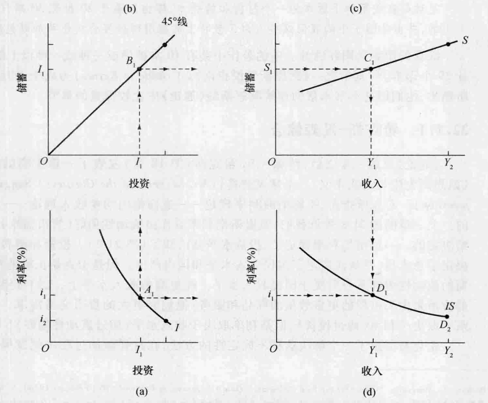
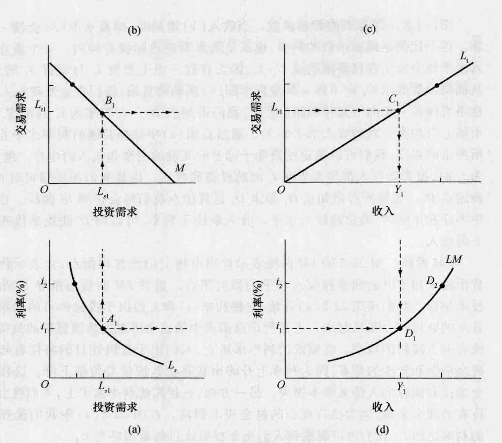
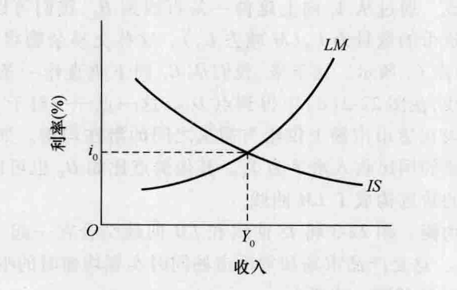
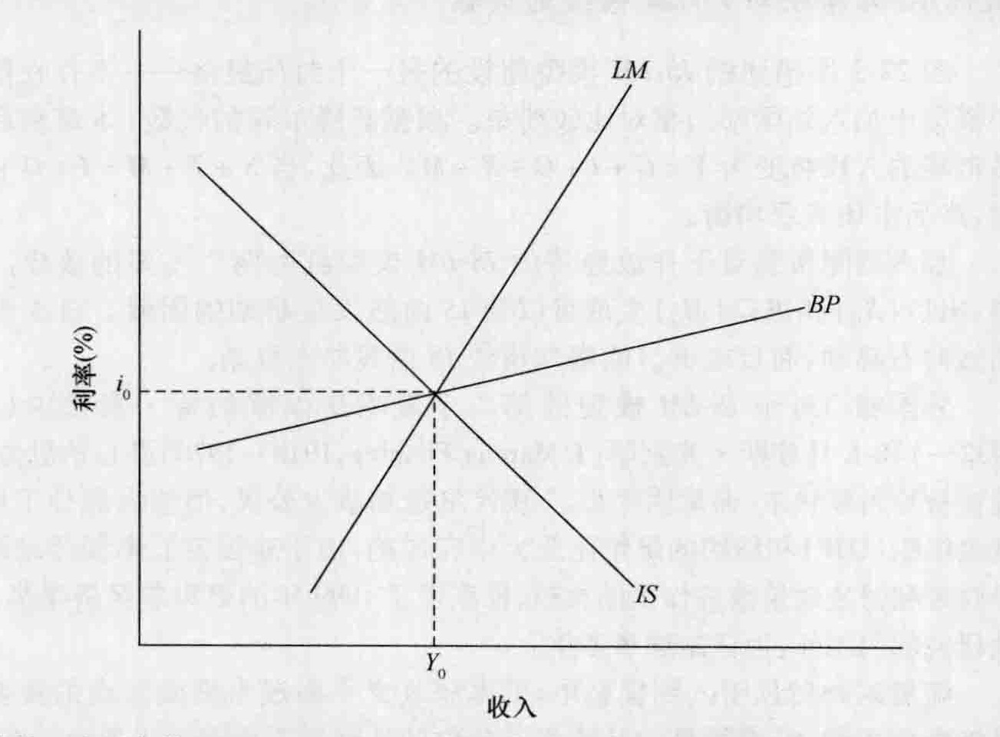
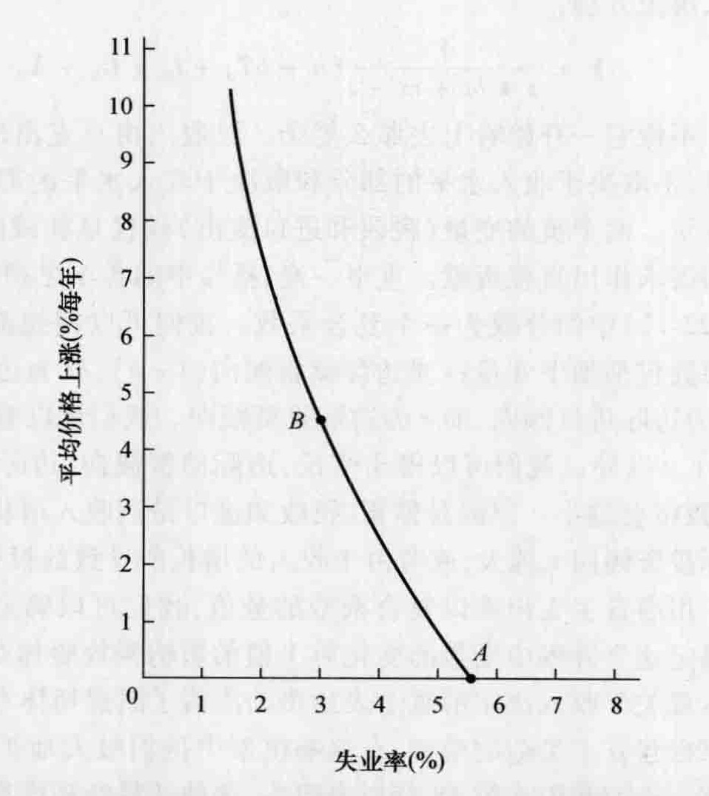
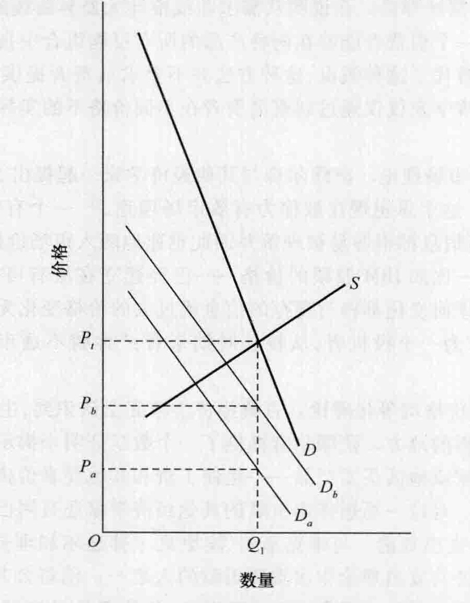
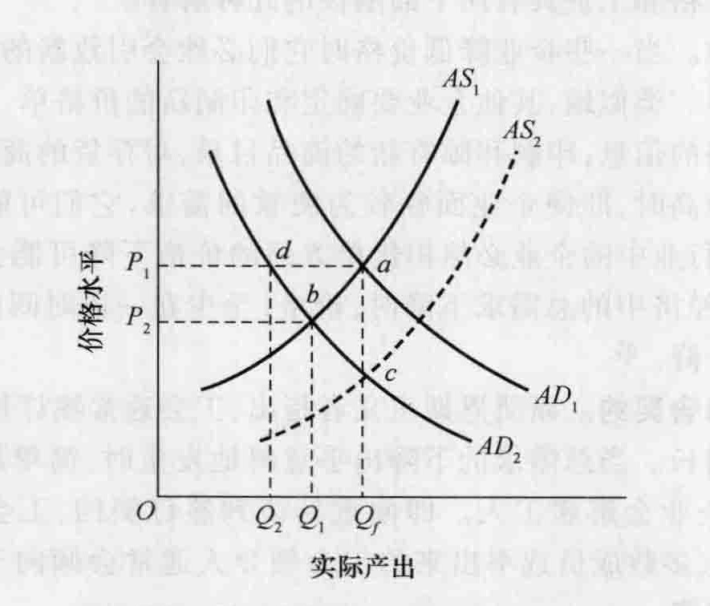

# 第 22 章 凯恩斯学派：凯恩斯之后的发展

几位重要的经济学家将他们理解的凯恩斯的经济学方法直接推进了宏观经济学的主流。其中突出的有阿尔文·H. 汉森和保罗·萨缪尔森。本章的前两节介绍汉森和萨缪尔森的思想。第三节讨论“后凯恩斯主义经济学家”的思想，他们认为现代新古典综合派（凯恩斯的宏观经济学与新古典主义的微观经济学之间的综合）不仅有严重的缺陷，而且不符合凯恩斯本人的思想。最后，我们讨论现代“新凯恩斯主义”经济学家的思想。

## 22.1 阿尔文·H. 汉森

阿尔文·H. 汉森 (Alvin H. Hansen, 1887—1975) 出生于南达科他州的维堡，在那里他在一所只有一间教室的学校里度过了他早期接受教育的岁月。他在苏福尔斯上高中，后来进入杨克顿学院，1910 年毕业。1918 年他从威斯康星大学获得博士学位，之后到布朗大学和明尼苏达大学任教。在明尼苏达大学他出版了《经济周期理论》（*Business Cycle Theory*, 1927），这本书为他赢得了声誉，使他成为全国重要的宏观经济学家之一。

1937 年，凯恩斯出版《通论》后的一年，汉森到哈佛大学任教。在此之前他曾经指出了凯恩斯的《货币论》中的一个数学错误，他对于《通论》的最初反应不太热情。但是随着对凯恩斯的思想体系进行了更深入的研究，汉森很快改变了他的观点。几年中，他和他在哈佛大学的学生将凯恩斯的著作及政策含义作为他们财政政策研讨班的中心话题。参加研讨班的几个人后来对经济学和公共政策作出了重要贡献。研讨班的一位参加者理查德·马斯格雷夫 (Richard Musgrave) 指出：

> 这个研讨班对美国宏观经济学和公共政策未来的发展产生了深远的影响。经济科学的新洞察力和经济萧条的困境相结合给予这次冒险一种独特的重要性。新的工具已经到来了，而且如果运用得当，它们将为失业这一主要问题提供一个解决方案。②

除了马斯格雷夫，汉森的学生还包括一些杰出的经济学家，如埃弗西·多马、约翰·邓洛普、沃尔特·萨伦特、保罗·萨缪尔森、保罗·斯威齐、詹姆斯·托宾和亨利·沃利克。

1941 年汉森出版了《财政政策与经济周期》（*Fiscal Policy and Business Cycles*）一书，这本书支持凯恩斯对于 20 世纪 30 年代宏观经济问题的分析并且赞成政府为了稳定经济而采取的积极而持续的政策。汉森以一直戴着绿色遮阳帽而被注意到，他经常在国会委员会面前证明他的政策观点和凯恩斯的原理。由于他强烈倡导政府干预以促进充分就业，人们称之为“美国的凯恩斯”。但是正如保罗·萨缪尔森指出的：

> 汉森不仅仅是美国的凯恩斯，凭他本身的能力他是一个重要的创新者……当今天学校里的每一个人都在使用非常熟悉的……收入决定的 $C+I+G$ 这一公式时，他不过是在使用如下版本的一个打折扣的版本，即由汉森于 20 世纪 30 年代后期创造的，并由他圈子中的我们这些人为了教育上的应用而将其公式化并加以包装。③

汉森的影响是国际性的。他的著作中共有 10 本被译成一种或一种以上的语言，总计 29 个译本。④ 其中之一《凯恩斯学说指南》（*A Guide to Keynes*）为成千上万的研究生所熟悉，他们用这本书来帮助理解凯恩斯的《通论》中比较深奥的章节。

### 22.1.1 希克斯-汉森综合

《通论》出版一年之后，约翰·R. 希克斯（第 18 章）发表了一篇重要的期刊论文《凯恩斯先生与古典主义：一个建议解释》（*Mr. Keynes and the Classics: A Suggested Interpretation*）。希克斯指出，凯恩斯的利率理论——进而他的均衡收入理论——是不确定的。上一章的图 21-3 告诉我们，凯恩斯把利率看作由流动性偏好（货币需求）和货币供给决定的。一旦市场利率确定了，投资水平就已知了（图 21-2）。投资和消费支出一起决定了总支出，并从而决定了国民收入水平和国内产出。但是希克斯正确地指出，凯恩斯的流动性偏好本身取决于国民收入水平。在更高的收入水平上，人们希望持有更多的货币来购买可得的更多数量的商品和服务；他们有更大的货币交易需求。因此收入水平取决于利率（通过投资），但是利率取决于收入水平（通过流动性偏好）！

希克斯提出了一个解决这种不确定性的方法，在这样做的过程中他发展了一个综合凯恩斯和新古典观点的统一经济模型。汉森在他的《货币理论与财政政策》（*Monetary Theory and Fiscal Policy*, 1949）和《凯恩斯学说指南》的第七章中详细阐述了希克斯的论文。今天我们将希克斯-汉森综合称为 **IS-LM 模型**。IS 代表在乘数调整之后投资 ($I$) 与储蓄 ($S$) 之间相等；LM 代表货币需求 ($L$) 和货币供给 ($M$) 之间相等。在 IS-LM 模型中所有的数值都是实际变量而不是名义变量。

**IS 曲线**。IS 曲线代表使计划投资与计划储蓄相等的所有的利率与收入水平的组合。另一种定义，这一曲线代表产品市场（不同于货币市场）的潜在的均衡点。IS 曲线的推导如图 22-1 所示。为了说明推导过程，我们将从图 (a) 开始，并沿着顺时针方向到图 (b)、(c)、(d)。图 (a) 表示一个假设经济中的投资需求曲线，表明利率 ($i$) 和投资支出数量 ($I$) 之间的反向关系。回想一下这条曲线的位置取决于资本边际效率。假设利率是 $i_1$，然后从曲线上的点 $A_1$ 可以看到投资水平将是 $I_1$。在位于投资需求曲线正上方的图 (b) 中，45° 线使我们既能水平地也能垂直地度量投资支出。从图 (a) 中的点 $A_1$ 向上作一条直线到图 (b) 45° 线上的点 $B_1$，我们能够将投资 $I_1$ 从图 (a) 中的横轴转换到图 (b) 中的纵轴上。

*图 22-1 IS 曲线的推导。说明：图(d)中的 IS 曲线表示储蓄等于投资的所有的利率与收入的组合。它是从图(a)中的投资需求函数、图(b)中的 45° 线和图(c)中的储蓄函数推导出来的。*

图 (c) 表示凯恩斯的储蓄函数。当收入 ($Y$) 增加时，储蓄水平 ($S$) 会按一定比例增加。这个比例是储蓄函数的斜率，也就是凯恩斯的边际储蓄倾向。一个潜在的均衡收入水平将会发生在储蓄函数点 $C_1$ 上，因为在这一点上投资 $I_1$ 与储蓄 $S_1$ 的数量相等。从储蓄函数的点 $C_1$ 向下作一条垂直于图 (c) 横轴的直线，我们将会发现收入为 $Y_1$。将这条直线进一步向下延伸到图 (d) 中，我们得到点 $D_1$。在利率为 $i_1$ 的情况下，在产品市场上与均衡一致的收入水平为 $Y_1$。通过在图 (a) 中选择其他的利率水平并顺着刚才所列出的程序，我们可以确定投资等于储蓄的其他的利率和收入的组合。例如，当利率为 $i_2$ 时，投资和收入都将大于在 $I_1$ 时的投资和收入。因此我们的步骤可以在图 (d) 中确定点 $D_2$。连接所有诸如点 $D_1$ 和点 $D_2$ 这样的点我们将会得到 IS 曲线。在这个例子中不存在单独的、确定的收入水平。收入取决于利率，可以用 IS 曲线来代表任意水平上的收入。

**LM 曲线**。图 22-2 的 LM 曲线表示货币市场上的潜在均衡点；它表示货币供给与货币需求相等时的利率和收入水平的所有组合。推导 LM 曲线与推导 IS 曲线的一般技术相似。我们从图 22-2(a) 开始，它将利率 ($i$) 和人们出于投机性目的所希望持有的货币的数量 ($L_s$) 联系起来。正是货币总需求中的这个因素造成凯恩斯的流动性偏好曲线有向下倾斜的斜率。在较低的利率水平上，人们出于投机性目的将持有较大数量的现金余额和较少的债券，因为利率上升的预期将会造成债券价格下降。这样的上升将会给持有债券的人带来资本损失。另一方面，在较高的利率水平上，人们将会减少他们持有的现金余额，因为持有现金的机会成本很高。在图 22-2(a) 中我们选择一个特定的利率比如 $i_1$，我们可以观察到人们出于投机性目的希望持有 $L_{s1}$。

图 22-2(b) 表示总的货币供给。这条直线向外平行移动表示货币供给的增加。在均衡点上，货币供给的数量 ($M$) 必须等于货币需求的数量 ($L$)。货币需求由投机性目的的货币需求 ($L_s$)——在这个例子中是 $L_{s1}$，和人们需要用来购买产品和服务的货币的数量 ($L_t$) 构成。通过从 $A_1$ 向上延伸一条直线到 $B_1$，我们可以观察到人们出于交易目的而需要的货币的数量为 $L_{t1}$ ($M$ 减去 $L_{s1}$)。这些交易余额将会支持国民收入 $Y_1$，如图 22-2(c) 中的点 $C_1$ 所示。接下来，我们从 $C_1$ 向下垂直作一条直线并且从 $A_1$ 向右水平延伸一条直线，在图 22-2(d) 中得到点 $D_1$。这一点——对于 LM 曲线上的所有的点也都成立——代表在货币市场上供给与需求之间的潜在均衡。如果利率为 $i_1$，实现货币市场均衡所需要的国民收入水平为 $Y_1$。其他的点比如 $D_2$ 也可以通过类似的步骤推导出来。这些点的轨迹构成了 LM 曲线。

*图 22-2 LM 曲线的推导。说明：图(d)中的 LM 曲线表示货币需求与货币供给相等时利率与收入的所有组合。它是从图(a)中的货币的投机需求、图(b)中的货币供给和图(c)中的货币交易需求推导出来的。*

**IS-LM 均衡**。图 22-3 将 IS 曲线和 LM 曲线结合在一起。均衡利率和均衡收入水平是 $i_0$ 和 $Y_0$。这是产品市场和货币市场同时实现均衡时的唯一的利率和收入水平，这是 $S=I$ 且 $L=M$ 的唯一水平。

*图 22-3 均衡利率与均衡收入。说明：均衡利率和均衡收入水平是由 IS 曲线与 LM 曲线的交点所决定的。这是产品市场和货币市场同时实现均衡的唯一的利率与收入组合。*

汉森和其他经济学家证明，很容易将政府支出和税收加入到 IS-LM 模型中，并且用它来分析可供选择的财政政策和货币政策的利率效应和收入效应。将政府支出增加到投资支出水平上，将税收增加到储蓄水平上。这个模型产生了几个有趣的结论，在此我们只列出两个结论。

*   **财政政策使 IS 曲线发生移动**。这种情况是由于支出的变化会使每一利率水平下的收入水平发生改变。例如，政府支出的增加将会使 IS 曲线向右移动，导致利率和收入水平的上升。⑤ 但是，乘数的大小将会小于在简单的凯恩斯情形下的乘数，因为收入的提高将会增加交易所需的货币数量。这将转化为货币需求的增加和一个较高的利率，将会对不增加政府支出时也会发生的一部分投资产生挤出。财政政策的有效性取决于 LM 曲线的弹性。如果它是高度有弹性的，那么 IS 曲线的向右移动将会增加收入而不会导致利率较大幅度地提高。
*   **货币政策使 LM 曲线发生移动**。例如，货币供给的增加，在图 22-2(b) 中由 $M$ 曲线的平行向外移动来表示，将使图 22-3 中的 LM 曲线向右移动。货币供给的增加在提高收入方面的有效性取决于：(1) 利率下降的程度；(2) 投资需求的弹性。如果投资需求是非常缺乏弹性的，IS 曲线也倾向于缺乏弹性，那么利率的下降对投资和收入几乎没有影响。

> **历史借鉴 22-1 蒙代尔-弗莱明对 IS-LM 模型的贡献**
>
> 图 22-3 所描述的 IS-LM 模型假设的是一个封闭经济——不存在国际贸易。在这个模型中加入外国部门相对比较简单。根据萨缪尔森的代数（本章稍后将会提到），产品市场的方程将变为 $Y=C+I+G+X-M$。因此，当 $S+T+M=I+G+X$，而不是 $S=I$ 时，产品市场实现均衡。
>
> 加入国际贸易对于开放经济的 IS-LM 模型具有两个主要的效应。第一个比较简单：出口 ($X_0$) 和进口 ($M_0$) 变成可以使 IS 曲线发生移动的因素。自主出口的增加使 IS 曲线向右移动，而自主进口的增加将使 IS 曲线向左移动。
>
> 外国部门对于 IS-LM 模型的第二个影响是以罗伯特·蒙代尔 (Robert Mundell, 1932—) 和 J. 马库斯·弗莱明 (Marcus Fleming, 1913—1976) 各自的独立贡献为基础的，现在被称为“蒙代尔-弗莱明模型”。* 蒙代尔是加拿大公民，他的大部分工作是在国际货币基金组织 (IMF) 和纽约的哥伦比亚大学完成的，由于对固定汇率和浮动汇率体系下的货币政策和财政政策效应作出的贡献，他获得了 1999 年的诺贝尔经济学奖。弗莱明在 IMF 的研究部门工作，担任副理事多年。
>
> 随着对外贸易引入到模型中，汇率和收支平衡成为需要考虑的重要事项。从美国经济角度来看，汇率衡量的是购买一单位的其他货币需要多少美元。如果汇率上升，为了得到另一种货币需要的美元就更多了，换言之，美元贬值了。
>
> 国际收支平衡账户 (balance of payments accounts) 发生在国与国之间的实物和金融交易。对一个国家来说，实物和金融交易的净流量必须等于零。例如，如果美国进口的商品和服务多于出口（贸易赤字），那么外国人得到的额外的美元最终必定会以某种形式流回到美国，比如通过外国人购买美国拥有的金融资产（储蓄债券）或实物资产（办公大楼）等形式。对于一些美国人来说，为了购买过多的进口，必须购买外国货币，美国的实物或金融资产就必须卖给外国货币的持有者。
>
> 这一切对于 IS-LM 模型意味着，宏观经济一般均衡的实现，除了需要产品市场 (IS) 和国内货币市场 (LM) 的均衡，还需要国际收支平衡 (BP)。如果国际收支不平衡，意味着国家持有过多或过少的外汇储备，那么汇率、利率或者二者同时都必须调整以恢复平衡。蒙代尔-弗莱明模型既适用于固定汇率体系也适用于浮动汇率体系，但是这里为了讨论需要，我们假设汇率是固定的。
>
> 在下面的图中我们引入 BP 曲线，它反映的是与国际收支平衡相一致的收入与利率的各种组合。BP 曲线具有向上倾斜的斜率：当收入提高时，进口的需求也提高。进口增加将导致美元从国内净流出。这将会造成国际收支失衡，除非那些被外国持有的美元返回美国。利率必须提高以吸引外国持有者通过投资于美国金融资产的方式返回这些美元。
>
> 随着 BP 曲线的加入，均衡利率 ($i_0$) 和均衡收入水平 ($Y_0$) 由 IS、LM 和 BP 曲线的交点决定。**
> 
> 
> 
> *IS-LM-BP 模型图*
>
> \* 鲁迪格·多恩布什 (Rudiger Dornbusch) 将蒙代尔和弗莱明在 1976 年各自的独立工作综合起来，且与 IS-LM 模型合并为一个整体。多恩布什称之为蒙代尔-弗莱明模型，正如最通常所知的那样，但是关于是否弗莱明应该列在前面，存在一个小小的争议。具体参见：James M. Boughton, "On the Origins of the Fleming-Mundell Model," *IMF Staff Papers* 50, 1 (2003), 1—6; Robert Mundell, "On the History of the Mundell-Fleming Model: Keynote Speech," *IMF Staff Papers* 47, special issue (2002), 215—227.
> ** 这里假设资本不完全流动（资产不能自由地从一国流向另一国）。如果资本完全流动，BP 曲线就是水平的。对这一问题的可以理解的解释和该模型的其他说明方式，请参考中级水平的宏观经济学教科书。

### 22.1.2 经济停滞主题

汉森和凯恩斯一样担心投资支出将会日益变得不足以使经济达到最大潜力。在其《完全复兴还是停滞？》（*Full Recovery or Stagnation?* 1938）一书中，汉森认为，随着新资本的增加和先进技术的采用，经济的生产能力将会提高。为了使国民收入和产出同步增长，新的投资支出必须不断增长，否则计划储蓄——它是收入的函数——将会超过计划投资，导致经济的实际产出水平下降到潜在产出水平以下。按照汉森的观点，在几十年时间内资本支出年复一年保持充分扩张，使经济保持充分就业并以一个适当的速度增长，是不可能的。人口看起来不再以过去的速度增长，新的地区建立定居点的速度也已大大减缓，技术进步看起来是以一种突发的形式进行的，而不是在一个平稳、可靠的基础上进行，并且也没有新的关键产业比如铁路和汽车登上历史舞台。结果是，投资支出的日益增加是不可能的。

但是，很重要的一点是，我们必须认识到汉森并不是一个马尔萨斯意义上的悲观主义者。汉森相信通过补偿性财政政府能够克服长期经济停滞的趋势。换言之，通过增加支出，政府能够补偿投资的不足并且弥补在私人部门需求和潜在产出（收入）之间的缺口。

回顾一下，汉森对长期经济停滞的担忧与凯恩斯相似，似乎并没有什么根据。在他表达了这一主题之后的几十年间美国经历了强劲的经济增长。然而，从汉森的角度来看，我们可能会发现在这几十年间政府支出占 GDP 的百分比确实增长了。如果没有政府需求的这种相对增长，GDP 的增长率是否会这样高是一个有很多争议的话题。

> **历史借鉴 22-2 阿巴·勒纳与“凯恩斯的方向盘”**
>
> 凯恩斯的《通论》在 1936 年刚一出版，当时在伦敦经济学院的阿巴·勒纳 (Abba Lerner, 1903—1982) 就认识到了它的重要意义并且从那时起他将注意力转移到探索和拓展凯恩斯的宏观经济学上来。1939 年他从伦敦来到美国，在从一所美国大学转移到另一所大学的过程中他发表了许多文章和著作，这些大学包括哥伦比亚大学、密歇根州立大学和加州大学伯克利分校。
>
> 勒纳认为经济就像一个没有方向盘的汽车，在一条宽阔的两边都有路缘的公路上前进。汽车将会撞向一边的路缘，然后转向公路的另一侧，在那儿它将撞向另一边的路缘，这反过来将使汽车再次冲向公路的另一边。为了防止经济周期——即使经济在一条更平稳的路线上运行——社会必须给汽车装备一个方向盘。在《控制的经济学》（*The Economics of Control*, 1944）和《就业的经济学》（*Economics of Employment*, 1951）中，勒纳提出了在萧条和需求拉动型通货膨胀两个极端之间驾驭经济的基本财政政策和货币政策工具。按照勒纳的观点，政府应该遵循**功能财政**的三条规律。*
>
> *   调节政府支出和税收，以便经济中的总需求正好以现行价格足以购买充分就业的产出水平。遵循这一规律将会保证充分就业与价格稳定。因为目标是平衡经济而不是平衡预算，因此如果这个政策导致赤字或者盈余对于政府来说没什么值得担忧的。决不能仅仅因为政府支出超过税收收入就征收，也决不能因为税收收入超过政府支出而减税。
> *   只有改变利率是适宜的时候，才借入货币或偿还国债。从公众手中借入货币会减少货币供给，而偿还国债——购买国库券和债券——会增加货币供给。只有当有必要改变利率并且影响私人投资和消费者分期支出时，才应该采取这些行动。印制钞票能够为试图对付私人支出不充分的预算赤字最好地提供资金。由设计用来减少通货膨胀的财政政策所造成的预算盈余应该被政府持有，而不是用来归还债务。
> *   将必要数量的货币投入流通或撤出流通，以便与按照前两个规律所采取的政策相协调。简而言之，政府必须采取与财政政策协调的货币政策以实现宏观经济目标。
>
> 勒纳的功能财政的规律超出了凯恩斯在其《通论》中所倡导的政策建议。事实上，凯恩斯最初反对勒纳的部分推理逻辑。关于这一点勒纳写道：
>
> > 在 1944 年华盛顿联邦储备委员会的一次会议上，［凯恩斯］对战后可能存在“过多的储蓄”表示了担忧。当我指出政府能够通过赤字［增加支出或减少税收］激发足够多的支出，以增加收入的时候，他起初表示反对，认为这只能导致“更多的储蓄”，并且将我的建议——激发足够的总支出所需要的赤字可以通过增加国债来提供资金——指责为“空话”。（在这儿我必须补充，在我旁边的埃弗西·多马小声说：“他应该读一读《通论》。”一个月之后凯恩斯收回了这一指责。）**
>
> 正如科兰德所说：“最终变成了教科书中的凯恩斯主义政策，在很多方面是勒纳对凯恩斯政策的诠释……”***
>
> \* 被总结于：Tibor Scitovsky, "Lerner's Contributions to Economics," *Journal of Economic Literature* 22 (December 1984), 1559-1560.
> \*\* Abba Lerner, "Keynesianism: Alive, If Not So Well," *Fiscal Responsibilities in a Constitutional Democracy*, ed. James Buchanan and Richard Wagner (Boston: Martinus Nijhoff, 1978), 67.
> \*\*\* David C. Colander, "Was Keynes a Keynesian or a Lernerian?" *Journal of Economic Literature* 22 (December 1984), 1573.

## 22.2 保罗·A. 萨缪尔森

当保罗·A. 萨缪尔森 (Paul A. Samuelson, 1915—2009) 在 1970 年被宣布为荣获诺贝尔奖的首位美国经济学家时，几乎没有人对他的当选表示诧异。对于他的经济学同行和普通公众来说，他是最著名的美国经济学家之一。他不仅为这一领域的无数专业人士所认同，他的《经济学》（*Economics*）教科书对于数百万曾经学习过大学经济学课程的人们来说都是非常熟悉的。萨缪尔森出生于印第安纳州的加里，是波兰移民的后裔，他的父亲是一位药剂师。

萨缪尔森在芝加哥大学获得学士学位以后，进入了哈佛大学学习经济学的研究生课程。在哈佛大学，萨缪尔森在凯恩斯革命一开始就被吸引了，阿尔文·汉森就是他的一位教授。萨缪尔森已经是一位在数学方面的天才学生，很早以前他就决定将数学应用到经济理论的主体中去。他将当时的经济理论描述为：“一个肮脏的马厩，充满了继承来的冲突、重叠和错误。”⑥ 他早期努力的结果是他的博士论文《经济分析的基础》（*The Foundations of Economic Analysis*），于 1947 年出版。在这部直接为他赢得学术声誉的著作中，他使用数学来提出和证明经济学中的主要命题。

获得博士学位之后，萨缪尔森开始寻找一个他能够教学和继续研究的大学。令所有认识这位年轻学者的人吃惊的是，哈佛大学并没有给他安排一个职位，尽管还在是一名研究生的时候他就已经发表了 11 篇文章。萨缪尔森毫不气馁地接受了邻近的麻省理工学院的一个职位。麻省理工学院因在工程和科学方面的卓越而长期享有盛誉，但是在经济学方面它并没有相当的声誉。萨缪尔森很快改变了这一点！

1948 年萨缪尔森出版了他的入门性经济学教科书《经济学》，就像他的《经济分析的基础》在形成经济学命题方面具有创新性一样，《经济学》在传授初级的微观经济学和宏观经济学方面同样被证明具有创新性。自这本书第一次印刷以来（到 2010 年与他人合著的第 19 版），全世界数以百万计的学生从中学习了经济学原理。尽管它已经不再是这一领域的主导性教材，但是几乎所有的在流行程度上超过它的教科书都仍然采用萨缪尔森最初确立的基本说明顺序。

萨缪尔森在最权威的经济学杂志上发表了大量的、范围广泛的论文。这些论文中有些是非常数学化的，很多文章只会引起这个领域其他精通者的兴趣。萨缪尔森并不是一个实证主义者，事实上他称自己是一个喜欢拓展理论而不是检验理论的多面手。

将萨缪尔森归入某一特定的经济学流派是一件非常困难的事情。将他归入关于数理经济学的那一章或者关于福利经济学的那一章都是适宜的。他的文章涵盖了广泛的主题，如消费者行为、线性规划、资本与增长、经济学方法论、经济理论史、福利经济学、公共支出理论、国民收入的决定以及财政政策与货币政策。他的论文结集重新出版达 5 卷之多。

### 22.2.1 乘数-加速数的相互作用

1939 年萨缪尔森发表了两篇论文，在这两篇论文中他确定并探讨了乘数与加速数原理之间的相互作用。这种相互作用已经成为现代经济周期理论的基础之一。这两种思想单独来看都不是什么新思想。从上一章中我们看到，卡恩提出了乘数的概念，凯恩斯将乘数用作他的理论的一个主要特征。约翰·贝茨·克拉克的儿子约翰·莫里斯·克拉克 (John Maurice Clark, 1884—1963) 早在 1917 年就讨论过加速原理。⑦ 他认为，资本品产出和价格的波动要远远大于用它们生产的消费品产出和价格的波动。即使消费品的需求持续增长，增长率的变化将被以加强的力量或者加速的形式传递回资本品部门。因此，对最终产品需求的增长停止将会导致对资本品需求的急剧下降。

汉森意识到在这两个原理之间存在一种相互作用并建议萨缪尔森使用他的数学技巧来探讨这一想法。萨缪尔森使用微分方程证明收入（消费）的变化将取决于边际消费倾向的大小和加速数的大小。前者决定乘数，而后者是由收入增长率的变化所引致的投资支出的变化。萨缪尔森表明，取决于乘数和加速数的数值以及投资增长是否连续，投资最初自发增长会产生一系列结果，包括从收入的非持续增长到收入水平的一直增长。

### 22.2.2 收入决定的简单代数式

中级宏观经济学教科书中的大多数收入决定的代数式都来自萨缪尔森（回想一下凯恩斯的交叉图也是萨缪尔森的一个发明）。为了说明萨缪尔森的方法的实质，让我们从基本的凯恩斯恒等式开始：

$$ Y = C + I + G + X - M \tag{22-1} $$

其中，$Y$ 代表收入，$C$ 代表消费，$I$ 代表投资，$G$ 代表政府购买，$X$ 代表出口，$M$ 代表进口。

消费支出、税收收入、投资支出（由于加速原理）和进口都会随收入增长而增长。它们的增长对收入增长的比率为边际消费倾向、边际税收倾向、边际投资倾向和边际进口倾向。另一方面，政府支出和出口水平都被假设为自主的——即它们的决定独立于收入水平。

这个恒等式中的每一个独立变量都可以用一个方程来表示。最复杂的方程是关于 $C$ 的方程，我们推导如下：

$$ C = a + bY \tag{22-2} $$
$$ C = a + b(Y - T)，\text{或者} \tag{22-3} $$
$$ C = a + bY - bT \tag{22-4} $$
$$ T = T_0 + tY \tag{22-5} $$
$$ C = a + bY - b(T_0 + tY)，\text{或者} \tag{22-6} $$
$$ C = a + bY - bT_0 - btY \tag{22-7} $$

方程 (22-2) 是消费函数，其中 $a$ 是独立于收入水平的消费支出的数额，而 $b$ 是边际消费倾向。总的税前消费 $C$ 等于自主消费水平加上与收入水平相关的消费。后者可以通过用边际消费倾向 ($b$) 乘以 $Y$ 而得到。但是，如方程 (22-3) 所示，收入，进而消费都会因税收的出现而降低。在方程 (22-5) 中，我们可以看到税收由以下两项构成：可能存在的不管收入水平多少而必须支付的税收 ($T_0$) 和随着收入增加而增加的税收 ($tY$)。边际税收倾向为 $t$。通过将方程式 (22-5) 代入 (22-4)，我们可以得到方程 (22-6)。将方程 (22-6) 展开可以得到方程 (22-7)。

用公式表示收入决定还需要的其他方程如下：
$$ I = I_0 + zY \tag{22-8} $$
其中，$I_0$ 是独立于收入的投资，$z$ 是边际投资倾向。变量 $z$ 表示当收入提高时所发生的投资的变化。这就是加速数的概念。其他方程还包括：
$$ G = G_0 \tag{22-9} $$
$$ X = X_0 \tag{22-10} $$
$$ M = M_0 + mY \tag{22-11} $$
其中，$G_0$、$X_0$、$M_0$ 分别表示自主的政府支出水平、自主的出口支出水平和自主的进口支出水平，$m$ 是边际进口倾向。注意总的进口支出取决于收入水平。

将每一个方程代入到基本恒等式 (22-1) 中，并进行各项整理，我们能够推导出如下复杂的收入决定方程：

$$ Y = \frac{1}{s + bt + m - z} (a - bT_0 + I_0 + G_0 + X_0 - M_0) \tag{22-12} $$

这个方程并不像它一开始看上去那么复杂。总收入由总支出决定，反过来总支出又由两部分构成：不取决于收入水平的部分和取决于收入水平的部分。自主支出由括号中的变量来表示。两个负的变量（税收和进口支出）仅仅是扣减的项，它们并不对国内生产的产品的需求作出直接贡献。重申一遍，括号中的各项之和是经济中总的自主支出。

方程 (22-12) 中的分数为一个复合乘数。我们可以回想起简单的乘数为 $1/MPS$。这个复合乘数包括如下变量：$s$ 是边际储蓄倾向 ($1-b$)，$bt$ 为边际消费倾向乘以边际税收倾向，$m$ 为边际进口倾向，而 $z$ 为边际投资倾向。我们可以看到分母中的所有变量都是正的，除了 $z$ 以外。我们可以得出结论，边际储蓄倾向、边际税收倾向和边际进口倾向越大，乘数将会越小。原因是储蓄、税收和进口是当收入增长时会从收入流中发生的漏出。边际投资倾向 $z$ 越大，或者由于收入的增长所导致的投资的增长越大，复合乘数也会越大。用净自主支出乘以复合乘数的数值，我们可以确定总均衡收入 $Y$。我们建议你通过确定这个方程中变量的变化对 $Y$ 值的影响来检验你对这个模型的理解。

萨缪尔森关于收入决定的数学表达帮助澄清了凯恩斯体系中错综复杂的内容。其他经济学家也建立了类似的模型，在这些模型中他们极大地扩展了方程的数量并且加入了估计值。正如我们在第 18 章所表明的，这种计量经济模型被用来预测国民收入的变化。

萨缪尔森的代数式也证明，复合乘数小于那些只建立在边际储蓄倾向基础上的乘数。例如，在今天复杂的凯恩斯主义计量经济模型中，支出乘数大约在 2.2 至 2.7 之间变化。

### 22.2.3 菲利普斯曲线

回想一下，勒纳曾经提出存在以下这种可能性，即过早的通货膨胀，或者在经济达到“充分就业”之前就发生通货膨胀。1958 年，伦敦经济学院的 A. W. 菲利普斯 (A. W. Phillips) 运用英国在 1861 年到 1957 年之间经验数据揭示了失业与货币工资变化率之间的关系。这些数据的几何表示后来被称为菲利普斯曲线。1960 年，萨缪尔森和罗伯特·索洛绘制了一幅美国的菲利普斯散点图，从中他们初步估计了 1960 年经济中的菲利普斯曲线（图 22-4）。他们写道：

> 所有的这些都表示在我们经过价格水平调整的菲利普斯曲线中（图 22-4）。对应于价格稳定的点 $A$，可以看到它包括大约 5.5% 的失业率；而对应于 3% 的失业率的点 $B$，我们可以看出它包括大约每年 4.5% 的价格上涨……在这儿我们没有涉及以下重要问题，即哪些可行的制度改革可能被引入，以减轻充分就业与价格稳定之间的不和谐。当然，这些制度改革可能涉及这样一些范围广泛的议题，比如指导价格和工资管制、反工会与反托拉斯立法，以及希望设计能够使美国的菲利普斯曲线向下和向左移动的许多其他措施。⑧

*图 22-4 萨缪尔森和索洛绘制的 1960 年的美国的菲利普斯曲线。说明：1960 年萨缪尔森和索洛撰文指出：“这条（曲线）表示在不同程度的失业和价格稳定之间的选择菜单，它是从过去 25 年美国的数据中初步估计出来的。”*

萨缪尔森曾经将菲利普斯曲线称为我们这个时代最重要的概念之一。其潜在的经济逻辑是什么？社会应该将曲线上的哪一点作为其目标？哪些政策可能使曲线向内移动？随着时间的变化曲线是稳定的吗？什么因素导致 20 世纪 70 年代的散点图远远位于这条曲线的右上方？长期菲利普斯曲线有可能是完全垂直的吗？这些问题及相关问题成为 20 世纪 60 年代和 70 年代宏观经济分析的焦点。

### 22.2.4 其他贡献

萨缪尔森单独，或者与他人合作，提出了许多其他的重要经济学思想。以下所列举的远没有穷尽他的全部贡献。

*   **比较静态**。经济理论建立在均衡思想的基础上。给定一组力量，就像在供给与需求模型中那样，将会达到一种没有偏离的趋势的状态。这是一种静态情形。一旦我们允许这种力量发生变化——比如，人们的收入——那么我们将会拥有一种动态情形。最终，将会达到一种新的均衡。萨缪尔森的比较静态方法比较两种均衡状态，而不考虑调整的路径。在 1947 年当他形成比较静态方法的时候，他就清醒地意识到这个问题的一个重要部分被遗漏了——关于调整路径的信息。但是比较静态方法使一个人能够对调整路径作出推断。
*   **显示偏好理论**。在说明从需求曲线推导无差异曲线的过程中，希克斯和其他经济学家假设一个消费者能够在两种产品的所有可能组合中指定他的偏好。萨缪尔森以另一种方法替代了这种假设，这种方法并不要求消费者提供关于他的偏好的信息。这种方法使经济学家仅仅通过观察消费者在不同价格下的实际购买行为就能够重构无差异曲线。
*   **有效市场理论**。萨缪尔森与其他经济学家一起提出了“合理预期的价格随机波动”的概念。这个思想现在被称为有效市场理论。⑨ 一个有效的金融市场是这样的市场：所有的新信息都很容易被理解并因此迅速地融入市场价格中去。因此，任意现存的市场价格——比如 IBM 股票的价格——已经建立在所有可得的信息基础上。资产价格接下来的任何变化都将与现存的信息或过去的价格变化无关。这个理论的一个有趣的含义是，作为一个投机者，从较长时期来看：“你猜不透市场，也没有很容易得到的收获。”⑩
*   **要素价格均等化理论**。古典经济学家完全认识到，生产要素将会流向它们能够赢得最高价格的地方。萨缪尔森提供了一个数学证明来揭示产品的流动——在产品产地之外的国家或地区买卖产品——是使工资和其他要素价格的差异缩小的对要素流动的一种替代。对这一思想作出贡献的其他经济学家还有阿巴·勒纳与伯蒂尔·俄林。
*   **公共支出理论**。与维克塞尔、埃里克·林达尔和理查德·马斯格雷夫一起，萨缪尔森是对公共支出理论作出重要贡献的人之一。他将公共产品定义为“进入两个或两个以上人的效用的产品”。这一思想是，公共产品具有消费外部性 (consumption externalities)——它的收益是不可分割的。从不同角度看，为额外一个消费者提供这种收益的边际成本为零，而且不可能将不付费的使用者从获得这种收益中排除出去。因为不管消费者是否为公共产品付费，他们都能从中获益，所以潜在的购买者没有激励显示他们的真实偏好。结果，市场需求将不足以为生产者提供充分的收益以补偿他们的成本。简而言之，从这种意义上讲，市场是失灵的，它无法提供那些边际社会收益超过边际社会成本的产品。

至少从理论上来讲，公共产品的最优数量应该如何确定？萨缪尔森和其他经济学家通过提出蕴含在图 22-5 中的思想回答了这个问题。假设只有两个消费者埃弗里和贝克，他们对于某一特定公共产品的需求曲线分别是 $D_a$ 和 $D_b$。这些曲线是虚假的需求曲线，因为这些消费者在市场上并没有显示他们的真实偏好。整个市场的虚假的需求曲线为 $D$。它是通过垂直加总 $D_a$ 和 $D_b$ 而推导出来的，而不是在私人产品情形中的那种水平加总。埃弗里和贝克都消费全部数量的公共产品，对于公共产品他们愿意支付的共同价格为他们每个人愿意支付的数额之和。公共产品的最优数量 ($Q_1$) 是由市场需求和市场供给曲线 $D$ 和 $S$ 的交点所决定的。能够补偿成本的价格是 $P_t$，它是价格 $P_a$ 与 $P_b$ 之和。从福利角度来看 $Q_1$ 是最优的，因为边际社会收益（由曲线 $D$ 上相关的点来表示）等于边际社会成本（由曲线 $S$ 上相关的点来表示）。因此，政府应该提供 $Q_1$ 单位的公共产品。

*图 22-5 公共产品的最优数量。说明：尽管公共产品的需求曲线 ($D$) 不能在市场中自己显示出来，但是从理论上我们可以通过垂直加总每一数量上的个人的意愿支付曲线（这里是 $D_a$ 和 $D_b$）而得到它。公共产品的最优数量由点 $Q_1$ 表示，因为在这一产出水平上边际社会收益（如曲线 $D$ 上相关的点所示）等于边际社会成本（如曲线 $S$ 上相关的点所示）。*

## 22.3 后凯恩斯主义者

由于萨缪尔森和其他经济学家的努力，与新古典主义的微观经济学原理结合在一起的凯恩斯主义的宏观经济学原理最终进入了主流经济学。并不是所有的凯恩斯主义的学者都接受这种新古典综合。有些人既否定对于凯恩斯的 IS-LM 解释，也不接受标准的微观经济学。这些后凯恩斯主义批评者中的主要成员是英国剑桥的一群经济学家，包括皮耶罗·斯拉法（第 17 章）、尼古拉斯·卡尔多 (Nicholas Kaldor, 1908—1986)、琼·罗宾逊（第 17 章）和路易吉·帕西内蒂 (Luigi Pasinetti, 1930—)。约翰·K. 加尔布雷思（第 19 章）、西德尼·温特劳布 (Sydney Weintraub, 1914—1983) 和许多其他的经济学家在美国对这一思想流派作出了重要贡献。许多后凯恩斯主义者充分吸收了波兰经济学家米哈尔·卡莱茨基 (Michal Kalecki, 1899—1970) 的工作，卡莱茨基在 1933 年曾先于《通论》提出了一个“类似于凯恩斯主义的”总就业理论。在《后凯恩斯主义经济学杂志》（*Journal of Post-Keynesian Economics*）中可以找到许多现代后凯恩斯主义学者所做的研究。

### 主要信条

后凯恩斯主义者由一群规模较小但风格迥异的经济学家组成。这个团体中的每个个体的一些思想与其他人所表达的思想都有所不同。然而，我们可以从这一系列思想中辨别出一些基本信条。

*   **新李嘉图主义的生产、价值和分配观**。1960 年，皮耶罗·斯拉法出版了《用商品生产商品：经济理论批判绪论》（*Production of Commodities by Means of Commodities: A Prelude to a Critique of Economics*）一书，这本书以一种现代的形式重构了李嘉图的生产和价值理论。按照斯拉法的观点，对各种产品的需求模式并不影响价格模式，而只会影响每一产业的产出规模。产品的实际价值（价格）取决于生产它们所必需的其他商品的份额。相对价值（价格）和利润（如果工资给定）由生产一件复合标准商品所使用的生产技术决定，而一件复合标准商品由经济中的基本商品构成。这些基本商品是进入到所有其他商品的生产中的产品，它们在本质上是“资本品”，既以投入的形式也以产出的形式出现。复合标准商品的关键特征是无论工资还是利润的变化对投入的影响，正好和它对产出的影响方式相同。因此，斯拉法说，复合标准商品是李嘉图难懂的不变的价值或相对价格的尺度。
    对于我们即将进行的讨论特别重要的是，斯拉法的理论产生了一个新颖的结论：国内产出水平与它如何在工资和利润之间进行分配完全无关，而任一种工资与利润的分配都是与特定的产出水平相一致的。
    罗宾逊和其他的后凯恩斯主义者扩展了斯拉法的非传统主题。他们认为，收入在工资和利润之间的实际分配将取决于阶级斗争、变更分配的公共政策以及投资率（较高的投资率将会提高利润份额）。罗宾逊认为由社会来控制收入分配是可取的并且是可能的。这可以通过投资社会化、生产资料的公共所有权、收入政策（控制工资和价格的政府政策）来实现。罗宾逊相信这些政策都坚定地植根于对凯恩斯的《通论》的正确解释之中。从这个角度她称自己为“左翼凯恩斯主义者”。她写道：
    > 你可能几乎要说我是典型的左翼凯恩斯主义者。在《通论》出版较长时间以前我就从中得出了偏左的而不是偏右的结论（我有这样一种优势地位，因为我是凯恩斯写作《通论》期间与他一起工作的一群朋友中的一位）。因此，我是第一滴进入标着‘左翼凯恩斯主义者’的瓶子的水滴。并且，今天我仍然占据着这个瓶子相当大的一部分空间，因为在此期间剩余的绝大部分已经漏掉。⑪
*   **加成定价**。价格是由寡头垄断企业制定的。这些企业主要是用留存利润来为投资提供资金。为了达到它们希望的利润水平并因此实现它们的投资计划，寡头垄断者会将价格设定在当前的成本之上。因此，价格“并不反映当前的需求条件；而是满足企业认为计划投资支出所必需的资金需求，如果企业将要调整其生产能力以充分满足预期的未来需求”。⑫ 当成本上升时，企业会提高它们的价格以保持它们在价格之上的加成。
*   **内生货币**。与费雪（第 16 章）和弗里德曼（第 24 章）所持有的观点相反，后凯恩斯主义者认为货币存量从本质上来说是内生于经济的，随着工资水平的变化而变化。贸易的需求决定货币的供给。凯恩斯本人指出货币“是与债务一起形成的”。
    通货膨胀产生于因收入分配份额所进行的斗争。工资的增长引起生产成本上升，造成就企业方面而言对营运资本的更大需求，以便为更加昂贵的半成品和存货提供资金。因此，企业借入资金会上升，货币存量会增加。
*   **显著的周期性不稳定**。经济不稳定是固有的。投资必须充分增长以保证国民收入和产出以一个稳定的比率增长。由于经济景气环境和不景气环境的交替出现，投资经常无法达到这一增长。当投资少于保持稳定增长率所必需的数量时，经济就会衰退，失业就会上升。
*   **收入政策的必要性**。收入政策限制平均年工资收入的增长，使之不至于提高到与国民生产年增长率相当的程度。类似地，企业在能提高多少价格方面也受到限制。一项成功的收入政策要能够抑制通胀，弱化由通胀引起的收入再分配效应，并且能够避免反通胀财政政策和货币政策造成的产出损失。根据后凯恩斯主义的观点，为了收入份额而进行的“阶级斗争”和寡头垄断者的加成定价使得一个持久的收入政策是有必要的：
    > 如果持后凯恩斯主义观点的经济学家们可能在一点上达成一致，这一点就是通货膨胀无法通过传统的财政和货币政策工具加以控制。这是因为他们认为通货膨胀并不一定是由于对产品的“过度需求”而引起的，相反是由于对可以获得的收入和产出分配的更加根本的冲突引起的。传统的政策工具，通过削减经济活动的水平，只会减少可以用于分配的收入和产出的数量，从而会加深潜在于通货膨胀过程中的社会冲突……正是由于这个原因，后凯恩斯主义的经济学家不会提出收入政策是否必要的问题，而通常会转移到一项收入政策如何能够更加有效和公平地运转的问题上来。⑬

## 22.4 新凯恩斯主义者

大多数现代的凯恩斯主义者拒绝接受后凯恩斯主义者的新李嘉图主义的价值理论。他们也不接受后凯恩斯主义者的收入政策的倡议，他们引述了由于这些政策导致的资源错误配置，以及在减少通货膨胀方面进行工资和价格控制在历史上鲜有成功来支持他们的观点。⑭

**价格与工资的向下刚性**

现代凯恩斯主义的宏观经济学家从事的研究范围比后凯恩斯主义者更为狭窄。新凯恩斯主义的理论家将注意力再次集中到了为什么会发生萧条这一传统的凯恩斯主义问题上来。他们的回答是总需求的下降导致实际产出的下降以及相应的失业增加，因为价格水平和名义工资具有向下刚性。图 22-6 说明了价格与工资这一向下调整黏性的重要性。

*图 22-6 新凯恩斯主义：价格与工资刚性。说明：按照新凯恩斯主义者的观点，有些因素，如菜单成本、正式与隐含契约、效率工资以及“局内人-局外人”关系导致了价格与工资的向下刚性。结果是，总需求的下降，比如从 $AD_1$ 下降到 $AD_2$，会使经济从点 $a$ 移动到点 $d$，而不是如古典经济学和新古典宏观经济学所预测的那样从点 $a$ 到点 $b$ 再到点 $c$。这将会导致持续的、长期的低产出和高失业，总供给曲线无法自动向右移动，除非政府采取扩张性的财政政策与货币政策来提高总需求。*

为了便于说明，我们首先假设价格与名义工资是完全弹性的，同时假设总需求从 $AD_1$ 下降到 $AD_2$ 而总供给仍保持在 $AS_1$。因此，价格水平从点 $a$ 的 $P_1$ 下降到点 $b$ 的 $P_2$，而实际产出将暂时从充分就业下的水平 $Q_f$ 下降到小于充分就业下的产出 $Q_1$。这一较低的价格水平和较多的失业将使生产者能够减少他们的名义工资，以便使实际工资保持不变。随着名义工资的下降，总供给曲线将会向右移动，最终从 $AS_1$ 移动到虚线 $AS_2$。在总需求 $AD_2$ 和总供给 $AS_2$ 的交点 $c$ 处，实际产出回到 $Q_f$ 而衰退将自动结束。这一过程仅仅是描述了古典学派与新兴古典学派（第 24 章）的观点。经济能够自动纠正，因此政府的稳定政策是不必要的。

但是，新凯恩斯主义者强调如果价格和名义工资在一段时间内是向下刚性的，那么情况就会完全不同。总需求从 $AD_1$ 下降到 $AD_2$ 不会使经济迅速从点 $a$ 到点 $b$ 再到点 $c$，而会使经济从点 $a$ 移动到点 $d$，而实际产出将会从 $Q_f$ 下降到 $Q_2$。因为工资具有向下刚性，所以与实际产出 $Q_2$ 相联系的失业将会持续下去，直到总需求返回 $AD_1$。可能有必要采用积极的财政政策和货币政策才能使总需求曲线向右移动。

新凯恩斯主义的经济学家，如斯坦福大学的约瑟夫·斯蒂格利茨 (Joseph Stiglitz)、哈佛大学的奥利弗·布兰查德 (Oliver Blanchard)、麻省理工学院的斯坦利·费希尔 (Stanley Fisher)、加州大学伯克利分校的乔治·阿克洛夫 (George Akerlof)、斯德哥尔摩的阿萨·林德贝克 (Assar Lindbeck) 和西北大学的罗伯特·戈登 (Robert Gordon)，提出了关于价格和工资具有向下的刚性的几种解释。

**菜单成本**。当一些企业降低价格时它们必然会引致新的成本，比如，一家餐厅必须印制新的菜单。类似地，其他企业要确定和印制新的价格单，也许通过新广告来向顾客传递较低价格的信息，印制和邮寄新的商品目录，对存货的商品重新定价。当诸如此类的菜单成本较高时，即使企业面临较为疲软的需求，它们可能也不愿意降低价格。同时，寡头垄断行业中的企业必然担忧单方面的价格下降可能会引起对手更大幅度的降价。因此，当经济中的总需求下降时，价格（至少在一段时间内）可能会保持不变，而产出和就业会下降。⑮

**正式与隐含契约**。新凯恩斯主义者指出，工会通常签订长期合同，其中包含必要的名义工资的增长。当总需求的下降出乎意料地发生时，简单地降低工资不是一个好的选择；相反，企业会解雇工人。即使重新谈判签订契约，工会通常也会强烈反对工资“减让”。由大多数成员选举出来的工会领导人通常会倾向于解雇少数人而不是降低大多数人的工资。

尽管许多非工会的工人不在正式或明显的契约下工作，但这些工人可能在**隐含契约**下工作，隐含契约是非正式协议或“看不见的握手”。⑯ 一个通常的默契可能是在产品需求疲软时期企业将保持现有的名义工资。这种反对降低工资的“保险”可能会对企业有利，因为能够使企业吸引到只需较少监督的高素质的工人。作为对不降低工资这种保证的回报，工人们实际上保证不去挑战企业由于产品需求下降而解雇工人的权利。

如果正式和隐含契约遍及工作场所，那么随着总需求的下降工资的下降就不会到来。就图 22-6 而言，经济将会从点 $a$ 移动到点 $d$，衰退将会发生。

**效率工资**。效率工资是高于市场出清的工资，它能够最小化雇主所雇用的每一单位有效劳动服务的工资成本。通常我们会认为市场工资就是效率工资。但是，当管理和监督工人的成本较高，或者人员变更比较多时，企业可能会发现高于市场的工资将会降低他们的劳动成本。在工人看来，较高的工资会提高工作的相对价值；它也会提高被解雇或离开的成本。逃避职责或被解雇的较高的机会成本（价格），或者自愿离开这个工作的较高的机会成本，将会导致较少的逃避职责和人员的变更，两者将一起提高生产力。

支付效率工资的企业并不愿意由于总需求的下降而降低工资率，因为降低工资会鼓励逃避职责和增加辞职人员的数量，降低生产力并且增加企业的单位劳动成本。简而言之，降低工资将会弄巧成拙。⑰ 从这个方面来看，效率工资可能有助于解释工资的向下刚性和周期性失业。

**局内人-局外人理论**。在阿萨·林德贝克的黏性工资“局内人-局外人模型”中，“局内人”是指具有一定市场力量的被雇用的工人，“局外人”是指不能够或不愿意以低于现有工资率获得就业机会的失业者。⑱ 局外人可能不能叫价低于现有的工资，因为雇主可能会认为雇用他们的成本太高，雇主可能非常有理由担心其他获得较高工资的工人将把这些代替的工人看作是在“偷窃工作”。如果获得较高工资的“局内人”在团队生产中拒绝与新来的获得较低工资的人进行合作，那么企业的产出和利润将会受到影响。

即使企业愿意以低于现有工资的水平雇用“局外人”，但是这些失业的人们可能不愿意在低于现有工资的水平上提供服务。即他们可能会担心来自获得较高工资的雇员的侵扰。因此，“局外人”可能会保持失业状态，等待总需求的增加以重新获得就业机会，而不是降低现有的工资数量等级以获得工作。在总需求不足和周期性失业的情况下，工资将会具有向下的刚性。

> **历史借鉴 22-3 关于大衰退的几种理论**
>
> 2007 年，美国经济进入自大萧条以来最严重的衰退。真实 GDP 下降了 5.1%，失业率从 4.4% 上升到 10.1%。与二战后的大多数大衰退不同，这次是由严重的金融危机导致的。大衰退的严重性再次引发了对经济衰退起因以及如何更好解决的长期争论。
>
> 正如上两章所述，凯恩斯主义框架将经济衰退归因于由投资支出波动导致的有效需求（即总需求）不足。恢复充分就业状态要刺激总支出，通常要采用扩张性的财政政策和货币政策。
>
> 凯恩斯主义的思想已经完全融入现代主流理论中，在大衰退中又赢得了再生，但是其他的解释，有些长期“休眠”的理论也再次出现了。
>
> 奥地利学派的后裔、1974 年诺贝尔奖获得者之一弗里德里希·A. 哈耶克 (Friedrich A. Hayek, 1899—1992)，用企业家的失误导致错误投资来解释经济衰退（他的“繁荣与破产循环”中的“破产”）。
>
> 对经济危机的每一种解释都必然包含企业家行为失误的假设。但事实上企业家即使犯错，也很难成为经济危机的充分解释。导致全盘皆输的错误方案不太可能出现，除非我们能表明为什么企业家总是在同一个方向、同一个时段上犯错误。
>
> 对哈耶克来说，央行设定的极低的利率给企业传递了错误的信号，鼓励了资本品的同时过度投资。投资的繁荣造成企业产能过剩，当产出减缓时经济就到了破产的边缘。为了阻止这种趋势，哈耶克的药方是，货币增长中性——货币供给的改变能满足贸易的需要，但又不引起价格的变化。当破产发生时，扩张性的货币政策和财政政策使资源配置失调，这样可以最好地避免破产。在前期经济繁荣时期，美联储的宽松货币政策和信用极度扩张，造成了低利率状况，与哈耶克对继而发生的经济衰退的解释不谋而合。
>
> 后凯恩斯主义者海曼·明斯基 (Hyman Minsky, 1919—1996) 的“金融不稳定性假说”主要关注经济周期波动中投机性泡沫的作用。明斯基区分了三种类型的借款者：(1) 套利借款者，即那些能够偿还本金和利息的人；(2) 投机借款者，即那种能偿还利息但必须再借款才能偿还本金的人；(3) 庞氏借款者，即那些无力偿还本金和利息，只能依赖资产价值上涨才能避免拖欠的人。在任何时点上，这三类借款者的共同作用将影响金融体系的稳定性，从而影响经济全局的稳定性。正如明斯基所说：
>
> > 金融不稳定性假设的第一定理是，在一些金融体系下经济是稳定的，在另一些金融体系下经济是不稳定的。第二定理……经过一段长时间的繁荣，经济会从有助于稳定系统的金融体系转向有助于不稳定系统的金融体系。
> >
> > 特别是，好时期过多延长，资本主义经济将趋向于从套利金融主体主导的金融结构，转向由投机和庞氏金融主体主导的结构。**
>
> 当存在过多的投机借款者和庞氏借款者时，整个体系就将是“明斯基时刻”，此时投资者被债务压垮，被迫出售资产还债，引起资产价格下跌。资产价格下跌迫使更多的庞氏借款者出售资产，这加剧了资产价格的进一步下跌。资产泡沫破灭。伴随着这类事件发生不可避免的贷款违约，致使金融体系流动性短缺，私人部门维持或增加消费及投资的能力受到严重削弱。***
>
> \* Friedrich A. Hayek, "Price Expectations, Monetary Disturbances and Malinvestments," *Readings in Business Cycle Theory* (Homewood, IL: Richard D. Irwin, Inc., 1951), 354. 关于其理论的更完整阐述，参见：F. A. Hayek, *Prices and Production* (London: G. Routledge & Sons, 1935) [orig. pub. in 1931].
> \*\* Hyman P. Minsky, "The Financial Instability Hypothesis," *Working Paper No. 74* (May 1992), 7—8. 更完整的讨论，参见：Minsky, *John Maynard Keynes* (Columbia University Press, 1975); *Stabilizing an Unstable Economy* (Yale University Press, 1986).
> \*\*\* 查尔斯·金德尔伯格 (Charles Kindleberger, 1910—2003) 记录了世界历史上几次严重的资产泡沫的形成过程，参见他的著作：*Manias, Panics, and Crashes: A History of Financial Crises*, 5th ed. (Palgrave Macmillan, 2005) [orig. pub. in 1978]. 在他的研究中还有对大部分经济模型中的假设特征——市场及其参与者的合理性作了重要讨论。

---

① 大量的其他经济学家也帮助发展了现代凯恩斯主义经济学，但由于篇幅所限我们无法讨论他们的思想。这些人中有四位因他们的努力而获得诺贝尔奖，他们是詹姆斯·托宾、劳伦斯·克莱因、佛朗哥·莫迪利亚尼 (Franco Modigliani) 和罗伯特·索洛。对早期的凯恩斯主义作出重要贡献的美国经济学家还包括詹姆斯·杜森伯里、阿瑟·奥肯和沃尔特·赫勒。

② Richard A. Musgrave, "Caring for the Real Problems," *Quarterly Journal of Economics* 90 (February 1976), 5. 对汉森的财政政策研讨班的进一步介绍，参见：Walter S. Salant, "Alvin Hansen and the Fiscal Policy Seminar," *Quarterly Journal of Economics* 90 (February 1976), 14—23.

③ Paul A. Samuelson, "Alvin Hansen as a Creative Economic Theorist," *Quarterly Journal of Economics* 90 (February 1976), 25, 31.

④ William Breit and Roger L. Ransom, *The Academic Scribblers*, rev. ed. (Chicago: Dryden, 1982), 84.

⑤ 政府支出的增加可以通过在图 22-1(b) 中在 45° 线上画一条平行的直线来表示，新的直线和 45° 线之间的垂直距离表示政府支出水平。

⑥ H. W. Wilson Company, *Current Biography Yearbook*, 26 (University of Michigan: H. W. Wilson Company, 1966), 357.

⑦ John M. Clark, "Business Acceleration and the Law of Demand," *Journal of Political Economy* 25 (March 1917): 217—235.

⑧ Paul A. Samuelson and Robert M. Solow, "Analytical Aspects of Anti-Inflation Policy," *American Economic Review* 50 (May 1960), 192—193.

⑨ 另一位对这一思想作出主要贡献的经济学家是佛朗哥·莫迪利亚尼。

⑩ Paul Samuelson and William D. Nordhaus, *Economics*, 12th ed. (New York: McGraw-Hill, 1985), 288.

⑪ Joan Robinson, *Collected Economic Papers*, 5 vols. (Cambridge, MA: MIT Press, 1980), 4, 264.

⑫ Peter Kenyon, "Pricing," in *A Guide to Post-Keynesian Economics*, ed. Alfred S. Eichner (White Plains, NY: M. E. Sharpe, 1979), 40.

⑬ Eichner, *A Guide to Post-Keynesian Economics*, 17—18.

⑭ 参见：Alan Blinder, *Economic Policy and the Great Stagflation* (New York: Academic Press, 1979), chapter 6.

⑮ 关于菜单成本的更多研究，请参见：N. Gregory Mankiw and David Romer, eds., *New Keynesian Economics* (Cambridge, MA: MIT Press, 1991).

⑯ 对这个专题的大部分文献请参见：Costas Azariadis and Joseph E. Stiglitz, "Implicit Contracts and Fixed-Price Equilibria," *Quarterly Journal of Economics* 98 (suppl. 1983), 1—22.

⑰ 关于这个问题的更多研究，请参见：George A. Akerlof and Janet L. Yellen, eds., *Efficiency Wage Models of the Labor Market* (Cambridge: Cambridge University Press, 1986).

⑱ Assar Lindbeck and Dennis Snower, *The Insider-Outsider Theory of Employment and Unemployment* (Cambridge: Cambridge University Press, 1988).

## 复习与讨论

1.  解释下列名词，并简要说明其在经济思想史中的重要性：汉森，财政政策研讨班，IS-LM 分析，经济停滞主题，补偿性财政，勒纳的功能财政，萨缪尔森，加速数，菲利普斯曲线，显示偏好理论，公共支出理论，斯拉法，后凯恩斯主义者，新凯恩斯主义者，菜单成本，正式与隐含契约，效率工资，局内人-局外人理论。
2.  评论凯恩斯的下列表述：“我知道汉森在美国以美国的凯恩斯而著名；我可能应该被认为是英国的汉森。”
3.  是什么促使希克斯和汉森提出了 IS-LM 分析？解释财政政策如何能够使 IS 曲线向右移动。解释货币政策怎样能够使 LM 曲线向左移动。在每一种情形下均衡收入与均衡利率将会发生什么变化？
4.  勒纳的功能财政理论（历史借鉴 22-1）与他所表达的如下论断是如何联系在一起的：
    “当然我们没有方向盘！”［汽车的］一位乘客非常愤怒地说道……“假设我们有方向盘并且当我们撞向路缘的时候有人握住它！他将阻止方向盘的自动转向，汽车肯定会翻掉！”
5.  就哪方面而言储蓄、税收和进口支出之间是类似的？解释为什么复合乘数倾向于比简单凯恩斯乘数小？
6.  解释为什么必须将个人需求曲线垂直加总以获得公共产品的总需求曲线，而对于私人产品而言却是将它们水平加总。
7.  批判性地评价艾克纳和克雷格尔的如下观点：后凯恩斯主义理论的目的是“解释经验观察到的现实世界”，而新古典理论的目的是“证明如果现实世界与模型相似那么社会是最优的”。
8.  按照新凯恩斯主义者的观点，当经济面临总需求下降时它为什么不能自我纠正？
9.  在哪些方面新凯恩斯主义者与后凯恩斯主义者的观点不一致？
10. 哈耶克和明斯基关于经济衰退的解释（历史借鉴 22-3）是对立的还是互补的？如果在某种程度上是互补的，这是否意味着哈耶克和明斯基在怎样最好地阻止和修正衰退方面达成了一致？请解释。

---

## 精选文献

**书籍**

Eichner, Alfred S., ed. *A Guide to Post-Keynesian Economics*. White Plains, NY: M. E. Sharpe, 1979.
Hansen, Alvin H. *Business Cycle Theory: Development and Present Status*. Boston, MA: Ginn & Co., 1927.
——. *Fiscal Policy and Business Cycles*. New York: W. W. Norton, 1941.
——. *Full Recovery or Stagnation?* New York: W. W. Norton, 1938.
——. *A Guide to Keynes*. New York: McGraw-Hill, 1953.
Lerner, Abba P. *The Economics of Control: Principles of Welfare Economics*. New York: Macmillan, 1944.
——. *Economics of Employment*. New York: McGraw-Hill, 1951.
Lindbeck, Assar, and Dennis Snower. *The Insider-Outsider Theory of Employment and Unemployment*. Cambridge: Cambridge University Press, 1988.
Mankiw, N. Gregory, and David Romer, eds. *New Keynesian Economics*. Cambridge, MA: MIT Press, 1991.
Samuelson, Paul A. *The Collected Scientific Papers of Paul Samuelson*, 5 vols. Vols. 1 and 2 edited by Joseph E. Stiglitz, vol. 3 edited by Robert Merton, vol. 4 edited by Hiroki Nagatani and Kate Crowley, vol. 5 edited by Kate Crowley. Cambridge, MA: MIT Press, 1966, 1972, 1977, 1986.
——. *Foundations of Economic Analysis*. Cambridge, MA: Harvard University Press, 1947.
Sraffa, Piero. *Production of Commodities by Means of Commodities: Prelude to a Critique of Economic Theory*. Cambridge: Cambridge University Press, 1960.

**期刊论文**

Barber, William J. "The Career of Alvin Hansen in the 1920s and 1930s: A Study in Intellectual Transformation." *History of Political Economy* 19 (Summer 1987), 191—205.
Colander, David. "Was Keynes a Keynesian or a Lernerian?" *Journal of Economic Literature* 22 (December 1984), 1572—1575.
Gordon, Robert J. "What Is New-Keynesian Economics?" *Journal of Economic Literature* 28 (September 1990), 1115—1171.
Hicks, J. R. "Mr. Keynes and the Classics: A Suggested Interpretation." *Econometrica* 5 (April 1937), 147—159.
*Quarterly Journal of Economics* 40 (February 1976). This issue contains articles on Hansen by Richard A. Musgrave, Gottfried Haberler, Walter S. Salant, Paul A. Samuelson, and James Tobin.
Samuelson, Paul A. "A. P. Lerner at Sixty." *Review of Economic Studies* 31 (June 1964), 169—178.
——. "Interaction between the Multiplier Analysis and the Principle of Acceleration." *Review of Economics and Statistics* 21 (May 1939), 75—78.
Samuelson, Paul A., and Robert M. Solow. "Analytical Aspects of Anti-Inflation Policy." *American Economic Review* 40 (May 1960), 177—194.
Scitovsky, Tibor. "Lerner's Contributions to Economics." *Journal of Economic Literature* 22 (December 1984), 1547—1571.