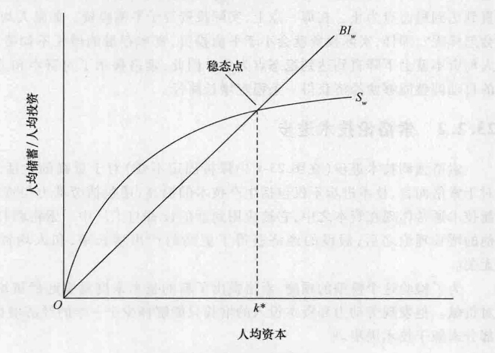
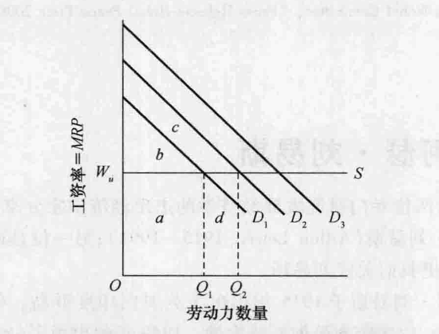

# 第 23 章 经济增长与经济发展理论

有几个学派的追随者和一些类似的折中主义的思想家对经济增长和经济发展思想作出了重大贡献。经济增长是指随着时间的变化一个国家的实际产出 (GDP) 的增长。它是由以下三个原因导致的：(1) 更大数量的自然资源、人力资源和资本；(2) 资源质量的改进；(3) 提高生产力的技术进步。

当一个国家实际产出的增长快于其人口增长时，其实际人均 GDP——即一个国家的生活水平——将会上升。经济发展是指随着时间的变化一个国家提高其生活水平的过程。经济发展方面的专家分析在低收入和中等收入国家中导致或阻碍生活水平提高的各种力量和政策。

特别是自 1945 年以来，在经济增长和经济发展方面出现了大量的学术成果。这有以下几个原因。第一，国家之间的经济增长非常不同。为什么一些国家的增长远快于其他国家？第二，发达工业化国家通过稳定政策和更加富有弹性的市场而克服了经济萧条时期的严重过剩。因此，强调的重点又转移到获得更高增长率的途径上来。第三，大多数贫穷国家，许多在二战前曾经是殖民地，现在实现了政治独立，并正在寻求促进经济增长与发展的战略。这些曾经被称为“落后的”或“不发达的”国家，现在被称为“发展中的”或“新兴的”国家。第四，东欧和苏联社会主义的解体使这些地区的注意力集中到了增长与发展方面。前社会主义国家能够使它们的经济向资本主义转型并实现更快的经济增长吗？最后，发展中国家生活水平的提高对于工业化发达国家来说在经济上变得日益重要，尤其在直接投资、国际贸易和国际金融方面。

本章我们将考察经济增长和发展的五种不同的分析。首先我们将讨论由哈罗德和多马所提出的凯恩斯主义的增长模型。然后我们将考察索洛的新古典增长模型。随后我们将分析熊彼特的经济发展和制度变迁理论。之后我们将讨论纳克斯和刘易斯，二人都对经济发展作出了开创性贡献。

## 23.1 罗伊·F. 哈罗德爵士与埃弗西·多马

罗伊·F. 哈罗德爵士 (Sir Roy F. Harrod, 1900—1978) 和埃弗西·多马 (Evsey Domar, 1914—1997) 分别对我们今天所谓的哈罗德－多马经济增长作出了重要贡献。他们在我们前两章所讨论的凯恩斯主义的框架内提出了他们的理论，因此他们都属于广义凯恩斯学派的成员。1947 年，英国人哈罗德在伦敦大学的一系列讲演中提出了他的思想。① 同一年，多马在《美国经济评论》(*American Economic Review*) 上发表了一篇包含相似理论的论文，多马后来在约翰斯·霍普金斯大学和麻省理工学院任职。② 由于这些理论都得出了相似的结论并有些复杂，因此我们只讨论多马的增长模型。③

### 23.1.1 投资的生产能力创造效应

多马指出，净投资支出会增加一个国家的资本存量，提高经济的生产能力，并提高其潜在的收入水平。他认为，生产能力的变化 $\Delta Y_q$ 将取决于投资水平 $I$ 和“新投资潜在的社会平均生产力”$\sigma$。用公式来表示，即：

$$ \Delta Y_q = I\sigma \quad (23\text{-}1) $$

为了说明多马的重要观点，让我们假设 $\sigma$ 的值为 0.3。这告诉我们每一美元的投资支出将会提高经济的生产能力，使之产生 30 美分的未来收入。同时我们假设储蓄倾向（边际储蓄倾向＝平均储蓄倾向）为 0.2。如果均衡收入为 5000 亿美元，那么储蓄将为 1000 亿美元 ($0.2 \times 5000$ 亿美元)。因此，净投资必然也是 1000 亿美元，因为在均衡收入水平上投资必然等于储蓄。这 1000 亿美元的投资将使经济的生产能力和潜在收入提高 300 亿美元 ($0.3 \times 1000$ 亿美元)。如果在下一个时期中收入仍然保持在 5000 亿美元，那么经济中将会出现生产能力闲置和失业。投资会扩展一个国家生产产出和产生收入的能力。

### 23.1.2 投资的需求创造效应

因为在凯恩斯模型中消费函数被假设为稳定的，所以只有收入的增加才会引起消费支出的增加。结果，投资支出是总需求从一个时期到下一个时期增长的源泉。如果上一时期投资所导致的潜在收入增加要实现，新时期的投资支出必须超过上一时期的投资数量。公式 (23-2) 给出了有效需求所必需的增长。

$$ \Delta Y_d = \Delta I \times \frac{1}{\alpha} \quad (23\text{-}2) $$

其中，$\Delta Y_d$ 是收入的变化，$\Delta I$ 是净投资支出的变化，$\alpha$ 是储蓄倾向，系数 $1/\alpha$ 是第 21 章所讨论过的简单凯恩斯投资乘数。

### 23.1.3 平衡增长的要求

多马将平衡增长定义为一种随着时间的变化可以保持资源的充分利用的收入增长率。当生产能力的变化 [公式 (23-1) 中的 $\Delta Y_q$] 等于有效需求的变化 [公式 (23-2) 中的 $\Delta Y_d$] 时，可以实现平衡增长。

$$ \Delta Y_q = \Delta Y_d \quad (23\text{-}3) $$

将前面的 $\Delta Y_q$ 和 $\Delta Y_d$ 的值代入公式 (23-3) 可以得到公式 (23-4)。

$$ I\sigma = \Delta I \times \frac{1}{\alpha} \quad (23\text{-}4) $$

将公式 (23-4) 两边同时乘以 $\alpha$ 然后除以 $I$，我们可以得到公式 (23-5)。

$$ \frac{\Delta I}{I} = \sigma\alpha \quad (23\text{-}5) $$

这样多马得出了他的主要结论。为了保持经济中资源的充分利用，经济必须增长。为了实现与收入能力增长相匹配所必需的收入增长率，投资必须增长，并且每年以等于投资的潜在社会平均生产力 $\sigma$ 和储蓄倾向 $\alpha$ 乘积的百分比增长。

在我们前边的例子中，收入必须从 5000 亿美元增长到 5300 亿美元 (6 个百分点)。因为储蓄倾向为 0.2，所以乘数为 5 (1/0.2)。为了使收入能够增长 300 亿美元，因此投资必须增长 60 亿美元 (300 亿美元/5)。上一年度的投资是 1000 亿美元，这一年度它必须是 1060 亿美元，即它也必须增长 6 个百分点 (60 亿美元/1000 亿美元)。通过公式 (23-5) 我们可以确认这一事实。从中我们可以看到，这一比率 (0.06) 等于 $\sigma$ 乘以 $\alpha$，或者等于资本的生产力 (0.3) 和储蓄倾向 (0.2) 的乘积。每一项的数值越大，必需的投资增长率也就越大。

多马和哈罗德不相信年度投资增长能够自动充足以保持充分就业。因此，他们的模型加强了凯恩斯主义的这一结论：经济不稳定是固有的。事实上，他们的模型暗示经济是处于一个“刀刃”之上。如果投资没有以必需的或有保证的比率增长，那么经济将会衰退。另一方面，如果投资支出的增长超过了必需的或有保证的比率，将会发生需求拉动型通货膨胀。④

## 23.2 罗伯特·M. 索洛

罗伯特·M. 索洛 (Robert M. Solow, 1924—) 出生于纽约的布鲁克林，1951 年从哈佛大学获得博士学位。他的整个学术生涯都是在麻省理工学院度过的，在那里他有时会与保罗·萨缪尔森合作。1979 年，他当选为美国经济学会的会长；1987 年，由于他早期在经济增长方面所做的研究，被授予诺贝尔经济学奖。

索洛对经济学的几个方面都作出了重要贡献，包括线性规划、宏观经济理论、环境经济学和劳动经济学。多年来，他一直捍卫新古典微观经济学与以凯恩斯主义为基础的宏观经济学的主流综合，与货币主义、后凯恩斯主义以及近来的新兴古典宏观经济学的支持者展开学术争论。考虑到他自己描述的“折中的凯恩斯主义和新凯恩斯主义的观点”，有些讽刺意味的是他的宏观经济增长理论是植根于新古典主义而不是凯恩斯主义。

### 23.2.1 索洛的增长理论

1956 年索洛发表了一篇重要的分析经济增长的文章。与暗示经济增长路径从本质上是不稳定的哈罗德－多马理论不同，索洛的理论支持新古典主义的观点，即经济可以进行内部调整以达到稳定均衡的增长。索洛的增长理论包括几个主要因素。⑤

**生产、劳动力和平衡投资**。索洛通过设定一个总生产函数来开始他的分析，在这个总生产函数中，技术是固定不变的，而总产出取决于资本存量和劳动投入。在短期中，给定一个固定的资本存量，劳动力的增加会产生收益递减；而给定固定数量的工人，资本的增加也会如此。在长期中，生产函数表现为规模报酬不变。如果资本和劳动力都增长，比如说都增长了 1 个百分点，那么产出（和收入）也将增长 1 个百分点。

让我们假设劳动力的增长每年以不变的比率 $n$ 增加。因此，劳动力会增加 $nN$，其中 $N$ 是在一年开始的时候劳动力的规模。比如，如果 $n$ 是 0.01（或者 1 个百分点）而 $N$ 是 2 个亿，那么经过一年，劳动力会增长 200 万 ($0.01 \times 2$ 亿)，并且在下一年度开始的时候劳动力将为 2.02 亿。

如果每个工人的人均资本数量要保持不变，那么资本存量 $K$ 的增长速度必须等于劳动力的增长速度 $n$。当然，资本存量的增长也就是净投资（总投资减去折旧）。因此，净投资每年必须增长 $nK$ 以等于劳动力的增长 $nN$。比如，如果像我们已经假设的那样 $n$ 是 0.01，资本存量为 30 万亿美元，那么净投资为 3000 亿美元 ($0.01 \times 30$ 万亿美元)。资本存量增加 3000 亿美元正好足以使每个工人的人均资本的数量保持不变。我们将这一必需的投资数量称为平衡投资，因为它正好平衡了劳动力与资本存量的增长，保证每个工人的人均资本数量保持不变。

**储蓄与实际投资**。索洛假设储蓄是收入的一定比例 ($MPS = APS$)。每年经济参与者会将收入的一部分 $s$ 用于储蓄，将收入的一部分 $1-s$ 用于消费。储蓄率 $s$ 和收入水平 $Y$ 共同决定了总储蓄 $sY$。例如，如果 $s$ 是 0.2（或 20 个百分点）并且收入为 2 万亿美元，那么总储蓄将是 4000 亿美元 ($0.2 \times 2$ 万亿美元)。因为净投资会吸收经济中所有的储蓄，所以实际投资也是 $sY$。实际投资是一年中实际即将发生的净投资的数量并且它始终等于储蓄的数量。

**稳态点**。在图 23-1 中，我们将索洛增长理论的主要因素结合在一起，其中所有的变量都被转换为“每个工人为基础”。每个工人的**人均储蓄**（等于每个工人的**人均投资**）用纵轴来度量，而每个工人的人均资本用横轴来度量。因为技术是固定不变的，所以工人的人均产出只取决于人均资本的数量。

*图 23-1 索洛的增长理论*

> 按照索洛的观点，经济趋向于一个稳态点。在这一点上实际投资（用曲线 $S_w$ 衡量）等于平衡投资（用直线 $BI_w$ 衡量）。平衡投资是保持资本存量以与劳动力相同的增长速度增长所必需的投资数量。如果实际投资大于平衡投资，人均资本将会上升；如果实际投资小于平衡投资，人均资本将会下降。当人均资本为 $k^*$ 时，资本存量、劳动力和产出三者的增长率相同。

图 23-1 中的直线 $BI_w$ 代表平衡投资。它表示为了维持人均资本水平所必须发生的每人均投资的数量。相反，人均储蓄曲线 $S_w$ 表示在每一人均资本数量下所发生的实际人均投资。曲线 $S_w$ 的形状反映收益递减。人均储蓄以一个递减的比率增长，因为每增加一单位的人均资本对产出和收入的增加所作的贡献就会越小。产出和收入的增加越来越小，用一个固定的储蓄率来相乘，意味着储蓄的增加也就越来越小。因为净投资等于储蓄，所以随着人均资本的增加实际投资以一个递减的比率增长。

曲线的交点是一个稳态点，在这一点上实际投资等于平衡投资。在这一稳态点上，每个工人的人均资本为 $k^*$，人均产出、劳动力、总储蓄和净投资的增长率都相等。在 $k^*$ 上，经济处于一条均衡、稳态增长的路径上。现有的实际产出的增长率（图中未标出）将会持续下去。

索洛承认实际投资最初可能会小于或大于平衡投资。不管哪种情况，索洛都认为，经济将会调整它所使用的资本与劳动的相对数量，直到实际投资等于平衡投资为止。这种资本对劳动的替代或劳动对资本的替代在哈罗德－多马增长模型中被遗漏了。

为了理解这一调整过程，在图 23-1 中首先考虑人均资本水平低于 $k^*$ 的情况。可以观察到实际投资（由曲线 $S_w$ 决定）大于平衡投资（由直线 $BI_w$ 决定）。因此，资本存量的增长要快于劳动力的增长，而人均资本的数量将会上升。这个过程将会持续下去直到达到稳态点为止。在那一点上，实际投资等于平衡投资。如果人均资本大于 $k^*$ 将会怎样呢？那样，实际投资就会小于平衡投资，资本存量的增长不如劳动力的增长快。人均资本就会下降直到达到稳态点为止。因此，索洛揭示了对资本和劳动的相对使用的自动调整能够使经济获得一条稳定增长路径。

### 23.2.2 索洛论技术进步

索洛强调技术进步（在图 23-1 中保持固定不变）对于更高的生活水平的重要性。对于索洛而言，技术进步不仅包括生产技术的提高，还包括劳动力与资本质量的改进。新技术通常体现在资本之中，它被应用到新的设备与工厂中。索洛将技术进步引入到他的增长理论之后，假设的经济获得了更高的产出增长率，和人均资本数量的增长无关。

为了检验这个模型的预测，索洛提出了新的技术来度量引起经济增长各要素的相对贡献。他发现劳动力和资本投入的增长只能解释少于一半的经济增长。他认为其余部分来源于技术进步。⑥

## 23.3 约瑟夫·阿洛伊斯·熊彼特

### 23.3.1 生平及所受影响

约瑟夫·阿洛伊斯·熊彼特 (Joseph Alois Schumpeter, 1883—1950) 是一个纺织厂主的儿子，出生于奥地利的摩拉维亚省（现在是捷克共和国的一个地区），在维也纳大学接受了法律和经济学教育。他从事过几年的法律工作，讲授过政治经济学，1913 和 1914 年是哥伦比亚大学的交换教授。正是在这一时期他和韦斯利·C. 米切尔开始了他们长期的友谊。在第一次世界大战期间，他毫不掩饰他是和平主义者以及支持英国、反对德国的情感。1919 年他曾短暂担任奥地利共和国的财政部长。1921 年他成为维也纳一家具有极高声誉的私人银行的行长。在 1924 年德国严重的通货膨胀之后这家银行破产，他重新返回了学术界并且接受了波恩大学的一个教授职位。从 1932 年直到去世，他都在哈佛大学任教，并且担任美国经济学会的会长，这是第一次由出生于美国之外的经济学家获得这一殊荣。他的《经济发展理论》(*The Theory of Economic Development*, 1911)、《资本主义、社会主义与民主》(*Capitalism, Socialism, and Democracy*, 1942)，以及在他去世之后由他妻子编辑的百科全书式的《经济分析史》(*History of Economic Analysis*, 1954)，是他巨大学术成就中的杰出典范。

在熊彼特的一生中对其产生学术影响的最重要的两个人物是莱昂·瓦尔拉斯与卡尔·马克思。从瓦尔拉斯那里，熊彼特得出了他对于经济数量之间的相互依存的强调。熊彼特强烈反对马克思主义，但他非常钦佩马克思对经济变迁过程的理解。熊彼特非常忠实于资本主义制度，并且非常警觉地看待资本主义的成功引起的各种力量，因为他认为它们将会毁灭资本主义制度。他赞同马克思关于资本主义将会崩溃的观点，尽管他出于不同的原因并且带有非常巨大的遗憾。

### 23.3.2 经济发展和经济波动

熊彼特构建了一个理论体系来解释经济周期和经济发展理论。经济变迁的关键过程是引入创新，而最主要的创新者是企业家。创新被定义为提供商品的方式的变化，比如引入新的产品或者新的生产方式；打开新的市场；控制原材料或半成品的新的供应源；或者实行一种新的产业组织，比如创造一个新的垄断或者打破一种垄断。创新不仅仅是发明。如果发明在一开始就失败了——即如果它没有被应用——那么发明就不是创新。只有当一项发明被应用于工业过程的时候，才能成为一种创新。

企业家是那些执行新的组合、引入创新的人。并不是所有的企业领导者、管理者或实业家都是企业家，他们有些人可能在从不尝试新思想或者新的做事方式的情况下经营企业。企业家也不是风险承担者，这一功能留给了股东，股东通常是资本家而不是企业家。企业家可能与个人企业只有暂时的联系，作为其融资者或者发起人。但是在引入新的产品、新的生产过程和新的企业组织形式，或者在进入新的市场方面他们始终是开拓者。他们是具有特殊能力的人们，能够把握其他人会忽视的机会，或者能够通过他们自己的勇敢和想象力创造机会。

如果没有创新，经济生活将会达到静态均衡，并且年复一年经济的循环流动将会沿着大体相同的路径进行。利润和利息将会消失，财富的积累将会停止。通过创新寻求利润的企业家能够将这种静态的情况转化为动态的经济发展过程。企业家将会打破这种循环流动并且将劳动力和土地转移到投资中去。因为由循环流动所产生的储蓄是不充足的，所以企业家依靠信贷为他的企业提供生产资料。由此所导致的经济发展来源于经济体系本身，而不是由外部强加的。

创新并不会连续发生，但是会聚集发生。最具有进取心和冒险精神的企业家的活动会创造一种有利的氛围，其他企业家会追随他们。信用扩张，价格和收入上升，而繁荣会普遍盛行。但不会永远这样下去。经济繁荣会产生对其持续前进不利的条件。价格的上升会阻碍投资，新产品与旧产品的竞争会导致企业损失。当企业家清偿债务，通货紧缩的过程会进一步加强，萧条将会取代繁荣。因此，经济波动代表了对创新的适应过程。经济体系趋向于均衡，除非创新会经常打破这一趋势。产生经济发展的过程也产生了经济波动，每一次萧条都代表向新均衡的艰难移动。

### 23.3.3 资本主义的衰落

熊彼特相信资本主义已经在走向衰落。但是他并不同意大多数经济学家对这种衰落的确切本质方面的看法。他反对李嘉图所强调的报酬递减的作用，以及马尔萨斯的人口原理，这两者一般被认为是阻挠进步的。他也否定马克思关于经济矛盾将产生持续的、严重的危机的观点。他也反对凯恩斯在一些领域的停滞思想。大的创新的机会并没有穷尽；创新变为资本积累的趋势还没有被令人信服地证明；尽管新兴国家的开放进程已经完成，其他的机会还会出现；最后，出生率的下降可能会变得非常重要，但它并不能解释 20 世纪 30 年代的事件。

熊彼特写道，如果资本主义制度继续其在 1928 年以前刚建立 60 年间的增长模式，我们无须过多干预资本主义的进程，就将能够实现社会改革者的目标。但这将是不可能的。熊彼特认为资本主义的经济和社会基础已经开始崩塌，原因是：(1) 企业家作用的荒废；(2) 保护性政治阶层的毁灭；(3) 资本主义社会制度框架的损毁。

**企业家作用的荒废**。企业家作用正在逐渐荒废，因此资本主义的经济和社会基础正在崩塌。创新正在退化为例行程序。技术进步逐渐变成团队的工作，这个团队由训练有素的专家组成，他们知道什么是必要的，并且按照可测的方法行事。经济进步正在变成非个人化的、自动的。办公室和委员会的工作替代了个人行动。企业家不再有机会投身于争论中，他们变成了不难替代的经理，仅此而已。这使得熊彼特得出结论：“既然资本主义的企业，凭借其突出的成就，正在变为自动化的进步。我们得到的结论是，它正在使其自身变成多余的——在其自身成功的压力下将变成碎片……社会主义的真正领跑者不是鼓吹社会主义的知识分子或煽动者，而是范德比尔特、卡内基和洛克菲勒。”⑦

**政治阶层的毁灭**。曾经为资本主义社会提供最强有力保护的政治阶层的毁灭是资本主义体系自我灭亡的第二个原因。熊彼特赞同马克思的观点，认为大企业毁掉了中小企业。在民主政治中，这个过程削弱了产业资产阶级的政治地位，因为大量的小企业主比少数经理人和大股东更有政治力量。股票替代了建筑和设备，这削弱了连接，并且也削弱了“在经济、体力、政治方面，如果必要，愿意为了‘他’的工厂及其控制权而奋斗到死的意愿”……去物质化、非功能化。不在所有者，不会像形式的财产那样强加或者唤起道德忠诚。最终没有人真正关心自己代表着谁——在真正关心的区域内外都没有人。

熊彼特说，资本主义甚至创造、教化、资助了一个知识分子群体，在社会动荡的时期赋予了他们利益。知识分子对实际情况并没有直接责任，他们是旁观者，然而他们拥有演讲和写作的话语权。他们维护自身权利的主要机会是他们实际的或潜在的损害社会的价值。公众讨论的自由包括对资本主义的社会基础吹毛求疵的自由，知识分子阶层别无他法，只会吹毛求疵，因为它就靠批评生存。那些没有专业工作而又反对体力工作的大学毕业生，充斥着那些不满足的阶层，他们将其不满足归因于资本主义的社会秩序，心生仇恨。知识分子也遍布于劳动者队伍中并且煽动那些劳动者，以赢得那些内心对他们存在质疑的人的支持。

**制度框架的损毁**。动摇资本主义基础的第三个原因在于资本主义社会制度框架的损毁。基于其对 20 世纪 30 年代的欧洲和美国的观察，熊彼特得出的结论是，反对资本主义的政策降低了利润预期，减少了投资和创新。这些政策包括：税收是如此之高且累进，以至于阻碍了私人积累，反过来抑制公共支出；劳动立法将工资、工时、工厂纪律等问题转移到政治层面；在控诉的威胁之下对大企业的行为进行了严格的规制。

在这种条件下，公共收入的获取将自动成为永久性的，与理论强调的框架无关，该理论认为基于内生于资本主义社会的储蓄－投资过程，公共收入是必然的。这种制度毫无疑问地仍然可以被叫作资本主义。但它是在氧气帐篷里的资本主义，由人工装置维持存活，创造过去成功的所有功能已经瘫痪。因此为什么它应该被保持存活的问题必然在短时间内会提出来。⑧

熊彼特将政府支出看作政府投资计划的永久性政策，即成为需要基于政治考量而采取的投资决策。这种“指导下的资本主义”，隐身为“国家资本主义”而成为民族主义所采取的措施。在其国家资本主义中，政府拥有和管理特定的产业部门，控制劳动力市场和资本市场，严重干预本土企业和外国企业。不管这是否被称为社会主义，按照熊彼特的观点，这种状态将会招致摩擦和无效率，但可以通过回归纯资本主义或者前进至完全的社会主义而得以消除。另一方面，他认为国家资本主义可能保留一些很高的人类价值，而这些人类价值在其他制度中则可能会被损害。

> ### 历史借鉴 23-1 熊彼特、创造性破坏与反托拉斯政策
>
> 标准的新古典主义竞争的观点认为许多销售相同产品或相似产品的企业之间进行竞争。当某一特定行业中的企业获得高额利润时，新的企业就会进入。这种进入会增加产品的供给，产品供给的增加会降低产品价格并使利润降低到正常水平。因此，竞争有利于消费者，它形成的价格刚好足以支付生产者的边际生产成本和平均生产成本并包括正常利润。竞争有利于社会，它引导社会资源配置到具有最高价值的用途上。
>
> 在这种新古典主义的竞争观点中，垄断对于消费者和社会是有害的。垄断者制定高于竞争价格的价格，这导致了小于竞争产出水平的产出和对被垄断产品的资源配置不足。由于这些原因，国家制定了反托拉斯法律，禁止占有主导地位的企业从事下列行为，如排挤竞争对手的定价、要求消费者仅仅购买它们的产品、购买或兼并竞争对手以及遏制潜在竞争者的进入等。美国曾经使用反托拉斯法来打破或限制有嫌疑的垄断者的活动，比如标准石油 (1911 年)、美国铝公司 (1945 年)、施乐复印机 (1975 年) 以及美国电话电报公司 (1982 年)。1998 年美国政府对微软公司提起了反托拉斯诉讼，指控微软公司在个人电脑操作系统市场上不公平地利用垄断来遏制相关市场上的竞争。
>
> 关于竞争和垄断熊彼特采取了一种更加长远的观点。他强调竞争是一个长期过程，在这一过程中企业会通过发展完全新的产品和新的生产过程来进行竞争。在长期中，垄断本身无法持续下去，因为垄断价格和利润会为竞争性的企业家生产新产品和发现新的生产方法创造一种强有力的激励。这种企业家创新最终将会导致创造性破坏；在破坏现有的垄断势力的同时它会创造新的产品和生产方法。正如熊彼特所言：
>
> > 在资本主义的现实中……它是……来自新产品、新技术、新的供给来源和新的企业组织类型的竞争——支配着决定性的成本或数量优势，而且不仅对现有企业的利润空间造成冲击甚至会对它们的基础和它们的命脉造成冲击。这种竞争是……如此……重要以至于通常意义上的竞争发生作用是否迅速成了一件相对不重要的事情；在长期中增加产出和降低价格的强有力的杠杆无论从何种意义上来说都是由其他材料所制成的。
>
> 关于竞争与垄断的这一长期观点的政策含义与新古典主义观点是不同的。如果创造性破坏是动态资本主义的一个不可避免的部分，那么某一行业的垄断化是不值得忧虑的。最终，新的企业家将会发展出新的产品和方法，从而使旧的垄断企业不造成危害。历史事例：航空和卡车破坏了铁路的垄断地位，电影为现场表演的剧院带来了新的竞争，CD 和磁带取代了密纹唱片。按照熊彼特的观点，政府没有必要去打破或限制一个现有的垄断企业，因为垄断是动态的、长期竞争过程的一部分。所有的垄断都是暂时的，除非政府本身保护它们。
>
> 大多数现代经济学家认为创造性破坏能够发生，而且确实也偶尔发生了。但是他们怀疑它是否在所有的情况下都会不可避免地发生。如果不受法律的阻碍，通过采取行动来获得对新的和创新性产品的控制或阻止它们的发展，垄断者能够“建立起暴风雨的庇护所……以保护他们自己不受创造性破坏风暴的袭击”……。例如，当新的竞争对手出现时就尽快买断就是这样一种行动。通过阻止这样的反竞争性的行动，反托拉斯政策不仅有利于短期效率，同时也有利于长期的创造性破坏过程。

### 23.3.4 回顾熊彼特

从今天的角度来看，很显然熊彼特和在他之前的马克思一样，对于资本主义的近期未来过于悲观。自从熊彼特写作的时代以来，资本主义在世界上的大部分地区保持了扩张与繁荣。最近企业家精神在世界范围内非常兴盛，正如非常成功的创业企业和与个人电脑、通信、基因工程以及互联网相关的主要创新所表明的那样。

因此，熊彼特对经济学的总体贡献主要不在于他关于资本主义长期命运的观点，而在于他强调了企业家和创新在实现经济增长方面的重要性。大部分由企业家进行的新的和改进的技术的商业化解释了发达工业化国家经济增长的大部分。

## 23.4 拉格纳·纳克斯

拉格纳·纳克斯 (Ragnar Nurkse, 1907—1959) 出生于爱沙尼亚。在 20 世纪 30 年代早期他全家移居加拿大，他曾经在爱丁堡大学和维也纳大学学习。作为国际联盟的一名职员，他发表了几篇杰出的国际经济学方面的研究论文。第二次世界大战以后，他接受了哥伦比亚大学的教授职位并且一直待在那里，直到当他在日内瓦休假时过早去世。

纳克斯重新强调了外部经济的重要性：所进行的投资越多，每项投资也就变得更加可行。因此，低收入经济要求一个宽广层面上的进步，与此同时伴随着产业扩张，这些产业能够相互支持并增加成功的机会。巨大的困难在于这些国家的贫穷限制了它们的资本形成。

### 23.4.1 贫困的恶性循环

纳克斯问道，为什么有些国家一直贫困？他的答案的核心是“贫困的恶性循环”：

> “贫困的恶性循环”……当然暗含着一系列循环作用的力量，它们趋向于以相互作用并反复作用这样一种方式致使一个贫困的国家处于一种贫困状态。这种循环力量的特定事例并不难以想象。例如，一个贫穷的人可能没有足够的食物；由于营养不足，他的健康状况可能比较虚弱；由于体力较差，他的工作能力可能较低，这意味着他是贫穷的，而反过来这又意味着他将没有足够的食物；依此类推。这类情形如果应用于作为一个整体的国家，可以用如下一个古老的命题来加以总结：“一个国家之所以贫困是因为它贫困。”

在经济不发达国家，最重要的这类循环关系是那些困扰资本形成问题的循环关系。经济发展问题基本上是一个资本积累问题，尽管绝不完全是资本积累问题。与发达地区相对比，所谓的不发达地区的资本装备相对于它们的人口和自然资源而言是不足的。

实际资本形成这一问题有两个方面：需求方面和供给方面。资本的需求由投资的激励决定；资本的供给由储蓄的能力和意愿决定。在不发达国家中，一种循环关系存在于这一问题的两个方面。在供给方面，由于较低的实际收入水平，我们拥有较低的储蓄能力。但是，较低的实际收入是较低的生产力的一种反映，而较低的生产力反过来又主要是由于缺乏资本而引起的。缺乏资本是较低的储蓄能力的结果，因此这样一种循环也就完成了。

在需求方面，由于人们的购买力较低，投资的激励可能较低，而人们的购买力较低是由于较低的实际收入，较低的实际收入反过来是由于较低的生产力。但是，较低的生产力水平是生产中所使用资本数量较少的结果，而反过来在某种程度上来说这又是由较低的投资激励引起的……

纳克斯认为，可能存在对资本需求的不足看起来似乎很奇怪。他问道：“在大多数这些地区对资本的需求不是巨大的吗？”⑪ 他的答案是否定的。私人企业的投资激励受到国内市场规模狭小的严重限制。市场的规模是由生产力的总水平决定的。从总量来看，“购买能力不仅取决于，而且实际上由生产能力决定”。⑫

### 23.4.2 平衡发展

纳克斯认为，如果贫困的国家想要获得发展，它们必须越来越依赖工业化，而不是主要依靠生产和出口原材料。他认为，非工业化国家几乎全部处于低收入国家的行列，它们之间的贸易往来很少。富有的工业化国家在人均实际收入方面表现出强劲的增长，但是它们并没有通过对初级产品需求的同比例增长而将它们自己的增长率传递到世界其他地区。这主要有六个方面的原因：(1) 在发达经济中，工业生产正在从“重”工业转向“轻”工业（比如工程与化学），因此相对于产成品而言需要较少的原材料；(2) 随着服务在较富的国家变得越来越重要，它们的原材料需求滞后于它们的国内产品的增长；(3) 消费者对许多农产品需求的收入弹性较低；(4) 农业保护主义趋向于减少工业化国家对初级产品的进口；(5) 通过一些技术比如电解镀锡和金属的系统恢复与再处理的发展，大量的节约在自然资源的工业化使用过程中得以实现；(6) 工业化国家日益倾向于用人工合成材料来取代自然原材料。

如果出口的初级产品生产不能为经济扩张提供有吸引力的机会，那么另一种选择就是工业化。有两种类型的工业化：以生产制成品出口到工业化国家为目标的工业化和主要满足低收入国家国内市场的工业化。第二种类型通常需要国内农业的一种互补性发展，而第一种则不需要。这两种类型都不需要放弃或缩减一个国家自然适合生产的原材料的出口。

生产制成品出口到工业化国家几乎没有成功的希望。因此，低收入地区应该扩大制成品的国内市场。但是，市场的规模取决于生产的数量。困难在于由于其自身较低的生产力和收入，贫穷的农业人口无法购买销售的制成品。本国经济也无法提供维持新的产业工人所需要的食物。因此，为了国内市场的工业发展，要求后方的农业生产力保持同步增长。

同样的原理也适用于工业生产领域。就其本身而言，单一的产业无法为其自身的产出创造足够的需求，因为在新的产业中工作的人们并不想将他们的全部收入都花费在他们自己的产品上：

> 正如如果农民没能生产出可以进行买卖的剩余并且因为太穷而购买不起工厂生产出的任何东西的话，制造业作为一个整体有可能会失败一样，由于缺乏来自农业和工业中其他部门的支持，制造业中的单一一个部门同样可能失败，即由于缺乏市场……简而言之，既然积极部门倾向于向前拉动被动部门是正确的（这也是一些“非平衡增长”的倡导者所认为的），那么被动部门将倾向于阻止积极部门的前进同样也是正确的。如果每一个部门就同时前进这种意义来说在某种程度上都是“积极的”，其自身充满某种扩张的动力而不是等待来自其他部门的信号，这难道不是更好吗？那么价格激励和约束将仅被用来使每一个部门的前进速度与社会的需求模式保持一致。平衡增长原理可以被看作是提高产出增长总体速度的一种手段。⑬

对产出的多样化存在种种限制。必须维持一个有效率的工厂规模是一个重要的实际考虑，它经常限制某一个国家中产业的多样性。因此，在发展中国家为国内市场而进行的生产必须还包括为出口到另外一个市场而进行的生产。这对于那些购买力较低的国家来说尤其重要，它们可以从发展中国家之间的关税同盟中获得许多收益。

纳克斯认为，经济进步不是自发的或自动的。相反，系统内的各种力量倾向于使之稳定在一个既定的水平上。然而，一旦经济停滞的恶性循环被打破，循环关系趋向于导致累积性的进步。在许多产业中的同步资本投资将扩大它们所有的市场，尽管每一个产业如果单独考虑的话都对投资显得不具有吸引力。满足大众消费的大多数产业从它们都相互提供市场这一意义上来说都是互补的。资本的社会边际生产力在本质上高于其私人边际生产力。

纳克斯相信，在低收入国家能够打破控制经济停滞的力量必须通过某些中央指令或集体企业加以精心组织。尽管国家可能会实行强制储蓄然后协调投资，但是实际投资可以由私人企业来进行。对资本需求的不足只会出现在经济的私人部门中。当然，对于作为整体的经济来说，不存在这种不足。因此，大多数发展中国家需要私人与政府联合行动进行储蓄与投资。每一个国家必须按照其特殊的需要和机会设计出其自身的联合行动方式。

对于今天那些贫穷的新兴国家来说，平衡增长提供了迈向经济进步的一种可能路径。这一方法的困难之处在于它需要大量的资本，而贫穷国家却难以获得。有些国家提出并实行了另一种选择，即通过进口替代来促进增长。如果一个国家已经在进口制成品，它可以设立进口壁垒并且在国内进行这些产品的生产而不需要平衡增长。另一种选择是鼓励外国直接投资，这样可以提高本国工人可以使用的资本存量。

> ### 历史借鉴 23-2 尤努斯、微信用与诺贝尔和平奖
>
> 发展经济学家主要的政策目标是为贫困国家及其公民设计发展道路，以打破纳克斯所指的贫困恶性循环。要打破这个循环，必然要求之一就是对生产性资本进行投资，以创造就业机会。由于处于温饱中的人口没有机会拥有传统的信用资源，并且很难累积储蓄，因此这类投资对他们是一种严峻的挑战。解决这种困境的一种方案是微信用，即附带宽松偿还条件的长期小额贷款，特别是由穆罕默德·尤努斯 (Muhammad Yunus, 1940—) 倡导并由孟加拉乡村银行 (Grameen Bank) 提供的那种类型。
>
> 由于通过微信用促进经济发展的实践，尤努斯和孟加拉乡村银行分享了 2006 年的诺贝尔和平奖。尤努斯于 1969 年在范德堡大学获得经济学博士学位，最后成为孟加拉国吉大港大学经济系系主任。关于微型贷款和乡村银行的灵感来自 1974 年他到一个贫困村子的实地考察。根据尤努斯的传记：
>
> > 他们接待了一位做竹凳子的妇女，了解到为做一只凳子她需要借款 15 波伊夏来购买生竹。支付给中间人之后，每周的利率高达 10%，她处于无利润的边缘。如果她能够以更优惠的利率借款，她就能够有些积蓄缓和经济困难，并且将生活提升到温饱水平之上。
>
> > 尤努斯意识到他教授的经济学一定在某个地方有错误，他亲自实践，从自己口袋里拿了价值 27 美元的货币给了 42 个网篮编织者。他发现，他的少量帮助不仅能帮他们糊口，还能激发他们的摆脱贫困的个人能动性和企业家精神，这种做法是可行的。*
>
> 尤努斯被称为“穷人的银行家”，于 1983 年在孟加拉国创办了会员所有制的乡村银行，其源头可以追溯至尤努斯 1976 年在吉大港大学开展的农村经济研究项目。银行最初关注的是为穷人企业家特别是妇女提供贷款，他们缺乏抵押品，难以从传统的银行获得金融支持。而后乡村银行拓展了业务领域，为各类活动提供贷款，如穷人购房、教育、乡村通信，以及为借款者提供人寿保险。2009 年，乡村银行已经拥有将近 800 万借款人所有者（拥有 90% 的银行股权），这些人来自 83,000 个村子，95% 是妇女，平均借款大约是 123 美元。偿还率超过了 96%，在 2562 个分支银行中，57% 以上分行的偿还率为 100%。** 乡村银行衍生的各种形式的微信用在 58 个国家中得到了采用，包括发达经济体如加拿大、法国、荷兰、挪威和美国。***
>
> 尽管乡村银行的信贷帮助很多人脱离了贫困，但它仅仅为经济发展提供了部分解决方案。正如诺贝尔奖委员会总结的那样：“尤努斯长远的愿景是消灭世界上的贫困。这个愿景不可能仅仅由微信用用来实现。但穆罕默德·尤努斯和乡村银行已经证明，只要持续努力，微信用一定能发挥重要的作用。”†

## 23.5 W. 阿瑟·刘易斯

1979 年，两位专门研究发展经济学的杰出经济学家分享了诺贝尔经济学奖。其中之一是 W. 阿瑟·刘易斯 (Arthur Lewis, 1915—1991)；另一位是西奥多·舒尔茨 (Theodore Schultz)。这里我们关注刘易斯。

W. 阿瑟·刘易斯于 1915 年出生于英属西印度群岛。他曾在伦敦经济学院学习并在那里任教，后来转到曼彻斯特大学。1949 年他出版了《经济计划原理》(*The Principles of Economic Planning*) 一书，在这本书中他对中央计划的不切实际提出了警告并主张由市场来实行计划。在这部主要的著作之后，1954 年他发表了一篇至今仍非常著名的关于经济发展的论文《劳动无限供给条件下的经济发展》。⑮ 一年后，刘易斯出版了《经济增长理论》(*The Theory of Economic Growth*) 一书，在这本书中他强调了发展中国家的增长过程（不同于哈罗德、多马和索洛的增长理论，他们的增长理论主要关注的是发达资本主义国家）。

刘易斯在其职业生涯中曾担任很多高级职务，包括西印度大学的副校长、加勒比发展银行的行长和美国经济学会的会长。从 1963 年直到他退休为止，他一直在普林斯顿大学的伍德罗·威尔逊公共及国际事务学院任教。

### 23.5.1 刘易斯的两部门模型

刘易斯的二元经济发展模型将经济划分为两个部门：一个传统的农村生计部门和一个现代的城市工业部门。相对于资本和自然资源而言，农村部门拥有如此多的剩余劳动力，以至于大量的劳动力可以被转移到城市部门而不会减少农业产出。在极端的情况下，这种过剩劳动力的边际产量为零。

城市部门是工业化的并且有利润的。这些利润的一部分被用于储蓄和资本品投资。由于厂房和设备的这种扩张，城市部门对劳动力有一种不断增长的需求，同时它的工资率也大大高于农村部门。因此，农村部门中的工人将被吸引到城市部门中来。

刘易斯模型的结构用图 23-2 来描述，它表明了城市工业部门中的劳动力需求与供给。假设在这一部门中有某一固定数量的实际资本可供利用，这样对劳动力的需求为 $D_1$。这一劳动力需求曲线也就是边际收益产品曲线 ($MRP = \text{边际产品} \times \text{边际收益}$)，边际收益产品曲线是从约翰·贝茨·克拉克 [图 14-4 (a)] 和阿尔弗雷德·马歇尔的著作中推导出来的。

*图 23-2 刘易斯的经济发展模型：劳动力无限供给*

> 在刘易斯的模型中，城市工业部门的雇主会面临一条具有完全弹性的劳动力供给曲线，因为在农村的农业部门中存在剩余劳动力（未标出），并且城市的工资率高于农村的工资率（未标出）。如果在城市部门中劳动需求为 $D_1$，那么资本家将会雇用 $Q_1$ 数量的工人并获得由区域 $b$ 所表示的利息和利润收入。这部分收入的再投资将会增加资本存量，提高劳动生产率，并且使劳动力需求曲线向右移动，比如移动到 $D_2$。这样，城市就业将会增加，同样总工资、资本家的收入和国家的产出都会增加。这一过程将会继续下去直到农村部门中的剩余劳动力被城市工业部门完全吸收。

你将会注意到在图 23-2 中对城市部门的劳动力供给 $S$ 在城市工资率 $W_u$ 下是具有完全弹性的。刘易斯观察到，发展中国家的城市平均工资率要高于农村平均工资率约 30 个百分点。结果是，城市工业部门可以得到一个巨大的农村剩余劳动力的供给。在工资率 $W_u$ 下，城市的雇主可以雇用到他们愿意雇用的尽可能少或尽可能多的工人。

在图 23-2 中，城市雇主将会选择雇用 $Q_1$ 数量的工人，因为在这一雇佣水平上，边际收益产品等于工资率（边际资源成本）。我们可以回想一下克拉克的表述，总的城市工业产出是劳动力需求曲线 $D_1$ 以下的区域，也就是区域 $a+b$。就这一数量而言，工人们将会以工资的形式得到区域 $a$；资本家将以利息和利润的形式得到剩余的区域 $b$。

资本家会将一部分利润再投资于城市部门的新资本上，提高那里的劳动生产率。劳动力边际产品的提高会转化为劳动力需求曲线的向右移动，比如，从 $D_1$ 移动到 $D_2$。由于对劳动力的新的需求为 $D_2$，城市部门中的企业将会雇用 $Q_2$ 数量的工人。因此，总工资将会从区域 $a$ 增加为区域 $a+d$。同时，资本家的收入将从区域 $b$ 增加到区域 $b+c$。$Q_1 Q_2$ 数量的农村工人将被城市工业部门吸收，并且由于在农村部门中它们的边际产量为零，因此国家的总产出将从区域 $a+b$ 增加到区域 $a+b+c+d$。这一过程会重复发生：新的再投资会发生，资本存量会提高，劳动力的需求增加，向城市部门的迁移会发生，国家的产出将会扩张。

### 23.5.2 含义

刘易斯的模型帮助解释了一个以前储蓄和投资仅占其国民收入较小比例的发展中国家是如何将自身转化为一个自愿储蓄和投资占其国民收入较大比例的经济的。刘易斯的过程一旦开始，国民产出和收入的增长将会自动发生。由于这个原因，刘易斯的两个部门模型沿袭了斯密的古典经济理论的传统。一旦农村的剩余劳动力开始向城市工业部门转移，纳克斯的贫困的恶性循环就会被打破。这种转移会提高资本家的收入，这反过来又会促进更多的储蓄和投资。这个国家会在资源并没有从消费者直接转移到投资品的情况下经历资本和国民产出的增加。

刘易斯认为，最终农村部门中的全部剩余劳动力都将被吸收到城市工业部门中来。图 23-2 中的劳动供给曲线将转变为向上倾斜，因为城市部门对劳动力需求的进一步扩张将会要求更高的工资率，以便从农村部门中吸引劳动力。在这一发展阶段上，新古典经济学对工资率的分析和其向下倾斜的劳动需求曲线及向上倾斜的劳动供给曲线，开始变得适用。城市部门中劳动需求的进一步增加将同时提高那里的工资率和就业。

尽管刘易斯的模型受到了批评，被认为不适用于很多当前的欠发达国家（历史借鉴 23-3），但是这一模型大致描述了由美国和很多其他现在已实现工业化的经济在历史上所经历的发展过程。即使那些批评刘易斯观点的人也承认他是发展经济学形成过程中最重要的人物之一。

> ### 历史借鉴 23-3 托达罗对刘易斯和舒尔茨的批评
>
> 刘易斯关于农村－城市劳动力转移的乐观观点和西奥多·舒尔茨*对人力资本投资的强调受到了一些发展经济学家的批评，特别是在考虑到当今最贫穷的发展中国家的时候。
>
> 其中一位著名的批判者是迈克尔·托达罗 (Michael Todaro, 1942—)。他注意到刘易斯的模型与许多低收入国家中发展的事实并不相符。他观察到在非洲、亚洲和拉丁美洲的发展中国家已经发生了人们从农村地区向城市地区的空前转移，然而结果并非刘易斯的模型所暗示的那样能够实现自我维持的增长。相反，从农村向城市转移的速度已经使城市地区创造就业的能力陷入困境，增加了城市的失业率并造成了城市的肮脏。
>
> 刘易斯的模型假设随着资本的扩张城市的工资率将会保持不变。但托达罗注意到在发展中国家城市的工资率会随着时间变化而提高，在绝对值和相对于农村的平均收入的相对值都会提高。即使在因为人们从农村向城市转移而存在大量失业的情况下，行业工会的压力、较高的最低工资（相对于平均工资）和跨国公司高工资政策的结合仍然引起了城市部门中工资率的上升。与此同时，发展中国家的政府通过对利率的补贴、优惠税收待遇和其他的投资激励而使资本的价格降低到了真实成本以下。过高估价的劳动力与过低估价的资本带来的结果就是资本密集型（节省劳动的）而不是劳动密集型（使用劳动的）技术的广泛使用。托达罗说：“拥有最现代化的、最精密的自动机械与设备的闪光的新工厂是城市工业的一个一般特征，而同时游手好闲的工人却聚集在工厂的大门外。”**
>
> 简而言之，托达罗称刘易斯模型所预测的城市就业的巨大增长并没有发生。“为了每一个新创造的工作，在农村地区从事农业生产的两三名迁移者都可能来到城市。”*** 托达罗认为，对大多数发展中国家来说，最好的政策是减少劳动力从农村地区向城市地区的流动。相反，发展缓慢的国家的政府应该追求农村部门和城市部门之间更加平衡的发展。
>
> 托达罗还质疑舒尔茨对于发展中国家人力资本投资的强调。较高的城市失业率导致存在大量的具备资格的工人排队等候可得的工作。在某一特定的市场工资率下，雇主通常会雇用等待队伍中那些受教育等级最高的申请者。因此，人们会急于利用机会来提高他们的教育水平。作为对这种需求的反应，发展中国家通常会将越来越多的社会稀缺资源配置到教育上。但是，所获得的教育上和技术上的成就实际上超过了发展中国家那些可得工作的需要。因此，人力资本投资是过度的，它只是提高了失业人员的教育水平。
>
> 反过来其他经济学家又对托达罗的分析提出了反驳。很显然，关于发展中国家的劳动力市场的特点、农村向城市转移的本质以及适当的公共政策仍然存在相当多的分歧。正如刘易斯在 1984 年所指出的：“如果矛盾与争论是学术活动的象征，那么我们的主题（发展经济学）看起来充满了争议。”†

---

① R. F. Harrod, *Toward a Dynamic Analysis* (London: Macmillan, 1948).

② Evsey D. Domar, “Expansion and Employment,” *American Economic Review* 37 (March 1947): 34–55. “The Problem of Capital Accumulation,” *American Economic Review* 38 (December 1948), 77–94.

③ 华莱士·C. 彼得森 (Wallace C. Peterson) 在他以下著作中对哈罗德模型作出了出色的总结：*Income, Employment, and Economic Growth*, 5th ed. (New York: Norton, 1984). 哈罗德在 1939 年发表了动态增长理论的一个“尝试性的和初步的”概述，请参见：“An Essay in Dynamic Theory,” *Economic Journal* 49 (March 1939), 14–33.

④ 并不是所有的经济学家都接受将哈罗德的分析解释为“刀刃”。可以参见：J. A. Kregel, “Economic Dynamics and the Theory of Steady Growth: An Historical Essay on Harrod's 'Knife-edge',” *History of Political Economy* 12 (Spring 1980), 97–123.

⑤ Robert M. Solow, “A Contribution to the Theory of Economic Growth,” *Quarterly Journal of Economics* 70 (February 1956), 65–94. 我们的简化讨论是根据：Robert E. Hall and John B. Taylor, *Macroeconomics*, 5th ed. (New York: W. W. Norton, 1997) 70–74. 想要了解索洛增长模型的数学表达方式，请参见：David Romer, *Advanced Macroeconomics* (New York: McGraw-Hill, 1996), 5–25.

⑥ Robert M. Solow, “Technical Change and the Aggregate Production Function,” *Review of Economics and Statistics* 39 (August 1957), 312–320.

⑦ Joseph A. Schumpeter, *Capitalism, Socialism, and Democracy*, 3rd ed. (New York: Harper & Row, 1950), 134. Copyright 1942, 1947 by the trustees under the will of Elizabeth Boody Schumpeter. Copyright 1950 by Harper & Row.

⑧ Schumpeter, *Capitalism*, 142.

⑨ Joseph A. Schumpeter, *Essays*, ed. Richard V. Clemence (Reading, MA: Addison-Wesley, 1951), 180.

⑩ *Walter Adams and James Brock, *The Structure of American Industry*, 9th ed. (Englewood Cliffs, NJ: Prentice-Hall, 1995), 310.

⑪ Ragnar Nurkse, *Some Aspects of Capital Accumulation in Underdeveloped Countries* (Cairo: National Bank of Egypt, 1952), 1–3. Reprinted by permission of the publisher.

⑫ Ragnar Nurkse, *Trade and Development*, Rainer Kattel, Jan A. Kregel, and Erik S. Reinert, eds. (New York: Anthem Press, 2009), 103.

⑬ Ragnar Nurkse, *Some Aspects of Capital Accumulation*, 3.

⑭ Ragnar Nurkse, *Patterns of Trade and Development* (Stockholm: Almqvist and Wicksell, 1959), 43.

\* Grameen Bank, “Biography of Dr. Muhammad Yunus,” www.grameen-info.org, 2011.
\** Grameen Bank, “Annual Report 2009” www.grameen-info.org, 2011.
\*** Grameen Bank, “Biography of Dr. Muhammad Yunus.”
† Norwegian Nobel Committee, “Press Release-Nobel Peace Prize 2006,” www.Nobelprize.org, 2011.
⑮ W. Arthur Lewis, “Economic Development with Unlimited Supplies of Labour,” *Manchester School* 22 (May 1954): 139–191.

\* 西奥多·舒尔茨的传记及其对人力资本理论的贡献可以在本教科书的网页上找到。
\** Michael P. Todaro, *Economic Development in the Third World*, 3rd ed. (New York: Longman, 1985), 242. 关于托达罗批评的理论基础，参见：John R. Harris and Michael P. Todaro, “Migration, Unemployment and Development: A Two-Sector Analysis,” *American Economic Review* 60 (March 1970), 126–142.
\*** Todaro, 262.
† W. Arthur Lewis, “The State of Development Theory,” *American Economic Review* 74 (March 1984), 10.

## 复习与讨论

1. 解释下列名词，并简要说明其在经济思想史中的重要性：经济增长，经济发展，多马，多马的平衡增长率，索洛，稳态点，熊彼特，熊彼特式创新，纳克斯，贫困的恶性循环，刘易斯，农村生计部门，城市工业部门。
2. 解释下面这段来自埃弗西·多马的引文：“用凯恩斯的术语来说，昨天的储蓄用于今天的投资是不足的，或者如通常的表述，投资会抵消储蓄。今天的投资必须永远高于昨天的储蓄。”
3. 假设一个没有政府、没有对外部门的经济的相关数据如下：(a) $\alpha=0.25$; (b) $\sigma=0.1$; (c) 第一时期的均衡收入 = 6000 亿美元。利用多马的模型来确定维持充分就业所必需的投资增长百分比。第二个时期的收入水平将为多少？在第三个时期投资支出必须增长多少？
4. 在索洛的增长理论中区分平衡投资与实际投资。解释：在图 23-1 曲线 $BI_w$ 上的每一点都可以是一个稳态点，但是在这条曲线上只有一个点是稳态点。
5. 在索洛模型中我们如何来表示储蓄率的上升（图 23-1）？为什么 $k^*$ 不再是稳态的人均资本数量？解释为了达到新的稳态的人均资本数量将会发生的调整。
6. 当纳克斯说“一个国家之所以贫穷是因为它贫穷”时，其含义是什么？为什么一旦一个国家打破了贫穷的控制，上边这段话中所暗含的循环关系就提供了累积性进步的希望？
7. 在刘易斯的模型中两部门是指什么？在他的模型中劳动需求的增长是如何解释的？为什么劳动力转移时国民产出会增加？
8. 对刘易斯模型的主要批评是什么？

## 精选文献

### 书籍

- Domar, Evsey D. *Essays in the Theory of Economic Growth*. New York: Oxford University Press, 1957.
- Harrod, Roy F. *Toward a Dynamic Analysis*. New York: St. Martin's Press, 1966 [orig. pub. in 1948].
- Lewis, W. Arthur. *The Principles of Economic Planning*. London: Allen and Unwin, 1949.
- ——. *The Theory of Economic Growth*. Homewood, IL: Richard D. Irwin, 1955.
- Nurkse, Ragnar. *Patterns of Trade and Development*. Stockholm: Almqvist and Wiksell, 1959.
- ——. *Some Aspects of Capital Accumulation in Underdeveloped Countries*. Cairo: National Bank of Egypt, 1952.
- Rawls, John. *A Theory of Justice*. Cambridge, MA: Harvard University Press, 1971.
- Schultz, Theodore W. *The Economic Value of Education*. New York: Columbia University Press, 1963.
- ——. *Transforming Traditional Agriculture*. New Haven, CT: Yale University Press, 1964.
- Schumpeter, Joseph A. *Capitalism, Socialism, and Democracy*, 3rd ed. New York: Harper, 1950 [orig. pub. in 1942].
- ——. *History of Economic Analysis*. Edited from manuscripts by Elizabeth B. Schumpeter. New York: Oxford University Press, 1954.
- ——. *The Theory of Economic Development*. Translated by Redvers Opie. New York: Oxford University Press, 1961 [orig. pub. in 1911].
- Seidl, Christian, ed. *Lectures on Schumpeterian Economics: Schumpeter's Centenary Memorial Lectures, Graz 1983*. New York: Springer, 1984.
- Sen, Amartya K. *Collective Choice and Social Welfare*. San Francisco: Holden-Day, 1970.
- ——. *On Inequality*. New York: Oxford University Press, 1973.

### 期刊论文

- Bowman, Mary J. “On Theodore W. Schultz's Contributions to Economics,” *Scandinavian Journal of Economics* 82, no. 1 (1980), 80–107.
- Domar, Evsey D. “Expansion and Employment,” *American Economic Review* 37 (March 1947), 34–55.
- Findlay, Ronald. “On W. Arthur Lewis' Contributions to Economics,” *Scandinavian Journal of Economics* 82, no. 1 (1980), 62–76.
- Lewis, W. Arthur. “Economic Development with Unlimited Supplies of Labour,” *Manchester School* 22 (May 1954), 139–191.
- ——. “The State of Development Theory,” *American Economic Review* 74 (March 1984), 1–10.
- Parayil, Govindan. “Schumpeter on Invention, Innovation and Technological Change,” *Journal of the History of Economic Thought* 13 (Spring 1991), 78–89.
- Schultz, Theodore W. “Investment in Human Capital,” *American Economic Review* 51 (March 1961), 1–17.
- Sen, Amartya K., and Prasanta K. Pattanaik. “Necessary and Sufficient Conditions for Rational Choice under Majority Decision,” *Journal of Economic Theory* 1 (August 1969), 178–202.
- Solow, Robert M. “A Contribution to the Theory of Economic Growth,” *Quarterly Journal of Economics* 70 (February 1956), 65–94.
- ——. “Technical Change and the Aggregate Production Function,” *Review of Economics and Statistics* 39 (August 1957), 312–320.