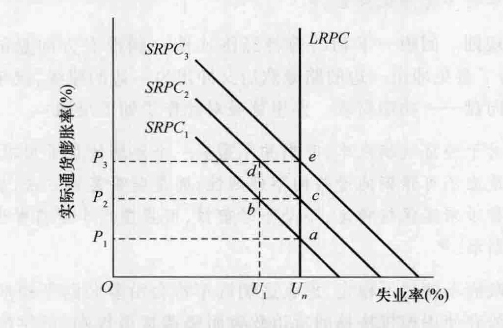
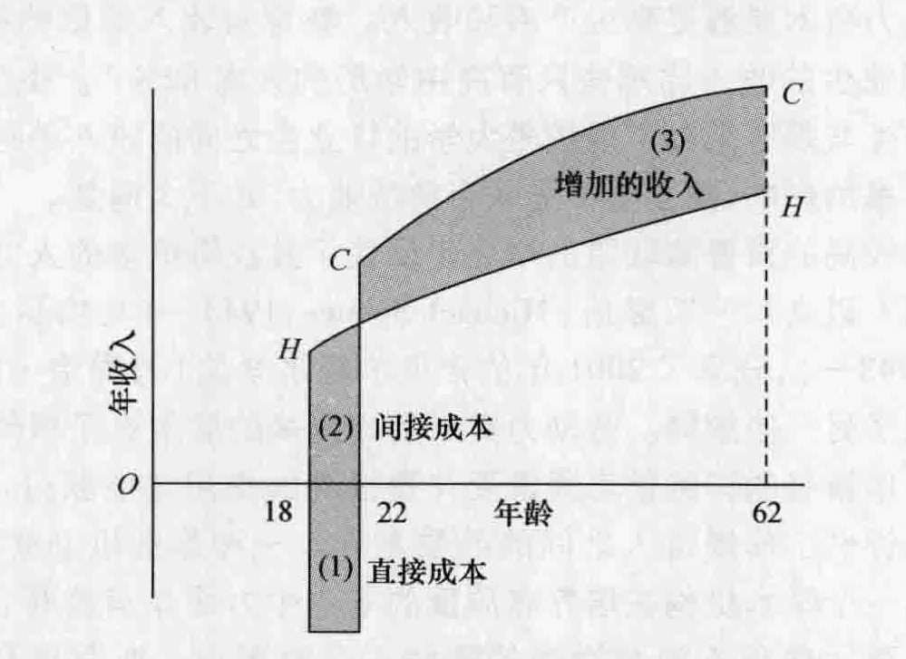

# 第 24 章 芝加哥学派：新兴古典主义

芝加哥经济学派的现代阶段开始于 1946 年，这一年米尔顿·弗里德曼成为芝加哥大学的一名教员。他和 1948 年来到芝加哥大学的乔治·斯蒂格勒一起坚定地建立了这一学派的独特特征。加里·贝克尔、罗伯特·卢卡斯和芝加哥大学的其他几位著名经济学家延续了这一传统，一些经济学家广泛分布在学术界、商界和政府中，这样，与芝加哥学派相联系的这些思想不再被完全限定在为这一学派命名的芝加哥大学校内。

我们将会发现芝加哥学派的主要信条符合广义的古典－新古典传统。芝加哥学派的思想是新古典主义的一种变体，因此被称为“新兴古典主义”。

在提供了现代芝加哥学派的一个概览之后，我们将讨论三位主要代表人物的作品：弗里德曼、卢卡斯和贝克尔。在历史借鉴 24-1 中，我们将讨论与斯蒂格勒相关的信息经济学。而且，罗纳德·科斯（历史借鉴 20-1）和西奥多·舒尔茨（历史借鉴 23-2）也曾在芝加哥大学任教。

## 24.1 芝加哥学派概览

### 24.1.1 芝加哥学派产生的历史背景

自从马歇尔时代以来，经济思想的许多重要发展刺激了经济中更多的政府干预，或者至少将更多的政府干预合理化。庇古的外部性思想暗含着政府能够通过选择性税收和补贴改善资源的配置。罗宾逊的买方垄断理论意味着政府应该确定最低工资并促进劳动者的工会主义。不完全竞争和垄断势力的理论引导许多经济学家得出结论：经济中政府的管制作用应该被扩大。自然垄断企业应该被作为公共事业加以管制，而非自然垄断企业应该通过反托拉斯行动来打破。由于缺乏竞争，管制者需要对企业的行为加以引导，以防止产生与国家效率和公平目标不一致的结果。市场社会主义的经济理论使许多人相信政府能够与私人企业一样有效率地配置资源及提供产品和服务。被广泛接受的经济发展理论暗示政府是打破发展中国家的贫困恶性循环的唯一适当手段。凯恩斯革命已经深深植根于人们的心中。它的基本前提——政府应该利用财政政策、货币政策和收入政策来稳定经济——已经成为新的传统智慧。政府收入再分配的基本原理既来自边际主义的分析，也来自凯恩斯主义的分析。

芝加哥学派的成员反对这一整套的推理思路。在这一学派的早期阶段，其支持者在说服他人方面几乎没有取得什么进步。芝加哥学派思想的支持者是在逆着一股强大的知识与历史潮流而前进。但 20 世纪 70 年代的经济事实使人们对新的正统经济学的几个方面的有效性产生了怀疑。原来的潮流开始衰退、转向，并将芝加哥学派的支持者们推到了一股新的知识思想浪潮的最前沿，无数年轻的经济学家都追随着他们的引导。

### 24.1.2 芝加哥学派的主要信条

芝加哥学派的主要原理和特征总结如下：

*   **最优化行为**。芝加哥学派的成员强调人们试图最大化他们福利的新古典主义原理。即在进行决策的时候，他们会进行最优化行为。基本的经济单位是个人。个人结合成为更大的单位——家庭、政治利益集团、企业组织——作为从专业化和交换中获得利益的一种方式。
*   **偏好趋于稳定并与价格无关**。人们会作出理性选择，尽管这种选择并不能总是产生预期的结果。收益和成本是不确定的。为了减少这种不确定性，决策者搜寻信息，但仅会达到从额外的信息中所获得的边际收益等于获取信息的边际成本的那一点。消费者、工人和企业会对货币激励与抑制作出反应。
*   **观察到的价格和工资大体上很好地近似于长期竞争的价格和工资**。② 价格和工资反映社会边际的机会成本。由垄断和买方垄断所引起的实际价格与竞争价格之间的差异在总体上并不重要。只有在政府阻碍竞争性进入的情况下垄断价格才能在长期中存在下去。即使在这种情况下，竞争最终会产生新的产品和技术从而削弱垄断者的地位。确立明确的产权和鼓励私人协商能够使外部性最小化。制度安排——资历报酬、大量的行政人员的工资、工会合同等——从表面上看起来能够独立于市场力量确定工资和价格，这种情况通常会存在，因为涉及的各方认为他们是有效率的。
*   **数学导向**。芝加哥学派非常依赖数学推理（比如，与新奥地利学派不同），他们既使用马歇尔式的局部均衡方法也使用瓦尔拉斯式的一般均衡方法。他们也强调了实证检验，但有时将这个任务留给了他人。
*   **抛弃凯恩斯主义**。经济是自我调节和管制的，伴随着有自我限制的微小波动。严重的衰退和萧条是由不适当的货币政策导致的，而不是来自支出的自动变化。货币存量的变化会引起名义国内生产总值的直接变化，而不仅仅是通过金融利率来发挥作用。财政政策通常是无效的，除非伴随着货币供给的变化，而且即使在后一种情形下由于存在理性预期，财政政策通常也是无能为力的。卖者的或成本推动型的通货膨胀理论是错误的，因为通货膨胀无论何时何地都是一个货币现象。
*   **有限政府**。政府作为一个代理人在本质上是无效率的，它所追求的目标可以通过私人交换来满足。政府官员有他们自己要寻求最大化的目标，因此不可避免会将一部分归他们处置的资源转移到并非为纳税人带来利益的目标上。政府管制并非代表公众利益，政府管制通常对那些寻求这种管制的人有利或对那些学会按他们的私人优势配置它的人有利。

### 24.1.3 芝加哥学派对谁有利或为谁谋利

芝加哥学派观点的倡导者帮助使普通大众和被选举出来的官员相信：在相对免于政府干预的情况下，竞争性市场体系能够产生最大的经济自由，这反过来又会产生最大的个人和集体经济福利。只要这一命题是有效的，那么芝加哥学派的观点就对整个社会有利。

对芝加哥学派观点的更广泛的接受给公司带来很多利益。实际上一些公司支持并帮助传播了这些思想。这些新兴古典主义经济学家帮助论证较少的政府干预和文书工作的合理性。令许多公司非常高兴的是，他们还称垄断是不重要的或短暂的，公司兼并在“公司控制的市场”中是一个必要的因素，并且广告向消费者提供可供选择的替代品的信息，有助于形成竞争性的结果。一些人还认为，芝加哥学派的经济学家为税收制度应该被用来提高收入而不是收入再分配提供理由，从而对高收入群体有利。

但是，芝加哥学派的信条是“有利有弊的”。例如，他们反对这样一些政府行为，如为即将破产的企业提供贷款或者对外国商品强制实施进口配额。同样，他们反对设置诸如不必要的许可这样的人为障碍，这只会通过使新参与者难以进入而提高某些部门的报酬。

另一方面，依赖政府补贴、就业管制或特别立法的团体和个人会由于芝加哥学派的政策在政治上被接受而遭受损失。例如，倡导政府价格支持与补贴的农业利益集团就反对芝加哥学派的观点。代表政府雇员的工会或专业团体也强烈表达了他们对芝加哥学派经济学的不满。从政府对经济活动的管制中获得个人就业和收入的政府官员也反对这些思想。

尽管芝加哥学派的许多最近的经济学家并不关心政治，但是作为一个整体，芝加哥学派为美国的政治保守主义提供了根据。正如芝加哥学派的一名成员梅尔文·W. 雷德所言：

> 芝加哥学派在本世纪第三个 25 年中所取得的巨大成功在很大程度上是由于其在科学研究和满足政治保守主义主张方面都能够取得领先地位。它能够实现这种双重作用是由于弗里德曼和斯蒂格勒所拥有的科学天才与解释技巧的幸运组合，但可能更为重要的是由于第二次世界大战末学术上保守主义的破产。
>
> 大萧条对自由放任资本主义声誉的破坏和希特勒造成的人们对各种类型的民族主义－保守主义信条的怀疑的这两种效应的组合，使政治权力几乎得不到任何学术支持。尽管存在自由放任的其他代言人（比如米塞斯团体），但是［芝加哥学派经济学家］的专业声誉和学术地位以及他们在非技术性交流方面的技巧，使他们在 1945 年之后的几十年中在争取保守公众的注意与支持方面获得了巨大的优势。③

### 24.1.4 芝加哥学派在当时是如何有效、有用或正确的

凯恩斯革命趋向于使微观经济学的进展处于停滞状态，这一领域的许多最优秀的学者将他们的注意力转向扩展凯恩斯主义的思想体系。其中包括早期杰出的微观经济学家，如琼·罗宾逊和约翰·R. 希克斯。芝加哥学派从某种意义上保持并强化了边际主义的传统，当时边际主义传统的流行程度已经开始减弱。在凯恩斯革命主宰学术舞台的时候，它帮助保存了古典主义与新古典主义经济学的长期遗产。这并不意味着凯恩斯革命已经结束，但意味着经济学家再次转向微观经济分析以扩展他们对于当今问题的理解，包括那些以前看起来似乎是宏观经济学家的专有领域。例如，对失业的分析现在包括对微观经济理论的强调，如工作搜寻和工作与闲暇之间的暂时替代。

当费雪的货币思想在凯恩斯思想的重压之下很容易被永久埋没的时期，芝加哥学派通过复活费雪的货币思想而使其在所处的时代也是有用的。20 世纪 70 年代和 80 年代早期的快速通货膨胀将这个国家的注意力从凯恩斯主义所关注的主要问题——失业——转移到费雪和弗里德曼所关注的问题——通货膨胀上来。在同一时期通货膨胀和失业的同时发生使许多凯恩斯主义者要求实行收入政策，尽管他们也承认这种政策很可能对效率产生负面的副作用。新兴古典主义者认为通货膨胀与失业之间的长期权衡关系是个错觉，他们保持了乐观的古典主义观点，即经济效率、价格稳定和自然的充分就业率是可以同时实现的。

### 24.1.5 芝加哥学派的哪些信条具有长远贡献

由于与新兴古典学派相联系的一些思想是最近时期的，因此现在判断哪些将对经济学作出持久贡献可能还不成熟，如果存在的话。例如，在 20 世纪 80 年代和 90 年代货币主义就失去了大部分支持。但是，新兴古典主义思想已经深深植根于美国大学的课程之中，这就足够了。比如，经济学原理方面的主要教科书都有关于新兴古典宏观经济学思想的章节，包括对自然失业率、理性预期、长期垂直的菲利普斯曲线和短期总供给与长期总供给的讨论。芝加哥学派的人力资本、家庭生产、工作搜寻和歧视的理论在现代劳动经济学教科书中都会被讨论到。浮动汇率的内容是国际经济学教科书的标准内容。关于外部性的科斯定理（历史借鉴 20-1），尽管存在争议，但是在公共财政和环境经济学教科书中会予以论述。简而言之，由较广泛定义上的芝加哥学派的成员所提出的一些思想看起来可能会具有长远的价值。但是，对这些贡献的最终评价需要等待我们的后代加以仔细研究。

## 24.2 米尔顿·弗里德曼

米尔顿·弗里德曼 (Milton Friedman, 1912—2006) 是芝加哥学派的领袖人物，他在罗杰斯大学完成了本科学业，从芝加哥大学和哥伦比亚大学获得了研究生学位。当他还是芝加哥大学的一名学生的时候，他受到了弗兰克·奈特的深刻影响。1948 年，弗里德曼成为芝加哥大学的一名教员，并且一直在那里待到 1977 年退休。在离开芝加哥大学之后，他成为斯坦福大学胡佛研究所的一名高级研究员。他是 1967 年美国经济学会的会长，1976 年获得诺贝尔经济学奖。弗里德曼的思想为广泛的美国公众所熟悉。他曾担任《新闻周刊》(*Newsweek*) 的专栏作家，写了一些畅销书，参加教育性的电视系列节目并对大量的团体发表过演讲。

### 24.2.1 消费函数

1957 年，弗里德曼出版了《消费函数理论》(*A Theory of the Consumption Function*) 一书，在这本书中他指出凯恩斯的消费函数过于简单：

> 考虑这样一种情形：许多人都是每周挣 100 美元并且每周都花费 100 美元用于当期消费。让他们每周得到一次报酬，并且支付报酬的日子是交错的，这样有 1/7 的人在星期天得到报酬，有 1/7 的人在星期一得到报酬，依此类推。假设我们随机选择这些人一天的预算数据作为样本，将收入定义为那一天的现金收入，将消费定义为那一天的现金支出。1/7 的人将会被记为有 100 美元的收入，而 6/7 的人则记为零收入。人们在获得报酬的那一天将会比其他时间花费得更多是合理的，但是在其他的时间他们也会有开支，所以我们将有 100 美元收入的 1/7 的人记为有正的储蓄，而另外 6/7 的人拥有负的储蓄……这些结果并没有告诉我们关于消费行为的任何有意义的东西，它们仅反映了收入和消费概念的不合适的使用。人们并没有调整他们在消费上的现金支出以适应他们的（短期）现金收入……④

弗里德曼指出，在这个简单例子中，将观察时期从一天延长为一周将会消除这种错误。但是就实际消费－收入数据而言，即使使用一年的时期也不能纠正这个问题。

按照弗里德曼的观点，一个家庭的消费是由持久收入而不是现期收入决定的，这里持久收入定义为在一个若干年的时期内人们预期得到的平均收入。在年复一年的时间里人们试图维持一个大致稳定的生活标准，暂时的收入变化既不会大幅度提高也不会大幅度降低人们当期的消费。换言之，消费并不会对由投资和政府支出的变化所引起的收入的每一个变化作出反应，它只会对那些人们认为是持久的和长期持续的收入变化作出反应。其含义是当前收入变化的边际消费倾向小于凯恩斯理论所认为的边际消费倾向。这意味着投资乘数较小，反过来又意味着所谓的经济中的内在不稳定被夸大了。⑤

### 24.2.2 货币理论

弗里德曼最著名的是他关于经济中货币作用的思想。就这方面他讨论了几个相互关联的主题，包括货币需求、货币数量论、大萧条的起因、财政政策的无效性、长期垂直的菲利普斯曲线以及“货币规则”。

**货币需求**。弗里德曼将货币需求看作现金余额需求。人们需要现金余额是因为它们能够为持有者提供效用。与凯恩斯不同，弗里德曼没有区分各种类型的货币，即区分闲散余额与积极余额，或者交易余额与投机余额。在任何特定的时间，家庭或企业愿意持有的货币数量有三个主要决定因素，这些决定因素独立于影响货币供给的因素。

*   **总财富**。以所有形式存在的总财富，包括人力资本，能够以持久收入最佳度量。随着财富或持久收入的增加，人们愿意以现金余额形式持有的货币数量也会增加。
*   **持有货币的成本**。货币需求的第二个主要决定因素是持有货币的成本。较高的成本将导致持有较少的货币。这些成本随着利率、预期通货膨胀率和价格水平的变化而变化。
    持有货币的成本之一就包括所放弃的可以以其他财富形式持有的直接“利率”。如果非货币资产比如股票和债券的收益上升，那么持有货币的机会成本也会上升，人们将会需要较少的货币。然而，从总体上看，货币需求的数量对利率的变化是不敏感的。交易形式（货币）与非交易形式（股票、债券）的财富的收益差额是相对稳定的。例如，当利率总体上升时，银行之间会通过对可以开具支票的账户提供较高的利率或者通过提高非现金收益（服务质量、方便、“无成本的”安全保管箱）来相互竞争以维持他们的这些账户。结果是，持有货币的相对机会成本并没有随着经济中利率的变化而发生显著变化，货币需求对利率是无弹性的。
    持有货币的另一种成本与预期通货膨胀有关。这是所放弃的实际资产的资本收益的机会成本；它也是牺牲的能够增值的资产的“收益”。较高的预期通货膨胀率会提高资本收益的前景从而提高持有货币的成本。因此，当人们预期到较高的通货膨胀率时，他们会减少当前的现金余额。
    持有货币的最后一种成本与价格水平（有别于预期通货膨胀率）相关。价格水平越高，持有货币的名义成本也就越低，因为所持有的每一美元将买到较少的东西。价格水平的上升，比如用消费价格指数衡量，会引起货币需求数量成比例的上升。人们将希望增加他们的现金余额以保持用实际变量来衡量的现金余额固定不变，即他们希望持有更多的现金来购买价格更高的产品。
*   **偏好**。关于持有和使用现金的偏好或基本态度是货币需求的第三个主要决定因素。弗里德曼断言，这些偏好“在非常大的空间和时间跨度上”会保持相对固定。

简而言之，弗里德曼认为货币需求数量与持久实际收入和价格水平成同方向变化，与预期通货膨胀率成反方向变化，对利率的变化反应并不明显。

**现代货币数量论**。按照弗里德曼的观点，货币需求在短期内是相对稳定的。联邦储备系统控制着货币供给。货币供给的增加将会使人们所持有的现金余额超过他们所希望持有的数量。他们将试图通过现金支出和写支票的方式来消耗掉这些过多的交易资产。但是社会作为一个整体无法消耗掉过多的现金余额，一个人的支出将会使另外一个人的钱夹或支票簿中有更多的现金。因此，人们花掉他们的现金余额的这种愿望将会增加对产品和服务的需求，提高产出、价格或者产出与价格的某种组合。当经济在其自然就业率和产出率水平运行时，长期中只有价格会上升。随着价格水平的上升，货币需求将会增加（回想一下我们前边的讨论），因为社会希望持有额外的货币来购买价格更高的产品。最终，货币供给数量与货币需求数量之间的均衡将会得到恢复，只是会在一个更高的价格水平上。

这样，根据弗里德曼的论述，现代货币数量论得以确立。它并没有像以前的货币数量论那样假设货币流通速度是不变的，而是假设货币需求是“高度稳定的——比其他那些关键关系的函数，如消费函数，还要稳定”。弗里德曼指出，通货膨胀“无论何时何地都是一种货币现象，它最初是由货币数量的过度增长所引起的”⑥。弗里德曼说，货币存量与价格之间的这种关系得到了经验数据的证实。参考其他人的研究，他在 1956 年指出：

> 在经济学中可能没有其他的实证关系像在短期中货币存量与价格的重大变化之间的这种关系一样，在一系列广泛的情况下可以观察到如此一致地重复发生；一个总是与另一个联系在一起并且按相同的方向发生变化；我怀疑，这种统一性与构成物理学基础的许多统一性是属于同一类的。⑦

1963 年，弗里德曼和安娜·施瓦茨 (Anna Schwartz) 出版了《美国货币史：1867—1960》(*A Monetary History of the United States, 1867-1960*) 一书，在这本书中他们提出了自己的关于货币存量增长与通货膨胀率的实证发现。弗里德曼认为这本书是他最重要的著作。

**大萧条的起因**。在他们著作的第 7 章中，弗里德曼和施瓦茨得出了这样一个有争议的结论：即货币政策应该对 20 世纪 30 年代的大萧条负有主要责任。⑧ 后来，弗里德曼这样表述了他的立场：

> 凯恩斯与那个时代的其他大多数经济学家都认为尽管货币当局采取了积极的扩张性政策，但美国的大萧条仍然发生了——他们已经尽力，只是他们的努力并不足够好。最近的研究表明事实恰好相反。美国的货币当局采取了高度紧缩的政策。美国的货币数量在萧条的过程中下降了 1/3。而且它下降并不是因为没有愿意提供借款的人——不是马儿不喝水。它之所以下降是因为联邦储备系统强制或允许基础货币急剧下降，是因为它没有能够执行《联邦储备法案》赋予它的为银行系统提供流动性的责任。大萧条是货币政策能力的不幸证明——而不像凯恩斯和许多他那个时代的经济学家所认为的那样，是无能的证据。⑨

**长期垂直的菲利普斯曲线**。回想一下，维克塞尔区分了实际利率与自然利率。弗里德曼认为在实际失业率与自然失业率之间也有类似的差别：“我使用‘自然的’这一术语是出于与维克塞尔相同的理由——尽量将实际因素与货币因素区分开来。”⑩ 对弗里德曼认为，自然失业率也就是当实际通货膨胀率与预期通货膨胀率相等时会发生的失业率。当局只有通过产生一个大于预期的通货膨胀率水平才能将实际失业率暂时降低到自然失业率之下。但是一旦人们将预期调整到新的更高的通货膨胀率水平上，失业率将会重新回到自然失业率上。

图 24-1 用图形说明了弗里德曼的分析。⑪ 我们的解释方法是首先确定短期的菲利普斯曲线，然后解释这些短期的菲利普斯曲线如何向上移动而产生一条垂直的长期的菲利普斯曲线。该图有时也被称为菲尔普斯－弗里德曼菲利普斯曲线，埃德蒙·菲尔普斯 (Edmund Phelps, 1933—) 明确阐述了同样的思想，并赢得了 2006 年的诺贝尔经济学奖。⑫

首先，让我们集中在图 24-1 中的短期菲利普斯曲线 $SRPC_1$ 上。假设通货膨胀率为 $P_1$，失业处于自然失业率 $U_n$（点 $a$）。接下来假设货币当局希望将实际失业率固定在 $U_1$，从某种意义上说表明愿意用更高的通货膨胀率（$P_2$ 而不是 $P_1$）来替代一个较低的失业率。假设货币当局通过增加货币存量来实现这一点。这最终将把通货膨胀率提高到 $P_2$，而暂时将失业率降低到 $U_1$（点 $b$）。原因何在？企业会发现它们产品的价格上升速度快于单位劳动成本。许多工人的劳动合同是在预期通货膨胀将会继续为 $P_1$ 的情况下签订的。因为价格上升而名义工资保持不变，所以实际工资率会下降，雇主的反应将是增加雇佣人数。此外，因为企业要获得新的雇员，所以正在寻找工作的失业工人将开始得到企业提供的更高的名义工资。如果工人们将这些名义工资的增加误认为提供了更高的实际工资，那么他们将会缩短他们寻找工作的时间长度。结果将是一个较低的摩擦失业率。结论：(1) 当实际通货膨胀率高于预期通货膨胀率时（$P_2$ 而不是 $P_1$），失业率将会下降（从 $U_n$ 下降到 $U_1$）；(2) 短期菲利普斯曲线（比如，$SRPC_1$）上的点表示与不同于预期通货膨胀率的实际通货膨胀率相联系的各种失业率。

*图 24-1 弗里德曼的长期垂直的菲利普斯曲线*

> 每一条短期的菲利普斯曲线都表示当实际通货膨胀率与预期通货膨胀率相偏离时可能的通货膨胀与失业的各种组合。当通货膨胀高于预期通货膨胀时，比如在 $P_2$ 而不是 $P_1$，失业会暂时下降到其自然失业率之下（从 $U_n$ 下降到 $U_1$，由点 $b$ 来表示）。但是一旦 $P_2$ 成为新的预期通货膨胀率，短期菲利普斯曲线会从 $SRPC_1$ 移动到 $SRPC_2$，失业率将会回到其自然失业率水平（点 $c$）。弗里德曼认为，在长期中通货膨胀与失业之间并不需要权衡。长期的菲利普斯曲线是垂直的，表示这几个通货膨胀率中的任何一个都是与自然失业率相容的。

弗里德曼认为，经济不会停留在 $SRPC_1$ 的点 $b$ 上。人们将会把预期调整到更高的通货膨胀率 $P_2$ 上并预期它会继续下去。一旦发生了这种调整，短期的菲利普斯曲线会向上移动到 $SRPC_2$。更高的预期通货膨胀率会转化为短期菲利普斯曲线的更高位置。随着旧的合同的到期，工资将会上升，实际劳动成本会上升到它们以前的水平上，企业会解雇工人，从而自然失业率得以重新确立（点 $c$）。现在自然失业率是与一个更高的实际通货膨胀率和预期通货膨胀率联系在一起的。

假设货币当局试图将失业率再次确定为 $U_1$。通过增加货币供给，它们能够再次暂时地实现这一目标（点 $d$）。但是这种就业收益是短暂的。短期的菲利普斯曲线会向上移动到 $SRPC_3$，经济会移动到点 $e$。在长期中，通货膨胀与失业之间并不需要权衡。菲利普斯曲线 ($LRPC$) 在自然失业率水平上完全垂直。在长期中，货币当局只有通过连续提高通货膨胀率才能将失业率降低到自然失业率之下。用弗里德曼的话来说：

> 换一种说法来表达这一结论，即在通货膨胀与失业之间始终存在一种暂时的权衡关系，并不存在持久的权衡关系。这种暂时的权衡并非来自通货膨胀本身，而是来自非预期的通货膨胀，这通常意味着它来自一个不断上升的通货膨胀率。一个广泛存在的信念是存在一种长期的权衡关系，这种信念是在一种复杂版本中的“较高的”和“不断上升的”两个概念之间的混淆，在更为简单的形式中我们都能认识到这种混淆。一个不断上升的通货膨胀率可能会降低失业，但一个较高的通货膨胀率将不会降低失业。⑬

**货币规则**。回想一下勒纳曾将经济比作一辆没有方向盘的汽车（回顾历史借鉴 22-1）。为了避免冲出一边的路缘然后又冲出另一边的路缘，汽车需要一个由熟练司机操作的方向盘——功能财政。弗里德曼对此作了如下反驳：

> 对于经济这辆汽车，我们并不需要一个熟练的货币司机，由他来持续转换方向盘以适应不可预期的道路的不规则性，而是需要某种方法，能够使坐在车厢内后座上的货币乘客保持稳定，不必不时前倾，而且在汽车即将抛出公路时能够给方向盘突然制动。⑭

只要政府不使之不稳定，那么这辆汽车将会沿着公路平稳地行驶下去。联邦储备体系应该放弃使用相机抉择的货币政策而坚持货币规则：每年按与生产力的长期增长速度相一致的一个稳定比率来增加货币供给。需要这样一种规则是基于以下四个原因：

*   **联邦储备体系过去的表现**。按照弗里德曼的观点：“纵观历史，联邦储备体系宣称它在使用它的力量来促进经济稳定。但是历史记录并不支持这一论断。相反，联邦储备体系是不稳定的一个重要来源。”⑮
*   **经济知识的局限**。在货币存量的变化与产出和价格的变化之间存在时滞，并且这些时滞本身是可变的、不可预测的。试图微调经济就像校正经济一样，很可能会增加不稳定性。
*   **信心**。单一货币规则能够使企业、消费者和工人在签订合同的时候有信心，他们相信将来联邦储备体系不会令他们突然吃惊。
*   **联邦储备体系的中立化**。“单一货币规则将使货币政策既与不受选民控制的一群人的专断权相隔离，也与党团政治的短期压力相隔离。”⑯

### 24.2.3 经济自由主义

弗里德曼将自己描述为一个 19 世纪的自由主义者。当然，他指的是与强调经济自由的古典主义经济学家联系在一起的经济自由主义。因此，多年来他一直在倡导少依赖政府而多依赖市场的一系列改革。弗里德曼认为，市场体制不仅会保护经济自由，而且也会保护政治自由。“一个印刷机为国家所有而且工人为国家所雇用的国家会真正拥有政治自由吗？”弗里德曼问道。他的答案是“不会”。

弗里德曼的改革建议中有几项已经被实施；其他的仍然是公众争论的主题。他的建议包括：浮动的、市场决定的国际汇率体系，在美国实行完全自愿兵役制，对反托拉斯法的较宽松的解释，结束国家对收入政策的试验，负所得税，能够为父母将他们的孩子送到哪一所学校提供选择的教育优惠券，单一税率所得税，偶然吸毒的合法性，以及大量公共服务设施的“私有化”。

弗里德曼的崇拜者和批判者一致认为他帮助确立了货币在经济中“至关重要”的思想。他们也都一致认为弗里德曼本人在经济思想史和公共政策方向中是“至关重要的”或具有重要影响。正如萨缪尔森所说：“如果不存在米尔顿·弗里德曼的话，我们将有必要创造一个弗里德曼。”⑰

> ### 历史借鉴 24-1 从斯蒂格勒到“柠檬”
>
> 在 20 世纪 60 年代早期，芝加哥学派的经济学家乔治·J. 斯蒂格勒 (George J. Stigler, 1911—1992) 指出，信息是一种经济商品。消费者会通过比较边际收益与边际成本来决定获取多少信息。*
>
> 考虑新车市场上消费者的例子。更多信息的边际效用 (MB) 包括与发现符合某人需要的某种品牌和样式相联系的效用，以及与发现较低价格相联系的效用。尽管随着获得的信息越来越多总收益将会上升，但额外信息的边际收益会下降。相反，随着消费者获得越来越多的信息，额外信息的边际成本 (MC) 通常会上升。这种成本包括交通和其他搜寻费用、时间的机会成本以及由于推迟购买所牺牲的效用。
>
> 消费者会找出边际收益高于边际成本的所有单位的信息，并且当 MB=MC 时搜寻的过程结束。斯蒂格勒认为，在那一点上消费者获得最优数量的信息。因此，同一品牌的新车存在一组价格分布而不是一种单一的零售价格。消除这种价格变动所需要的额外信息导致边际成本高于边际收益。在其他条件相同的情况下，信息的边际成本越高，市场上价格的差异也就越大。
>
> 1970 年，加州大学伯克利分校的乔治·A. 阿克洛夫 (George A. Akerlof, 1940—) 扩展了斯蒂格勒对信息的分析。阿克洛夫提出了一个相当简单的问题：“为什么买者将新车开出卖场之后汽车会损失那么多价值？”如果物理折旧是罪魁祸首的话，那么为什么同一辆新车在卖场停留数周甚至数月都不会损失价值？阿克洛夫的答案是某些市场包含不对称信息 (asymmetric information)，这使他分享了 2001 年的诺贝尔经济学奖。**
>
> 二手车的出售者比潜在的购买者拥有关于他们汽车的状况的更多信息，市场双方的信息是不对称的。因为购买者缺乏关于二手车的重要信息，所以就出现了逆向选择问题。有缺陷的汽车（柠檬）的所有者希望卖掉他们的汽车，但是大多数相同品牌、年份和样式的高质量汽车的所有者不想卖掉他们的汽车。结果是市场上的大多数二手车质量要比不愿出售的相同型号的汽车差。因为二手车的潜在购买者知道这一点，所以对二手车的需求会降低，同样市场价格也会下降。二手车的这种较低的价格进一步降低了拥有高质量二手车的人们的出售激励。因此，质量较差的汽车趋向于将高质量的汽车逐出市场，并且许多潜在的能够提高福利的交易因此也不会发生。当购买者将一辆新车从经销商那里开走时，这辆汽车立即就呈现了“柠檬市场”上的价值，即使这辆车可能完好如初。
>
> 现代经济学家发现了几种存在不对称信息的市场，包括餐馆的饮食、汽车旅馆的房间、医生的服务、电器设备以及某些保险与劳动力市场。但是，他们还提醒我们，已经出现了许多私人部门的安排来帮助减少信息的不对称。例子有可转让产品保证书、特许经营以及商标名称的确立。而且，这类问题有所减少，因为一些私人信息提供者通过提供信息获取利润，比如企业发布消费报告、旅游向导的生产商、信用机构、担保机构、经纪人以及其他中介机构等。最后，可以较为便宜地获得互联网提供的信息也可以减少信息不对称问题。

## 24.3 小罗伯特·E. 卢卡斯

小罗伯特·E. 卢卡斯 (Robert E. Lucas Jr., 1937—) 出生于华盛顿的雅吉瓦，在芝加哥大学获得了学士学位和博士学位。在他研究生的早期阶段，他受到了弗里德曼教授的影响，弗里德曼教授其研究生课程的一年级微观经济学，并且他还受到了萨缪尔森的《经济分析基础》的影响。卢卡斯评论道：“《经济分析基础》指出，‘这就是你进行经济分析的方法’。它让你知道你应该如何玩这个游戏的秘密，而不是用大话来将你吓跑。我认为是萨缪尔森的著作和弗里德曼的课程的结合使我开始了经济研究。”⑱

卢卡斯在卡内基－梅隆大学度过了学术生涯的前 11 年，然后在 1974 年回到芝加哥大学。因他对宏观经济学所作出的贡献他被授予 1995 年的诺贝尔经济学奖。具有讽刺意味的是，他的前妻得到了 100 万美元奖金的一半，因为她在七年之前的离婚协议中加入了一个包括这种可能性的条款。这个条款定于 1996 年到期。

### 24.3.1 理性预期

弗里德曼的通货膨胀－失业关系的理论（图 24-1）建立在适应性预期的假设基础上。人们根据过去和现在的通货膨胀来确定他们对未来通货膨胀的预期，并且只有随着新的事件的发展他们才会改变他们的预期。卢卡斯超越了弗里德曼的分析，他指出经济人会形成关于当前稳定政策的未来结果的理性预期。尽管理性预期的思想并不是卢卡斯最先提出的，但正是卢卡斯详细描述了它对于宏观经济理论与政策的含义。⑲

卢卡斯认为，市场参与者会反省他们过去的错误，利用和加工处理所有可以得到的信息，并且在预测未来价格水平的变动中能够成功地消除规则性错误。因为人们知道扩张性的财政政策与货币政策会产生通货膨胀，所以当政府采取这些措施时他们会立即向上调整他们的通货膨胀预期。资源市场和金融市场会立即作出调整，因此工人们会得到更高的名义工资，原材料和其他资本品的出售者会得到更高的价格，贷出货币的人会得到更高的名义利率。

对预期通货膨胀的这些反应会使扩张性的财政政策与货币政策无效。利润、产出和就业的暂时性增加表现在图 24-1 中不是从点 $a$ 移动到点 $b$，经济直接从点 $a$ 移动到 $c$，即扩张性的财政政策与货币政策会直接并立即沿着垂直的长期菲利普斯曲线向上将通货膨胀率从 $P_1$ 提高到 $P_2$。

### 24.3.2 卢卡斯的总供给分析

卢卡斯的分析区分了短期总供给与长期总供给。在图 24-2 (a) 和图 24-2 (b) 中，纵轴衡量价格水平而不是通货膨胀率，横轴衡量实际产出而不是失业率。在由这两个图所代表的新兴古典主义的模型中，总需求的一个不可预期变化确实会影响实际产出水平，但仅仅是暂时的。与之相反，总需求的一个预期的变化对实际产出和就业没有影响。

假设经济最初位于图 24-2 (a) 中的点 $a$，并且一次不可预期的投资支出猛增使总需求从 $AD_1$ 增加到 $AD_2$。生产者会立即感受到价格的上升，并且得出结论，这些价格相对于其他价格而言（以及相对于劳动力价格）是在不断上升的。因为预期得到更高的利润，他们就会增加就业与产出，将经济从点 $a$ 移动到点 $b$。可以观察到短期总供给曲线 $AS_1$ 是向上倾斜的；不可预期的价格水平从 $P_1$ 提高到 $P_2$，使实际产出从 $Q_1$ 增加到 $Q_2$。

*图 24-2 卢卡斯的新兴古典宏观经济学*

> (a)：总需求不可预期地从 $AD_1$ 增加到 $AD_2$，会使经济暂时地从点 $a$ 移动到点 $b$。然后经济会移动到点 $c$，因为名义工资和其他要素价格的上升使短期总供给曲线从 $AS_1$ 向左移动到 $AS_2$。总需求不可预期的增加会使经济沿着长期总供给曲线 $AS_{LR}$ 直接从点 $a$ 移动到点 $c$。图 (b)：总需求不可预期地从 $AD_1$ 下降到 $AD_3$ 会使经济暂时地从点 $a$ 移动到点 $d$。名义工资和其他投入要素价格的下降会使短期总供给曲线从 $AS_1$ 向右移动到 $AS_3$，经济会移动到点 $e$。总需求可以预期的下降会使经济沿着长期总供给曲线 $AS_{LR}$ 直接从点 $a$ 移动到点 $e$。

但是实际上由于总需求的总体增加，所有的价格，包括劳动力与其他投入要素的价格都在上升。企业会共同经历成本的上升，导致短期总供给曲线最终从 $AS_1$ 向左移动到 $AS_2$。经济会从点 $b$ 移动到点 $c$，使产出以前的增加逆转回去。在长期中，经济的总供给曲线仅仅是一条从 $Q_1$ 向上经过点 $a$ 和点 $c$ 的垂直直线 ($AS_{LR}$)。

总需求的一个不可预期的下降，如图 24-2 (b) 中从 $AD_1$ 下降为 $AD_3$，会以相反的方向发生作用。最初，企业会错误地觉察到价格的下降仅局限于它们自己的产品。预期到利润将会下降，它们会减少就业和产出，经济会从点 $a$ 移动到点 $d$。但是，企业很快就会发现所有的价格都在下降，包括工资和其他投入要素的价格。名义成本的下降，短期总供给曲线会从 $AS_1$ 向右移动到 $AS_3$。经济会从点 $d$ 移动到点 $e$，实际产出会从 $Q_3$ 增加到 $Q_1$，衰退会自动结束。卢卡斯认为，经济能够自我调整，正如古典经济学家所认为的那样。正是由于这个原因，他的理论被称为新兴古典宏观经济学。

如果总需求的变化是可预期的，那么实际产出会保持固定不变。例如，假设在图 24-2 (a) 中，中央银行增加货币供应量以使总需求从 $AD_1$ 扩展到 $AD_2$。因为联储的行动是公开的并且可以预期到通货膨胀的结果，所以企业会立刻意识到它们的产品获得的更高的价格只是它们预期到的总体通货膨胀的一部分。它们认识到提高价格的同一种力量也正在提高它们的成本，使它们的利润保持不变。短期总供给曲线会从 $AS_1$ 向左移动到 $AS_2$，同时总需求会从 $AD_1$ 向右移动到 $AD_2$。经济会在长期总供给曲线 $AS_{LR}$ 上直接从点 $a$ 移动到点 $c$。实际产出保持在 $Q_1$ 不变，而只有通货膨胀发生。当总需求的增加是可以预期时，长期总供给曲线是唯一相关的总供给曲线。对于总需求的可以预期的下降，比如在图 24-2 (b) 中从 $AD_1$ 下降到 $AD_3$，这一点也是正确的。在这种情形下，经济会沿着 $AS_{LR}$ 向下直接从点 $a$ 移动到点 $e$。

### 24.3.3 评价

曾经认真学习过卢卡斯理论的人中没有任何人认为宏观经济学与以前是完全相同的。事实上，理性预期的思想现在无疑已经是主流宏观经济学的一个部分。然而，大多数宏观经济学家并不接受自动的自我调整和政策无效的新兴古典主义的观点。大多数经济学家认为价格与工资不具有完全弹性，特别是向下调整时。因此，图 24-2 (b) 所暗含的衰退的迅速、自动的调整并不会发生，为了使经济走出衰退，财政政策与货币政策可能是必需的。（你可能愿意复习一下图 22-6）。主流经济学家同时也质疑基本的新兴古典主义的假设——扩张性财政政策与货币政策始终是通货膨胀性的。他们反问道，如果经济学家在这一点上都不能达成一致意见，我们怎么能期望普通公众会将这些政策与即将到来的通货膨胀等同起来并按这一预期行动？卢卡斯已经有效地将完全竞争、理性行为和瓦尔拉斯均衡等微观经济理论扩展到了宏观经济学中。但是，关于他的理论在多大程度上描述了当代现实世界的经济的真正运行机制，仍然存在相当多的争议。

## 24.4 加里·S. 贝克尔

加里·S. 贝克尔 (Gary S. Becker, 1930—) 出生于宾夕法尼亚州的波茨敦，他在普林斯顿大学完成了本科学业，从芝加哥大学获得了博士学位。1957 年到 1969 年之间，他是哥伦比亚大学的教授。1970 年他进入芝加哥大学，现在仍然是那里的经济学与社会学教授。他是 1986 年的美国经济学会会长。按照一位经济思想史学家的说法，他是“现代经济学中最具有开创性思想的人之一”⑳。贝克尔是造诣极高的理论家，他似乎更愿意介绍实证经济理论，而不是支持与弗里德曼和芝加哥学派相关的政策观点。然而，在 20 世纪 80 年代中期，他开始为《商业周刊》(*Business Week*) 撰写专栏，这极大地提高了他在更广泛的公众面前出现的机会。1992 年贝克尔被授予诺贝尔经济学奖。

贝克尔被称为“知识帝国主义者”。这个称谓的意思是他将经济学方法及其最大化行为、稳定偏好以及市场均衡的联合假设一起，扩展到了社会学、政治学、法律、社会生物学和人类学的传统领域。他对于经济学方法与宽泛主题的相关性的强烈信念会随着我们对他几个思想的纵览而变得清晰。

### 24.4.1 歧视

1957 年，贝克尔出版了《歧视经济学》(*The Economics of Discrimination*) 一书，这本书是他 1955 年博士论文的修订版。他后来指出：“这是我将经济学方法应用到经济学传统领域之外问题上的第一次公开尝试，它受到了经济学绝大多数人的漠视与反对。”㉑

但是，到 20 世纪 70 年代中期，尽管贝克尔的歧视模型仍然存在争议，但却得到了劳动经济学大多数主要教科书的重点讨论。贝克尔将歧视看作是一种歧视者愿意支付的偏好或“喜好”：

> 一个人被假设好像他们有“歧视的偏好”一样行动，并且这些偏好是实际歧视的最重要的直接原因。当一个雇主歧视其雇员时，他按照好像雇用他们会引致非金钱的、精神的生产成本一样行动……

一个雇主对一个雇员的歧视系数衡量的是雇用他的非金钱成本的价值，因为它代表了支付给他的货币工资率与真实或净工资率之间的百分比差异。如果 $\pi$ 是所支付的货币工资率，那么 $\pi(1 + d)$ 就是净工资率，其中 $d$ 是歧视系数。㉒

一个具体的例子有助于阐述这些思想。假设市场工资率为 6 美元，并且雇主的 $d$ 为 0.5。那么从这个雇主的角度来看，被歧视的群体的工资率为 9 美元 [6 美元 $\times (1 + 0.5)$]。这意味着，与雇用受偏见的群体相比，有偏见的雇主愿意在雇用首选的工人时支付一个最高 3 美元的额外费用。$d$ 的数值越高表示对歧视具有越强烈的偏好。另一方面，如果 $d$ 为零，那么这个雇主就是无偏见的。

如果在整个经济中歧视系数都是正的，那么对首选工人的需求将会大于不存在歧视偏好的情形。结果，首选工人的市场工资率将会超过那些同等生产力的非首选工人。这一事实有一个重要的含义：歧视的雇主比那些不歧视的雇主具有更高的工资成本。那些歧视的企业将必须为它们的偏好支付一个工资“额外费用”或“价格”。那些不具有这种歧视偏好的企业或者那些相对于工资差异偏好较低的企业将会在更低的工资水平雇用同等生产力的非首选工人，从而与他们的带有歧视偏好的竞争者相比会获得一种成本优势。从理论上来说，在一个竞争的市场经济中，长期内只有成本最低的生产者才能生存；歧视者将拥有高于市场决定的价格的平均成本，即他们将会遭受损失。

因此，贝克尔的理论与更加广义的新兴古典主义的观点是一致的：在长期，竞争市场体系将会给歧视者增加成本，这会减少歧视的数量，不管它是性别、种族还是宗教偏好方面的歧视。政府在加速这一进程中的作用应该是抵制利益集体阻碍自由职业选择的压力。

### 24.4.2 人力资本投资

在《人力资本理论》(*Human Capital*, 1964) 一书中，贝克尔提出了现代的、概括形式的人力资本投资理论。这本书极大地扩展了贝克尔在芝加哥大学的同事西奥多·舒尔茨以前的工作（参见本书网站）。图 24-3 说明了这个理论，它表示一个假设的个人作出关于是否上大学的决策。出于投资目的而去上大学的决策取决于一个人投资的预期收益。如果不上了大学，图中的信息表明这个人可以期望得到曲线 $HH$ 所表示的年收入。如果上大学，收入曲线变为 $CC$。上四年大学的成本包括：(1) 直接成本，如学费和书本费；和 (2) 间接成本，它的形式是在投资期间所放弃的收入。一旦这个大学毕业生加入劳动力大军，他将会比仅有高中学历的人挣得更多的收入。(3) 表示这两个收入流之间的差异。投资决策需要比较年收入的增加部分 (3) 的现值与直接成本与间接成本 (1) 和 (2) 的现值。如果前者超过后者——即如果净现值为正——投资将会发生。

图 24-3 所暗含的基本原理适用于所有的人力资本投资决策，比如一个工人迁移到新地点工作的决策、一个企业为其工人提供在职培训的决策、一个发展中国家利用资源来提高其劳动力总体健康水平的决策。在每一种情形中，决策者都要衡量未来的收益与当前的损失。

*图 24-3 人力资本投资：大学教育*

> 投资大学教育要求现在作出牺牲，以便获得一个更大的一生收入流（$CC$ 而不是 $HH$）。四年大学教育的成本包括 (1) 直接成本，如学费；和 (2) 间接成本，如大学期间所放弃的收入。这些成本的现值将与由大学学历而增加的预期收入 (3) 的现值进行比较。如果 (3) 的现值高于 (1) 和 (2) 的现值，那么投资就会发生。

贝克尔是第一个区分一般培训与专门培训的人。一般培训不仅能提高工人们在他们当前就业中的边际生产力，而且能提高他们将来可能从事的其他就业中的边际生产力。专门培训只能提高工人们在提供培训的公司中的边际生产力。因此，我们的一些技能是专门于一个特定的企业或情形的（专门资本），而另外一些则可以被广泛地应用于各种情形或工作环境（一般资本）。

贝克尔指出，人力资本理论有助于解释“被给予专门解释或者使研究者感到困惑的广泛的一系列经验现象”㉓。这种现象包括如下事实：(1) 收入通常随着年龄的增长而以一个递减的比率增长，并且增长率趋向于与技能水平正相关；(2) 对于那些拥有较高技能水平的人而言，失业率相对较低；(3) 年轻人比年龄较大的人变换工作更加频繁，并且接受更多的学校教育和在职培训；(4) 拥有较高能力的人在一生的时间内会接受比其他人更多的教育和在职培训。

在《人力资本》一书的最后一句话中，贝克尔指出：“我愿意冒险作出这样一个论断：人力资本将会成为思考发展、收入分配、劳动力流动和未来较长时间内许多其他问题的一个重要部分。”他是具有先见之明的。在过去的二十多年中，人力资本成为数十部著作和数百篇期刊论文的主题。

> ### 历史借鉴 24-2 人力资本形成？或遴选与发出信号？
>
> 西奥多·舒尔茨 (1902—1998) 和加里·贝克尔 (1930—) 的研究显示，通过教育而形成的人力资本能够提高生产率和收入。教育对收入的影响得到了很好的证明，2009 年大学毕业生的收入比那些只有高中学历的人高 82% *。类似地，来自最有声望的大学的毕业生与那些来自声望较差大学的毕业生之间的收入差距是巨大的。但是大学教育对生产率的影响，独立于不受教育前的能力，并不太清楚。
>
> 收入较高的常青藤联盟的毕业生反映了其获得更多的人力资本吗？还是显示了其他的问题？迈克尔·斯彭斯 (Michael Spence, 1943—) 与约瑟夫·斯蒂格利茨 (Joseph Stiglitz, 1943—)，分享了 2001 年的诺贝尔经济学奖（与乔治·阿克洛夫一起），他们的研究提供了另一些解释。劳动力卖出者比未来的雇主更了解他们自己的能力。因为关于每一个申请者的详细信息通常要花费很高的费用才能获得，所以雇主寻求较为廉价的方法来评价工作候选人之间的品质差异。一种筛选机制就是申请人接受教育的学校。如果一个学术机构在培养高质量的毕业生方面享有盛誉，那么雇主会认为雇用这些毕业生要比雇用不知名学校的那些人风险更小。斯蒂格利茨称之为遴选 (screening)，即允许雇主根据学历名次挑选出高能力的申请者。斯蒂格利茨在保险产业的背景中提出了遴选的概念，但是这个概念也适用于劳动力市场。
>
> 由于知道未来的雇主采用遴选机制，因此工作候选人可能会选择教育来发出信号以显示他们具有较高的能力，如斯彭斯提出的那样。假设声望较高的学校发出更好的信号，但是在这类学校上学也更昂贵，所以一个学生必须确定从信号中得到的潜在收入的收益是否超过更高的上学成本。
>
> 根本的问题是被遴选的和被发出信号的是什么？那些顶尖的大学比其他大学实际上真的创造了更多的人力资本吗？还是它们仅仅是吸引了那些已经具有较高能力的人？遴选和发出信号在这个过程的更早的时候就发生了，很高的大学声誉吸引那些最好的求学者，而阻止那些能力较差的人。计划考大学的高中学生能够通过考入较高声望的预备学校而显示出他们的能力。同时，大学的招生部门通过申请人所在高中的质量来遴选申请人。
>
> 在一定程度上较高的收入反映更高的生产率，来自较高声望大学的毕业生倾向于具有更高的生产能力。但是斯彭斯和斯蒂格利茨的贡献中所提出的问题仍然存在：更高的生产率是来自更好的教育过程，还是来自学生给学校带来的一系列更高的质量的投入？人力资本的进展是更多地发生于有声望的学校，还是那些学校和他们的学生只是发出信号显示他们是具有更高质量、更高生产率的潜在工作者？

### 24.4.3 时间配置理论

新古典主义的消费者行为理论假设消费是即时消费。贝克尔认为，消费会花费时间，而时间是稀缺的并且具有价值。用于消费一件产品的时间就不能用于另外一个用途，比如，去获取收入。有些消费品的消费会比其他商品花费更多的时间。因此，贝克尔认为，人们在作出购买决策时会考虑产品的“完全成本”或“完全价格”。一件产品的完全价格由它的市场价格加上消费它所必需的时间价值构成。

这个重要的见解引导贝克尔重新构建了选择理论。作为基本决策单位的家庭，应该被认为是效用“商品”的消费者，也是它的生产者。商品的生产会通过将在市场上花费时间所购买的产品（产品和服务）组合起来而发生。为了得到必要的收入水平来购买生产商品所必需的产品，家庭需要在劳动市场上花费时间。为了在家庭中生产和消费商品，家庭必须花费生产时间和消费时间。一个例子是生产和消费一顿饭，比如一顿早餐。家庭通过使用生产时间（准备这顿饭所需要的时间长度）和消费时间（吃这顿饭所花费的时间）将产品（鸡蛋、面包、果汁和熏肉）组合在一起而将其生产出来并消费掉。

家庭必须对它希望消费哪些商品和它将如何着手生产这些商品作出决策。这些决策每天都在发生。一个复杂的因素是一些商品需要许多时间而不需要许多产品来进行生产，而另外一些商品则需要许多产品和少量的时间进行生产。时间密集型商品的一个例子是通过在海滩待几天而获得自然晒黑的肤色。产品密集型商品的一个例子是一顿快餐。

贝克尔指出了他的模型的几个有趣的含义，其他人则说明了其他的含义。三个例子有助于说明这个模型所阐明的思想类型。第一个含义是从劳动力市场上的时间中获得的收入的增长将有可能导致人们的消费方式从时间密集型商品转向产品密集型商品的改变。原因是家庭生产时间和消费时间的机会成本会上升。一个人可能会通过在美容院里花费较短的时间来获得晒黑的肤色而不愿意在海滩上躺上若干个小时，或者是在饭店里吃饭而不愿意生产和消费一顿用自家种植和刚采摘的蔬菜做成的饭。第二是家庭生产时间的生产率的提高，比如，微波炉、垃圾粉碎机、洗衣机和烘干机的发展，会解放消费时间（观看肥皂剧、参加体操课）、劳动力市场时间（兼职或全职工作），或者两者的某种组合。第三是当夫妻双方都具有在劳动力市场上获得较高收入的能力时，与夫妻中有一方具有较低的收入潜力而选择不工作的家庭相比，这些家庭可能会有较少的孩子并且会产生更多的产品密集型的家庭经历。

### 24.4.4 论家庭

在《家庭论》(*A Treatise on the Family*, 1981) 一书的序言中，贝克尔写道：

> 本书应用最大化行为、稳定偏好和隐含或明确市场的均衡假设来系统地分析家庭。我根据过去 10 年的研究来分析时间在孩子和市场劳动之间的配置、在一夫多妻和一夫一妻社会中的婚姻与离婚、在家庭中除了自私以外的利他主义、代际流动以及家庭的许多其他方面。尽管没有考虑到所有的方面，但关于重要方面的系统的、统一的处理可能会给老式题目“论家庭”提供正当的理由。㉔

**婚姻理论**。婚姻通过劳动分工能够使夫妻双方最大化他们对“商品”的联合生产与消费，这会提供经济福利。生育和抚养小孩是婚姻帮助生产的核心“商品”。换言之，双方是出于经济自利才组成一个家庭的。能够从合作中获益的技能的不同来源于过去不同的经历和其他方面的人力资本投资。拥有最高市场工资机会的个人最有可能从事市场工作，而家庭生产将由在努力下具有最大相对生产率的个人来从事。传统上，已婚妇女专门从事抚养孩子和其他家庭活动。其结果是：

> 她们需要她们的丈夫提供一个长期“契约”以保护她们不被遗弃和发生其他不幸。事实上，所有的社会都形成了对已婚妇女的长期保护；我们甚至可以说“婚姻”的定义就是一个男人和一个女人的长期约定。㉕

即使婚姻双方生产能力的相对较小的差异也意味着在劳动力市场时间、家庭生产时间和消费时间之间的时间配置的较大差异。原因是从事一项活动会提高一个人专门的人力资本的存量，这反过来又会提高在那项活动中的生产能力。但是，这并不会总是导致完全的专门化。例如，在某些情形下，一方可能会倾向于兼职工作。

婚姻通常包括“高素质”男女之间的“正向选择”。其中一个原因是生产上的互补性。一方所拥有的正向特征会提高另一方在产生“完全收入”——从广义上来说包括“商品”——过程中的边际贡献。

**生育**。家庭生育小孩（耐用资本），这会增加家庭的完全收入或经济福利。但是，家庭不会生育尽可能多的小孩，因为小孩是有成本的。贝克尔认为，就这方面而言，他们拥有一个“价格”。这个价格包括直接成本，如食物、居住、衣服、卫生保健、日托、教育等支出，也包括以时间的机会成本形式存在的间接成本。年龄较小的孩子更是时间密集型商品。生育将取决于孩子的价格、父母的收入以及父母所觉察到的在孩子的数量和质量之间的权衡。随着女性工资机会的增加，每个孩子的价格上升了（机会成本上升），父母倾向于要数量更少但“素质更高”（更加健康、受到良好教育）的孩子。过去农村家庭比城市家庭拥有更多的孩子，因为在农村地区抚养孩子的成本相对较低。贝克尔认为，福利计划降低了生育孩子的成本，提高了生育。

**利他主义**。以关联效用的形式定义的利他主义是家庭的一个重要特征。一个人因为另一个人效用增加而自己的效用增加时，他是利他的。利他主义增加了婚姻的潜在收益，因为对一件商品的消费能够使效用的增加多于对消费者效用的增加。一个家庭成员的快乐能够增加其他家庭成员的快乐。

在被贝克尔非常形象地称为“坏孩子定理”的理论中，他指出，家庭中的利他主义将倾向于克服自私。贝克尔将这一定理大致表述如下：每个受益人，不管有多么自私，都会最大化他的捐赠者的家庭收入。换言之，即使是最讨厌的孩子也不愿意去做任何将会减少他的潜在遗产的事情。㉖

这里的思想是，减少家庭总收入的行动将会导致这个家庭利他主义的家长只有较少的收入转让给每个受益人。自私的孩子会认识到伤害这个家庭是以伤害他们自己为代价的。这个原理具有普遍意义，因为它适用于所有的利他主义者与受益人之间的相互作用。但是利他主义对自利的限制作用会随着受益人数量的增加而下降，即会随着家庭或组织规模的扩大而下降。

**离婚**。婚姻双方会寻找关于未来伙伴的信息，但是：

> 在寻找的过程中必然要花费时间、努力和其他昂贵的资源，并且寻找的时间越长，从婚姻中获益被推迟的时间也就越长。一个理性人既会在额外候选人的“广延边际”上，也会在关于真正候选人额外信息的“集约边际”上继续寻找，直到在每一个边际上边际成本与边际收益相等为止。㉗

结果是，即便人们只拥有关于伴侣的不完全信息，他们通常也会结婚。当在婚姻过程中这类信息自我暴露时，离婚可能会成为一种新的最优决策。在婚姻的早期比在后期更容易发生离婚，因为信息的积累会发生在结婚的最初几年中。意料之外的好运或不幸（成为一个电影明星或遭遇不育）会增加离婚的可能性，因为它可能将最优的一对变成一方可能不再认为是最优的一对。女性市场生产率的提高降低了专门化的收益，增加了离婚的可能性。

很显然，贝克尔在这一领域的工作是开创性的、启发性的并且影响深远的。正像你可能会怀疑的，它也是具有争议的。正如本－波拉斯指出的：

> 所以当一切都被说到和做到的时候，经济学的婚姻和家庭是有趣的；它可能不幸福而且肯定是不平静的，但它不可能以离婚作为终结。它是否会产生一个可证实的知识成果？这有待于观察。㉘

---

① 奈特 (Frank Knight, 1885—1972) 和亨利·西蒙斯 (Henry Simons, 1900—1946) 是形成芝加哥传统的早期贡献者，奈特与科斯一起对庇古的社会成本理论提出挑战，西蒙斯则是自由放任的坚定支持者。此外还包括雅各布·瓦伊纳（历史借鉴 14-1）。对他们所作贡献的一个好的总结，参见：William Breit and Roger L. Ransom, *The Academic Scribblers*, rev. ed., chaps. 12 and 13 (Chicago: Dryden, 1982).

② 梅尔文·W. 雷德强调了芝加哥学派的这一特征，参见：Melvin W. Reder, “Chicago Economics: Permanence and Change,” *Journal of Economic Literature* 20 (March 1982), 1—38. 这是关于芝加哥学派的一篇最好的文章。

③ Reder, “Chicago Economics”, 35.

④ Milton Friedman, *A Theory of the Consumption Function* (Princeton, NJ: Princeton University Press, 1957), 220.

⑤ 1963 年，宾夕法尼亚大学的阿尔伯特·安多和麻省理工学院的佛朗哥·莫迪利亚尼提出了一个相似的理论，认为消费与人们整个一生的收入相关。与弗里德曼的假设一样，这个“生命周期”理论暗示在某一给定时期内消费对当前收入的变化可能不如一些凯恩斯主义者所认为的那样敏感。参见：Albert Ando and Franco Modigliani, “The 'Life Cycle' Hypothesis of Saving: Aggregate Implications and Tests,” *American Economic Review* 53 (March 1963), 55–84. 莫迪利亚尼由于他的工作获得了 1985 年的诺贝尔经济学奖。

⑥ Milton Friedman, *Dollars and Deficits* (Englewood Cliffs, NJ: Prentice-Hall, 1968), 18.

⑦ Milton Friedman, “The Quantity Theory of Money—A Restatement,” in *Studies in the Quantity Theory of Money*, ed. Milton Friedman (Chicago: University of Chicago Press, 1956), 20–21.

⑧ 弗里德曼和施瓦茨以这一章作为核心部分单独出版了以下著作：*The Great Contraction* (Princeton University Press, 1963).

⑨ Milton Friedman, “The Quantity Theory of Money—A Restatement,” in *Studies in the Quantity Theory of Money*, ed. Milton Friedman (Chicago: University of Chicago Press, 1956), 20–21. (Note: The citation in original text seems to duplicate footnote 7, likely referencing a different source or specific page in context of later speeches, or simply re-emphasizing the restatement).

⑩ Milton Friedman, “The Role of Monetary Policy,” in *The Optimum Quantity of Money and Other Essays* (Chicago: Aldine, 1969), 105. 这是弗里德曼在 1967 年美国经济学会会长就职演讲发表的论文。

⑪ 这个图中的根本思想是弗里德曼在他诺贝尔奖颁奖典礼上的演讲中提出的，重发表于：“Inflation and Unemployment,” *Journal of Political Economy* 85 (June 1977), 451–472.

⑫ Edmund Phelps, “Phillips Curves, Expectations of Inflation and Optimal Unemployment over Time,” *Economica* 34 (1967), 254–281. 图 24-1 的别名还有：“弗里德曼－菲尔普斯”菲利普斯曲线、考虑预期的菲利普斯曲线。

⑬ Friedman, “Monetary Policy”, 104.

⑭ Milton Friedman, *A Program for Monetary Stability* (New York: Fordham University Press, 1959), 23.

⑮ Milton Friedman, *An Economist's Protest: Columns in Political Economy* (Glen Ridge, NJ: Thomas Horton, 1972), 65.

⑯ Friedman, *Economist's Protest*, 66.

⑰ Paul Anthony Samuelson and William Samuelson, *Economics*, (Chicago: McGraw-Hill, 1980), 791.

\* George J. Stigler, “The Economics of Information,” *Journal of Political Economy* 69 (June 1961), 213–225. 你可以在本书网站第 24 章的补充材料中了解更多关于斯蒂格勒的工作。
\** George A. Akerlof, “The Market for Lemons: Qualitative Uncertainty and the Market Mechanism,” *Quarterly Journal of Economics* 84 (August 1970), 488–500.
⑱ Arjo Kramer, *Conversations with Economists* (Totowa, NJ: Rowman & Allanheld, 1983), 30.

⑲ 约翰·J. 穆特 (John J. Muth) 在他的著作中最先提出了理性预期的思想：“Rational Expectations and the Theory of Price Movements,” *Econometrica* 29 (July 1961). 卢卡斯的贡献编辑在以下著作中：*Studies in Business-Cycle Theory* (Cambridge, MA: MIT Press, 1981). *Models of Business Cycles* (Oxford, England: Basil Blackwell, 1987). 托马斯·萨金特 (Thomas Sargent) 和尼尔·华莱士 (Neil Wallance) 也为理性预期理论作出了重要贡献。

⑳ Mark Blaug, *Great Economists Since Keynes* (Totowa, NJ: Barnes and Noble, 1985), 15.

㉑ Gary S. Becker, *The Economic Approach to Human Behavior* (Chicago: University of Chicago Press, 1976), 15.

㉒ Gary S. Becker, *The Economics of Discrimination*, 2nd ed. (Chicago: University of Chicago Press, 1971), 153–154.

㉓ Gary S. Becker, *Human Capital: A Theoretical and Empirical Analysis*, (New York: National Bureau of Economic Research, 1964), 7.

\* Bureau of Labor Statistics, “Back to College, Spotlight on Statistics,” *Current Population Survey*, www.bls.gov, September 2010. 在 1981 年，那些拥有大学学历的人的收入比那些仅有高中学历的人只高出 57%。

㉔ Gary S. Becker, *A Treatise on the Family* (Cambridge: Harvard University Press, 1981), ix–x.

㉕ Becker, *Family*, 14–15.

㉖ Becker, *Family*, 183.

㉗ Becker, *Family*, 220.

㉘ Yoram Ben-Porath, “Economics and the Family-Match or Mismatch? A Review of Becker's A Treatise on the Family,” *Journal of Economic Literature* 20 (March 1982), 62–63.

## 复习与讨论

1.  解释下列名词，并简要说明其在经济思想史中的重要性：芝加哥经济学派，弗里德曼，持久收入，现代货币数量论，《美国货币史：1867—1960》，长期垂直的菲利普斯曲线，自然失业率，货币规则，卢卡斯，理性预期，斯蒂格勒，作为一种经济商品的信息，阿克洛夫，“柠檬”问题，贝克尔，歧视系数，专门培训与一般培训，斯蒂格利茨，遴选，“商品”。
2.  比较芝加哥学派的主要信条和边际学派、制度学派的主要信条。
3.  联系下面这段来自丹尼斯·罗伯逊爵士 (Sir Dennis Robertson) 的引文，评论新兴古典主义在经济思想史中的地位：“知识分子的观点就像猎到的野兔，如果你待的时间足够长，它将会返回到它出发的地方。”
4.  按照弗里德曼的观点，货币需求的主要决定因素是什么？在短期中这种需求是稳定的还是不稳定的？货币供给的增加超过产出的长期增长将会怎样引起总价格水平的上涨？
5.  解释弗里德曼的这段引文：“不断上升的通货膨胀率可能会减少失业，较高的通货膨胀率则不会。”
6.  解释卢卡斯对短期总供给与长期总供给的区分。将这些思想与弗里德曼对短期与长期菲利普斯曲线的区分联系起来。
7.  卢卡斯的新兴古典宏观经济学中哪些内容是“古典”的？根据你对他的理论的理解，你认为卢卡斯会赞成勒纳所提倡的积极的财政政策与货币政策（历史借鉴 22-2），还是赞成弗里德曼和布坎南（第 20 章）所倡导的货币与财政规则？解释你的理由。
8.  简要概况斯蒂格勒的信息理论（历史借鉴 24-1）。将他的理论与贝克尔的婚姻与离婚理论联系起来。
9.  不对称信息与逆向选择（历史借鉴 24-1）问题是怎样与发出信号和遴选（历史借鉴 24-2）的过程联系在一起的？
10. 应用贝克尔的理论来解释下列论断：
    (a) 歧视对于一个在竞争环境中运行的企业来说将是昂贵的。
    (b) 平均来说，年轻人比年龄大的人会获得更多的学校教育和在职培训。
    (c) 在美国去饭店吃饭的次数比在家中吃饭的次数增长得快。
    (d) 利他主义会增加婚姻的潜在收益。
11. 你同意下面这两段论述中的哪一段？如果有的话，解释你的理由。
    > 对于经济学本身而言，清晰思维的最重要的先决条件是认识到它在整个人类利益之中的有限地位。（弗兰克·奈特）

    > 我的论断的核心是人类行为并非是相互割裂的：有时基于最大化而有时不是，有时由稳定偏好所激发而有时由不稳定偏好所激发，有时会导致一种信息的最优积累而有时不会。相反，所有的人类行为都可以被看作所涉及的当事人都从一系列稳定的偏好中最大化他们的效用，在一系列市场上积累最优数量的信息和其他投入要素。（加里·贝克尔）

## 精选文献

### 书籍

*   Becker, Gary S. *The Economic Approach to Human Behavior*. Chicago: University of Chicago Press, 1976.
*   ——. *The Economics of Discrimination*, 2nd ed. Chicago: University of Chicago Press, 1971 [orig. pub. in 1957].
*   ——. *Human Capital; A Theoretical and Empirical Analysis with Special Reference to Education*. New York: National Bureau of Economic Research, 1964.
*   ——. *A Treatise on the Family*. Cambridge: Harvard University Press, 1981.
*   Friedman, Milton. *Capitalism and Freedom*. Chicago: University of Chicago Press, 1962.
*   ——. *Essays in Positive Economics*. Chicago: University of Chicago Press, 1953.
*   ——. *The Optimum Quantity of Money and Other Essays*. Chicago: Aldine, 1969.
*   ——, ed. *Studies in the Quantity Theory of Money*. Chicago: University of Chicago Press, 1956.
*   ——. *A Theory of the Consumption Function*. Princeton, NJ: Princeton University Press, 1957.
*   Friedman, Milton, and Anna J. Schwartz. *A Monetary History of the United States, 1867—1960*. Princeton, NJ: Princeton University Press, 1963.
*   Hirsh, Abraham, and Neil de Marchi. *Milton Friedman: Economics in Theory and Practice*. Ann Arbor: University of Michigan Press, 1990.
*   Lucas, Robert E. *Studies in Business-Cycle Theories*. Cambridge, MA: MIT Press, 1981.
*   ——. *Models of Business Cycles*. Oxford, England: Basil Blackwell, 1987.
*   Samuels, Warren J., ed. *The Chicago School of Political Economy*. East Lansing, MI: Michigan State University, 1976.
*   Shackleton, J. R., and G. Locksley, eds. *Twelve Contemporary Economists*. Chapters 2 and 4. New York: Wiley, Halsted, 1981.
*   Stigler, George J. *The Economist as Preacher and Other Essays*. Chicago: University of Chicago Press, 1982.
*   Wood, John Cunningham, ed. *Milton Friedman: Critical Assesments*. 4 vols. London: Routledge, 1990.

### 期刊论文

*   Ben-Porath, Yoram. “Economics and the Family—Match or Mismatch? A Review of Becker’s *A Treatise on the Family*,” *Journal of Economic Literature* 20 (March 1982), 52—64.
*   Chari, V. V. “Nobel Laureate Robert E. Lucas, Jr.: Architect of Modern Macroeconomics,” *Journal of Economic Perspectives* 12 (Winter 1998), 171—186.
*   Hannan, Michael T. “Families, Markets, and Social Structures: An Essay on Becker’s *A Treatise on the Family*,” *Journal of Economic Literature* 20 (March 1982), 65—72.
*   Reder, Melvin W. “Chicago Economics: Permanence and Change,” *Journal of Economic Literature* 20 (March 1982), 1—38.
*   “Symposium on the Chicago School,” *Journal of Economic Issues* 9 (December 1975) and 10 (March 1976).
*   Thygesen, Niels. “The Scientific Contributions of Milton Friedman,” *Scandinavian Journal of Economics* 79, no. 1 (1977), 56—98.